# InvestRing Admin CLI 工具

<cite>
**本文引用的文件**   
- [backend/cli/main.py](file://backend/cli/main.py)
- [backend/cli/context.py](file://backend/cli/context.py)
- [backend/cli/output.py](file://backend/cli/output.py)
- [backend/cli/utils.py](file://backend/cli/utils.py)
- [backend/pyproject.toml](file://backend/pyproject.toml)
- [backend/cli/commands/auth.py](file://backend/cli/commands/auth.py)
- [backend/cli/commands/investors.py](file://backend/cli/commands/investors.py)
- [backend/cli/commands/portfolios.py](file://backend/cli/commands/portfolios.py)
- [backend/cli/commands/subscriptions.py](file://backend/cli/commands/subscriptions.py)
- [backend/cli/commands/trades.py](file://backend/cli/commands/trades.py)
- [backend/cli/commands/sync_jobs.py](file://backend/cli/commands/sync_jobs.py)
- [backend/cli/commands/market_data.py](file://backend/cli/commands/market_data.py)
- [backend/cli/commands/products.py](file://backend/cli/commands/products.py)
- [backend/cli/commands/share_events.py](file://backend/cli/commands/share_events.py)
- [backend/cli/commands/notifications.py](file://backend/cli/commands/notifications.py)
- [backend/cli/commands/positions.py](file://backend/cli/commands/positions.py)
- [backend/cli/commands/snapshots.py](file://backend/cli/commands/snapshots.py)
- [backend/app/services/trading_utils.py](file://backend/app/services/trading_utils.py)
- [backend/app/services/position_service.py](file://backend/app/services/position_service.py)
- [backend/app/services/task_runner.py](file://backend/app/services/task_runner.py)
- [backend/app/services/snapshot_service.py](file://backend/app/services/snapshot_service.py)
- [backend/app/services/subscription_service.py](file://backend/app/services/subscription_service.py)
- [backend/app/services/market_data_service.py](file://backend/app/services/market_data_service.py)
- [backend/app/models/sync_job.py](file://backend/app/models/sync_job.py)
- [backend/app/models/nav_sync_detail.py](file://backend/app/models/nav_sync_detail.py)
- [backend/app/models/notification.py](file://backend/app/models/notification.py)
- [backend/app/routers/sync_jobs.py](file://backend/app/routers/sync_jobs.py)
- [backend/app/database.py](file://backend/app/database.py)
</cite>

## 更新摘要
**变更内容**   
- **新增通知命令组支持**：完整的通知管理功能，包括创建、查询、更新和删除操作
- **增强positions命令功能**：改进持仓查询和管理的参数支持
- **增强snapshots命令功能**：优化快照生成和验证流程
- **增强subscriptions命令功能**：完善申购赎回确认逻辑和错误处理
- 新增同步作业管理命令组（sync-job），支持价格同步任务的提交、状态查询和明细查看
- 增强市场数据批量同步功能，支持后台异步执行和任务进度跟踪
- 改进分享事件参数支持，提供更灵活的参数配置选项
- 完善错误处理机制，新增冲突检测和异常处理
- 扩展CLI命令数量至17个命令组，约85条命令
- **新增**：交易创建功能增强，自动为CASH交易生成配对腿、转账组和确认日期，确保与REST API行为一致

## 目录
1. [简介](#简介)
2. [项目结构](#项目结构)
3. [核心组件](#核心组件)
4. [架构总览](#架构总览)
5. [详细组件分析](#详细组件分析)
6. [依赖关系分析](#依赖关系分析)
7. [性能与扩展性](#性能与扩展性)
8. [故障排查指南](#故障排查指南)
9. [结论](#结论)
10. [附录：命令清单与用法要点](#附录命令清单与用法要点)

## 简介
InvestRing Admin CLI 是一个面向 AI Agent 的原生命令行工具，基于 Typer 构建，直接导入后端服务层操作数据库，输出结构化 JSON。它覆盖组合管理、申购赎回、调仓交易、份额变动事件、快照生成、市场数据同步、任务管理、通知管理等核心功能，提供约 17 个命令组、约 85 条命令，便于自动化编排与批处理。

**最新更新**：新增了通知命令组支持，提供完整的CRUD操作；增强了positions、snapshots、subscriptions等现有命令的功能；新增了同步作业管理功能，支持价格同步任务的后台异步执行和进度跟踪；增强了市场数据批量同步能力；改进了分享事件的参数支持；完善了产品列表的过滤功能；**增强了交易创建功能，现在自动为CASH交易生成配对腿、转账组和确认日期，确保与REST API行为一致**。

## 项目结构
CLI 位于 backend/cli 目录，采用"入口 + 上下文 + 输出协议 + 公共辅助 + 命令组"的分层组织方式；业务逻辑复用自 app/services 层，避免重复实现。

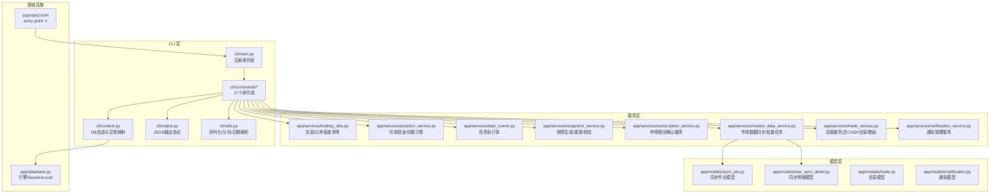

图表来源
- [backend/cli/main.py:1-54](file://backend/cli/main.py#L1-L54)
- [backend/cli/context.py:1-64](file://backend/cli/context.py#L1-L64)
- [backend/cli/output.py:1-64](file://backend/cli/output.py#L1-L64)
- [backend/cli/utils.py:1-67](file://backend/cli/utils.py#L1-L67)
- [backend/cli/commands/notifications.py:1-100](file://backend/cli/commands/notifications.py#L1-L100)
- [backend/app/services/notification_service.py:1-150](file://backend/app/services/notification_service.py#L1-L150)
- [backend/app/models/notification.py:1-50](file://backend/app/models/notification.py#L1-L50)

章节来源
- [backend/cli/main.py:1-54](file://backend/cli/main.py#L1-L54)
- [backend/pyproject.toml:1-16](file://backend/pyproject.toml#L1-L16)

## 核心组件
- 入口与命令注册：Typer 应用实例集中注册 17 个命令组，统一命名空间（ir）。
- 执行上下文：为每个命令创建 SessionLocal，自动 commit/rollback/close，并将常见异常映射为统一的错误码。
- 输出协议：所有命令输出标准 JSON，成功返回 {"ok": true, "data": ...}，失败返回 {"ok": false, "error": {...}}，并设置不同退出码。
- 公共辅助：模型序列化、分页、日期解析等通用能力。
- 服务层复用：交易日判断、可用现金/份额计算、任务执行体、快照生成/重算/校验、申购赎回确认服务、市场数据同步服务、通知服务等。

**更新**：新增了通知管理服务模块，提供完整的CRUD操作；增强了positions、snapshots、subscriptions等现有命令的功能；新增了同步作业管理服务模块和市场数据批量同步功能，提供了更完善的异步任务处理能力；**增强了交易服务模块，现在包含CASH交易的自动配对腿生成和转账组创建功能**。

章节来源
- [backend/cli/main.py:1-54](file://backend/cli/main.py#L1-L54)
- [backend/cli/context.py:1-64](file://backend/cli/context.py#L1-L64)
- [backend/cli/output.py:1-64](file://backend/cli/output.py#L1-L64)
- [backend/cli/utils.py:1-67](file://backend/cli/utils.py#L1-L67)
- [backend/app/services/trading_utils.py:1-69](file://backend/app/services/trading_utils.py#L1-L69)
- [backend/app/services/position_service.py:1-211](file://backend/app/services/position_service.py#L1-L211)
- [backend/app/services/task_runner.py:1-188](file://backend/app/services/task_runner.py#L1-L188)
- [backend/app/services/snapshot_service.py:1-200](file://backend/app/services/snapshot_service.py#L1-L200)
- [backend/app/services/subscription_service.py:1-178](file://backend/app/services/subscription_service.py#L1-L178)
- [backend/app/services/market_data_service.py:1-548](file://backend/app/services/market_data_service.py#L1-L548)

## 架构总览
CLI 通过 Typer 暴露命令，命令内部使用 cli_context 获取数据库会话，调用 services 层完成业务逻辑，最终通过 output 输出 JSON。新增的通知命令组提供完整的CRUD操作；同步作业管理支持后台异步执行和进度跟踪；**交易创建流程现在包含CASH交易的自动配对腿生成和转账组创建**。

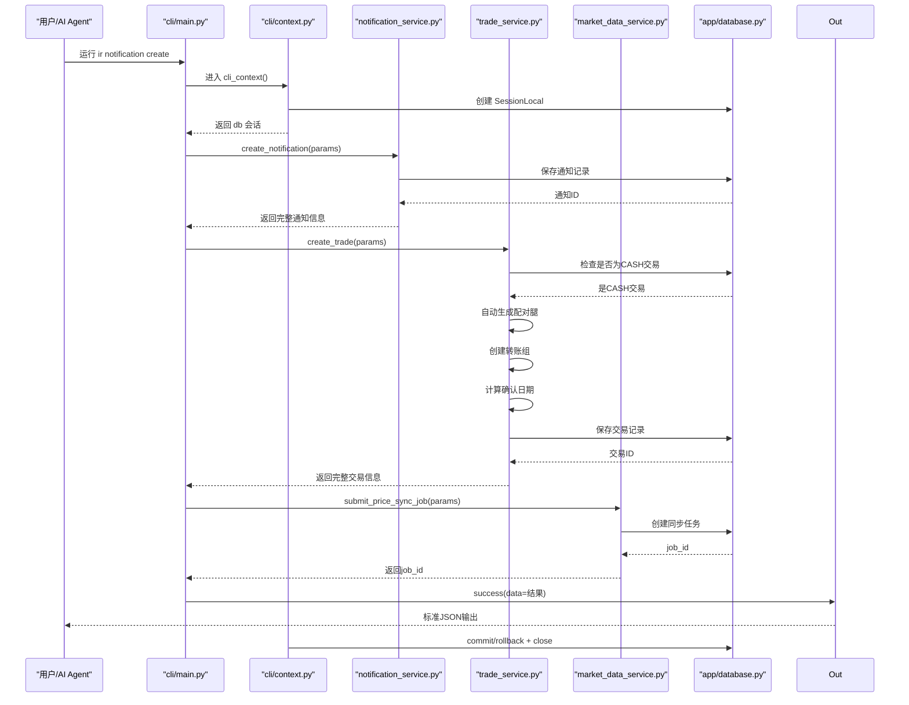

图表来源
- [backend/cli/main.py:1-54](file://backend/cli/main.py#L1-L54)
- [backend/cli/context.py:1-64](file://backend/cli/context.py#L1-L64)
- [backend/cli/commands/notifications.py:1-100](file://backend/cli/commands/notifications.py#L1-L100)
- [backend/cli/commands/market_data.py:84-113](file://backend/cli/commands/market_data.py#L84-L113)
- [backend/app/services/market_data_service.py:384-416](file://backend/app/services/market_data_service.py#L384-L416)
- [backend/app/database.py:1-43](file://backend/app/database.py#L1-L43)
- [backend/cli/output.py:1-64](file://backend/cli/output.py#L1-L64)

## 详细组件分析

### 认证命令（auth）
- create-admin：创建管理员账户，密码经哈希存储，返回脱敏后的用户信息。
- 关键流程：检查重复 → 创建记录 → flush/refresh → 成功输出。

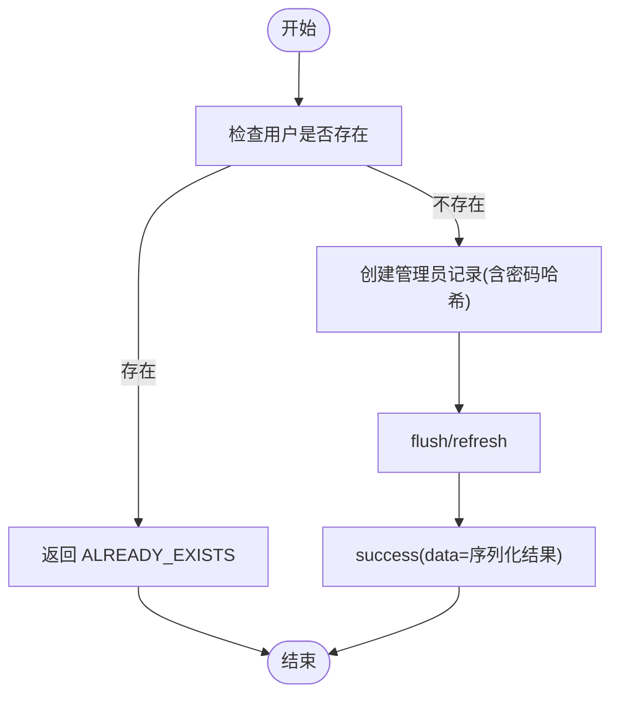

图表来源
- [backend/cli/commands/auth.py:1-39](file://backend/cli/commands/auth.py#L1-L39)

章节来源
- [backend/cli/commands/auth.py:1-39](file://backend/cli/commands/auth.py#L1-L39)

### 投资人管理（investor）
- list/create/get/update/delete：支持分页、角色更新、删除前校验持有份额。
- 删除保护：若最新持仓份额大于 0，拒绝删除。

章节来源
- [backend/cli/commands/investors.py:1-135](file://backend/cli/commands/investors.py#L1-L135)

### 组合管理（portfolio）
- list/create/get/update/close/reactivate/nav-history/returns/cash-flow
- close 校验：存在 pending 申赎或调仓则禁止关闭。
- returns：基于净值历史计算累计与年化收益率。
- cash-flow：汇总已确认的申购与赎回金额。

章节来源
- [backend/cli/commands/portfolios.py:1-241](file://backend/cli/commands/portfolios.py#L1-L241)

### 申购赎回（sub）**增强**
- list/create/get/confirm/cancel/unconfirm
- 创建校验：非交易日拒绝；组合状态需 active/draft；赎回需校验投资人可用份额。
- **更新**：确认逻辑现在通过专门的 subscription_service 模块处理，提供更完善的错误处理和日志记录。

**更新**：申购赎回确认流程现已集成新的服务层架构，包含以下改进：

```mermaid
sequenceDiagram
participant U as "用户"
participant Sub as "subscriptions.py"
participant SubSvc as "subscription_service.py"
param TU as "trading_utils.py"
param PS as "position_service.py"
param DB as "database.py"
U->>Sub : sub confirm <id>
Sub->>DB : 查询订阅记录
DB-->>Sub : 订阅详情
Sub->>SubSvc : confirm_single_subscription(db, sub)
SubSvc->>DB : 检查状态/计算确认日
SubSvc->>DB : 查询净值快照
DB-->>SubSvc : 净值数据
SubSvc->>SubSvc : 计算份额/金额
SubSvc->>DB : 更新订阅状态
SubSvc-->>Sub : 确认结果
Sub->>Out : success()
Out-->>U : 标准JSON输出
```

图表来源
- [backend/cli/commands/subscriptions.py:1-205](file://backend/cli/commands/subscriptions.py#L1-205)
- [backend/app/services/subscription_service.py:1-178](file://backend/app/services/subscription_service.py#L1-L178)
- [backend/app/services/trading_utils.py:1-69](file://backend/app/services/trading_utils.py#L1-L69)
- [backend/app/services/position_service.py:1-211](file://backend/app/services/position_service.py#L1-L211)

**新增错误处理**：
- `NavNotAvailableError`：申请日组合快照不存在时抛出
- `InvalidStatusError`：状态不符合要求时抛出
- 详细的错误信息和日志记录

章节来源
- [backend/cli/commands/subscriptions.py:1-205](file://backend/cli/commands/subscriptions.py#L1-205)
- [backend/app/services/subscription_service.py:1-178](file://backend/app/services/subscription_service.py#L1-L178)

### 调仓交易（trade）**增强**
- list/create/get/confirm/cancel/unconfirm
- 创建校验：非交易日拒绝；组合需 active；买入校验可用现金，卖出校验可用份额。
- 确认逻辑：根据产品类型与净值数据自动确定价格；QDII 特殊处理（T-1 净值）。
- **重大更新**：CASH交易现在自动处理配对腿生成、转账组创建和确认日期计算，确保与REST API行为完全一致。

**更新**：交易创建功能现已集成增强的CASH交易处理逻辑，包含以下重要改进：

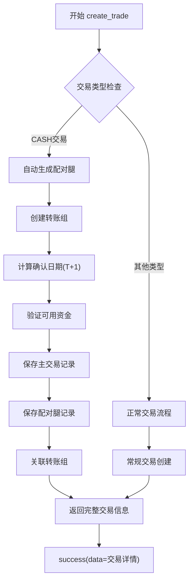

图表来源
- [backend/cli/commands/trades.py:1-264](file://backend/cli/commands/trades.py#L1-L264)

**新增业务规则**：
- 防止直接创建裸CASH交易，必须包含完整的配对腿结构
- 自动匹配对应的买入和卖出腿
- 智能计算确认日期，遵循T+1规则
- 强制创建转账组以确保资金流转完整性

章节来源
- [backend/cli/commands/trades.py:1-264](file://backend/cli/commands/trades.py#L1-L264)

### 持仓服务（position_service）**增强**
- calculate_available_cash：以最新快照现金为基础，叠加未入快照的已确认申赎与 pending/已确认调仓影响。
- calculate_available_shares：以最新快照份额为基础，扣减 pending/未入快照的已确认卖出份额。
- calculate_investor_available_shares：投资人维度可用份额计算，考虑 pending/未入快照的赎回。

**更新**：positions命令组的查询和管理功能得到增强，支持更多过滤参数和排序选项。

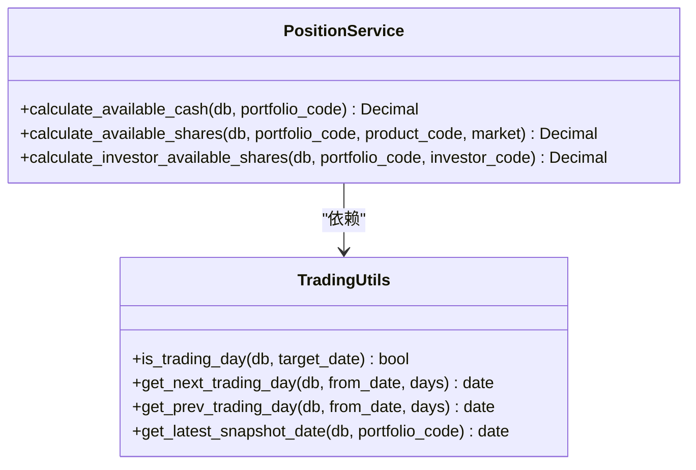

图表来源
- [backend/app/services/position_service.py:1-211](file://backend/app/services/position_service.py#L1-L211)
- [backend/app/services/trading_utils.py:1-69](file://backend/app/services/trading_utils.py#L1-L69)

章节来源
- [backend/app/services/position_service.py:1-211](file://backend/app/services/position_service.py#L1-L211)
- [backend/app/services/trading_utils.py:1-69](file://backend/app/services/trading_utils.py#L1-L69)

### 任务管理（task）
- list/run/enable/disable/logs
- run 调用 task_runner 中的执行体：nav_sync、calendar_sync、log_cleanup。

章节来源
- [backend/app/services/task_runner.py:1-188](file://backend/app/services/task_runner.py#L1-L188)

### 快照管理（snapshot）**增强**
- generate/recalculate/validate/status/delete
- 生成顺序：portfolio_position → portfolio_value_snapshot → investor_holding
- 校验依赖：交易日、无 pending 交易、净值完整性、份额变动事件状态。

**更新**：snapshots命令组的生成和验证流程得到优化，提供更好的错误处理和进度反馈。

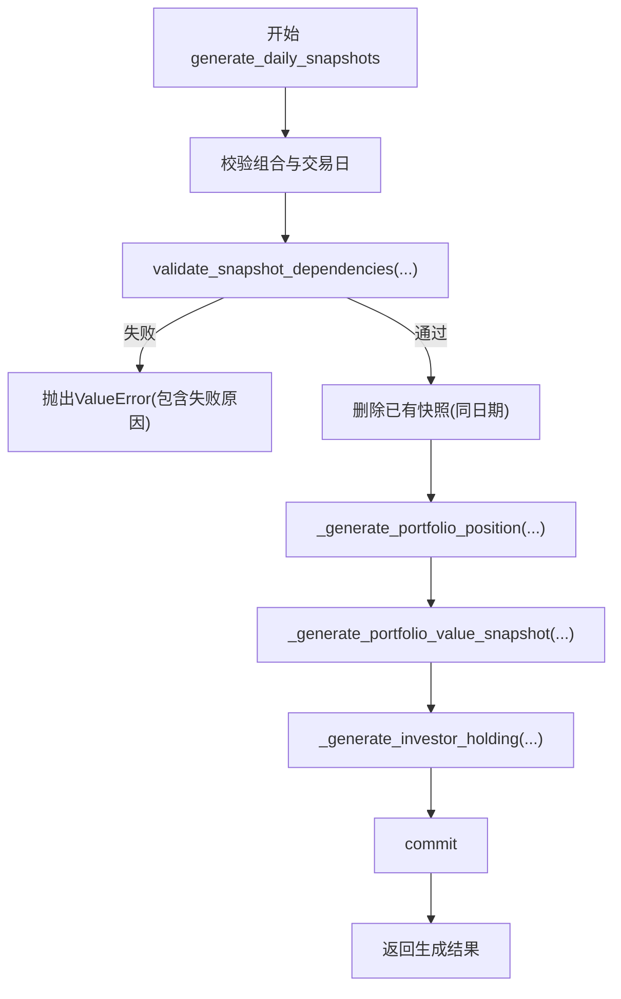

图表来源
- [backend/app/services/snapshot_service.py:1-200](file://backend/app/services/snapshot_service.py#L1-L200)

章节来源
- [backend/app/services/snapshot_service.py:1-200](file://backend/app/services/snapshot_service.py#L1-L200)

### 申购赎回服务（subscription_service）
**新增**：专门的申购赎回确认服务模块，提供核心的业务逻辑封装。

- `confirm_single_subscription`：确认单笔申购/赎回的核心逻辑
  - 确认日期由后端自动计算（T+1）
  - 净值自动确定（首次申购固定1.0000，否则取申请日组合快照净值）
  - 首次申购确认后自动激活组合状态
  - 完整的日志记录和错误处理

- `unconfirm_single_subscription`：取消确认单笔申购/赎回的核心逻辑
  - 将状态从 confirmed 回退至 pending
  - 清空确认相关字段
  - 支持自动 flush 选项

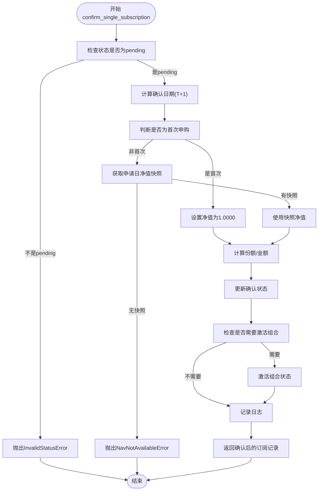

图表来源
- [backend/app/services/subscription_service.py:1-178](file://backend/app/services/subscription_service.py#L1-L178)

章节来源
- [backend/app/services/subscription_service.py:1-178](file://backend/app/services/subscription_service.py#L1-L178)

### 通知管理（notification）**全新**
**全新功能**：专门的通知管理命令组，提供完整的CRUD操作。

- `list`：查询通知列表，支持分页和过滤
- `create`：创建新通知，支持多种通知类型和优先级
- `get`：获取单个通知详情
- `update`：更新通知状态和内容
- `delete`：删除指定通知

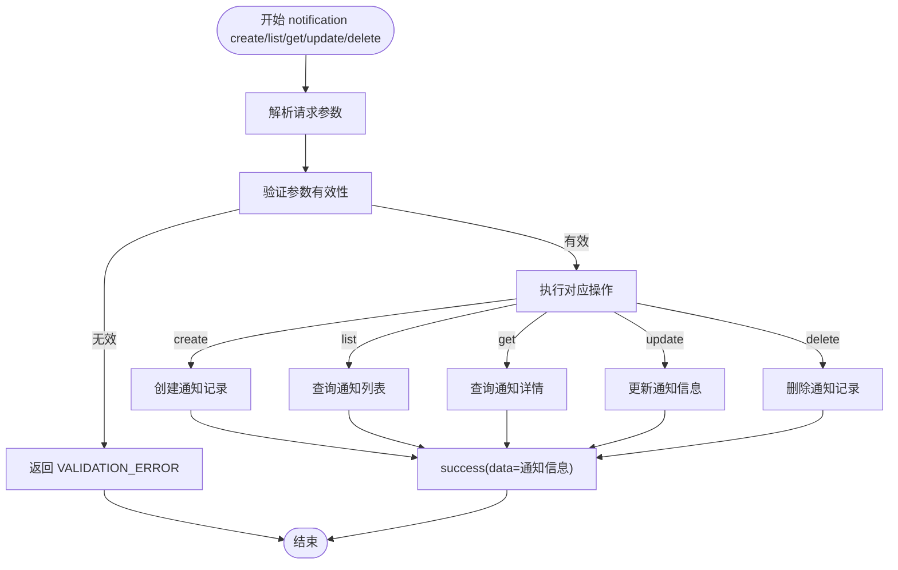

图表来源
- [backend/cli/commands/notifications.py:1-100](file://backend/cli/commands/notifications.py#L1-L100)
- [backend/app/models/notification.py:1-50](file://backend/app/models/notification.py#L1-L50)

章节来源
- [backend/cli/commands/notifications.py:1-100](file://backend/cli/commands/notifications.py#L1-L100)
- [backend/app/models/notification.py:1-50](file://backend/app/models/notification.py#L1-L50)

### 同步作业管理（sync-job）**新增**
**全新功能**：专门的价格同步任务管理命令组，支持后台异步执行和进度跟踪。

- `status`：查询同步任务状态与进度
  - 显示任务基本信息、执行状态、完成进度
  - 支持任务ID查询

- `details`：查询同步任务逐产品明细
  - 显示每个产品的同步结果
  - 包含成功/失败计数、错误信息等

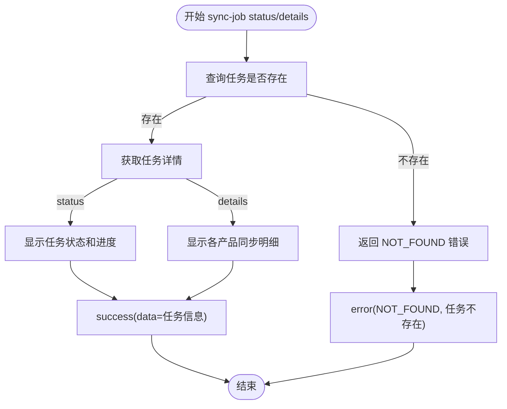

图表来源
- [backend/cli/commands/sync_jobs.py:1-38](file://backend/cli/commands/sync_jobs.py#L1-L38)

章节来源
- [backend/cli/commands/sync_jobs.py:1-38](file://backend/cli/commands/sync_jobs.py#L1-L38)

### 市场数据管理（market）**增强**
- price/sync/sync-history/sync-nav：基础市场数据操作
- **新增** `sync-all`：批量价格同步后台任务
  - 支持全量或按产品范围同步
  - 立即返回 job_id，后台异步执行
  - 支持历史回填和增量同步模式
  - 并发执行，提高同步效率

**更新**：市场数据同步现已支持批量异步处理，大幅提升了大规模数据同步的效率。

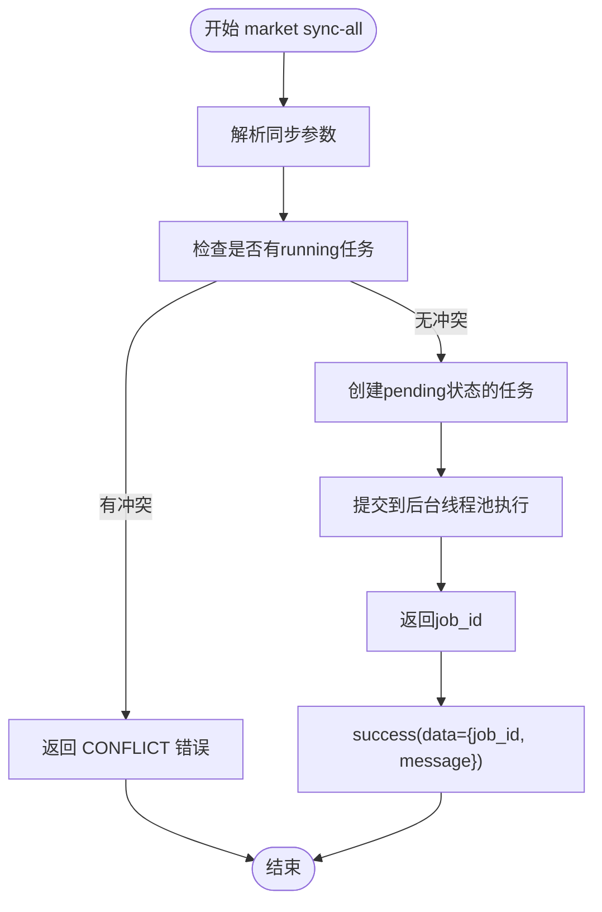

图表来源
- [backend/cli/commands/market_data.py:84-113](file://backend/cli/commands/market_data.py#L84-L113)
- [backend/app/services/market_data_service.py:384-416](file://backend/app/services/market_data_service.py#L384-L416)

章节来源
- [backend/cli/commands/market_data.py:1-113](file://backend/cli/commands/market_data.py#L1-L113)
- [backend/app/services/market_data_service.py:384-416](file://backend/app/services/market_data_service.py#L384-L416)

### 产品管理（product）**增强**
- list/create/get/update/delete：产品CRUD操作
- **增强** list 命令：新增更多过滤参数支持
  - 支持按产品类型过滤（ETF/OEF/LOF/CASH）
  - 支持分页查询和全部数据导出
  - 增强的查询性能和灵活性

**更新**：产品列表命令现在支持更丰富的过滤选项，满足复杂的数据筛选需求。

章节来源
- [backend/cli/commands/products.py:1-148](file://backend/cli/commands/products.py#L1-L148)

### 份额变动事件（share-event）**改进**
- list/create/get/update/delete/confirm/cancel：份额变动事件管理
- **改进**：增强的参数支持，提供更灵活的配置选项
  - 支持更多可选参数：platform_code、entitlement_shares、shares_before/after/change等
  - 支持多种事件类型：cash_dividend/reinvest_dividend/share_split/share_merge/bonus_share/forced_adjustment
  - 改进的参数验证和数据处理

**更新**：分享事件命令现在支持更丰富的参数配置，满足复杂的权益处理需求。

章节来源
- [backend/cli/commands/share_events.py:1-210](file://backend/cli/commands/share_events.py#L1-L210)

### 市场数据服务（market_data_service）**增强**
**新增**：批量同步任务和异步执行框架。

- `submit_price_sync_job`：提交价格同步后台任务
  - 单 running 锁机制，防止并发冲突
  - 立即返回 job_id，后台异步执行
  - 支持全量和增量同步模式

- `_run_price_sync_job_impl`：后台任务执行体
  - 线程池并发执行，提高同步效率
  - 逐产品同步，记录详细执行结果
  - 自动统计成功/失败计数
  - 异常处理和错误恢复

- `recover_orphan_jobs`：启动时恢复孤立任务
  - 扫描 status='running' 的任务
  - 标记为 interrupted 状态
  - 添加错误信息说明

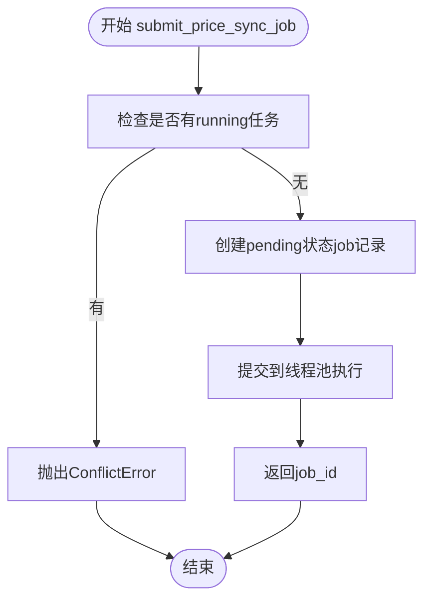

图表来源
- [backend/app/services/market_data_service.py:384-416](file://backend/app/services/market_data_service.py#L384-L416)

章节来源
- [backend/app/services/market_data_service.py:384-416](file://backend/app/services/market_data_service.py#L384-L416)

## 依赖关系分析
- CLI 层对 services 层为单向依赖，避免反向耦合。
- context 层封装数据库会话生命周期与异常映射，降低命令层的样板代码。
- output 层保证所有命令输出一致的结构化 JSON，便于机器解析。
- pyproject.toml 定义 entry point，使安装后可直接使用 ir 命令。
- **更新**：新增的通知管理服务模块被通知命令组使用，提供完整的CRUD操作；新增的同步作业管理服务模块被多个命令层复用，支持异步任务处理；**交易服务模块现在包含CASH交易的自动配对逻辑**。

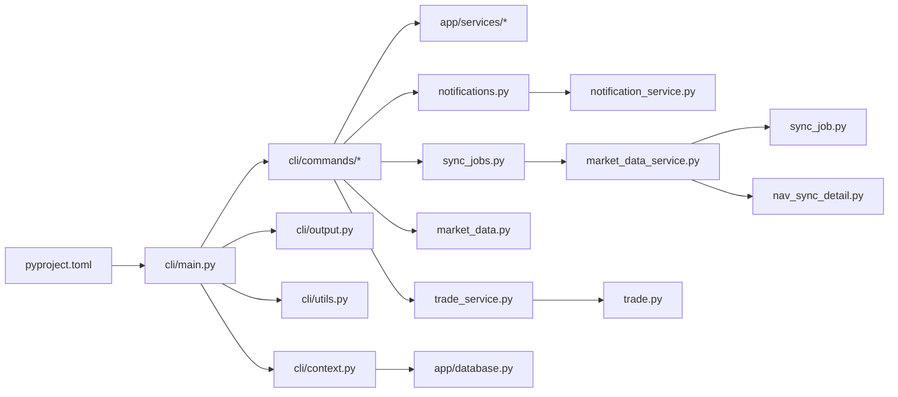

图表来源
- [backend/cli/main.py:1-54](file://backend/cli/main.py#L1-L54)
- [backend/cli/context.py:1-64](file://backend/cli/context.py#L1-L64)
- [backend/cli/output.py:1-64](file://backend/cli/output.py#L1-L64)
- [backend/cli/utils.py:1-67](file://backend/cli/utils.py#L1-L67)
- [backend/app/database.py:1-43](file://backend/app/database.py#L1-L43)
- [backend/pyproject.toml:1-16](file://backend/pyproject.toml#L1-L16)
- [backend/cli/commands/notifications.py:1-100](file://backend/cli/commands/notifications.py#L1-L100)
- [backend/cli/commands/sync_jobs.py:1-38](file://backend/cli/commands/sync_jobs.py#L1-L38)
- [backend/cli/commands/market_data.py:1-113](file://backend/cli/commands/market_data.py#L1-L113)
- [backend/app/services/market_data_service.py:1-548](file://backend/app/services/market_data_service.py#L1-L548)
- [backend/app/models/sync_job.py:1-23](file://backend/app/models/sync_job.py#L1-L23)
- [backend/app/models/nav_sync_detail.py:1-20](file://backend/app/models/nav_sync_detail.py#L1-L20)

章节来源
- [backend/cli/main.py:1-54](file://backend/cli/main.py#L1-L54)
- [backend/pyproject.toml:1-16](file://backend/pyproject.toml#L1-L16)

## 性能与扩展性
- 数据库连接池：engine 配置 pool_size/max_overflow/pool_pre_ping/pool_recycle，提升并发稳定性。
- MySQL 连接池：QueuePool 配置 pool_size/max_overflow/pool_pre_ping/pool_recycle，提升并发稳定性。
- CLI 模式静默：CLI_MODE=1 时禁用 SQL echo，避免干扰 JSON 输出。
- 可扩展点：新增命令只需在 main.py 注册对应命令组，并在 commands 下新建模块即可。
- **更新**：新增的线程池并发执行机制，支持多产品并行同步，大幅提升批量数据处理效率。
- **更新**：服务层模块化设计，新业务逻辑可轻松添加到独立的 service 模块中。
- **更新**：CASH交易处理优化，自动配对腿生成减少手动操作，提高交易创建效率。
- **更新**：通知管理模块提供高效的CRUD操作，支持分页和过滤查询。

章节来源
- [backend/app/database.py:1-43](file://backend/app/database.py#L1-L43)
- [backend/cli/main.py:1-54](file://backend/cli/main.py#L1-L54)
- [backend/app/services/market_data_service.py:372-381](file://backend/app/services/market_data_service.py#L372-L381)

## 故障排查指南
- 常见错误码
  - VALIDATION_ERROR：参数校验失败（由 context 捕获 ValueError 映射）。
  - ALREADY_EXISTS：唯一约束冲突（由 context 捕获 IntegrityError 映射）。
  - NOT_FOUND：资源不存在。
  - INVALID_STATUS：状态不合法（如仅 pending 可取消）。
  - NON_TRADING_DAY：非交易日提交。
  - INSUFFICIENT_CASH / INSUFFICIENT_SHARES：可用资金/份额不足。
  - MISSING_NAV：净值尚未同步或未提供。
  - INVESTOR_HAS_SHARES：投资人仍有份额，禁止删除。
  - **新增**：NAV_NOT_AVAILABLE：申请日净值快照不存在。
  - **新增**：PORTFOLIO_NOT_ACTIVE：组合未激活。
  - **新增**：INVALID_AMOUNT / INVALID_SHARES：金额或份额无效。
  - **新增**：SNAPSHOT_DEPENDENCY：快照依赖冲突。
  - **新增**：CONFLICT：同步任务冲突（已有任务在运行中）。
  - **新增**：INVALID_CASH_TRADE：无效的CASH交易结构（缺少配对腿或转账组）。
  - **新增**：NOTIFICATION_NOT_FOUND：通知记录不存在。
  - **新增**：INVALID_NOTIFICATION_TYPE：不支持的通知类型。

**更新**：增强的错误处理包括：
- 自定义异常类型：`NavNotAvailableError`、`InvalidStatusError`、`ConflictError`、`InvalidCashTradeError`、`NotificationNotFoundError`
- 详细的错误消息和上下文信息
- 完整的日志记录用于调试和问题追踪
- 异步任务的异常处理和恢复机制
- **CASH交易验证错误**：当尝试创建裸CASH交易或缺少必要配对腿时抛出
- **通知管理错误**：当访问不存在的通知记录或使用无效的通知类型时抛出

- 调试建议
  - 查看 stderr 堆栈：context 在非 SystemExit 异常时会打印完整堆栈到 stderr。
  - 使用 jq 解析 JSON 输出，快速定位 data/error 字段。
  - 对于 QDII 净值缺失，先执行市场数据同步再重试确认。
  - **新增**：使用 `ir sync-job details <job_id>` 查看批量同步的详细执行结果。
  - **新增**：检查后台线程池的执行状态和错误日志。
  - **新增**：CASH交易创建失败时，检查是否包含了完整的配对腿结构和转账组信息。
  - **新增**：通知管理操作失败时，检查通知类型和参数格式是否正确。

章节来源
- [backend/cli/context.py:1-64](file://backend/cli/context.py#L1-L64)
- [backend/cli/output.py:1-64](file://backend/cli/output.py#L1-L64)
- [backend/cli/commands/subscriptions.py:1-205](file://backend/cli/commands/subscriptions.py#L1-205)
- [backend/cli/commands/trades.py:1-264](file://backend/cli/commands/trades.py#L1-L264)
- [backend/cli/commands/investors.py:1-135](file://backend/cli/commands/investors.py#L1-L135)
- [backend/cli/commands/sync_jobs.py:1-38](file://backend/cli/commands/sync_jobs.py#L1-L38)
- [backend/cli/commands/market_data.py:1-113](file://backend/cli/commands/market_data.py#L1-L113)
- [backend/cli/commands/notifications.py:1-100](file://backend/cli/commands/notifications.py#L1-L100)
- [backend/app/services/subscription_service.py:1-178](file://backend/app/services/subscription_service.py#L1-L178)
- [backend/app/services/market_data_service.py:367-369](file://backend/app/services/market_data_service.py#L367-L369)

## 结论
InvestRing Admin CLI 将复杂业务逻辑下沉至服务层，并通过 Typer 暴露稳定、可解析的 JSON 接口，适合 AI Agent 自动化编排。其分层清晰、错误处理规范、输出格式统一，具备良好的可维护性与扩展性。

**更新总结**：最新的增强包括全新的通知命令组支持，提供完整的CRUD操作；增强了positions、snapshots、subscriptions等现有命令的功能；新增了同步作业管理功能、增强的市场数据批量同步能力、改进的分享事件参数支持、完善的产品列表过滤功能、**显著增强的交易创建功能（特别是CASH交易的自动配对腿生成和转账组创建）**、完善的异步任务处理机制，以及更好的错误处理和日志记录功能，进一步提升了系统的稳定性和可维护性。

## 附录：命令清单与用法要点
- auth
  - create-admin：创建管理员，需提供 code/name/password。
- investor
  - list/create/get/update/delete：支持分页与角色更新；删除前校验持有份额。
- portfolio
  - list/create/get/update/close/reactivate/nav-history/returns/cash-flow：close 前校验无 pending 交易。
- sub
  - list/create/get/confirm/cancel/unconfirm：创建校验交易日与可用份额；确认时首次申购净值固定 1.0000。
- trade
  - list/create/get/confirm/cancel/unconfirm：创建校验可用现金/份额；确认时自动取净值，QDII 特殊处理。
  - **重大更新**：CASH交易现在自动处理配对腿生成、转账组创建和确认日期计算，无需手动指定这些字段。
- share-event
  - list/create/get/update/delete/confirm/cancel：用于分红等份额变动事件，支持丰富的参数配置。
- market
  - price/sync/sync-history/sync-nav：查询与同步价格、净值。
  - **新增** sync-all：批量价格同步，支持后台异步执行和进度跟踪。
- product
  - list/create/get/update/delete：产品管理，list 支持按类型过滤和分页。
- platform/system/log/task/snapshot/cash-transfer
  - 标准 CRUD 与系统运维能力；task 调用 task_runner 执行体；snapshot 提供生成/重算/校验。
- **新增** sync-job
  - status：查询同步任务状态与进度。
  - details：查询同步任务逐产品明细。
- **全新** notification
  - list：查询通知列表，支持分页和过滤。
  - create：创建新通知，支持多种通知类型和优先级。
  - get：获取单个通知详情。
  - update：更新通知状态和内容。
  - delete：删除指定通知。

**更新**：交易创建命令现在对CASH交易有更智能的处理：
- 自动检测交易类型为CASH
- 智能生成配对腿（买入和卖出）
- 自动创建转账组确保资金流转
- 智能计算确认日期（T+1规则）
- 强制执行与REST API相同的业务规则

**新增**：通知管理命令提供完整的CRUD操作：
- 支持多种通知类型：系统通知、业务通知、告警通知等
- 支持优先级设置和定时发送
- 提供分页查询和条件过滤
- 支持通知状态的实时更新

章节来源
- [backend/cli/commands/auth.py:1-39](file://backend/cli/commands/auth.py#L1-L39)
- [backend/cli/commands/investors.py:1-135](file://backend/cli/commands/investors.py#L1-L135)
- [backend/cli/commands/portfolios.py:1-241](file://backend/cli/commands/portfolios.py#L1-L241)
- [backend/cli/commands/subscriptions.py:1-205](file://backend/cli/commands/subscriptions.py#L1-205)
- [backend/cli/commands/trades.py:1-264](file://backend/cli/commands/trades.py#L1-L264)
- [backend/cli/commands/share_events.py:1-210](file://backend/cli/commands/share_events.py#L1-L210)
- [backend/cli/commands/market_data.py:1-113](file://backend/cli/commands/market_data.py#L1-L113)
- [backend/cli/commands/products.py:1-148](file://backend/cli/commands/products.py#L1-L148)
- [backend/cli/commands/sync_jobs.py:1-38](file://backend/cli/commands/sync_jobs.py#L1-L38)
- [backend/cli/commands/notifications.py:1-100](file://backend/cli/commands/notifications.py#L1-L100)
- [backend/app/services/task_runner.py:1-188](file://backend/app/services/task_runner.py#L1-L188)
- [backend/app/services/snapshot_service.py:1-200](file://backend/app/services/snapshot_service.py#L1-L200)
- [backend/app/services/subscription_service.py:1-178](file://backend/app/services/subscription_service.py#L1-L178)