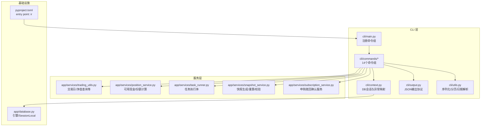
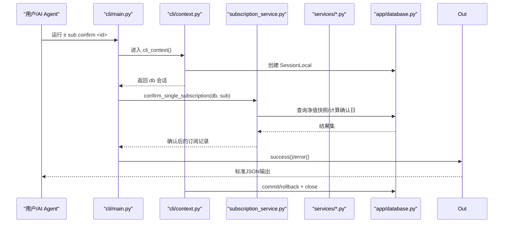
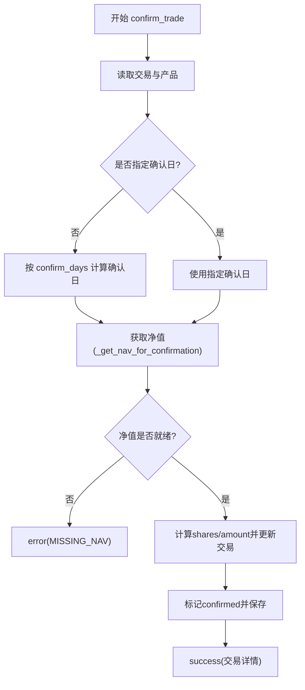
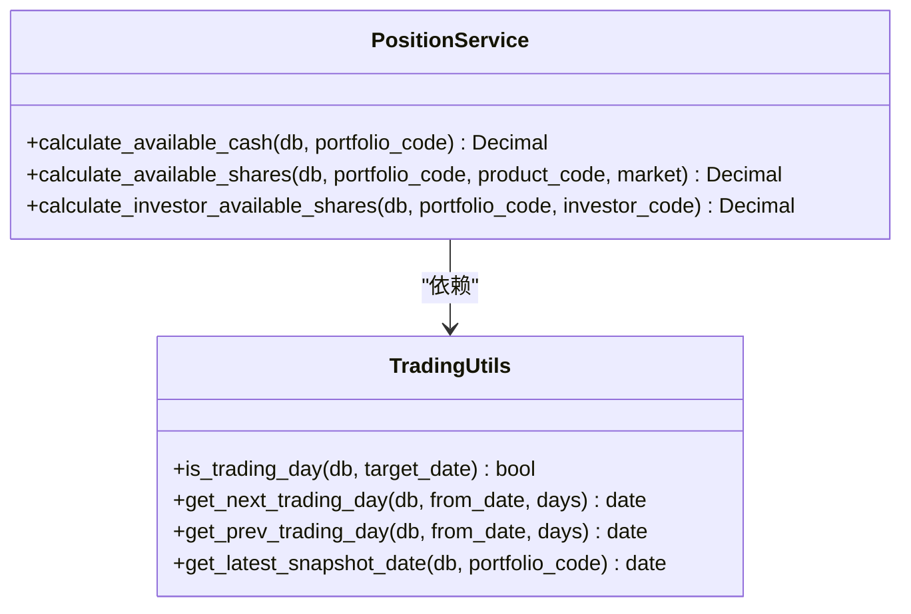
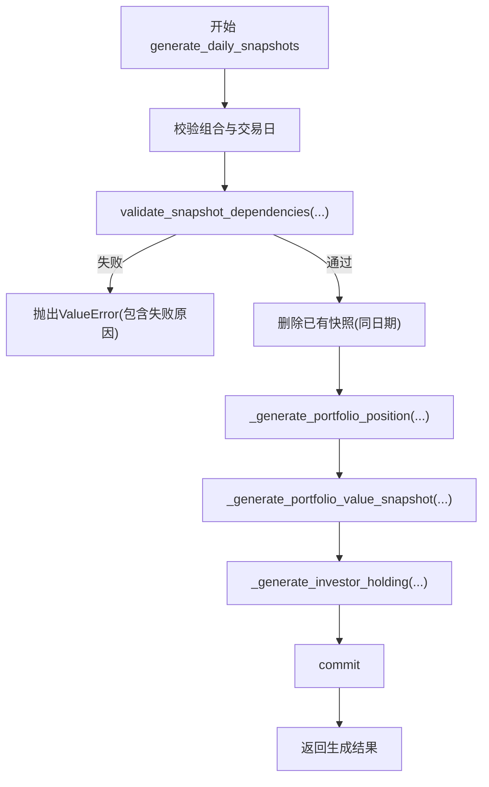
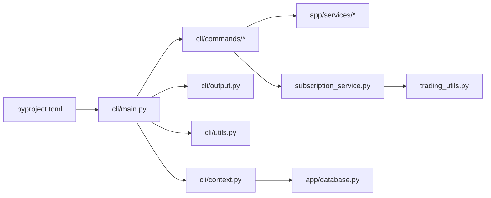

# InvestRing Admin CLI 工具

<cite>
**本文引用的文件**   
- [backend/cli/main.py](file://backend/cli/main.py)
- [backend/cli/context.py](file://backend/cli/context.py)
- [backend/cli/output.py](file://backend/cli/output.py)
- [backend/cli/utils.py](file://backend/cli/utils.py)
- [backend/pyproject.toml](file://backend/pyproject.toml)
- [backend/cli/commands/auth.py](file://backend/cli/commands/auth.py)
- [backend/cli/commands/investors.py](file://backend/cli/commands/investors.py)
- [backend/cli/commands/portfolios.py](file://backend/cli/commands/portfolios.py)
- [backend/cli/commands/subscriptions.py](file://backend/cli/commands/subscriptions.py)
- [backend/cli/commands/trades.py](file://backend/cli/commands/trades.py)
- [backend/app/services/trading_utils.py](file://backend/app/services/trading_utils.py)
- [backend/app/services/position_service.py](file://backend/app/services/position_service.py)
- [backend/app/services/task_runner.py](file://backend/app/services/task_runner.py)
- [backend/app/services/snapshot_service.py](file://backend/app/services/snapshot_service.py)
- [backend/app/services/subscription_service.py](file://backend/app/services/subscription_service.py)
- [backend/app/database.py](file://backend/app/database.py)
</cite>

## 更新摘要
**变更内容**   
- 增强了订阅处理逻辑，引入专门的 subscription_service 模块
- 改进了错误处理机制，新增自定义异常类型和更详细的错误信息
- 集成了新的服务层架构，将业务逻辑从命令层提取到独立服务模块
- 添加了全面的日志记录功能，贯穿整个申购赎回生命周期
- 优化了确认和取消确认流程的状态管理

## 目录
1. [简介](#简介)
2. [项目结构](#项目结构)
3. [核心组件](#核心组件)
4. [架构总览](#架构总览)
5. [详细组件分析](#详细组件分析)
6. [依赖关系分析](#依赖关系分析)
7. [性能与扩展性](#性能与扩展性)
8. [故障排查指南](#故障排查指南)
9. [结论](#结论)
10. [附录：命令清单与用法要点](#附录命令清单与用法要点)

## 简介
InvestRing Admin CLI 是一个面向 AI Agent 的原生命令行工具，基于 Typer 构建，直接导入后端服务层操作数据库，输出结构化 JSON。它覆盖组合管理、申购赎回、调仓交易、份额变动事件、快照生成、市场数据同步、任务管理等核心功能，提供约 14 个命令组、约 70 条命令，便于自动化编排与批处理。

**最新更新**：增强了订阅处理逻辑，引入了专门的服务层架构，改进了错误处理和日志记录功能。

## 项目结构
CLI 位于 backend/cli 目录，采用"入口 + 上下文 + 输出协议 + 公共辅助 + 命令组"的分层组织方式；业务逻辑复用自 app/services 层，避免重复实现。



图表来源
- [backend/cli/main.py:1-50](file://backend/cli/main.py#L1-L50)
- [backend/cli/context.py:1-64](file://backend/cli/context.py#L1-L64)
- [backend/cli/output.py:1-64](file://backend/cli/output.py#L1-L64)
- [backend/cli/utils.py:1-67](file://backend/cli/utils.py#L1-L67)
- [backend/app/services/trading_utils.py:1-69](file://backend/app/services/trading_utils.py#L1-L69)
- [backend/app/services/position_service.py:1-211](file://backend/app/services/position_service.py#L1-L211)
- [backend/app/services/task_runner.py:1-188](file://backend/app/services/task_runner.py#L1-L188)
- [backend/app/services/snapshot_service.py:1-200](file://backend/app/services/snapshot_service.py#L1-L200)
- [backend/app/services/subscription_service.py:1-178](file://backend/app/services/subscription_service.py#L1-L178)
- [backend/app/database.py:1-43](file://backend/app/database.py#L1-L43)
- [backend/pyproject.toml:1-16](file://backend/pyproject.toml#L1-L16)

章节来源
- [backend/cli/main.py:1-50](file://backend/cli/main.py#L1-L50)
- [backend/pyproject.toml:1-16](file://backend/pyproject.toml#L1-L16)

## 核心组件
- 入口与命令注册：Typer 应用实例集中注册 14 个命令组，统一命名空间（ir）。
- 执行上下文：为每个命令创建 SessionLocal，自动 commit/rollback/close，并将常见异常映射为统一的错误码。
- 输出协议：所有命令输出标准 JSON，成功返回 {"ok": true, "data": ...}，失败返回 {"ok": false, "error": {...}}，并设置不同退出码。
- 公共辅助：模型序列化、分页、日期解析等通用能力。
- 服务层复用：交易日判断、可用现金/份额计算、任务执行体、快照生成/重算/校验、申购赎回确认服务等。

**更新**：新增了专门的申购赎回服务模块，提供了更完善的业务逻辑封装。

章节来源
- [backend/cli/main.py:1-50](file://backend/cli/main.py#L1-L50)
- [backend/cli/context.py:1-64](file://backend/cli/context.py#L1-L64)
- [backend/cli/output.py:1-64](file://backend/cli/output.py#L1-L64)
- [backend/cli/utils.py:1-67](file://backend/cli/utils.py#L1-L67)
- [backend/app/services/trading_utils.py:1-69](file://backend/app/services/trading_utils.py#L1-L69)
- [backend/app/services/position_service.py:1-211](file://backend/app/services/position_service.py#L1-L211)
- [backend/app/services/task_runner.py:1-188](file://backend/app/services/task_runner.py#L1-L188)
- [backend/app/services/snapshot_service.py:1-200](file://backend/app/services/snapshot_service.py#L1-L200)
- [backend/app/services/subscription_service.py:1-178](file://backend/app/services/subscription_service.py#L1-L178)

## 架构总览
CLI 通过 Typer 暴露命令，命令内部使用 cli_context 获取数据库会话，调用 services 层完成业务逻辑，最终通过 output 输出 JSON。



图表来源
- [backend/cli/main.py:1-50](file://backend/cli/main.py#L1-L50)
- [backend/cli/context.py:1-64](file://backend/cli/context.py#L1-L64)
- [backend/app/services/subscription_service.py:1-178](file://backend/app/services/subscription_service.py#L1-L178)
- [backend/app/database.py:1-43](file://backend/app/database.py#L1-L43)
- [backend/cli/output.py:1-64](file://backend/cli/output.py#L1-L64)

## 详细组件分析

### 认证命令（auth）
- create-admin：创建管理员账户，密码经哈希存储，返回脱敏后的用户信息。
- 关键流程：检查重复 → 创建记录 → flush/refresh → 成功输出。


图表来源
- [backend/cli/commands/auth.py:1-39](file://backend/cli/commands/auth.py#L1-L39)

章节来源
- [backend/cli/commands/auth.py:1-39](file://backend/cli/commands/auth.py#L1-L39)

### 投资人管理（investor）
- list/create/get/update/delete：支持分页、角色更新、删除前校验持有份额。
- 删除保护：若最新持仓份额大于 0，拒绝删除。

章节来源
- [backend/cli/commands/investors.py:1-135](file://backend/cli/commands/investors.py#L1-L135)

### 组合管理（portfolio）
- list/create/get/update/close/reactivate/nav-history/returns/cash-flow
- close 校验：存在 pending 申赎或调仓则禁止关闭。
- returns：基于净值历史计算累计与年化收益率。
- cash-flow：汇总已确认的申购与赎回金额。

章节来源
- [backend/cli/commands/portfolios.py:1-241](file://backend/cli/commands/portfolios.py#L1-L241)

### 申购赎回（sub）
- list/create/get/confirm/cancel/unconfirm
- 创建校验：非交易日拒绝；组合状态需 active/draft；赎回需校验投资人可用份额。
- **更新**：确认逻辑现在通过专门的 subscription_service 模块处理，提供更完善的错误处理和日志记录。

**更新**：申购赎回确认流程现已集成新的服务层架构，包含以下改进：

```mermaid
sequenceDiagram
participant U as "用户"
participant Sub as "subscriptions.py"
participant SubSvc as "subscription_service.py"
param TU as "trading_utils.py"
param PS as "position_service.py"
param DB as "database.py"
U->>Sub : sub confirm <id>
Sub->>DB : 查询订阅记录
DB-->>Sub : 订阅详情
Sub->>SubSvc : confirm_single_subscription(db, sub)
SubSvc->>DB : 检查状态/计算确认日
SubSvc->>DB : 查询净值快照
DB-->>SubSvc : 净值数据
SubSvc->>SubSvc : 计算份额/金额
SubSvc->>DB : 更新订阅状态
SubSvc-->>Sub : 确认结果
Sub->>Out : success()
Out-->>U : 标准JSON输出
```

图表来源
- [backend/cli/commands/subscriptions.py:1-205](file://backend/cli/commands/subscriptions.py#L1-205)
- [backend/app/services/subscription_service.py:1-178](file://backend/app/services/subscription_service.py#L1-L178)
- [backend/app/services/trading_utils.py:1-69](file://backend/app/services/trading_utils.py#L1-L69)
- [backend/app/services/position_service.py:1-211](file://backend/app/services/position_service.py#L1-L211)

**新增错误处理**：
- `NavNotAvailableError`：申请日组合快照不存在时抛出
- `InvalidStatusError`：状态不符合要求时抛出
- 详细的错误信息和日志记录

章节来源
- [backend/cli/commands/subscriptions.py:1-205](file://backend/cli/commands/subscriptions.py#L1-205)
- [backend/app/services/subscription_service.py:1-178](file://backend/app/services/subscription_service.py#L1-L178)

### 调仓交易（trade）
- list/create/get/confirm/cancel/unconfirm
- 创建校验：非交易日拒绝；组合需 active；买入校验可用现金，卖出校验可用份额。
- 确认逻辑：根据产品类型与净值数据自动确定价格；QDII 特殊处理（T-1 净值）。



图表来源
- [backend/cli/commands/trades.py:1-264](file://backend/cli/commands/trades.py#L1-L264)

章节来源
- [backend/cli/commands/trades.py:1-264](file://backend/cli/commands/trades.py#L1-L264)

### 持仓服务（position_service）
- calculate_available_cash：以最新快照现金为基础，叠加未入快照的已确认申赎与 pending/已确认调仓影响。
- calculate_available_shares：以最新快照份额为基础，扣减 pending/未入快照的已确认卖出份额。
- calculate_investor_available_shares：投资人维度可用份额计算，考虑 pending/未入快照的赎回。



图表来源
- [backend/app/services/position_service.py:1-211](file://backend/app/services/position_service.py#L1-L211)
- [backend/app/services/trading_utils.py:1-69](file://backend/app/services/trading_utils.py#L1-L69)

章节来源
- [backend/app/services/position_service.py:1-211](file://backend/app/services/position_service.py#L1-L211)
- [backend/app/services/trading_utils.py:1-69](file://backend/app/services/trading_utils.py#L1-L69)

### 任务管理（task）
- list/run/enable/disable/logs
- run 调用 task_runner 中的执行体：nav_sync、calendar_sync、log_cleanup。

章节来源
- [backend/app/services/task_runner.py:1-188](file://backend/app/services/task_runner.py#L1-L188)

### 快照管理（snapshot）
- generate/recalculate/validate/status/delete
- 生成顺序：portfolio_position → portfolio_value_snapshot → investor_holding
- 校验依赖：交易日、无 pending 交易、净值完整性、份额变动事件状态。



图表来源
- [backend/app/services/snapshot_service.py:1-200](file://backend/app/services/snapshot_service.py#L1-L200)

章节来源
- [backend/app/services/snapshot_service.py:1-200](file://backend/app/services/snapshot_service.py#L1-L200)

### 申购赎回服务（subscription_service）
**新增**：专门的申购赎回确认服务模块，提供核心的业务逻辑封装。

- `confirm_single_subscription`：确认单笔申购/赎回的核心逻辑
  - 确认日期由后端自动计算（T+1）
  - 净值自动确定（首次申购固定1.0000，否则取申请日组合快照净值）
  - 首次申购确认后自动激活组合状态
  - 完整的日志记录和错误处理

- `unconfirm_single_subscription`：取消确认单笔申购/赎回的核心逻辑
  - 将状态从 confirmed 回退至 pending
  - 清空确认相关字段
  - 支持自动 flush 选项


图表来源
- [backend/app/services/subscription_service.py:1-178](file://backend/app/services/subscription_service.py#L1-L178)

章节来源
- [backend/app/services/subscription_service.py:1-178](file://backend/app/services/subscription_service.py#L1-L178)

## 依赖关系分析
- CLI 层对 services 层为单向依赖，避免反向耦合。
- context 层封装数据库会话生命周期与异常映射，降低命令层的样板代码。
- output 层保证所有命令输出一致的结构化 JSON，便于机器解析。
- pyproject.toml 定义 entry point，使安装后可直接使用 ir 命令。
- **更新**：subscription_service 作为独立的服务模块，被多个命令层复用。



图表来源
- [backend/cli/main.py:1-50](file://backend/cli/main.py#L1-L50)
- [backend/cli/context.py:1-64](file://backend/cli/context.py#L1-L64)
- [backend/cli/output.py:1-64](file://backend/cli/output.py#L1-L64)
- [backend/cli/utils.py:1-67](file://backend/cli/utils.py#L1-L67)
- [backend/app/database.py:1-43](file://backend/app/database.py#L1-L43)
- [backend/pyproject.toml:1-16](file://backend/pyproject.toml#L1-L16)
- [backend/app/services/subscription_service.py:1-178](file://backend/app/services/subscription_service.py#L1-L178)

章节来源
- [backend/cli/main.py:1-50](file://backend/cli/main.py#L1-L50)
- [backend/pyproject.toml:1-16](file://backend/pyproject.toml#L1-L16)

## 性能与扩展性
- 数据库连接池：engine 配置 pool_size/max_overflow/pool_pre_ping/pool_recycle，提升并发稳定性。
- MySQL 连接池：QueuePool 配置 pool_size/max_overflow/pool_pre_ping/pool_recycle，提升并发稳定性。
- CLI 模式静默：CLI_MODE=1 时禁用 SQL echo，避免干扰 JSON 输出。
- 可扩展点：新增命令只需在 main.py 注册对应命令组，并在 commands 下新建模块即可。
- **更新**：服务层模块化设计，新业务逻辑可轻松添加到独立的 service 模块中。

章节来源
- [backend/app/database.py:1-43](file://backend/app/database.py#L1-L43)
- [backend/cli/main.py:1-50](file://backend/cli/main.py#L1-L50)

## 故障排查指南
- 常见错误码
  - VALIDATION_ERROR：参数校验失败（由 context 捕获 ValueError 映射）。
  - ALREADY_EXISTS：唯一约束冲突（由 context 捕获 IntegrityError 映射）。
  - NOT_FOUND：资源不存在。
  - INVALID_STATUS：状态不合法（如仅 pending 可取消）。
  - NON_TRADING_DAY：非交易日提交。
  - INSUFFICIENT_CASH / INSUFFICIENT_SHARES：可用资金/份额不足。
  - MISSING_NAV：净值尚未同步或未提供。
  - INVESTOR_HAS_SHARES：投资人仍有份额，禁止删除。
  - **新增**：NAV_NOT_AVAILABLE：申请日净值快照不存在。
  - **新增**：PORTFOLIO_NOT_ACTIVE：组合未激活。
  - **新增**：INVALID_AMOUNT / INVALID_SHARES：金额或份额无效。
  - **新增**：SNAPSHOT_DEPENDENCY：快照依赖冲突。

**更新**：增强的错误处理包括：
- 自定义异常类型：`NavNotAvailableError`、`InvalidStatusError`
- 详细的错误消息和上下文信息
- 完整的日志记录用于调试和问题追踪

- 调试建议
  - 查看 stderr 堆栈：context 在非 SystemExit 异常时会打印完整堆栈到 stderr。
  - 使用 jq 解析 JSON 输出，快速定位 data/error 字段。
  - 对于 QDII 净值缺失，先执行市场数据同步再重试确认。
  - **新增**：检查 subscription_service 的日志输出，了解确认过程的详细信息。

章节来源
- [backend/cli/context.py:1-64](file://backend/cli/context.py#L1-L64)
- [backend/cli/output.py:1-64](file://backend/cli/output.py#L1-L64)
- [backend/cli/commands/subscriptions.py:1-205](file://backend/cli/commands/subscriptions.py#L1-205)
- [backend/cli/commands/trades.py:1-264](file://backend/cli/commands/trades.py#L1-L264)
- [backend/cli/commands/investors.py:1-135](file://backend/cli/commands/investors.py#L1-L135)
- [backend/app/services/subscription_service.py:1-178](file://backend/app/services/subscription_service.py#L1-L178)

## 结论
InvestRing Admin CLI 将复杂业务逻辑下沉至服务层，并通过 Typer 暴露稳定、可解析的 JSON 接口，适合 AI Agent 自动化编排。其分层清晰、错误处理规范、输出格式统一，具备良好的可维护性与扩展性。

**更新总结**：最新的增强包括专门的申购赎回服务模块、改进的错误处理机制、全面的日志记录功能，以及更好的服务层架构集成，进一步提升了系统的稳定性和可维护性。

## 附录：命令清单与用法要点
- auth
  - create-admin：创建管理员，需提供 code/name/password。
- investor
  - list/create/get/update/delete：支持分页与角色更新；删除前校验持有份额。
- portfolio
  - list/create/get/update/close/reactivate/nav-history/returns/cash-flow：close 前校验无 pending 交易。
- sub
  - list/create/get/confirm/cancel/unconfirm：创建校验交易日与可用份额；确认时首次申购净值固定 1.0000。
  - **更新**：确认流程现通过专门的 subscription_service 处理，提供更完善的错误处理和日志记录。
- trade
  - list/create/get/confirm/cancel/unconfirm：创建校验可用现金/份额；确认时自动取净值，QDII 特殊处理。
- share-event
  - list/create/get/update/delete/confirm/cancel：用于分红等份额变动事件。
- market
  - price/sync/sync-history/sync-nav：查询与同步价格、净值。
- product/platform/system/log/task/snapshot
  - 标准 CRUD 与系统运维能力；task 调用 task_runner 执行体；snapshot 提供生成/重算/校验。

章节来源
- [backend/cli/commands/auth.py:1-39](file://backend/cli/commands/auth.py#L1-L39)
- [backend/cli/commands/investors.py:1-135](file://backend/cli/commands/investors.py#L1-L135)
- [backend/cli/commands/portfolios.py:1-241](file://backend/cli/commands/portfolios.py#L1-L241)
- [backend/cli/commands/subscriptions.py:1-205](file://backend/cli/commands/subscriptions.py#L1-205)
- [backend/cli/commands/trades.py:1-264](file://backend/cli/commands/trades.py#L1-L264)
- [backend/app/services/task_runner.py:1-188](file://backend/app/services/task_runner.py#L1-L188)
- [backend/app/services/snapshot_service.py:1-200](file://backend/app/services/snapshot_service.py#L1-L200)
- [backend/app/services/subscription_service.py:1-178](file://backend/app/services/subscription_service.py#L1-L178)