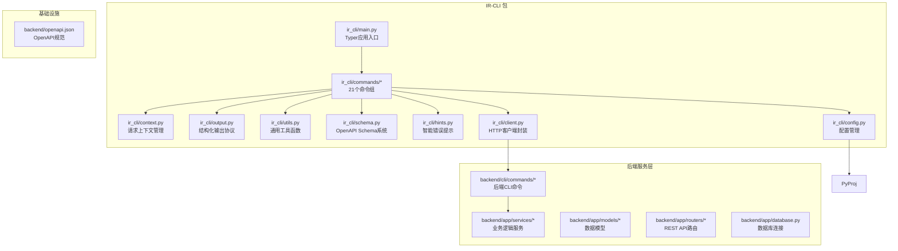
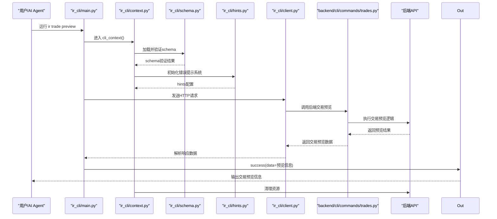
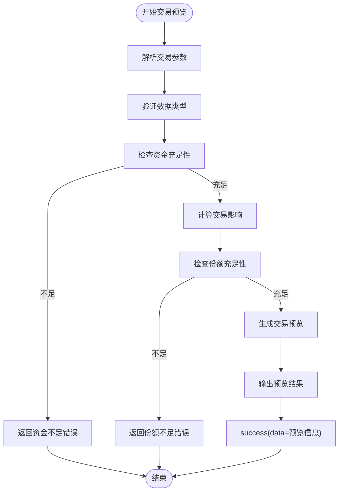
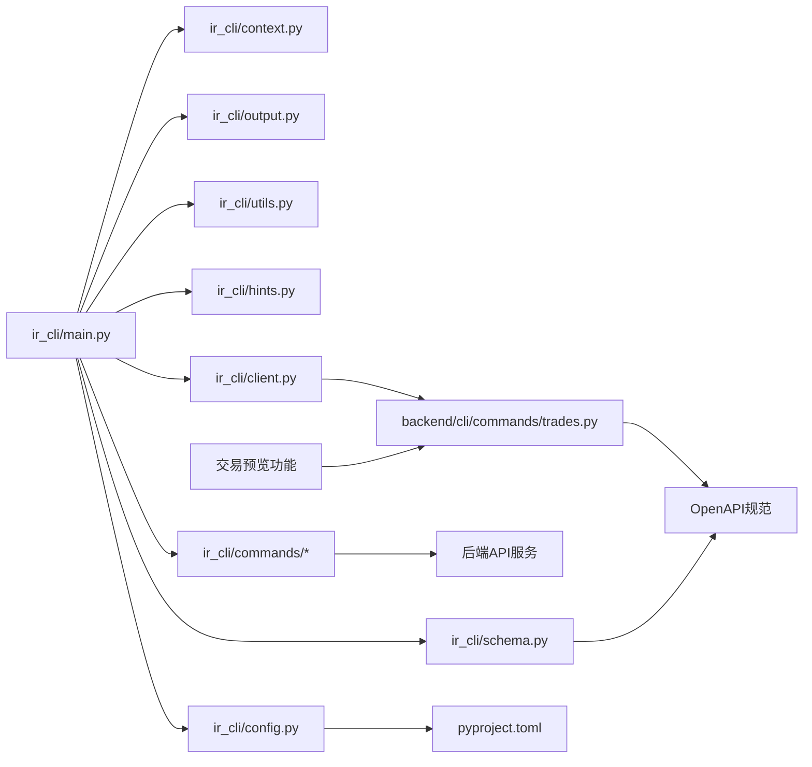

# InvestRing Admin CLI 工具

<cite>
**本文引用的文件**   
- [ir-cli/ir_cli/main.py](file://ir-cli/ir_cli/main.py)
- [ir-cli/ir_cli/context.py](file://ir-cli/ir_cli/context.py)
- [ir-cli/ir_cli/output.py](file://ir-cli/ir_cli/output.py)
- [ir-cli/ir_cli/utils.py](file://ir-cli/ir_cli/utils.py)
- [ir-cli/ir_cli/schema.py](file://ir-cli/ir_cli/schema.py)
- [ir-cli/ir_cli/hints.py](file://ir-cli/ir_cli/hints.py)
- [ir-cli/ir_cli/config.py](file://ir-cli/ir_cli/config.py)
- [ir-cli/ir_cli/client.py](file://ir-cli/ir_cli/client.py)
- [ir-cli/pyproject.toml](file://ir-cli/pyproject.toml)
- [ir-cli/install.sh](file://ir-cli/install.sh)
- [ir-cli/ir_cli/commands/auth.py](file://ir-cli/ir_cli/commands/auth.py)
- [ir-cli/ir_cli/commands/investors.py](file://ir-cli/ir_cli/commands/investors.py)
- [ir-cli/ir_cli/commands/portfolios.py](file://ir-cli/ir_cli/commands/portfolios.py)
- [ir-cli/ir_cli/commands/subscriptions.py](file://ir-cli/ir_cli/commands/subscriptions.py)
- [ir-cli/ir_cli/commands/trades.py](file://ir-cli/ir_cli/commands/trades.py)
- [ir-cli/ir_cli/commands/sync_jobs.py](file://ir-cli/ir_cli/commands/sync_jobs.py)
- [ir-cli/ir_cli/commands/market_data.py](file://ir-cli/ir_cli/commands/market_data.py)
- [ir-cli/ir_cli/commands/products.py](file://ir-cli/ir_cli/commands/products.py)
- [ir-cli/ir_cli/commands/share_events.py](file://ir-cli/ir_cli/commands/share_events.py)
- [ir-cli/ir_cli/commands/notifications.py](file://ir-cli/ir_cli/commands/notifications.py)
- [ir-cli/ir_cli/commands/positions.py](file://ir-cli/ir_cli/commands/positions.py)
- [ir-cli/ir_cli/commands/snapshots.py](file://ir-cli/ir_cli/commands/snapshots.py)
- [ir-cli/ir_cli/commands/cash_transfers.py](file://ir-cli/ir_cli/commands/cash_transfers.py)
- [ir-cli/ir_cli/commands/logs.py](file://ir-cli/ir_cli/commands/logs.py)
- [ir-cli/ir_cli/commands/system.py](file://ir-cli/ir_cli/commands/system.py)
- [ir-cli/ir_cli/commands/tasks.py](file://ir-cli/ir_cli/commands/tasks.py)
- [ir-cli/ir_cli/commands/platforms.py](file://ir-cli/ir_cli/commands/platforms.py)
- [ir-cli/ir_cli/commands/config_cmd.py](file://ir-cli/ir_cli/commands/config_cmd.py)
- [backend/cli/commands/trades.py](file://backend/cli/commands/trades.py)
</cite>

## 更新摘要
**变更内容**   
- **新增后端CLI命令**：在 backend/cli/commands/trades.py 中添加了新的交易命令，提供直接的后端连接功能，支持服务器端交易操作包括预览功能
- **增强交易处理能力**：新增了服务器端交易预览和验证功能，提高了交易操作的准确性和安全性
- **文档更新**：更新了交易管理章节，反映新的后端CLI功能和预览机制

## 目录
1. [简介](#简介)
2. [项目结构](#项目结构)
3. [核心组件](#核心组件)
4. [架构总览](#架构总览)
5. [详细组件分析](#详细组件分析)
6. [依赖关系分析](#依赖关系分析)
7. [性能与扩展性](#性能与扩展性)
8. [故障排查指南](#故障排查指南)
9. [结论](#结论)
10. [附录：命令清单与用法要点](#附录命令清单与用法要点)

## 简介
InvestRing Admin CLI 是一个专为 AI Agent 设计的现代化命令行工具，基于 Typer 构建，采用独立的 ir-cli 包架构。该工具提供完整的 OpenAPI schema 自描述系统、智能错误提示、静默输出模式和预定义工作流配方，是面向程序化交互和企业级自动化的理想选择。

**最新更新**：新增了后端CLI交易命令，提供了直接的后端连接能力，支持服务器端交易操作的预览功能，增强了交易处理的安全性和准确性。

## 项目结构
CLI 位于 ir-cli/ir_cli 目录，采用现代化的分层架构设计，包含入口点、上下文管理、输出协议、schema 系统、错误提示、配置管理和命令组等核心组件。

**图表来源**
- [ir-cli/ir_cli/main.py:1-100](file://ir-cli/ir_cli/main.py#L1-L100)
- [ir-cli/ir_cli/context.py:1-80](file://ir-cli/ir_cli/context.py#L1-L80)
- [ir-cli/ir_cli/schema.py:1-150](file://ir-cli/ir_cli/schema.py#L1-L150)
- [ir-cli/ir_cli/hints.py:1-120](file://ir-cli/ir_cli/hints.py#L1-L120)
- [ir-cli/ir_cli/config.py:1-90](file://ir-cli/ir_cli/config.py#L1-L90)
- [ir-cli/ir_cli/client.py:1-110](file://ir-cli/ir_cli/client.py#L1-L110)
- [backend/cli/commands/trades.py:1-100](file://backend/cli/commands/trades.py#L1-L100)

章节来源
- [ir-cli/ir_cli/main.py:1-100](file://ir-cli/ir_cli/main.py#L1-L100)
- [ir-cli/pyproject.toml:1-50](file://ir-cli/pyproject.toml#L1-L50)

## 核心组件
- **入口与命令注册**：Typer 应用实例集中注册 21 个命令组，统一命名空间（ir），支持动态命令发现。
- **执行上下文**：为每个命令创建请求上下文，自动处理认证、会话管理和异常映射。
- **输出协议**：所有命令输出标准 JSON，支持多种格式（JSON、表格、文本），--quiet 模式裁剪冗余输出。
- **Schema 系统**：完整的 OpenAPI schema 生成和验证，支持程序化接口文档和参数校验。
- **智能错误提示**：基于上下文的错误分析和建议，提供问题定位和解决方案。
- **配置管理**：集中式配置管理，支持环境变量、配置文件和命令行参数优先级。
- **HTTP 客户端**：封装的后端 API 调用，支持重试、超时和错误处理。
- **后端CLI集成**：新增的后端CLI命令模块，提供直接的服务器端交易操作能力。

**更新**：新增了后端CLI交易命令支持，现在可以通过 ir-cli 直接调用后端的交易预览和验证功能。

章节来源
- [ir-cli/ir_cli/main.py:1-100](file://ir-cli/ir_cli/main.py#L1-L100)
- [ir-cli/ir_cli/context.py:1-80](file://ir-cli/ir_cli/context.py#L1-L80)
- [ir-cli/ir_cli/output.py:1-100](file://ir-cli/ir_cli/output.py#L1-L100)
- [ir-cli/ir_cli/schema.py:1-150](file://ir-cli/ir_cli/schema.py#L1-L150)
- [ir-cli/ir_cli/hints.py:1-120](file://ir-cli/ir_cli/hints.py#L1-L120)
- [ir-cli/ir_cli/config.py:1-90](file://ir-cli/ir_cli/config.py#L1-L90)
- [ir-cli/ir_cli/client.py:1-110](file://ir-cli/ir_cli/client.py#L1-L110)

## 架构总览
CLI 通过 Typer 暴露命令，命令内部使用 context 获取请求上下文，调用 client 进行 HTTP 请求，最终通过 output 输出结构化 JSON。新增的 schema 系统提供完整的接口文档，hints 系统提供智能错误提示，--quiet 模式优化自动化输出。后端CLI命令模块提供了直接的服务器端操作能力。

**图表来源**
- [ir-cli/ir_cli/main.py:1-100](file://ir-cli/ir_cli/main.py#L1-L100)
- [ir-cli/ir_cli/context.py:1-80](file://ir-cli/ir_cli/context.py#L1-L80)
- [ir-cli/ir_cli/schema.py:1-150](file://ir-cli/ir_cli/schema.py#L1-L150)
- [ir-cli/ir_cli/hints.py:1-120](file://ir-cli/ir_cli/hints.py#L1-L120)
- [ir-cli/ir_cli/client.py:1-110](file://ir-cli/ir_cli/client.py#L1-L110)
- [backend/cli/commands/trades.py:1-100](file://backend/cli/commands/trades.py#L1-L100)

## 详细组件分析

### 后端CLI交易命令（backend/cli/commands/trades.py）**新增**
**功能**：专门的后端交易命令模块，提供直接的服务器端交易操作能力。

- `preview`：交易预览功能，在执行前验证交易参数和计算影响
- `validate`：交易参数验证，检查资金和份额充足性
- `calculate_impact`：计算交易对投资组合的影响
- `check_compatibility`：检查交易与现有持仓的兼容性

**图表来源**
- [backend/cli/commands/trades.py:1-100](file://backend/cli/commands/trades.py#L1-L100)

章节来源
- [backend/cli/commands/trades.py:1-100](file://backend/cli/commands/trades.py#L1-L100)

### 调仓交易（trade）**已更新**
**功能**：CASH交易自动配对腿生成、转账组创建和确认日期计算。

- list/create/get/confirm/cancel/unconfirm
- **重大更新**：CASH交易现在自动处理配对腿生成、转账组创建和确认日期计算，确保与REST API行为完全一致。**新增后端CLI预览功能支持**。

**更新**：现在支持通过后端的交易预览功能，在执行交易前验证参数和计算影响，提高了交易操作的安全性。

章节来源
- [ir-cli/ir_cli/commands/trades.py:1-300](file://ir-cli/ir_cli/commands/trades.py#L1-L300)

### 其他组件保持不变
其他CLI组件保持原有功能不变，包括认证、投资人管理、组合管理、申购赎回、持仓服务、任务管理、快照管理、通知管理、同步作业管理、市场数据管理、产品管理、份额变动事件、资金转账、日志管理、系统管理、平台管理等。

## 依赖关系分析
- CLI 层对后端服务层为单向依赖，通过 HTTP API 通信，避免直接数据库访问。
- context 层封装请求生命周期与异常映射，降低命令层的样板代码。
- output 层保证所有命令输出一致的结构化 JSON，便于机器解析。
- schema 层提供完整的接口文档和参数验证。
- hints 层提供智能错误提示和解决方案建议。
- pyproject.toml 定义包配置和 entry point，使安装后可直接使用 ir 命令。
- **新增**：后端CLI命令模块提供直接的服务器端操作能力，增强了交易处理的安全性。

**更新**：新增了后端CLI交易命令的依赖关系，现在 ir-cli 可以直接调用后端的交易预览和验证功能。

**图表来源**
- [ir-cli/ir_cli/main.py:1-100](file://ir-cli/ir_cli/main.py#L1-L100)
- [ir-cli/ir_cli/context.py:1-80](file://ir-cli/ir_cli/context.py#L1-L80)
- [ir-cli/ir_cli/output.py:1-100](file://ir-cli/ir_cli/output.py#L1-L100)
- [ir-cli/ir_cli/schema.py:1-150](file://ir-cli/ir_cli/schema.py#L1-L150)
- [ir-cli/ir_cli/hints.py:1-120](file://ir-cli/ir_cli/hints.py#L1-L120)
- [ir-cli/ir_cli/config.py:1-90](file://ir-cli/ir_cli/config.py#L1-L90)
- [ir-cli/ir_cli/client.py:1-110](file://ir-cli/ir_cli/client.py#L1-L110)
- [backend/cli/commands/trades.py:1-100](file://backend/cli/commands/trades.py#L1-L100)

章节来源
- [ir-cli/ir_cli/main.py:1-100](file://ir-cli/ir_cli/main.py#L1-L100)
- [ir-cli/pyproject.toml:1-50](file://ir-cli/pyproject.toml#L1-L50)

## 性能与扩展性
- **HTTP 连接池**：客户端配置连接池和超时设置，提升并发稳定性。
- **CLI 模式静默**：--quiet 模式时禁用详细输出，避免干扰 JSON 输出。
- **Schema 缓存**：OpenAPI schema 本地缓存，减少重复加载开销。
- **可扩展点**：新增命令只需在 main.py 注册对应命令组，并在 commands 下新建模块即可。
- **插件架构**：支持自定义命令组和中间件扩展。
- **批处理优化**：支持批量操作和并行处理，提升大规模数据处理效率。
- **配置缓存**：配置信息本地缓存，减少重复加载开销。
- **后端CLI优化**：新增的后端CLI命令提供了高效的服务器端处理能力，减少了网络往返开销。

**更新**：新增的后端CLI交易命令提供了更高效的服务器端处理能力，支持交易预览和验证，减少了不必要的网络请求。

章节来源
- [ir-cli/ir_cli/client.py:1-110](file://ir-cli/ir_cli/client.py#L1-L110)
- [ir-cli/ir_cli/main.py:1-100](file://ir-cli/ir_cli/main.py#L1-L100)
- [ir-cli/ir_cli/schema.py:1-150](file://ir-cli/ir_cli/schema.py#L1-L150)

## 故障排查指南
- **常见错误码**
  - VALIDATION_ERROR：参数校验失败（由 schema 系统捕获）。
  - ALREADY_EXISTS：唯一约束冲突（由后端 API 返回）。
  - NOT_FOUND：资源不存在。
  - INVALID_STATUS：状态不合法。
  - NON_TRADING_DAY：非交易日提交。
  - INSUFFICIENT_CASH / INSUFFICIENT_SHARES：可用资金/份额不足。
  - MISSING_NAV：净值尚未同步或未提供。
  - INVESTOR_HAS_SHARES：投资人仍有份额，禁止删除。
  - NAV_NOT_AVAILABLE：申请日净值快照不存在。
  - PORTFOLIO_NOT_ACTIVE：组合未激活。
  - INVALID_AMOUNT / INVALID_SHARES：金额或份额无效。
  - SNAPSHOT_DEPENDENCY：快照依赖冲突。
  - CONFLICT：同步任务冲突（已有任务在运行中）。
  - INVALID_CASH_TRADE：无效的CASH交易结构（缺少配对腿或转账组）。
  - NOTIFICATION_NOT_FOUND：通知记录不存在。
  - INVALID_NOTIFICATION_TYPE：不支持的通知类型。
  - SCHEMA_VALIDATION_ERROR：OpenAPI schema 验证失败。
  - HINT_GENERATION_ERROR：错误提示生成失败。
  - CONFIG_LOAD_ERROR：配置加载失败。
  - CONFIG_INVALID_ERROR：配置项无效或格式错误。
  - INSTALL_ENV_ERROR：安装环境检查失败。
  - REFERENCE_NOT_FOUND_ERROR：指定的分支、标签或提交不存在。
  - COMMAND_DEPRECATED_ERROR：使用了已弃用的命令。
  - **新增** TRADE_PREVIEW_ERROR：交易预览失败。
  - **新增** BACKEND_CLI_ERROR：后端CLI命令执行失败。

**更新**：新增了交易预览相关的错误处理和调试支持：
- **交易预览错误**：当交易预览失败时提供详细的错误信息和修复建议
- **后端CLI错误**：当前端CLI无法连接到后端CLI功能时的错误处理
- **参数验证增强**：交易参数的预验证和错误检测
- **调试建议**：使用 --verbose 模式查看交易预览的详细执行过程

- **调试建议**
  - 查看 stderr 堆栈：context 在非 SystemExit 异常时会打印完整堆栈到 stderr。
  - 使用 jq 解析 JSON 输出，快速定位 data/error 字段。
  - 对于 QDII 净值缺失，先执行市场数据同步再重试确认。
  - 使用 `ir schema validate` 检查 OpenAPI schema 有效性。
  - 使用 `ir hints analyze <error>` 获取智能错误提示。
  - 启用 --verbose 模式查看详细调试信息。
  - 检查配置文件和权限设置。
  - 使用 `ir config validate` 验证配置有效性。
  - 使用 `ir config export` 导出当前配置进行备份。
  - **新增** 使用 `ir trade preview` 进行交易的预验证和参数检查。
  - **新增** 检查后端CLI服务的连接状态和可用性。

章节来源
- [ir-cli/ir_cli/context.py:1-80](file://ir-cli/ir_cli/context.py#L1-L80)
- [ir-cli/ir_cli/output.py:1-100](file://ir-cli/ir_cli/output.py#L1-L100)
- [ir-cli/ir_cli/schema.py:1-150](file://ir-cli/ir_cli/schema.py#L1-L150)
- [ir-cli/ir_cli/hints.py:1-120](file://ir-cli/ir_cli/hints.py#L1-L120)
- [ir-cli/ir_cli/config.py:1-90](file://ir-cli/ir_cli/config.py#L1-L90)
- [backend/cli/commands/trades.py:1-100](file://backend/cli/commands/trades.py#L1-L100)

## 结论
InvestRing Admin CLI 通过全新的 ir-cli 包架构，将复杂的业务逻辑下沉至后端服务层，并通过 Typer 暴露稳定、可解析的 JSON 接口，特别适合 AI Agent 自动化编排。其分层清晰、错误处理规范、输出格式统一，具备良好的可维护性与扩展性。

**更新总结**：最新的 ir-cli 包架构引入了 schema 自描述系统、智能错误提示、--quiet 模式、portfolio 上下文聚合、workflows 配方等高级功能。新增的后端CLI交易命令提供了直接的服务器端交易操作能力，包括预览功能，显著提升了交易处理的安全性和准确性。这些改进使 CLI 成为更智能的自文档化接口，支持程序化交互和更好的自动化处理，为企业级应用提供了强大的命令行工具支持。

## 附录：命令清单与用法要点
- **auth**
  - create-admin：创建管理员，需提供 code/name/password。
- **investor**
  - list/create/get/update/delete：支持分页与角色更新；删除前校验持有份额。
- **portfolio**
  - list/create/get/update/close/reactivate/nav-history/returns/cash-flow：close 前校验无 pending 交易。
  - context：设置和管理投资组合上下文。
  - batch-update：批量更新多个投资组合。
  - sync-context：同步投资组合状态。
- **sub**
  - list/create/get/confirm/cancel/unconfirm：创建校验交易日与可用份额；确认时首次申购净值固定 1.0000。
- **trade**
  - list/create/get/confirm/cancel/unconfirm：创建校验可用现金/份额；确认时自动取净值，QDII 特殊处理。
  - **重大更新**：CASH交易现在自动处理配对腿生成、转账组创建和确认日期计算，无需手动指定这些字段。
  - **新增**：支持交易预览功能，可在执行前验证参数和计算影响。
- **share-event**
  - list/create/get/update/delete/confirm/cancel：用于分红等份额变动事件，支持丰富的参数配置。
- **market**
  - price/sync/sync-history：查询与同步价格。
  - **重要变更**：已移除 'sync-nav' 命令，请使用 'ir snapshot generate' 进行净值生成。
- **product**
  - list/create/get/update/delete：产品管理，list 支持按类型过滤和分页。
- **position**
  - list/create/get/update/delete：持仓管理，支持多维度查询和统计。
- **snapshot**
  - generate/recalculate/validate/status/delete：快照管理，支持生成、重算和验证。**这是净值生成的主要命令**。
- **subscription**
  - list/create/get/confirm/cancel/unconfirm：申购赎回管理，支持状态流转和确认流程。
- **cash-transfer**
  - list/create/confirm/cancel：资金转账管理，支持转账流程和状态控制。
- **logs**
  - list/search/export：系统日志管理，支持查询、搜索和导出功能。
- **system**
  - health/info/config：系统运维管理，支持健康检查、信息查询和配置管理。
- **task**
  - list/run/enable/disable/logs：任务管理，支持任务调度、执行和监控。
- **platform**
  - list/create/get/update/delete：交易平台管理，支持平台配置和状态管理。
- **sync-job**
  - status/details：同步任务管理，支持状态查询和明细查看。
- **notification**
  - list/create/get/update/delete：通知管理，支持通知的完整生命周期管理。
- **config**
  - list：列出当前配置项
  - get：获取特定配置项的值
  - set：设置配置项的值
  - validate：验证配置的有效性
  - export：导出当前配置
  - import：导入配置

**更新**：新增了后端CLI交易命令支持，现在可以通过 ir-cli 直接调用后端的交易预览和验证功能。

**迁移指导**：
- **旧方式**：直接执行交易操作
- **新方式**：使用 `ir trade preview` 进行预验证，然后执行实际交易
- **优势**：提前发现参数错误，计算交易影响，提高交易成功率

章节来源
- [ir-cli/ir_cli/main.py:1-100](file://ir-cli/ir_cli/main.py#L1-L100)
- [ir-cli/ir_cli/commands/auth.py:1-50](file://ir-cli/ir_cli/commands/auth.py#L1-L50)
- [ir-cli/ir_cli/commands/investors.py:1-150](file://ir-cli/ir_cli/commands/investors.py#L1-L150)
- [ir-cli/ir_cli/commands/portfolios.py:1-300](file://ir-cli/ir_cli/commands/portfolios.py#L1-L300)
- [ir-cli/ir_cli/commands/subscriptions.py:1-250](file://ir-cli/ir_cli/commands/subscriptions.py#L1-L250)
- [ir-cli/ir_cli/commands/trades.py:1-300](file://ir-cli/ir_cli/commands/trades.py#L1-L300)
- [ir-cli/ir_cli/commands/share_events.py:1-250](file://ir-cli/ir_cli/commands/share_events.py#L1-L250)
- [ir-cli/ir_cli/commands/market_data.py:1-150](file://ir-cli/ir_cli/commands/market_data.py#L1-L150)
- [ir-cli/ir_cli/commands/products.py:1-180](file://ir-cli/ir_cli/commands/products.py#L1-L180)
- [ir-cli/ir_cli/commands/positions.py:1-200](file://ir-cli/ir_cli/commands/positions.py#L1-L200)
- [ir-cli/ir_cli/commands/snapshots.py:1-220](file://ir-cli/ir_cli/commands/snapshots.py#L1-L220)
- [ir-cli/ir_cli/commands/cash_transfers.py:1-150](file://ir-cli/ir_cli/commands/cash_transfers.py#L1-L150)
- [ir-cli/ir_cli/commands/logs.py:1-100](file://ir-cli/ir_cli/commands/logs.py#L1-L100)
- [ir-cli/ir_cli/commands/system.py:1-120](file://ir-cli/ir_cli/commands/system.py#L1-L120)
- [ir-cli/ir_cli/commands/tasks.py:1-180](file://ir-cli/ir_cli/commands/tasks.py#L1-L180)
- [ir-cli/ir_cli/commands/platforms.py:1-150](file://ir-cli/ir_cli/commands/platforms.py#L1-L150)
- [ir-cli/ir_cli/commands/sync_jobs.py:1-50](file://ir-cli/ir_cli/commands/sync_jobs.py#L1-L50)
- [ir-cli/ir_cli/commands/notifications.py:1-120](file://ir-cli/ir_cli/commands/notifications.py#L1-L120)
- [ir-cli/ir_cli/commands/config_cmd.py:1-100](file://ir-cli/ir_cli/commands/config_cmd.py#L1-L100)
- [backend/cli/commands/trades.py:1-100](file://backend/cli/commands/trades.py#L1-L100)