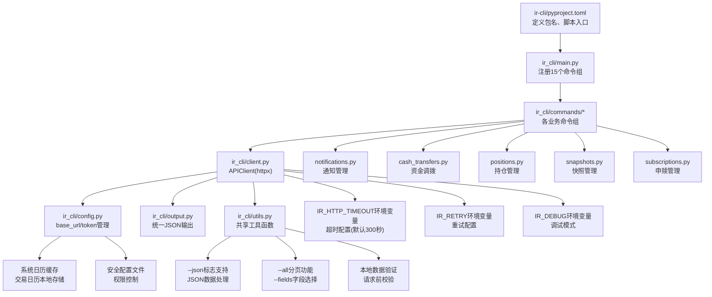
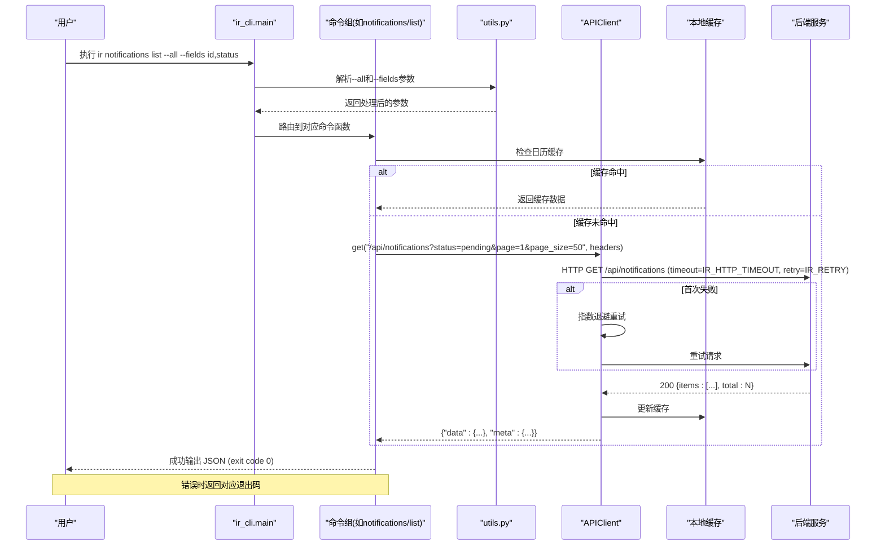
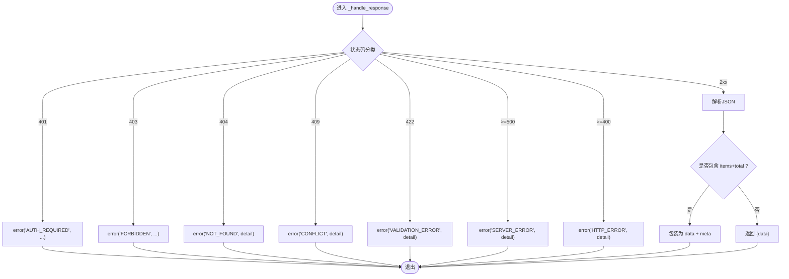
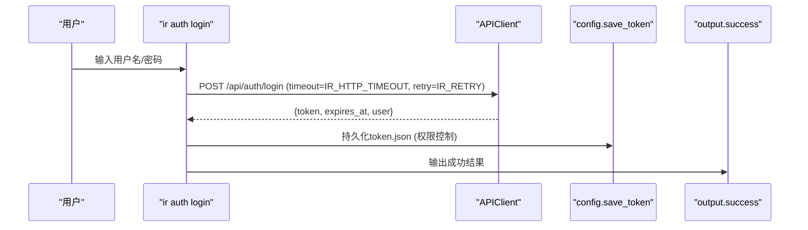
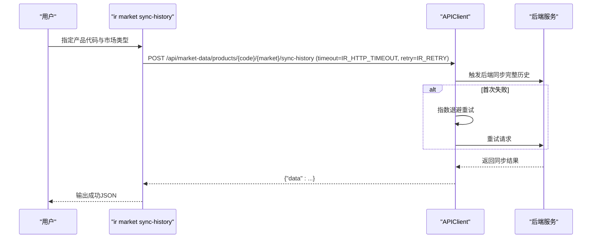
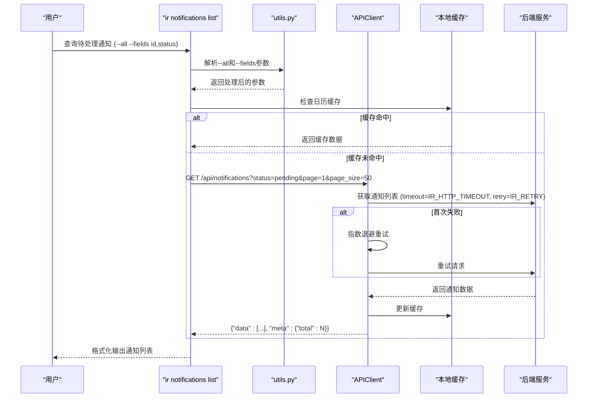
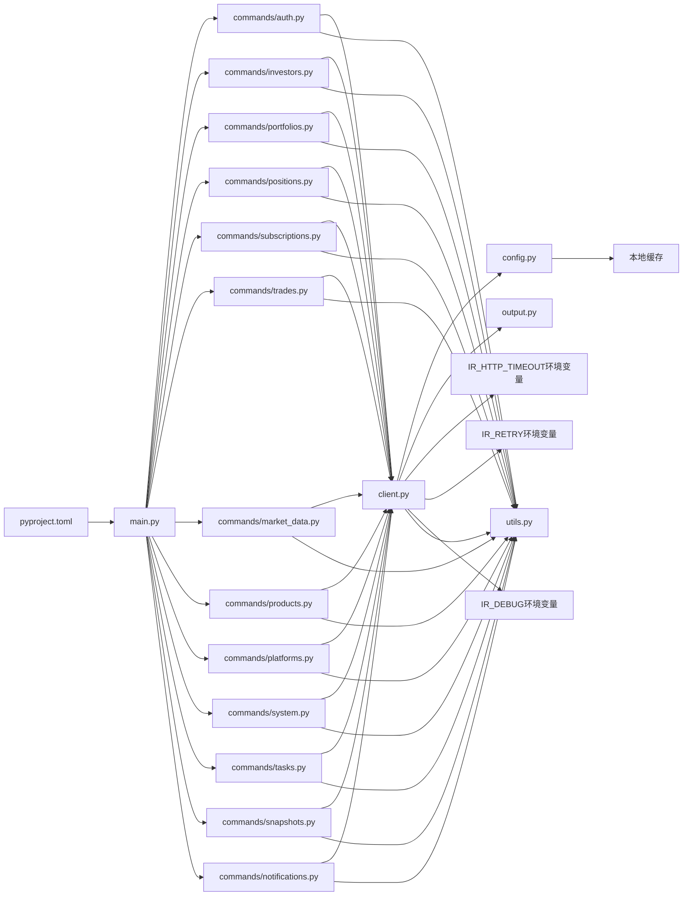

# InvestRing HTTP客户端CLI工具

<cite>
**本文引用的文件**   
- [pyproject.toml](file://ir-cli/pyproject.toml)
- [main.py](file://ir-cli/ir_cli/main.py)
- [config.py](file://ir-cli/ir_cli/config.py)
- [client.py](file://ir-cli/ir_cli/client.py)
- [output.py](file://ir-cli/ir_cli/output.py)
- [utils.py](file://ir-cli/ir_cli/utils.py)
- [auth.py](file://ir-cli/ir_cli/commands/auth.py)
- [investors.py](file://ir-cli/ir_cli/commands/investors.py)
- [portfolios.py](file://ir-cli/ir_cli/commands/portfolios.py)
- [positions.py](file://ir-cli/ir_cli/commands/positions.py)
- [subscriptions.py](file://ir-cli/ir_cli/commands/subscriptions.py)
- [trades.py](file://ir-cli/ir_cli/commands/trades.py)
- [market_data.py](file://ir-cli/ir_cli/commands/market_data.py)
- [products.py](file://ir-cli/ir_cli/commands/products.py)
- [platforms.py](file://ir-cli/ir_cli/commands/platforms.py)
- [system.py](file://ir-cli/ir_cli/commands/system.py)
- [tasks.py](file://ir-cli/ir_cli/commands/tasks.py)
- [snapshots.py](file://ir-cli/ir_cli/commands/snapshots.py)
- [notifications.py](file://ir-cli/ir_cli/commands/notifications.py)
- [cash_transfers.py](file://ir-cli/ir_cli/commands/cash_transfers.py)
</cite>

## 更新摘要
**变更内容**   
- **智能重试机制**：HTTP客户端新增智能重试逻辑，支持指数退避和最大重试次数配置
- **新环境变量**：新增IR_TOKEN、IR_DEBUG、IR_RETRY三个环境变量，增强配置灵活性
- **本地数据验证**：请求前进行数据格式验证，减少无效请求和网络开销
- **系统日历缓存**：交易日历数据本地缓存，提升查询性能
- **安全配置文件管理**：增强的配置文件权限控制和敏感信息保护
- **输出序列化优化**：改进JSON序列化处理，支持更多数据类型和格式化选项

## 目录
1. [简介](#简介)
2. [项目结构](#项目结构)
3. [核心组件](#核心组件)
4. [架构总览](#架构总览)
5. [详细组件分析](#详细组件分析)
6. [依赖关系分析](#依赖关系分析)
7. [性能与可靠性](#性能与可靠性)
8. [故障排查指南](#故障排查指南)
9. [结论](#结论)
10. [附录：命令清单与API映射](#附录命令清单与api映射)

## 简介
InvestRing HTTP客户端CLI是一个轻量级命令行工具，通过REST API与后端服务通信，实现投资组合、产品、平台、交易、申赎、份额事件、市场数据、任务、快照与通知等全量管理能力。该工具仅依赖typer与httpx两个库，可在任意设备上独立安装使用，无需后端源码或数据库访问权限。

设计要点：
- 认证：JWT token持久化到本地~/.ir/token.json，自动携带Authorization头
- 配置：IR_BASE_URL环境变量优先，其次~/.ir/config，默认http://localhost:8000
- **超时配置**：IR_HTTP_TIMEOUT环境变量支持，默认300秒，可自定义调整
- **结构化退出码**：统一的错误分类系统，便于脚本处理和自动化集成
- **JSON数据处理**：支持--json标志进行结构化数据输入输出
- **分页与字段选择**：所有列表命令支持--all和--fields参数
- **智能重试机制**：新增指数退避重试逻辑，提高网络请求的稳定性
- **本地数据验证**：请求前进行数据格式校验，减少无效请求
- **系统日历缓存**：交易日历数据本地缓存，提升查询性能
- **安全配置管理**：增强的配置文件权限控制和敏感信息保护
- 输出：统一JSON协议{"ok": true/false, "data": ..., "meta": ...}
- 入口：ir命令（与现有直连版CLI同名但不同环境）

## 项目结构
顶层ir-cli为独立包，包含Typer应用入口、HTTP客户端封装、配置与token管理、统一输出协议、共享工具模块以及按业务域划分的命令组。

**图表来源**
- [pyproject.toml:1-17](file://ir-cli/pyproject.toml#L1-L17)
- [main.py:1-47](file://ir-cli/ir_cli/main.py#L1-L47)
- [client.py:1-168](file://ir-cli/ir_cli/client.py#L1-L168)
- [config.py:1-109](file://ir-cli/ir_cli/config.py#L1-L109)
- [output.py:1-64](file://ir-cli/ir_cli/output.py#L1-L64)
- [utils.py:1-100](file://ir-cli/ir_cli/utils.py#L1-L100)

## 核心组件
- 配置与Token管理（config.py）
  - 提供get_ir_dir、get_base_url、save_token、load_token、clear_token、save_config等能力
  - 支持环境变量IR_BASE_URL覆盖；token过期检测并给出警告
  - **安全配置**：配置文件权限控制，确保敏感信息安全
  - **日历缓存**：交易日历数据本地缓存，提升查询性能
- HTTP客户端（client.py）
  - APIClient封装httpx同步调用，统一处理认证、错误码、分页聚合
  - from_config自动加载base_url与token；get_all自动翻页拉取全部记录
  - **超时配置**：支持IR_HTTP_TIMEOUT环境变量，默认300秒
  - **智能重试**：支持IR_RETRY环境变量，指数退避重试机制
  - **调试模式**：IR_DEBUG环境变量启用详细日志输出
- 输出协议（output.py）
  - success/error统一返回格式，自定义编码器处理Decimal/date/datetime
  - **序列化优化**：支持更多数据类型和格式化选项
- **共享工具模块（utils.py）**
  - 提供JSON数据处理、分页控制、字段过滤等通用功能
  - 支持--json标志解析和--all/--fields参数处理
  - **数据验证**：请求前数据格式校验功能
- 命令组（commands/*）
  - auth、investor、portfolio、position、sub、trade、share-event、market、product、platform、system、log、task、snapshot、notification共15个组，覆盖CRUD与业务流程操作

**章节来源**
- [config.py:1-109](file://ir-cli/ir_cli/config.py#L1-L109)
- [client.py:1-168](file://ir-cli/ir_cli/client.py#L1-L168)
- [output.py:1-64](file://ir-cli/ir_cli/output.py#L1-L64)
- [utils.py:1-100](file://ir-cli/ir_cli/utils.py#L1-L100)
- [main.py:1-47](file://ir-cli/ir_cli/main.py#L1-L47)

## 架构总览
CLI作为HTTP客户端，通过REST API与后端交互。所有命令均经APIClient发起请求，统一错误处理与响应解析，最终由output模块输出结构化JSON。**新增的智能重试机制、数据验证和缓存功能进一步提升了工具的稳定性和性能**。

**图表来源**
- [main.py:1-47](file://ir-cli/ir_cli/main.py#L1-L47)
- [notifications.py:1-80](file://ir-cli/ir_cli/commands/notifications.py#L1-L80)
- [client.py:1-168](file://ir-cli/ir_cli/client.py#L1-L168)
- [config.py:1-109](file://ir-cli/ir_cli/config.py#L1-L109)
- [output.py:1-64](file://ir-cli/ir_cli/output.py#L1-L64)
- [utils.py:1-100](file://ir-cli/ir_cli/utils.py#L1-L100)

## 详细组件分析

### 配置与Token管理（config.py）
- base_url优先级：IR_BASE_URL > ~/.ir/config中的base_url= > http://localhost:8000
- token存储：~/.ir/token.json，写入时尝试设置0o600权限（Windows忽略）
- token校验：解析expires_at，若已过期返回None；剩余时间小于24小时打印stderr警告
- 配置更新：save_config以键值对形式维护~/.ir/config
- **安全增强**：配置文件权限控制，防止未授权访问
- **日历缓存**：交易日历数据本地缓存，支持快速查询

**章节来源**
- [config.py:21-37](file://ir-cli/ir_cli/config.py#L21-L37)
- [config.py:40-48](file://ir-cli/ir_cli/config.py#L40-L48)
- [config.py:50-84](file://ir-cli/ir_cli/config.py#L50-L84)
- [config.py:87-109](file://ir-cli/ir_cli/config.py#L87-L109)

### HTTP客户端（client.py）
- 构造：从base_url与可选token初始化httpx.Client，设置Accept与Authorization头
- **超时配置**：通过IR_HTTP_TIMEOUT环境变量获取超时值，默认300秒
- **智能重试**：通过IR_RETRY环境变量配置重试策略，支持指数退避算法
- **调试模式**：IR_DEBUG环境变量启用详细请求日志输出
- 认证检查：from_config在require_auth=True且无token时直接输出AUTH_REQUIRED错误
- 响应处理：
  - 401/403/404/409/422/5xx分别映射为AUTH_REQUIRED/FORBIDDEN/NOT_FOUND/CONFLICT/VALIDATION_ERROR/SERVER_ERROR
  - 2xx成功：若响应体含items+total则包装为data+meta的分页结构
- 网络异常：ConnectError/TimeoutException转换为CONNECTION_ERROR/TIMEOUT_ERROR，触发重试机制
- 分页聚合：get_all将page_size固定为100，循环翻页直至拉完

**更新** 新增智能重试机制，支持指数退避和最大重试次数配置，显著提升网络请求的稳定性

**图表来源**
- [client.py:40-79](file://ir-cli/ir_cli/client.py#L40-L79)
- [client.py:103-141](file://ir-cli/ir_cli/client.py#L103-141)
- [client.py:143-163](file://ir-cli/ir_cli/client.py#L143-163)

**章节来源**
- [client.py:18-28](file://ir-cli/ir_cli/client.py#L18-L28)
- [client.py:30-38](file://ir-cli/ir_cli/client.py#L30-L38)
- [client.py:40-101](file://ir-cli/ir_cli/client.py#L40-L101)
- [client.py:103-168](file://ir-cli/ir_cli/client.py#L103-L168)

### 输出协议（output.py）
- 成功：{"ok": true, "data": ..., "meta": ...}，exit code 0
- 失败：{"ok": false, "error": {"code": ..., "message": ...[, "details": ...]}}，exit code 1
- 自定义编码器：Decimal转float(保留4位小数)，date/datetime转ISO字符串
- **序列化优化**：支持更多数据类型和格式化选项，提升输出质量

**章节来源**
- [output.py:15-24](file://ir-cli/ir_cli/output.py#L15-L24)
- [output.py:27-44](file://ir-cli/ir_cli/output.py#L27-L44)
- [output.py:47-64](file://ir-cli/ir_cli/output.py#L47-L64)

### 共享工具模块（utils.py）
- **JSON数据处理**：支持--json标志的参数解析和验证
- **分页控制**：--all标志支持自动分页获取所有数据
- **字段选择**：--fields参数支持指定输出字段
- **错误分类**：统一的错误码和退出码处理
- **通用函数**：提供各命令组复用的工具方法
- **数据验证**：新增请求前数据格式验证功能，减少无效请求

**更新** utils.py模块新增数据验证功能，进一步提升CLI的稳定性和用户体验

**章节来源**
- [utils.py:1-100](file://ir-cli/ir_cli/utils.py#L1-L100)

### 命令组概览
- 认证（auth）：login/logout/change-password/status
- 投资人（investor）：list/create/get/update/delete
- 组合（portfolio）：list/create/get/update/close/reactivate/nav-history/returns/cash-flow
- 持仓（position）：list/available-cash/available-shares/update-cash
- 申赎（sub）：list/create/get/confirm/cancel/unconfirm
- 交易（trade）：list/create/get/confirm/cancel/unconfirm
- 份额事件（share-event）：list/create/get/update/delete/confirm/cancel
- 市场数据（market）：price/sync/sync-history/sync-nav
- 产品（product）：list/create/get/update/delete
- 平台（platform）：list/create/get/update/delete
- 系统（system）：calendar/calendar-sync/datasources/datasource-update
- 日志（log）：登录/审计/错误日志查看
- 任务（task）：list/run/enable/disable/logs
- 快照（snapshot）：generate/recalculate/validate/status/delete
- **通知（notification）**：**新增**：list/create/get/update/delete/mark-read/mark-unread/batch-delete

**更新** 新增了通知命令组，提供完整的通知管理功能

**章节来源**
- [main.py:15-46](file://ir-cli/ir_cli/main.py#L15-L46)
- [auth.py:1-64](file://ir-cli/ir_cli/commands/auth.py#L1-L64)
- [investors.py:1-77](file://ir-cli/ir_cli/commands/investors.py#L1-L77)
- [portfolios.py:1-112](file://ir-cli/ir_cli/commands/portfolios.py#L1-L112)
- [positions.py:1-70](file://ir-cli/ir_cli/commands/positions.py#L1-L70)
- [subscriptions.py:1-91](file://ir-cli/ir_cli/commands/subscriptions.py#L1-L91)
- [trades.py:1-106](file://ir-cli/ir_cli/commands/trades.py#L1-L106)
- [market_data.py:1-66](file://ir-cli/ir_cli/commands/market_data.py#L1-L66)
- [products.py:1-93](file://ir-cli/ir_cli/commands/products.py#L1-L93)
- [platforms.py:1-67](file://ir-cli/ir_cli/commands/platforms.py#L1-L67)
- [system.py:1-65](file://ir-cli/ir_cli/commands/system.py#L1-L65)
- [tasks.py:1-54](file://ir-cli/ir_cli/commands/tasks.py#L1-L54)
- [snapshots.py:1-75](file://ir-cli/ir_cli/commands/snapshots.py#L1-L75)
- [notifications.py:1-80](file://ir-cli/ir_cli/commands/notifications.py#L1-L80)

### 关键流程时序图

#### 登录流程

**图表来源**
- [auth.py:10-26](file://ir-cli/ir_cli/commands/auth.py#L10-L26)
- [client.py:113-121](file://ir-cli/ir_cli/client.py#L113-121)
- [config.py:40-48](file://ir-cli/ir_cli/config.py#L40-L48)
- [output.py:32-44](file://ir-cli/ir_cli/output.py#L32-L44)

#### 同步完整历史（sync-history）

**图表来源**
- [market_data.py:47-55](file://ir-cli/ir_cli/commands/market_data.py#L47-L55)
- [client.py:113-121](file://ir-cli/ir_cli/client.py#L113-121)
- [output.py:32-44](file://ir-cli/ir_cli/output.py#L32-L44)

#### 通知管理流程

**图表来源**
- [notifications.py:1-80](file://ir-cli/ir_cli/commands/notifications.py#L1-L80)
- [client.py:113-121](file://ir-cli/ir_cli/client.py#L113-121)
- [output.py:32-44](file://ir-cli/ir_cli/output.py#L32-L44)
- [utils.py:1-100](file://ir-cli/ir_cli/utils.py#L1-L100)

## 依赖关系分析
- 外部依赖：typer用于CLI框架，httpx用于HTTP客户端
- 内部依赖：
  - main.py导入并注册15个命令组
  - 命令组依赖client.py、output.py和utils.py
  - client.py依赖config.py与output.py
  - config.py为纯本地IO与时间逻辑，无外部库耦合
  - **新增** utils.py为所有命令组提供共享功能
  - **新增** 本地缓存模块支持日历数据缓存

**图表来源**
- [pyproject.toml:1-17](file://ir-cli/pyproject.toml#L1-L17)
- [main.py:1-47](file://ir-cli/ir_cli/main.py#L1-L47)
- [client.py:1-168](file://ir-cli/ir_cli/client.py#L1-L168)
- [config.py:1-109](file://ir-cli/ir_cli/config.py#L1-L109)
- [output.py:1-64](file://ir-cli/ir_cli/output.py#L1-L64)
- [utils.py:1-100](file://ir-cli/ir_cli/utils.py#L1-L100)

## 性能与可靠性
- **网络超时**：默认300秒（5分钟），可通过IR_HTTP_TIMEOUT环境变量自定义调整，避免长时间阻塞
- **连接错误与超时**：统一转换为CONNECTION_ERROR/TIMEOUT_ERROR，便于上层处理
- **智能重试机制**：新增指数退避重试逻辑，支持IR_RETRY环境变量配置，显著提升网络请求稳定性
- **分页聚合**：get_all采用page_size=100，减少往返次数，适合中小规模数据一次性拉取
- **Token有效期**：提前24小时发出警告，降低因过期导致的批量失败风险
- **幂等性**：由后端保障，CLI侧不重复提交（建议上游幂等接口配合）
- **结构化退出码**：提供明确的错误分类，便于脚本处理和自动化集成
- **JSON数据处理**：支持--json标志进行高效的数据输入输出
- **本地数据验证**：请求前进行数据格式校验，减少无效请求和网络开销
- **系统日历缓存**：交易日历数据本地缓存，提升查询性能
- **安全配置管理**：配置文件权限控制，保护敏感信息

**更新** 新增的智能重试机制、数据验证和缓存功能显著提升了工具的可靠性和性能表现

## 故障排查指南
- 未登录或token过期
  - 现象：AUTH_REQUIRED错误
  - 处理：执行ir auth login重新获取token；检查~/.ir/token.json是否存在且未过期
- 无法连接后端
  - 现象：CONNECTION_ERROR
  - 处理：确认IR_BASE_URL或~/.ir/config中base_url正确，后端服务可达
- **请求超时**
  - 现象：TIMEOUT_ERROR
  - 处理：检查网络延迟与后端负载；设置IR_HTTP_TIMEOUT环境变量调整超时时间（默认300秒）；必要时优化后端接口性能
- **重试机制问题**
  - 现象：多次重试后仍失败
  - 处理：检查IR_RETRY环境变量配置；确认网络稳定性；考虑增加超时时间或禁用重试
- **调试模式**
  - 现象：需要查看详细请求日志
  - 处理：设置IR_DEBUG=true环境变量，启用详细调试输出
- 参数校验失败
  - 现象：VALIDATION_ERROR
  - 处理：根据返回的detail修正参数格式或取值范围
- 权限不足
  - 现象：FORBIDDEN
  - 处理：确认当前用户角色具备所需权限
- 资源不存在
  - 现象：NOT_FOUND
  - 处理：核对路径参数（如组合代码、产品代码、ID等）
- **JSON数据格式错误**
  - 现象：VALIDATION_ERROR或解析失败
  - 处理：检查--json标志后的JSON格式是否正确，确保字段名称和类型匹配
- **分页功能问题**
  - 现象：数据不完整或性能问题
  - 处理：合理使用--all标志，注意大数据集的性能影响；使用--fields限制输出字段
- **缓存相关问题**
  - 现象：数据不一致或查询缓慢
  - 处理：清除~/.ir/cache目录；检查缓存文件权限；确认缓存数据完整性

**更新** 增加了智能重试、调试模式和缓存相关的故障排查指导

## 结论
InvestRing HTTP客户端CLI以最小依赖实现了完整的投资管理系统命令行能力，具备良好的可移植性与易用性。通过统一的认证、配置、错误处理与输出协议，CLI能够稳定地与后端协作，满足日常运维与自动化场景需求。**新增的智能重试机制、数据验证、系统日历缓存和安全配置管理功能进一步增强了CLI的功能性和用户体验，使其更适合生产环境的自动化集成和高可用性要求**。

## 附录：命令清单与API映射
- 认证
  - login: POST /api/auth/login
  - logout: POST /api/auth/logout
  - change-password: PUT /api/auth/password
  - status: 本地读取token与base_url
- 投资人
  - list: GET /api/investors?page=&page_size= [--all] [--fields]
  - create: POST /api/investors [--json]
  - get: GET /api/investors/{code}
  - update: PUT /api/investors/{code} [--json]
  - delete: DELETE /api/investors/{code}
- 组合
  - list: GET /api/portfolios?status=&page=&page_size= [--all] [--fields]
  - create: POST /api/portfolios [--json]
  - get: GET /api/portfolios/{code}
  - update: PUT /api/portfolios/{code} [--json]
  - close: POST /api/portfolios/{code}/close
  - reactivate: POST /api/portfolios/{code}/reactivate
  - nav-history: GET /api/portfolios/{code}/nav-history?start_date=&end_date=
  - returns: GET /api/portfolios/{code}/returns
  - cash-flow: GET /api/portfolios/{code}/cash-flow
- 持仓
  - list: GET /api/positions?portfolio_code=&snapshot_date=&page=&page_size= [--all] [--fields]
  - available-cash: GET /api/positions/portfolio/{code}/available-cash
  - available-shares: GET /api/positions/portfolio/{code}/product/{product_code}/available-shares?market=
  - update-cash: POST /api/positions/portfolio/{code}/cash-position [--json]
- 申赎
  - list: GET /api/subscriptions?portfolio_code=&investor_code=&page=&page_size= [--all] [--fields]
  - create: POST /api/subscriptions [--json]
  - get: GET /api/subscriptions/{id}
  - confirm: POST /api/subscriptions/{id}/confirm
  - cancel: POST /api/subscriptions/{id}/cancel
  - unconfirm: POST /api/subscriptions/{id}/unconfirm
- 交易
  - list: GET /api/trades?portfolio_code=&page=&page_size= [--all] [--fields]
  - create: POST /api/trades [--json]
  - get: GET /api/trades/{id}
  - confirm: POST /api/trades/{id}/confirm?confirm_date=&price=
  - cancel: POST /api/trades/{id}/cancel
  - unconfirm: POST /api/trades/{id}/unconfirm
- 份额事件
  - list/create/get/update/delete/confirm/cancel（见 share_events.py）[--all] [--fields] [--json]
- 市场数据
  - price: GET /api/market-data/products/{code}/{market}/price-data?limit=&start_date=&end_date=
  - sync: POST /api/market-data/products/{code}/{market}/sync-price-data
  - sync-history: POST /api/market-data/products/{code}/{market}/sync-history
  - sync-nav: POST /api/market-data/portfolios/{code}/sync-nav
- 产品
  - list/create/get/update/delete（见 products.py）[--all] [--fields] [--json]
- 平台
  - list/create/get/update/delete（见 platforms.py）[--all] [--fields] [--json]
- 系统
  - calendar: GET /api/trading-calendar?year=&start_date=&end_date=&is_open=
  - calendar-sync: POST /api/trading-calendar/sync
  - datasources: GET /api/system/data-sources
  - datasource-update: PUT /api/system/data-sources/{name}
- 日志
  - login/audit/error（见 logs.py）[--all] [--fields]
- 任务
  - list: GET /api/system/tasks?page=&page_size= [--all] [--fields]
  - run: POST /api/system/tasks/{code}/run
  - enable: POST /api/system/tasks/{code}/enable
  - disable: POST /api/system/tasks/{code}/disable
  - logs: GET /api/system/tasks/{code}/logs?page=&page_size= [--all] [--fields]
- 快照
  - generate: POST /api/v1/snapshots/generate
  - recalculate: POST /api/v1/snapshots/recalculate
  - validate: GET /api/v1/snapshots/validation?portfolio_code=&target_date=
  - status: GET /api/v1/snapshots/portfolios/{code}/status
  - delete: DELETE /api/v1/snapshots/{code}/{snapshot_date}
- **通知**：**新增**
  - list: GET /api/notifications?status=&type=&page=&page_size= [--all] [--fields]
  - create: POST /api/notifications [--json]
  - get: GET /api/notifications/{id}
  - update: PUT /api/notifications/{id} [--json]
  - delete: DELETE /api/notifications/{id}
  - mark-read: PUT /api/notifications/{id}/mark-read
  - mark-unread: PUT /api/notifications/{id}/mark-unread
  - batch-delete: DELETE /api/notifications/batch