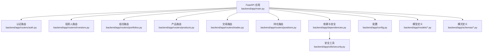
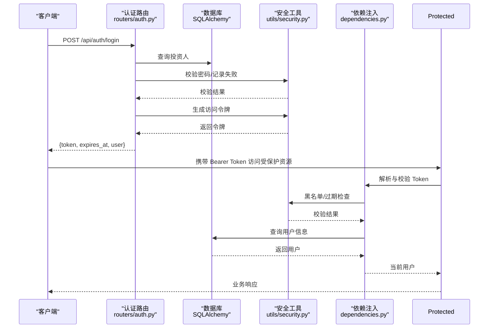
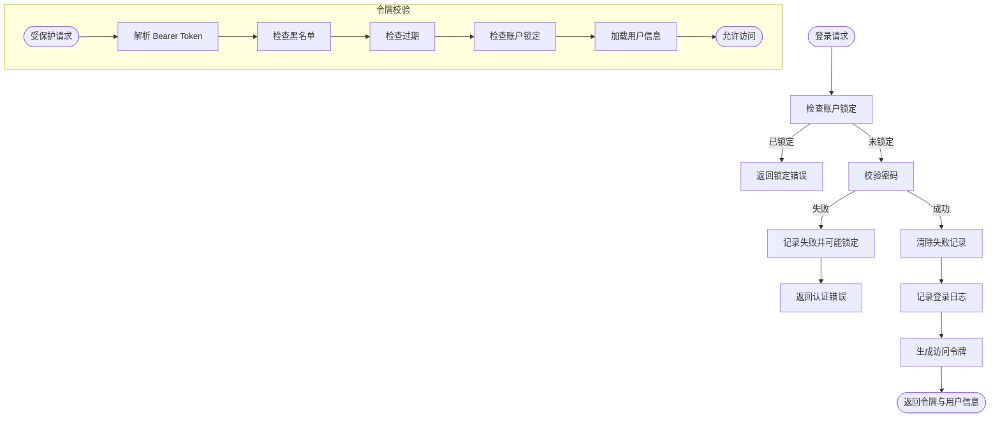
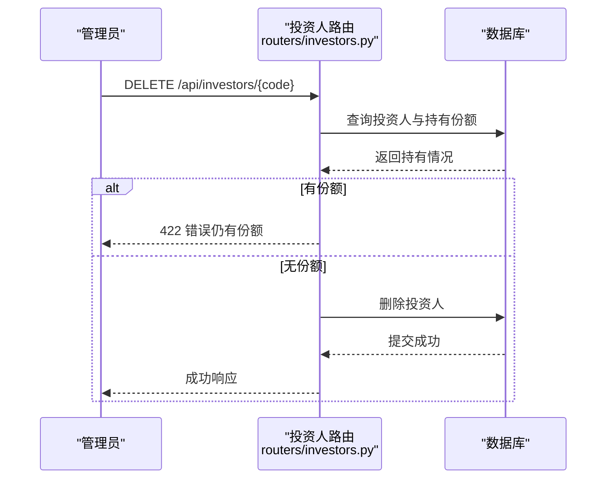
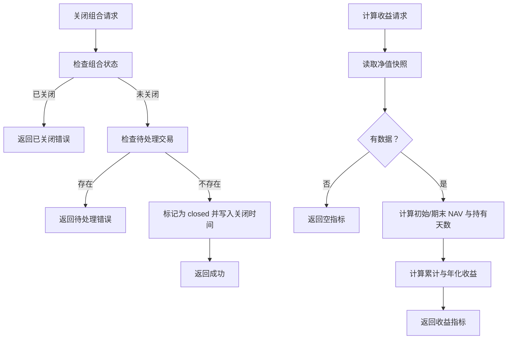
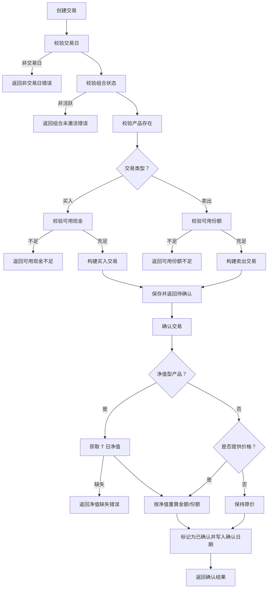
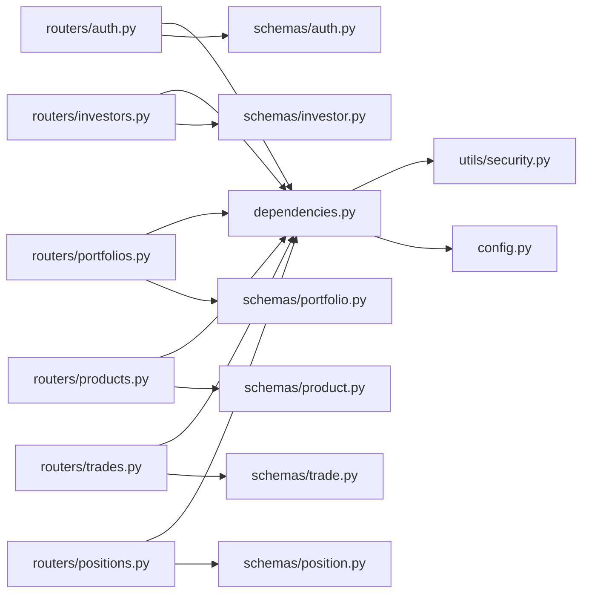

# API 设计规范

<cite>
**本文引用的文件**
- [backend/app/main.py](file://backend/app/main.py)
- [backend/app/config.py](file://backend/app/config.py)
- [backend/app/dependencies.py](file://backend/app/dependencies.py)
- [backend/app/utils/security.py](file://backend/app/utils/security.py)
- [backend/app/routers/auth.py](file://backend/app/routers/auth.py)
- [backend/app/schemas/auth.py](file://backend/app/schemas/auth.py)
- [backend/app/models/investor.py](file://backend/app/models/investor.py)
- [backend/app/routers/investors.py](file://backend/app/routers/investors.py)
- [backend/app/schemas/investor.py](file://backend/app/schemas/investor.py)
- [backend/app/routers/portfolios.py](file://backend/app/routers/portfolios.py)
- [backend/app/routers/products.py](file://backend/app/routers/products.py)
- [backend/app/schemas/product.py](file://backend/app/schemas/product.py)
- [backend/app/routers/trades.py](file://backend/app/routers/trades.py)
- [backend/app/schemas/trade.py](file://backend/app/schemas/trade.py)
- [backend/app/routers/positions.py](file://backend/app/routers/positions.py)
</cite>

## 目录
1. [引言](#引言)
2. [项目结构](#项目结构)
3. [核心组件](#核心组件)
4. [架构总览](#架构总览)
5. [详细组件分析](#详细组件分析)
6. [依赖分析](#依赖分析)
7. [性能考虑](#性能考虑)
8. [故障排查指南](#故障排查指南)
9. [结论](#结论)
10. [附录](#附录)

## 引言
本规范面向 InvestRing 后端 API 的设计与实现，基于实际代码仓库总结出统一的 RESTful 设计原则、资源命名与 URL 结构、请求响应格式、错误处理规范、认证授权机制、分页与过滤、版本管理策略，以及 OpenAPI 文档规范建议。目标是确保 API 的一致性、可维护性与可扩展性，便于前后端协作与长期演进。

## 项目结构
后端采用 FastAPI + SQLAlchemy 架构，按“路由器(routers) + 模型(models) + 模式(schemas)”分层组织，主应用入口集中注册各模块路由并配置跨域与基础元信息。

**图表来源**
- [backend/app/main.py:17-48](file://backend/app/main.py#L17-L48)
- [backend/app/routers/auth.py:25](file://backend/app/routers/auth.py#L25)
- [backend/app/routers/investors.py:11](file://backend/app/routers/investors.py#L11)
- [backend/app/routers/portfolios.py:15](file://backend/app/routers/portfolios.py#L15)
- [backend/app/routers/products.py:9](file://backend/app/routers/products.py#L9)
- [backend/app/routers/trades.py:108](file://backend/app/routers/trades.py#L108)
- [backend/app/routers/positions.py:16](file://backend/app/routers/positions.py#L16)
- [backend/app/dependencies.py:49](file://backend/app/dependencies.py#L49)
- [backend/app/utils/security.py:29](file://backend/app/utils/security.py#L29)
- [backend/app/config.py:5](file://backend/app/config.py#L5)

**章节来源**
- [backend/app/main.py:17-48](file://backend/app/main.py#L17-L48)

## 核心组件
- 应用入口与路由注册：集中于主应用文件，统一挂载各业务模块路由并设置标题、描述、版本与跨域策略。
- 安全与鉴权：基于 HTTP Bearer Token 的 JWT 鉴权，结合黑名单、账户锁定与登录日志。
- 数据模型与模式：使用 Pydantic 模型作为请求/响应载体，SQLAlchemy 模型承载持久化。
- 分页与过滤：多数列表接口支持 page/page_size 参数与基础过滤条件。

**章节来源**
- [backend/app/main.py:17-48](file://backend/app/main.py#L17-L48)
- [backend/app/dependencies.py:49-111](file://backend/app/dependencies.py#L49-L111)
- [backend/app/utils/security.py:29-47](file://backend/app/utils/security.py#L29-L47)

## 架构总览
下图展示认证流程与关键组件交互：

**图表来源**
- [backend/app/routers/auth.py:29-95](file://backend/app/routers/auth.py#L29-L95)
- [backend/app/dependencies.py:49-111](file://backend/app/dependencies.py#L49-L111)
- [backend/app/utils/security.py:29-47](file://backend/app/utils/security.py#L29-L47)

## 详细组件分析

### 认证与授权
- 路由前缀与标签：认证模块位于 /api/auth，使用 Bearer Token。
- 登录流程：校验账户锁定状态 → 校验密码 → 清除失败记录 → 记录登录日志 → 生成令牌。
- 令牌校验：解析 JWT、黑名单检查、账户锁定检查、用户存在性检查。
- 权限装饰器：require_auth 与 require_admin，分别用于登录态与管理员权限校验。
- 密码与令牌安全：bcrypt 哈希、HS256 JWT、内存级黑名单与失败追踪。

**图表来源**
- [backend/app/routers/auth.py:29-95](file://backend/app/routers/auth.py#L29-L95)
- [backend/app/dependencies.py:49-111](file://backend/app/dependencies.py#L49-L111)
- [backend/app/utils/security.py:57-102](file://backend/app/utils/security.py#L57-L102)

**章节来源**
- [backend/app/routers/auth.py:29-95](file://backend/app/routers/auth.py#L29-L95)
- [backend/app/dependencies.py:49-111](file://backend/app/dependencies.py#L49-L111)
- [backend/app/utils/security.py:29-47](file://backend/app/utils/security.py#L29-L47)
- [backend/app/schemas/auth.py:5-26](file://backend/app/schemas/auth.py#L5-L26)
- [backend/app/models/investor.py:5-17](file://backend/app/models/investor.py#L5-L17)

### 投资人管理
- 资源命名与 URL：/api/investors，支持分页与管理员权限。
- 请求/响应模式：InvestorCreate/InvestorUpdate/InvestorResponse。
- 删除约束：若仍持有份额则拒绝删除，避免数据不一致。

**图表来源**
- [backend/app/routers/investors.py:91-119](file://backend/app/routers/investors.py#L91-L119)

**章节来源**
- [backend/app/routers/investors.py:14-119](file://backend/app/routers/investors.py#L14-L119)
- [backend/app/schemas/investor.py:6-32](file://backend/app/schemas/investor.py#L6-L32)

### 组合管理
- 资源命名与 URL：/api/portfolios，支持状态过滤与分页。
- 关闭/激活组合：校验状态与待处理交易，防止数据不一致。
- 组合收益与现金流：提供历史净值、累计/年化收益与资金流水统计。

**图表来源**
- [backend/app/routers/portfolios.py:92-131](file://backend/app/routers/portfolios.py#L92-L131)
- [backend/app/routers/portfolios.py:159-241](file://backend/app/routers/portfolios.py#L159-L241)

**章节来源**
- [backend/app/routers/portfolios.py:18-276](file://backend/app/routers/portfolios.py#L18-L276)

### 产品管理
- 资源命名与 URL：/api/products，支持产品类型过滤与分页。
- 确认天数：根据市场与 QDII 属性自动计算，更新时可触发重新计算。
- 唯一性：同一 (code, market) 唯一。

**章节来源**
- [backend/app/routers/products.py:27-141](file://backend/app/routers/products.py#L27-141)
- [backend/app/schemas/product.py:6-36](file://backend/app/schemas/product.py#L6-L36)

### 交易管理
- 资源命名与 URL：/api/trades，支持按组合过滤与分页。
- 交易类型：买入/卖出，金额/份额/费率等字段控制。
- 确认逻辑：校验交易日、组合状态、可用现金/份额、净值（净值型产品）。
- 取消规则：仅场外待确认可取消，场内通常不可取消。

**图表来源**
- [backend/app/routers/trades.py:292-402](file://backend/app/routers/trades.py#L292-L402)
- [backend/app/routers/trades.py:417-504](file://backend/app/routers/trades.py#L417-L504)

**章节来源**
- [backend/app/routers/trades.py:271-567](file://backend/app/routers/trades.py#L271-L567)
- [backend/app/schemas/trade.py:6-45](file://backend/app/schemas/trade.py#L6-L45)

### 持仓管理
- 资源命名与 URL：/api/positions，支持按组合与快照日期过滤，默认返回最新快照。
- 可用现金/份额：实时计算，考虑待确认与未生成快照的交易影响。
- 非净值资产更新：仅管理员可更新 CASH 金额，需在交易日并指定平台。

**章节来源**
- [backend/app/routers/positions.py:180-410](file://backend/app/routers/positions.py#L180-L410)

## 依赖分析
- 路由到依赖：各业务路由通过依赖注入获取数据库会话与当前用户，保证权限与数据访问的一致性。
- 安全工具：集中于安全工具模块，提供密码哈希、JWT 编解码、黑名单与失败追踪。
- 配置中心：统一读取环境变量与默认值，支持数据库连接串拼装。

**图表来源**
- [backend/app/routers/auth.py:15-21](file://backend/app/routers/auth.py#L15-L21)
- [backend/app/routers/investors.py:7-9](file://backend/app/routers/investors.py#L7-L9)
- [backend/app/routers/portfolios.py:12-13](file://backend/app/routers/portfolios.py#L12-L13)
- [backend/app/routers/products.py:6-7](file://backend/app/routers/products.py#L6-L7)
- [backend/app/routers/trades.py:14-15](file://backend/app/routers/trades.py#L14-L15)
- [backend/app/routers/positions.py:13-14](file://backend/app/routers/positions.py#L13-L14)
- [backend/app/dependencies.py:49-111](file://backend/app/dependencies.py#L49-L111)
- [backend/app/utils/security.py:29-47](file://backend/app/utils/security.py#L29-L47)
- [backend/app/config.py:28-31](file://backend/app/config.py#L28-L31)

**章节来源**
- [backend/app/dependencies.py:49-111](file://backend/app/dependencies.py#L49-L111)
- [backend/app/utils/security.py:29-47](file://backend/app/utils/security.py#L29-L47)
- [backend/app/config.py:28-31](file://backend/app/config.py#L28-L31)

## 性能考虑
- 分页与查询：列表接口统一使用 offset/limit，建议在高频查询上增加索引与必要字段覆盖索引。
- 实时计算：可用现金/份额计算涉及多表聚合，建议在交易与确认流程中尽量减少重复扫描，必要时引入物化视图或缓存。
- 令牌与黑名单：当前黑名单为内存集合，生产环境建议迁移到 Redis 等持久化存储。
- 并发与锁：登录失败追踪为内存字典，建议引入分布式锁与持久化存储，避免多实例间状态不一致。

[本节为通用指导，无需具体文件引用]

## 故障排查指南
- 认证相关
  - 401 未认证：缺少或无效 Token，或 Token 已过期/被拉黑。
  - 403 禁止访问：账户被锁定或权限不足（非管理员）。
  - 登录失败：连续失败将导致临时锁定，需等待解锁或联系管理员。
- 业务相关
  - 404 未找到：资源不存在（投资人/组合/产品/交易/持仓）。
  - 422 不可处理实体：状态不符（非待确认不可取消）、非交易日、金额/份额不足、产品未同步净值等。
  - 400 错误请求：输入参数非法（如买入金额<=0、卖出份额<=0）。
- 日志与审计
  - 登录/登出/改密均记录日志，便于审计与问题定位。

**章节来源**
- [backend/app/dependencies.py:58-111](file://backend/app/dependencies.py#L58-L111)
- [backend/app/routers/auth.py:38-72](file://backend/app/routers/auth.py#L38-L72)
- [backend/app/routers/trades.py:322-336](file://backend/app/routers/trades.py#L322-L336)
- [backend/app/routers/trades.py:417-504](file://backend/app/routers/trades.py#L417-L504)

## 结论
本规范基于现有实现总结了 InvestRing 的 API 设计实践，涵盖资源命名、HTTP 方法、URL 结构、状态码、请求响应、错误处理、认证授权、分页过滤与版本管理建议。建议在后续迭代中补充 OpenAPI 规范与自动化文档生成，持续完善安全与性能优化。

[本节为总结，无需具体文件引用]

## 附录

### RESTful 设计原则与规范
- 资源命名
  - 使用名词复数形式，如 /investors、/portfolios、/products、/trades、/positions。
  - 嵌套资源使用斜杠分隔，如 /portfolios/{code}/nav-history。
- HTTP 方法
  - GET：获取列表或单个资源。
  - POST：创建资源。
  - PUT：完整更新资源。
  - DELETE：删除资源。
- URL 结构
  - 基础路径：/api/{resource} 或 /api/v1/{resource}。
  - 查询参数：page、page_size、过滤字段（如 status、portfolio_code）。
- 状态码
  - 200 OK：成功获取或更新。
  - 201 Created：成功创建。
  - 204 No Content：删除成功且无返回体。
  - 400 Bad Request：参数错误或格式错误。
  - 401 Unauthorized：未认证或 Token 无效。
  - 403 Forbidden：权限不足或账户锁定。
  - 404 Not Found：资源不存在。
  - 422 Unprocessable Entity：业务校验失败（如金额不足、状态不符）。
  - 500 Internal Server Error：服务器内部错误。

**章节来源**
- [backend/app/main.py:33-48](file://backend/app/main.py#L33-L48)
- [backend/app/routers/investors.py:14-119](file://backend/app/routers/investors.py#L14-L119)
- [backend/app/routers/portfolios.py:18-276](file://backend/app/routers/portfolios.py#L18-L276)
- [backend/app/routers/products.py:27-141](file://backend/app/routers/products.py#L27-L141)
- [backend/app/routers/trades.py:271-567](file://backend/app/routers/trades.py#L271-L567)
- [backend/app/routers/positions.py:180-410](file://backend/app/routers/positions.py#L180-L410)

### 请求与响应格式
- 统一响应结构（列表接口）
  - items：数组，元素为资源对象。
  - total：总数。
  - page、page_size：分页参数。
- 统一错误结构
  - 字段：error（错误码）、message（用户可见提示）。
  - 可选字段：如 locked_until（账户锁定截止时间）。
- 字段命名与类型
  - 使用小驼峰命名法（如 expiresAt、lockedUntil）。
  - 时间字段统一为 ISO-8601 字符串。
  - 数值字段使用浮点或十进制字符串表示，避免精度丢失。
- 嵌套对象
  - 用户信息、产品信息等作为子对象返回，保持扁平化与可读性。

**章节来源**
- [backend/app/routers/investors.py:24-29](file://backend/app/routers/investors.py#L24-L29)
- [backend/app/routers/portfolios.py:180-191](file://backend/app/routers/portfolios.py#L180-L191)
- [backend/app/routers/auth.py:42-48](file://backend/app/routers/auth.py#L42-L48)
- [backend/app/schemas/auth.py:16-19](file://backend/app/schemas/auth.py#L16-L19)
- [backend/app/schemas/investor.py:25-32](file://backend/app/schemas/investor.py#L25-L32)

### 错误处理规范
- 错误码定义
  - ACCOUNT_LOCKED：账户锁定。
  - INVALID_CREDENTIALS：凭证无效。
  - FORBIDDEN：权限不足。
  - OLD_PASSWORD_REQUIRED：修改密码需提供旧密码。
  - INVALID_OLD_PASSWORD：旧密码错误。
  - PORTFOLIO_ALREADY_CLOSED、PORTFOLIO_NOT_CLOSED：组合状态错误。
  - PENDING_TRANSACTIONS_EXIST：存在待处理交易。
  - NON_TRADING_DAY：非交易日。
  - INVALID_AMOUNT、INVALID_SHARES：金额/份额非法。
  - INSUFFICIENT_CASH、INSUFFICIENT_SHARES：资金/份额不足。
  - MISSING_NAV、MISSING_QDII_NAV：净值缺失。
  - INVALID_STATUS：状态不符。
  - CANNOT_CANCEL_EXCHANGE：场内交易不可取消。
  - PORTFOLIO_NOT_FOUND、PLATFORM_NOT_FOUND：关联资源不存在。
- 错误消息格式
  - 包含 machine-readable error 与 human-readable message。
  - 可选携带上下文字段（如 locked_until）。
- 异常捕获与用户友好提示
  - 在路由层捕获业务异常并返回标准化错误。
  - 对敏感信息（如密码）不回显。

**章节来源**
- [backend/app/routers/auth.py:42-72](file://backend/app/routers/auth.py#L42-L72)
- [backend/app/routers/portfolios.py:103-106](file://backend/app/routers/portfolios.py#L103-L106)
- [backend/app/routers/trades.py:322-336](file://backend/app/routers/trades.py#L322-L336)
- [backend/app/routers/trades.py:458-464](file://backend/app/routers/trades.py#L458-L464)

### 认证与授权机制
- JWT 令牌
  - HS256 算法，secret_key 来自配置。
  - 载荷包含 sub（用户编码）、role（角色）与 exp（过期时间）。
- 权限级别
  - viewer：普通查看者。
  - admin：管理员，具备更高权限。
- 中间件与依赖
  - HTTP Bearer 授权，自动错误处理。
  - get_current_user：获取当前用户并校验。
  - get_current_admin：管理员校验。
- 安全头与配置
  - CORS 允许所有来源与方法，生产环境应收紧。
  - token_expire_days 控制令牌有效期。

**章节来源**
- [backend/app/utils/security.py:29-47](file://backend/app/utils/security.py#L29-L47)
- [backend/app/dependencies.py:49-111](file://backend/app/dependencies.py#L49-L111)
- [backend/app/config.py:14-16](file://backend/app/config.py#L14-L16)
- [backend/app/main.py:23-30](file://backend/app/main.py#L23-L30)

### 分页与过滤规范
- 查询参数
  - page：页码（默认 1）。
  - page_size：每页数量（默认 20，建议限制最大值）。
  - 其他过滤：如 status、portfolio_code、product_type、start_date/end_date 等。
- 排序规则
  - 列表默认按创建时间倒序或其他明确顺序，必要时提供 sort 参数。
- 分页大小限制
  - 建议在路由层限制 page_size 上限，防止资源滥用。
- 搜索条件
  - 支持模糊匹配与范围查询，注意索引优化。

**章节来源**
- [backend/app/routers/investors.py:16-29](file://backend/app/routers/investors.py#L16-L29)
- [backend/app/routers/portfolios.py:20-36](file://backend/app/routers/portfolios.py#L20-L36)
- [backend/app/routers/products.py:30-45](file://backend/app/routers/products.py#L30-L45)
- [backend/app/routers/trades.py:275-289](file://backend/app/routers/trades.py#L275-L289)
- [backend/app/routers/positions.py:184-218](file://backend/app/routers/positions.py#L184-L218)

### API 版本管理
- 版本号策略
  - 当前应用版本为 1.0.0，快照模块使用 /api/v1 前缀。
- 向后兼容性
  - 新增字段建议可选，避免破坏既有客户端。
- 废弃 API 处理
  - 保留过渡期并提供迁移指引，逐步移除。
- 迁移指南
  - 变更字段名或语义时，提供双轨期并在响应中兼容旧字段一段时间。

**章节来源**
- [backend/app/main.py:20](file://backend/app/main.py#L20)
- [backend/app/main.py:48](file://backend/app/main.py#L48)

### OpenAPI 文档规范
- 规范遵循
  - 使用 FastAPI 自动生成 OpenAPI 文档，确保路径、参数、响应模型与错误码一致。
- 端点描述
  - 为每个路由添加简短描述与示例请求/响应。
- 示例请求与响应
  - 提供典型场景示例，便于联调与测试。
- 标签与分组
  - 使用 tags 对端点进行分类（认证、投资人管理、组合管理等）。

**章节来源**
- [backend/app/main.py:17-21](file://backend/app/main.py#L17-L21)
- [backend/app/main.py:33-48](file://backend/app/main.py#L33-L48)