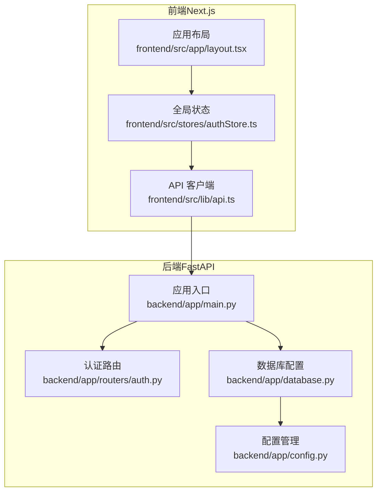
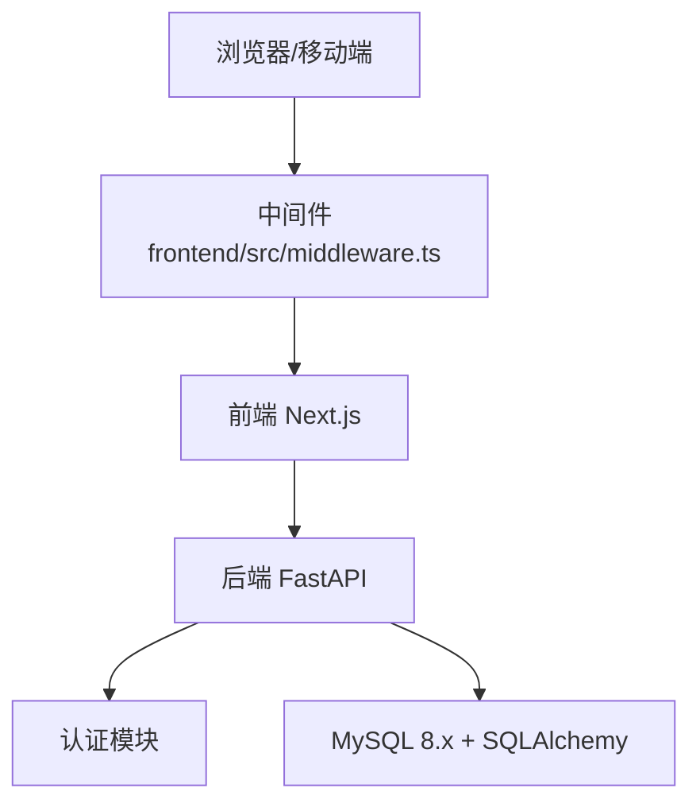
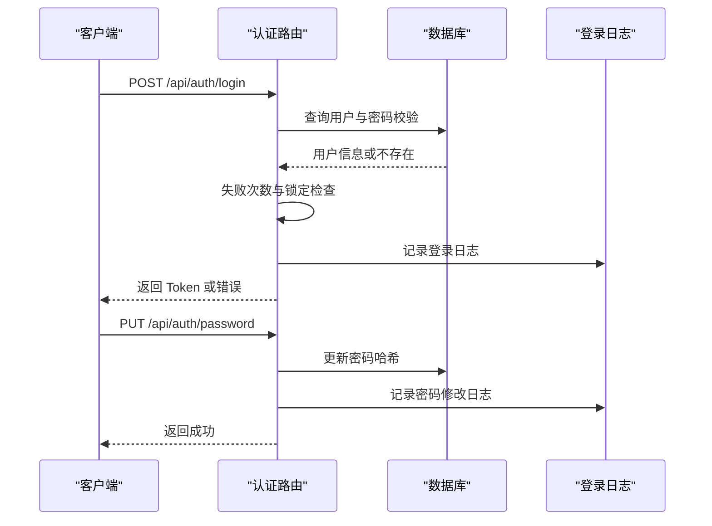
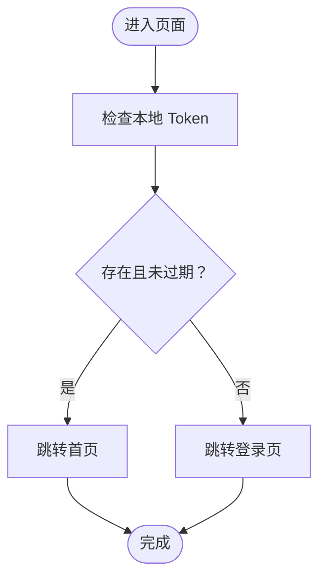
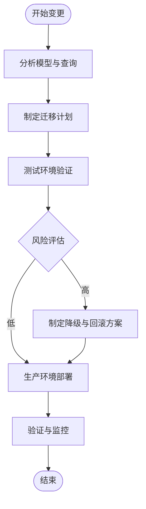
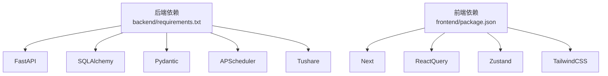

# 代码审查清单

<cite>
**本文引用的文件**
- [Docs/00-开发总览.md](file://Docs/00-开发总览.md)
- [Docs/04-后端开发.md](file://Docs/04-后端开发.md)
- [Docs/05-前端开发.md](file://Docs/05-前端开发.md)
- [backend/app/main.py](file://backend/app/main.py)
- [backend/app/routers/auth.py](file://backend/app/routers/auth.py)
- [backend/app/config.py](file://backend/app/config.py)
- [backend/app/database.py](file://backend/app/database.py)
- [backend/requirements.txt](file://backend/requirements.txt)
- [frontend/src/lib/api.ts](file://frontend/src/lib/api.ts)
- [frontend/src/stores/authStore.ts](file://frontend/src/stores/authStore.ts)
- [frontend/src/app/layout.tsx](file://frontend/src/app/layout.tsx)
- [frontend/package.json](file://frontend/package.json)
</cite>

## 目录
1. [简介](#简介)
2. [项目结构](#项目结构)
3. [核心组件](#核心组件)
4. [架构总览](#架构总览)
5. [详细组件分析](#详细组件分析)
6. [依赖分析](#依赖分析)
7. [性能考量](#性能考量)
8. [故障排查指南](#故障排查指南)
9. [结论](#结论)
10. [附录](#附录)

## 简介
本清单面向 InvestRing 项目的后端与前端代码，提供系统化的代码审查检查项，覆盖代码风格、安全性、性能与可维护性；同时给出前端组件设计、状态管理、用户体验与浏览器兼容性要点；并制定数据库变更审查流程、API 接口审查标准、测试覆盖率要求、部署检查项以及工具推荐。

## 项目结构
InvestRing 采用前后端分离架构：后端基于 FastAPI + SQLAlchemy，前端基于 Next.js 14 App Router + shadcn/ui + TailwindCSS。文档与核心模块如下：
- 后端模块：认证、投资人管理、组合管理、持仓管理、交易管理、份额变动事件、市场数据、产品管理、平台管理、日志与任务、快照管理等。
- 前端模块：双端独立路由（移动端 /m/ 与 PC 端根路径）、认证与权限、全局状态（Zustand + React Query）、PWA 与响应式设计。

**图表来源**
- [backend/app/main.py:1-53](file://backend/app/main.py#L1-L53)
- [backend/app/routers/auth.py:1-186](file://backend/app/routers/auth.py#L1-L186)
- [backend/app/database.py:1-39](file://backend/app/database.py#L1-L39)
- [backend/app/config.py:1-37](file://backend/app/config.py#L1-L37)
- [frontend/src/lib/api.ts:1-627](file://frontend/src/lib/api.ts#L1-L627)
- [frontend/src/stores/authStore.ts:1-71](file://frontend/src/stores/authStore.ts#L1-L71)
- [frontend/src/app/layout.tsx:1-32](file://frontend/src/app/layout.tsx#L1-L32)

**章节来源**
- [Docs/00-开发总览.md:16-51](file://Docs/00-开发总览.md#L16-L51)
- [Docs/04-后端开发.md:1-800](file://Docs/04-后端开发.md#L1-L800)
- [Docs/05-前端开发.md:1-641](file://Docs/05-前端开发.md#L1-L641)

## 核心组件
- 后端应用入口负责注册路由、初始化数据库与定时任务、配置 CORS。
- 认证路由提供登录、登出、修改密码接口，包含登录失败锁定、Token 黑名单与登录日志记录。
- 数据库配置使用连接池、echo 与 SQLite 特殊 PRAGMA 设置。
- 配置管理通过 pydantic-settings 读取 .env，支持数据库、安全与应用参数。
- 前端 API 客户端封装 axios，统一请求/响应拦截与错误处理；全局状态使用 Zustand 并持久化；布局集成 Providers。

**章节来源**
- [backend/app/main.py:1-53](file://backend/app/main.py#L1-L53)
- [backend/app/routers/auth.py:1-186](file://backend/app/routers/auth.py#L1-L186)
- [backend/app/database.py:1-39](file://backend/app/database.py#L1-L39)
- [backend/app/config.py:1-37](file://backend/app/config.py#L1-L37)
- [frontend/src/lib/api.ts:1-627](file://frontend/src/lib/api.ts#L1-L627)
- [frontend/src/stores/authStore.ts:1-71](file://frontend/src/stores/authStore.ts#L1-L71)
- [frontend/src/app/layout.tsx:1-32](file://frontend/src/app/layout.tsx#L1-L32)

## 架构总览
后端采用模块化路由组织，前端通过 App Router 的文件系统路由与中间件实现双端独立路由与权限控制。认证采用 HMAC Token（7天有效期），后端提供登录失败锁定与日志审计。

**图表来源**
- [Docs/05-前端开发.md:124-173](file://Docs/05-前端开发.md#L124-L173)
- [Docs/04-后端开发.md:8-69](file://Docs/04-后端开发.md#L8-L69)
- [backend/app/main.py:17-53](file://backend/app/main.py#L17-L53)

## 详细组件分析

### 后端认证模块审查要点
- 接口设计合理性：登录/登出/修改密码接口清晰，参数与响应模型明确。
- 参数验证完整性：登录失败次数与锁定逻辑、密码强度与修改权限校验。
- 错误处理规范性：HTTP 状态码与错误体字段一致，包含错误码与消息。
- 安全性审查：bcrypt 哈希、Token 黑名单、登录日志、失败锁定与过期策略。
- 可维护性评价：路由与依赖注入清晰，日志与审计完善。

**图表来源**
- [backend/app/routers/auth.py:29-186](file://backend/app/routers/auth.py#L29-L186)
- [Docs/04-后端开发.md:8-69](file://Docs/04-后端开发.md#L8-L69)

**章节来源**
- [backend/app/routers/auth.py:1-186](file://backend/app/routers/auth.py#L1-L186)
- [Docs/04-后端开发.md:8-69](file://Docs/04-后端开发.md#L8-L69)

### 前端认证与状态管理审查要点
- 组件设计合理性：API 客户端集中封装请求与错误处理，避免重复逻辑。
- 状态管理正确性：Zustand Store 与持久化结合，Token 同时写入 localStorage 与 Cookie。
- 用户体验考虑：登录失败提示、权限隐藏入口、401 自动跳转登录。
- 浏览器兼容性：Next.js App Router 与现代浏览器；PWA manifest 与缓存策略。

**图表来源**
- [frontend/src/stores/authStore.ts:18-71](file://frontend/src/stores/authStore.ts#L18-L71)
- [frontend/src/lib/api.ts:50-79](file://frontend/src/lib/api.ts#L50-L79)
- [Docs/05-前端开发.md:552-641](file://Docs/05-前端开发.md#L552-L641)

**章节来源**
- [frontend/src/lib/api.ts:1-627](file://frontend/src/lib/api.ts#L1-L627)
- [frontend/src/stores/authStore.ts:1-71](file://frontend/src/stores/authStore.ts#L1-L71)
- [Docs/05-前端开发.md:552-641](file://Docs/05-前端开发.md#L552-L641)

### 数据库变更审查流程
- 模型修改影响分析：新增/修改字段对现有查询与序列化的影响；迁移脚本与回滚策略。
- 数据迁移风险评估：数据类型变更、索引重建、大数据量表的锁表风险与分批处理。
- 索引优化建议：根据查询模式（组合净值、产品价格、交易记录）建立复合索引与覆盖索引；避免冗余索引。

**图表来源**
- [backend/app/database.py:7-16](file://backend/app/database.py#L7-L16)
- [backend/app/config.py:5-32](file://backend/app/config.py#L5-L32)

**章节来源**
- [backend/app/database.py:1-39](file://backend/app/database.py#L1-L39)
- [backend/app/config.py:1-37](file://backend/app/config.py#L1-L37)

### API 接口审查标准
- 接口设计合理性：路径命名与 HTTP 方法符合 REST 规范；模块化路由清晰。
- 参数验证完整性：查询参数与请求体的必填/可选、范围与格式校验。
- 错误处理规范性：统一错误体字段（error、message），状态码与业务错误一一对应。
- 文档完整性：接口定义与业务规则一致，限流与幂等性说明清晰。

**章节来源**
- [Docs/04-后端开发.md:1-800](file://Docs/04-后端开发.md#L1-L800)
- [backend/app/main.py:32-49](file://backend/app/main.py#L32-L49)

### 测试覆盖率要求
- 单元测试：核心业务函数（加密、Token、校验规则）与工具函数。
- 集成测试：关键路由与数据库交互（认证、组合、交易、份额变动事件）。
- 端到端测试：用户登录、组合创建与激活、交易流程、份额变动事件确认。

**章节来源**
- [backend/requirements.txt:15-16](file://backend/requirements.txt#L15-L16)

### 部署相关检查
- 环境变量配置：数据库连接、Secret Key、Tushare Token、应用调试开关。
- 依赖版本管理：后端 Python 依赖与前端 Node 依赖版本锁定与升级策略。
- 安全漏洞扫描：依赖扫描（pip-audit、npm audit）、敏感信息泄露检查。
- 性能基准测试：数据库连接池参数、API 响应时间与并发测试。

**章节来源**
- [backend/app/config.py:5-32](file://backend/app/config.py#L5-L32)
- [backend/app/database.py:7-16](file://backend/app/database.py#L7-L16)
- [backend/requirements.txt:1-19](file://backend/requirements.txt#L1-L19)
- [frontend/package.json:1-45](file://frontend/package.json#L1-L45)

### 代码审查工具推荐
- 静态分析与代码质量：
  - 后端：flake8、bandit、mypy、sqlalchemy-_utils（SQL 辅助检查）。
  - 前端：ESLint（eslint-config-next）、TypeScript 编译检查。
- 自动化测试集成：pytest（后端）、Jest（前端，如需）。
- 安全与依赖扫描：pip-audit、osv-scanner、npm audit。
- 性能与基准：locust（后端 API 压测）、Lighthouse（前端性能与 PWA）。

## 依赖分析
后端依赖以 FastAPI 为核心，配合 SQLAlchemy、Pydantic、APScheduler、Tushare 等；前端依赖 Next.js、React Query、Zustand、TailwindCSS。

**图表来源**
- [backend/requirements.txt:1-19](file://backend/requirements.txt#L1-L19)
- [frontend/package.json:11-44](file://frontend/package.json#L11-L44)

**章节来源**
- [backend/requirements.txt:1-19](file://backend/requirements.txt#L1-L19)
- [frontend/package.json:1-45](file://frontend/package.json#L1-L45)

## 性能考量
- 后端性能：
  - 数据库连接池参数（pool_size、max_overflow、pool_pre_ping）与 SQL 查询优化。
  - 限流与外部 API（Tushare）调用频率控制。
  - 定时任务调度与任务日志监控。
- 前端性能：
  - Next.js 构建优化、图片与静态资源缓存策略、PWA 缓存策略。
  - React Query 缓存与去重、虚拟滚动优化长列表。

**章节来源**
- [backend/app/database.py:7-16](file://backend/app/database.py#L7-L16)
- [Docs/04-后端开发.md:658-674](file://Docs/04-后端开发.md#L658-L674)
- [Docs/05-前端开发.md:262-282](file://Docs/05-前端开发.md#L262-L282)

## 故障排查指南
- 认证问题：检查 Token 是否过期、是否被加入黑名单、登录失败锁定状态。
- 数据库问题：连接池超时、SQLite PRAGMA 设置、事务与锁等待。
- 前端问题：Token 存储一致性（localStorage 与 Cookie）、401 自动跳转、权限入口隐藏。

**章节来源**
- [backend/app/routers/auth.py:29-186](file://backend/app/routers/auth.py#L29-L186)
- [backend/app/database.py:19-26](file://backend/app/database.py#L19-L26)
- [frontend/src/stores/authStore.ts:18-71](file://frontend/src/stores/authStore.ts#L18-L71)
- [frontend/src/lib/api.ts:50-79](file://frontend/src/lib/api.ts#L50-L79)

## 结论
本清单提供了 InvestRing 项目的系统化代码审查框架，涵盖后端与前端的关键领域。建议在每次变更中对照清单执行自审与互审，结合工具自动化与测试保障质量与稳定性。

## 附录
- 审查清单模板（可复制到团队知识库）：
  - 后端：代码风格、安全策略、性能指标、可维护性、数据库变更、API 规范、测试覆盖、部署检查。
  - 前端：组件设计、状态管理、用户体验、浏览器兼容、PWA 与性能、测试覆盖、部署检查。
  - 工具：静态分析、安全扫描、性能基准、自动化测试集成。