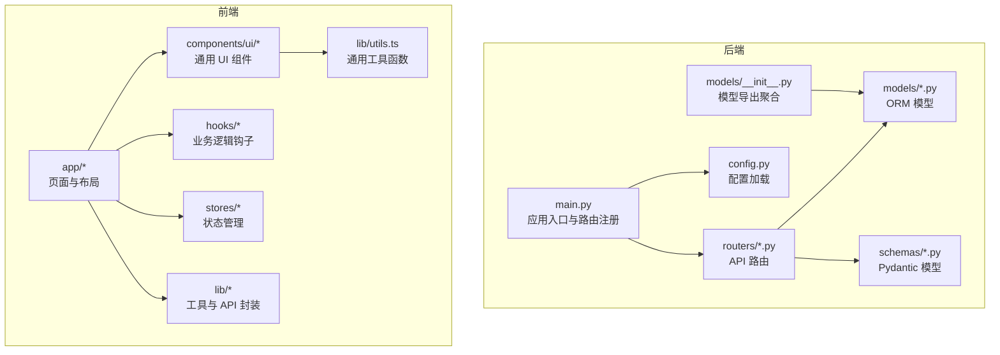
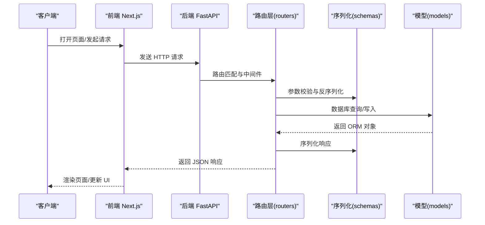
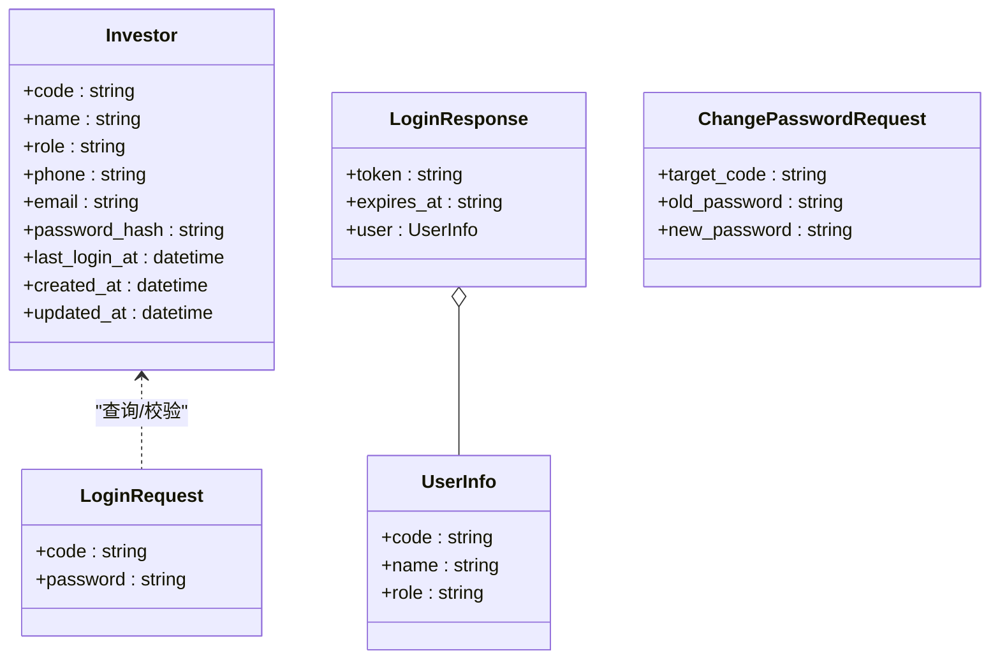
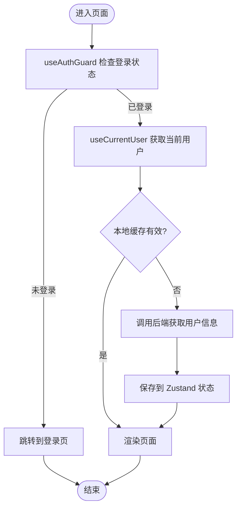
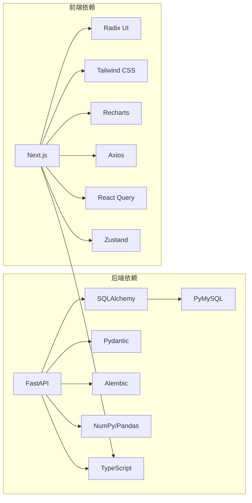

# 代码规范

<cite>
**本文引用的文件**
- [backend/requirements.txt](file://backend/requirements.txt)
- [frontend/package.json](file://frontend/package.json)
- [frontend/tsconfig.json](file://frontend/tsconfig.json)
- [frontend/tailwind.config.ts](file://frontend/tailwind.config.ts)
- [backend/app/config.py](file://backend/app/config.py)
- [backend/app/main.py](file://backend/app/main.py)
- [backend/app/models/__init__.py](file://backend/app/models/__init__.py)
- [backend/app/models/investor.py](file://backend/app/models/investor.py)
- [backend/app/schemas/auth.py](file://backend/app/schemas/auth.py)
- [backend/app/schemas/investor.py](file://backend/app/schemas/investor.py)
- [backend/app/routers/auth.py](file://backend/app/routers/auth.py)
- [frontend/src/lib/utils.ts](file://frontend/src/lib/utils.ts)
- [frontend/src/components/ui/button.tsx](file://frontend/src/components/ui/button.tsx)
- [frontend/src/hooks/useAuth.ts](file://frontend/src/hooks/useAuth.ts)
- [frontend/src/stores/authStore.ts](file://frontend/src/stores/authStore.ts)
</cite>

## 目录
1. [引言](#引言)
2. [项目结构](#项目结构)
3. [核心组件](#核心组件)
4. [架构总览](#架构总览)
5. [详细组件分析](#详细组件分析)
6. [依赖分析](#依赖分析)
7. [性能考虑](#性能考虑)
8. [故障排查指南](#故障排查指南)
9. [结论](#结论)
10. [附录](#附录)

## 引言
本文件为 InvestRing 项目的代码规范文档，面向后端 Python 与前端 TypeScript/Next.js 团队，统一开发风格、接口设计与质量保障流程。内容涵盖：
- 后端 Python：PEP8 风格、命名约定、注释规范、导入组织、API 设计与路由命名、错误处理与日志。
- 前端 TypeScript/Next.js：ESLint 配置、组件命名与样式规范、文件组织、状态管理与数据流。
- 数据库模型设计规范、API 接口设计原则、路由命名约定、注释与文档字符串标准、代码审查清单与 IDE 插件建议。

## 项目结构
项目采用前后端分离架构：
- 后端基于 FastAPI，模块化组织在 app 下，按 models/schemas/routers/services/dependencies 等职责划分。
- 前端基于 Next.js 14 App Router，采用 src 下的 app、components、hooks、lib、stores、types 等目录组织。

图表来源
- [backend/app/main.py:1-53](file://backend/app/main.py#L1-L53)
- [backend/app/models/__init__.py:1-46](file://backend/app/models/__init__.py#L1-L46)
- [frontend/src/lib/utils.ts:1-270](file://frontend/src/lib/utils.ts#L1-L270)

章节来源
- [backend/app/main.py:1-53](file://backend/app/main.py#L1-L53)
- [frontend/tsconfig.json:1-27](file://frontend/tsconfig.json#L1-L27)

## 核心组件
- 后端配置与启动：集中于配置类与应用入口，统一数据库连接、CORS、路由注册与初始化任务。
- 数据模型与序列化：ORM 模型与 Pydantic 序列化模型分离，确保数据库与 API 的边界清晰。
- 前端工具与组件：统一的工具函数库、可变 UI 组件与状态管理，配合 React Query 进行数据缓存与同步。

章节来源
- [backend/app/config.py:1-37](file://backend/app/config.py#L1-L37)
- [backend/app/models/__init__.py:1-46](file://backend/app/models/__init__.py#L1-L46)
- [frontend/src/lib/utils.ts:1-270](file://frontend/src/lib/utils.ts#L1-L270)

## 架构总览
后端通过 FastAPI 提供 REST API，前端通过 Next.js 提供页面与交互，二者通过统一的 API 协议通信。路由前缀与标签用于语义化分组，便于维护与文档生成。

图表来源
- [backend/app/main.py:32-48](file://backend/app/main.py#L32-L48)
- [backend/app/routers/auth.py:29-95](file://backend/app/routers/auth.py#L29-L95)
- [backend/app/schemas/auth.py:5-26](file://backend/app/schemas/auth.py#L5-L26)
- [backend/app/models/investor.py:5-17](file://backend/app/models/investor.py#L5-L17)

## 详细组件分析

### 后端：认证与用户模型
- 路由设计：登录、登出、改密接口，使用统一的响应模型与错误码；权限控制通过依赖注入实现。
- 模型设计：用户字段完整、时间戳默认值明确；序列化模型区分创建/更新/响应。
- 安全要点：密码哈希、Token 黑名单、登录失败记录与锁定策略。

图表来源
- [backend/app/models/investor.py:5-17](file://backend/app/models/investor.py#L5-L17)
- [backend/app/schemas/auth.py:5-26](file://backend/app/schemas/auth.py#L5-L26)
- [backend/app/schemas/investor.py:6-32](file://backend/app/schemas/investor.py#L6-L32)

章节来源
- [backend/app/routers/auth.py:29-186](file://backend/app/routers/auth.py#L29-L186)
- [backend/app/schemas/auth.py:5-26](file://backend/app/schemas/auth.py#L5-L26)
- [backend/app/schemas/investor.py:6-32](file://backend/app/schemas/investor.py#L6-L32)
- [backend/app/models/investor.py:5-17](file://backend/app/models/investor.py#L5-L17)

### 前端：认证与状态管理
- 工具函数：日期格式化、数字/货币/百分比格式化、颜色与布局辅助、市场映射等。
- UI 组件：基于 Radix UI 与 Tailwind，使用 Variance API 定义变体与尺寸。
- 钩子与状态：React Query 管理认证相关查询，Zustand 管理认证状态持久化与 Cookie 同步。

图表来源
- [frontend/src/hooks/useAuth.ts:96-115](file://frontend/src/hooks/useAuth.ts#L96-L115)
- [frontend/src/hooks/useAuth.ts:56-71](file://frontend/src/hooks/useAuth.ts#L56-L71)
- [frontend/src/stores/authStore.ts:29-71](file://frontend/src/stores/authStore.ts#L29-L71)

章节来源
- [frontend/src/lib/utils.ts:1-270](file://frontend/src/lib/utils.ts#L1-L270)
- [frontend/src/components/ui/button.tsx:1-56](file://frontend/src/components/ui/button.tsx#L1-L56)
- [frontend/src/hooks/useAuth.ts:1-134](file://frontend/src/hooks/useAuth.ts#L1-L134)
- [frontend/src/stores/authStore.ts:1-71](file://frontend/src/stores/authStore.ts#L1-L71)

## 依赖分析
- 后端依赖：FastAPI、SQLAlchemy、Pydantic、Alembic、APScheduler、NumPy/Pandas、Tushare、PyMySQL 等。
- 前端依赖：Next.js、Radix UI、Tailwind CSS、Recharts、Axios、React Query、Zustand、TypeScript 等。
- 配置与构建：tsconfig.json 使用严格模式与路径别名；Tailwind 配置启用暗色变量与扩展主题。

图表来源
- [backend/requirements.txt:1-19](file://backend/requirements.txt#L1-L19)
- [frontend/package.json:11-43](file://frontend/package.json#L11-L43)

章节来源
- [backend/requirements.txt:1-19](file://backend/requirements.txt#L1-L19)
- [frontend/package.json:1-45](file://frontend/package.json#L1-L45)
- [frontend/tsconfig.json:1-27](file://frontend/tsconfig.json#L1-L27)
- [frontend/tailwind.config.ts:1-57](file://frontend/tailwind.config.ts#L1-L57)

## 性能考虑
- 后端
  - 使用 LRU 缓存加载配置，避免重复解析环境变量。
  - 初始化任务仅在应用启动时执行一次，避免重复调度。
  - 路由前缀与标签有助于 API 文档生成与监控。
- 前端
  - React Query 设置合理的 staleTime，减少不必要的网络请求。
  - 使用 Tailwind 的原子类与变体组件，降低运行时样式计算成本。
  - 工具函数对无效输入进行快速回退，避免异常传播。

章节来源
- [backend/app/config.py:34-37](file://backend/app/config.py#L34-L37)
- [backend/app/main.py:10-15](file://backend/app/main.py#L10-L15)
- [frontend/src/hooks/useAuth.ts:68-70](file://frontend/src/hooks/useAuth.ts#L68-L70)
- [frontend/src/lib/utils.ts:17-24](file://frontend/src/lib/utils.ts#L17-L24)

## 故障排查指南
- 后端
  - 登录失败：检查账户锁定逻辑、密码哈希与旧密码校验。
  - Token 黑名单：确认登出时是否正确加入黑名单并记录日志。
  - 数据库连接：核对配置类中的数据库 URL 生成逻辑与 .env 文件。
- 前端
  - 登录状态异常：检查 Zustand 状态持久化与 Cookie 写入逻辑。
  - 页面跳转：确认 useAuthGuard 的鉴权守卫与路由替换逻辑。
  - 数据缓存：检查 React Query 的查询键与缓存清理时机。

章节来源
- [backend/app/routers/auth.py:34-72](file://backend/app/routers/auth.py#L34-L72)
- [backend/app/routers/auth.py:98-119](file://backend/app/routers/auth.py#L98-L119)
- [backend/app/config.py:28-31](file://backend/app/config.py#L28-L31)
- [frontend/src/stores/authStore.ts:37-50](file://frontend/src/stores/authStore.ts#L37-L50)
- [frontend/src/hooks/useAuth.ts:96-115](file://frontend/src/hooks/useAuth.ts#L96-L115)

## 结论
本规范文档从风格、设计、架构与质量保障四个维度统一了 InvestRing 项目的开发实践。建议团队在日常开发中遵循本文档，结合代码审查清单与 IDE 插件，持续提升代码一致性与可维护性。

## 附录

### Python 后端代码风格与规范
- 代码风格
  - 遵循 PEP8 基本要求：缩进、行宽、空行、运算符空格等。
  - 函数与类命名：使用小驼峰或下划线风格保持一致；模块与包使用小写下划线。
  - 导入组织：标准库、第三方库、项目内模块分组导入，每组内部字母序排序。
- 注释与文档
  - 函数/方法：使用简洁的英文注释说明用途、参数与返回值；复杂逻辑添加段落注释。
  - 类与模块：模块顶部添加简要描述；类定义处标注职责与关键属性。
  - TODO/FIXME：使用统一标记并在后续版本中清理。
- 错误处理
  - 明确的 HTTP 状态码与错误码；错误响应包含错误类型与可读消息。
  - 记录关键操作日志（登录、登出、改密）以便审计。
- API 设计与路由命名
  - 路由前缀：按功能域分组（如 /api/auth、/api/investors、/api/portfolios 等）。
  - 标签：使用 tags 为 OpenAPI 文档分组，便于维护。
  - 方法与路径：GET/POST/PUT/DELETE 与资源路径保持 REST 语义。
- 数据库模型设计
  - 字段命名：使用下划线风格；主键与索引字段明确标注。
  - 时间戳：使用服务器默认值与更新触发器，避免手工赋值。
  - 关系：外键与级联策略清晰，避免循环依赖。
- 测试与质量
  - 使用 pytest 与 pytest-asyncio；为关键模块编写单元测试。
  - 代码覆盖率与静态检查纳入 CI 流程。

章节来源
- [backend/app/main.py:32-48](file://backend/app/main.py#L32-L48)
- [backend/app/models/investor.py:5-17](file://backend/app/models/investor.py#L5-L17)
- [backend/app/schemas/investor.py:6-32](file://backend/app/schemas/investor.py#L6-L32)

### TypeScript/JavaScript 前端代码规范
- ESLint 配置
  - 使用 eslint-config-next，启用严格模式与 TypeScript 支持。
  - 保持规则与团队共识一致，避免未使用的变量与类型不安全。
- 组件命名与样式
  - 组件文件使用 PascalCase；UI 组件位于 components/ui 下，使用 Variance API 定义变体。
  - 样式使用 Tailwind 原子类，必要时在 tailwind.config.ts 中扩展主题。
- 文件组织
  - 页面与布局：app 下按路由组织；移动端与桌面端视图拆分。
  - 工具函数：lib 下集中管理；hooks 封装业务逻辑；stores 管理全局状态。
- 数据流与状态
  - 使用 React Query 管理服务端状态；Zustand 管理轻量本地状态。
  - 状态持久化：使用 persist 中间件，注意敏感信息不落盘。
- 路由与导航
  - App Router 下使用动态路由与嵌套路由；守卫逻辑集中在钩子中。

章节来源
- [frontend/package.json:40-43](file://frontend/package.json#L40-L43)
- [frontend/tsconfig.json:6-13](file://frontend/tsconfig.json#L6-L13)
- [frontend/tailwind.config.ts:9-51](file://frontend/tailwind.config.ts#L9-L51)
- [frontend/src/components/ui/button.tsx:6-33](file://frontend/src/components/ui/button.tsx#L6-L33)
- [frontend/src/hooks/useAuth.ts:1-134](file://frontend/src/hooks/useAuth.ts#L1-L134)
- [frontend/src/stores/authStore.ts:29-71](file://frontend/src/stores/authStore.ts#L29-L71)

### 数据库模型设计规范
- 命名约定
  - 表名与字段使用小写下划线；主键命名为 code 或 id；索引字段加 index=True。
- 字段类型
  - 字符串长度合理设置；布尔值默认值明确；时间戳字段使用 DateTime 并设置默认值。
- 关系与约束
  - 外键关系清晰；避免循环依赖；必要时使用级联删除或限制。
- 版本迁移
  - 使用 Alembic 管理迁移脚本；每次变更提交前先生成迁移并验证。

章节来源
- [backend/app/models/__init__.py:1-46](file://backend/app/models/__init__.py#L1-L46)
- [backend/app/models/investor.py:5-17](file://backend/app/models/investor.py#L5-L17)

### API 接口设计原则与路由命名约定
- 设计原则
  - 资源化：以名词复数表示资源集合，动作为动作词；幂等性明确。
  - 响应统一：成功与失败响应结构一致；错误码与消息清晰。
  - 参数校验：使用 Pydantic 在路由层完成输入校验。
- 路由命名
  - 前缀：按功能域分组（如 /api/auth、/api/investors、/api/portfolios 等）。
  - 标签：tags 用于 OpenAPI 分组，便于维护。
- 示例参考
  - 认证路由：登录、登出、改密；使用统一响应模型与错误码。

章节来源
- [backend/app/main.py:32-48](file://backend/app/main.py#L32-L48)
- [backend/app/routers/auth.py:29-186](file://backend/app/routers/auth.py#L29-L186)

### 代码注释标准与文档字符串格式
- 函数/方法
  - 简洁英文注释，说明用途、参数、返回值与异常。
  - 复杂算法或业务规则添加段落注释，解释“为什么”而非“是什么”。
- 类与模块
  - 模块顶部添加简要描述；类定义处标注职责与关键属性。
- 文档字符串
  - 使用三重引号；首行简述，空一行后详述参数与返回。
- 错误处理注释
  - 明确抛出的异常类型与上下文信息，便于上层捕获与提示。

章节来源
- [backend/app/routers/auth.py:98-119](file://backend/app/routers/auth.py#L98-L119)
- [backend/app/routers/auth.py:129-133](file://backend/app/routers/auth.py#L129-L133)

### 错误处理规范
- 后端
  - 使用 HTTPException 抛出明确状态码与错误信息；记录登录/登出/改密日志。
  - 账户锁定与失败次数统计，防止暴力破解。
- 前端
  - 使用 React Query 的错误回调统一处理；Toast 提示用户可读信息。
  - 登录失败与改密失败分别提示不同原因，引导用户修正。

章节来源
- [backend/app/routers/auth.py:37-72](file://backend/app/routers/auth.py#L37-L72)
- [frontend/src/hooks/useAuth.ts:17-35](file://frontend/src/hooks/useAuth.ts#L17-L35)
- [frontend/src/hooks/useAuth.ts:77-93](file://frontend/src/hooks/useAuth.ts#L77-L93)

### 代码审查检查清单
- 后端
  - 配置加载：是否使用缓存；数据库 URL 生成是否正确。
  - 路由设计：前缀与标签是否一致；响应模型是否统一。
  - 安全：密码哈希、Token 黑名单、登录失败记录是否完善。
  - 日志：关键操作是否记录日志；错误是否上报。
- 前端
  - 组件：变体与尺寸是否符合设计；样式是否可维护。
  - 状态：Zustand 状态是否持久化；Cookie 写入是否正确。
  - 数据流：React Query 查询键是否稳定；缓存策略是否合理。
  - 导航：鉴权守卫是否覆盖所有受保护页面。

章节来源
- [backend/app/config.py:34-37](file://backend/app/config.py#L34-L37)
- [backend/app/main.py:32-48](file://backend/app/main.py#L32-L48)
- [frontend/src/stores/authStore.ts:37-50](file://frontend/src/stores/authStore.ts#L37-L50)
- [frontend/src/hooks/useAuth.ts:96-115](file://frontend/src/hooks/useAuth.ts#L96-L115)

### IDE 配置建议与插件推荐
- Python
  - VSCode：Python、Pylance、Black、Flake8、isort、SQLAlchemy Extension。
  - PyCharm：启用 PEP8 检查、SQLAlchemy 代码辅助。
- TypeScript/Next.js
  - VSCode：ESLint、Prettier、Tailwind CSS IntelliSense、TypeScript Importer。
  - WebStorm：启用 ESLint 与 TypeScript 支持。
- 通用
  - Git 提交前执行格式化与静态检查；CI 中集成覆盖率与安全扫描。