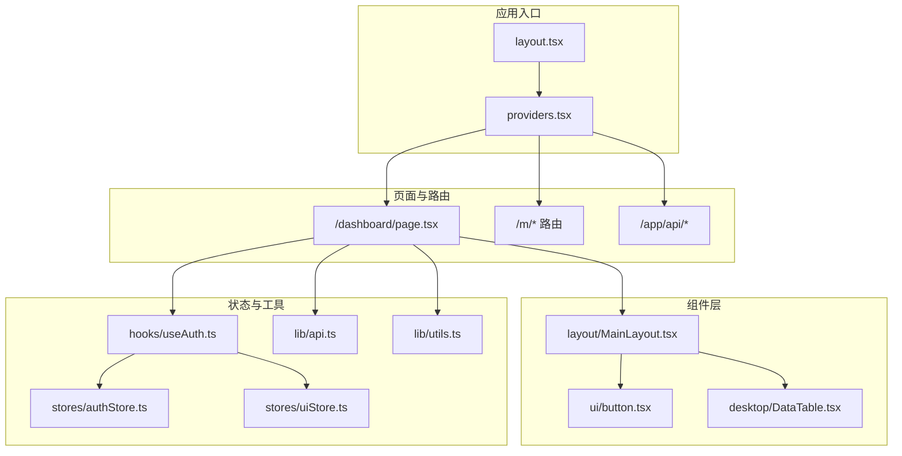
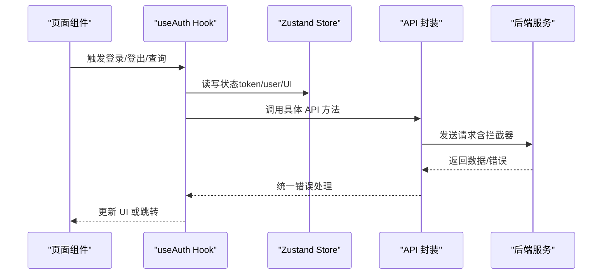
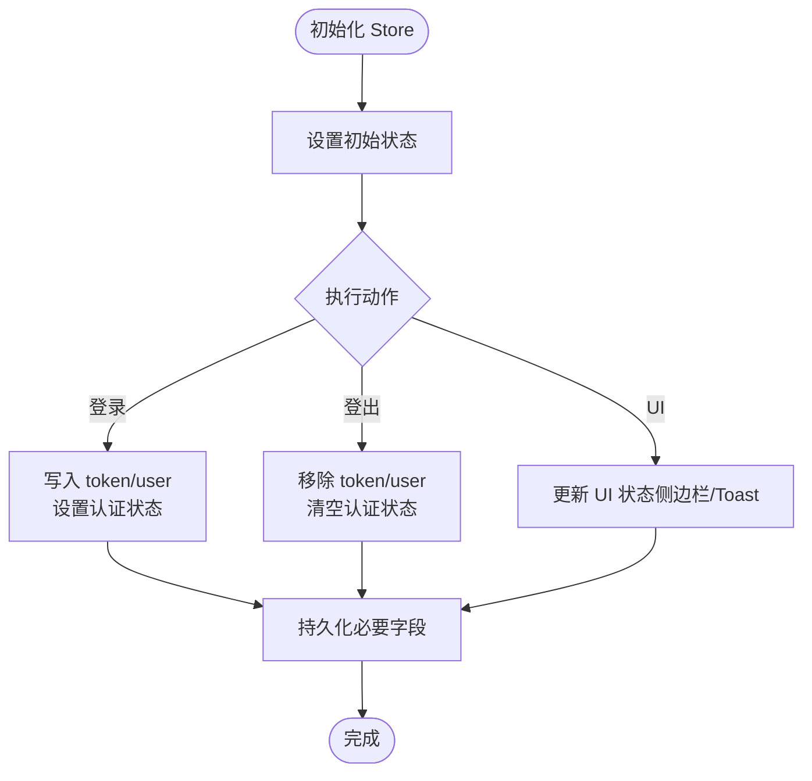
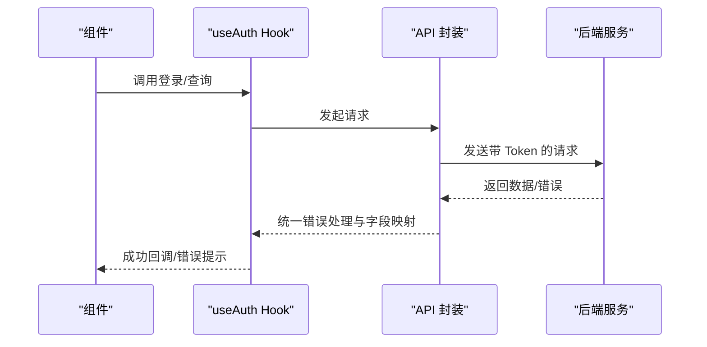
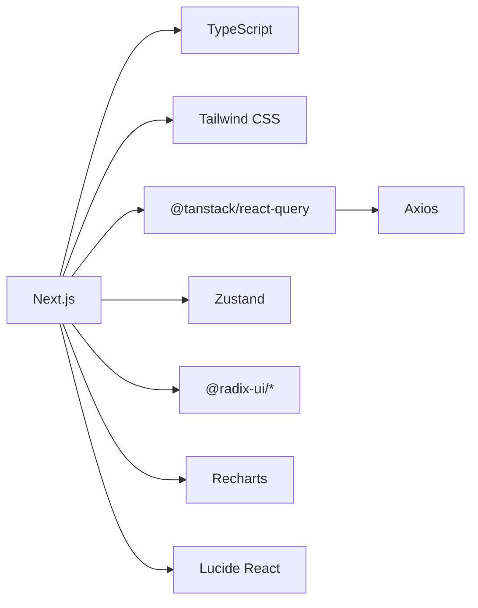

# 前端代码规范

<cite>
**本文引用的文件**
- [package.json](file://frontend/package.json)
- [tsconfig.json](file://frontend/tsconfig.json)
- [tailwind.config.ts](file://frontend/tailwind.config.ts)
- [next.config.js](file://frontend/next.config.js)
- [postcss.config.js](file://frontend/postcss.config.js)
- [middleware.ts](file://frontend/src/middleware.ts)
- [layout.tsx](file://frontend/src/app/layout.tsx)
- [providers.tsx](file://frontend/src/app/providers.tsx)
- [api.ts](file://frontend/src/lib/api.ts)
- [utils.ts](file://frontend/src/lib/utils.ts)
- [auth.ts](file://frontend/src/types/auth.ts)
- [common.ts](file://frontend/src/types/common.ts)
- [cash-transfer.ts](file://frontend/src/types/cash-transfer.ts)
- [trade.ts](file://frontend/src/types/trade.ts)
- [snapshot.ts](file://frontend/src/types/snapshot.ts)
- [authStore.ts](file://frontend/src/stores/authStore.ts)
- [uiStore.ts](file://frontend/src/stores/uiStore.ts)
- [useAuth.ts](file://frontend/src/hooks/useAuth.ts)
- [MainLayout.tsx](file://frontend/src/components/layout/MainLayout.tsx)
- [button.tsx](file://frontend/src/components/ui/button.tsx)
- [DataTable.tsx](file://frontend/src/components/desktop/DataTable.tsx)
</cite>

## 更新摘要
**所做更改**
- 更新了 TypeScript 类型定义以反映新的字段命名约定，特别是 cash_amount 和语义化日期字段
- 修订了 API 客户端以处理新的数据格式和字段映射
- 增强了类型系统以支持更精确的财务数据和日期处理
- 更新了相关组件以适配新的字段结构

## 目录
1. [引言](#引言)
2. [项目结构](#项目结构)
3. [核心组件](#核心组件)
4. [架构总览](#架构总览)
5. [详细组件分析](#详细组件分析)
6. [依赖关系分析](#依赖关系分析)
7. [性能考量](#性能考量)
8. [故障排查指南](#故障排查指南)
9. [结论](#结论)
10. [附录](#附录)

## 引言
本规范旨在统一 InvestRing 前端工程的编码风格与最佳实践，覆盖 TypeScript 接口与类型注解、React 组件设计与 Hooks 使用、Next.js 应用结构与中间件策略、组件命名与目录组织、样式与主题规范、状态管理（Zustand）以及 ESLint/Prettier 配置建议。目标是提升代码一致性、可维护性与协作效率。

**更新** 本次更新重点反映了前端 TypeScript 类型和 API 客户端对新的字段命名约定的支持，特别是 cash_amount 字段和语义化日期字段的处理。

## 项目结构
前端采用 Next.js App Router 架构，核心目录如下：
- src/app：页面路由、布局、全局提供者与 API 路由
- src/components：按功能域拆分的 UI 组件与业务组件
- src/hooks：自定义 Hooks
- src/lib：API 封装与通用工具
- src/stores：Zustand 状态存储
- src/types：共享类型定义
- 配置文件：tsconfig.json、tailwind.config.ts、next.config.js、postcss.config.js、middleware.ts

**图表来源**
- [layout.tsx:19-31](file://frontend/src/app/layout.tsx#L19-L31)
- [providers.tsx:7-27](file://frontend/src/app/providers.tsx#L7-L27)
- [MainLayout.tsx:10-40](file://frontend/src/components/layout/MainLayout.tsx#L10-L40)
- [button.tsx:41-55](file://frontend/src/components/ui/button.tsx#L41-L55)
- [DataTable.tsx:32-124](file://frontend/src/components/desktop/DataTable.tsx#L32-L124)
- [authStore.ts:29-70](file://frontend/src/stores/authStore.ts#L29-L70)
- [uiStore.ts:40-84](file://frontend/src/stores/uiStore.ts#L40-L84)
- [useAuth.ts:12-133](file://frontend/src/hooks/useAuth.ts#L12-L133)
- [api.ts:41-129](file://frontend/src/lib/api.ts#L41-L129)
- [utils.ts:8-10](file://frontend/src/lib/utils.ts#L8-L10)

章节来源
- [layout.tsx:19-31](file://frontend/src/app/layout.tsx#L19-L31)
- [providers.tsx:7-27](file://frontend/src/app/providers.tsx#L7-L27)

## 核心组件
- 类型系统：通过 src/types 下的接口与枚举统一数据契约，避免魔法字符串与不一致的字段命名。**更新** 新增了针对 cash_amount 和语义化日期字段的专门类型定义。
- API 层：以模块化方式封装各领域 API，集中处理请求/响应拦截与错误转换。**更新** 增强了字段映射逻辑以支持新的命名约定。
- 状态管理：使用 Zustand 管理认证与 UI 状态，并结合持久化中间件提升体验。
- 工具函数：提供日期、货币、百分比、颜色等格式化工具，保证展示一致性。**更新** 增强了对新日期格式的支持。
- 自定义 Hooks：围绕认证、查询、变更进行封装，复用逻辑并保持组件简洁。

章节来源
- [common.ts:1-30](file://frontend/src/types/common.ts#L1-L30)
- [auth.ts:1-23](file://frontend/src/types/auth.ts#L1-L23)
- [cash-transfer.ts:1-50](file://frontend/src/types/cash-transfer.ts#L1-L50)
- [trade.ts:1-80](file://frontend/src/types/trade.ts#L1-L80)
- [snapshot.ts:1-60](file://frontend/src/types/snapshot.ts#L1-L60)
- [api.ts:41-129](file://frontend/src/lib/api.ts#L41-L129)
- [authStore.ts:18-70](file://frontend/src/stores/authStore.ts#L18-L70)
- [uiStore.ts:4-84](file://frontend/src/stores/uiStore.ts#L4-L84)
- [utils.ts:17-269](file://frontend/src/lib/utils.ts#L17-L269)
- [useAuth.ts:12-133](file://frontend/src/hooks/useAuth.ts#L12-L133)

## 架构总览
下图展示了从页面到状态与 API 的典型调用链路，体现"页面组件 → 自定义 Hooks → Zustand Store → API 封装"的分层职责。

**图表来源**
- [useAuth.ts:12-133](file://frontend/src/hooks/useAuth.ts#L12-L133)
- [authStore.ts:29-70](file://frontend/src/stores/authStore.ts#L29-L70)
- [api.ts:41-129](file://frontend/src/lib/api.ts#L41-L129)

## 详细组件分析

### TypeScript 编码规范
- 接口与类型
  - 所有对外数据结构使用接口或类型别名定义，字段明确、可选属性标注清晰。
  - 枚举优先使用联合类型表达有限集合，便于编译期校验。
  - **新增** 针对财务数据的 cash_amount 字段使用专门的数值类型，确保精度和格式化的一致性。
  - **新增** 语义化日期字段使用统一的日期类型定义，支持多种日期格式的解析和验证。
- 函数签名与参数
  - 明确区分必填与可选参数；避免使用 any，尽量使用具体类型或泛型约束。
  - 对外暴露的 API 方法统一返回 Promise<T>，内部通过 request 封装统一处理异常。
- 模块导入
  - 使用路径别名 @/* 进行相对导入，减少层级过深的相对路径。
  - 类型与常量定义放在 types 目录，避免循环依赖。

**更新** 类型系统现在更好地支持财务数据和日期字段的处理，包括金额精度控制和日期格式标准化。

章节来源
- [common.ts:1-30](file://frontend/src/types/common.ts#L1-L30)
- [auth.ts:1-23](file://frontend/src/types/auth.ts#L1-L23)
- [cash-transfer.ts:1-50](file://frontend/src/types/cash-transfer.ts#L1-L50)
- [trade.ts:1-80](file://frontend/src/types/trade.ts#L1-L80)
- [snapshot.ts:1-60](file://frontend/src/types/snapshot.ts#L1-L60)
- [api.ts:109-129](file://frontend/src/lib/api.ts#L109-L129)
- [tsconfig.json:20-22](file://frontend/tsconfig.json#L20-L22)

### React 组件设计原则
- 函数组件与 Hooks
  - 优先使用函数组件与 Hooks，避免类组件。
  - 在组件顶部集中声明所有状态与副作用，保持渲染函数纯净。
- Props 类型定义
  - 所有 props 显式声明类型，必要时使用 React.PropsWithChildren 等工具类型。
- 状态管理模式
  - 页面级状态尽量下沉至 Hooks 或 Zustand Store，组件只负责渲染与事件触发。
  - 对于跨页面共享的状态（如认证、UI），使用 Zustand 管理并持久化。

章节来源
- [MainLayout.tsx:10-40](file://frontend/src/components/layout/MainLayout.tsx#L10-L40)
- [button.tsx:35-55](file://frontend/src/components/ui/button.tsx#L35-L55)
- [DataTable.tsx:22-40](file://frontend/src/components/desktop/DataTable.tsx#L22-L40)
- [useAuth.ts:12-133](file://frontend/src/hooks/useAuth.ts#L12-L133)

### Next.js 应用结构规范
- 页面路由命名
  - 使用语义化目录命名，如 /dashboard、/investors、/portfolio/[code] 等。
  - 动态路由使用方括号包裹参数，如 [code]。
- API 路由组织
  - App Router 下的 API 路由位于 /app/api，遵循 Next.js 内置路由约定。
- 中间件使用
  - 使用 middleware.ts 实现移动端适配、登录守卫与路径重定向。
- 静态资源管理
  - 公共资源放置在 public 目录，通过绝对路径引用。
  - 字体与全局样式在根布局中引入。

章节来源
- [middleware.ts:4-39](file://frontend/src/middleware.ts#L4-L39)
- [layout.tsx:19-31](file://frontend/src/app/layout.tsx#L19-L31)
- [next.config.js:5-12](file://frontend/next.config.js#L5-L12)

### 组件命名约定
- 文件命名
  - 组件文件使用帕斯卡命名，如 Button.tsx、DataTable.tsx。
- 组件导出
  - 默认导出为组件本身，具名导出用于变体或工具函数（如 Button、buttonVariants）。
- 目录结构
  - UI 组件置于 components/ui，桌面端组件置于 components/desktop，移动端组件置于 components/mobile，布局组件置于 components/layout。

章节来源
- [button.tsx:41-55](file://frontend/src/components/ui/button.tsx#L41-L55)
- [DataTable.tsx:32-124](file://frontend/src/components/desktop/DataTable.tsx#L32-L124)
- [MainLayout.tsx:10-40](file://frontend/src/components/layout/MainLayout.tsx#L10-L40)

### 样式规范
- CSS-in-JS 与 Tailwind CSS
  - 使用 Tailwind CSS 类名进行样式编写，通过 cn(...) 合并条件类名，避免冲突。
  - 主题变量通过 CSS 变量与 tailwind.config.ts 的 theme.extend 定义，统一颜色与圆角。
- 类名规范
  - 遵循语义化命名，如 text-、bg-、border-、rounded- 等前缀。
  - 数字展示使用等宽字体与右对齐，保证对齐与可读性。
- 主题定制
  - 通过 tailwind.config.ts 扩展 colors 与 borderRadius，确保品牌一致性。

章节来源
- [utils.ts:8-10](file://frontend/src/lib/utils.ts#L8-L10)
- [tailwind.config.ts:9-51](file://frontend/tailwind.config.ts#L9-L51)
- [button.tsx:6-33](file://frontend/src/components/ui/button.tsx#L6-L33)

### 状态管理规范（Zustand）
- Store 设计
  - 将状态与派生状态分离，动作函数集中在 create 回调中。
  - 使用 persist 中间件仅持久化必要字段，减少本地存储体积。
- 状态更新模式
  - 使用 set 或基于当前状态的函数式更新，避免直接修改共享对象。
- 副作用处理
  - 在 Store 内部处理与浏览器相关的副作用（如 Cookie、LocalStorage），避免在组件中分散处理。

**图表来源**
- [authStore.ts:29-70](file://frontend/src/stores/authStore.ts#L29-L70)
- [uiStore.ts:40-84](file://frontend/src/stores/uiStore.ts#L40-L84)

章节来源
- [authStore.ts:18-70](file://frontend/src/stores/authStore.ts#L18-L70)
- [uiStore.ts:4-84](file://frontend/src/stores/uiStore.ts#L4-L84)

### API 与错误处理
- 请求拦截
  - 在客户端注入 Authorization 头，自动携带 token。
- 响应拦截
  - 统一处理 401 未授权并跳转登录页。
- 错误封装
  - 将后端错误转换为可读的 ApiException，包含 code、message、status。
- **更新** 字段映射增强
  - 增强了字段映射逻辑以支持新的 cash_amount 和语义化日期字段。
  - 添加了数据类型转换和验证逻辑，确保前后端数据格式的一致性。

**图表来源**
- [useAuth.ts:12-36](file://frontend/src/hooks/useAuth.ts#L12-L36)
- [api.ts:50-79](file://frontend/src/lib/api.ts#L50-L79)

章节来源
- [api.ts:41-107](file://frontend/src/lib/api.ts#L41-L107)
- [useAuth.ts:12-94](file://frontend/src/hooks/useAuth.ts#L12-L94)

### 工具函数与格式化
- 日期与时间
  - 提供日期格式化、相对时间、周/月/年归档显示。
  - **更新** 增强了对语义化日期格式的支持，包括 ISO 8601 和本地化格式。
- 金额与百分比
  - 提供人民币格式化、金额紧凑显示、百分比与收益率格式化。
  - **更新** 改进了 cash_amount 字段的处理逻辑，确保金额精度和格式化的一致性。
- 颜色与样式
  - 根据数值正负返回对应颜色类名，支持背景色与带符号文本。
- 其他
  - 延迟函数、唯一 ID、文本截断、深拷贝、周末判断、市场名称映射。

章节来源
- [utils.ts:17-269](file://frontend/src/lib/utils.ts#L17-L269)

## 依赖关系分析
- 构建与运行
  - Next.js 14、TypeScript 5、Tailwind CSS 3、PostCSS、SWC Minify。
- UI 与交互
  - Radix UI 组件库、Recharts 图表、Lucide React 图标。
- 状态与网络
  - Zustand 状态管理、React Query 数据获取、Axios 网络请求。
- 开发工具
  - ESLint 与 Next ESLint 配置。

**图表来源**
- [package.json:11-38](file://frontend/package.json#L11-L38)

章节来源
- [package.json:11-43](file://frontend/package.json#L11-L43)

## 性能考量
- 路由与中间件
  - 使用中间件进行移动端适配与登录守卫，减少无效渲染与重复跳转。
- 查询缓存
  - React Query 默认 staleTime 与 retry 策略，降低重复请求与网络压力。
- 样式与构建
  - Tailwind CSS 与 PostCSS 优化输出，SWC Minify 提升打包体积与启动速度。
- 状态持久化
  - 仅持久化必要字段，避免本地存储膨胀影响首屏性能。

章节来源
- [middleware.ts:4-39](file://frontend/src/middleware.ts#L4-L39)
- [providers.tsx:10-18](file://frontend/src/app/providers.tsx#L10-L18)
- [next.config.js:3-4](file://frontend/next.config.js#L3-L4)
- [postcss.config.js:1-6](file://frontend/postcss.config.js#L1-L6)

## 故障排查指南
- 登录鉴权问题
  - 检查中间件是否正确重定向至 /login，确认 token 是否存在且有效。
  - 查看 API 拦截器是否正确附加 Authorization 头。
- 状态不同步
  - 确认 Zustand Store 是否持久化了必要字段，组件是否正确订阅状态。
- 样式异常
  - 检查 Tailwind 配置的 content 路径是否包含组件目录，类名拼接是否使用 cn(...)。
- API 错误
  - 使用 handleApiError 统一捕获并查看错误码与消息，定位后端问题。
- **新增** 字段映射问题
  - 检查 API 响应中的 cash_amount 和日期字段是否正确映射到前端类型。
  - 验证日期格式转换逻辑是否支持所有预期的日期格式。

章节来源
- [middleware.ts:4-39](file://frontend/src/middleware.ts#L4-L39)
- [api.ts:50-79](file://frontend/src/lib/api.ts#L50-L79)
- [authStore.ts:29-70](file://frontend/src/stores/authStore.ts#L29-L70)
- [tailwind.config.ts:4-8](file://frontend/tailwind.config.ts#L4-L8)
- [utils.ts:8-10](file://frontend/src/lib/utils.ts#L8-L10)

## 结论
通过统一的 TypeScript 类型体系、React 组件设计与 Hooks 使用、Zustand 状态管理、Tailwind CSS 样式规范以及 Next.js App Router 结构，InvestRing 前端具备良好的可维护性与扩展性。**更新** 最新的类型系统和 API 客户端增强了对财务数据和日期字段的处理，提高了数据一致性和用户体验。建议在后续迭代中持续完善 ESLint 规则与 Prettier 格式化策略，以进一步提升团队协作效率与代码质量。

## 附录

### ESLint 与 Prettier 配置说明
- ESLint
  - 使用 eslint 与 eslint-config-next，建议新增规则覆盖：
    - 禁止未使用的变量与导入
    - 禁止 any 类型滥用
    - 强制函数签名与接口对齐
    - 禁止直接操作 DOM（除非必要）
- Prettier
  - 统一缩进与换行，禁用尾随逗号，保留 JSX 语法特性。
  - 与 ESLint 集成，提交前自动格式化。

章节来源
- [package.json:40-43](file://frontend/package.json#L40-43)