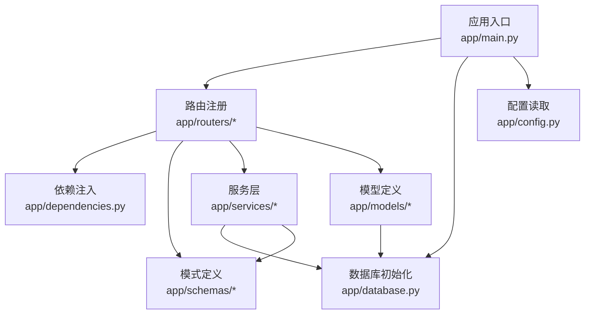
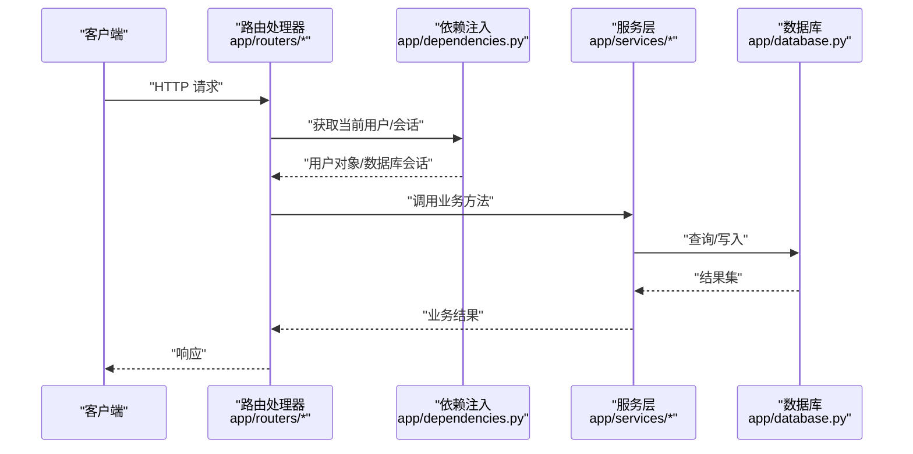
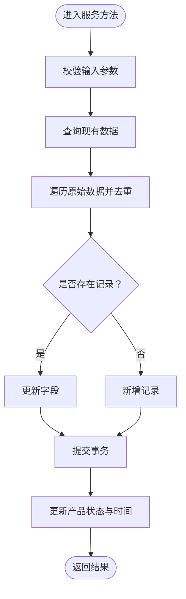
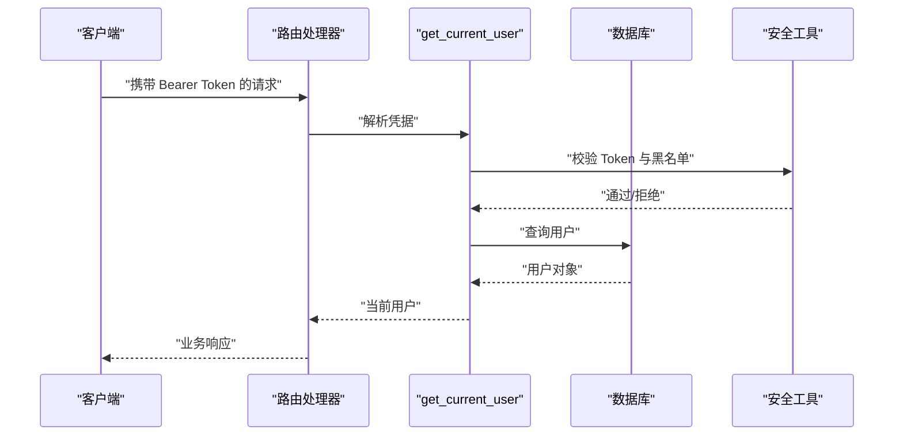
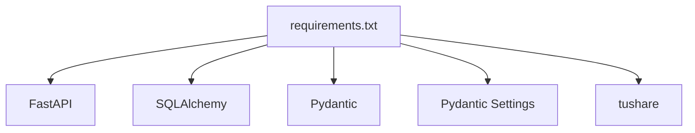

# 后端代码规范

<cite>
**本文引用的文件**
- [backend/app/main.py](file://backend/app/main.py)
- [backend/app/config.py](file://backend/app/config.py)
- [backend/app/database.py](file://backend/app/database.py)
- [backend/app/dependencies.py](file://backend/app/dependencies.py)
- [backend/app/models/__init__.py](file://backend/app/models/__init__.py)
- [backend/app/models/investor.py](file://backend/app/models/investor.py)
- [backend/app/models/portfolio.py](file://backend/app/models/portfolio.py)
- [backend/app/routers/auth.py](file://backend/app/routers/auth.py)
- [backend/app/routers/portfolios.py](file://backend/app/routers/portfolios.py)
- [backend/app/schemas/auth.py](file://backend/app/schemas/auth.py)
- [backend/app/schemas/portfolio.py](file://backend/app/schemas/portfolio.py)
- [backend/app/utils/security.py](file://backend/app/utils/security.py)
- [backend/app/services/market_data_service.py](file://backend/app/services/market_data_service.py)
- [backend/app/init_tasks.py](file://backend/app/init_tasks.py)
- [backend/requirements.txt](file://backend/requirements.txt)
- [backend/alembic/versions/0005_rename_cash_amount_and_date_fields.py](file://backend/alembic/versions/0005_rename_cash_amount_and_date_fields.py)
</cite>

## 更新摘要
**所做更改**
- 更新了 SQLAlchemy 模型设计原则章节，反映新的字段命名标准
- 新增货币金额字段命名规范：cash_amount
- 新增语义化日期字段命名规范：value_date、calendar_date、price_date
- 更新了相关示例和最佳实践指导

## 目录
1. [简介](#简介)
2. [项目结构](#项目结构)
3. [核心组件](#核心组件)
4. [架构总览](#架构总览)
5. [详细组件分析](#详细组件分析)
6. [依赖分析](#依赖分析)
7. [性能考虑](#性能考虑)
8. [故障排查指南](#故障排查指南)
9. [结论](#结论)
10. [附录](#附录)

## 简介
本规范旨在统一 InvestRing 后端的 Python 代码风格、FastAPI 路由设计、SQLAlchemy 模型与关系、Pydantic 模式、服务层组织、依赖注入与异常处理、日志记录以及代码注释与文档字符串格式，确保团队协作一致性与长期可维护性。

## 项目结构
后端采用分层与按功能模块组织的结构：
- 应用入口与路由注册：在应用入口集中创建表、初始化定时任务、注册各模块路由。
- 配置与数据库：集中管理配置与数据库连接池、方言与方言事件。
- 依赖注入：统一的认证与权限依赖，便于在路由中复用。
- 模型层：基于 SQLAlchemy 2.x 的 ORM 映射，集中导出。
- 路由层：按业务域划分，统一前缀与标签。
- 模式层：Pydantic 定义请求/响应结构。
- 服务层：封装业务逻辑，协调模型与外部接口。
- 工具层：安全工具等通用能力。

图表来源
- [backend/app/main.py:1-53](file://backend/app/main.py#L1-L53)
- [backend/app/database.py:1-39](file://backend/app/database.py#L1-L39)
- [backend/app/config.py:1-37](file://backend/app/config.py#L1-L37)
- [backend/app/dependencies.py:1-146](file://backend/app/dependencies.py#L1-L146)
- [backend/app/models/__init__.py:1-46](file://backend/app/models/__init__.py#L1-L46)

章节来源
- [backend/app/main.py:1-53](file://backend/app/main.py#L1-L53)
- [backend/app/database.py:1-39](file://backend/app/database.py#L1-L39)
- [backend/app/config.py:1-37](file://backend/app/config.py#L1-L37)
- [backend/app/dependencies.py:1-146](file://backend/app/dependencies.py#L1-L146)
- [backend/app/models/__init__.py:1-46](file://backend/app/models/__init__.py#L1-L46)

## 核心组件
- 应用入口与路由注册：集中创建数据库表、初始化定时任务、注册各业务路由，统一前缀与标签。
- 配置与数据库：集中读取环境变量，构造数据库引擎与连接池，提供依赖注入的 get_db。
- 依赖注入：提供获取当前用户、当前管理员、权限校验、IP 与 UA 提取、登录日志记录等依赖。
- 模型层：统一继承 Base，字段定义包含主键、索引、默认值与时间戳。
- 路由层：统一使用 APIRouter，按业务域命名前缀与标签，HTTP 方法与参数传递规范明确。
- 模式层：Pydantic 模型用于请求/响应校验与序列化。
- 服务层：封装业务流程，如价格数据同步、组合净值计算等。

章节来源
- [backend/app/main.py:1-53](file://backend/app/main.py#L1-L53)
- [backend/app/config.py:1-37](file://backend/app/config.py#L1-L37)
- [backend/app/database.py:1-39](file://backend/app/database.py#L1-L39)
- [backend/app/dependencies.py:1-146](file://backend/app/dependencies.py#L1-L146)
- [backend/app/models/__init__.py:1-46](file://backend/app/models/__init__.py#L1-L46)

## 架构总览
下图展示从请求到服务层再到数据库的典型调用链路，体现依赖注入与权限控制的使用方式。

图表来源
- [backend/app/routers/auth.py:1-186](file://backend/app/routers/auth.py#L1-L186)
- [backend/app/dependencies.py:1-146](file://backend/app/dependencies.py#L1-L146)
- [backend/app/services/market_data_service.py:1-323](file://backend/app/services/market_data_service.py#L1-L323)
- [backend/app/database.py:1-39](file://backend/app/database.py#L1-L39)

## 详细组件分析

### Python 代码风格与命名规范
- 缩进与行长度
  - 使用 4 空格缩进；行长度不超过 100 字符。
- 命名约定
  - 类名：PascalCase（如 Investor、Portfolio）。
  - 函数/方法：snake_case（如 get_db、record_login_log）。
  - 常量：UPPER_CASE（如 SECRET_KEY、DEBUG）。
  - 模块与包：尽量使用小写与下划线（如 utils/security.py）。
- 导入顺序与空行
  - 标准库导入、第三方库导入、项目内导入之间用空行分隔。
- 注释与文档字符串
  - 函数/类建议使用三引号文档字符串，简要描述用途、参数、返回值与异常。
  - 行内注释简洁明了，避免冗余。

章节来源
- [backend/app/models/investor.py:1-17](file://backend/app/models/investor.py#L1-L17)
- [backend/app/models/portfolio.py:1-16](file://backend/app/models/portfolio.py#L1-L16)
- [backend/app/dependencies.py:1-146](file://backend/app/dependencies.py#L1-L146)
- [backend/app/utils/security.py:1-103](file://backend/app/utils/security.py#L1-L103)

### FastAPI 路由设计规范
- 路由前缀与标签
  - 所有路由均使用统一前缀，如 /api/auth、/api/portfolios、/api/market-data 等；标签用于 OpenAPI 分组展示。
- HTTP 方法与参数传递
  - GET：使用查询参数（如 status、page、page_size），必要时使用路径参数（如 code）。
  - POST/PUT：使用请求体（Pydantic 模型），响应可直接返回模型实例或自定义字典结构。
  - 权限控制：通过依赖注入获取当前用户或管理员，必要时在路由中显式声明。
- 响应模型
  - 使用 response_model 指定 Pydantic 模型，或在复杂场景返回字典结构并保持字段一致。
- 错误处理
  - 使用 HTTPException 返回标准状态码与错误信息，错误结构包含 error 与 message 字段以便前端统一处理。

章节来源
- [backend/app/main.py:32-48](file://backend/app/main.py#L32-L48)
- [backend/app/routers/auth.py:1-186](file://backend/app/routers/auth.py#L1-L186)
- [backend/app/routers/portfolios.py:1-276](file://backend/app/routers/portfolios.py#L1-L276)
- [backend/app/schemas/auth.py:1-26](file://backend/app/schemas/auth.py#L1-L26)
- [backend/app/schemas/portfolio.py:1-30](file://backend/app/schemas/portfolio.py#L1-L30)

### SQLAlchemy 模型设计原则
- 字段定义
  - 主键：使用 String(N) 作为主键，配合 primary_key=True；必要时添加 index=True。
  - 可空性：明确标注 nullable=False 或提供默认值。
  - 默认值与时间戳：使用 server_default=func.now() 与 onupdate=func.now()。
- 关系映射
  - 通过外键与 relationship 建立一对多/多对一关系；避免循环依赖。
- 索引设计
  - 对常用过滤字段（如 code、portfolio_code）建立索引。
- 约束声明
  - 使用唯一约束（如 UK）与非空约束，保证数据完整性。
- 统一基类
  - 所有模型继承 Base，集中导出并在入口处创建表。

**更新** 新增字段命名标准规范

#### 货币金额字段命名规范
- 统一使用 `cash_amount` 表示货币金额字段
- 数据类型使用 Decimal 类型以确保精度
- 必须设置合适的精度和小数位数
- 示例：`Column('cash_amount', DECIMAL(15, 2), default=0)`

#### 语义化日期字段命名规范
- 使用具有明确语义的日期字段名称，替代通用的 date 字段
- 价值日期：`value_date` - 表示资产价值计算的基准日期
- 日历日期：`calendar_date` - 表示交易日历中的具体日期
- 价格日期：`price_date` - 表示价格数据的采集日期
- 所有日期字段应使用 Date 类型并设置适当的索引

章节来源
- [backend/app/models/__init__.py:1-46](file://backend/app/models/__init__.py#L1-L46)
- [backend/app/models/investor.py:1-17](file://backend/app/models/investor.py#L1-L17)
- [backend/app/models/portfolio.py:1-16](file://backend/app/models/portfolio.py#L1-L16)
- [backend/app/database.py:1-39](file://backend/app/database.py#L1-L39)
- [backend/alembic/versions/0005_rename_cash_amount_and_date_fields.py:1-50](file://backend/alembic/versions/0005_rename_cash_amount_and_date_fields.py#L1-L50)

### Pydantic 模式规范
- 字段验证
  - 使用 BaseModel 定义请求/响应结构；对可选字段提供默认值。
- 默认值设置
  - 在响应模型中为可选字段提供默认值，Config 中开启 from_attributes 以兼容 ORM。
- 序列化规则
  - 在需要时自定义序列化（如将 datetime 转为 ISO 字符串），保持前后端一致。
- 复用与分层
  - 使用 Base、Create、Update、Response 分层，减少重复定义。

章节来源
- [backend/app/schemas/auth.py:1-26](file://backend/app/schemas/auth.py#L1-L26)
- [backend/app/schemas/portfolio.py:1-30](file://backend/app/schemas/portfolio.py#L1-L30)

### 服务层代码组织
- 依赖注入使用
  - 服务方法接收 Session 作为第一个参数，通过依赖注入获取数据库会话。
- 异常处理
  - 对外部接口异常进行捕获并返回结构化错误；对数据库写入异常执行回滚并更新状态。
- 业务流程
  - 如价格数据同步、组合净值计算等，先查询再写入，最后提交事务。
- 性能优化
  - 使用内存字典去重与批量处理，减少数据库往返。

图表来源
- [backend/app/services/market_data_service.py:88-225](file://backend/app/services/market_data_service.py#L88-L225)

章节来源
- [backend/app/services/market_data_service.py:1-323](file://backend/app/services/market_data_service.py#L1-L323)

### 依赖注入与权限控制
- 认证与权限
  - 提供 get_current_user 与 get_current_admin 依赖，自动校验 Token、黑名单与账户锁定状态。
- 会话管理
  - get_db 提供数据库会话生命周期管理，确保 finally 中关闭会话。
- 登录日志
  - 记录登录/登出/密码修改等操作的日志，包含 IP 与 UA。

图表来源
- [backend/app/dependencies.py:49-111](file://backend/app/dependencies.py#L49-L111)
- [backend/app/utils/security.py:1-103](file://backend/app/utils/security.py#L1-L103)
- [backend/app/database.py:33-38](file://backend/app/database.py#L33-L38)

章节来源
- [backend/app/dependencies.py:1-146](file://backend/app/dependencies.py#L1-L146)
- [backend/app/utils/security.py:1-103](file://backend/app/utils/security.py#L1-L103)
- [backend/app/database.py:1-39](file://backend/app/database.py#L1-L39)

### 定时任务初始化
- 初始化核心定时任务：净值同步、交易日历同步、日志清理。
- 通过 Cron 表达式定义执行周期，确保任务幂等与存在性。

章节来源
- [backend/app/init_tasks.py:1-45](file://backend/app/init_tasks.py#L1-L45)

## 依赖分析
- 版本与兼容性
  - FastAPI、SQLAlchemy、Pydantic、Pydantic Settings 等版本在 requirements.txt 中明确。
- 外部依赖
  - 使用 tushare 获取基金行情与 NAV，注意异常处理与状态标记。

图表来源
- [backend/requirements.txt:1-19](file://backend/requirements.txt#L1-L19)

章节来源
- [backend/requirements.txt:1-19](file://backend/requirements.txt#L1-L19)

## 性能考虑
- 连接池与方言优化
  - 设置连接池大小、预 ping、回收时间；SQLite 使用 WAL 模式提升并发。
- 查询优化
  - 对高频过滤字段建立索引；避免 N+1 查询，优先批量查询。
- 写入优化
  - 批量写入与去重，减少数据库往返；对异常进行回滚并及时释放资源。
- 缓存与黑名单
  - Token 黑名单与登录失败追踪使用集合与字典，查找与更新均为 O(1)。

章节来源
- [backend/app/database.py:1-39](file://backend/app/database.py#L1-L39)
- [backend/app/utils/security.py:1-103](file://backend/app/utils/security.py#L1-L103)
- [backend/app/services/market_data_service.py:1-323](file://backend/app/services/market_data_service.py#L1-L323)

## 故障排查指南
- 认证相关
  - 401 未授权：检查 Token 是否缺失、过期或被加入黑名单。
  - 403 禁止访问：检查账户是否锁定或权限不足。
- 数据库相关
  - 连接失败：检查数据库地址、端口、账号与密码；确认连接池配置。
  - 写入异常：查看回滚逻辑与状态标记，定位具体异常类型。
- 外部接口
  - tushare 接口异常：检查 Token 与网络状态，关注返回的错误信息。

章节来源
- [backend/app/dependencies.py:49-111](file://backend/app/dependencies.py#L49-L111)
- [backend/app/utils/security.py:57-103](file://backend/app/utils/security.py#L57-L103)
- [backend/app/services/market_data_service.py:128-138](file://backend/app/services/market_data_service.py#L128-L138)

## 结论
本规范总结了 InvestRing 后端在代码风格、路由设计、模型与模式、服务层组织、依赖注入与异常处理等方面的最佳实践。建议在后续开发中严格遵循，以提升代码质量与可维护性。

## 附录
- 术语
  - ORM：对象关系映射，用于将数据库表映射为 Python 类。
  - Pydantic：数据验证与序列化库，用于请求/响应模型。
  - 依赖注入：通过 FastAPI 的 Depends 注入函数或类实例，实现解耦与复用。
- 参考实现路径
  - 应用入口与路由注册：[backend/app/main.py:1-53](file://backend/app/main.py#L1-L53)
  - 配置与数据库：[backend/app/config.py:1-37](file://backend/app/config.py#L1-L37)、[backend/app/database.py:1-39](file://backend/app/database.py#L1-L39)
  - 依赖注入与权限：[backend/app/dependencies.py:1-146](file://backend/app/dependencies.py#L1-L146)
  - 模型与模式：[backend/app/models/__init__.py:1-46](file://backend/app/models/__init__.py#L1-L46)、[backend/app/schemas/auth.py:1-26](file://backend/app/schemas/auth.py#L1-L26)、[backend/app/schemas/portfolio.py:1-30](file://backend/app/schemas/portfolio.py#L1-L30)
  - 服务层示例：[backend/app/services/market_data_service.py:1-323](file://backend/app/services/market_data_service.py#L1-L323)
  - 定时任务初始化：[backend/app/init_tasks.py:1-45](file://backend/app/init_tasks.py#L1-L45)
  - 字段命名迁移：[backend/alembic/versions/0005_rename_cash_amount_and_date_fields.py:1-50](file://backend/alembic/versions/0005_rename_cash_amount_and_date_fields.py#L1-L50)