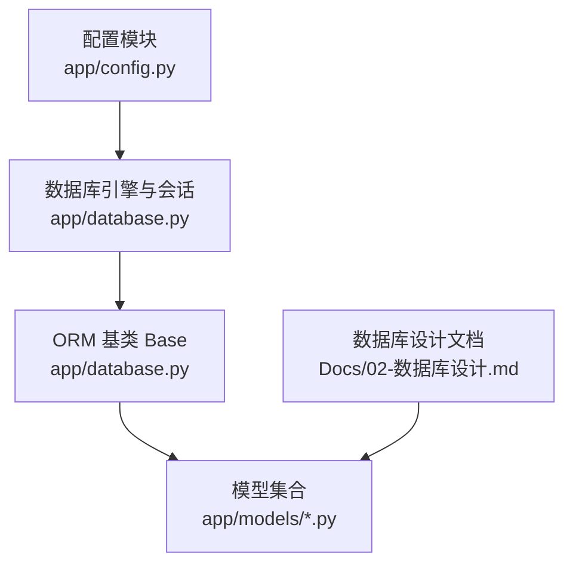
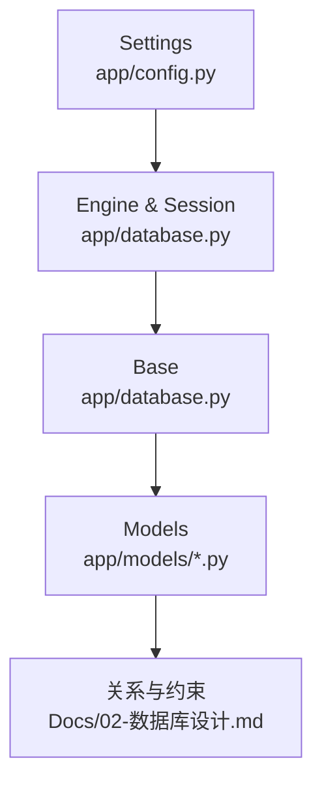

# 数据库模型规范

<cite>
**本文引用的文件**
- [backend/app/database.py](file://backend/app/database.py)
- [backend/app/config.py](file://backend/app/config.py)
- [backend/app/models/__init__.py](file://backend/app/models/__init__.py)
- [backend/app/models/investor.py](file://backend/app/models/investor.py)
- [backend/app/models/portfolio.py](file://backend/app/models/portfolio.py)
- [backend/app/models/platform.py](file://backend/app/models/platform.py)
- [backend/app/models/product.py](file://backend/app/models/product.py)
- [backend/app/models/asset_classification.py](file://backend/app/models/asset_classification.py)
- [backend/app/models/subscription.py](file://backend/app/models/subscription.py)
- [backend/app/models/trade.py](file://backend/app/models/trade.py)
- [backend/app/models/portfolio_position.py](file://backend/app/models/portfolio_position.py)
- [backend/app/models/notification.py](file://backend/app/models/notification.py)
- [Docs/02-数据库设计.md](file://Docs/02-数据库设计.md)
</cite>

## 目录
1. 引言
2. 项目结构
3. 核心组件
4. 架构总览
5. 详细组件分析
6. 依赖分析
7. 性能考虑
8. 故障排查指南
9. 结论
10. 附录

## 引言
本规范旨在统一 InvestRing 项目的 SQLAlchemy 模型设计与实现，覆盖类继承与基类使用、字段定义规则、主键与外键约束、模型关系映射、字段类型选择、索引设计原则、数据验证规则、Alembic 迁移规范以及模型测试规范。文档以现有模型与数据库设计文档为基础，结合代码实现，形成可落地的设计与实践指南。

## 项目结构
- 数据库引擎与会话由统一模块创建，所有模型继承自同一 Base，保证 ORM 会话与元数据的一致性。
- 模型集中于 models 包，按业务域划分文件，便于维护与扩展。
- 配置模块负责数据库连接字符串与调试开关，驱动引擎创建与日志输出。

图表来源
- [backend/app/config.py:1-37](file://backend/app/config.py#L1-L37)
- [backend/app/database.py:1-39](file://backend/app/database.py#L1-L39)
- [backend/app/models/__init__.py:1-46](file://backend/app/models/__init__.py#L1-L46)

章节来源
- [backend/app/config.py:1-37](file://backend/app/config.py#L1-L37)
- [backend/app/database.py:1-39](file://backend/app/database.py#L1-L39)
- [backend/app/models/__init__.py:1-46](file://backend/app/models/__init__.py#L1-L46)

## 核心组件
- 数据库引擎与会话：创建带连接池与预检查的引擎，并为 SQLite 配置 WAL 模式与超时策略；提供会话工厂与依赖注入函数。
- 模型基类 Base：所有模型继承自该基类，确保统一元数据注册与反射能力。
- 配置模块 Settings：集中管理数据库连接参数与默认连接字符串生成逻辑。

章节来源
- [backend/app/database.py:1-39](file://backend/app/database.py#L1-L39)
- [backend/app/config.py:1-37](file://backend/app/config.py#L1-L37)

## 架构总览
SQLAlchemy 模型层遵循“单一职责、清晰继承、显式约束”的设计原则。模型之间通过外键建立关系，使用唯一约束与检查约束保障数据一致性；索引设计围绕高频查询维度展开；字段类型与长度严格对应业务语义与数据库约束。

```mermaid
classDiagram
class Base {
<<declarative_base>>
}
class Investor {
+code : String(20) PK
+name : String(50)
+role : String(20)
+phone : String(20)
+email : String(100)
+password_hash : String(255)
+last_login_at : DateTime
+created_at : DateTime
+updated_at : DateTime
}
class Portfolio {
+code : String(20) PK
+name : String(100)
+description : Text
+status : String(20)
+started_at : DateTime
+closed_at : DateTime
+created_at : DateTime
+updated_at : DateTime
}
class Platform {
+code : String(20) PK
+name : String(100)
+platform_type : String(50)
+created_at : DateTime
}
class Product {
+code : String(10)
+market : String(20)
+name : String(100)
+product_type : String(20)
+asset_class_code : String(30) FK
+confirm_days : Integer
+is_qdii : Boolean
+data_source : String(20)
+fallback_source : String(20)
+data_source_status : String(20)
+last_sync_at : DateTime
+sync_error : Text
+created_at : DateTime
+updated_at : DateTime
}
class AssetClassification {
+code : String(30) PK
+asset_type : String(20)
+asset_category : String(50)
+asset_subcat : String(50)
+description : Text
}
class Subscription {
+id : Integer PK
+portfolio_code : String(20) FK
+investor_code : String(20) FK
+sub_type : String(10)
+amount : Numeric(15,4)
+shares : Numeric(15,4)
+unit_price : Numeric(10,4)
+apply_date : Date
+confirm_date : Date
+status : String(20)
+notes : Text
+created_at : DateTime
+updated_at : DateTime
}
class Trade {
+id : Integer PK
+portfolio_code : String(20) FK
+platform_code : String(20) FK
+product_code : String(10)
+market : String(20)
+trade_type : String(10)
+shares : Numeric(15,4)
+amount : Numeric(15,4)
+price : Numeric(10,4)
+fee : Numeric(15,4)
+actual_amount : Numeric(15,4)
+trade_date : Date
+confirm_date : Date
+status : String(20)
+notes : Text
+created_at : DateTime
+updated_at : DateTime
}
class PortfolioPosition {
+id : Integer PK
+portfolio_code : String(20) FK
+platform_code : String(20) FK
+product_code : String(10)
+market : String(20)
+shares : Numeric(15,4)
+frozen_shares : Numeric(15,4)
+cost_price : Numeric(10,4)
+unit_price : Numeric(10,4)
+market_value : Numeric(15,4)
+amount : Numeric(15,4)
+frozen_amount : Numeric(15,4)
+snapshot_date : Date
+created_at : DateTime
}
class Notification {
+id : Integer PK
+type : String(20)
+title : String(200)
+content : Text
+level : String(20)
+recipient : String(20)
+channel : String(20)
+status : String(20)
+sent_at : DateTime
+read_at : DateTime
+created_at : DateTime
}
Base <|-- Investor
Base <|-- Portfolio
Base <|-- Platform
Base <|-- Product
Base <|-- AssetClassification
Base <|-- Subscription
Base <|-- Trade
Base <|-- PortfolioPosition
Base <|-- Notification
```

图表来源
- [backend/app/models/investor.py:1-17](file://backend/app/models/investor.py#L1-L17)
- [backend/app/models/portfolio.py:1-16](file://backend/app/models/portfolio.py#L1-L16)
- [backend/app/models/platform.py:1-12](file://backend/app/models/platform.py#L1-L12)
- [backend/app/models/product.py:1-22](file://backend/app/models/product.py#L1-L22)
- [backend/app/models/asset_classification.py:1-13](file://backend/app/models/asset_classification.py#L1-L13)
- [backend/app/models/subscription.py:1-21](file://backend/app/models/subscription.py#L1-L21)
- [backend/app/models/trade.py:1-32](file://backend/app/models/trade.py#L1-L32)
- [backend/app/models/portfolio_position.py:1-34](file://backend/app/models/portfolio_position.py#L1-L34)
- [backend/app/models/notification.py:1-19](file://backend/app/models/notification.py#L1-L19)

## 详细组件分析

### 设计原则与基类使用
- 统一继承：所有模型均继承自同一 Base，确保元数据注册一致。
- 显式主键：优先使用明确的主键列，避免隐式主键带来的歧义。
- 显式索引：对常用过滤与排序字段添加索引，提升查询性能。
- 默认值与时间戳：使用服务器默认值与更新回调，保持数据一致性与时序准确性。

章节来源
- [backend/app/database.py:1-39](file://backend/app/database.py#L1-L39)
- [backend/app/models/__init__.py:1-46](file://backend/app/models/__init__.py#L1-L46)

### 字段定义规则与类型选择
- 字符串类型：长度严格匹配业务最大值，避免冗余空间；必要时使用 Text 存放大文本。
- 数值类型：使用 Numeric(precision, scale) 精确表示金额与份额，统一精度与标度以避免舍入误差。
- 日期时间类型：DateTime 用于需要时分秒的时间点，Date 用于仅需日期的场景。
- 布尔类型：Boolean 用于二值状态，配合默认值与约束保障一致性。
- 外键类型：与父表主键类型保持一致，确保引用完整性。

章节来源
- [backend/app/models/investor.py:1-17](file://backend/app/models/investor.py#L1-L17)
- [backend/app/models/portfolio.py:1-16](file://backend/app/models/portfolio.py#L1-L16)
- [backend/app/models/platform.py:1-12](file://backend/app/models/platform.py#L1-L12)
- [backend/app/models/product.py:1-22](file://backend/app/models/product.py#L1-L22)
- [backend/app/models/subscription.py:1-21](file://backend/app/models/subscription.py#L1-L21)
- [backend/app/models/trade.py:1-32](file://backend/app/models/trade.py#L1-L32)
- [backend/app/models/portfolio_position.py:1-34](file://backend/app/models/portfolio_position.py#L1-L34)
- [backend/app/models/notification.py:1-19](file://backend/app/models/notification.py#L1-L19)

### 主键与外键约束声明
- 单一主键：多数表采用单一主键列，如 code、id 等。
- 复合主键：产品表采用 (code, market) 复合主键，体现产品与市场的组合唯一性。
- 外键约束：子表通过 ForeignKey 引用父表主键；部分表使用 ForeignKeyConstraint 对复合主键进行引用。
- 约束策略：遵循 RESTRICT 删除策略，保留历史数据并通过业务流程控制生命周期。

章节来源
- [backend/app/models/product.py:8-12](file://backend/app/models/product.py#L8-L12)
- [backend/app/models/trade.py:26-31](file://backend/app/models/trade.py#L26-L31)
- [backend/app/models/portfolio_position.py:23-33](file://backend/app/models/portfolio_position.py#L23-L33)
- [Docs/02-数据库设计.md:599-621](file://Docs/02-数据库设计.md#L599-L621)

### 模型关系映射
- 一对一：Investor 与 Portfolio 之间无直接一对一关系，通过业务逻辑与唯一约束实现一对一语义。
- 一对多：Portfolio 与 Subscription、Trade、PortfolioPosition 等存在一对多关系；Investor 与 Subscription 存在一对多关系；Platform 与 Trade、PortfolioPosition 存在一对多关系。
- 多对多：通过中间表或外键实现多对多语义；当前模型中未见显式多对多关系。
- 关系实现：使用 ForeignKey 声明外键，配合唯一约束与检查约束保障数据一致性。

章节来源
- [backend/app/models/subscription.py:9-10](file://backend/app/models/subscription.py#L9-L10)
- [backend/app/models/trade.py:9-10](file://backend/app/models/trade.py#L9-L10)
- [backend/app/models/portfolio_position.py:9-10](file://backend/app/models/portfolio_position.py#L9-L10)
- [Docs/02-数据库设计.md:599-621](file://Docs/02-数据库设计.md#L599-L621)

### 字段类型选择规范
- 文本类型：String(n) 用于短文本，Text 用于长文本；避免使用过大的长度造成索引膨胀。
- 数值类型：Numeric(precision, scale) 用于金额与份额，统一精度与标度；整数使用 Integer。
- 日期时间类型：DateTime 用于精确时间点，Date 用于日期；避免混用导致查询复杂化。
- 枚举类型：通过字符串枚举值与默认值、检查约束实现；未来可引入 Enum 类型以增强约束。

章节来源
- [backend/app/models/investor.py:8-16](file://backend/app/models/investor.py#L8-L16)
- [backend/app/models/portfolio.py:8-15](file://backend/app/models/portfolio.py#L8-L15)
- [backend/app/models/product.py:10-21](file://backend/app/models/product.py#L10-L21)
- [backend/app/models/subscription.py:11-20](file://backend/app/models/subscription.py#L11-L20)
- [backend/app/models/trade.py:13-24](file://backend/app/models/trade.py#L13-L24)
- [backend/app/models/portfolio_position.py:13-21](file://backend/app/models/portfolio_position.py#L13-L21)
- [backend/app/models/notification.py:9-18](file://backend/app/models/notification.py#L9-L18)

### 索引设计原则
- 主键索引：自动创建，无需额外声明。
- 唯一索引：对组合唯一性字段（如产品复合主键、持仓快照唯一约束、净值快照唯一约束）进行声明。
- 复合索引：围绕高频查询维度构建复合索引，如组合-日期、产品-日期等。
- 查询性能优化：为过滤与排序字段建立索引；避免过度索引导致写入性能下降。

章节来源
- [backend/app/models/product.py:8-12](file://backend/app/models/product.py#L8-L12)
- [backend/app/models/portfolio_position.py:32](file://backend/app/models/portfolio_position.py#L32)
- [Docs/02-数据库设计.md:563-595](file://Docs/02-数据库设计.md#L563-L595)

### 数据验证规则
- 非空字段：使用 nullable=False 约束关键字段。
- 默认值：使用 default 或 server_default 设置默认值，确保数据完整性。
- 检查约束：使用 CheckConstraint 对业务规则进行约束，如持仓快照的份额与金额互斥规则。
- 唯一约束：使用 UniqueConstraint 保证组合唯一性，避免重复数据。

章节来源
- [backend/app/models/investor.py:9, 13](file://backend/app/models/investor.py#L9,L13)
- [backend/app/models/portfolio.py:9, 11](file://backend/app/models/portfolio.py#L9,L11)
- [backend/app/models/portfolio_position.py:28-31](file://backend/app/models/portfolio_position.py#L28-L31)

### Alembic 迁移规范
- 迁移文件命名：采用“描述性英文 + 时间戳”格式，确保版本顺序与意图清晰。
- 版本管理：通过 Alembic 版本目录管理迁移历史，禁止回滚未备份的生产变更。
- 数据回滚：在迁移中包含数据修正与回退策略，确保回滚时数据一致性。
- 生产环境部署：在部署前进行迁移预演与回滚演练，确保变更可控。

（本节为通用规范说明，未直接分析具体文件）

### 模型测试规范
- 单元测试：针对模型字段、约束与关系编写单元测试，覆盖新增、更新、删除与查询场景。
- 数据完整性验证：验证外键约束、唯一约束与检查约束在边界条件下仍有效。
- 性能测试：对高频查询路径进行基准测试，评估索引效果与查询耗时。

（本节为通用规范说明，未直接分析具体文件）

## 依赖分析
- 模型依赖：所有模型依赖统一的 Base；部分模型依赖其他模型的外键关系。
- 引擎与会话：数据库引擎与会话工厂集中管理，确保连接池与 SQLite 特殊配置生效。
- 配置依赖：配置模块提供数据库连接参数，驱动引擎创建与调试输出。

图表来源
- [backend/app/config.py:1-37](file://backend/app/config.py#L1-L37)
- [backend/app/database.py:1-39](file://backend/app/database.py#L1-L39)
- [backend/app/models/__init__.py:1-46](file://backend/app/models/__init__.py#L1-L46)
- [Docs/02-数据库设计.md:563-595](file://Docs/02-数据库设计.md#L563-L595)

章节来源
- [backend/app/config.py:1-37](file://backend/app/config.py#L1-L37)
- [backend/app/database.py:1-39](file://backend/app/database.py#L1-L39)
- [backend/app/models/__init__.py:1-46](file://backend/app/models/__init__.py#L1-L46)

## 性能考虑
- 连接池：合理配置 pool_size 与 max_overflow，平衡并发与资源占用。
- SQLite 并发：启用 WAL 模式与合适的 busy_timeout，提升读写并发能力。
- 索引策略：围绕高频查询维度建立复合索引，避免全表扫描。
- 写入优化：批量写入与事务提交，减少往返开销。

章节来源
- [backend/app/database.py:8-26](file://backend/app/database.py#L8-L26)
- [Docs/02-数据库设计.md:624-656](file://Docs/02-数据库设计.md#L624-L656)

## 故障排查指南
- 连接问题：检查数据库 URL 与连接参数，确认 SQLite WAL 配置是否生效。
- 约束冲突：核对外键、唯一与检查约束，定位违反约束的数据行。
- 查询缓慢：分析执行计划，评估索引覆盖情况，必要时调整索引或查询条件。

章节来源
- [backend/app/config.py:30-31](file://backend/app/config.py#L30-L31)
- [backend/app/database.py:18-26](file://backend/app/database.py#L18-L26)
- [Docs/02-数据库设计.md:563-595](file://Docs/02-数据库设计.md#L563-L595)

## 结论
本规范总结了 InvestRing 项目中 SQLAlchemy 模型的设计与实现要点，涵盖基类使用、字段类型、主外键约束、关系映射、索引设计、数据验证、迁移与测试等方面。建议在后续开发中严格遵循本规范，确保模型一致性、可维护性与性能表现。

## 附录
- 字段类型与长度对照：依据模型定义与数据库设计文档，统一字符串长度、数值精度与标度。
- 约束清单：外键约束、唯一约束与检查约束的清单与说明，便于审计与维护。

章节来源
- [backend/app/models/investor.py:8-16](file://backend/app/models/investor.py#L8-L16)
- [backend/app/models/portfolio.py:8-15](file://backend/app/models/portfolio.py#L8-L15)
- [backend/app/models/product.py:8-21](file://backend/app/models/product.py#L8-L21)
- [backend/app/models/subscription.py:9-20](file://backend/app/models/subscription.py#L9-L20)
- [backend/app/models/trade.py:9-24](file://backend/app/models/trade.py#L9-L24)
- [backend/app/models/portfolio_position.py:23-33](file://backend/app/models/portfolio_position.py#L23-L33)
- [backend/app/models/notification.py:9-18](file://backend/app/models/notification.py#L9-L18)
- [Docs/02-数据库设计.md:563-595](file://Docs/02-数据库设计.md#L563-L595)