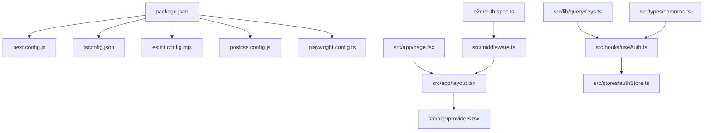
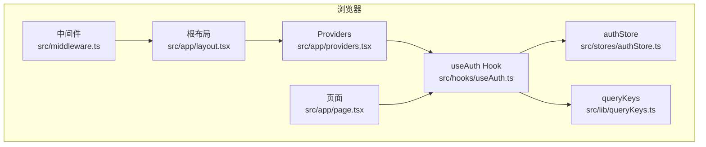
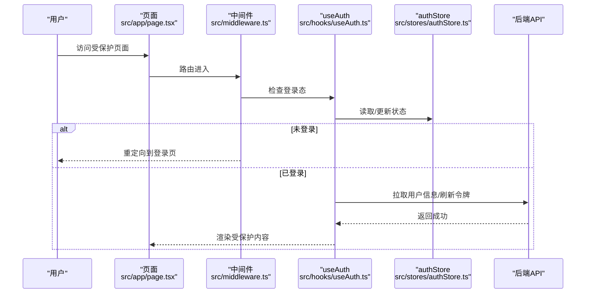
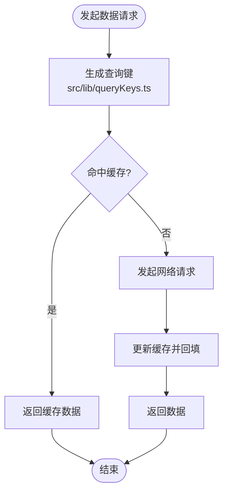
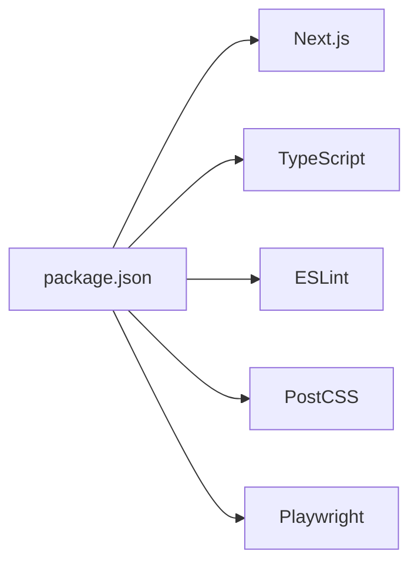

# 前端代码质量审计报告

<cite>
**本文引用的文件**   
- [package.json](file://frontend/package.json)
- [next.config.js](file://frontend/next.config.js)
- [tsconfig.json](file://frontend/tsconfig.json)
- [eslint.config.mjs](file://frontend/eslint.config.mjs)
- [postcss.config.js](file://frontend/postcss.config.js)
- [playwright.config.ts](file://frontend/playwright.config.ts)
- [src/app/layout.tsx](file://frontend/src/app/layout.tsx)
- [src/app/page.tsx](file://frontend/src/app/page.tsx)
- [src/app/providers.tsx](file://frontend/src/app/providers.tsx)
- [src/middleware.ts](file://frontend/src/middleware.ts)
- [src/hooks/useAuth.ts](file://frontend/src/hooks/useAuth.ts)
- [src/stores/authStore.ts](file://frontend/src/stores/authStore.ts)
- [src/lib/queryKeys.ts](file://frontend/src/lib/queryKeys.ts)
- [src/types/common.ts](file://frontend/src/types/common.ts)
- [e2e/auth.spec.ts](file://frontend/e2e/auth.spec.ts)
</cite>

## 目录
1. [简介](#简介)
2. [项目结构](#项目结构)
3. [核心组件](#核心组件)
4. [架构总览](#架构总览)
5. [详细组件分析](#详细组件分析)
6. [依赖分析](#依赖分析)
7. [性能考虑](#性能考虑)
8. [故障排查指南](#故障排查指南)
9. [结论](#结论)
10. [附录](#附录)

## 简介
本审计聚焦于 InvestRing 前端（Next.js + React + TypeScript）的代码质量，覆盖工程配置、类型与校验、状态管理、认证流程、路由与中间件、可访问性与移动端适配、测试与 E2E、以及构建与部署相关设置。报告旨在帮助团队识别风险点、统一规范并提升可维护性。

## 项目结构
前端采用 Next.js App Router 组织页面与布局，结合 hooks、stores、types、components 分层清晰。关键入口包括应用根布局、页面、全局 Provider、中间件与 E2E 测试配置。

图表来源 
- [package.json](file://frontend/package.json)
- [next.config.js](file://frontend/next.config.js)
- [tsconfig.json](file://frontend/tsconfig.json)
- [eslint.config.mjs](file://frontend/eslint.config.mjs)
- [postcss.config.js](file://frontend/postcss.config.js)
- [playwright.config.ts](file://frontend/playwright.config.ts)
- [src/app/layout.tsx](file://frontend/src/app/layout.tsx)
- [src/app/page.tsx](file://frontend/src/app/page.tsx)
- [src/app/providers.tsx](file://frontend/src/app/providers.tsx)
- [src/middleware.ts](file://frontend/src/middleware.ts)
- [src/hooks/useAuth.ts](file://frontend/src/hooks/useAuth.ts)
- [src/stores/authStore.ts](file://frontend/src/stores/authStore.ts)
- [src/lib/queryKeys.ts](file://frontend/src/lib/queryKeys.ts)
- [src/types/common.ts](file://frontend/src/types/common.ts)
- [e2e/auth.spec.ts](file://frontend/e2e/auth.spec.ts)

章节来源
- [package.json](file://frontend/package.json)
- [next.config.js](file://frontend/next.config.js)
- [tsconfig.json](file://frontend/tsconfig.json)

## 核心组件
- 应用根布局与提供者：负责全局样式、第三方库 Provider 注入、主题与国际化等初始化。
- 认证 Hook 与 Store：封装鉴权状态、登录态持久化、Token 刷新与错误处理。
- 查询键管理：集中定义 React Query 的 key 前缀与命名规范，避免缓存冲突。
- 中间件：统一鉴权拦截、重定向与权限控制。
- 类型系统：公共类型定义确保前后端契约一致。

章节来源
- [src/app/layout.tsx](file://frontend/src/app/layout.tsx)
- [src/app/providers.tsx](file://frontend/src/app/providers.tsx)
- [src/hooks/useAuth.ts](file://frontend/src/hooks/useAuth.ts)
- [src/stores/authStore.ts](file://frontend/src/stores/authStore.ts)
- [src/lib/queryKeys.ts](file://frontend/src/lib/queryKeys.ts)
- [src/middleware.ts](file://frontend/src/middleware.ts)
- [src/types/common.ts](file://frontend/src/types/common.ts)

## 架构总览
前端以 Next.js App Router 为路由中心，通过中间件进行请求级鉴权；业务逻辑由 hooks 驱动，状态集中在 stores；数据获取使用 React Query，key 统一管理；UI 层按桌面/移动拆分组件，共享基础 UI 组件。

图表来源 
- [src/middleware.ts](file://frontend/src/middleware.ts)
- [src/app/layout.tsx](file://frontend/src/app/layout.tsx)
- [src/app/providers.tsx](file://frontend/src/app/providers.tsx)
- [src/hooks/useAuth.ts](file://frontend/src/hooks/useAuth.ts)
- [src/stores/authStore.ts](file://frontend/src/stores/authStore.ts)
- [src/lib/queryKeys.ts](file://frontend/src/lib/queryKeys.ts)
- [src/app/page.tsx](file://frontend/src/app/page.tsx)

## 详细组件分析

### 认证流程与状态管理
认证流程涵盖登录、令牌存储、鉴权拦截与页面保护。Hook 封装了登录态判断、刷新与错误提示；Store 提供跨组件状态同步；中间件在路由切换时执行鉴权。

图表来源 
- [src/app/page.tsx](file://frontend/src/app/page.tsx)
- [src/middleware.ts](file://frontend/src/middleware.ts)
- [src/hooks/useAuth.ts](file://frontend/src/hooks/useAuth.ts)
- [src/stores/authStore.ts](file://frontend/src/stores/authStore.ts)

章节来源
- [src/hooks/useAuth.ts](file://frontend/src/hooks/useAuth.ts)
- [src/stores/authStore.ts](file://frontend/src/stores/authStore.ts)
- [src/middleware.ts](file://frontend/src/middleware.ts)

### 查询键管理与数据一致性
React Query 的 key 集中管理，有助于避免缓存污染与重复请求。建议遵循“模块名+资源名+参数”的命名约定，并在变更时主动失效。

图表来源 
- [src/lib/queryKeys.ts](file://frontend/src/lib/queryKeys.ts)

章节来源
- [src/lib/queryKeys.ts](file://frontend/src/lib/queryKeys.ts)

### 类型系统与契约一致性
公共类型定义位于 types 目录，确保前后端字段一致、减少运行时错误。建议在新增接口时同步更新类型，并使用严格模式编译。

章节来源
- [src/types/common.ts](file://frontend/src/types/common.ts)

### 应用初始化与全局提供者
根布局与 Providers 负责引入必要的上下文（如主题、国际化、查询客户端），保证组件树内可用。

章节来源
- [src/app/layout.tsx](file://frontend/src/app/layout.tsx)
- [src/app/providers.tsx](file://frontend/src/app/providers.tsx)

### 端到端测试（E2E）
基于 Playwright 的认证测试覆盖了登录与受保护页面访问流程，验证中间件与 Hook 的协同行为。

章节来源
- [playwright.config.ts](file://frontend/playwright.config.ts)
- [e2e/auth.spec.ts](file://frontend/e2e/auth.spec.ts)

## 依赖分析
前端依赖由 package.json 声明，构建工具链包含 Next.js、TypeScript、ESLint、PostCSS、Playwright 等。建议锁定版本并定期升级安全补丁。

图表来源 
- [package.json](file://frontend/package.json)

章节来源
- [package.json](file://frontend/package.json)

## 性能考虑
- 首屏优化：按需加载组件、图片懒加载、字体子集化。
- 缓存策略：合理设置 React Query 的 staleTime 与 gcTime，避免频繁请求。
- 包体积：移除未使用依赖，启用 Tree Shaking，分析 bundle 大小。
- 渲染优化：避免不必要的 re-render，使用 memo/useMemo/useCallback。
- 服务端渲染：利用 Next.js 的 SSR/ISR 提升首屏与 SEO。

[本节为通用指导，不直接分析具体文件]

## 故障排查指南
- 认证失败：检查中间件重定向逻辑、Token 存储与刷新策略、后端响应码。
- 路由守卫异常：确认受保护页面的路由匹配与权限判断顺序。
- 缓存不一致：清理 React Query 缓存，核对 queryKeys 命名是否唯一。
- 构建失败：检查 tsconfig 严格模式、ESLint 规则与依赖版本兼容性。
- E2E 不稳定：增加重试与等待条件，确保环境稳定。

章节来源
- [src/middleware.ts](file://frontend/src/middleware.ts)
- [src/hooks/useAuth.ts](file://frontend/src/hooks/useAuth.ts)
- [src/lib/queryKeys.ts](file://frontend/src/lib/queryKeys.ts)
- [playwright.config.ts](file://frontend/playwright.config.ts)

## 结论
InvestRing 前端整体结构清晰，职责划分明确，认证与数据流设计合理。建议进一步强化类型约束、完善错误边界与监控上报、统一组件命名与文档，并持续优化包体积与首屏性能。通过补充单元测试与回归用例，可显著提升稳定性与可维护性。

[本节为总结性内容，不直接分析具体文件]

## 附录
- 工程配置参考：
  - [next.config.js](file://frontend/next.config.js)
  - [tsconfig.json](file://frontend/tsconfig.json)
  - [eslint.config.mjs](file://frontend/eslint.config.mjs)
  - [postcss.config.js](file://frontend/postcss.config.js)
  - [playwright.config.ts](file://frontend/playwright.config.ts)

章节来源
- [next.config.js](file://frontend/next.config.js)
- [tsconfig.json](file://frontend/tsconfig.json)
- [eslint.config.mjs](file://frontend/eslint.config.mjs)
- [postcss.config.js](file://frontend/postcss.config.js)
- [playwright.config.ts](file://frontend/playwright.config.ts)