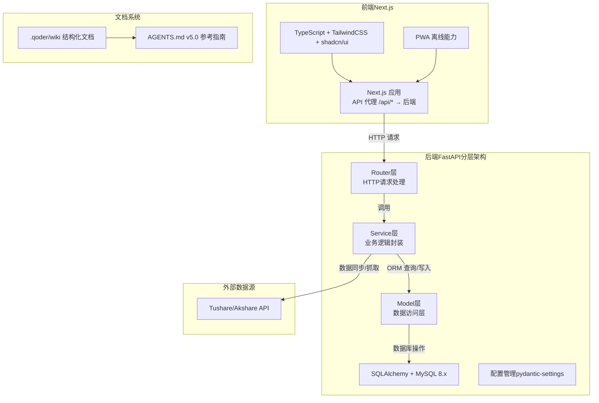
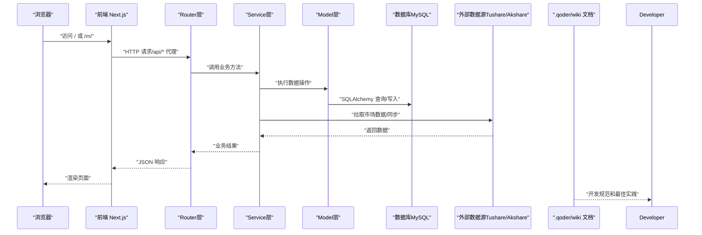
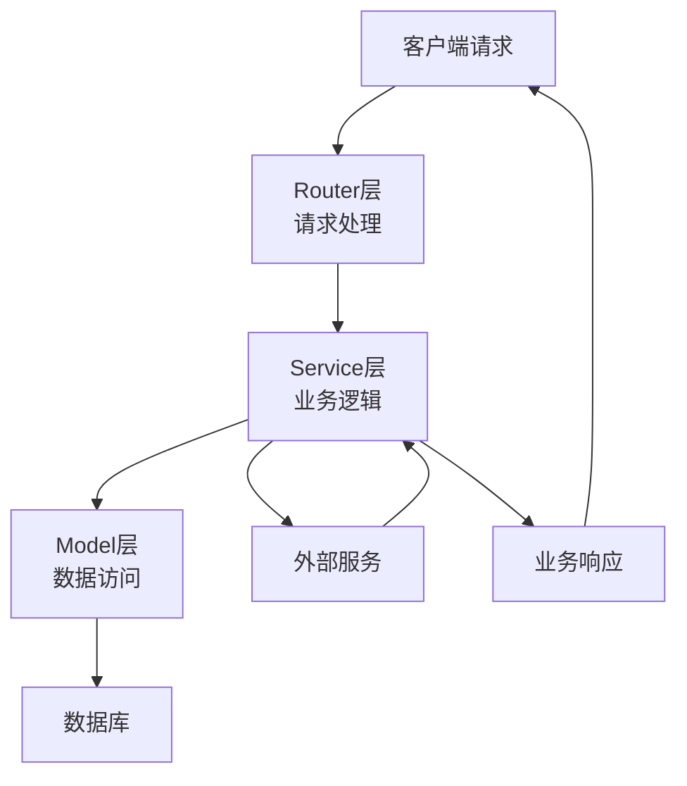
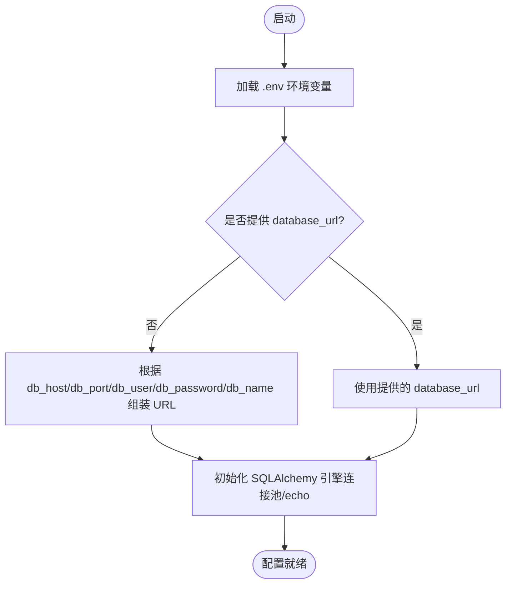
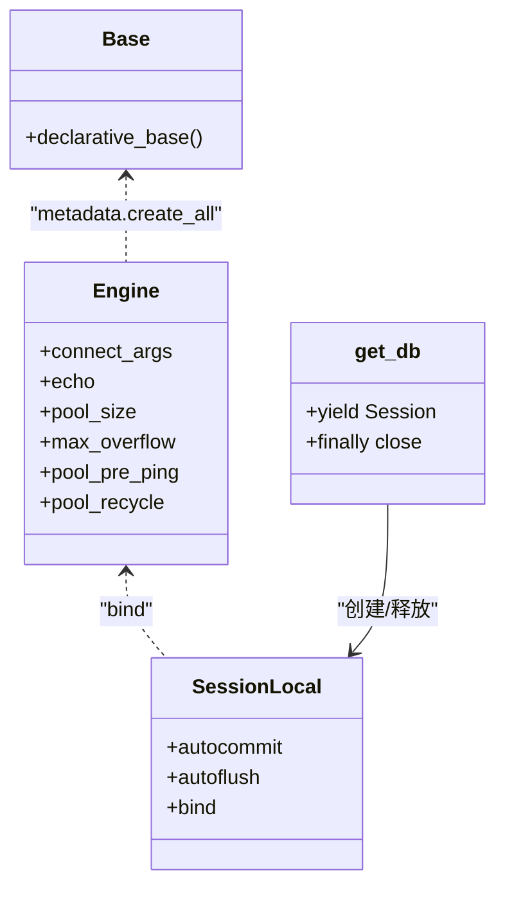
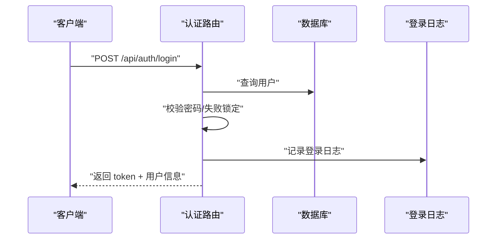
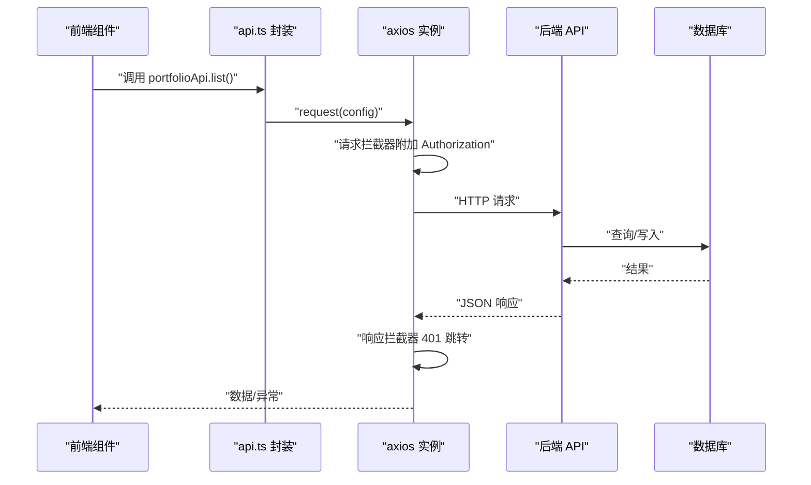
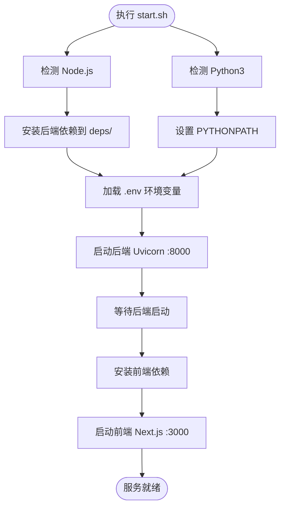

# 开发指南

<cite>
**本文引用的文件**
- [AGENTS.md](file://AGENTS.md)
- [backend/app/main.py](file://backend/app/main.py)
- [backend/app/config.py](file://backend/app/config.py)
- [backend/app/database.py](file://backend/app/database.py)
- [backend/requirements.txt](file://backend/requirements.txt)
- [backend/app/routers/auth.py](file://backend/app/routers/auth.py)
- [frontend/package.json](file://frontend/package.json)
- [frontend/next.config.js](file://frontend/next.config.js)
- [frontend/tsconfig.json](file://frontend/tsconfig.json)
- [start.sh](file://start.sh)
- [backend/app/services/investor_service.py](file://backend/app/services/investor_service.py)
- [backend/app/services/portfolio_service.py](file://backend/app/services/portfolio_service.py)
- [backend/app/services/trade_service.py](file://backend/app/services/trade_service.py)
- [backend/app/services/position_service.py](file://backend/app/services/position_service.py)
- [backend/app/services/product_service.py](file://backend/app/services/product_service.py)
- [backend/app/services/cash_transfer_service.py](file://backend/app/services/cash_transfer_service.py)
- [backend/app/services/market_data_service.py](file://backend/app/services/market_data_service.py)
- [backend/app/services/snapshot_service.py](file://backend/app/services/snapshot_service.py)
- [backend/app/services/subscription_service.py](file://backend/app/services/subscription_service.py)
- [backend/app/services/trading_calendar_service.py](file://backend/app/services/trading_calendar_service.py)
- [backend/app/services/share_change_event_service.py](file://backend/app/services/share_change_event_service.py)
- [backend/app/services/task_runner.py](file://backend/app/services/task_runner.py)
- [backend/app/services/scheduler_service.py](file://backend/app/services/scheduler_service.py)
- [backend/app/services/trading_utils.py](file://backend/app/services/trading_utils.py)
- [backend/app/services/exceptions.py](file://backend/app/services/exceptions.py)
- [backend/app/services/akshare_client.py](file://backend/app/services/akshare_client.py)
- [backend/app/services/tushare_client.py](file://backend/app/services/tushare_client.py)
</cite>

## 更新摘要
**变更内容**
- 新增分层架构模式：Service层抽象作为业务逻辑实现的标准模式
- 替换直接数据库操作：从路由器和CLI命令中移除直接数据库操作，统一通过Service层处理
- 建立标准服务层规范：所有业务逻辑必须通过Service层封装和调用
- 更新开发约定：遵循新的分层架构模式和最佳实践

## 目录
1. [简介](#简介)
2. [项目结构](#项目结构)
3. [核心组件](#核心组件)
4. [架构总览](#架构总览)
5. [详细组件分析](#详细组件分析)
6. [依赖分析](#依赖分析)
7. [性能考虑](#性能考虑)
8. [故障排查指南](#故障排查指南)
9. [结论](#结论)
10. [附录](#附录)

## 简介
本开发指南面向 InvestRing（投资年轮）项目的核心开发者与协作成员，覆盖开发环境搭建、代码规范与最佳实践、前后端开发流程、测试策略与代码审查标准、配置管理与环境变量、部署配置、数据库迁移与版本控制、发布流程、开发工具与调试技巧、性能优化建议、CI/CD 与自动化部署流水线，以及代码示例、模板与脚手架使用指导。

**更新** 本项目已完成文档结构重组，采用新的 .qoder/wiki 结构和 AGENTS.md v5.0 参考指南，提供更清晰的开发指导和项目管理规范。**重要更新**：项目已采用新的分层架构模式，Service层抽象作为业务逻辑实现的标准模式，替换了直接从路由器和CLI命令进行数据库操作的方式。

## 项目结构
项目采用前后端分离的分层架构：
- 前端：Next.js 14（App Router），TypeScript，TailwindCSS v4，shadcn/ui，PWA（Serwist）能力，通过 API 代理转发到后端。
- 后端：FastAPI，SQLAlchemy 2.x，MySQL 8.x，HMAC Token 认证，75 个 API 接口，14 个模块，采用分层架构设计。
- **分层架构**：Router层 → Service层 → Model层，确保业务逻辑清晰分离和可维护性。
- 文档：采用 .qoder/wiki 结构化文档体系，包含产品需求、数据库设计、业务流程、开发指南等。

**图表来源**
- [frontend/next.config.js:1-16](file://frontend/next.config.js#L1-L16)
- [backend/app/main.py:1-53](file://backend/app/main.py#L1-L53)
- [backend/app/database.py:1-39](file://backend/app/database.py#L1-L39)
- [backend/app/config.py:1-37](file://backend/app/config.py#L1-L37)
- [backend/app/services/investor_service.py:1-50](file://backend/app/services/investor_service.py#L1-L50)
- [AGENTS.md:1-100](file://AGENTS.md#L1-L100)

## 核心组件
- **分层架构模式**：Router层负责HTTP请求处理，Service层封装业务逻辑，Model层处理数据访问，确保职责分离。
- 配置管理：基于 pydantic-settings 的 Settings 类，支持 .env 环境变量注入与默认值，动态拼接数据库 URL。
- 数据库层：SQLAlchemy 引擎与连接池配置，SQLite WAL 模式兼容；Session 工厂与依赖注入。
- 认证模块：HMAC Token（7 天有效期）、登录失败锁定、黑名单、登录/登出日志记录。
- 前后端通信：前端 axios 实例封装、请求/响应拦截器、401 自动跳转登录。
- 一键启动：start.sh 脚本自动安装依赖、加载 .env、启动前后端服务并输出日志位置。
- 文档系统：.qoder/wiki 结构化文档管理和 AGENTS.md v5.0 开发规范指南。

**章节来源**
- [backend/app/config.py:1-37](file://backend/app/config.py#L1-L37)
- [backend/app/database.py:1-39](file://backend/app/database.py#L1-L39)
- [backend/app/routers/auth.py:1-186](file://backend/app/routers/auth.py#L1-L186)
- [backend/app/services/investor_service.py:1-100](file://backend/app/services/investor_service.py#L1-L100)
- [start.sh:1-93](file://start.sh#L1-L93)
- [AGENTS.md:1-200](file://AGENTS.md#L1-L200)

## 架构总览
下图展示从浏览器到后端 API 再到数据库与外部数据源的整体交互，体现新的分层架构模式：

**图表来源**
- [frontend/next.config.js:5-12](file://frontend/next.config.js#L5-L12)
- [backend/app/main.py:32-48](file://backend/app/main.py#L32-L48)
- [backend/app/database.py:8-16](file://backend/app/database.py#L8-L16)
- [backend/app/services/investor_service.py:10-30](file://backend/app/services/investor_service.py#L10-L30)
- [AGENTS.md:1-50](file://AGENTS.md#L1-L50)

## 详细组件分析

### 分层架构模式与服务层设计
**更新** 项目已采用标准的分层架构模式，Service层作为业务逻辑的核心抽象层。

- **Router层**：仅负责HTTP请求解析、参数验证和响应格式化，不包含业务逻辑。
- **Service层**：封装所有业务逻辑，协调多个Model操作，处理事务和异常。
- **Model层**：纯数据访问层，提供CRUD操作和数据转换。

**图表来源**
- [backend/app/services/investor_service.py:1-50](file://backend/app/services/investor_service.py#L1-L50)
- [backend/app/services/portfolio_service.py:1-50](file://backend/app/services/portfolio_service.py#L1-L50)
- [backend/app/services/trade_service.py:1-50](file://backend/app/services/trade_service.py#L1-L50)

**章节来源**
- [backend/app/services/investor_service.py:1-100](file://backend/app/services/investor_service.py#L1-L100)
- [backend/app/services/portfolio_service.py:1-100](file://backend/app/services/portfolio_service.py#L1-L100)
- [backend/app/services/trade_service.py:1-100](file://backend/app/services/trade_service.py#L1-L100)

### 配置管理与环境变量
- 配置项包括数据库连接、安全密钥、Token 有效期、Tushare Token、应用名称与调试开关。
- 默认数据库 URL 由各字段拼接；若未显式提供 database_url，则自动生成。
- 环境变量通过 .env 注入，支持运行时覆盖。

**图表来源**
- [backend/app/config.py:25-31](file://backend/app/config.py#L25-L31)
- [backend/app/database.py:8-16](file://backend/app/database.py#L8-L16)

**章节来源**
- [backend/app/config.py:1-37](file://backend/app/config.py#L1-L37)
- [backend/app/database.py:1-39](file://backend/app/database.py#L1-L39)

### 数据库连接与会话
- 引擎配置连接池大小、溢出、pre_ping、回收周期；SQLite 场景启用 WAL 模式与超时设置。
- 提供 get_db 依赖，确保每个请求生命周期内正确创建/关闭会话。

**图表来源**
- [backend/app/database.py:8-39](file://backend/app/database.py#L8-L39)

**章节来源**
- [backend/app/database.py:1-39](file://backend/app/database.py#L1-L39)

### 认证与权限控制
- 登录：校验用户与密码，连续失败锁定，成功记录日志并签发 Token。
- 修改密码：区分 admin 与 viewer 权限，viewer 修改需旧密码校验，修改后 Token 失效。
- Token：HMAC-SHA256 签名，7 天有效期；支持黑名单与登出逻辑。

**图表来源**
- [backend/app/routers/auth.py:29-96](file://backend/app/routers/auth.py#L29-L96)

**章节来源**
- [backend/app/routers/auth.py:1-186](file://backend/app/routers/auth.py#L1-L186)

### 前后端通信与拦截器
- 前端 axios 实例：
  - 自动附加本地存储中的 Bearer Token。
  - 统一错误处理，401 清理 Token 并跳转登录页。
- Next.js 通过 rewrites 将 /api/* 代理到后端 8000 端口。

**图表来源**
- [frontend/src/lib/api.ts:41-79](file://frontend/src/lib/api.ts#L41-L79)
- [frontend/next.config.js:5-12](file://frontend/next.config.js#L5-L12)

**章节来源**
- [frontend/src/lib/api.ts:1-200](file://frontend/src/lib/api.ts#L1-L200)
- [frontend/next.config.js:1-16](file://frontend/next.config.js#L1-L16)

### 一键启动与服务编排
- start.sh：
  - 检测 Node.js 与 Python3。
  - 安装后端依赖到 deps/ 并设置 PYTHONPATH。
  - 加载 .env，启动后端 Uvicorn（8000），记录日志。
  - 等待后端启动后安装前端依赖并启动 Next.js（3000）。
  - 输出服务地址与日志路径，等待进程结束。

**图表来源**
- [start.sh:7-77](file://start.sh#L7-L77)

**章节来源**
- [start.sh:1-93](file://start.sh#L1-L93)

### 文档系统与开发规范
- .qoder/wiki 结构化文档体系，提供完整的项目文档管理。
- AGENTS.md v5.0 参考指南，涵盖开发规范、代码审查标准、最佳实践等。
- 统一的文档格式和命名规范，便于团队协作和维护。

**章节来源**
- [AGENTS.md:1-500](file://AGENTS.md#L1-L500)

## 依赖分析
- 后端依赖：FastAPI、Uvicorn、SQLAlchemy、Pydantic、pydantic-settings、passlib、apscheduler、pandas、numpy、python-dateutil、alembic、pytest、tushare、pymysql 等。
- 前端依赖：Next.js、React、Zustand、@tanstack/react-query、TailwindCSS、shadcn/ui、Axios、Recharts、date-fns 等。
- 开发工具：ESLint（eslint-config-next）、TypeScript、PostCSS、TailwindCSS。

**章节来源**
- [backend/requirements.txt:1-19](file://backend/requirements.txt#L1-L19)
- [frontend/package.json:1-45](file://frontend/package.json#L1-L45)

## 性能考虑
- 数据库连接池：合理设置 pool_size 与 max_overflow，结合 pool_pre_ping 与 recycle，降低连接失效与重建开销。
- SQL 查询：避免 N+1 查询，使用 join/批量查询；对热点查询建立必要索引。
- **分层架构优化**：Service层缓存常用数据，减少重复数据库查询；合理使用异步操作提升并发性能。
- 前端缓存：利用 React Query 的缓存与回写策略，减少重复请求；对大列表使用虚拟滚动。
- 网络与代理：保持 axios 超时合理（当前 30s），避免阻塞 UI；代理层减少跨域问题。
- 静态资源与构建：开启 SWC Minify 与 Tailwind 内容扫描，缩短构建时间。
- 外部数据源：对 Tushare/Akshare 请求做节流与重试，避免频繁拉取导致限流。

## 故障排查指南
- 启动失败
  - 检查 Node.js 与 Python3 是否安装。
  - 确认 .env 中数据库连接参数与 Tushare Token。
  - 查看 logs/backend.log 与 logs/frontend.log。
- 认证相关
  - 登录失败锁定：查看登录失败记录与锁定时间。
  - Token 失效：确认 token 是否在黑名单、是否过期。
- 数据库连接
  - 检查连接池配置与数据库可达性；SQLite 场景确认 WAL 模式生效。
- 前端 401
  - 检查本地存储 token 是否存在；确认响应拦截器是否触发跳转登录。
- **分层架构问题**
  - Service层循环依赖：检查服务间调用关系，避免循环引用。
  - 事务管理：确认Service层事务边界正确，异常时能正确回滚。
  - 异常处理：检查Service层异常是否正确抛出和处理。
- 文档系统
  - 确认 .qoder/wiki 目录结构完整性。
  - 检查 AGENTS.md 版本是否为 v5.0。

**章节来源**
- [start.sh:37-50](file://start.sh#L37-L50)
- [backend/app/routers/auth.py:37-72](file://backend/app/routers/auth.py#L37-L72)
- [backend/app/services/exceptions.py:1-50](file://backend/app/services/exceptions.py#L1-L50)
- [AGENTS.md:1-100](file://AGENTS.md#L1-L100)

## 结论
本指南提供了 InvestRing 从环境搭建到日常开发、测试、部署与运维的完整路径。项目已完成文档结构重组，采用新的 .qoder/wiki 结构和 AGENTS.md v5.0 参考指南，为团队提供更清晰的开发指导和项目管理规范。**重要更新**：项目已采用新的分层架构模式，Service层抽象作为业务逻辑实现的标准模式，显著提升了代码的可维护性和可扩展性。建议团队严格遵循分层架构约定、配置管理、认证与权限控制、前后端通信规范与性能优化建议，配合 CI/CD 与自动化测试，保障系统的稳定性与可维护性。

## 附录

### 开发环境搭建步骤
- 安装 Node.js 与 Python3。
- 安装依赖：
  - 后端：pip3 install -r backend/requirements.txt
  - 前端：npm install
- 配置 .env（数据库、Tushare Token、密钥等）。
- 启动：bash start.sh。
- 访问：
  - 前端：http://localhost:3000
  - 后端：http://localhost:8000
  - API 文档：http://localhost:8000/docs
  - 文档系统：查看 .qoder/wiki 目录

**章节来源**
- [start.sh:27-50](file://start.sh#L27-L50)
- [backend/requirements.txt:1-19](file://backend/requirements.txt#L1-L19)
- [frontend/package.json:5-10](file://frontend/package.json#L5-L10)

### 代码规范与最佳实践
- **分层架构规范**
  - Router层：仅处理HTTP请求和响应，不包含业务逻辑。
  - Service层：封装所有业务逻辑，协调多个数据操作，处理事务和异常。
  - Model层：纯数据访问，提供CRUD操作。
- 前端
  - TypeScript 严格模式，路径别名 @/*，TailwindCSS 与 shadcn/ui 组件复用。
  - API 调用集中于 src/lib/api.ts，统一拦截器处理认证与错误。
- 后端
  - 使用 pydantic-settings 管理配置，依赖注入 get_db，路由模块化。
  - 认证与权限控制集中在 auth 路由，日志与审计统一记录。
  - **Service层开发**：所有业务逻辑必须通过Service层实现，禁止在Router中直接操作数据库。
- 文档
  - 遵循 AGENTS.md v5.0 参考指南的文档规范。
  - 使用 .qoder/wiki 结构化文档体系进行文档管理。

**章节来源**
- [frontend/tsconfig.json:20-22](file://frontend/tsconfig.json#L20-22)
- [frontend/src/lib/api.ts:41-79](file://frontend/src/lib/api.ts#L41-L79)
- [backend/app/config.py:25-31](file://backend/app/config.py#L25-L31)
- [backend/app/main.py:32-48](file://backend/app/main.py#L32-L48)
- [backend/app/services/investor_service.py:1-100](file://backend/app/services/investor_service.py#L1-L100)
- [AGENTS.md:1-200](file://AGENTS.md#L1-L200)

### 测试策略与代码审查标准
- 单元测试：后端 pytest + asyncio；前端建议使用 React Testing Library。
- 集成测试：基于真实数据库（或 Docker）与外部数据源模拟。
- **分层架构测试**
  - Service层测试：重点测试业务逻辑的正确性和异常处理。
  - 隔离测试：Mock数据库和外部服务，专注于Service层逻辑。
- 代码审查：关注认证安全、数据库事务一致性、错误处理与日志记录、前端拦截器健壮性、**Service层职责单一性**。
- 文档与变更：遵循 AGENTS.md v5.0 的文档更新规范。

### 配置管理与环境变量
- 后端：.env 中设置数据库、密钥、Token 有效期、Tushare Token、调试开关。
- 前端：NEXT_PUBLIC_API_URL 控制 API 代理目标；构建时注入公共变量。

**章节来源**
- [backend/app/config.py:5-26](file://backend/app/config.py#L5-L26)
- [frontend/next.config.js:43](file://frontend/next.config.js#L43)

### 数据库迁移与版本控制
- 使用 Alembic 进行迁移管理（requirements 已包含）。
- 建议：
  - 迁移前备份数据库；
  - 在开发分支进行迁移脚本编写与测试；
  - 生产变更前进行灰度验证。

**章节来源**
- [backend/requirements.txt:14](file://backend/requirements.txt#L14)

### 发布流程
- 前端：next build → next start（生产环境）。
- 后端：uvicorn 启动（生产建议使用 Gunicorn/Uvicorn 组合）。
- 建议：容器化（Docker）+ 反向代理（Nginx）+ 健康检查。

### 开发工具与调试技巧
- 前端：ESLint（eslint-config-next）、TypeScript、TailwindCSS、VS Code 插件。
- 后端：FastAPI 自带 docs/swagger，pytest + pytest-asyncio，Postman 或 curl。
- **分层架构调试**
  - Service层日志：添加详细的业务逻辑日志，便于追踪问题。
  - 事务调试：监控数据库事务的开始和提交/回滚。
  - 依赖注入：使用IDE调试功能跟踪Service层依赖关系。
- 调试：利用数据库 echo 与日志，定位慢查询与连接问题。
- 文档：使用 .qoder/wiki 进行文档协作和版本管理。

**章节来源**
- [frontend/package.json:40-43](file://frontend/package.json#L40-43)
- [backend/requirements.txt:15-16](file://backend/requirements.txt#L15-16)
- [backend/app/database.py:11](file://backend/app/database.py#L11)
- [AGENTS.md:1-100](file://AGENTS.md#L1-L100)

### 持续集成与自动化部署
- 建议流水线阶段：
  - 代码检出 → Lint（ESLint/Black/Prettier）→ 单元测试 → 集成测试 → 构建镜像 → 部署（K8s/Docker）→ 健康检查。
- **分层架构CI/CD**
  - Service层测试覆盖率要求：≥80%
  - 架构检查：确保没有直接在Router中操作数据库的代码。
  - 依赖分析：检查Service层循环依赖。
- 前端：构建产物托管于静态服务器或 CDN。
- 后端：容器内启动 Uvicorn，暴露健康检查端点。
- 文档：自动检查和更新 .qoder/wiki 文档结构。