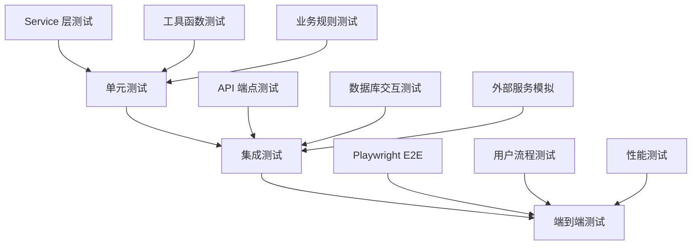

# 开发指南

<cite>
**本文引用的文件**
- [AGENTS.md](file://AGENTS.md)
- [backend/app/main.py](file://backend/app/main.py)
- [backend/app/config.py](file://backend/app/config.py)
- [backend/tests/integration/test_cli_service_parity.py](file://backend/tests/integration/test_cli_service_parity.py)
- [backend/tests/integration/test_issue_88_90_91.py](file://backend/tests/integration/test_issue_88_90_91.py)
- [backend/app/services/cash_transfer_service.py](file://backend/app/services/cash_transfer_service.py)
- [.github/PULL_REQUEST_TEMPLATE.md](file://.github/PULL_REQUEST_TEMPLATE.md)
- [frontend/package.json](file://frontend/package.json)
</cite>

## 更新摘要
**变更内容**   
- 完全重写为基于 AGENTS.md v5.0 的项目级参考指南
- 新增开发流程约定章节，包含分支模型、Issue/PR 约定、提交信息规范
- 更新非对称在途资金模型语义，修正相关测试断言
- 增强 GitHub 模板标准化，统一 Issue 和 PR 模板
- 更新了技术栈信息以反映最新版本（Next.js 15、React 19、TypeScript 5.6）
- 增强了领域模型、状态机和业务规则的详细说明

## 目录
1. [项目概览](#项目概览)
2. [核心领域模型与不变量](#核心领域模型与不变量)
3. [状态机与生命周期](#状态机与生命周期)
4. [后端架构](#后端架构)
5. [前端架构](#前端架构)
6. [CLI 工具](#cli-工具)
7. [约束与边界速查](#约束与边界速查)
8. [开发流程约定](#开发流程约定)
9. [开发环境搭建](#开发环境搭建)
10. [代码规范与最佳实践](#代码规范与最佳实践)
11. [测试策略](#测试策略)
12. [部署与运维](#部署与运维)
13. [故障排查指南](#故障排查指南)

## 项目概览

**InvestRing** 是我设计的供自己使用的投资组合管理工具，本质是一个支持净值化，多投资人的记账系统，为个人和家庭财富管理、大类资产配置提供完整的数据体系，适用的持仓资产目前限于：公募基金（含场内ETF和场外基金），股票，现金。所有资产人民币计价，无汇率换算。

**Monorepo 布局**：

| 目录 | 内容 |
|------|------|
| `backend/` | FastAPI + SQLAlchemy 后端；含 `app/`（应用）、`cli/`（管理 CLI）、`alembic/`（迁移）、`tests/` |
| `frontend/` | Next.js 15 + React 19 前端（App Router，双端路由） |
| `ir-cli/` | 独立轻量 HTTP 客户端 CLI（typer + httpx） |
| `nginx/`、`scripts/`、`docker-compose*.yml` | 部署与运维 |

**技术栈总览**：后端 FastAPI + SQLAlchemy + MySQL(pymysql) + Alembic + APScheduler；前端 Next.js `^15.1` / React `^19` / TS `~5.6` / Tailwind `^4` / shadcn(Radix) / Zustand `^5` / react-query `^5`；数据源 Tushare / AkShare。

**运行入口**：后端 `backend/app/main.py`（`FastAPI` 应用，启动时自动 `alembic upgrade head` + 初始化定时任务 + 启动调度器）；前端 `npm run dev`；管理 CLI `ir`（`backend/cli/main.py`）；HTTP CLI `ir`（`ir_cli.main:app`）。

章节来源
- [AGENTS.md:21-36](file://AGENTS.md#L21-L36)

## 核心领域模型与不变量

> 本章是所有业务规则的**单一事实来源**，其他章节只引用不重复。

### 快照三表与生成

**三张快照表，只增不改**：`portfolio_position`（持仓）、`portfolio_value_snapshot`（组合市值）、`investor_holding`（投资人份额）。

- 快照每天汇总生成一次（不是每笔交易生成），永不 UPDATE，保留完整历史（ORM 层 `before_update`/`before_delete` 事件兜底禁止实例级改删）。
- **固定生成顺序**：`portfolio_position` → `portfolio_value_snapshot` → `investor_holding`。
- **生成前提**：`confirm_date <= snapshot_date` 的申赎/交易/事件均已确认，不存在会影响该日的 pending 记录（存在 `ex_date <= target_date` 的 pending 事件时快照检查返回 failed）。
- **查询当前状态**：`WHERE snapshot_date = (SELECT MAX(snapshot_date) FROM ...)`。
- **快照连续原则**：快照具有前后依赖性，快照生成必须严格按照交易日顺序生成，新生成的快照必须和已有快照连续（从已有快照的最新snapshot_date的下一个交易日开始生成），循环生成快照失败时停止生成，不允许跳过。单日生成入口（`generate_daily_snapshots`）强制此校验：目标日仅允许为最新快照日（重建最新一日）或其下一个交易日，否则返回 `SNAPSHOT_NOT_CONTINUOUS`（重算路径逐日重建时内部 bypass）。

### 现金显式流水

所有现金变动**显式记录**，不再从申赎/调仓隐式反推。三类现金影响源：

| 来源 | 记录表 | 关联方式 |
|------|--------|----------|
| 交易（申赎/调仓/转移） | `trade`（CASH buy/sell） | `transfer_group` 关联同组记录 |
| 事件（现金分红等） | `share_change_event` | `cash_change` 字段，按 `ex_date` 生效 |
| 手动重估 | `manual_market_value` | 按日期绝对替换，不进 trade / event |

各业务操作生成的 CASH trade：

| 操作 | CASH trade | transfer_group |
|------|-----------|----------------|
| 申购确认 | 1 条 CASH buy（直接 confirmed） | `sub_{subscription.id}` |
| 赎回确认 | 1 条 CASH sell（直接 confirmed） | `sub_{subscription.id}` |
| 基金买入 | 基金 buy + CASH sell（同状态/日期） | `rebal_{uuid}` |
| 基金卖出 | 基金 sell + CASH buy（同状态/日期） | `rebal_{uuid}` |
| 跨平台转移 | CASH sell + CASH buy | `{uuid}`（12 位 hex） |

**两条计算口径**（`position_service.py`）：

```
compute_cash_balance(T) = SUM(confirmed CASH trades WHERE confirm_date <= T)
                        + SUM(confirmed events WHERE ex_date <= T, cash_change != 0)

calculate_available_cash(T?) = 最新快照日 portfolio_position 的 CASH cash_amount（基线）
                             + SUM(confirmed CASH buys  WHERE confirm_date > 快照日 [AND confirm_date <= T])
                             − SUM(confirmed CASH sells WHERE confirm_date > 快照日 [AND trade_date <= T])
                             − SUM(pending CASH sells [WHERE trade_date <= T])
                             + SUM(confirmed event cash_change WHERE ex_date > 快照日 [AND ex_date <= T])
```

- **时点口径**（#70/#78）：现金流出（sell）的资金承诺锚定**下单日 trade_date**，不论 pending/confirmed（消除 pending→confirmed 翻转后预留隐身）；流入（buy）仍须 confirmed 且 confirm_date <= T 才计入。T（as_of_date）为空时不设上限。

- 快照生成走 `_generate_portfolio_position` 增量累加路径（前一日 CASH 基准 + 窗口内 confirmed CASH trades + event `cash_change` 增量 + `manual_market_value` 绝对覆盖）。
- 有快照时 `calculate_available_cash` 直接读快照表基线；无快照时降级为 `compute_cash_balance`。
- **现金中转约束**：卖出 pending 不自动增加可用现金，买入只能用已有可用现金；不足时须先卖后买两步操作。
- **CASH trade 来源受限**：CASH trade 仅由申赎、基金调仓配对、跨平台现金转移三条路径生成（均预置 `transfer_group`）；`trade.transfer_group` 为 **NOT NULL**，REST 与 CLI 均禁止直接创建 `product_code="CASH"` 的交易（`CASH_TRADE_FORBIDDEN`）。
- **平台维度**：现金按平台分别追踪，`portfolio_position` 的 CASH 记录唯一约束为 `(portfolio_code, product_code, market, platform_code, snapshot_date)`；申购/赎回必须指定 `platform_code`（现金归属平台）。跨平台转移的状态机见 §3.3。

### 实时可用量计算

冻结份额/现金必须**实时计算**，不能仅读快照 frozen 字段。

```
基金可用份额   = 最新快照份额 − SUM(pending卖出) − SUM(confirmed卖出 WHERE 快照未生成)
投资人可用份额 = 最新快照份额 − SUM(pending赎回) − SUM(confirmed赎回 WHERE 快照未生成)
可用现金       = 见 §2.2 calculate_available_cash
```

### 净值·成本·市值

- **初始净值固定 1.0000**：首次申购确认时净值 = 1.0000，份额 = 金额（无需行情）。
- **净值稳定性**：申购/赎回/现金分红/份额拆分合并 → 净值不变；调仓 → 净值可能变化。
- **市值** = Σ(场内份额 × 收盘价) + Σ(场外份额 × 净值) + Σ(非净值型资产金额)。
- **净值** `unit_price = total_value / total_shares`（4 位小数）。
- **份额统一 2 位小数**（ROUND_DOWN，第 3 位直接舍去）：产生点（申购确认 `amount/nav`、调仓买入 `amount/price`、卖出/赎回用户输入、份额事件变动计算）统一经 `app/utils/quantize.py::quantize_shares` 量化；读取/累加路径不量化。净值 4 位、金额 4 位不变。
- **卖出/赎回输入份额先量化再校验**：量化到 2 位后与可用份额**精确比较**（无容差），超出返回 `INSUFFICIENT_SHARES`。
- **成本价**：首次 = 组合净值；后续 = `(old×cost + new×price)/(old + new)`。
- **赎回按申请日净值**计算，不是确认日净值。

### 交易日约束

所有交易操作（申购、赎回、调仓、现金进出、事件日期）仅允许在交易日进行。判断依据：`trading_calendar` 表 `is_open = true`。非交易日返回 `NON_TRADING_DAY`。

章节来源
- [AGENTS.md:44-144](file://AGENTS.md#L44-L144)

## 状态机与生命周期

### 组合状态（`portfolio.status`）

```
draft ──首次申购确认──▶ active ──close──▶ closed ──reactivate──▶ active
```

- 创建时为 `draft`；首次申购确认后自动置 `active`（`started_at` 记录）。
- 关闭前检查：存在 pending 申赎或 pending trade → `PENDING_TRANSACTIONS_EXIST`；已关闭再关 → `PORTFOLIO_ALREADY_CLOSED`。
- 仅 `closed` 可 `reactivate`（否则 `PORTFOLIO_NOT_CLOSED`）。
- 已关闭组合禁止申赎/调仓，但可查询历史。

### 交易/申赎/事件状态

三者共用 `pending / confirmed / cancelled`，均支持 confirm / unconfirm / cancel：

- **确认（confirm）**：申赎确认时计算份额/金额并生成配对 CASH trade；trade 确认时按 `product.confirm_days` 计算 `confirm_date`（可传参覆盖，用于补录），并取 T 日净值/收盘价；事件确认时从 `entitlement_date` 快照回写 `entitlement_shares` 并计算变动值。
- **取消确认（unconfirm）**：回退至 pending。**快照保护**——若 `confirm_date`（trade/subscription）或 `ex_date`（event）及之后已有快照，拒绝并返回 `SNAPSHOT_DEPENDENCY`。申赎 unconfirm 会物理删除配对 CASH trade（`transfer_group="sub_{id}"`）。
- **取消（cancel）**：仅 pending 可取消，置 `cancelled`。场内 trade 不可 cancel（`CANNOT_CANCEL_EXCHANGE`）。
- 已 confirmed 的 trade/subscription 不可直接 PUT/DELETE（`CANNOT_MODIFY_CONFIRMED` / `CANNOT_DELETE_CONFIRMED`），须先 unconfirm。

### transfer_group 原子翻转

confirm / unconfirm / cancel 基金腿时，配对 CASH 腿通过 `trade_service.sync_transfer_group` 自动同步状态与 `confirm_date`；金额字段变动时同步 CASH 腿金额；delete 基金腿时级联删除配对 CASH 腿。

**现金跨平台转移**（`cash_transfers.py`）是 transfer_group 的特例，复用 `trade` 表，一次转移生成两条 CASH 腿（sell + buy）：

- **当天完成**（`cross_day=False`）：两腿立即 confirmed，`confirm_date = transfer_date`。
- **跨天到账**（`cross_day=True`，#93 非对称模型）：转出方（sell）当日 confirmed、`confirm_date = transfer_date`；转入方（buy）pending、`confirm_date = next_trading_day`，次日经 `confirm` 端点确认。非对称状态保证 D 日 NAV 不因在途转移虚跌（转出方当日扣减，转入方在途不虚增）。`confirm_cash_transfer` 确认该组内所有仍为 pending 的 CASH legs（向后兼容旧对称模型）。
- 跨天判断（`list_cash_transfers`）：以 buy 腿为准——`buy.status != "confirmed"` 或 `buy.confirm_date > buy.trade_date`。在途期间转入腿 pending 不计入目标平台可用现金；已确认的转出腿正常扣减源平台现金。

### 快照删除与重算

- **删除快照**（`_delete_existing_snapshots`）自动级联回退：`confirm_date==D` 的申购退回 pending 并删除关联 CASH trade；`ex_date==D` 或 `entitlement_date==D` 的 confirmed 事件退回 pending；基金级父事件的子记录（`parent_event_id`）被物理删除。批量删除从最新日倒序、逐日 commit。
- 遵循**快照连续原则**，不能仅删除中间的快照，删除某日的快照其后的快照也一并删除，
- **重算**（`recalculate_snapshots`）为**单一事务**：删除任何快照前先对整区间做净值完整性预校验，失败直接拒绝、不删任何快照；随后逐交易日「删旧快照 → 级联回退 → 重建 → auto_confirm」全程不 commit，任一日失败记录 error 并停止，由调用方按 errors 统一 rollback/commit——对外表现为「要么完整成功，要么无变化」。`auto_confirm_after_snapshot` 每日后自动重确认 `apply_date==D` 的申购、`confirm_date==D` 的 trade、`ex_date==D` 的事件，单笔失败仅记录为 `auto_confirm_failed`、不阻断当日流程。

章节来源
- [AGENTS.md:147-194](file://AGENTS.md#L147-L194)

## 后端架构

### 分层目录与职责

| 目录 | 职责 |
|------|------|
| `app/routers/` | HTTP 薄适配层：解析参数、鉴权（`Depends`）、调 service、`db.commit()`、序列化；业务错误交全局 handler，不写 try/except 业务分支 |
| `app/services/` | 全部业务规则/不变量/计算/状态机/ORM 读写；**只抛领域异常、不 import fastapi、不 commit（可 flush）** |
| `app/models/` | SQLAlchemy 表模型（23 张表） |
| `app/schemas/` | Pydantic 请求/响应模型 |
| `app/utils/` | 安全（密码/Token/登录锁）等工具 |
| `app/config.py` / `database.py` / `dependencies.py` | 配置、DB 会话、鉴权依赖 |

**分层约定（router / CLI 均为 service 薄适配器）**：业务逻辑单一实现于 service，REST 与两个 CLI 共用，杜绝并行实现漂移。
- **事务边界属于 session 拥有者**：service 收到的是调用方注入的 session，不 `commit`/`rollback`（可 `flush`）；REST 在 router `db.commit()`（部分失败语义的端点如 recalculate 按 errors 决定 rollback/commit），`backend/cli` 由 `cli_context()` 统一 commit。**合理例外**（自己就是 session 拥有者/调用方）：自持 `SessionLocal` 的后台执行体（sync job 线程、scheduler 触发体）与 `task_runner` 编排层的 checkpoint 提交（逐日快照回补、逐产品远程同步，需保留部分成功）可自行 commit。
- **领域异常统一**：service 抛 `app/services/exceptions.py::BusinessError`（携 `code`/`message`/`http_status`/`details`）；`main.py` 全局 handler 映射为 `JSONResponse{"detail": {"error": code, "message": message}}`（保持前端契约；默认 422、重复创建类 400、NOT_FOUND 404）；`cli_context` 捕获后转 `{"error": {"code", "message"}}`。service 内**禁止** import/抛 `HTTPException`。

### 路由与 API 前缀总表

`main.py` 注册 **18 个 router，约 98 个端点**。注意前缀不完全统一：

| Router | 前缀 | 端点数 | 权限 | 主要端点 |
|--------|------|:---:|------|----------|
| `auth` | `/api/auth` | 3 | 公开/登录态 | login / logout / password |
| `investors` | `/api/investors` | 5 | admin | CRUD（DELETE 校验持仓） |
| `portfolios` | `/api/portfolios` | 9 | user/admin | CRUD、close、reactivate、nav-history、returns、cash-flow |
| `products` | `/api/products` | 6 | user/admin | CRUD（自动算 confirm_days）、GET /{code}（不带 market 自动解析） |
| `platforms` | `/api/platforms` | 5 | user/admin | CRUD |
| `trading_calendar` | `/api/trading-calendar` | 5 | user/admin | GET、POST /sync、next / prev / is-open |
| `data_sources` | `/api/system/data-sources` | 2 | user/admin | GET、PUT /{name} |
| `market_data` | `/api/market-data` | 4 | 公开 | price-data、nav-coverage、sync-price-data、sync-history |
| `subscriptions` | `/api/subscriptions` | 8 | user/admin | CRUD + confirm/cancel/unconfirm |
| `trades` | `/api/trades` | 9 | user/admin | CRUD + confirm/cancel/unconfirm/preview |
| `share_change_events` | `/api/share-change-events` | 8 | user/admin | CRUD + confirm/cancel/unconfirm |
| `positions` | `/api/positions` | 8 | user/admin | 列表、available-cash、available-shares、cash-position（CRUD 被保护） |
| `logs` | `/api/system/logs` | 3 | admin | login / audit / error |
| `tasks` | `/api/system/tasks` | 6 | admin | 列表、describe、run、enable、disable、logs |
| `notifications` | `/api/system/notifications` | 3 | user | 列表、read、read-all |
| `snapshots` | **`/api/v1/snapshots`** | 9 | user/admin | generate、recalculate、recalculate-async（#89 异步 job）、catch-up、generate-next、validation、status、delete、bulk delete（支持 `dry_run`） |
| `cash_transfers` | **`/api`** | 3 | admin | cash-transfer 创建、confirm、列表 |
| `sync_jobs` | `/api/sync-jobs` | 3 | admin | price、job 状态、details |

> 例外提醒：`snapshots` 因 router 自带 `prefix="/snapshots"` 且挂载在 `/api/v1`，完整路径为 `/api/v1/snapshots/...`；`cash_transfers` 挂载在 `/api`，路径形如 `/api/portfolios/{code}/cash-transfer`。日志/任务/通知/数据源均在 `/api/system/*`。

### 核心服务与关键函数

- **`snapshot_service.py`**：`generate_daily_snapshots` / `recalculate_snapshots` / `validate_snapshot_dependencies`；三个生成函数 `_generate_portfolio_position` → `_generate_portfolio_value_snapshot` → `_generate_investor_holding`（固定顺序）；`auto_confirm_after_snapshot`（重算后自动重确认）；`_delete_existing_snapshots`（删除级联回退）。`_generate_portfolio_position` 走增量累加：前一日 CASH 基准 + 窗口内 confirmed CASH trades + event `cash_change` 增量，`manual_market_value` 绝对覆盖；事件只读 `platform_code IS NOT NULL` 的 confirmed 记录，按 `entitlement_date` 升序、`fund_key=(product_code, market, platform_code)` 精确匹配。`_compute_in_transit_amounts`（#93）每日按平台/方向绝对计算在途金额并生成 `IN_TRANSIT_BUY`/`IN_TRANSIT_SELL` 行（不继承前日）；`_generate_portfolio_value_snapshot` 汇总 `in_transit_total`。
- **`position_service.py`**：`compute_cash_balance`、`get_cash_value`、`calculate_available_cash`、`calculate_available_shares`、`calculate_investor_available_shares`、`update_cash_position`（现金重估写 `manual_market_value` 绝对替换，绝不直接写 `portfolio_position`；同日存在 confirmed CASH trade 时返回 warnings 提示覆盖将压制交易效果）、`list_manual_cash_overrides` / `delete_manual_cash_override`（#88 覆盖层查询/删除，删除后需重算快照回退自然值）。
- **`trade_service.py`**：`create_trade`（快照/价格/平台/`as_of_date` 校验 + 买卖金额份额计算 + `attach_paired_cash_leg`）、`confirm_single_trade`（含 QDII 净值获取规则，禁止向前查找）、`cancel_trade` / `unconfirm_trade`（快照保护 + `sync_transfer_group`）、`sync_transfer_group`（配对腿同步状态/`trade_date`/金额，#93 起不再传播 `confirm_date`）、`attach_paired_cash_leg`（基金腿创建时生成 `rebal_` 组并构造配对 CASH 腿，#93 新增 `cash_confirm_date` 参数按方向推导 CASH 腿确认日，REST/CLI 共用）。
- **`subscription_service.py`**：`create_subscription`（含 `DATE_BEFORE_SNAPSHOT`、创建即设 `confirm_date`）、`confirm_single_subscription` / `unconfirm_single_subscription`（首次申购净值 1.0000、生成/删除配对 CASH trade、首次确认激活组合）。
- **`share_change_event_service.py`**：`create/confirm/cancel/unconfirm_share_change_event` 全套 + `_compute_event_fields` / `check_platform_coverage` / `_confirm_fund_level_event`（基金级自动拆分子记录、平台分级校验、快照保护）。`snapshot_service.auto_confirm_after_snapshot` 由此模块 import（消除 service→router 反向依赖）。
- **`cash_transfer_service.py`**：`create_cash_transfer`（#93 非对称状态：跨天转出方当日 confirmed/转入方 pending / 当天两腿 confirmed）、`confirm_cash_transfer`（确认组内所有 pending CASH legs + `TRANSFER_NOT_READY`，向后兼容）、`list_cash_transfers`（按 `transfer_group` 分组，跨天判断以 buy 腿状态/日期为准）。
- **`portfolio_service.py`**：`create/update/close/reactivate_portfolio`（`closed_at=datetime.utcnow()` 统一口径）、`get_nav_history` / `get_returns` / `get_cash_flow`。
- **`product_service.py`**：`calculate_confirm_days`（单一实现：CN_EXCHANGE=0 / CN_OTC 非 QDII=1 / CN_OTC QDII=2 / 其他=1）、`create_product` / `update_product`。
- **`investor_service.py`**：`create_investor`（`role` 默认 viewer，CLI 可显式传入以建管理员）、`update_investor`（`password`→`password_hash`）、`delete_investor`（`INVESTOR_HAS_SHARES` 保护）。
- **`exceptions.py`**：`BusinessError` / `NotFoundError`——领域异常基类（见 §4.1），REST 全局 handler 与 `cli_context` 共同消费。
- **`market_data_service.py`**：价格/净值查询与同步、`get_nav_coverage`（区间净值覆盖校验：trading_calendar 与 price_record 集合差）、`submit_price_sync_job`（锁仅限价格同步类 job_type）、`recover_orphan_jobs`。
- **`snapshot_recalc_job.py`**（#89）：`submit_snapshot_recalc_job`（复用 sync_job 表 + 线程池，job_type=`snapshot_recalc`，同类型单 active 锁、与价格同步锁互不阻塞）；后台执行体自持 SessionLocal，保持 `recalculate_snapshots` 单一事务语义（无 errors 统一 commit、否则整体 rollback），终态经 `GET /api/sync-jobs/{id}` 轮询（success=已提交 / failed=已整体回滚）。
- **`trading_calendar_service.py`** / **`trading_utils.py`**：交易日判断、下一/前一交易日、最新快照日查询。
- **`task_runner.py`** / **`scheduler_service.py`**：`run_nav_sync` / `run_calendar_sync` / `run_log_cleanup`；APScheduler 调度。

### 数据模型与关键约束

**唯一约束**：
- `trade`：`(transfer_group, product_code, trade_type)` — 防重复确认生成重复 CASH trade。`transfer_group` **NOT NULL**（每笔 trade 必属一个业务组）：基金腿与 CASH 腿按 `product_code` 区分、现金转移两腿按 `trade_type` 区分、申赎为单腿 `sub_{id}`，故 NOT NULL 下仍无碰撞。
- `portfolio_position`：`(portfolio_code, product_code, market, platform_code, snapshot_date)`；并有 CHECK 约束 `shares` 与 `cash_amount` 二者恰有其一（净值型 vs 非净值型）。
- `portfolio_value_snapshot`：`(portfolio_code, snapshot_date)`。
- `manual_market_value`：`(portfolio_code, platform_code, product_code, value_date)`。

**双日期与分级（`share_change_event`）**：`ex_date`（除息日，应用日）+ `entitlement_date`（权益登记日，基数日），要求 `ex_date > entitlement_date` 且两者均为交易日。`platform_code`（平台级事件必填）、`parent_event_id`（基金级拆分子记录自引用）。

**外键**：所有实体删除行为均为 **RESTRICT**，通过业务流程（关闭/停用）管理生命周期，保留历史数据。

### 配置与运行

- **数据库**：`config.py` 默认 `mysql+pymysql://{user}:{pwd}@{host}:{port}/{db}?charset=utf8mb4`；生产用 QueuePool（`pool_size=10`、`max_overflow=20`、`pool_pre_ping`、`pool_recycle=3600`、`pool_timeout=30`）。配置经 `.env` 覆盖。
- **迁移**：`alembic/`；`main.py` 启动时自动 `upgrade head`。**0006（#93，不可逆）**：将 8 处 `product_code`/`code` 列由 `String(10)` 扩展为 `String(20)`（支持 `IN_TRANSIT_BUY`/`IN_TRANSIT_SELL` 长命名，`product.code` 为复合 FK 引用方，扩展后 FK 关系不变）；为 `portfolio_value_snapshot` 新增 `in_transit_total`（`Numeric(15,4)`，`server_default='0'`）；种子 IN_TRANSIT 产品记录。幂等设计（`alter_column` 对已是目标长度的列为 no-op、`add_column`/种子用 `ON DUPLICATE KEY UPDATE`/`INSERT OR IGNORE`）。
- **调度**：`scheduler_enabled`；`init_tasks.py` 确保 3 个任务记录存在（见附录 B）；启动时同步任务 name/description 文案，但不覆盖已有 cron_expr。
- **数据源**：Tushare（`TUSHARE_TOKEN`，限流/重试可配）、AkShare（`AKSHARE_ENABLED`）；`data_sources` 路由读写 `.env`。
- **安全**：`token_expire_days=7`；登录失败锁定、Token 黑名单、改密后强制重登。

章节来源
- [AGENTS.md:197-302](file://AGENTS.md#L197-L302)
- [backend/app/main.py:1-91](file://backend/app/main.py#L1-L91)
- [backend/app/config.py:1-53](file://backend/app/config.py#L1-L53)

## 前端架构

### 技术栈（实际版本，见 `frontend/package.json`）

Next.js `^15.1` + React `^19` + TypeScript `~5.6` + TailwindCSS `^4`（CSS-first）+ shadcn/ui（Radix UI）+ Zustand `^5` + @tanstack/react-query `^5` + axios、recharts、date-fns、lucide-react、sonner。E2E 用 Playwright。

### 双端路由与 Middleware

- 移动端：`/m/` 前缀；PC 端：根路径。
- `src/middleware.ts` 按 User-Agent（`Mobile|Android|iPhone|iPad|iPod`）自动重定向：`/` → `/dashboard` 或 `/m/dashboard`；移动端非 `/m` 路径重定向到 `/m`+path，反之亦然；未登录（无 `token` cookie）重定向到对应登录页。

### 组件三层复用策略

- **完全共享**：`hooks/`（数据层）、`stores/`（状态）、`components/ui/`（原子组件，约 17 个）、`types/`。
- **共享业务组件**：`components/shared/`（`PortfolioListContent` / `TradesContent` / `SubscriptionsContent` / `DashboardStatsCards` / `PortfolioStatsCards` / `PortfolioActionButtons` / `PositionCard` / `TradeForm` / `LoadingState` / `EmptyState` / `StatCard`，以及 `dialogs/`）——通过 `variant: "desktop" | "mobile"` + `basePath` 适配两端。
- **独立实现**：`components/mobile/`（MobileLayout、BottomNav、ActionSheet、CardStack）、`components/desktop/`（Sidebar、DataTable、SplitPane）、`components/layout/`、`components/charts/`。

### API 层、hooks、stores、质量门禁

- **API 层**：`src/lib/api/` 按域拆分 15 个模块（`auth`/`investor`/`portfolio`/`position`/`subscription`/`trade`/`product`/`platform`/`system`/`snapshot`/`share-change-event`/`log`/`task`/`notification`/`cash-transfer` + 共享 `client`），经 `index.ts` barrel 统一导出（`@/lib/api`）。
- **hooks**（`src/hooks/`，约 10 个）：`useAuth`、`usePortfolio`、`usePosition`、`useTrade`、`useInvestor`、`usePlatform`、`useProduct`、`useSnapshot`、`useCashTransfer`、`useDashboardStats`。
- **stores**（`src/stores/`）：`authStore`、`uiStore`。
- **质量门禁**：ESLint v9 flat config（`eslint.config.mjs`，`npm run lint` 即 `eslint .`）；构建期强制 lint + tsc，0 error 才能通过 `next build`。
- **API 代理**：`next.config.js` 将 `/api/:path*` rewrite 到后端（默认 `http://localhost:8000`）。

### 真实页面地图（`frontend/src/app/**/page.tsx`）

| PC 路径 | 移动端 | 说明 |
|---------|--------|------|
| `/login` | `/m/login` | 登录 |
| `/dashboard` | `/m/dashboard` | 首页概览 |
| `/investors` | `/m/investors` | 投资人管理（admin） |
| `/platforms` | `/m/platforms` | 平台管理（admin） |
| `/products` | `/m/products` | 产品管理（admin） |
| `/portfolio` | `/m/portfolio` | 组合列表 |
| `/portfolio/[code]` | `/m/portfolio/[code]` | 组合详情 |
| `/portfolio/[code]/positions` | `/m/portfolio/[code]/positions` | 持仓 |
| `/portfolio/[code]/trades` | `/m/portfolio/[code]/trades` | 调仓交易 |
| `/portfolio/[code]/subscriptions` | `/m/portfolio/[code]/subscriptions` | 申购赎回 |
| `/portfolio/[code]/snapshots` | —（仅 PC） | 快照管理 |
| `/portfolio/[code]/share-change-events` | —（仅 PC） | 份额变动事件 |
| `/settings` | `/m/settings` | 系统设置 |
| `/settings/logs` | `/m/settings/logs` | 日志管理 |
| `/settings/tasks` | `/m/settings/tasks` | 任务管理 |

> 移动端多为薄壳页（约 7–12 行），套 `MobileLayout` 后渲染共享内容组件；日志/任务是 `settings` 子页而非顶级页面。

章节来源
- [AGENTS.md:305-358](file://AGENTS.md#L305-L358)
- [frontend/package.json:1-51](file://frontend/package.json#L1-L51)

## CLI 工具

项目有**两套** `ir` 命令，用途不同：

| | `backend/cli`（管理 CLI） | `ir-cli`（HTTP 客户端） |
|---|---|---|
| 定位 | AI Agent 原生工具，**直连数据库服务层** | 通过 HTTP 调用运行中的后端 |
| 依赖 | 后端应用（`CLI_MODE=1`） | typer + httpx（轻量独立包） |
| 输出 | 结构化 JSON | HTTP 响应 |
| 入口 | `backend/cli/main.py`（`ir`） | `ir_cli.main:app`（`ir`） |

两者命令组一致（16 组）：`auth`、`investor`、`portfolio`、`position`、`sub`、`trade`、`share-event`、`market`、`product`、`platform`、`system`、`log`、`task`、`snapshot`、`cash-transfer`、`sync-job`。

> 详见 `backend/CLI_MANUAL.md`。

ir-cli 的 `ir schema` 已含响应字段契约（`commands.<group>.<sub>.output.fields`，`*`前缀=默认摘要字段、`?`后缀=可空）与 `--index` 索引模式（极简命令索引，再按 `ir schema <group>` 按需加载）；契约由 `ir-cli/scripts/gen_response_fields.py` 从 `backend/openapi.json` 生成，CI 做一致性校验。

章节来源
- [AGENTS.md:361-377](file://AGENTS.md#L361-L377)

## 约束与边界速查

> 规则本体见第 2、3 章；下表仅列「触发条件 → 处理方式/错误码」。

### 申购赎回

| 条件 | 处理 |
|------|------|
| 申购金额 ≤ 0 | `INVALID_AMOUNT` |
| 赎回份额 ≤ 0 | `INVALID_SHARES` |
| 赎回份额 > 可用份额（实时算） | `INSUFFICIENT_SHARES` |
| 申请日 ≤ 最新快照日 | `DATE_BEFORE_SNAPSHOT` |
| 非交易日 | `NON_TRADING_DAY` |
| 组合非 active/draft | `PORTFOLIO_NOT_ACTIVE` |
| 平台不存在 | `PLATFORM_NOT_FOUND`（申赎必填 `platform_code`） |
| 非首次申购但申请日无组合快照 | `NAV_NOT_AVAILABLE` |
| unconfirm 时确认日及之后已有快照 | `SNAPSHOT_DEPENDENCY` |

- 申购输入**金额**（份额 = 金额 / 申请日净值）；赎回输入**份额**（金额 = 份额 × 申请日净值）。

### 调仓交易

| 条件 | 处理 |
|------|------|
| 买入金额 ≤ 0 | `INVALID_AMOUNT` |
| 卖出份额 ≤ 0 | `INVALID_SHARES` |
| 买入金额 > 可用现金（pending 卖出不增加可用现金） | `INSUFFICIENT_CASH` |
| 基金买入确认时可用现金不足（按确认日时点口径，加回自身在途 CASH 腿；`skip_cash_check` 仅 auto_confirm） | `INSUFFICIENT_CASH` |
| 创建时命中同组合/产品/市场/平台/方向/交易日且金额（买）或份额（卖）相同的 pending/confirmed 交易（未传 `allow_duplicate`；cancelled 不算） | `DUPLICATE_TRADE` |
| 卖出份额 > 可用份额 | `INSUFFICIENT_SHARES` |
| 场内交易缺有效价格 | `MISSING_OR_INVALID_PRICE` |
| 场外基金确认传入价格与 T 日净值不一致 | `PRICE_NAV_MISMATCH` |
| 交易日 ≤ 最新快照日 | `DATE_BEFORE_SNAPSHOT` |
| 仅给 product_code 且一码多市场（LOF） | `MARKET_AMBIGUOUS`（`details.available_markets` 列出可选市场，需显式指定 market） |
| 场内 trade cancel | `CANNOT_CANCEL_EXCHANGE` |
| 直接创建 CASH 交易（`product_code=CASH`） | `CASH_TRADE_FORBIDDEN`（REST 422 / CLI；须走申赎/现金转移/调仓配对） |

- 金额：买入 `amount = actual_amount − fee`、`shares = amount/price`；卖出 `amount = actual_amount + fee`。
- `confirm_date` 创建时即按 `product.confirm_days` 设定；`confirm` 可传参覆盖（补录）。
- 基金买卖创建时自动生成配对 CASH trade（`rebal_{uuid}`），状态/日期与基金腿同步；CASH 腿平台可经 `cash_platform_code` 指定为其他平台（#91 跨平台扣款/到账，现金校验按扣款平台）。
- 确认取价规则：场内用成交价（录入交易时必填，见 §7.2）、场外用净值；确认必须用 T 日净值（包括QDII），未同步则拒绝（禁止向前查找；可传 `sync_nav`/`--sync-nav` 在 MISSING_NAV 时自动回填净值并重试一次，#90）；QDII快照/市值用 T-1 日净值。确认天数（T+N）见附录 C。场外基金确认可选传入价格，仅用于与 T 日净值一致性校验（不一致报 `PRICE_NAV_MISMATCH`），不覆盖净值。

### 份额变动事件

| 条件 | 处理 |
|------|------|
| 权益登记日非交易日 | `INVALID_ENTITLEMENT_DATE` |
| 除息日非交易日 | `INVALID_EX_DATE` |
| `ex_date <= entitlement_date` | `INVALID_DATE_ORDER` |
| 除息日 ≤ 最新快照日 | `DATE_BEFORE_SNAPSHOT` |
| 平台级事件缺 `platform_code` | `PLATFORM_REQUIRED` |
| 基金级事件指定了 `platform_code` | `PLATFORM_NOT_ALLOWED` |
| 平台级未全覆盖有持仓平台 | 默认 `PLATFORM_NOT_COVERED`（阻断）；`force_cover=true` 降为 warning |
| 确认时权益登记日持仓快照缺失 | `MISSING_POSITION_SNAPSHOT` |
| 单独 unconfirm 子记录 | `CANNOT_UNCONFIRM_CHILD` |

- **分级**：基金级（`share_split`/`share_merge`/`bonus_share`，`platform_code` 空，确认时按平台自动拆分子记录）；平台级（`cash_dividend`/`reinvest_dividend`/`forced_adjustment`，每个有持仓平台各录 1 条）。
- 确认时从 `entitlement_date` 快照回写 `entitlement_shares` 并按类型计算（`forced_adjustment` 由用户直接填写）。
- 事件类型与计算：`cash_dividend` → `cash_change = 份额×div_cash`；`reinvest_dividend` → `shares_change = 份额×div_cash/reinvest_nav`；`share_split` → `×ratio`；`share_merge` → `/ratio`；`bonus_share` → `+份额×ratio`。

### 组合管理

| 条件 | 处理 |
|------|------|
| 关闭时存在 pending 交易 | `PENDING_TRANSACTIONS_EXIST` |
| 关闭已关闭组合 | `PORTFOLIO_ALREADY_CLOSED` |
| reactivate 非 closed 组合 | `PORTFOLIO_NOT_CLOSED` |
| 删除仍持有份额的投资人 | `INVESTOR_HAS_SHARES` |
| 手动 CRUD 持仓表 | `POSITION_TABLE_PROTECTED` |
| 更新现金缺 `platform_code` / 非交易日 | 平台必填 / `NON_TRADING_DAY` |

### 易错陷阱（补充，非上表内容）

1. 现金市值修正走 `POST /positions/portfolio/{code}/cash-position` 写 `manual_market_value`（绝对替换），**不直接改 `portfolio_position`**；写入后需重新生成快照。
2. LOF 拆分为两条记录（场内/场外分别处理）。
3. 组合份额仅因申购赎回变化；分红再投资只影响成分基金份额。
4. 投资人不支持强制物理删除——份额需为 0 才能删。
5. 幂等性缓存（`idempotency_cache`）24 小时过期，批量调仓用 `Idempotency-Key`。

章节来源
- [AGENTS.md:380-463](file://AGENTS.md#L380-L463)

## 开发流程约定

> 单人 + AI 编程协作的工作流约定。**代码是唯一事实来源**；本约定只约束动作边界，不做过度流程。

### 分支模型

| 分支 | 角色 | 规则 |
|------|------|------|
| `dev` | 开发草稿线 | 日常小修直接 push；可随时推翻重来 |
| `main` | 生产交付线 | 合入即触发 CI → CD 自动部署上线 |

- **合 `main` 永远走 PR**（CI 全量门禁：SQLite pytest + MySQL 8.4 方言/迁移链 + ir-cli 契约 + 前端 lint/build）。
- **分支命名**：`feature/<issue号>-<简述>`、`hotfix/<issue号>-<简述>`、`release/<版本>`；AI 代理干活可用 `trae/xxx`、`codex/xxx` 前缀。**合完即删**，不堆积。
- 改动前先 `git fetch` 确认基线：hotfix 可能先合 main 再合 dev，**dev 可能落后于 main**，以 main 为最新事实源。

### Issue 约定

- **新功能 / 大改 / 涉及业务规则或 DB 迁移**：必须先提 issue 再动手；修 bug 若影响面大或需留痕，同样先提 issue。
- **修复类 issue 要点**：现象（操作 → 报错 → 期望）→ 根因 → 影响面 → 修复方向 → 验收断言。
- **需求类 issue 要点**：背景/目标 → 现状与问题 → 方案推演（表格对比）→ 选定方案 → 待实现改动（文件级）→ 验收断言。
- **验收断言必须可勾选**（"执行 X → 得到 Y"）：它是给 AI 的验收标准，也是后续测试用例的来源。
- 完整模板见 `.github/ISSUE_TEMPLATE/`（bug_report / feature_request）。

### PR 约定

- PR 描述必含：改动内容 / 关联 issue（`fixes #N` 自动关闭）/ 测试验证 / 部署影响（DB 迁移、新依赖、回滚要点）。
- 模板见 `.github/PULL_REQUEST_TEMPLATE.md`。
- **合入 `main` 前 CI 必须全绿**；上线后冒烟：health check + `ir portfolio list` + 关键数据抽查。

### 提交信息

- Conventional Commits 风格：`fix:` / `feat:` / `docs:` / `refactor:` / `chore:`，附简短说明并尽量带 issue 号（如 `fix(snapshot): 快照净值严格匹配 (#96)`）。

### AI 代理铁律

1. **改完必须验证**：本地测试绿 + 能说明改动影响；验证不了的改动不提交。
2. **排查/审查中发现的问题只提 issue，不直接改代码**，由任务所有者决定修复方式。
3. **动手前确认分支**：AI 默认在当前分支提交；被要求改大功能/新功能时，先开 `feature/` 分支。
4. **不得引入未要求的依赖或表结构改动**；涉及 DB 变更必须同步提供 Alembic 迁移脚本。
5. **仓库文档（README/AGENTS/runbook）随代码同一次提交更新**；设计决策与方案记录进 issue 讨论。
6. 当你执行一项任务发现有任何执行细节不明确时，你必须向我提问，而不是自做主张，在我回答之后仍有不明确的行细节时，你需要向我追问，直到了解了所有细节。

章节来源
- [AGENTS.md:466-515](file://AGENTS.md#L466-L515)

## 开发环境搭建

### 前置要求
- Node.js 18+（推荐 20 LTS）
- Python 3.10+
- MySQL 8.0+
- Docker & Docker Compose（可选，用于容器化部署）

### 快速启动

```bash
# 克隆项目
git clone https://github.com/yourusername/InvestRing.git
cd InvestRing

# 一键启动（包含前后端）
bash start.sh
```

### 手动安装

#### 后端环境
```bash
cd backend

# 创建虚拟环境
python -m venv .venv
source .venv/bin/activate  # Windows: .venv\Scripts\activate

# 安装依赖
pip install -r requirements.txt

# 配置环境变量
cp .env.example .env
# 编辑 .env 文件，配置数据库连接等信息

# 运行后端
uvicorn app.main:app --reload --port 8000
```

#### 前端环境
```bash
cd frontend

# 安装依赖
npm install

# 开发模式
npm run dev
```

### 环境变量配置

创建 `.env` 文件（位于项目根目录）：

```env
# 数据库配置
DB_HOST=localhost
DB_PORT=3306
DB_USER=root
DB_PASSWORD=your_password
DB_NAME=investring

# 安全配置
SECRET_KEY=your-secret-key-here
TOKEN_EXPIRE_DAYS=7

# Tushare API
TUSHARE_TOKEN=your_tushare_token

# 应用配置
APP_NAME=InvestRing
DEBUG=True
```

章节来源
- [AGENTS.md:21-36](file://AGENTS.md#L21-L36)
- [backend/app/config.py:1-53](file://backend/app/config.py#L1-L53)

## 代码规范与最佳实践

### 后端开发规范

#### 分层架构
- **Router 层**：仅负责参数解析、鉴权、调用 Service、提交事务、序列化响应
- **Service 层**：业务逻辑核心，包含所有规则、计算、状态机、ORM 操作
- **Model 层**：SQLAlchemy 数据模型定义
- **Schema 层**：Pydantic 请求/响应模型

#### 异常处理
- 使用 `BusinessError` 抛出领域异常
- 统一错误格式：`{"error": code, "message": message, "details": {...}}`
- Service 层禁止直接抛出 HTTPException

#### 数据库操作
- Service 层不直接 commit/rollback，由调用方管理事务边界
- 使用依赖注入获取 Session
- 避免 N+1 查询，合理使用 join 和批量操作

### 前端开发规范

#### 组件结构
- 原子组件放在 `components/ui/`
- 共享业务组件放在 `components/shared/`
- 平台特定组件放在 `components/mobile/` 或 `components/desktop/`

#### API 调用
- 统一的 API 客户端封装
- 错误处理和重试机制
- 请求拦截器处理认证和通用逻辑

#### 状态管理
- 使用 Zustand 管理全局状态
- React Query 处理服务器状态和数据缓存

章节来源
- [AGENTS.md:197-214](file://AGENTS.md#L197-L214)

## 测试策略

### 测试金字塔



### 测试框架选择

- **后端**：pytest + pytest-asyncio
- **前端**：Jest + React Testing Library
- **E2E**：Playwright
- **API 测试**：pytest + httpx

### 测试覆盖率要求

- 核心业务逻辑：≥ 90%
- API 端点：≥ 80%
- 工具函数：≥ 95%

### 非对称在途资金模型测试

**重要更新**：针对 #93 非对称在途资金模型的测试适配已完成：

- **跨天现金转移**：sell 腿当日 confirmed（`confirm_date = transfer_date`），buy 腿 pending（`confirm_date = next_trading_day`）
- **基金买入配对 CASH 腿**：`confirm_date = trade_date`（T 日扣款），不再与基金腿 `confirm_date` 一致
- **测试类名更新**：`TestCashTransferSymmetricParity` → `TestCashTransferAsymmetricParity`
- **测试方法调整**：`test_cli_cross_day_both_legs_pending` → `test_cli_cross_day_sell_confirmed_buy_pending`

章节来源
- [AGENTS.md:518-586](file://AGENTS.md#L518-L586)
- [backend/tests/integration/test_cli_service_parity.py:210-290](file://backend/tests/integration/test_cli_service_parity.py#L210-L290)
- [backend/tests/integration/test_issue_88_90_91.py:332-351](file://backend/tests/integration/test_issue_88_90_91.py#L332-L351)

## 部署与运维

### 容器化部署

```yaml
# docker-compose.yml 示例
version: '3.8'
services:
  mysql:
    image: mysql:8.0
    environment:
      MYSQL_ROOT_PASSWORD: ${DB_PASSWORD}
      MYSQL_DATABASE: ${DB_NAME}
    volumes:
      - mysql_data:/var/lib/mysql
  
  backend:
    build: ./backend
    ports:
      - "8000:8000"
    environment:
      - DATABASE_URL=${DATABASE_URL}
      - SECRET_KEY=${SECRET_KEY}
  
  frontend:
    build: ./frontend
    ports:
      - "3000:3000"
    depends_on:
      - backend

volumes:
  mysql_data:
```

### 生产环境配置

- 使用 Gunicorn 作为 WSGI 服务器
- Nginx 作为反向代理
- Redis 用于会话存储和缓存
- 监控和日志收集

### 健康检查和监控

- 健康检查端点：`/health`
- 性能指标收集
- 错误日志集中管理

章节来源
- [backend/app/main.py:83-91](file://backend/app/main.py#L83-L91)

## 故障排查指南

### 常见问题

#### 数据库连接问题
- 检查数据库服务是否正常运行
- 验证连接字符串和凭据
- 查看连接池配置

#### 端口冲突
- 检查 8000（后端）和 3000（前端）端口占用
- 修改配置文件中的端口号

#### 权限问题
- 确保数据库用户有足够权限
- 检查文件系统和目录权限

### 调试技巧

#### 后端调试
```bash
# 启用详细日志
export DEBUG=True

# 使用 pdb 断点调试
import pdb; pdb.set_trace()

# 查看 SQL 语句
export SQLALCHEMY_ECHO=True
```

#### 前端调试
- 使用浏览器开发者工具
- 网络面板查看 API 请求
- React DevTools 调试组件状态

### 日志分析

- 应用日志：`logs/app.log`
- 访问日志：`logs/access.log`
- 错误日志：`logs/error.log`

章节来源
- [AGENTS.md:518-586](file://AGENTS.md#L518-L586)