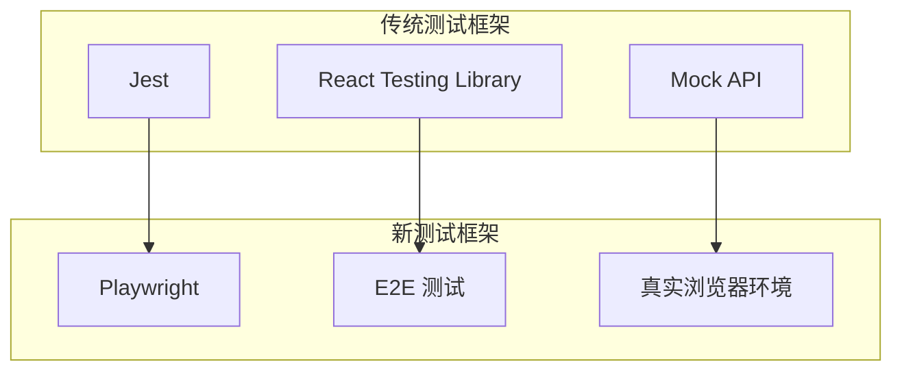
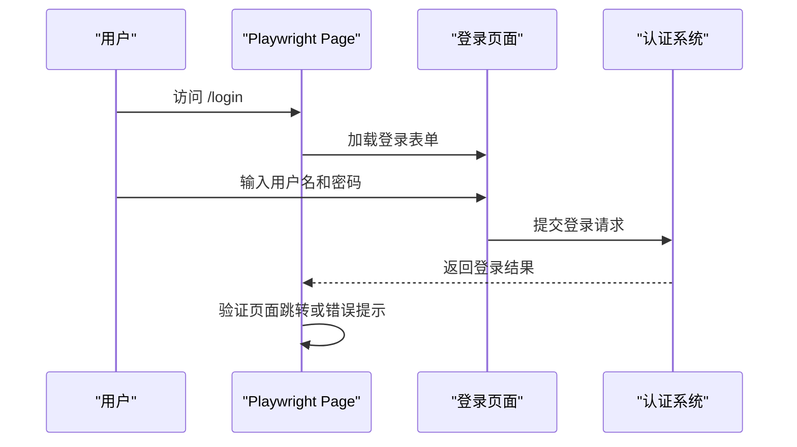
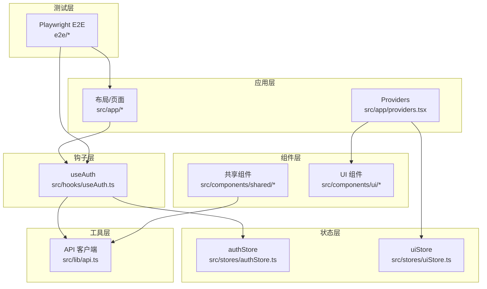
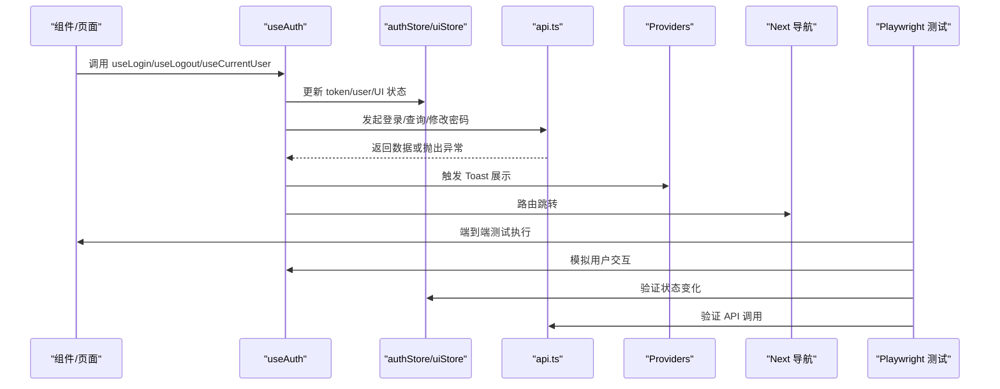
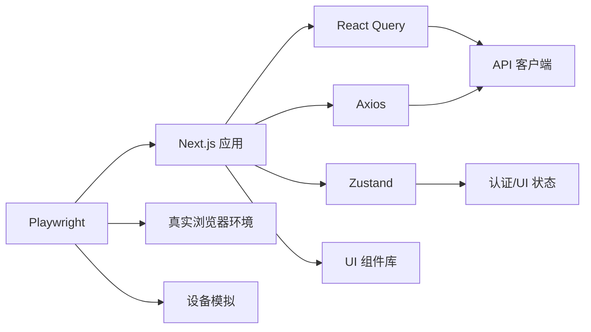

# 前端测试

<cite>
**本文引用的文件**
- [package.json](file://frontend/package.json)
- [playwright.config.ts](file://frontend/playwright.config.ts)
- [auth.spec.ts](file://frontend/e2e/auth.spec.ts)
- [auth.setup.ts](file://frontend/e2e/fixtures/auth.setup.ts)
- [tsconfig.json](file://frontend/tsconfig.json)
- [api.ts](file://frontend/src/lib/api.ts)
- [providers.tsx](file://frontend/src/app/providers.tsx)
- [useAuth.ts](file://frontend/src/hooks/useAuth.ts)
- [authStore.ts](file://frontend/src/stores/authStore.ts)
- [uiStore.ts](file://frontend/src/stores/uiStore.ts)
- [ToastContainer.tsx](file://frontend/src/components/ui/ToastContainer.tsx)
- [TradeForm.tsx](file://frontend/src/components/shared/TradeForm.tsx)
- [button.tsx](file://frontend/src/components/ui/button.tsx)
- [auth.ts 类型定义](file://frontend/src/types/auth.ts)
- [common.ts 类型定义](file://frontend/src/types/common.ts)
</cite>

## 更新摘要
**所做更改**
- 新增 Playwright 端到端测试框架配置与最佳实践
- 添加认证流程端到端测试用例
- 更新测试策略以包含 Playwright 测试方法
- 新增测试项目配置与多浏览器/设备支持
- 更新测试脚本与 CI 集成指导

## 目录
1. [引言](#引言)
2. [测试框架演进](#测试框架演进)
3. [Playwright 端到端测试](#playwright-端到端测试)
4. [项目结构](#项目结构)
5. [核心组件](#核心组件)
6. [架构总览](#架构总览)
7. [详细组件分析](#详细组件分析)
8. [依赖分析](#依赖分析)
9. [性能考虑](#性能考虑)
10. [故障排查指南](#故障排查指南)
11. [结论](#结论)
12. [附录](#附录)

## 引言
本文件为 InvestRing 项目前端的测试策略文档，现采用 Playwright 作为主要测试框架，结合组件测试、Hook 测试、状态管理测试、API 客户端测试、路由测试与表单验证测试。文档涵盖端到端测试配置、多浏览器/设备支持、认证流程测试、测试数据 Mock、测试环境配置与测试覆盖率统计，以及移动端与跨浏览器兼容性测试指导。

## 测试框架演进
项目从传统的单元测试框架转向 Playwright 端到端测试框架，提供更真实的用户交互体验和更强的测试稳定性。

**章节来源**
- [playwright.config.ts:1-72](file://frontend/playwright.config.ts#L1-L72)
- [package.json:10-11](file://frontend/package.json#L10-L11)

## Playwright 端到端测试

### 配置概览
Playwright 配置支持多种测试场景和环境：

- **测试目录**: `./e2e` - 所有端到端测试文件存放位置
- **超时设置**: 30秒测试超时，5秒 expect 断言超时
- **重试机制**: CI 环境自动重试2次，本地环境0次
- **并行执行**: 完全并行执行，CI 环境限制1个工作进程
- **报告器**: HTML 和 list 报告器组合使用

### 多项目配置
支持三种测试项目类型：

1. **Setup 项目**: 认证状态设置，登录一次后保存状态
2. **桌面端项目**: Desktop Chrome 设备配置
3. **移动端项目**: iPhone 13 设备配置

**章节来源**
- [playwright.config.ts:13-72](file://frontend/playwright.config.ts#L13-L72)

### 认证流程测试
提供完整的认证测试套件，包括成功登录、失败登录和未登录重定向：

**章节来源**
- [auth.spec.ts:1-31](file://frontend/e2e/auth.spec.ts#L1-L31)

### 测试脚本集成
通过 npm scripts 集成 Playwright 测试：

- `npm run test:e2e`: 运行所有 E2E 测试
- `npm run test:e2e:ui`: 交互式 UI 模式运行测试

**章节来源**
- [package.json:10-11](file://frontend/package.json#L10-L11)

## 项目结构
前端采用 Next.js 应用程序，核心目录与测试相关的关键点如下：
- 应用层：页面与布局位于 src/app，全局提供者位于 src/app/providers.tsx，用于注册 React Query 客户端与 Toast 容器。
- 组件层：共享组件与 UI 组件位于 src/components，包含表单、按钮等基础 UI。
- 钩子层：业务逻辑封装在 src/hooks，如认证、查询、变更等。
- 状态层：使用 Zustand 存储认证与 UI 状态，分别位于 src/stores。
- 类型层：API 请求/响应类型定义位于 src/types。
- 工具层：Axios 封装的 API 客户端位于 src/lib/api.ts。
- 测试层：Playwright 端到端测试位于 e2e 目录。

**图表来源**
- [providers.tsx:1-27](file://frontend/src/app/providers.tsx#L1-L27)
- [useAuth.ts:1-134](file://frontend/src/hooks/useAuth.ts#L1-L134)
- [authStore.ts:1-71](file://frontend/src/stores/authStore.ts#L1-L71)
- [uiStore.ts:1-85](file://frontend/src/stores/uiStore.ts#L1-L85)
- [api.ts:1-627](file://frontend/src/lib/api.ts#L1-L627)
- [auth.spec.ts:1-31](file://frontend/e2e/auth.spec.ts#L1-L31)

**章节来源**
- [providers.tsx:1-27](file://frontend/src/app/providers.tsx#L1-L27)
- [tsconfig.json:1-27](file://frontend/tsconfig.json#L1-L27)

## 核心组件
- API 客户端：基于 axios 的统一请求封装，包含请求/响应拦截器、统一错误处理与各模块 API 方法集合。
- 认证 Hook：封装登录、登出、当前用户查询、修改密码、认证守卫与角色校验。
- 状态存储：Zustand Store，分别维护认证令牌与用户信息、UI 状态（侧边栏、移动端导航、全局加载、Toast 列表）。
- 提供者：注册 React Query 客户端与全局 Toast 容器，统一缓存策略与通知展示。
- 表单组件：如 TradeForm，负责输入收集、条件字段切换与提交触发。
- Playwright 测试：端到端测试框架，支持多浏览器、多设备和认证状态管理。

**章节来源**
- [api.ts:1-627](file://frontend/src/lib/api.ts#L1-L627)
- [useAuth.ts:1-134](file://frontend/src/hooks/useAuth.ts#L1-L134)
- [authStore.ts:1-71](file://frontend/src/stores/authStore.ts#L1-L71)
- [uiStore.ts:1-85](file://frontend/src/stores/uiStore.ts#L1-L85)
- [providers.tsx:1-27](file://frontend/src/app/providers.tsx#L1-L27)
- [TradeForm.tsx:1-137](file://frontend/src/components/shared/TradeForm.tsx#L1-L137)
- [playwright.config.ts:1-72](file://frontend/playwright.config.ts#L1-L72)

## 架构总览
下图展示了前端测试关注的交互路径：组件通过 Hook 使用 API 客户端；Hook 依赖 Zustand Store；Providers 注入 React Query 与 Toast；页面路由由 Next.js 管理；Playwright 提供端到端测试环境。

**图表来源**
- [useAuth.ts:1-134](file://frontend/src/hooks/useAuth.ts#L1-L134)
- [authStore.ts:1-71](file://frontend/src/stores/authStore.ts#L1-L71)
- [uiStore.ts:1-85](file://frontend/src/stores/uiStore.ts#L1-L85)
- [api.ts:1-627](file://frontend/src/lib/api.ts#L1-L627)
- [providers.tsx:1-27](file://frontend/src/app/providers.tsx#L1-L27)
- [auth.spec.ts:1-31](file://frontend/e2e/auth.spec.ts#L1-L31)

## 详细组件分析

### 组件测试策略
- 渲染测试：验证组件在不同 props 下的渲染结果，例如按钮变体、禁用态、图标显示。
- 用户交互测试：模拟点击、输入、切换等行为，断言状态变化与副作用（如 Toast 显示、路由跳转）。
- 异步测试：对依赖 React Query 的组件，使用测试适配器（如 @testing-library/react 的 waitFor 或自定义 renderer）等待查询完成。
- 表单测试：针对 TradeForm，验证必填字段、条件字段（买卖切换）、数值格式与提交行为。

**章节来源**
- [TradeForm.tsx:1-137](file://frontend/src/components/shared/TradeForm.tsx#L1-L137)
- [button.tsx:1-56](file://frontend/src/components/ui/button.tsx#L1-L56)
- [providers.tsx:1-27](file://frontend/src/app/providers.tsx#L1-L27)

### Hook 测试策略
- useLogin：断言成功时写入 token、设置用户、触发 Toast、跳转；失败时显示错误 Toast。
- useLogout：断言清理 token、清空查询缓存、显示提示、跳转。
- useCurrentUser：断言启用条件查询、设置用户、缓存时间策略。
- useChangePassword：断言成功/失败分支的 Toast。
- useAuthGuard：断言已登录/未登录时的路由行为。
- useRoleCheck：断言角色判断与权限判定。

**章节来源**
- [useAuth.ts:1-134](file://frontend/src/hooks/useAuth.ts#L1-L134)
- [authStore.ts:1-71](file://frontend/src/stores/authStore.ts#L1-L71)
- [uiStore.ts:1-85](file://frontend/src/stores/uiStore.ts#L1-L85)

### 状态管理测试策略
- 认证状态：验证登录/登出对本地存储、Cookie、Zustand 状态的影响；断言加载状态与鉴权标志。
- UI 状态：验证侧边栏开关、折叠、移动端导航可见性、全局加载、Toast 添加/移除。
- 持久化：验证部分状态持久化（如认证状态）在刷新后的恢复。

**章节来源**
- [authStore.ts:1-71](file://frontend/src/stores/authStore.ts#L1-L71)
- [uiStore.ts:1-85](file://frontend/src/stores/uiStore.ts#L1-L85)

### API 客户端测试策略
- 请求拦截器：断言在客户端环境附加 Authorization 头。
- 响应拦截器：断言 401 清理 token 并跳转登录页。
- 统一错误处理：断言错误对象包含 code/status/message。
- 各模块 API：断言请求方法、URL、参数、分页返回结构、幂等键头等。

**章节来源**
- [api.ts:1-627](file://frontend/src/lib/api.ts#L1-L627)
- [auth.ts 类型定义:1-23](file://frontend/src/types/auth.ts#L1-L23)
- [common.ts 类型定义:1-30](file://frontend/src/types/common.ts#L1-L30)

### 路由测试策略
- 认证守卫：未登录访问受保护路由跳转登录；已登录访问登录页跳转仪表盘。
- 路由参数：验证动态路由参数解析与页面渲染。
- 导航行为：断言跳转目标与时机（登录成功后跳转、登出后跳转）。

**章节来源**
- [useAuth.ts:96-115](file://frontend/src/hooks/useAuth.ts#L96-L115)

### 表单验证测试策略
- 必填字段：断言缺失必填字段时阻止提交。
- 条件字段：买卖切换导致不同字段必填。
- 数值格式：断言非法数值输入不触发提交或显示错误提示。
- 提交流程：断言提交成功回调被调用、提交中状态更新、错误 Toast。

**章节来源**
- [TradeForm.tsx:1-137](file://frontend/src/components/shared/TradeForm.tsx#L1-L137)

### Playwright 端到端测试策略
- **认证状态管理**：使用 setup 项目登录一次，保存认证状态供所有测试复用
- **多浏览器支持**：支持 Chromium、Firefox、WebKit 等浏览器
- **多设备支持**：支持桌面端和移动端设备配置
- **交互测试**：模拟真实用户操作，包括表单填写、按钮点击、页面导航
- **断言验证**：验证页面 URL、元素存在性、文本内容、路由跳转

**章节来源**
- [auth.spec.ts:1-31](file://frontend/e2e/auth.spec.ts#L1-L31)
- [auth.setup.ts:1-26](file://frontend/e2e/fixtures/auth.setup.ts#L1-L26)
- [playwright.config.ts:46-70](file://frontend/playwright.config.ts#L46-L70)

## 依赖分析
- 测试框架与运行时：Next.js 14、React 18、TypeScript、Playwright。
- 状态管理：Zustand（轻量、易测试）。
- 数据获取：@tanstack/react-query（便于缓存与并发控制）。
- HTTP 客户端：axios（统一拦截器与错误处理）。
- UI 组件：Radix UI + Tailwind 生态，组件稳定、易于断言。
- 端到端测试：Playwright 提供真实浏览器环境和设备模拟。

**图表来源**
- [package.json:1-51](file://frontend/package.json#L1-L51)
- [providers.tsx:1-27](file://frontend/src/app/providers.tsx#L1-L27)
- [api.ts:1-627](file://frontend/src/lib/api.ts#L1-L627)
- [playwright.config.ts:1-72](file://frontend/playwright.config.ts#L1-L72)

**章节来源**
- [package.json:1-51](file://frontend/package.json#L1-L51)

## 性能考虑
- 查询缓存：合理设置 staleTime、retry 次数，避免频繁重复请求。
- 乐观更新：在支持的场景（如提交表单）先更新 UI 再回滚，提升感知性能。
- 组件拆分：将昂贵计算与渲染拆分为独立组件，配合 React.memo 与 useMemo/useCallback。
- 资源加载：图片与字体懒加载，减少首屏阻塞。
- Playwright 性能：使用并行执行、重用现有服务器、适当的超时设置。

## 故障排查指南
- 登录失败：检查请求拦截器是否注入 token、响应拦截器是否正确处理 401。
- Toast 不显示：确认 Providers 中已挂载 ToastContainer，且 useUIStore 的 addToast 调用链正常。
- 查询未更新：检查 queryKey 是否一致、enabled 条件是否满足、staleTime 是否过短。
- 表单提交无效：核对必填字段与条件字段逻辑、数值解析与提交回调。
- Playwright 测试失败：检查浏览器启动、页面加载、元素选择器、认证状态文件。
- CI 环境问题：验证环境变量、端口占用、网络连接、测试超时设置。

**章节来源**
- [api.ts:50-79](file://frontend/src/lib/api.ts#L50-L79)
- [providers.tsx:1-27](file://frontend/src/app/providers.tsx#L1-L27)
- [ToastContainer.tsx:1-52](file://frontend/src/components/ui/ToastContainer.tsx#L1-L52)
- [TradeForm.tsx:1-137](file://frontend/src/components/shared/TradeForm.tsx#L1-L137)
- [auth.spec.ts:1-31](file://frontend/e2e/auth.spec.ts#L1-L31)
- [playwright.config.ts:38-44](file://frontend/playwright.config.ts#L38-L44)

## 结论
通过引入 Playwright 端到端测试框架，InvestRing 项目获得了更真实、更稳定的测试能力。结合原有的组件测试、Hook 测试和状态管理测试，形成了完整的测试金字塔。建议优先覆盖关键业务流程（认证、数据列表、核心表单），并逐步扩展到移动端和跨浏览器场景。Playwright 的多项目配置和认证状态管理为复杂的端到端测试提供了强大的基础设施支持。

## 附录

### 测试数据 Mock 与环境配置建议
- Mock API：使用 jest.mock 或拦截 fetch/xhr，按模块导出函数进行替换，确保请求 URL、参数与响应结构一致。
- Mock Store：对 Zustand Store 使用内存快照或直接注入测试用状态，避免真实持久化副作用。
- Mock Router：使用 Next.js 测试工具或自定义 MemoryRouter，控制路由行为与参数。
- Mock Toast：在测试中注入空实现或计数器，验证 Toast 的添加/移除次数与内容。
- Mock Playwright：使用 fixtures 和 setup 项目管理认证状态，避免重复登录。

### 测试覆盖率统计
- 建议目标：组件覆盖率 > 80%，分支覆盖率 > 70%，行覆盖率 > 80%。
- 工具：Jest 配合 @testing-library/react，使用 --coverage 生成报告。
- 关注点：Hook 的成功/失败分支、API 错误路径、路由守卫逻辑、表单边界条件、Playwright 测试覆盖率。
- Playwright 覆盖率：可通过 Playwright 的代码覆盖率工具或第三方工具集成实现。

### 移动端测试与跨浏览器兼容性
- 移动端：使用 Playwright 的设备模拟功能，重点验证触摸交互、底部导航、侧边栏折叠与表单输入。
- 跨浏览器：在 Chrome、Firefox、Safari、Edge 上验证关键功能（登录、列表加载、表单提交），关注 polyfill 与 CSS 兼容性。
- 自动化：结合 GitHub Actions 或 CI 平台的多浏览器矩阵，执行关键测试套件。
- 设备测试：利用 Playwright 的真实设备配置，测试不同屏幕尺寸和分辨率下的用户体验。

### Playwright 高级配置
- **报告生成**：HTML 报告提供详细的测试结果可视化，适合 CI/CD 集成。
- **调试模式**：使用 `--debug` 模式进行交互式调试，查看测试执行过程。
- **并行执行**：充分利用多核 CPU，提高测试执行效率。
- **重试机制**：在不稳定环境中自动重试，提高测试成功率。
- **跟踪和视频录制**：失败时自动录制屏幕和网络请求，便于问题诊断。

**章节来源**
- [playwright.config.ts:25-36](file://frontend/playwright.config.ts#L25-L36)
- [playwright.config.ts:18-23](file://frontend/playwright.config.ts#L18-L23)
- [playwright.config.ts:31-36](file://frontend/playwright.config.ts#L31-L36)