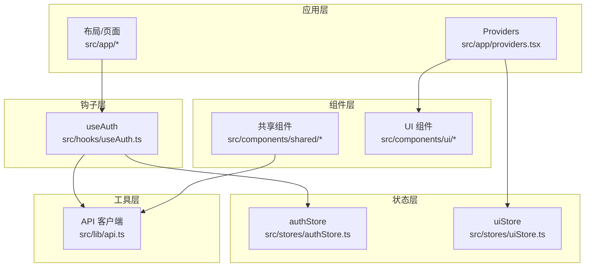
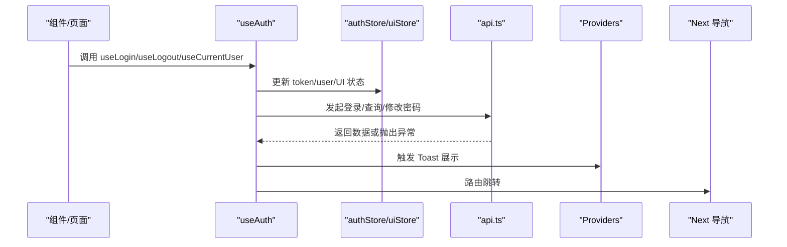
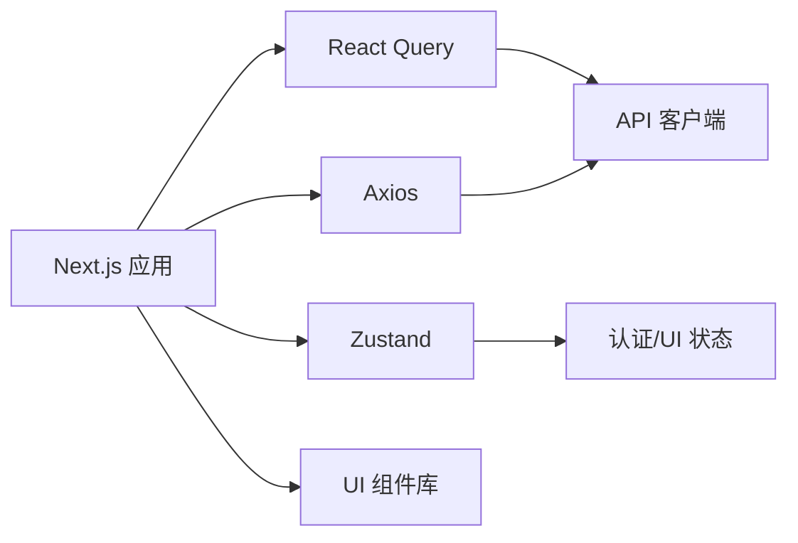

# 前端测试

<cite>
**本文引用的文件**
- [package.json](file://frontend/package.json)
- [tsconfig.json](file://frontend/tsconfig.json)
- [api.ts](file://frontend/src/lib/api.ts)
- [providers.tsx](file://frontend/src/app/providers.tsx)
- [useAuth.ts](file://frontend/src/hooks/useAuth.ts)
- [authStore.ts](file://frontend/src/stores/authStore.ts)
- [uiStore.ts](file://frontend/src/stores/uiStore.ts)
- [ToastContainer.tsx](file://frontend/src/components/ui/ToastContainer.tsx)
- [TradeForm.tsx](file://frontend/src/components/shared/TradeForm.tsx)
- [button.tsx](file://frontend/src/components/ui/button.tsx)
- [auth.ts 类型定义](file://frontend/src/types/auth.ts)
- [common.ts 类型定义](file://frontend/src/types/common.ts)
</cite>

## 目录
1. [引言](#引言)
2. [项目结构](#项目结构)
3. [核心组件](#核心组件)
4. [架构总览](#架构总览)
5. [详细组件分析](#详细组件分析)
6. [依赖分析](#依赖分析)
7. [性能考虑](#性能考虑)
8. [故障排查指南](#故障排查指南)
9. [结论](#结论)
10. [附录](#附录)

## 引言
本文件为 InvestRing 项目前端的测试策略文档，聚焦于 React 组件测试、Hook 测试、状态管理测试、API 客户端测试、路由测试与表单验证测试，并给出测试数据 Mock、测试环境配置与测试覆盖率统计建议，以及移动端与跨浏览器兼容性测试指导。目标是帮助开发者以最小成本获得高价值的测试覆盖，确保认证流程、数据请求、UI 行为与状态一致性稳定可靠。

## 项目结构
前端采用 Next.js 应用程序，核心目录与测试相关的关键点如下：
- 应用层：页面与布局位于 src/app，全局提供者位于 src/app/providers.tsx，用于注册 React Query 客户端与 Toast 容器。
- 组件层：共享组件与 UI 组件位于 src/components，包含表单、按钮等基础 UI。
- 钩子层：业务逻辑封装在 src/hooks，如认证、查询、变更等。
- 状态层：使用 Zustand 存储认证与 UI 状态，分别位于 src/stores。
- 类型层：API 请求/响应类型定义位于 src/types。
- 工具层：Axios 封装的 API 客户端位于 src/lib/api.ts。

图表来源
- [providers.tsx:1-27](file://frontend/src/app/providers.tsx#L1-L27)
- [useAuth.ts:1-134](file://frontend/src/hooks/useAuth.ts#L1-L134)
- [authStore.ts:1-71](file://frontend/src/stores/authStore.ts#L1-L71)
- [uiStore.ts:1-85](file://frontend/src/stores/uiStore.ts#L1-L85)
- [api.ts:1-627](file://frontend/src/lib/api.ts#L1-L627)

章节来源
- [providers.tsx:1-27](file://frontend/src/app/providers.tsx#L1-L27)
- [tsconfig.json:1-27](file://frontend/tsconfig.json#L1-L27)

## 核心组件
- API 客户端：基于 axios 的统一请求封装，包含请求/响应拦截器、统一错误处理与各模块 API 方法集合。
- 认证 Hook：封装登录、登出、当前用户查询、修改密码、认证守卫与角色校验。
- 状态存储：Zustand Store，分别维护认证令牌与用户信息、UI 状态（侧边栏、移动端导航、全局加载、Toast 列表）。
- 提供者：注册 React Query 客户端与全局 Toast 容器，统一缓存策略与通知展示。
- 表单组件：如 TradeForm，负责输入收集、条件字段切换与提交触发。

章节来源
- [api.ts:1-627](file://frontend/src/lib/api.ts#L1-L627)
- [useAuth.ts:1-134](file://frontend/src/hooks/useAuth.ts#L1-L134)
- [authStore.ts:1-71](file://frontend/src/stores/authStore.ts#L1-L71)
- [uiStore.ts:1-85](file://frontend/src/stores/uiStore.ts#L1-L85)
- [providers.tsx:1-27](file://frontend/src/app/providers.tsx#L1-L27)
- [TradeForm.tsx:1-137](file://frontend/src/components/shared/TradeForm.tsx#L1-L137)

## 架构总览
下图展示了前端测试关注的交互路径：组件通过 Hook 使用 API 客户端；Hook 依赖 Zustand Store；Providers 注入 React Query 与 Toast；页面路由由 Next.js 管理。

图表来源
- [useAuth.ts:1-134](file://frontend/src/hooks/useAuth.ts#L1-L134)
- [authStore.ts:1-71](file://frontend/src/stores/authStore.ts#L1-L71)
- [uiStore.ts:1-85](file://frontend/src/stores/uiStore.ts#L1-L85)
- [api.ts:1-627](file://frontend/src/lib/api.ts#L1-L627)
- [providers.tsx:1-27](file://frontend/src/app/providers.tsx#L1-L27)

## 详细组件分析

### 组件测试策略
- 渲染测试：验证组件在不同 props 下的渲染结果，例如按钮变体、禁用态、图标显示。
- 用户交互测试：模拟点击、输入、切换等行为，断言状态变化与副作用（如 Toast 显示、路由跳转）。
- 异步测试：对依赖 React Query 的组件，使用测试适配器（如 @testing-library/react 的 waitFor 或自定义 renderer）等待查询完成。
- 表单测试：针对 TradeForm，验证必填字段、条件字段（买卖切换）、数值格式与提交行为。

章节来源
- [TradeForm.tsx:1-137](file://frontend/src/components/shared/TradeForm.tsx#L1-L137)
- [button.tsx:1-56](file://frontend/src/components/ui/button.tsx#L1-L56)
- [providers.tsx:1-27](file://frontend/src/app/providers.tsx#L1-L27)

### Hook 测试策略
- useLogin：断言成功时写入 token、设置用户、触发 Toast、跳转；失败时显示错误 Toast。
- useLogout：断言清理 token、清空查询缓存、显示提示、跳转。
- useCurrentUser：断言启用条件查询、设置用户、缓存时间策略。
- useChangePassword：断言成功/失败分支的 Toast。
- useAuthGuard：断言已登录/未登录时的路由行为。
- useRoleCheck：断言角色判断与权限判定。

章节来源
- [useAuth.ts:1-134](file://frontend/src/hooks/useAuth.ts#L1-L134)
- [authStore.ts:1-71](file://frontend/src/stores/authStore.ts#L1-L71)
- [uiStore.ts:1-85](file://frontend/src/stores/uiStore.ts#L1-L85)

### 状态管理测试策略
- 认证状态：验证登录/登出对本地存储、Cookie、Zustand 状态的影响；断言加载状态与鉴权标志。
- UI 状态：验证侧边栏开关、折叠、移动端导航可见性、全局加载、Toast 添加/移除。
- 持久化：验证部分状态持久化（如认证状态）在刷新后的恢复。

章节来源
- [authStore.ts:1-71](file://frontend/src/stores/authStore.ts#L1-L71)
- [uiStore.ts:1-85](file://frontend/src/stores/uiStore.ts#L1-L85)

### API 客户端测试策略
- 请求拦截器：断言在客户端环境附加 Authorization 头。
- 响应拦截器：断言 401 清理 token 并跳转登录页。
- 统一错误处理：断言错误对象包含 code/status/message。
- 各模块 API：断言请求方法、URL、参数、分页返回结构、幂等键头等。

章节来源
- [api.ts:1-627](file://frontend/src/lib/api.ts#L1-L627)
- [auth.ts 类型定义:1-23](file://frontend/src/types/auth.ts#L1-L23)
- [common.ts 类型定义:1-30](file://frontend/src/types/common.ts#L1-L30)

### 路由测试策略
- 认证守卫：未登录访问受保护路由跳转登录；已登录访问登录页跳转仪表盘。
- 路由参数：验证动态路由参数解析与页面渲染。
- 导航行为：断言跳转目标与时机（登录成功后跳转、登出后跳转）。

章节来源
- [useAuth.ts:96-115](file://frontend/src/hooks/useAuth.ts#L96-L115)

### 表单验证测试策略
- 必填字段：断言缺失必填字段时阻止提交。
- 条件字段：买卖切换导致不同字段必填。
- 数值格式：断言非法数值输入不触发提交或显示错误提示。
- 提交流程：断言提交成功回调被调用、提交中状态更新、错误 Toast。

章节来源
- [TradeForm.tsx:1-137](file://frontend/src/components/shared/TradeForm.tsx#L1-L137)

## 依赖分析
- 测试框架与运行时：Next.js 14、React 18、TypeScript。
- 状态管理：Zustand（轻量、易测试）。
- 数据获取：@tanstack/react-query（便于缓存与并发控制）。
- HTTP 客户端：axios（统一拦截器与错误处理）。
- UI 组件：Radix UI + Tailwind 生态，组件稳定、易于断言。

图表来源
- [package.json:1-44](file://frontend/package.json#L1-L44)
- [providers.tsx:1-27](file://frontend/src/app/providers.tsx#L1-L27)
- [api.ts:1-627](file://frontend/src/lib/api.ts#L1-L627)

章节来源
- [package.json:1-44](file://frontend/package.json#L1-L44)

## 性能考虑
- 查询缓存：合理设置 staleTime、retry 次数，避免频繁重复请求。
- 乐观更新：在支持的场景（如提交表单）先更新 UI 再回滚，提升感知性能。
- 组件拆分：将昂贵计算与渲染拆分为独立组件，配合 React.memo 与 useMemo/useCallback。
- 资源加载：图片与字体懒加载，减少首屏阻塞。

## 故障排查指南
- 登录失败：检查请求拦截器是否注入 token、响应拦截器是否正确处理 401。
- Toast 不显示：确认 Providers 中已挂载 ToastContainer，且 useUIStore 的 addToast 调用链正常。
- 查询未更新：检查 queryKey 是否一致、enabled 条件是否满足、staleTime 是否过短。
- 表单提交无效：核对必填字段与条件字段逻辑、数值解析与提交回调。

章节来源
- [api.ts:50-79](file://frontend/src/lib/api.ts#L50-L79)
- [providers.tsx:1-27](file://frontend/src/app/providers.tsx#L1-L27)
- [ToastContainer.tsx:1-52](file://frontend/src/components/ui/ToastContainer.tsx#L1-L52)
- [TradeForm.tsx:1-137](file://frontend/src/components/shared/TradeForm.tsx#L1-L137)

## 结论
通过围绕 API 客户端、Hook、Zustand Store 与 UI 组件建立系统化的测试策略，结合 React Query 的缓存与错误处理机制，可以高效保障 InvestRing 前端在认证、数据流与交互体验上的稳定性。建议优先覆盖关键路径（登录/登出、列表/详情查询、表单提交），并逐步扩展到移动端与跨浏览器场景。

## 附录

### 测试数据 Mock 与环境配置建议
- Mock API：使用 jest.mock 或拦截 fetch/xhr，按模块导出函数进行替换，确保请求 URL、参数与响应结构一致。
- Mock Store：对 Zustand Store 使用内存快照或直接注入测试用状态，避免真实持久化副作用。
- Mock Router：使用 Next.js 测试工具或自定义 MemoryRouter，控制路由行为与参数。
- Mock Toast：在测试中注入空实现或计数器，验证 Toast 的添加/移除次数与内容。

### 测试覆盖率统计
- 建议目标：组件覆盖率 > 80%，分支覆盖率 > 70%，行覆盖率 > 80%。
- 工具：Jest 配合 @testing-library/react，使用 --coverage 生成报告。
- 关注点：Hook 的成功/失败分支、API 错误路径、路由守卫逻辑、表单边界条件。

### 移动端测试与跨浏览器兼容性
- 移动端：使用浏览器 DevTools 的设备模拟模式，重点验证触摸交互、底部导航、侧边栏折叠与表单输入。
- 跨浏览器：在 Chrome、Firefox、Safari 上验证关键功能（登录、列表加载、表单提交），关注 polyfill 与 CSS 兼容性。
- 自动化：结合 GitHub Actions 或 CI 平台的多浏览器矩阵，执行关键测试套件。