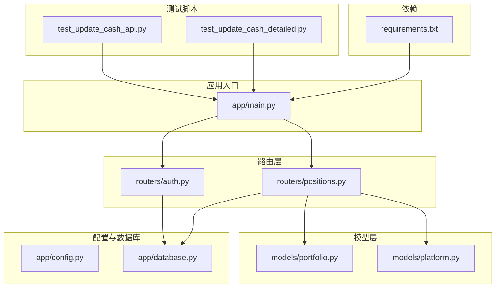
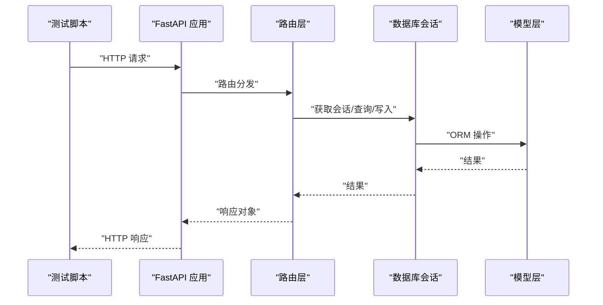
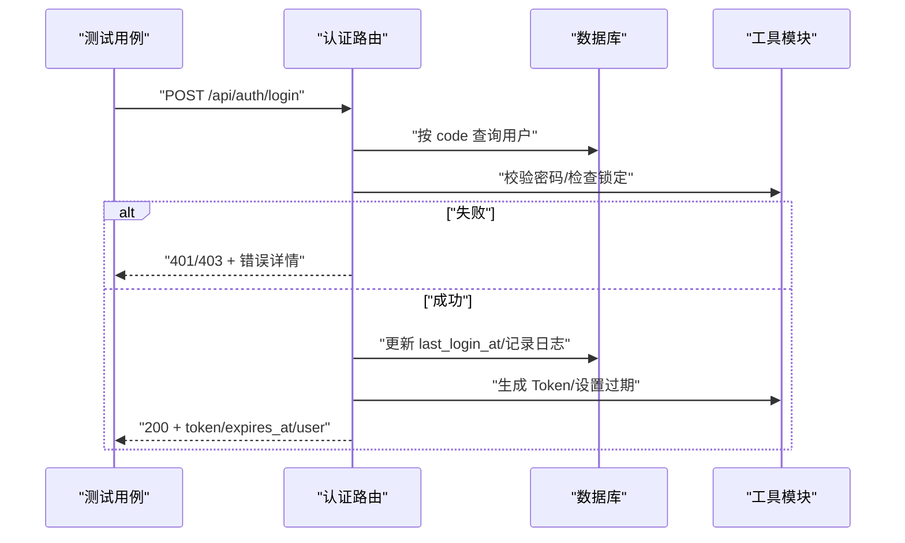
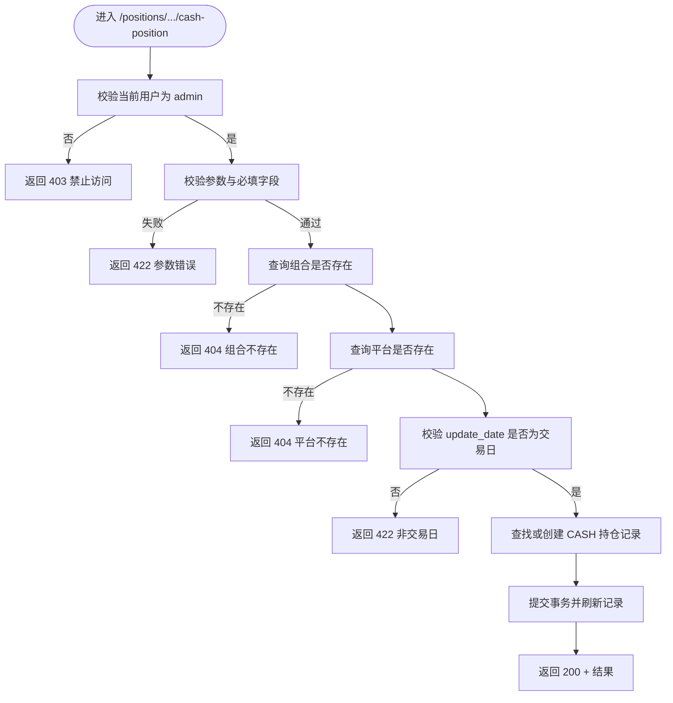
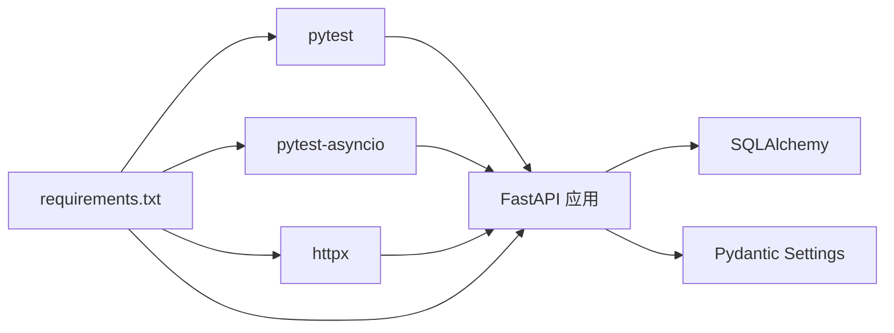

# 单元测试

<cite>
**本文引用的文件**
- [backend/app/main.py](file://backend/app/main.py)
- [backend/app/config.py](file://backend/app/config.py)
- [backend/app/database.py](file://backend/app/database.py)
- [backend/app/routers/auth.py](file://backend/app/routers/auth.py)
- [backend/app/routers/positions.py](file://backend/app/routers/positions.py)
- [backend/app/models/portfolio.py](file://backend/app/models/portfolio.py)
- [backend/app/models/platform.py](file://backend/app/models/platform.py)
- [backend/test_update_cash_api.py](file://backend/test_update_cash_api.py)
- [backend/test_update_cash_detailed.py](file://backend/test_update_cash_detailed.py)
- [backend/requirements.txt](file://backend/requirements.txt)
</cite>

## 目录
1. [引言](#引言)
2. [项目结构](#项目结构)
3. [核心组件](#核心组件)
4. [架构总览](#架构总览)
5. [详细组件分析](#详细组件分析)
6. [依赖分析](#依赖分析)
7. [性能考虑](#性能考虑)
8. [故障排查指南](#故障排查指南)
9. [结论](#结论)
10. [附录](#附录)

## 引言
本指南面向 InvestRing 项目的后端单元测试与集成测试实施，聚焦使用 pytest 框架进行 API 单元测试的方法论，涵盖测试用例编写、Mock 对象使用、断言方法、数据库模型测试、路由层测试与业务逻辑测试的最佳实践。同时提供登录验证测试、现金更新 API 测试等具体示例的落地步骤，以及测试数据准备、测试夹具（fixtures）使用与测试隔离策略，并给出测试覆盖率与代码质量标准建议。

## 项目结构
InvestRing 后端采用 FastAPI + SQLAlchemy 架构，核心目录与文件如下：
- 应用入口与路由注册：backend/app/main.py
- 配置与数据库连接：backend/app/config.py、backend/app/database.py
- 认证与权限路由：backend/app/routers/auth.py
- 现金与持仓相关路由：backend/app/routers/positions.py
- 数据模型：backend/app/models/portfolio.py、backend/app/models/platform.py
- 现有测试脚本：backend/test_update_cash_api.py、backend/test_update_cash_detailed.py
- 依赖与测试框架：backend/requirements.txt（包含 pytest）

图表来源
- [backend/app/main.py:1-53](file://backend/app/main.py#L1-L53)
- [backend/app/routers/auth.py:1-186](file://backend/app/routers/auth.py#L1-L186)
- [backend/app/routers/positions.py:1-410](file://backend/app/routers/positions.py#L1-L410)
- [backend/app/models/portfolio.py:1-16](file://backend/app/models/portfolio.py#L1-L16)
- [backend/app/models/platform.py:1-12](file://backend/app/models/platform.py#L1-L12)
- [backend/test_update_cash_api.py:1-119](file://backend/test_update_cash_api.py#L1-L119)
- [backend/test_update_cash_detailed.py:1-227](file://backend/test_update_cash_detailed.py#L1-L227)
- [backend/requirements.txt:1-19](file://backend/requirements.txt#L1-L19)

章节来源
- [backend/app/main.py:1-53](file://backend/app/main.py#L1-L53)
- [backend/requirements.txt:1-19](file://backend/requirements.txt#L1-L19)

## 核心组件
- 应用入口与路由注册：负责初始化数据库表、定时任务，挂载各模块路由（认证、投资人、组合、产品、平台、交易日历、市场数据、订阅、交易、份额变动事件、持仓、系统日志、任务、通知、快照等），并启用 CORS。
- 配置与数据库：集中管理数据库连接串、安全密钥、Token 过期天数、Tushare Token、应用名称与调试开关；提供数据库引擎、会话工厂与 Base。
- 认证路由：提供登录、登出、改密接口，含账户锁定、失败次数统计、Token 黑名单、登录日志记录等安全机制。
- 现金与持仓路由：提供可用现金与可用份额计算、现金非净值资产更新等业务逻辑，含交易日校验、平台与组合存在性校验、CASH 持仓记录的创建/更新等。
- 数据模型：Portfolio、Platform 等核心模型定义，支撑路由层业务逻辑。

章节来源
- [backend/app/main.py:1-53](file://backend/app/main.py#L1-L53)
- [backend/app/config.py:1-37](file://backend/app/config.py#L1-L37)
- [backend/app/database.py:1-39](file://backend/app/database.py#L1-L39)
- [backend/app/routers/auth.py:1-186](file://backend/app/routers/auth.py#L1-L186)
- [backend/app/routers/positions.py:1-410](file://backend/app/routers/positions.py#L1-L410)
- [backend/app/models/portfolio.py:1-16](file://backend/app/models/portfolio.py#L1-L16)
- [backend/app/models/platform.py:1-12](file://backend/app/models/platform.py#L1-L12)

## 架构总览
下图展示测试驱动的调用链路：测试脚本通过 HTTP 客户端访问 FastAPI 路由，路由层经依赖注入获取数据库会话，调用模型层进行数据读写，最终返回响应。

图表来源
- [backend/app/main.py:1-53](file://backend/app/main.py#L1-L53)
- [backend/app/routers/auth.py:1-186](file://backend/app/routers/auth.py#L1-L186)
- [backend/app/routers/positions.py:1-410](file://backend/app/routers/positions.py#L1-L410)
- [backend/app/database.py:1-39](file://backend/app/database.py#L1-L39)

## 详细组件分析

### 认证路由测试（登录验证）
目标：验证登录流程、账户锁定、密码错误处理、Token 生成与过期时间、登出与日志记录。

- 测试要点
  - 有效凭据登录：构造登录请求，断言返回 Token 与用户信息，校验过期时间字段。
  - 无效凭据登录：断言 401 未授权与错误详情，确保失败次数统计与锁定逻辑生效。
  - 账户锁定：在多次失败后触发锁定，断言 403 禁止访问与锁定截止时间。
  - 登出：断言 Token 黑名单生效与登出日志记录。
  - 改密：区分 admin 与 viewer 权限，校验旧密码验证与强制重新登录逻辑。

- 断言方法
  - 使用 HTTP 状态码断言（200/401/403）。
  - 使用 JSON 响应断言（token、expires_at、user、error、message）。
  - 使用数据库断言（Investor.last_login_at 更新、登录日志记录）。

- Mock 对象使用
  - 使用 unittest.mock.patch 替换密码校验、Token 创建、登录失败记录、IP/UA 获取、登录日志记录等外部依赖，隔离网络与第三方服务。

- 测试夹具（fixtures）
  - 数据库会话：使用 get_db 依赖注入，确保每个测试独立事务回滚。
  - 测试用户：在 setUp 中插入测试 Investor，清理在 tearDown。
  - Token：在登录成功后缓存 token，避免重复登录。

- 示例参考
  - 登录接口定义与依赖：[backend/app/routers/auth.py:29-95](file://backend/app/routers/auth.py#L29-L95)
  - 登出接口定义与依赖：[backend/app/routers/auth.py:98-119](file://backend/app/routers/auth.py#L98-L119)
  - 改密接口定义与依赖：[backend/app/routers/auth.py:122-185](file://backend/app/routers/auth.py#L122-L185)

图表来源
- [backend/app/routers/auth.py:29-95](file://backend/app/routers/auth.py#L29-L95)

章节来源
- [backend/app/routers/auth.py:1-186](file://backend/app/routers/auth.py#L1-L186)

### 现金更新 API 测试（positions.cash-position）
目标：验证非净值资产（现金）更新接口的权限、参数校验、交易日校验、平台与组合存在性校验、CASH 持仓记录创建/更新。

- 测试要点
  - 权限校验：非 admin 调用应被拒绝（403）。
  - 参数校验：缺少必要字段或格式错误（422）。
  - 交易日校验：非交易日返回 422。
  - 组合/平台存在性：不存在时返回 404。
  - 成功场景：创建或更新 CASH 持仓记录，断言 amount 与 snapshot_date。

- 断言方法
  - 使用 HTTP 状态码断言（200/403/404/422）。
  - 使用 JSON 响应断言（success/message/portfolio_code/platform_code/amount/update_date）。
  - 使用数据库断言（PortfolioPosition 记录存在、amount/shares/snapshot_date 正确）。

- Mock 对象使用
  - 使用 unittest.mock.patch 替换 TradingCalendar 查询、平台与组合查询，模拟交易日与实体存在性。
  - 使用 unittest.mock.patch 替换 get_current_admin 依赖，模拟不同角色用户。

- 测试夹具（fixtures）
  - 数据库会话：get_db 注入，确保事务隔离。
  - 测试数据：在 setUp 中插入测试 Portfolio、Platform、TradingCalendar 记录，清理在 tearDown。
  - Token：使用 admin 登录获取 Bearer Token。

- 示例参考
  - 现金更新接口定义与校验逻辑：[backend/app/routers/positions.py:319-409](file://backend/app/routers/positions.py#L319-L409)
  - 组合模型定义：[backend/app/models/portfolio.py:1-16](file://backend/app/models/portfolio.py#L1-L16)
  - 平台模型定义：[backend/app/models/platform.py:1-12](file://backend/app/models/platform.py#L1-L12)

图表来源
- [backend/app/routers/positions.py:319-409](file://backend/app/routers/positions.py#L319-L409)

章节来源
- [backend/app/routers/positions.py:1-410](file://backend/app/routers/positions.py#L1-L410)
- [backend/app/models/portfolio.py:1-16](file://backend/app/models/portfolio.py#L1-L16)
- [backend/app/models/platform.py:1-12](file://backend/app/models/platform.py#L1-L12)

### 数据库模型测试最佳实践
- 目标：验证模型定义、约束、索引与 ORM 行为。
- 方法
  - 使用独立测试数据库（MySQL 测试实例）进行隔离测试。
  - 在 setUp 中创建 Base.metadata.create_all，tearDown 中删除表或回滚。
  - 使用 SessionLocal 会话，确保每个测试独立事务。
- 示例参考
  - 数据库引擎与会话工厂：[backend/app/database.py:1-39](file://backend/app/database.py#L1-L39)
  - 应用入口创建表：[backend/app/main.py:7-8](file://backend/app/main.py#L7-L8)

章节来源
- [backend/app/database.py:1-39](file://backend/app/database.py#L1-L39)
- [backend/app/main.py:1-53](file://backend/app/main.py#L1-L53)

### 路由层测试最佳实践
- 目标：验证路由分发、依赖注入、权限控制与错误处理。
- 方法
  - 使用 FastAPI TestClient 或 HTTPX 客户端发起请求，断言状态码与响应结构。
  - 使用 pytest fixtures 提供 TestClient、数据库会话、测试用户与 Token。
  - 使用 unittest.mock.patch 替换外部依赖（如 IP/UA 获取、登录日志记录、Token 黑名单）。
- 示例参考
  - 应用入口与路由注册：[backend/app/main.py:1-53](file://backend/app/main.py#L1-L53)

章节来源
- [backend/app/main.py:1-53](file://backend/app/main.py#L1-L53)

### 业务逻辑测试最佳实践
- 目标：验证复杂业务规则（可用现金/份额计算、交易日校验、CASH 持仓更新）。
- 方法
  - 使用最小化测试数据集，覆盖边界条件（空快照、pending/confirmed 状态、交易日边界）。
  - 使用 Mock 替换外部查询，确保测试稳定与可重复。
  - 使用断言比较 Decimal 精度与日期一致性。
- 示例参考
  - 可用现金计算：[backend/app/routers/positions.py:28-124](file://backend/app/routers/positions.py#L28-L124)
  - 可用份额计算：[backend/app/routers/positions.py:127-177](file://backend/app/routers/positions.py#L127-L177)

章节来源
- [backend/app/routers/positions.py:1-410](file://backend/app/routers/positions.py#L1-L410)

## 依赖分析
- 测试框架与工具
  - pytest 与 pytest-asyncio：支持同步与异步测试。
  - httpx：HTTP 客户端，支持异步与同步模式。
  - fastapi、sqlalchemy、pydantic、pydantic-settings：应用核心依赖。
- 现有测试脚本
  - test_update_cash_api.py：基于 requests 的简单 API 测试，便于快速定位网络错误。
  - test_update_cash_detailed.py：结合数据库前置检查与详细错误追踪的综合测试。

图表来源
- [backend/requirements.txt:1-19](file://backend/requirements.txt#L1-L19)
- [backend/app/main.py:1-53](file://backend/app/main.py#L1-L53)

章节来源
- [backend/requirements.txt:1-19](file://backend/requirements.txt#L1-L19)

## 性能考虑
- 测试并发与隔离
  - 使用独立数据库实例或容器化测试数据库，避免并发写入冲突。
  - 使用事务回滚（每个测试包裹在事务中并在 tearDown 回滚）。
- Mock 策略
  - 对外部服务（如 Tushare、CORS、IP/UA 获取）进行 Mock，减少网络抖动对测试的影响。
- 超时与重试
  - 为 HTTP 请求设置合理超时，避免单点阻塞影响整体测试进度。
- 覆盖率与质量
  - 使用 pytest-cov 生成覆盖率报告，目标行覆盖率≥80%，分支覆盖率≥70%。
  - 代码风格遵循 ruff/black/isort，类型注解完整，异常处理完备。

## 故障排查指南
- 登录失败
  - 检查账户是否被锁定（连续失败次数过多）。
  - 校验密码哈希与盐值配置。
  - 确认登录日志记录是否正确。
- 现金更新失败
  - 确认组合与平台是否存在。
  - 确认 update_date 是否为交易日。
  - 检查 CASH 持仓记录是否已存在，amount 与 shares 字段是否符合约束。
- 网络错误
  - 使用 test_update_cash_api.py 与 test_update_cash_detailed.py 排查连接错误、超时与 CORS 问题。
  - 检查后端 CORS 配置与代理设置。

章节来源
- [backend/test_update_cash_api.py:1-119](file://backend/test_update_cash_api.py#L1-L119)
- [backend/test_update_cash_detailed.py:1-227](file://backend/test_update_cash_detailed.py#L1-L227)

## 结论
通过 pytest 框架与合理的 Mock、fixtures 与断言策略，InvestRing 后端可以构建高可靠、可维护的单元测试体系。建议优先覆盖认证与核心业务路由（如现金更新），逐步扩展到模型层与服务层，持续提升覆盖率与质量标准，保障系统稳定性与可演进性。

## 附录
- 测试数据准备
  - 在 setUp 中插入最小化测试数据（Portfolio、Platform、TradingCalendar），在 tearDown 清理。
- 测试夹具（fixtures）示例
  - TestClient：提供 HTTP 客户端。
  - get_db：提供数据库会话。
  - admin 登录：提供 Bearer Token。
- 测试隔离策略
  - 每个测试独立数据库会话，事务回滚。
  - 使用 unittest.mock.patch 替换外部依赖，避免跨测试耦合。
- 覆盖率与质量标准
  - 行覆盖率≥80%，分支覆盖率≥70%。
  - 代码风格：ruff/black/isort，类型注解完整，异常处理完备。