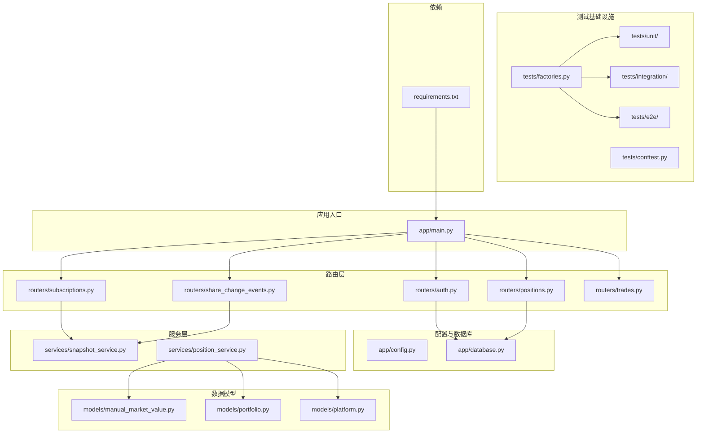
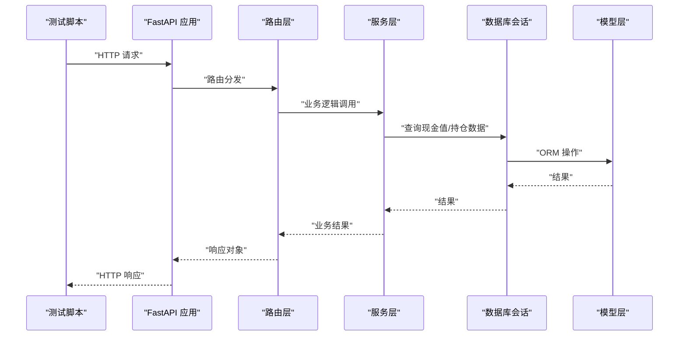
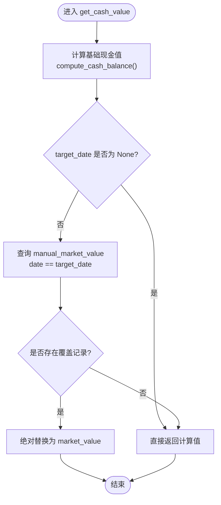
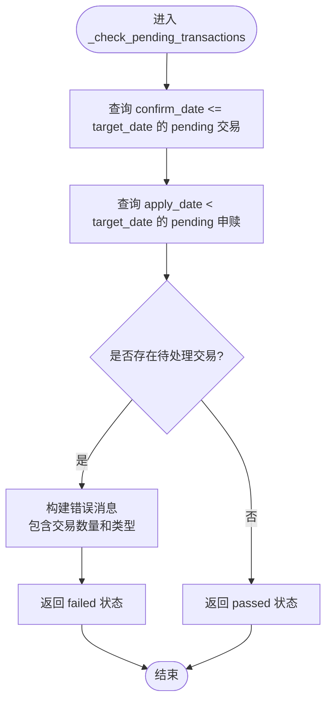
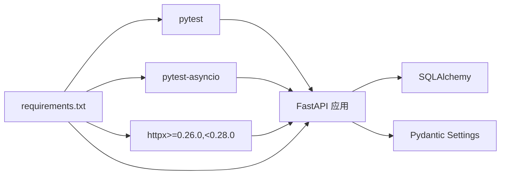

# 单元测试

<cite>
**本文引用的文件**
- [backend/app/main.py](file://backend/app/main.py)
- [backend/app/config.py](file://backend/app/config.py)
- [backend/app/database.py](file://backend/app/database.py)
- [backend/app/routers/auth.py](file://backend/app/routers/auth.py)
- [backend/app/routers/positions.py](file://backend/app/routers/positions.py)
- [backend/app/models/portfolio.py](file://backend/app/models/portfolio.py)
- [backend/app/models/platform.py](file://backend/app/models/platform.py)
- [backend/app/services/position_service.py](file://backend/app/services/position_service.py)
- [backend/app/models/manual_market_value.py](file://backend/app/models/manual_market_value.py)
- [backend/tests/factories.py](file://backend/tests/factories.py)
- [backend/tests/conftest.py](file://backend/tests/conftest.py)
- [backend/tests/unit/test_snapshot_service.py](file://backend/tests/unit/test_snapshot_service.py)
- [backend/tests/unit/test_trading_calendar.py](file://backend/tests/unit/test_trading_calendar.py)
- [backend/tests/unit/test_position_service.py](file://backend/tests/unit/test_position_service.py)
- [backend/tests/integration/test_subscriptions.py](file://backend/tests/integration/test_subscriptions.py)
- [backend/tests/integration/test_share_events.py](file://backend/tests/integration/test_share_events.py)
- [backend/tests/integration/test_trades.py](file://backend/tests/integration/test_trades.py)
- [backend/tests/integration/test_positions.py](file://backend/tests/integration/test_positions.py)
- [backend/tests/e2e/test_business_flows.py](file://backend/tests/e2e/test_business_flows.py)
- [backend/app/services/snapshot_service.py](file://backend/app/services/snapshot_service.py)
- [backend/app/schemas/subscription.py](file://backend/app/schemas/subscription.py)
- [backend/app/routers/share_change_events.py](file://backend/app/routers/share_change_events.py)
- [backend/requirements.txt](file://backend/requirements.txt)
</cite>

## 更新摘要
**变更内容**
- 新增了get_cash_value函数的全面单元测试覆盖，包括手动覆盖应用、日期匹配和各种边界情况的测试验证
- 完善了现金值计算服务的测试用例，涵盖manual_market_value绝对替换逻辑
- 增强了集成测试中对现金可用性的验证，确保手动覆盖值正确反映在API响应中
- 更新了测试工厂函数以支持ManualMarketValue模型的创建

## 目录
1. [引言](#引言)
2. [项目结构](#项目结构)
3. [核心组件](#核心组件)
4. [架构总览](#架构总览)
5. [详细组件分析](#详细组件分析)
6. [依赖分析](#依赖分析)
7. [性能考虑](#性能考虑)
8. [故障排查指南](#故障排查指南)
9. [结论](#结论)
10. [附录](#附录)

## 引言
本指南面向 InvestRing 项目的后端单元测试与集成测试实施，聚焦使用 pytest 框架进行 API 单元测试的方法论，涵盖测试用例编写、Mock 对象使用、断言方法、数据库模型测试、路由层测试与业务逻辑测试的最佳实践。同时提供登录验证测试、现金更新 API 测试等具体示例的落地步骤，以及测试数据准备、测试夹具（fixtures）使用与测试隔离策略，并给出测试覆盖率与代码质量标准建议。

**更新** 本次更新重点反映了get_cash_value函数的全面测试覆盖，包括手动市值覆盖应用的完整验证、日期匹配边界情况处理以及各种异常场景的测试保障。

## 项目结构
InvestRing 后端采用 FastAPI + SQLAlchemy 架构，核心目录与文件如下：
- 应用入口与路由注册：backend/app/main.py
- 配置与数据库连接：backend/app/config.py、backend/app/database.py
- 认证与权限路由：backend/app/routers/auth.py
- 现金与持仓相关路由：backend/app/routers/positions.py
- 持仓服务层：backend/app/services/position_service.py
- 数据模型：backend/app/models/portfolio.py、backend/app/models/platform.py、backend/app/models/manual_market_value.py
- 测试基础设施：backend/tests/factories.py、backend/tests/conftest.py
- 单元测试：backend/tests/unit/
- 集成测试：backend/tests/integration/
- 端到端测试：backend/tests/e2e/
- 依赖管理：backend/requirements.txt

**图表来源**
- [backend/app/main.py:1-53](file://backend/app/main.py#L1-L53)
- [backend/app/routers/auth.py:1-186](file://backend/app/routers/auth.py#L1-L186)
- [backend/app/routers/positions.py:1-322](file://backend/app/routers/positions.py#L1-L322)
- [backend/app/services/position_service.py:1-272](file://backend/app/services/position_service.py#L1-L272)
- [backend/app/models/manual_market_value.py:1-27](file://backend/app/models/manual_market_value.py#L1-L27)
- [backend/tests/factories.py:1-535](file://backend/tests/factories.py#L1-L535)
- [backend/tests/conftest.py:1-383](file://backend/tests/conftest.py#L1-L383)

章节来源
- [backend/app/main.py:1-53](file://backend/app/main.py#L1-L53)
- [backend/requirements.txt:1-51](file://backend/requirements.txt#L1-L51)

## 核心组件
- 应用入口与路由注册：负责初始化数据库表、定时任务，挂载各模块路由（认证、投资人、组合、产品、平台、交易日历、市场数据、订阅、交易、份额变动事件、持仓、系统日志、任务、通知、快照等），并启用 CORS。
- 配置与数据库：集中管理数据库连接串、安全密钥、Token 过期天数、Tushare Token、应用名称与调试开关；提供数据库引擎、会话工厂与 Base。
- 认证路由：提供登录、登出、改密接口，含账户锁定、失败次数统计、Token 黑名单、登录日志记录等安全机制。
- 现金与持仓路由：提供可用现金与可用份额计算、现金非净值资产更新等业务逻辑，含交易日校验、平台与组合存在性校验、CASH 持仓记录的创建/更新等。
- 持仓服务层：提供现金值计算、可用现金计算、可用份额计算等核心业务逻辑，支持manual_market_value绝对替换功能。
- 快照服务：提供组合快照生成、重算和校验功能，包含待处理交易检查、冻结份额计算、交易日判断等核心业务逻辑。
- 测试基础设施：提供测试数据工厂、全局配置、数据库会话管理和 TestClient 封装。

**更新** 新增了get_cash_value函数的全面测试覆盖，确保manual_market_value的绝对替换逻辑在各种边界情况下都能正确工作。

章节来源
- [backend/app/main.py:1-53](file://backend/app/main.py#L1-L53)
- [backend/app/config.py:1-37](file://backend/app/config.py#L1-L37)
- [backend/app/database.py:1-39](file://backend/app/database.py#L1-L39)
- [backend/app/routers/auth.py:1-186](file://backend/app/routers/auth.py#L1-L186)
- [backend/app/routers/positions.py:1-322](file://backend/app/routers/positions.py#L1-L322)
- [backend/app/services/position_service.py:71-97](file://backend/app/services/position_service.py#L71-L97)
- [backend/app/services/snapshot_service.py:1106-1137](file://backend/app/services/snapshot_service.py#L1106-L1137)
- [backend/tests/factories.py:1-535](file://backend/tests/factories.py#L1-L535)

## 架构总览
下图展示测试驱动的调用链路：测试脚本通过 HTTP 客户端访问 FastAPI 路由，路由层经依赖注入获取数据库会话，调用服务层进行业务逻辑处理，最终返回响应。

**图表来源**
- [backend/app/main.py:1-53](file://backend/app/main.py#L1-L53)
- [backend/app/routers/auth.py:1-186](file://backend/app/routers/auth.py#L1-L186)
- [backend/app/routers/positions.py:183-200](file://backend/app/routers/positions.py#L183-L200)
- [backend/app/services/position_service.py:71-97](file://backend/app/services/position_service.py#L71-L97)
- [backend/app/database.py:1-39](file://backend/app/database.py#L1-L39)

## 详细组件分析

### 认证路由测试（登录验证）
目标：验证登录流程、账户锁定、密码错误处理、Token 生成与过期时间、登出与日志记录。

- 测试要点
  - 有效凭据登录：构造登录请求，断言返回 Token 与用户信息，校验过期时间字段。
  - 无效凭据登录：断言 401 未授权与错误详情，确保失败次数统计与锁定逻辑生效。
  - 账户锁定：在多次失败后触发锁定，断言 403 禁止访问与锁定截止时间。
  - 登出：断言 Token 黑名单生效与登出日志记录。
  - 改密：区分 admin 与 viewer 权限，校验旧密码验证与强制重新登录逻辑。

- 断言方法
  - 使用 HTTP 状态码断言（200/401/403）。
  - 使用 JSON 响应断言（token、expires_at、user、error、message）。
  - 使用数据库断言（Investor.last_login_at 更新、登录日志记录）。

- Mock 对象使用
  - 使用 unittest.mock.patch 替换密码校验、Token 创建、登录失败记录、IP/UA 获取、登录日志记录等外部依赖，隔离网络与第三方服务。

- 测试夹具（fixtures）
  - 数据库会话：使用 get_db 依赖注入，确保每个测试独立事务回滚。
  - 测试用户：在 setUp 中插入测试 Investor，清理在 tearDown。
  - Token：在登录成功后缓存 token，避免重复登录。

章节来源
- [backend/app/routers/auth.py:1-186](file://backend/app/routers/auth.py#L1-L186)

### 现金更新 API 测试（positions.cash-position）
目标：验证非净值资产（现金）更新接口的权限、参数校验、交易日校验、平台与组合存在性校验、CASH 持仓记录创建/更新。

- 测试要点
  - 权限校验：非 admin 调用应被拒绝（403）。
  - 参数校验：缺少必要字段或格式错误（422）。
  - 交易日校验：非交易日返回 422。
  - 组合/平台存在性：不存在时返回 404。
  - 成功场景：创建或更新 CASH 持仓记录，断言 amount 与 snapshot_date。

- 断言方法
  - 使用 HTTP 状态码断言（200/403/404/422）。
  - 使用 JSON 响应断言（success/message/portfolio_code/platform_code/amount/update_date）。
  - 使用数据库断言（PortfolioPosition 记录存在、amount/shares/snapshot_date 正确）。

- Mock 对象使用
  - 使用 unittest.mock.patch 替换 TradingCalendar 查询、平台与组合查询，模拟交易日与实体存在性。
  - 使用 unittest.mock.patch 替换 get_current_admin 依赖，模拟不同角色用户。

- 测试夹具（fixtures）
  - 数据库会话：get_db 注入，确保事务隔离。
  - 测试数据：在 setUp 中插入测试 Portfolio、Platform、TradingCalendar 记录，清理在 tearDown。
  - Token：使用 admin 登录获取 Bearer Token。

章节来源
- [backend/app/routers/positions.py:226-322](file://backend/app/routers/positions.py#L226-L322)
- [backend/app/models/portfolio.py:1-16](file://backend/app/models/portfolio.py#L1-L16)
- [backend/app/models/platform.py:1-12](file://backend/app/models/platform.py#L1-L12)

### get_cash_value函数全面测试覆盖（新增）
**更新** 针对get_cash_value函数的全面单元测试覆盖，包括手动覆盖应用、日期匹配和各种边界情况的测试验证。

- 测试要点
  - 无覆盖场景：验证当不存在manual_market_value记录时，返回compute_cash_balance的计算结果
  - 手动覆盖应用：验证存在manual_market_value记录时，绝对替换计算值
  - 日期不匹配：验证覆盖日期不等于target_date时，不应用覆盖
  - target_date为None：验证target_date为None时跳过覆盖查询
  - 精度验证：确保Decimal精度的正确处理

- 断言方法
  - 使用Decimal比较断言精确的数值结果
  - 验证返回值类型和精度
  - 确保边界条件下的行为符合预期

- 测试夹具（fixtures）
  - 使用_seed_cash_baseline辅助函数创建基础测试数据
  - 使用create_manual_market_value工厂函数创建手动覆盖记录
  - 确保测试数据的日期关系满足各种验证条件

**图表来源**
- [backend/app/services/position_service.py:71-97](file://backend/app/services/position_service.py#L71-L97)

章节来源
- [backend/app/services/position_service.py:71-97](file://backend/app/services/position_service.py#L71-L97)
- [backend/tests/unit/test_position_service.py:40-78](file://backend/tests/unit/test_position_service.py#L40-L78)

### calculate_available_cash与manual_market_value集成测试
**更新** 验证calculate_available_cash函数正确纳入manual_market_value覆盖值的测试用例。

- 测试要点
  - 基线包含覆盖值：验证最新快照日的现金值包含manual_market_value绝对替换
  - 覆盖值加快照后交易：验证覆盖基线加上快照后confirmed交易的正确计算
  - 覆盖值减pending卖出：验证覆盖基线减去pending sell预留金额的正确性
  - 无快照场景：验证无快照时不应用manual覆盖的逻辑
  - 日期不匹配场景：验证覆盖日期不等于latest_date时不影响可用现金

- 断言方法
  - 使用Decimal精确比较验证计算结果
  - 验证API端点返回的available_cash字段包含manual覆盖值
  - 确保各种边界条件下的计算准确性

- 测试夹具（fixtures）
  - 使用create_value_snapshot创建快照数据
  - 使用create_trade创建各种状态的CASH交易
  - 使用create_manual_market_value创建手动覆盖记录

章节来源
- [backend/app/services/position_service.py:100-166](file://backend/app/services/position_service.py#L100-L166)
- [backend/tests/unit/test_position_service.py:80-149](file://backend/tests/unit/test_position_service.py#L80-L149)
- [backend/tests/integration/test_positions.py:81-105](file://backend/tests/integration/test_positions.py#L81-L105)

### 待处理交易检查测试（新增业务逻辑验证）
**更新** 针对新的业务逻辑验证规则，重点测试待处理交易的确认日期检查和申购申请日期验证。

- 测试要点
  - 调仓交易检查：验证 `confirm_date <= target_date` 条件的待处理交易检测
  - 申购赎回检查：验证 `apply_date < target_date` 条件的待处理申赎检测
  - 复合条件检查：同时存在多种待处理交易时的错误消息组装
  - 边界条件测试：等于号与小于号的精确语义验证

- 断言方法
  - 使用 `_check_pending_transactions` 函数返回值的状态码和消息断言
  - 验证具体的交易数量和类型信息
  - 确保错误消息包含详细的待处理交易描述

- 测试夹具（fixtures）
  - 使用 `create_trade` 工厂函数创建带 confirm_date 的交易记录
  - 使用 `create_subscription` 工厂函数创建带 apply_date 的申赎记录
  - 确保测试数据的日期关系满足验证条件

**图表来源**
- [backend/app/services/snapshot_service.py:1106-1137](file://backend/app/services/snapshot_service.py#L1106-L1137)

章节来源
- [backend/app/services/snapshot_service.py:1106-1137](file://backend/app/services/snapshot_service.py#L1106-L1137)
- [backend/tests/unit/test_snapshot_service.py:119-153](file://backend/tests/unit/test_snapshot_service.py#L119-L153)

### 平台代码必填字段验证测试（新增数据完整性约束）
**更新** 针对 platform_code 必填字段的新增验证规则，确保所有相关 API 都正确验证该字段。

- 测试要点
  - 申购创建验证：验证 SubscriptionCreate schema 中 platform_code 为必填字段
  - 份额变动事件验证：验证 ShareChangeEvent 的平台级事件必须指定 platform_code
  - 基金级事件验证：验证基金级事件不应指定 platform_code
  - 错误响应验证：验证缺少 platform_code 时返回适当的 422 错误

- 断言方法
  - 使用 HTTP 422 状态码断言参数验证失败
  - 验证错误消息中包含 PLATFORM_REQUIRED 或 PLATFORM_NOT_ALLOWED 错误码
  - 确保 platform_code 的有效性验证（存在性检查）

- 测试夹具（fixtures）
  - 使用 create_platform 工厂函数创建测试平台
  - 使用不同的 event_type 测试平台级和基金级事件的差异验证

章节来源
- [backend/app/schemas/subscription.py:1-41](file://backend/app/schemas/subscription.py#L1-L41)
- [backend/app/routers/share_change_events.py:220-251](file://backend/app/routers/share_change_events.py#L220-L251)
- [backend/tests/integration/test_subscriptions.py:1-183](file://backend/tests/integration/test_subscriptions.py#L1-L183)
- [backend/tests/integration/test_share_events.py](file://backend/tests/integration/test_share_events.py)

### 数据库模型测试最佳实践
- 目标：验证模型定义、约束、索引与 ORM 行为。
- 方法
  - 使用独立测试数据库（SQLite 文件或 CI 中的 MySQL）进行隔离测试。
  - 在 setUp 中创建 Base.metadata.create_all，tearDown 中删除表或回滚。
  - 使用 SessionLocal 会话，确保每个测试独立事务。
- 示例参考
  - 数据库引擎与会话工厂：[backend/app/database.py:1-39](file://backend/app/database.py#L1-L39)
  - 应用入口创建表：[backend/app/main.py:7-8](file://backend/app/main.py#L7-L8)

章节来源
- [backend/app/database.py:1-39](file://backend/app/database.py#L1-L39)
- [backend/app/main.py:1-53](file://backend/app/main.py#L1-L53)

### 路由层测试最佳实践
- 目标：验证路由分发、依赖注入、权限控制与错误处理。
- 方法
  - 使用 FastAPI TestClient 或 HTTPX 客户端发起请求，断言状态码与响应结构。
  - 使用 pytest fixtures 提供 TestClient、数据库会话、测试用户与 Token。
  - 使用 unittest.mock.patch 替换外部依赖（如 IP/UA 获取、登录日志记录、Token 黑名单）。
- 示例参考
  - 应用入口与路由注册：[backend/app/main.py:1-53](file://backend/app/main.py#L1-L53)

章节来源
- [backend/app/main.py:1-53](file://backend/app/main.py#L1-L53)

### 业务逻辑测试最佳实践
- 目标：验证复杂业务规则（可用现金/份额计算、交易日校验、CASH 持仓更新）。
- 方法
  - 使用最小化测试数据集，覆盖边界条件（空快照、pending/confirmed 状态、交易日边界）。
  - 使用 Mock 替换外部查询，确保测试稳定与可重复。
  - 使用断言比较 Decimal 精度与日期一致性。
- 示例参考
  - 可用现金计算：[backend/app/routers/positions.py:183-200](file://backend/app/routers/positions.py#L183-L200)
  - 可用份额计算：[backend/app/routers/positions.py:203-223](file://backend/app/routers/positions.py#L203-L223)

章节来源
- [backend/app/routers/positions.py:183-223](file://backend/app/routers/positions.py#L183-L223)

### 测试工厂重构更新
**更新** 针对新的业务逻辑验证规则，对测试工厂进行了全面重构。

- **create_trade 工厂函数更新**
  - 添加 `confirm_date` 参数支持，默认值为 None
  - 支持显式传入 confirm_date 以满足 `confirm_date <= target_date` 的验证条件
  - 保持向后兼容性，不传参时由业务逻辑自动计算

- **create_subscription 工厂函数增强**
  - 确保 `platform_code` 字段默认为 "MYCF"
  - 支持 `apply_date` 参数的精确控制，用于测试 `apply_date < target_date` 条件
  - 完善金额和份额的默认值设置

- **新增工厂函数**
  - `create_sync_job`：SyncJob 模型工厂
  - `create_manual_market_value`：ManualMarketValue 模型工厂  
  - `create_notification`：Notification 模型工厂
  - `create_idempotency_cache`：IdempotencyCache 模型工厂

章节来源
- [backend/tests/factories.py:413-437](file://backend/tests/factories.py#L413-L437)

## 依赖分析
- 测试框架与工具
  - pytest 与 pytest-asyncio：支持同步与异步测试。
  - httpx：HTTP 客户端，支持异步与同步模式。
  - fastapi、sqlalchemy、pydantic、pydantic-settings：应用核心依赖。
- 现有测试脚本
  - test_update_cash_api.py：基于 requests 的简单 API 测试，便于快速定位网络错误。
  - test_update_cash_detailed.py：结合数据库前置检查与详细错误追踪的综合测试。

**更新** 依赖兼容性修复：将 httpx 版本约束从 `>=0.26.0` 改为 `>=0.26.0,<0.28.0`，解决与 starlette 0.35.1 的兼容性问题。

**图表来源**
- [backend/requirements.txt:1-51](file://backend/requirements.txt#L1-L51)
- [backend/app/main.py:1-53](file://backend/app/main.py#L1-L53)

章节来源
- [backend/requirements.txt:1-51](file://backend/requirements.txt#L1-L51)

## 性能考虑
- 测试并发与隔离
  - 使用独立数据库实例或容器化测试数据库，避免并发写入冲突。
  - 使用事务回滚（每个测试包裹在事务中并在 tearDown 回滚）。
- Mock 策略
  - 对外部服务（如 Tushare、CORS、IP/UA 获取）进行 Mock，减少网络抖动对测试的影响。
- 超时与重试
  - 为 HTTP 请求设置合理超时，避免单点阻塞影响整体测试进度。
- 覆盖率与质量
  - 使用 pytest-cov 生成覆盖率报告，目标行覆盖率≥80%，分支覆盖率≥70%。
  - 代码风格遵循 ruff/black/isort，类型注解完整，异常处理完备。

## 故障排查指南
- 登录失败
  - 检查账户是否被锁定（连续失败次数过多）。
  - 校验密码哈希与盐值配置。
  - 确认登录日志记录是否正确。
- 现金更新失败
  - 确认组合与平台是否存在。
  - 确认 update_date 是否为交易日。
  - 检查 CASH 持仓记录是否已存在，amount 与 shares 字段是否符合约束。
- 网络错误
  - 使用 test_update_cash_api.py 与 test_update_cash_detailed.py 排查连接错误、超时与 CORS 问题。
  - 检查后端 CORS 配置与代理设置。
- 待处理交易检查失败
  - 验证 confirm_date 和 apply_date 的设置是否符合业务规则。
  - 检查交易和申赎记录的状态是否为 pending。
  - 确认 target_date 与待处理交易日期的关系。
- platform_code 验证失败
  - 确认 platform_code 字段在所有必要的 API 调用中都提供了正确的值。
  - 检查平台是否存在且状态正常。
  - 验证事件类型与 platform_code 的匹配关系。
- get_cash_value计算异常
  - 检查manual_market_value记录的date字段是否与target_date精确匹配。
  - 验证Decimal精度转换是否正确处理。
  - 确认target_date为None时的降级逻辑是否正常工作。

章节来源
- [backend/tests/unit/test_position_service.py:40-78](file://backend/tests/unit/test_position_service.py#L40-L78)
- [backend/tests/integration/test_positions.py:81-105](file://backend/tests/integration/test_positions.py#L81-L105)

## 结论
通过 pytest 框架与合理的 Mock、fixtures 与断言策略，InvestRing 后端可以构建高可靠、可维护的单元测试体系。建议优先覆盖认证与核心业务路由（如现金更新），逐步扩展到模型层与服务层，持续提升覆盖率与质量标准，保障系统稳定性与可演进性。

**更新** 随着get_cash_value函数全面测试覆盖的引入，系统的现金值计算逻辑得到了充分验证，包括manual_market_value绝对替换、日期匹配边界情况和各种异常场景的处理。这些改进确保了现金计算的准确性和可靠性。

## 附录
- 测试数据准备
  - 在 setUp 中插入最小化测试数据（Portfolio、Platform、TradingCalendar），在 tearDown 清理。
- 测试夹具（fixtures）示例
  - TestClient：提供 HTTP 客户端。
  - get_db：提供数据库会话。
  - admin 登录：提供 Bearer Token。
- 测试隔离策略
  - 每个测试独立数据库会话，事务回滚。
  - 使用 unittest.mock.patch 替换外部依赖，避免跨测试耦合。
- 覆盖率与质量标准
  - 行覆盖率≥80%，分支覆盖率≥70%。
  - 代码风格：ruff/black/isort，类型注解完整，异常处理完备。
- 执行顺序建议
  1. 修复 requirements.txt 中 httpx 版本约束，重装依赖
  2. 更新 factories.py（补全字段 + 新增工厂函数）
  3. 更新 conftest.py（imports 一致性）
  4. 修复 test_snapshot_service.py 中的断言失败
  5. 修复 test_trading_calendar.py 中的 platform_code 缺失
  6. 修复 test_subscriptions.py 中的 platform_code 缺失
  7. 修复 test_share_events.py 中的 platform_code 缺失
  8. 修复 test_business_flows.py 中的 platform_code 缺失
  9. 运行全量测试验证