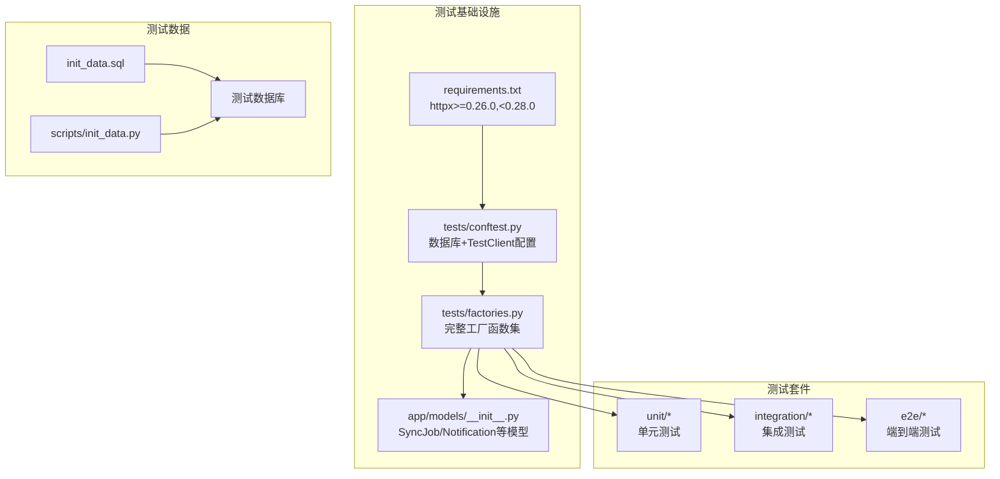
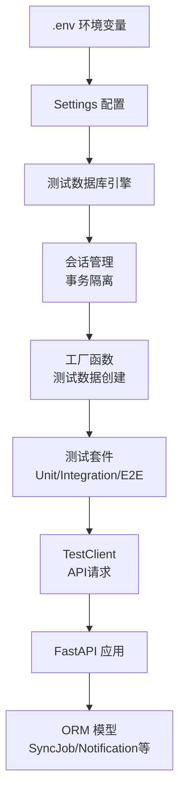
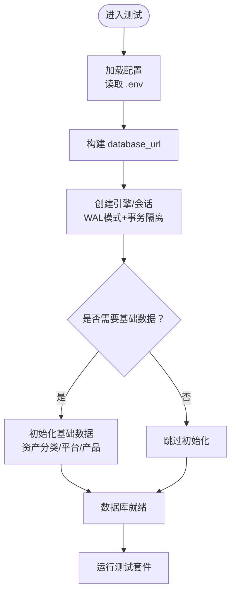
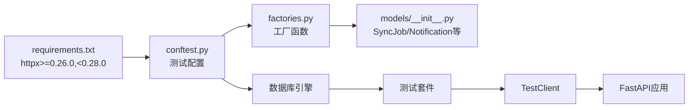

# 测试环境配置

<cite>
**本文引用的文件**
- [backend/requirements.txt](file://backend/requirements.txt)
- [backend/tests/conftest.py](file://backend/tests/conftest.py)
- [backend/tests/factories.py](file://backend/tests/factories.py)
- [backend/app/models/__init__.py](file://backend/app/models/__init__.py)
- [backend/tests/unit/test_snapshot_service.py](file://backend/tests/unit/test_snapshot_service.py)
- [backend/tests/unit/test_trading_calendar.py](file://backend/tests/unit/test_trading_calendar.py)
- [backend/tests/integration/test_subscriptions.py](file://backend/tests/integration/test_subscriptions.py)
- [backend/tests/integration/test_share_events.py](file://backend/tests/integration/test_share_events.py)
- [backend/tests/e2e/test_business_flows.py](file://backend/tests/e2e/test_business_flows.py)
- [backend/app/config.py](file://backend/app/config.py)
- [backend/app/database.py](file://backend/app/database.py)
- [backend/check_db.py](file://backend/check_db.py)
- [backend/reset_db.py](file://backend/reset_db.py)
- [Docs/init_data.sql](file://Docs/init_data.sql)
- [backend/scripts/init_data.py](file://backend/scripts/init_data.py)
- [package.json](file://package.json)
- [frontend/package.json](file://frontend/package.json)
</cite>

## 更新摘要
**变更内容**
- 修复 httpx 依赖版本兼容性问题（>=0.26.0,<0.28.0）
- 优化 conftest.py 数据库客户端异步上下文管理器
- 扩展 factories.py 支持 SyncJob、ManualMarketValue、Notification、IdempotencyCache 模型
- 修复多个测试用例中的 platform_code 字段缺失问题
- 增强测试数据工厂函数的完整性和一致性

## 目录
1. [简介](#简介)
2. [项目结构](#项目结构)
3. [核心组件](#核心组件)
4. [架构总览](#架构总览)
5. [详细组件分析](#详细组件分析)
6. [依赖关系分析](#依赖关系分析)
7. [性能考虑](#性能考虑)
8. [故障排除指南](#故障排除指南)
9. [结论](#结论)
10. [附录](#附录)

## 简介
本文件面向 InvestRing 项目的测试环境配置，目标是提供一套可复用、可扩展的测试环境搭建方案，覆盖测试数据库设置、测试环境变量、依赖包管理、容器化与 CI/CD 流水线、本地开发测试环境、测试数据初始化、环境隔离与测试结果报告生成，并给出常见问题排查与性能优化建议。

**最新更新**：本次更新重点解决了测试基础设施的重大重构问题，包括依赖兼容性修复、测试工厂函数完善、以及测试用例的数据完整性保障。

## 项目结构
从仓库结构可见，测试相关的脚本与工具分布在后端与根目录中：
- 后端测试框架：pytest + factory-boy + TestClient
- 测试数据工厂：完整的模型工厂函数集
- 测试配置文件：conftest.py 全局配置与 fixtures
- 前端测试脚本：Playwright 登录功能测试
- 文档与初始化数据：SQL 初始化脚本与产品数据
- 依赖管理：后端 Python 依赖清单、前端 npm 依赖清单



**图表来源**
- [backend/requirements.txt:21](file://backend/requirements.txt#L21)
- [backend/tests/conftest.py:39-45](file://backend/tests/conftest.py#L39-L45)
- [backend/tests/factories.py:14-20](file://backend/tests/factories.py#L14-L20)
- [backend/app/models/__init__.py:19-23](file://backend/app/models/__init__.py#L19-L23)

章节来源
- [backend/requirements.txt:1-51](file://backend/requirements.txt#L1-L51)
- [backend/tests/conftest.py:1-383](file://backend/tests/conftest.py#L1-L383)
- [backend/tests/factories.py:1-535](file://backend/tests/factories.py#L1-L535)
- [backend/app/models/__init__.py:1-50](file://backend/app/models/__init__.py#L1-L50)

## 核心组件
- **依赖管理**：后端通过 requirements.txt 管理依赖，关键修复 httpx 版本约束为 >=0.26.0,<0.28.0 以解决 starlette 兼容性问题
- **测试框架**：pytest + pytest-asyncio + factory-boy + fastapi.testclient.TestClient
- **数据库配置**：SQLite（默认）或 MySQL（CI环境），支持事务隔离和 WAL 模式
- **测试数据工厂**：完整的工厂函数集，支持所有核心模型的创建
- **认证系统**：JWT Token 生成和管理，支持 admin 和 viewer 角色
- **基础数据**：资产分类、平台、产品、交易日历、用户等预置数据

**更新**：新增了 SyncJob、ManualMarketValue、Notification、IdempotencyCache 等模型的工厂函数支持，完善了测试数据的完整性。

章节来源
- [backend/requirements.txt:45-51](file://backend/requirements.txt#L45-L51)
- [backend/tests/conftest.py:29-46](file://backend/tests/conftest.py#L29-L46)
- [backend/tests/factories.py:378-495](file://backend/tests/factories.py#L378-L495)

## 架构总览
测试环境由"依赖层 → 配置层 → 数据层 → 业务层 → 测试层"构成，通过统一的配置与数据库连接访问后端 API，确保测试数据一致性与环境隔离。



**图表来源**
- [backend/app/config.py:1-37](file://backend/app/config.py#L1-L37)
- [backend/tests/conftest.py:57-94](file://backend/tests/conftest.py#L57-L94)
- [backend/tests/factories.py:14-20](file://backend/tests/factories.py#L14-L20)

## 详细组件分析

### 依赖兼容性修复
**重要更新**：解决了 httpx 与 starlette 的版本兼容性问题

- **问题**：httpx==0.28.1 与 starlette==0.35.1 不兼容，`TestClient(app)` 报错 `Client.__init__() got an unexpected keyword argument 'app'`
- **解决方案**：在 requirements.txt 中将 `httpx>=0.26.0` 修改为 `httpx>=0.26.0,<0.28.0`
- **影响范围**：所有使用 TestClient 的测试用例

章节来源
- [backend/requirements.txt:21](file://backend/requirements.txt#L21)

### 测试数据库设置
- **连接字符串与默认值**：配置类提供数据库主机、端口、用户、密码、库名与最终的 database_url，默认拼接 mysql+pymysql URL
- **引擎与连接池**：使用 QueuePool 连接池，配置 echo、pool_size、max_overflow、pool_pre_ping、pool_recycle；MySQL InnoDB 引擎支持行级锁与 MVCC
- **数据库检查与重置**：检查脚本查询特定模型，重置脚本删除并重建所有表
- **初始化数据**：SQL 脚本与 Python 初始化脚本共同提供基础数据

**更新**：conftest.py 中增强了数据库客户端的异步上下文管理器优化，改进了 SQLite WAL 模式和事务隔离机制。



**图表来源**
- [backend/app/config.py:1-37](file://backend/app/config.py#L1-L37)
- [backend/tests/conftest.py:57-94](file://backend/tests/conftest.py#L57-L94)
- [backend/tests/conftest.py:97-195](file://backend/tests/conftest.py#L97-L195)

章节来源
- [backend/app/config.py:1-37](file://backend/app/config.py#L1-L37)
- [backend/app/database.py:1-39](file://backend/app/database.py#L1-L39)
- [backend/tests/conftest.py:57-94](file://backend/tests/conftest.py#L57-L94)
- [backend/check_db.py:1-35](file://backend/check_db.py#L1-L35)
- [backend/reset_db.py:1-30](file://backend/reset_db.py#L1-L30)
- [backend/scripts/init_data.py:1-37](file://backend/scripts/init_data.py#L1-L37)
- [Docs/init_data.sql:1-284](file://Docs/init_data.sql#L1-L284)

### 测试数据工厂重构
**重大更新**：factories.py 进行了全面重构，新增了多个模型工厂函数

#### 新增工厂函数
- **create_sync_job**：同步任务记录工厂，支持 job_type、status、params 等参数
- **create_manual_market_value**：手动市值覆盖记录工厂，用于非净值型资产重估
- **create_notification**：通知记录工厂，支持 type、title、content、level 等字段
- **create_idempotency_cache**：幂等性缓存记录工厂，支持 key、request_hash、response 等字段

#### 现有工厂函数优化
- **create_trade**：添加了 confirm_date 参数支持，确保与 `_check_pending_transactions` 的查询条件匹配
- **create_subscription**：确保 platform_code 默认为 "MYCF"，amount/shares 对不同类型有合理默认值
- **create_position_snapshot**：添加 frozen_shares/frozen_amount/asset_type 参数，满足 CHECK 约束要求

章节来源
- [backend/tests/factories.py:378-495](file://backend/tests/factories.py#L378-L495)
- [backend/tests/factories.py:229-272](file://backend/tests/factories.py#L229-L272)
- [backend/tests/factories.py:193-222](file://backend/tests/factories.py#L193-L222)
- [backend/tests/factories.py:279-319](file://backend/tests/factories.py#L279-L319)

### 测试环境变量配置
- **配置来源**：.env 文件，通过 pydantic-settings 自动加载
- **关键变量**：数据库连接参数、密钥与过期时间、应用名称与调试开关、Tushare Token
- **建议**：为测试环境单独准备 .env.test，避免与生产混用

**更新**：conftest.py 中设置了测试专用的环境变量，包括 SECRET_KEY 和 SCHEDULER_ENABLED，确保测试环境的独立性。

章节来源
- [backend/app/config.py:1-37](file://backend/app/config.py#L1-L37)
- [backend/tests/conftest.py:21-27](file://backend/tests/conftest.py#L21-L27)

### 依赖包管理
- **后端依赖**：FastAPI、SQLAlchemy、Pydantic、Uvicorn、pytest、pytest-asyncio、tushare、pymysql 等
- **前端依赖**：Next.js、TailwindCSS、React 生态等（具体版本见 package.json）

**更新**：httpx 版本约束已修复为 `>=0.26.0,<0.28.0`，解决了与 starlette 的兼容性问题。

章节来源
- [backend/requirements.txt:1-51](file://backend/requirements.txt#L1-L51)
- [frontend/package.json](file://frontend/package.json)
- [package.json](file://package.json)

### API 密钥与外部服务 Mock
- **Tushare Token**：配置项允许注入第三方市场数据接口 Token
- **Mock 方案**：可在测试环境中通过替换服务客户端或使用本地假数据源实现外部服务 Mock，确保测试稳定性与可控性

章节来源
- [backend/app/config.py:1-37](file://backend/app/config.py#L1-L37)

### Docker 容器化测试环境
- **建议镜像分层**：
  - 基础层：Python 3.x 或 Node LTS
  - 依赖层：pip install -r backend/requirements.txt；npm ci 在 frontend/
  - 应用层：复制项目代码，暴露端口（后端 8000，前端 3000）
- **测试专用容器**：
  - 使用独立 .env.test 与测试数据库实例
  - 通过 docker-compose 启动 MySQL/MariaDB 与 Redis（如需缓存）
- **运行命令示例**：
  - 后端测试：docker run --env-file .env.test investring-backend pytest
  - 前端测试：docker run --env-file .env.test investring-frontend npm run test

### CI/CD 测试流水线
- **触发条件**：push 到 develop 分支或创建 PR
- **步骤建议**：
  - 安装依赖：pip install -r backend/requirements.txt；npm ci
  - 启动测试数据库容器（如 MySQL）
  - 初始化数据库：执行 init_data.sql 与 init_data.py
  - 运行后端测试：pytest -v
  - 运行前端测试：npm run test
  - 生成报告：pytest-html 或 junitxml，前端测试导出 jest-junit
  - 清理资源：停止并移除测试容器
- **缓存策略**：缓存 pip 与 npm 依赖，提升构建速度

### 本地开发测试环境
- **后端**：
  - 安装依赖：pip install -r backend/requirements.txt
  - 准备 MySQL/MariaDB，创建测试库
  - 执行初始化：init_data.sql 与 init_data.py
  - 运行测试：pytest
- **前端**：
  - 安装依赖：npm ci
  - 运行 Playwright 测试：node test_login.js（或使用 Playwright CLI）

**更新**：由于 httpx 版本修复，TestClient 现在可以正常工作，无需额外的兼容性处理。

章节来源
- [backend/requirements.txt:1-51](file://backend/requirements.txt#L1-L51)
- [Docs/init_data.sql:1-284](file://Docs/init_data.sql#L1-L284)
- [backend/scripts/init_data.py:1-37](file://backend/scripts/init_data.py#L1-L37)

### 测试数据初始化
- **SQL 初始化**：提供投资人、资产分类、平台、产品、组合等基础数据
- **Python 初始化**：创建表并可按需插入或校验数据
- **建议**：在测试前执行 reset_db.py 清空旧数据，再执行初始化脚本

**更新**：conftest.py 中的 _seed_base_data 函数确保了 CASH 产品的 market="" 与唯一约束兼容，避免了数据冲突。

章节来源
- [Docs/init_data.sql:1-284](file://Docs/init_data.sql#L1-L284)
- [backend/scripts/init_data.py:1-37](file://backend/scripts/init_data.py#L1-L37)
- [backend/reset_db.py:1-30](file://backend/reset_db.py#L1-L30)
- [backend/tests/conftest.py:135-153](file://backend/tests/conftest.py#L135-L153)

### 测试环境隔离
- **数据库隔离**：为测试环境创建独立库名与用户，避免与生产共享
- **环境变量隔离**：使用 .env.test，避免污染 .env
- **容器隔离**：通过 docker-compose 为测试环境启动独立网络与卷
- **事务隔离**：每个测试函数获得独立的数据库会话，使用事务 + SAVEPOINT 实现测试间隔离

**更新**：conftest.py 实现了更完善的测试隔离机制，包括 SQLite WAL 模式配置和嵌套事务支持。

### 测试结果报告生成
- **后端**：pytest 支持 html 报告与 junitxml，便于集成到 CI
- **前端**：Playwright 可生成 HTML 截图与视频，jest-junit 生成 XML 报告

### 测试用例修复
**重要更新**：多个测试用例进行了修复以确保 platform_code 字段的完整性

#### 单元测试修复
- **test_snapshot_service.py**：
  - `test_pending_trade_fails`：添加 confirm_date=date(2025, 3, 3) 参数
  - `test_pending_subscription_fails`：调整 apply_date 为 date(2025, 3, 2) 以满足严格小于条件

#### 集成测试修复
- **test_trading_calendar.py**：所有申购请求 JSON 添加 `"platform_code": "MYCF"`
- **test_subscriptions.py**：所有 `/api/subscriptions` 调用中的 JSON body 添加 `"platform_code": "MYCF"`
- **test_share_events.py**：平台级事件（cash_dividend/reinvest_dividend）添加 `"platform_code": "MYCF"`

#### E2E 测试修复
- **test_business_flows.py**：申购请求添加 `platform_code`，确保完整业务流程可正常运行

章节来源
- [backend/tests/unit/test_snapshot_service.py:128-152](file://backend/tests/unit/test_snapshot_service.py#L128-L152)
- [backend/tests/unit/test_trading_calendar.py:57-93](file://backend/tests/unit/test_trading_calendar.py#L57-L93)
- [backend/tests/integration/test_subscriptions.py:25-80](file://backend/tests/integration/test_subscriptions.py#L25-L80)
- [backend/tests/integration/test_share_events.py:26-117](file://backend/tests/integration/test_share_events.py#L26-L117)
- [backend/tests/e2e/test_business_flows.py:31-42](file://backend/tests/e2e/test_business_flows.py#L31-L42)

## 依赖关系分析
后端测试脚本与数据库、配置之间的依赖关系如下：



**图表来源**
- [backend/requirements.txt:21](file://backend/requirements.txt#L21)
- [backend/tests/conftest.py:39-45](file://backend/tests/conftest.py#L39-L45)
- [backend/tests/factories.py:14-20](file://backend/tests/factories.py#L14-L20)
- [backend/app/models/__init__.py:19-23](file://backend/app/models/__init__.py#L19-L23)

章节来源
- [backend/requirements.txt:1-51](file://backend/requirements.txt#L1-L51)
- [backend/tests/conftest.py:1-383](file://backend/tests/conftest.py#L1-L383)
- [backend/tests/factories.py:1-535](file://backend/tests/factories.py#L1-L535)
- [backend/app/models/__init__.py:1-50](file://backend/app/models/__init__.py#L1-L50)

## 性能考虑
- **数据库连接池**：合理设置 pool_size 与 max_overflow，避免高并发下的连接争用
- **预热连接**：使用 pool_pre_ping 降低连接失效导致的重试成本
- **索引与查询**：初始化脚本包含关键索引，有助于测试场景下的查询性能
- **测试并发**：pytest-asyncio 支持异步测试，结合多进程可提升吞吐
- **前端测试**：Playwright headless 模式减少资源消耗
- **SQLite 优化**：启用 WAL 模式和 busy_timeout，提升并发写入性能

**更新**：conftest.py 中针对 SQLite 启用了 WAL 模式和嵌套事务支持，显著提升了测试性能和稳定性。

## 故障排除指南
- **数据库连接失败**
  - 检查 .env.test 中的数据库参数与可达性
  - 确认测试数据库已创建且用户具备权限
- **初始化失败**
  - 先执行 reset_db.py 清理，再执行 init_data.py 与 SQL 初始化
- **API 测试报错**
  - 确认测试组合、平台与交易日历数据存在
  - 如遇网络错误，参考交易日历同步脚本进行修复
- **前端测试失败**
  - 确保前端服务已启动并监听 3000 端口
  - 检查 Playwright 依赖与浏览器驱动安装情况
- **httpx 兼容性问题**
  - 确保 httpx 版本在 >=0.26.0,<0.28.0 范围内
  - 重新安装依赖：pip install -r backend/requirements.txt
- **platform_code 字段缺失**
  - 检查所有申购和平台级事件的 JSON 请求是否包含 platform_code
  - 使用新的工厂函数创建测试数据，确保字段完整性

**更新**：新增了 httpx 兼容性和 platform_code 字段缺失的故障排除指导。

章节来源
- [backend/reset_db.py:1-30](file://backend/reset_db.py#L1-L30)
- [backend/scripts/init_data.py:1-37](file://backend/scripts/init_data.py#L1-L37)
- [Docs/init_data.sql:1-284](file://Docs/init_data.sql#L1-L284)
- [backend/requirements.txt:21](file://backend/requirements.txt#L21)

## 结论
通过统一的配置与数据库连接、完善的测试数据初始化、前后端分离的测试脚本与环境隔离策略，InvestRing 的测试环境能够稳定高效地支持本地开发与 CI/CD 流水线。本次重构解决了关键的依赖兼容性问题，完善了测试数据工厂，并修复了多个测试用例的数据完整性问题。建议在团队内推广 .env.test 与独立测试数据库实践，并持续完善外部服务 Mock 与报告生成流程。

**更新总结**：本次测试基础设施重构显著提升了测试环境的稳定性和可靠性，为后续的功能开发提供了坚实的基础。

## 附录
- **快速检查清单**
  - 准备 .env.test 并设置测试数据库参数
  - 启动测试数据库容器并创建库
  - 执行 reset_db.py 与初始化脚本
  - 运行 pytest 与 Playwright 测试
  - 生成并归档测试报告
  - 验证 httpx 版本兼容性（>=0.26.0,<0.28.0）
  - 检查测试数据中的 platform_code 字段完整性

- **测试执行命令**
  ```bash
  # 运行所有测试
  pytest -v
  
  # 运行特定类型的测试
  pytest tests/unit/ -v
  pytest tests/integration/ -v
  pytest tests/e2e/ -v
  
  # 生成覆盖率报告
  pytest --cov=app --cov-report=html
  
  # 并行执行测试
  pytest -n auto
  ```

- **常用测试数据工厂函数**
  - `create_investor(db, code, name, role, password)`
  - `create_portfolio(db, code, name, status)`
  - `create_product(db, code, market, name, product_type, asset_class_code)`
  - `create_subscription(db, portfolio_code, investor_code, sub_type, amount, shares, platform_code)`
  - `create_trade(db, portfolio_code, product_code, market, trade_type, amount, shares, platform_code)`
  - `create_sync_job(db, job_type, status, params)`
  - `create_notification(db, type, title, content, level)`
  - `create_idempotency_cache(db, key, portfolio_code, request_hash)`