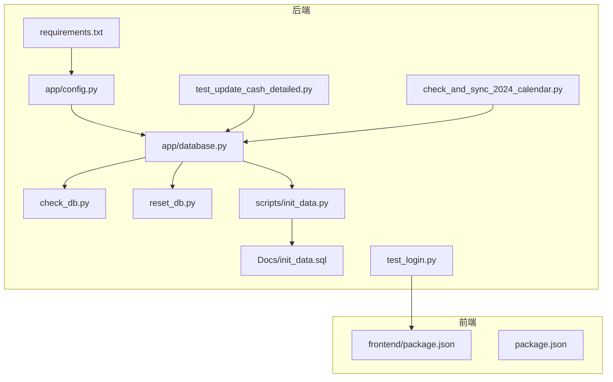
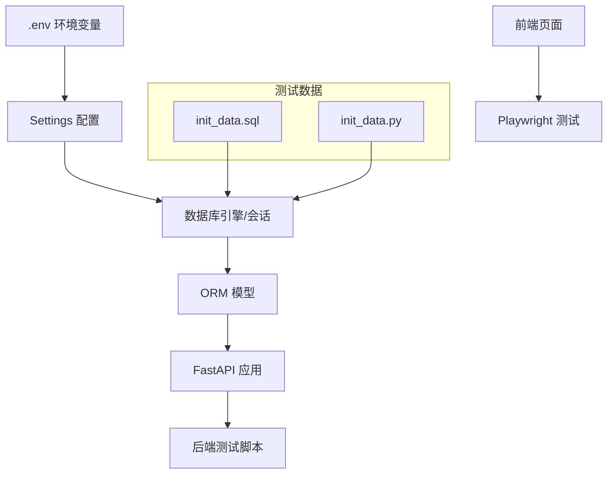
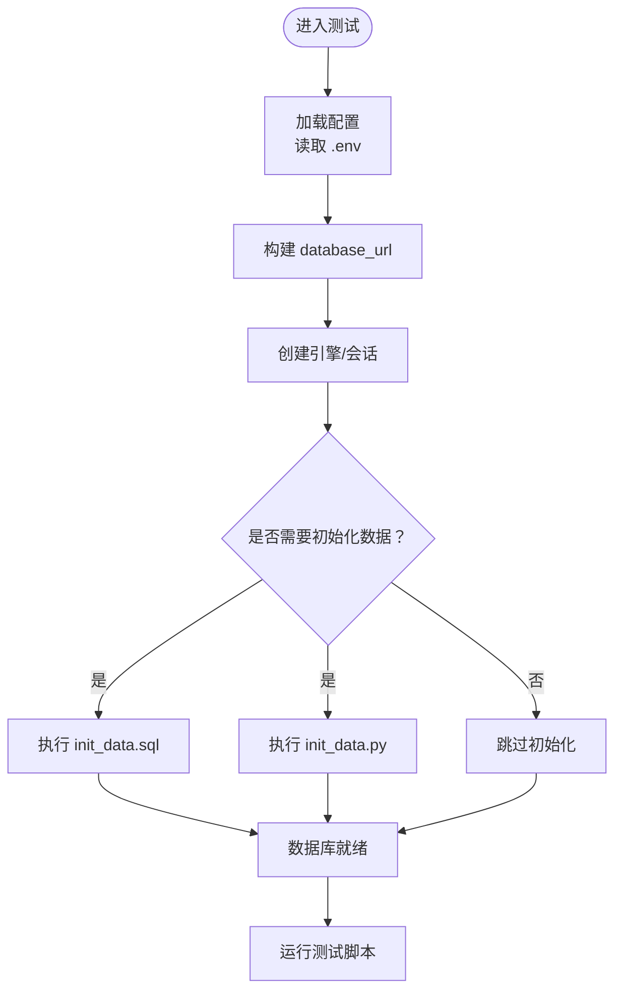
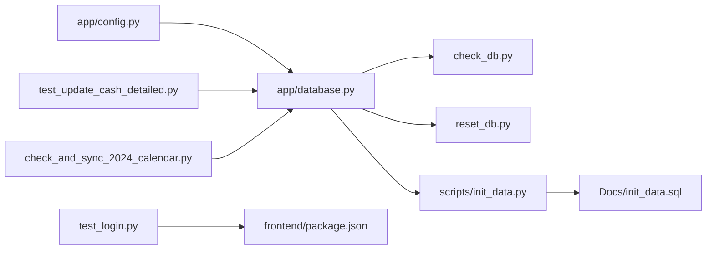

# 测试环境配置

<cite>
**本文引用的文件**
- [backend/requirements.txt](file://backend/requirements.txt)
- [backend/app/config.py](file://backend/app/config.py)
- [backend/app/database.py](file://backend/app/database.py)
- [backend/check_db.py](file://backend/check_db.py)
- [backend/reset_db.py](file://backend/reset_db.py)
- [Docs/init_data.sql](file://Docs/init_data.sql)
- [backend/scripts/init_data.py](file://backend/scripts/init_data.py)
- [backend/test_update_cash_detailed.py](file://backend/test_update_cash_detailed.py)
- [backend/check_and_sync_2024_calendar.py](file://backend/check_and_sync_2024_calendar.py)
- [test_login.py](file://test_login.py)
- [package.json](file://package.json)
- [frontend/package.json](file://frontend/package.json)
- [backend/app/schemas/data_source.py](file://backend/app/schemas/data_source.py)
</cite>

## 目录
1. [简介](#简介)
2. [项目结构](#项目结构)
3. [核心组件](#核心组件)
4. [架构总览](#架构总览)
5. [详细组件分析](#详细组件分析)
6. [依赖关系分析](#依赖关系分析)
7. [性能考虑](#性能考虑)
8. [故障排除指南](#故障排除指南)
9. [结论](#结论)
10. [附录](#附录)

## 简介
本文件面向 InvestRing 项目的测试环境配置，目标是提供一套可复用、可扩展的测试环境搭建方案，覆盖测试数据库设置、测试环境变量、依赖包管理、容器化与 CI/CD 流水线、本地开发测试环境、测试数据初始化、环境隔离与测试结果报告生成，并给出常见问题排查与性能优化建议。

## 项目结构
从仓库结构可见，测试相关的脚本与工具分布在后端与根目录中：
- 后端测试脚本：数据库检查、重置、初始化、API 功能测试、交易日历同步等
- 前端测试脚本：Playwright 登录功能测试
- 文档与初始化数据：SQL 初始化脚本与产品数据
- 依赖管理：后端 Python 依赖清单、前端 npm 依赖清单

图表来源
- [backend/requirements.txt:1-19](file://backend/requirements.txt#L1-L19)
- [backend/app/config.py:1-37](file://backend/app/config.py#L1-L37)
- [backend/app/database.py:1-39](file://backend/app/database.py#L1-L39)
- [backend/check_db.py:1-35](file://backend/check_db.py#L1-L35)
- [backend/reset_db.py:1-30](file://backend/reset_db.py#L1-L30)
- [backend/scripts/init_data.py:1-37](file://backend/scripts/init_data.py#L1-L37)
- [Docs/init_data.sql:1-284](file://Docs/init_data.sql#L1-L284)
- [backend/test_update_cash_detailed.py:1-226](file://backend/test_update_cash_detailed.py#L1-L226)
- [backend/check_and_sync_2024_calendar.py:1-48](file://backend/check_and_sync_2024_calendar.py#L1-L48)
- [test_login.py:1-409](file://test_login.py#L1-L409)
- [frontend/package.json](file://frontend/package.json)
- [package.json](file://package.json)

章节来源
- [backend/requirements.txt:1-19](file://backend/requirements.txt#L1-L19)
- [backend/app/config.py:1-37](file://backend/app/config.py#L1-L37)
- [backend/app/database.py:1-39](file://backend/app/database.py#L1-L39)
- [backend/check_db.py:1-35](file://backend/check_db.py#L1-L35)
- [backend/reset_db.py:1-30](file://backend/reset_db.py#L1-L30)
- [backend/scripts/init_data.py:1-37](file://backend/scripts/init_data.py#L1-L37)
- [Docs/init_data.sql:1-284](file://Docs/init_data.sql#L1-L284)
- [backend/test_update_cash_detailed.py:1-226](file://backend/test_update_cash_detailed.py#L1-L226)
- [backend/check_and_sync_2024_calendar.py:1-48](file://backend/check_and_sync_2024_calendar.py#L1-L48)
- [test_login.py:1-409](file://test_login.py#L1-L409)
- [frontend/package.json](file://frontend/package.json)
- [package.json](file://package.json)

## 核心组件
- 配置与环境变量：后端通过 pydantic-settings 读取 .env 文件，集中管理数据库、安全、应用与第三方 API（如 Tushare）参数
- 数据库引擎与连接池：基于 SQLAlchemy，使用 QueuePool 连接池，配置 echo、pool_size、max_overflow、pool_pre_ping、pool_recycle
- 测试数据初始化：SQL 脚本与 Python 初始化脚本共同提供基础数据
- 测试脚本：后端 API 测试、前端 Playwright 登录测试、数据库检查与重置脚本
- 依赖管理：后端 Python 依赖、前端 npm 依赖

章节来源
- [backend/app/config.py:1-37](file://backend/app/config.py#L1-L37)
- [backend/app/database.py:1-39](file://backend/app/database.py#L1-L39)
- [backend/scripts/init_data.py:1-37](file://backend/scripts/init_data.py#L1-L37)
- [Docs/init_data.sql:1-284](file://Docs/init_data.sql#L1-L284)
- [backend/test_update_cash_detailed.py:1-226](file://backend/test_update_cash_detailed.py#L1-L226)
- [test_login.py:1-409](file://test_login.py#L1-L409)
- [backend/requirements.txt:1-19](file://backend/requirements.txt#L1-L19)
- [frontend/package.json](file://frontend/package.json)

## 架构总览
测试环境由“配置层 → 数据层 → 业务层 → 测试层”构成，测试脚本通过统一的配置与数据库连接访问后端 API 或前端页面，确保测试数据一致性与环境隔离。

图表来源
- [backend/app/config.py:1-37](file://backend/app/config.py#L1-L37)
- [backend/app/database.py:1-39](file://backend/app/database.py#L1-L39)
- [backend/scripts/init_data.py:1-37](file://backend/scripts/init_data.py#L1-L37)
- [Docs/init_data.sql:1-284](file://Docs/init_data.sql#L1-L284)
- [backend/test_update_cash_detailed.py:1-226](file://backend/test_update_cash_detailed.py#L1-L226)
- [test_login.py:1-409](file://test_login.py#L1-L409)

## 详细组件分析

### 测试数据库设置
- 连接字符串与默认值：配置类提供数据库主机、端口、用户、密码、库名与最终的 database_url，默认拼接 mysql+pymysql URL
- 引擎与连接池：使用 QueuePool 连接池，配置 echo、pool_size、max_overflow、pool_pre_ping、pool_recycle；MySQL InnoDB 引擎支持行级锁与 MVCC
- 数据库检查与重置：检查脚本查询特定模型，重置脚本删除并重建所有表
- 初始化数据：SQL 脚本提供投资人、资产分类、平台、产品、组合等基础数据；Python 初始化脚本创建表并可按需补充

图表来源
- [backend/app/config.py:1-37](file://backend/app/config.py#L1-L37)
- [backend/app/database.py:1-39](file://backend/app/database.py#L1-L39)
- [backend/check_db.py:1-35](file://backend/check_db.py#L1-L35)
- [backend/reset_db.py:1-30](file://backend/reset_db.py#L1-L30)
- [backend/scripts/init_data.py:1-37](file://backend/scripts/init_data.py#L1-L37)
- [Docs/init_data.sql:1-284](file://Docs/init_data.sql#L1-L284)

章节来源
- [backend/app/config.py:1-37](file://backend/app/config.py#L1-L37)
- [backend/app/database.py:1-39](file://backend/app/database.py#L1-L39)
- [backend/check_db.py:1-35](file://backend/check_db.py#L1-L35)
- [backend/reset_db.py:1-30](file://backend/reset_db.py#L1-L30)
- [backend/scripts/init_data.py:1-37](file://backend/scripts/init_data.py#L1-L37)
- [Docs/init_data.sql:1-284](file://Docs/init_data.sql#L1-L284)

### 测试环境变量配置
- 配置来源：.env 文件，通过 pydantic-settings 自动加载
- 关键变量：数据库连接参数、密钥与过期时间、应用名称与调试开关、Tushare Token
- 建议：为测试环境单独准备 .env.test，避免与生产混用

章节来源
- [backend/app/config.py:1-37](file://backend/app/config.py#L1-L37)

### 依赖包管理
- 后端依赖：FastAPI、SQLAlchemy、Pydantic、Uvicorn、pytest、pytest-asyncio、tushare、pymysql 等
- 前端依赖：Next.js、TailwindCSS、React 生态等（具体版本见 package.json）

章节来源
- [backend/requirements.txt:1-19](file://backend/requirements.txt#L1-L19)
- [frontend/package.json](file://frontend/package.json)
- [package.json](file://package.json)

### API 密钥与外部服务 Mock
- Tushare Token：配置项允许注入第三方市场数据接口 Token
- Mock 方案：可在测试环境中通过替换服务客户端或使用本地假数据源实现外部服务 Mock，确保测试稳定性与可控性

章节来源
- [backend/app/config.py:1-37](file://backend/app/config.py#L1-L37)
- [backend/app/schemas/data_source.py:1-23](file://backend/app/schemas/data_source.py#L1-L23)

### Docker 容器化测试环境
- 建议镜像分层：
  - 基础层：Python 3.x 或 Node LTS
  - 依赖层：pip install -r backend/requirements.txt；npm ci 在 frontend/
  - 应用层：复制项目代码，暴露端口（后端 8000，前端 3000）
- 测试专用容器：
  - 使用独立 .env.test 与测试数据库实例
  - 通过 docker-compose 启动 MySQL/MariaDB 与 Redis（如需缓存）
- 运行命令示例：
  - 后端测试：docker run --env-file .env.test investring-backend pytest
  - 前端测试：docker run --env-file .env.test investring-frontend npm run test

[本节为概念性指导，不直接分析具体文件，故无章节来源]

### CI/CD 测试流水线
- 触发条件：push 到 develop 分支或创建 PR
- 步骤建议：
  - 安装依赖：pip install -r backend/requirements.txt；npm ci
  - 启动测试数据库容器（如 MySQL）
  - 初始化数据库：执行 init_data.sql 与 init_data.py
  - 运行后端测试：pytest -v
  - 运行前端测试：npm run test
  - 生成报告：pytest-html 或 junitxml，前端测试导出 jest-junit
  - 清理资源：停止并移除测试容器
- 缓存策略：缓存 pip 与 npm 依赖，提升构建速度

[本节为概念性指导，不直接分析具体文件，故无章节来源]

### 本地开发测试环境
- 后端：
  - 安装依赖：pip install -r backend/requirements.txt
  - 准备 MySQL/MariaDB，创建测试库
  - 执行初始化：init_data.sql 与 init_data.py
  - 运行测试：pytest
- 前端：
  - 安装依赖：npm ci
  - 运行 Playwright 测试：node test_login.js（或使用 Playwright CLI）

章节来源
- [backend/requirements.txt:1-19](file://backend/requirements.txt#L1-L19)
- [Docs/init_data.sql:1-284](file://Docs/init_data.sql#L1-L284)
- [backend/scripts/init_data.py:1-37](file://backend/scripts/init_data.py#L1-L37)
- [test_login.py:1-409](file://test_login.py#L1-L409)

### 测试数据初始化
- SQL 初始化：提供投资人、资产分类、平台、产品、组合等基础数据
- Python 初始化：创建表并可按需插入或校验数据
- 建议：在测试前执行 reset_db.py 清空旧数据，再执行初始化脚本

章节来源
- [Docs/init_data.sql:1-284](file://Docs/init_data.sql#L1-L284)
- [backend/scripts/init_data.py:1-37](file://backend/scripts/init_data.py#L1-L37)
- [backend/reset_db.py:1-30](file://backend/reset_db.py#L1-L30)

### 测试环境隔离
- 数据库隔离：为测试环境创建独立库名与用户，避免与生产共享
- 环境变量隔离：使用 .env.test，避免污染 .env
- 容器隔离：通过 docker-compose 为测试环境启动独立网络与卷

[本节为概念性指导，不直接分析具体文件，故无章节来源]

### 测试结果报告生成
- 后端：pytest 支持 html 报告与 junitxml，便于集成到 CI
- 前端：Playwright 可生成 HTML 截图与视频，jest-junit 生成 XML 报告

[本节为概念性指导，不直接分析具体文件，故无章节来源]

## 依赖关系分析
后端测试脚本与数据库、配置之间的依赖关系如下：

图表来源
- [backend/app/config.py:1-37](file://backend/app/config.py#L1-L37)
- [backend/app/database.py:1-39](file://backend/app/database.py#L1-L39)
- [backend/check_db.py:1-35](file://backend/check_db.py#L1-L35)
- [backend/reset_db.py:1-30](file://backend/reset_db.py#L1-L30)
- [backend/scripts/init_data.py:1-37](file://backend/scripts/init_data.py#L1-L37)
- [Docs/init_data.sql:1-284](file://Docs/init_data.sql#L1-L284)
- [backend/test_update_cash_detailed.py:1-226](file://backend/test_update_cash_detailed.py#L1-L226)
- [backend/check_and_sync_2024_calendar.py:1-48](file://backend/check_and_sync_2024_calendar.py#L1-L48)
- [test_login.py:1-409](file://test_login.py#L1-L409)
- [frontend/package.json](file://frontend/package.json)

章节来源
- [backend/app/config.py:1-37](file://backend/app/config.py#L1-L37)
- [backend/app/database.py:1-39](file://backend/app/database.py#L1-L39)
- [backend/check_db.py:1-35](file://backend/check_db.py#L1-L35)
- [backend/reset_db.py:1-30](file://backend/reset_db.py#L1-L30)
- [backend/scripts/init_data.py:1-37](file://backend/scripts/init_data.py#L1-L37)
- [Docs/init_data.sql:1-284](file://Docs/init_data.sql#L1-L284)
- [backend/test_update_cash_detailed.py:1-226](file://backend/test_update_cash_detailed.py#L1-L226)
- [backend/check_and_sync_2024_calendar.py:1-48](file://backend/check_and_sync_2024_calendar.py#L1-L48)
- [test_login.py:1-409](file://test_login.py#L1-L409)
- [frontend/package.json](file://frontend/package.json)

## 性能考虑
- 数据库连接池：合理设置 pool_size 与 max_overflow，避免高并发下的连接争用
- 预热连接：使用 pool_pre_ping 降低连接失效导致的重试成本
- 索引与查询：初始化脚本包含关键索引，有助于测试场景下的查询性能
- 测试并发：pytest-asyncio 支持异步测试，结合多进程可提升吞吐
- 前端测试：Playwright headless 模式减少资源消耗

[本节为通用建议，不直接分析具体文件，故无章节来源]

## 故障排除指南
- 数据库连接失败
  - 检查 .env.test 中的数据库参数与可达性
  - 确认测试数据库已创建且用户具备权限
- 初始化失败
  - 先执行 reset_db.py 清理，再执行 init_data.py 与 SQL 初始化
- API 测试报错
  - 确认测试组合、平台与交易日历数据存在
  - 如遇网络错误，参考交易日历同步脚本进行修复
- 前端测试失败
  - 确保前端服务已启动并监听 3000 端口
  - 检查 Playwright 依赖与浏览器驱动安装情况

章节来源
- [backend/reset_db.py:1-30](file://backend/reset_db.py#L1-L30)
- [backend/scripts/init_data.py:1-37](file://backend/scripts/init_data.py#L1-L37)
- [Docs/init_data.sql:1-284](file://Docs/init_data.sql#L1-L284)
- [backend/test_update_cash_detailed.py:1-226](file://backend/test_update_cash_detailed.py#L1-L226)
- [backend/check_and_sync_2024_calendar.py:1-48](file://backend/check_and_sync_2024_calendar.py#L1-L48)
- [test_login.py:1-409](file://test_login.py#L1-L409)

## 结论
通过统一的配置与数据库连接、完善的测试数据初始化、前后端分离的测试脚本与环境隔离策略，InvestRing 的测试环境能够稳定高效地支持本地开发与 CI/CD 流水线。建议在团队内推广 .env.test 与独立测试数据库实践，并持续完善外部服务 Mock 与报告生成流程。

[本节为总结性内容，不直接分析具体文件，故无章节来源]

## 附录
- 快速检查清单
  - 准备 .env.test 并设置测试数据库参数
  - 启动测试数据库容器并创建库
  - 执行 reset_db.py 与初始化脚本
  - 运行 pytest 与 Playwright 测试
  - 生成并归档测试报告

[本节为通用建议，不直接分析具体文件，故无章节来源]