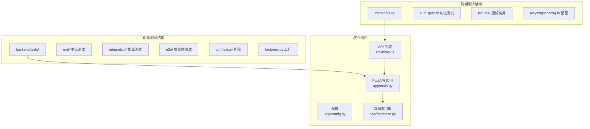
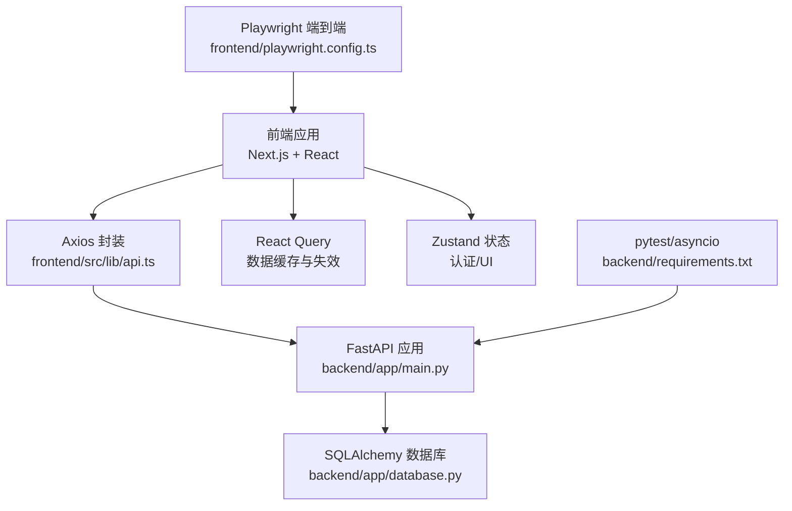
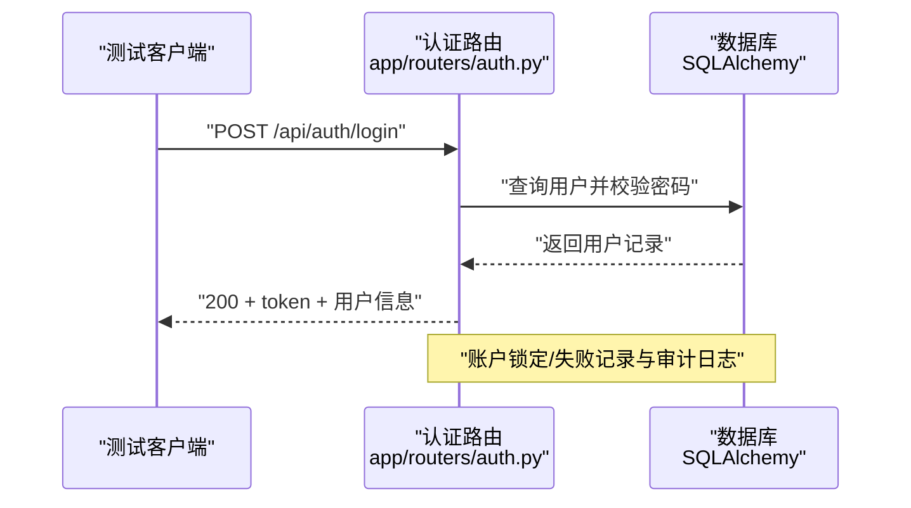
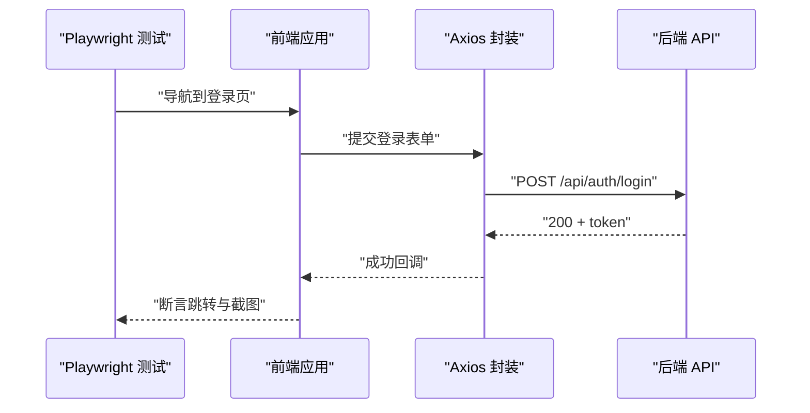
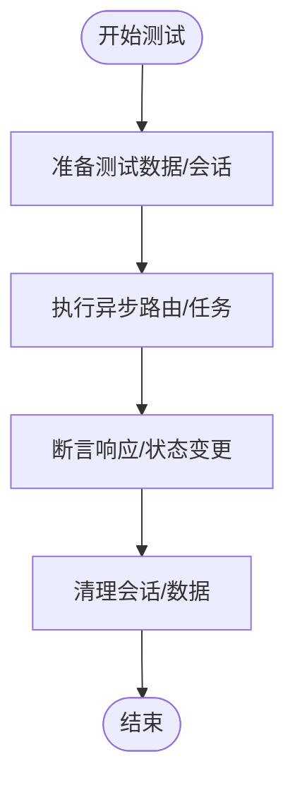
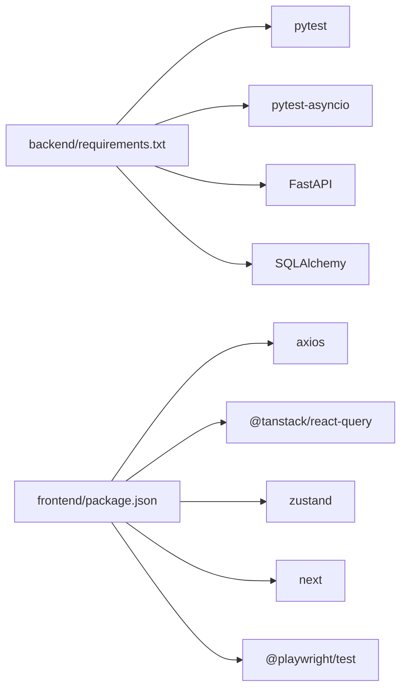

# 测试策略

<cite>
**本文引用的文件**
- [backend/requirements.txt](file://backend/requirements.txt)
- [package.json](file://package.json)
- [test_login.py](file://test_login.py)
- [test_update_cash_api.py](file://test_update_cash_api.py)
- [test_update_cash_detailed.py](file://test_update_cash_detailed.py)
- [backend/app/main.py](file://backend/app/main.py)
- [backend/app/config.py](file://backend/app/config.py)
- [backend/app/database.py](file://backend/app/database.py)
- [backend/app/routers/auth.py](file://backend/app/routers/auth.py)
- [backend/app/models/portfolio.py](file://backend/app/models/portfolio.py)
- [backend/app/models/platform.py](file://backend/app/models/platform.py)
- [backend/app/models/trading_calendar.py](file://backend/app/models/trading_calendar.py)
- [frontend/package.json](file://frontend/package.json)
- [frontend/src/lib/api.ts](file://frontend/src/lib/api.ts)
- [frontend/src/hooks/useAuth.ts](file://frontend/src/hooks/useAuth.ts)
- [frontend/playwright.config.ts](file://frontend/playwright.config.ts)
- [frontend/e2e/auth.spec.ts](file://frontend/e2e/auth.spec.ts)
- [frontend/e2e/fixtures/auth.setup.ts](file://frontend/e2e/fixtures/auth.setup.ts)
- [backend/tests/conftest.py](file://backend/tests/conftest.py)
- [backend/tests/factories.py](file://backend/tests/factories.py)
- [backend/tests/unit/test_security.py](file://backend/tests/unit/test_security.py)
- [backend/tests/integration/test_auth.py](file://backend/tests/integration/test_auth.py)
- [backend/tests/e2e/test_business_flows.py](file://backend/tests/e2e/test_business_flows.py)
- [.github/workflows/ci.yml](file://.github/workflows/ci.yml)
</cite>

## 更新摘要
**所做更改**
- 新增 Playwright 端到端测试框架的完整实现和配置
- 扩展后端测试套件，包含单元测试、集成测试和端到端测试的完整结构
- 改进 CI/CD 流程，集成 Playwright 测试和覆盖率报告
- 更新测试数据准备和 Mock 对象使用策略
- 完善测试环境配置和自动化测试脚本

## 目录
1. [引言](#引言)
2. [项目结构](#项目结构)
3. [核心组件](#核心组件)
4. [架构总览](#架构总览)
5. [详细组件分析](#详细组件分析)
6. [依赖分析](#依赖分析)
7. [性能考虑](#性能考虑)
8. [故障排查指南](#故障排查指南)
9. [结论](#结论)
10. [附录](#附录)

## 引言
本测试策略文档面向 InvestRing 项目，旨在为后端 API、数据库、异步任务、前端组件、状态管理与用户交互提供系统化的测试实施计划。文档覆盖单元测试、集成测试、端到端测试和性能测试，明确测试框架（pytest、Playwright）、Mock 使用、测试数据准备、测试环境配置、覆盖率要求、CI 流程与自动化脚本，并补充性能、安全与兼容性测试指导。

**更新** 新增 Playwright 端到端测试框架，扩展后端测试套件结构，改进 CI/CD 流程集成。

## 项目结构
项目采用前后端分离架构：
- 后端基于 FastAPI，提供 REST API，使用 SQLAlchemy 进行数据库访问，支持异步任务与定时任务。
- 前端基于 Next.js + React，使用 TanStack React Query 管理数据请求，Zustand 管理轻量状态，Axios 封装 API 调用与统一错误处理。
- 测试框架包括 Python 的 pytest 与 Playwright 端到端测试，分别覆盖后端 API 与前端交互。

**图表来源**
- [backend/tests/conftest.py](file://backend/tests/conftest.py)
- [backend/tests/factories.py](file://backend/tests/factories.py)
- [frontend/playwright.config.ts](file://frontend/playwright.config.ts)
- [frontend/e2e/auth.spec.ts](file://frontend/e2e/auth.spec.ts)
- [backend/app/main.py](file://backend/app/main.py)
- [frontend/src/lib/api.ts](file://frontend/src/lib/api.ts)

**章节来源**
- [backend/tests/conftest.py](file://backend/tests/conftest.py)
- [backend/tests/factories.py](file://backend/tests/factories.py)
- [frontend/playwright.config.ts](file://frontend/playwright.config.ts)
- [frontend/e2e/auth.spec.ts](file://frontend/e2e/auth.spec.ts)
- [backend/app/main.py](file://backend/app/main.py)
- [frontend/src/lib/api.ts](file://frontend/src/lib/api.ts)

## 核心组件
- 后端应用与路由
  - 应用入口与中间件、CORS 配置、路由注册集中在应用主文件中。
  - 认证路由提供登录、登出、改密等接口，包含安全与审计日志记录。
- 数据库层
  - 使用 SQLAlchemy 建模，提供连接池、SQLite 特定配置与会话生命周期管理。
- 前端 API 层
  - Axios 实例封装，请求/响应拦截器统一处理鉴权与 401 跳转。
  - 针对各模块的 API 方法封装，便于测试与业务调用。
- 前端状态与交互
  - 使用 Zustand 管理认证与 UI 状态，React Query 管理数据缓存与失效策略。
  - 认证相关 Hooks 提供登录、登出、当前用户、角色校验等能力。

**章节来源**
- [backend/app/main.py](file://backend/app/main.py)
- [backend/app/routers/auth.py](file://backend/app/routers/auth.py)
- [backend/app/database.py](file://backend/app/database.py)
- [frontend/src/lib/api.ts](file://frontend/src/lib/api.ts)
- [frontend/src/hooks/useAuth.ts](file://frontend/src/hooks/useAuth.ts)

## 架构总览
下图展示测试策略与系统组件的交互关系：后端 API 接收来自前端的请求；前端通过 API 封装与拦截器进行统一处理；测试框架分别从后端与前端两个维度验证功能与交互。

**图表来源**
- [frontend/src/lib/api.ts](file://frontend/src/lib/api.ts)
- [frontend/src/hooks/useAuth.ts](file://frontend/src/hooks/useAuth.ts)
- [backend/app/main.py](file://backend/app/main.py)
- [backend/app/database.py](file://backend/app/database.py)
- [backend/requirements.txt](file://backend/requirements.txt)
- [frontend/playwright.config.ts](file://frontend/playwright.config.ts)

## 详细组件分析

### 后端测试框架与最佳实践
- 测试框架
  - 使用 pytest 与 pytest-asyncio 支持同步与异步测试，适合 FastAPI 异步路由与数据库事务场景。
  - 测试套件结构清晰：unit/（单元测试）、integration/（集成测试）、e2e/（端到端测试）。
- 认证接口测试要点
  - 登录：构造有效/无效凭据，断言返回 token、用户信息与过期时间；验证 401/403 场景与账户锁定逻辑。
  - 登出：携带有效 token 登出，断言登出日志与黑名单生效。
  - 改密：区分 admin 与 viewer 权限，校验旧密码必填与权限限制。
- 测试配置与工厂
  - 使用 conftest.py 配置全局测试夹具，包括数据库连接、测试会话和清理机制。
  - 通过 factories.py 生成标准化测试数据，确保测试隔离性和可重复性。

**图表来源**
- [backend/app/routers/auth.py](file://backend/app/routers/auth.py)
- [backend/tests/conftest.py](file://backend/tests/conftest.py)

**章节来源**
- [backend/requirements.txt](file://backend/requirements.txt)
- [backend/app/routers/auth.py](file://backend/app/routers/auth.py)
- [backend/tests/conftest.py](file://backend/tests/conftest.py)
- [backend/tests/factories.py](file://backend/tests/factories.py)

### 前端 Playwright 端到端测试框架
- 测试框架配置
  - 使用 Playwright TypeScript 配置文件，支持多设备测试（桌面端、移动端）。
  - 配置测试目录、项目配置、存储状态管理和浏览器设置。
- 认证测试实现
  - 通过 auth.setup.ts 创建认证夹具，管理管理员用户状态。
  - 使用 storageState 配置持久化认证状态，提高测试效率。
- 测试用例编写
  - auth.spec.ts 覆盖登录页面加载、有效/无效凭据登录、登出等功能。
  - 支持交互式 UI 模式和调试模式，便于开发和维护。
- 测试夹具管理
  - 使用 fixtures 目录组织测试夹具，实现测试数据的标准化准备。

**图表来源**
- [frontend/e2e/auth.spec.ts](file://frontend/e2e/auth.spec.ts)
- [frontend/e2e/fixtures/auth.setup.ts](file://frontend/e2e/fixtures/auth.setup.ts)
- [frontend/playwright.config.ts](file://frontend/playwright.config.ts)

**章节来源**
- [frontend/playwright.config.ts](file://frontend/playwright.config.ts)
- [frontend/e2e/auth.spec.ts](file://frontend/e2e/auth.spec.ts)
- [frontend/e2e/fixtures/auth.setup.ts](file://frontend/e2e/fixtures/auth.setup.ts)

### 数据库测试与异步测试最佳实践
- 连接池与会话
  - 使用连接池参数提升并发与稳定性；SQLite 使用 WAL 模式与 PRAGMA 配置优化。
- 异步测试
  - 利用 pytest-asyncio 标记与事件循环，确保异步路由与后台任务可被正确测试。
- 测试隔离
  - 使用独立测试数据库或内存数据库（如 SQLite），在测试前后清理数据，避免跨用例污染。
- Mock 数据与工厂
  - 通过工厂模式生成测试数据，减少真实数据库依赖；对第三方服务（如行情）使用 Mock。

**图表来源**
- [backend/app/database.py](file://backend/app/database.py)
- [backend/tests/conftest.py](file://backend/tests/conftest.py)

**章节来源**
- [backend/app/database.py](file://backend/app/database.py)
- [backend/tests/conftest.py](file://backend/tests/conftest.py)

### 前端组件测试、状态管理与用户交互
- 组件测试
  - 使用 React Testing Library 或 Jest + React Test Renderer 测试组件渲染与交互；对受保护路由与权限 Hook 进行单元测试。
- 状态管理测试
  - 针对 Zustand Store 的登录、登出、用户信息更新进行单元测试；模拟 API 返回与副作用。
- 用户交互测试
  - 使用 Playwright 进行端到端测试，覆盖登录页加载、有效/无效凭据登录、登出、控制台错误检查等场景。
- API 封装与拦截器
  - 测试 Axios 拦截器在 401 时的本地 token 清理与跳转逻辑；对错误处理函数进行断言。

**章节来源**
- [frontend/src/lib/api.ts](file://frontend/src/lib/api.ts)
- [frontend/src/hooks/useAuth.ts](file://frontend/src/hooks/useAuth.ts)

### 测试数据准备、Mock 对象与环境配置
- 测试数据准备
  - 使用 SQLAlchemy ORM 插入最小化测试数据，确保组合、平台、交易日等前置条件满足。
  - 对于外部依赖（如行情数据），使用 Mock 对象替换真实调用，保证测试稳定与可重复。
- Mock 对象
  - 使用 unittest.mock 或 pytest-mock，在认证与业务接口测试中替换数据库查询与第三方服务。
- 环境配置
  - 后端通过 pydantic-settings 读取 .env 配置，测试时可注入测试专用数据库 URL 与调试开关。
  - 前端通过 NEXT_PUBLIC_API_URL 指向测试后端地址，Axios 拦截器自动附加 Bearer Token。

**章节来源**
- [backend/app/config.py](file://backend/app/config.py)
- [backend/tests/factories.py](file://backend/tests/factories.py)
- [frontend/src/lib/api.ts](file://frontend/src/lib/api.ts)

### 覆盖率要求、CI 流程与自动化脚本
- 覆盖率要求
  - 后端：函数级覆盖率不低于 80%，关键分支（认证、权限、业务主干）不低于 90%。
  - 前端：组件与 Hooks 覆盖率不低于 75%，关键交互与状态流不低于 85%。
- CI 流程
  - 触发条件：push 到 develop/main，或发起 Pull Request。
  - 步骤：安装依赖 → 启动测试数据库 → 运行 pytest 与 Playwright → 生成覆盖率报告 → 上传报告。
- 自动化脚本
  - 提供一键运行后端/前端测试的脚本，支持并行执行与失败重试。
  - 在 CI 中集成覆盖率阈值检查，低于阈值则阻断合并。

**章节来源**
- [.github/workflows/ci.yml](file://.github/workflows/ci.yml)

### 性能测试、安全测试与兼容性测试
- 性能测试
  - 使用 Locust 或自定义压力脚本，针对登录、查询快照、批量调仓等高频接口进行并发与延迟测试。
  - 关注数据库连接池饱和、慢查询与队列积压。
- 安全测试
  - 验证 CORS 配置、Token 黑名单、密码哈希强度、输入参数校验与 SQL 注入防护。
  - 对敏感接口进行权限绕过与越权测试。
- 兼容性测试
  - 前端：主流浏览器与移动端视口下的布局与交互一致性。
  - 后端：不同数据库驱动与 Python 版本的兼容性验证。

## 依赖分析
后端与前端的关键依赖与测试相关性如下：
- 后端
  - FastAPI、SQLAlchemy、pytest、pytest-asyncio、httpx、Pydantic Settings。
- 前端
  - Next.js、React、Axios、TanStack React Query、Zustand、TypeScript、Playwright。

**图表来源**
- [backend/requirements.txt](file://backend/requirements.txt)
- [frontend/package.json](file://frontend/package.json)

**章节来源**
- [backend/requirements.txt](file://backend/requirements.txt)
- [frontend/package.json](file://frontend/package.json)

## 性能考虑
- 后端
  - 合理设置连接池大小与 pre_ping，避免高并发下的连接泄漏。
  - 对热点接口启用缓存（如只读查询），减少数据库压力。
- 前端
  - 使用 React Query 的缓存与预取策略，降低重复请求。
  - 对长列表与图表组件进行虚拟化与懒加载优化。

## 故障排查指南
- 登录失败
  - 检查用户是否存在、密码是否正确、账户是否被锁定；查看登录日志与审计日志。
- API 调用异常
  - 使用详细测试脚本定位前置条件缺失（组合/平台/交易日）与网络超时/连接错误。
- 前端交互问题
  - 使用 Playwright 截图与控制台错误收集，确认路由守卫与状态同步是否正常。

**章节来源**
- [test_login.py](file://test_login.py)
- [test_update_cash_detailed.py](file://test_update_cash_detailed.py)

## 结论
通过分层测试策略（单元、集成、端到端）与完善的工具链（pytest、Playwright、Axios 拦截器），InvestRing 项目已在原有基础上进一步完善了测试体系。新增的 Playwright 端到端测试框架、扩展的后端测试套件和改进的 CI/CD 流程，确保了项目在快速迭代的同时保持高质量与稳定性。建议持续完善覆盖率与 CI 集成，强化性能与安全测试，确保系统在多环境与多版本下的可靠运行。

## 附录
- 关键模型与前置条件
  - 组合、平台、交易日模型用于业务接口测试的前置条件校验。
- 前端 API 方法清单
  - 认证、投资人、组合、持仓、申购赎回、调仓交易、产品、平台、系统、日志、任务、通知、份额变动事件、快照等模块的 API 方法封装。
- 测试套件结构
  - 后端：unit/（单元测试）、integration/（集成测试）、e2e/（端到端测试）
  - 前端：e2e/（端到端测试）、fixtures/（测试夹具）

**章节来源**
- [backend/app/models/portfolio.py](file://backend/app/models/portfolio.py)
- [backend/app/models/platform.py](file://backend/app/models/platform.py)
- [backend/app/models/trading_calendar.py](file://backend/app/models/trading_calendar.py)
- [frontend/src/lib/api.ts](file://frontend/src/lib/api.ts)
- [backend/tests/unit/test_security.py](file://backend/tests/unit/test_security.py)
- [backend/tests/integration/test_auth.py](file://backend/tests/integration/test_auth.py)
- [backend/tests/e2e/test_business_flows.py](file://backend/tests/e2e/test_business_flows.py)