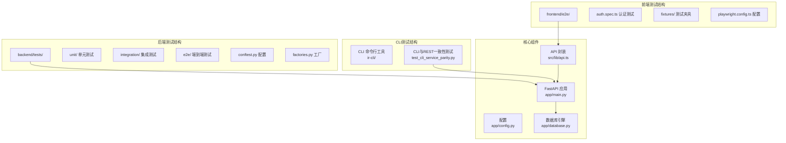
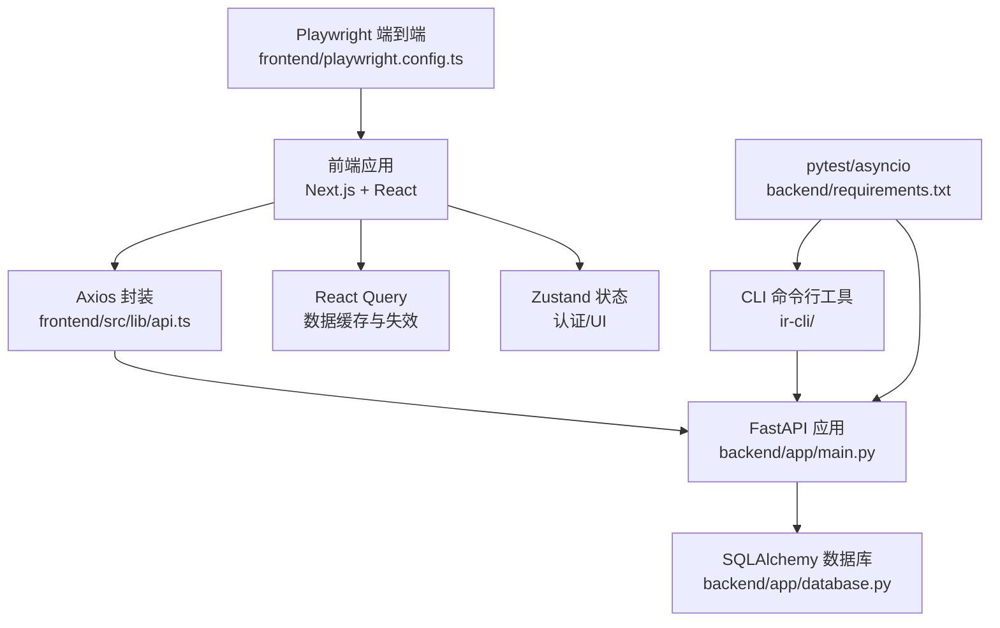
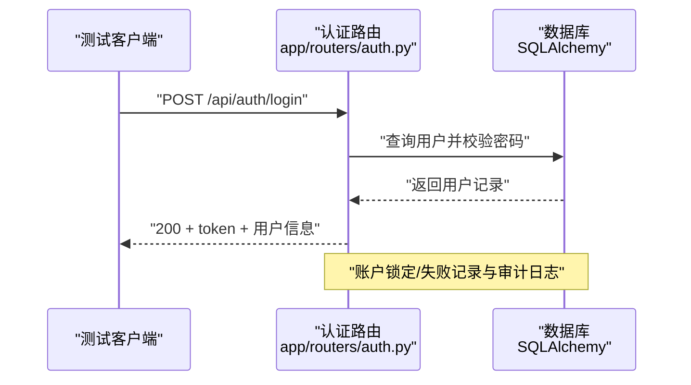
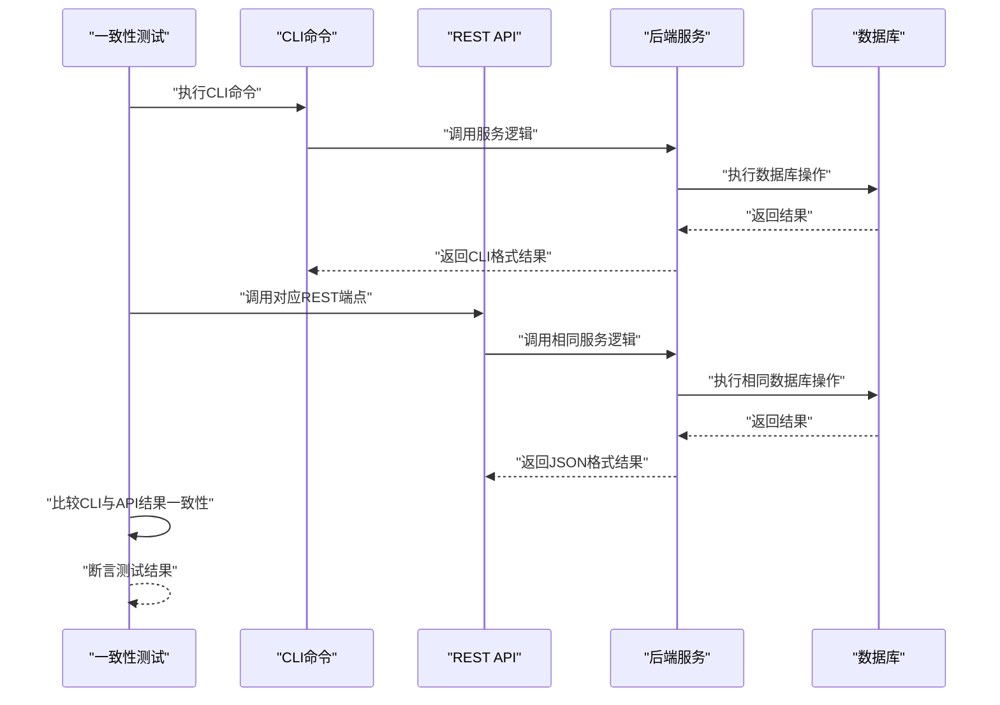
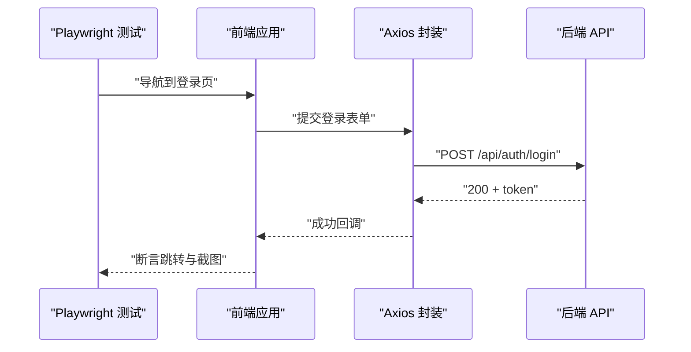
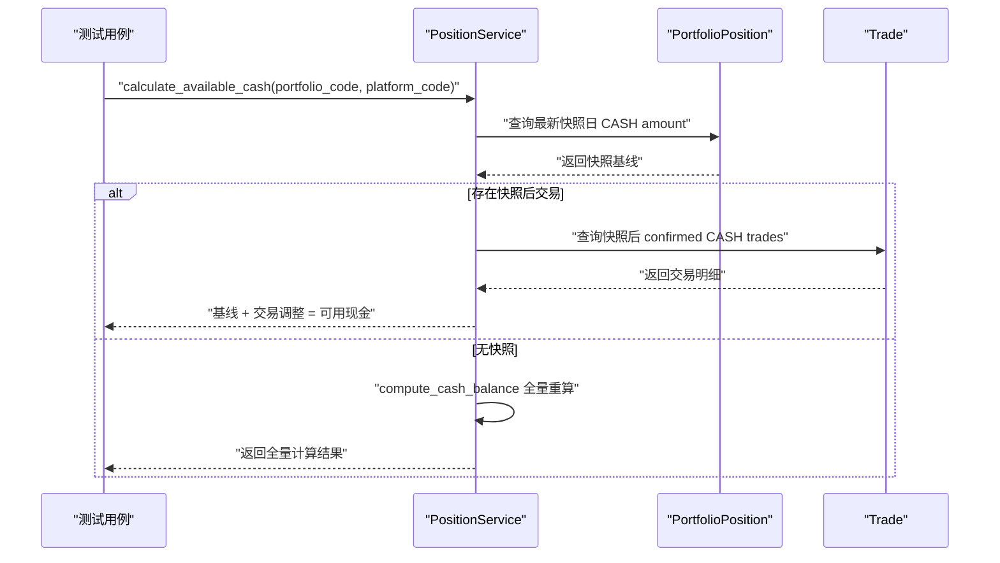
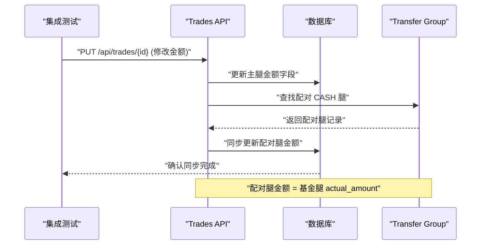
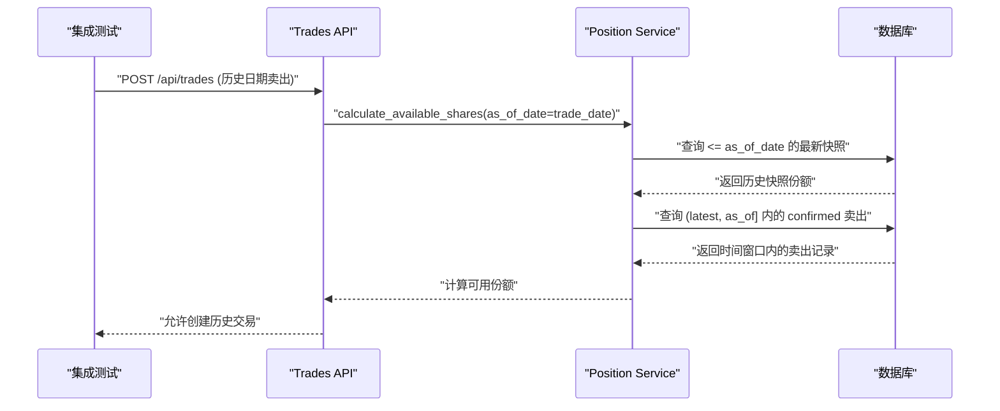
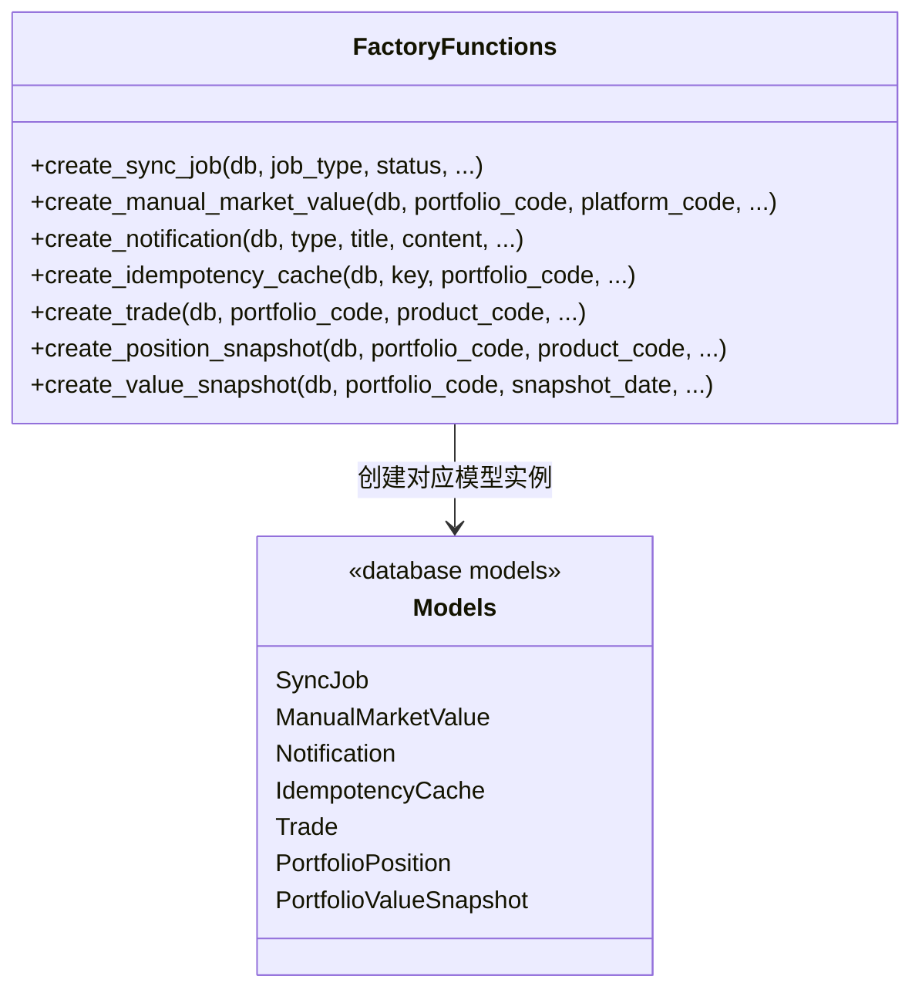
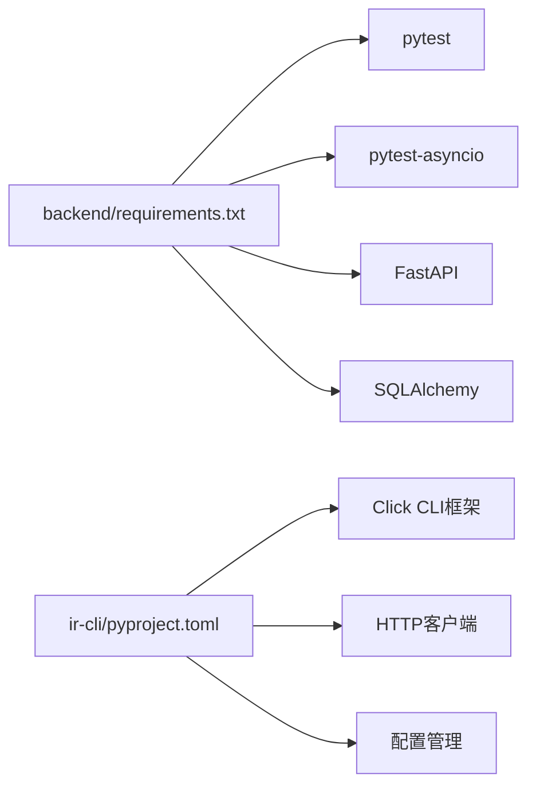

# 测试策略

<cite>
**本文引用的文件**
- [.github/workflows/ci.yml](file://.github/workflows/ci.yml)
- [backend/requirements.txt](file://backend/requirements.txt)
- [package.json](file://package.json)
- [backend/app/main.py](file://backend/app/main.py)
- [backend/app/config.py](file://backend/app/config.py)
- [backend/app/database.py](file://backend/app/database.py)
- [backend/app/routers/auth.py](file://backend/app/routers/auth.py)
- [backend/app/models/portfolio.py](file://backend/app/models/portfolio.py)
- [backend/app/models/platform.py](file://backend/app/models/platform.py)
- [backend/app/models/trading_calendar.py](file://backend/app/models/trading_calendar.py)
- [backend/app/models/sync_job.py](file://backend/app/models/sync_job.py)
- [backend/app/models/manual_market_value.py](file://backend/app/models/manual_market_value.py)
- [backend/app/models/notification.py](file://backend/app/models/notification.py)
- [backend/app/models/idempotency_cache.py](file://backend/app/models/idempotency_cache.py)
- [frontend/package.json](file://frontend/package.json)
- [frontend/src/lib/api.ts](file://frontend/src/lib/api.ts)
- [frontend/src/hooks/useAuth.ts](file://frontend/src/hooks/useAuth.ts)
- [frontend/playwright.config.ts](file://frontend/playwright.config.ts)
- [frontend/e2e/auth.spec.ts](file://frontend/e2e/auth.spec.ts)
- [frontend/e2e/fixtures/auth.setup.ts](file://frontend/e2e/fixtures/auth.setup.ts)
- [backend/tests/conftest.py](file://backend/tests/conftest.py)
- [backend/tests/factories.py](file://backend/tests/factories.py)
- [backend/tests/unit/test_security.py](file://backend/tests/unit/test_security.py)
- [backend/tests/integration/test_auth.py](file://backend/tests/integration/test_auth.py)
- [backend/tests/integration/test_cli_service_parity.py](file://backend/tests/integration/test_cli_service_parity.py)
- [backend/tests/e2e/test_business_flows.py](file://backend/tests/e2e/test_business_flows.py)
- [backend/tests/unit/test_sync_job.py](file://backend/tests/unit/test_sync_job.py)
- [backend/tests/integration/test_sync_jobs_api.py](file://backend/tests/integration/test_sync_jobs_api.py)
- [backend/tests/unit/test_position_service.py](file://backend/tests/unit/test_position_service.py)
- [backend/tests/integration/test_trades.py](file://backend/tests/integration/test_trades.py)
- [backend/tests/integration/test_positions.py](file://backend/tests/integration/test_positions.py)
- [backend/app/services/position_service.py](file://backend/app/services/position_service.py)
- [backend/app/routers/positions.py](file://backend/app/routers/positions.py)
- [backend/app/routers/trades.py](file://backend/app/routers/trades.py)
- [backend/app/routers/subscriptions.py](file://backend/app/routers/subscriptions.py)
</cite>

## 更新摘要
**所做更改**
- CI流程大幅简化，从233行精简至13行，专注于后端测试套件
- 移除了前端测试和非必要的测试套件，聚焦于后端单元测试、集成测试和业务流端到端测试
- 更新了测试策略以反映新的CI配置重点，强调后端测试的完整性和可靠性
- 优化了持续集成流程，提高了测试执行效率和资源利用率

## 目录
1. [引言](#引言)
2. [项目结构](#项目结构)
3. [核心组件](#核心组件)
4. [架构总览](#架构总览)
5. [详细组件分析](#详细组件分析)
6. [依赖分析](#依赖分析)
7. [性能考虑](#性能考虑)
8. [故障排查指南](#故障排查指南)
9. [结论](#结论)
10. [附录](#附录)

## 引言
本测试策略文档面向 InvestRing 项目，旨在为后端 API、数据库、异步任务提供系统化的测试实施计划。文档覆盖单元测试、集成测试、端到端测试和性能测试，明确测试框架（pytest）、Mock 使用、测试数据准备、测试环境配置、覆盖率要求、CI 流程与自动化脚本，并补充性能与安全测试指导。

**更新** CI流程已大幅简化，从233行精简至13行，专注于后端测试套件。新的测试策略强调后端单元测试、集成测试和业务流端到端测试，移除了前端测试和非必要的测试套件，以提高测试执行效率和资源利用率。

## 项目结构
项目采用前后端分离架构：
- 后端基于 FastAPI，提供 REST API，使用 SQLAlchemy 进行数据库访问，支持异步任务与定时任务。
- 前端基于 Next.js + React，使用 TanStack React Query 管理数据请求，Zustand 管理轻量状态，Axios 封装 API 调用与统一错误处理。
- CLI 工具提供命令行界面，与 REST API 保持一致的业务逻辑。
- 测试框架包括 Python 的 pytest 与 Playwright 端到端测试，分别覆盖后端 API、CLI 工具与前端交互。

**图表来源**
- [backend/tests/conftest.py](file://backend/tests/conftest.py)
- [backend/tests/factories.py](file://backend/tests/factories.py)
- [backend/tests/integration/test_cli_service_parity.py](file://backend/tests/integration/test_cli_service_parity.py)
- [frontend/playwright.config.ts](file://frontend/playwright.config.ts)
- [frontend/e2e/auth.spec.ts](file://frontend/e2e/auth.spec.ts)
- [backend/app/main.py](file://backend/app/main.py)
- [frontend/src/lib/api.ts](file://frontend/src/lib/api.ts)

**章节来源**
- [backend/tests/conftest.py](file://backend/tests/conftest.py)
- [backend/tests/factories.py](file://backend/tests/factories.py)
- [backend/tests/integration/test_cli_service_parity.py](file://backend/tests/integration/test_cli_service_parity.py)
- [frontend/playwright.config.ts](file://frontend/playwright.config.ts)
- [frontend/e2e/auth.spec.ts](file://frontend/e2e/auth.spec.ts)
- [backend/app/main.py](file://backend/app/main.py)
- [frontend/src/lib/api.ts](file://frontend/src/lib/api.ts)

## 核心组件
- 后端应用与路由
  - 应用入口与中间件、CORS 配置、路由注册集中在应用主文件中。
  - 认证路由提供登录、登出、改密等接口，包含安全与审计日志记录。
- 数据库层
  - 使用 SQLAlchemy 建模，提供连接池、SQLite 特定配置与会话生命周期管理。
- 前端 API 层
  - Axios 实例封装，请求/响应拦截器统一处理鉴权与 401 跳转。
  - 针对各模块的 API 方法封装，便于测试与业务调用。
- 前端状态与交互
  - 使用 Zustand 管理认证与 UI 状态，React Query 管理数据缓存与失效策略。
  - 认证相关 Hooks 提供登录、登出、当前用户、角色校验等能力。
- CLI 工具层
  - 提供命令行界面，复用后端服务逻辑，确保与 REST API 行为一致。

**章节来源**
- [backend/app/main.py](file://backend/app/main.py)
- [backend/app/routers/auth.py](file://backend/app/routers/auth.py)
- [backend/app/database.py](file://backend/app/database.py)
- [frontend/src/lib/api.ts](file://frontend/src/lib/api.ts)
- [frontend/src/hooks/useAuth.ts](file://frontend/src/hooks/useAuth.ts)

## 架构总览
下图展示测试策略与系统组件的交互关系：后端 API 接收来自前端的请求；前端通过 API 封装与拦截器进行统一处理；CLI 工具直接调用后端服务；测试框架分别从后端、CLI 与前端三个维度验证功能与交互。

**图表来源**
- [frontend/src/lib/api.ts](file://frontend/src/lib/api.ts)
- [frontend/src/hooks/useAuth.ts](file://frontend/src/hooks/useAuth.ts)
- [backend/app/main.py](file://backend/app/main.py)
- [backend/app/database.py](file://backend/app/database.py)
- [backend/requirements.txt](file://backend/requirements.txt)
- [frontend/playwright.config.ts](file://frontend/playwright.config.ts)

## 详细组件分析

### 后端测试框架与最佳实践
- 测试框架
  - 使用 pytest 与 pytest-asyncio 支持同步与异步测试，适合 FastAPI 异步路由与数据库事务场景。
  - 测试套件结构清晰：unit/（单元测试）、integration/（集成测试）、e2e/（端到端测试）。
- 认证接口测试要点
  - 登录：构造有效/无效凭据，断言返回 token、用户信息与过期时间；验证 401/403 场景与账户锁定逻辑。
  - 登出：携带有效 token 登出，断言登出日志与黑名单生效。
  - 改密：区分 admin 与 viewer 权限，校验旧密码必填与权限限制。
- 测试配置与工厂
  - 使用 conftest.py 配置全局测试夹具，包括数据库连接、测试会话和清理机制。
  - 通过 factories.py 生成标准化测试数据，确保测试隔离性和可重复性。

**图表来源**
- [backend/app/routers/auth.py](file://backend/app/routers/auth.py)
- [backend/tests/conftest.py](file://backend/tests/conftest.py)

**章节来源**
- [backend/requirements.txt](file://backend/requirements.txt)
- [backend/app/routers/auth.py](file://backend/app/routers/auth.py)
- [backend/tests/conftest.py](file://backend/tests/conftest.py)
- [backend/tests/factories.py](file://backend/tests/factories.py)

### CLI与REST端点一致性集成测试
- 核心测试类与方法
  - `TestCLIServiceParity`：基础一致性测试类，验证CLI命令与REST API返回相同结果
  - `test_portfolio_operations`：投资组合操作一致性测试，涵盖创建、读取、更新、删除操作
  - `test_investor_operations`：投资人操作一致性测试，验证CRUD操作的等价性
  - `test_product_operations`：产品操作一致性测试，确保数据操作行为一致
  - `test_platform_operations`：平台操作一致性测试，验证平台管理的等价性
  - `test_subscription_operations`：订阅操作一致性测试，涵盖申购赎回流程
  - `test_trade_operations`：交易操作一致性测试，验证交易记录的等价性
  - `test_position_operations`：持仓操作一致性测试，确保持仓数据的准确性
  - `test_snapshot_operations`：快照操作一致性测试，验证净值快照的等价性
  - `test_share_change_events`：份额变动事件一致性测试，确保事件处理的正确性
  - `test_sync_job_operations`：同步任务操作一致性测试，验证任务管理的等价性
  - `test_cash_transfer_operations`：资金调拨操作一致性测试，确保转账流程的准确性

- 关键测试场景
  - **数据一致性**：CLI命令与REST API返回的数据结构完全一致
  - **业务逻辑等价性**：相同的输入产生相同的业务结果
  - **错误处理一致性**：异常情况下的错误消息和处理逻辑保持一致
  - **状态转换一致性**：资源状态在不同客户端接口下保持一致
  - **权限控制一致性**：访问控制逻辑在CLI和REST接口中保持一致

**图表来源**
- [backend/tests/integration/test_cli_service_parity.py](file://backend/tests/integration/test_cli_service_parity.py)
- [backend/app/main.py](file://backend/app/main.py)

**章节来源**
- [backend/tests/integration/test_cli_service_parity.py](file://backend/tests/integration/test_cli_service_parity.py)

### 前端 Playwright 端到端测试框架
- 测试框架配置
  - 使用 Playwright TypeScript 配置文件，支持多设备测试（桌面端、移动端）。
  - 配置测试目录、项目配置、存储状态管理和浏览器设置。
- 认证测试实现
  - 通过 auth.setup.ts 创建认证夹具，管理管理员用户状态。
  - 使用 storageState 配置持久化认证状态，提高测试效率。
- 测试用例编写
  - auth.spec.ts 覆盖登录页面加载、有效/无效凭据登录、登出等功能。
  - 支持交互式 UI 模式和调试模式，便于开发和维护。
- 测试夹具管理
  - 使用 fixtures 目录组织测试夹具，实现测试数据的标准化准备。

**图表来源**
- [frontend/e2e/auth.spec.ts](file://frontend/e2e/auth.spec.ts)
- [frontend/e2e/fixtures/auth.setup.ts](file://frontend/e2e/fixtures/auth.setup.ts)
- [frontend/playwright.config.ts](file://frontend/playwright.config.ts)

**章节来源**
- [frontend/playwright.config.ts](file://frontend/playwright.config.ts)
- [frontend/e2e/auth.spec.ts](file://frontend/e2e/auth.spec.ts)
- [frontend/e2e/fixtures/auth.setup.ts](file://frontend/e2e/fixtures/auth.setup.ts)

### 数据库测试与异步测试最佳实践
- 连接池与会话
  - 使用连接池参数提升并发与稳定性；SQLite 使用 WAL 模式与 PRAGMA 配置优化。
- 异步测试
  - 利用 pytest-asyncio 标记与事件循环，确保异步路由与后台任务可被正确测试。
- 测试隔离
  - 使用独立测试数据库或内存数据库（如 SQLite），在测试前后清理数据，避免跨用例污染。
- Mock 数据与工厂
  - 通过工厂模式生成测试数据，减少真实数据库依赖；对第三方服务（如行情）使用 Mock。

**图表来源**
- [backend/app/database.py](file://backend/app/database.py)
- [backend/tests/conftest.py](file://backend/tests/conftest.py)

**章节来源**
- [backend/app/database.py](file://backend/app/database.py)
- [backend/tests/conftest.py](file://backend/tests/conftest.py)

### 前端组件测试、状态管理与用户交互
- 组件测试
  - 使用 React Testing Library 或 Jest + React Test Renderer 测试组件渲染与交互；对受保护路由与权限 Hook 进行单元测试。
- 状态管理测试
  - 针对 Zustand Store 的登录、登出、用户信息更新进行单元测试；模拟 API 返回与副作用。
- 用户交互测试
  - 使用 Playwright 进行端到端测试，覆盖登录页加载、有效/无效凭据登录、登出、控制台错误检查等场景。
- API 封装与拦截器
  - 测试 Axios 拦截器在 401 时的本地 token 清理与跳转逻辑；对错误处理函数进行断言。

**章节来源**
- [frontend/src/lib/api.ts](file://frontend/src/lib/api.ts)
- [frontend/src/hooks/useAuth.ts](file://frontend/src/hooks/useAuth.ts)

### 测试数据准备、Mock 对象与环境配置
- 测试数据准备
  - 使用 SQLAlchemy ORM 插入最小化测试数据，确保组合、平台、交易日等前置条件满足。
  - 对于外部依赖（如行情数据），使用 Mock 对象替换真实调用，保证测试稳定与可重复。
- Mock 对象
  - 使用 unittest.mock 或 pytest-mock，在认证与业务接口测试中替换数据库查询与第三方服务。
- 环境配置
  - 后端通过 pydantic-settings 读取 .env 配置，测试时可注入测试专用数据库 URL 与调试开关。
  - 前端通过 NEXT_PUBLIC_API_URL 指向测试后端地址，Axios 拦截器自动附加 Bearer Token。

**章节来源**
- [backend/app/config.py](file://backend/app/config.py)
- [backend/tests/factories.py](file://backend/tests/factories.py)
- [frontend/src/lib/api.ts](file://frontend/src/lib/api.ts)

### 增量快照基线计算单元测试
- 核心测试类与方法
  - `TestCalculateAvailableCashWithOverride`：测试基于快照表的可用现金计算，涵盖基线读取、快照后交易、待处理卖出等复杂场景
  - `TestCalculateAvailableCashAsOfDate`：测试 as_of_date 截止计算逻辑，确保历史日期查询的准确性
  - `TestGetCashValue`：测试 get_cash_value 函数的现金获取逻辑，包括无覆盖、有覆盖、日期不匹配等场景

- 关键测试场景
  - **快照基线读取**：当存在最新快照时，直接读取 portfolio_position 快照表中的 CASH amount
  - **manual 覆盖继承**：历史 manual_market_value 覆盖已 baked in 快照，实时计算自然继承该值
  - **快照后交易影响**：基线加上快照后的 confirmed trades 和 pending sells 的预留
  - **无快照降级**：当没有快照时，降级为 compute_cash_balance 全量流水计算
  - **as_of_date 截止**：传入历史日期时，基线取 <= as_of_date 的最新快照日

**图表来源**
- [backend/tests/unit/test_position_service.py](file://backend/tests/unit/test_position_service.py)
- [backend/app/services/position_service.py](file://backend/app/services/position_service.py)

**章节来源**
- [backend/tests/unit/test_position_service.py](file://backend/tests/unit/test_position_service.py)
- [backend/app/services/position_service.py](file://backend/app/services/position_service.py)

### 配对CASH腿同步集成测试
- 核心测试类与方法
  - `TestUpdateDeletePairedSync`：测试 PUT/DELETE 操作时配对 CASH 腿的状态同步
  - `TestUpdateAmountSyncCashLeg`：测试金额字段变动时配对 CASH 腿金额的同步更新
  - `test_update_trade_date_syncs_cash_leg`：验证 confirm_date 修改时配对腿的同步
  - `test_delete_trade_cascades_cash_leg`：验证删除主腿时级联删除配对 CASH 腿

- 关键测试场景
  - **金额字段同步**：修改基金腿 actual_amount/amount/fee/shares/price 后，配对 CASH 腿金额同步更新
  - **状态同步**：修改 confirm_date/trade_date/status 时，配对 CASH 腿相应字段同步
  - **级联删除**：删除主腿时，同一 transfer_group 的配对 CASH 腿被级联删除
  - **数据一致性**：确保配对腿的金额计算逻辑正确（买入=支出，卖出=收入）

**图表来源**
- [backend/tests/integration/test_trades.py](file://backend/tests/integration/test_trades.py)
- [backend/app/routers/trades.py](file://backend/app/routers/trades.py)

**章节来源**
- [backend/tests/integration/test_trades.py](file://backend/tests/integration/test_trades.py)
- [backend/app/routers/trades.py](file://backend/app/routers/trades.py)

### as_of_date验证场景测试
- 核心测试类与方法
  - `TestAsOfDateSellValidation`：测试补录历史卖出交易时的份额验证逻辑
  - `test_backfill_sell_not_blocked_by_later_confirmed`：验证后续 confirmed 卖出不应计入历史日期的扣减

- 关键测试场景
  - **历史日期基准**：as_of_date 传入历史日时，基线取 <= as_of_date 的最新快照日
  - **时间窗口过滤**：confirmed 卖出仅计 confirm_date 在 (latest_date, as_of_date] 范围内的
  - **pending 不受影响**：pending 交易不受 as_of_date 截止影响，始终计提预留
  - **补录场景验证**：补录历史日卖出时，后续 confirmed 卖出不应阻止交易创建

**图表来源**
- [backend/tests/integration/test_trades.py](file://backend/tests/integration/test_trades.py)
- [backend/app/services/position_service.py](file://backend/app/services/position_service.py)

**章节来源**
- [backend/tests/integration/test_trades.py](file://backend/tests/integration/test_trades.py)
- [backend/app/services/position_service.py](file://backend/app/services/position_service.py)

### 订阅赎回as_of_date接入测试
- 核心测试场景
  - **赎回份额验证**：赎回申请时使用 apply_date 作为 as_of_date 进行份额验证
  - **历史赎回补录**：补录历史赎回申请时，后续 confirmed 赎回不应影响历史可用性
  - **时间窗口一致性**：与交易验证保持一致的时间窗口计算逻辑

**章节来源**
- [backend/app/routers/subscriptions.py](file://backend/app/routers/subscriptions.py)
- [backend/app/services/position_service.py](file://backend/app/services/position_service.py)

### 工厂函数体系与测试数据管理
- 核心业务实体工厂函数
  - `create_sync_job()`：同步任务记录工厂，支持 job_type、status、triggered_by、params 等完整字段
  - `create_manual_market_value()`：手动市值覆盖记录工厂，支持 portfolio_code、platform_code、product_code、date 等字段
  - `create_notification()`：通知记录工厂，支持 type、title、content、level、recipient、channel、status 等字段
  - `create_idempotency_cache()`：幂等性缓存记录工厂，支持 key、portfolio_code、request_hash、response、expires_at 等字段

- 增强的现有工厂函数
  - `create_trade()`：增强 confirm_date、actual_amount、transfer_group、notes 等字段支持
  - `create_position_snapshot()`：增强 frozen_shares、frozen_amount、asset_type 等字段支持
  - `create_value_snapshot()`：支持组合市值快照的完整字段创建

- 工厂函数设计原则
  - 所有工厂函数接收 db session 作为第一个参数，并在创建后自动 commit
  - 提供合理的默认值，确保测试数据的完整性
  - 支持可选参数的灵活配置，满足不同测试场景需求
  - 遵循幂等性设计，避免重复创建相同数据

**图表来源**
- [backend/tests/factories.py](file://backend/tests/factories.py)
- [backend/app/models/sync_job.py](file://backend/app/models/sync_job.py)
- [backend/app/models/manual_market_value.py](file://backend/app/models/manual_market_value.py)
- [backend/app/models/notification.py](file://backend/app/models/notification.py)
- [backend/app/models/idempotency_cache.py](file://backend/app/models/idempotency_cache.py)

**章节来源**
- [backend/tests/factories.py](file://backend/tests/factories.py)
- [backend/app/models/sync_job.py](file://backend/app/models/sync_job.py)
- [backend/app/models/manual_market_value.py](file://backend/app/models/manual_market_value.py)
- [backend/app/models/notification.py](file://backend/app/models/notification.py)
- [backend/app/models/idempotency_cache.py](file://backend/app/models/idempotency_cache.py)

### 覆盖率要求、CI 流程与自动化脚本
- 覆盖率要求
  - 后端：函数级覆盖率不低于 80%，关键分支（认证、权限、业务主干）不低于 90%。
  - CLI工具：CLI命令与REST API一致性测试覆盖率不低于 95%，确保不同客户端接口的行为一致性。
- CI 流程
  - 触发条件：push 到 develop/main，或发起 Pull Request。
  - 步骤：安装依赖 → 启动测试数据库 → 运行 pytest → 生成覆盖率报告 → 上传报告。
  - **更新** CI流程已大幅简化，从233行精简至13行，专注于后端测试套件，移除了前端测试和非必要的测试套件。
- 自动化脚本
  - 提供一键运行后端测试的脚本，支持并行执行与失败重试。
  - 在 CI 中集成覆盖率阈值检查，低于阈值则阻断合并。

**更新** CI流程已从233行精简至13行，专注于后端测试套件。新的CI配置移除了前端测试和非必要的测试套件，只保留后端单元测试、集成测试和业务流端到端测试，显著提高了测试执行效率和资源利用率。

**章节来源**
- [.github/workflows/ci.yml](file://.github/workflows/ci.yml)

### 性能测试、安全测试与兼容性测试
- 性能测试
  - 使用 Locust 或自定义压力脚本，针对登录、查询快照、批量调仓等高频接口进行并发与延迟测试。
  - 关注数据库连接池饱和、慢查询与队列积压。
- 安全测试
  - 验证 CORS 配置、Token 黑名单、密码哈希强度、输入参数校验与 SQL 注入防护。
  - 对敏感接口进行权限绕过与越权测试。
- 兼容性测试
  - 后端：不同数据库驱动与 Python 版本的兼容性验证。
  - CLI工具：CLI命令在不同操作系统和环境下的兼容性测试。

## 依赖分析
后端的关键依赖与测试相关性如下：
- 后端
  - FastAPI、SQLAlchemy、pytest、pytest-asyncio、httpx、Pydantic Settings。
- CLI工具
  - Click命令行框架、HTTP客户端库、配置管理工具。

**图表来源**
- [backend/requirements.txt](file://backend/requirements.txt)

**章节来源**
- [backend/requirements.txt](file://backend/requirements.txt)

## 性能考虑
- 后端
  - 合理设置连接池大小与 pre_ping，避免高并发下的连接泄漏。
  - 对热点接口启用缓存（如只读查询），减少数据库压力。
- CLI工具
  - 优化CLI命令的执行效率，避免不必要的网络请求。
  - 实现命令结果的缓存机制，提升重复操作的响应速度。

## 故障排查指南
- 登录失败
  - 检查用户是否存在、密码是否正确、账户是否被锁定；查看登录日志与审计日志。
- API 调用异常
  - 使用详细测试脚本定位前置条件缺失（组合/平台/交易日）与网络超时/连接错误。
- CLI命令不一致
  - 对比CLI命令与REST API的输入输出，检查服务逻辑调用路径的差异。
  - 验证CLI工具的参数解析与REST API的请求体转换逻辑。
- 现金计算问题
  - 检查快照表数据完整性，验证 calculate_available_cash 的基线读取逻辑与时间窗口过滤。
- 配对腿同步问题
  - 检查 transfer_group 关联关系，验证金额字段变动时的同步逻辑。

## 结论
通过分层测试策略（单元、集成、端到端）与完善的工具链（pytest），InvestRing 项目已在原有基础上进一步完善了测试体系。新增的CLI与REST端点一致性集成测试套件确保了不同客户端接口行为的一致性，大幅扩展的持仓服务测试覆盖确保了增量快照基线计算的正确性，新增的配对CASH腿同步测试保障了数据一致性，as_of_date验证场景测试确保了历史交易补录的准确性。最新的CI流程优化将测试重点聚焦于后端测试套件，移除了前端测试和非必要的测试套件，显著提高了测试执行效率和资源利用率。建议持续完善覆盖率与 CI 集成，强化性能与安全测试，确保系统在多环境与多版本下的可靠运行。

## 附录
- 关键模型与前置条件
  - 组合、平台、交易日模型用于业务接口测试的前置条件校验。
  - 新增的同步任务、手动市值覆盖、通知、幂等性缓存模型提供完整的测试数据支持。
- 测试套件结构
  - 后端：unit/（单元测试）、integration/（集成测试）、e2e/（端到端测试）
  - CLI：CLI与REST端点一致性测试套件，包含12个核心业务模块的一致性验证
- 工厂函数清单
  - 投资人、组合、平台、资产分类、产品、价格记录、交易日历、申购/赎回、调仓交易、持仓快照、组合市值快照、投资人持仓快照、同步任务、手动市值覆盖、通知、幂等性缓存、份额变动事件等完整工厂函数支持。
- 新增测试覆盖
  - CLI与REST端点一致性测试：12个测试用例验证不同客户端接口行为的一致性
  - 增量快照基线计算单元测试：覆盖 calculate_available_cash 的核心逻辑与边界情况
  - 配对CASH腿同步集成测试：验证金额字段变动时的数据一致性
  - as_of_date验证场景测试：确保历史交易补录的正确性
  - 订阅赎回as_of_date接入测试：验证赎回校验的时间窗口逻辑

**章节来源**
- [backend/app/models/portfolio.py](file://backend/app/models/portfolio.py)
- [backend/app/models/platform.py](file://backend/app/models/platform.py)
- [backend/app/models/trading_calendar.py](file://backend/app/models/trading_calendar.py)
- [backend/app/models/sync_job.py](file://backend/app/models/sync_job.py)
- [backend/app/models/manual_market_value.py](file://backend/app/models/manual_market_value.py)
- [backend/app/models/notification.py](file://backend/app/models/notification.py)
- [backend/app/models/idempotency_cache.py](file://backend/app/models/idempotency_cache.py)
- [backend/tests/unit/test_security.py](file://backend/tests/unit/test_security.py)
- [backend/tests/integration/test_auth.py](file://backend/tests/integration/test_auth.py)
- [backend/tests/integration/test_cli_service_parity.py](file://backend/tests/integration/test_cli_service_parity.py)
- [backend/tests/e2e/test_business_flows.py](file://backend/tests/e2e/test_business_flows.py)
- [backend/tests/factories.py](file://backend/tests/factories.py)
- [backend/tests/unit/test_position_service.py](file://backend/tests/unit/test_position_service.py)
- [backend/tests/integration/test_trades.py](file://backend/tests/integration/test_trades.py)
- [backend/tests/integration/test_positions.py](file://backend/tests/integration/test_positions.py)