# 测试策略

<cite>
**本文引用的文件**
- [.github/workflows/ci.yml](file://.github/workflows/ci.yml)
- [backend/requirements.txt](file://backend/requirements.txt)
- [package.json](file://package.json)
- [backend/app/main.py](file://backend/app/main.py)
- [backend/app/config.py](file://backend/app/config.py)
- [backend/app/database.py](file://backend/app/database.py)
- [backend/app/routers/auth.py](file://backend/app/routers/auth.py)
- [backend/app/models/portfolio.py](file://backend/app/models/portfolio.py)
- [backend/app/models/platform.py](file://backend/app/models/platform.py)
- [backend/app/models/trading_calendar.py](file://backend/app/models/trading_calendar.py)
- [backend/app/models/sync_job.py](file://backend/app/models/sync_job.py)
- [backend/app/models/manual_market_value.py](file://backend/app/models/manual_market_value.py)
- [backend/app/models/notification.py](file://backend/app/models/notification.py)
- [backend/app/models/idempotency_cache.py](file://backend/app/models/idempotency_cache.py)
- [frontend/package.json](file://frontend/package.json)
- [frontend/src/lib/api.ts](file://frontend/src/lib/api.ts)
- [frontend/src/hooks/useAuth.ts](file://frontend/src/hooks/useAuth.ts)
- [frontend/playwright.config.ts](file://frontend/playwright.config.ts)
- [frontend/e2e/auth.spec.ts](file://frontend/e2e/auth.spec.ts)
- [frontend/e2e/fixtures/auth.setup.ts](file://frontend/e2e/fixtures/auth.setup.ts)
- [backend/tests/conftest.py](file://backend/tests/conftest.py)
- [backend/tests/factories.py](file://backend/tests/factories.py)
- [backend/tests/unit/test_security.py](file://backend/tests/unit/test_security.py)
- [backend/tests/integration/test_auth.py](file://backend/tests/integration/test_auth.py)
- [backend/tests/integration/test_cli_service_parity.py](file://backend/tests/integration/test_cli_service_parity.py)
- [backend/tests/integration/test_market_data_coverage.py](file://backend/tests/integration/test_market_data_coverage.py)
- [backend/tests/e2e/test_business_flows.py](file://backend/tests/e2e/test_business_flows.py)
- [backend/tests/unit/test_sync_job.py](file://backend/tests/unit/test_sync_job.py)
- [backend/tests/integration/test_sync_jobs_api.py](file://backend/tests/integration/test_sync_jobs_api.py)
- [backend/tests/unit/test_position_service.py](file://backend/tests/unit/test_position_service.py)
- [backend/tests/integration/test_trades.py](file://backend/tests/integration/test_trades.py)
- [backend/tests/integration/test_positions.py](file://backend/tests/integration/test_positions.py)
- [backend/tests/unit/test_service_no_commit.py](file://backend/tests/unit/test_service_no_commit.py)
- [backend/tests/integration/test_market_data_tx.py](file://backend/tests/integration/test_market_data_tx.py)
- [backend/tests/unit/test_snapshot_service.py](file://backend/tests/unit/test_snapshot_service.py)
- [ir-cli/tests/test_schema.py](file://ir-cli/tests/test_schema.py)
- [ir-cli/ir_cli/schema.py](file://ir-cli/ir_cli/schema.py)
- [ir-cli/ir_cli/response_fields.py](file://ir-cli/ir_cli/response_fields.py)
- [backend/app/services/position_service.py](file://backend/app/services/position_service.py)
- [backend/app/routers/positions.py](file://backend/app/routers/positions.py)
- [backend/app/routers/trades.py](file://backend/app/routers/trades.py)
- [backend/app/routers/subscriptions.py](file://backend/app/routers/subscriptions.py)
- [backend/app/services/market_data_service.py](file://backend/app/services/market_data_service.py)
- [backend/app/services/snapshot_service.py](file://backend/app/services/snapshot_service.py)
- [backend/tests/integration/test_shares_precision.py](file://backend/tests/integration/test_shares_precision.py)
- [backend/tests/unit/test_quantize.py](file://backend/tests/unit/test_quantize.py)
- [backend/tests/integration/test_snapshot_negative_cash.py](file://backend/tests/integration/test_snapshot_negative_cash.py)
- [backend/tests/integration/test_trade_cash_check.py](file://backend/tests/integration/test_trade_cash_check.py)
- [ir-cli/tests/test_client_errors.py](file://ir-cli/tests/test_client_errors.py)
</cite>

## 更新摘要
**所做更改**
- 新增全面的负现金场景集成测试（test_snapshot_negative_cash.py，241行），确保投资组合在负现金状态下的数据一致性
- 新增交易现金验证逻辑测试（test_trade_cash_check.py，333行），覆盖买入、卖出、调拨等交易的现金余额验证
- 新增CLI错误处理场景测试（test_client_errors.py，257行），确保命令行工具的错误处理和用户反馈机制
- 增强多数据库支持，修复SQLite特定行为在集成测试中的兼容性问题
- 优化CI配置以支持MySQL、SQLite和PostgreSQL的跨数据库测试

## 目录
1. [引言](#引言)
2. [项目结构](#项目结构)
3. [核心组件](#核心组件)
4. [架构总览](#架构总览)
5. [详细组件分析](#详细组件分析)
6. [依赖分析](#依赖分析)
7. [性能考虑](#性能考虑)
8. [故障排查指南](#故障排查指南)
9. [结论](#结论)
10. [附录](#附录)

## 引言
本测试策略文档面向 InvestRing 项目，旨在为后端 API、数据库、异步任务提供系统化的测试实施计划。文档覆盖单元测试、集成测试、端到端测试和性能测试，明确测试框架（pytest）、Mock 使用、测试数据准备、测试环境配置、覆盖率要求、CI 流程与自动化脚本，并补充性能与安全测试指导。

**更新** 新增了全面的负现金场景测试、交易现金验证逻辑测试和CLI错误处理测试，显著增强了系统的健壮性和错误处理能力。这些新增的测试套件确保了投资组合在极端情况下的数据一致性，交易操作的现金余额准确性，以及命令行工具的友好错误提示。同时，多数据库支持的增强确保了测试套件在多种数据库后端（SQLite、MySQL、PostgreSQL）上的一致性和稳定性。

## 项目结构
项目采用前后端分离架构：
- 后端基于 FastAPI，提供 REST API，使用 SQLAlchemy 进行数据库访问，支持异步任务与定时任务。
- 前端基于 Next.js + React，使用 TanStack React Query 管理数据请求，Zustand 管理轻量状态，Axios 封装 API 调用与统一错误处理。
- CLI 工具提供命令行界面，与 REST API 保持一致的业务逻辑，新增Schema功能测试确保数据格式一致性。
- 测试框架包括 Python 的 pytest 与 Playwright 端到端测试，分别覆盖后端 API、CLI 工具与前端交互。

```mermaid
graph TB
subgraph "后端测试结构"
A_tests["backend/tests/"]
A_unit["unit/ 单元测试"]
A_int["integration/ 集成测试"]
A_e2e["e2e/ 端到端测试"]
A_conftest["conftest.py 配置"]
A_factories["factories.py 工厂"]
A_coverage["test_market_data_coverage.py 覆盖率测试"]
A_trades["test_trades.py 交易测试<br/>226行"]
A_precision["test_shares_precision.py 份额精度测试<br/>291行"]
A_quantize["test_quantize.py 量化测试<br/>64行"]
A_nocommit["test_service_no_commit.py 提交验证<br/>37行"]
A_negative_cash["test_snapshot_negative_cash.py 负现金场景测试<br/>241行"]
A_cash_check["test_trade_cash_check.py 现金验证测试<br/>333行"]
end
subgraph "CLI测试结构"
CLI_tests["ir-cli/tests/"]
CLI_schema["test_schema.py Schema测试"]
CLI_errors["test_client_errors.py 错误处理测试<br/>257行"]
CLI_test_suite["CLI与REST一致性测试<br/>test_cli_service_parity.py"]
end
subgraph "前端测试结构"
F_tests["frontend/e2e/"]
F_auth["auth.spec.ts 认证测试"]
F_fixtures["fixtures/ 测试夹具"]
F_config["playwright.config.ts 配置"]
end
subgraph "核心组件"
A_main["FastAPI 应用<br/>app/main.py"]
A_cfg["配置<br/>app/config.py"]
A_db["数据库引擎<br/>app/database.py"]
A_api["API 封装<br/>src/lib/api.ts"]
A_schema["CLI Schema模块<br/>ir_cli/schema.py"]
end
A_tests --> A_main
F_tests --> A_api
CLI_test_suite --> A_main
CLI_schema --> A_schema
A_main --> A_db
A_api --> A_main
A_coverage --> A_main
A_trades --> A_main
A_precision --> A_main
A_quantize --> A_main
A_nocommit --> A_main
A_negative_cash --> A_main
A_cash_check --> A_main
CLI_errors --> A_main
```

**图表来源**
- [backend/tests/conftest.py](file://backend/tests/conftest.py)
- [backend/tests/factories.py](file://backend/tests/factories.py)
- [backend/tests/integration/test_cli_service_parity.py](file://backend/tests/integration/test_cli_service_parity.py)
- [backend/tests/integration/test_market_data_coverage.py](file://backend/tests/integration/test_market_data_coverage.py)
- [backend/tests/integration/test_trades.py](file://backend/tests/integration/test_trades.py)
- [backend/tests/integration/test_shares_precision.py](file://backend/tests/integration/test_shares_precision.py)
- [backend/tests/unit/test_quantize.py](file://backend/tests/unit/test_quantize.py)
- [backend/tests/unit/test_service_no_commit.py](file://backend/tests/unit/test_service_no_commit.py)
- [backend/tests/integration/test_snapshot_negative_cash.py](file://backend/tests/integration/test_snapshot_negative_cash.py)
- [backend/tests/integration/test_trade_cash_check.py](file://backend/tests/integration/test_trade_cash_check.py)
- [ir-cli/tests/test_client_errors.py](file://ir-cli/tests/test_client_errors.py)
- [ir-cli/tests/test_schema.py](file://ir-cli/tests/test_schema.py)
- [ir-cli/ir_cli/schema.py](file://ir-cli/ir_cli/schema.py)
- [frontend/playwright.config.ts](file://frontend/playwright.config.ts)
- [frontend/e2e/auth.spec.ts](file://frontend/e2e/auth.spec.ts)
- [backend/app/main.py](file://backend/app/main.py)
- [frontend/src/lib/api.ts](file://frontend/src/lib/api.ts)

**章节来源**
- [backend/tests/conftest.py](file://backend/tests/conftest.py)
- [backend/tests/factories.py](file://backend/tests/factories.py)
- [backend/tests/integration/test_cli_service_parity.py](file://backend/tests/integration/test_cli_service_parity.py)
- [backend/tests/integration/test_market_data_coverage.py](file://backend/tests/integration/test_market_data_coverage.py)
- [backend/tests/integration/test_trades.py](file://backend/tests/integration/test_trades.py)
- [backend/tests/integration/test_shares_precision.py](file://backend/tests/integration/test_shares_precision.py)
- [backend/tests/unit/test_quantize.py](file://backend/tests/unit/test_quantize.py)
- [backend/tests/unit/test_service_no_commit.py](file://backend/tests/unit/test_service_no_commit.py)
- [backend/tests/integration/test_snapshot_negative_cash.py](file://backend/tests/integration/test_snapshot_negative_cash.py)
- [backend/tests/integration/test_trade_cash_check.py](file://backend/tests/integration/test_trade_cash_check.py)
- [ir-cli/tests/test_client_errors.py](file://ir-cli/tests/test_client_errors.py)
- [ir-cli/tests/test_schema.py](file://ir-cli/tests/test_schema.py)
- [ir-cli/ir_cli/schema.py](file://ir-cli/ir_cli/schema.py)
- [frontend/playwright.config.ts](file://frontend/playwright.config.ts)
- [frontend/e2e/auth.spec.ts](file://frontend/e2e/auth.spec.ts)
- [backend/app/main.py](file://backend/app/main.py)
- [frontend/src/lib/api.ts](file://frontend/src/lib/api.ts)

## 核心组件
- 后端应用与路由
  - 应用入口与中间件、CORS 配置、路由注册集中在应用主文件中。
  - 认证路由提供登录、登出、改密等接口，包含安全与审计日志记录。
- 数据库层
  - 使用 SQLAlchemy 建模，提供连接池、SQLite 特定配置与会话生命周期管理。
  - **更新** 增强了多数据库支持，包括MySQL和PostgreSQL的兼容性配置，修复了SQLite特定行为的兼容性问题。
- 前端 API 层
  - Axios 实例封装，请求/响应拦截器统一处理鉴权与 401 跳转。
  - 针对各模块的 API 方法封装，便于测试与业务调用。
- 前端状态与交互
  - 使用 Zustand 管理认证与 UI 状态，React Query 管理数据缓存与失效策略。
  - 认证相关 Hooks 提供登录、登出、当前用户、角色校验等能力。
- CLI 工具层
  - 提供命令行界面，复用后端服务逻辑，确保与 REST API 行为一致。
  - **更新** 新增Schema功能模块和错误处理测试，提供响应字段生成、schema索引、契约验证机制和友好的错误提示。

**章节来源**
- [backend/app/main.py](file://backend/app/main.py)
- [backend/app/routers/auth.py](file://backend/app/routers/auth.py)
- [backend/app/database.py](file://backend/app/database.py)
- [frontend/src/lib/api.ts](file://frontend/src/lib/api.ts)
- [frontend/src/hooks/useAuth.ts](file://frontend/src/hooks/useAuth.ts)
- [ir-cli/ir_cli/schema.py](file://ir-cli/ir_cli/schema.py)

## 架构总览
下图展示测试策略与系统组件的交互关系：后端 API 接收来自前端的请求；前端通过 API 封装与拦截器进行统一处理；CLI 工具直接调用后端服务；测试框架分别从后端、CLI 与前端三个维度验证功能与交互。

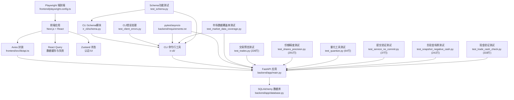
```mermaid
graph TB
FE["前端应用<br/>Next.js + React"]
AX["Axios 封装<br/>frontend/src/lib/api.ts"]
RQ["React Query<br/>数据缓存与失效"]
ZU["Zustand 状态<br/>认证/UI"]
CLI["CLI 命令行工具<br/>ir-cli/"]
SCHEMA["CLI Schema模块<br/>ir_cli/schema.py"]
ERR_HAND["CLI错误处理<br/>test_client_errors.py"]
BK["FastAPI 应用<br/>backend/app/main.py"]
DB["SQLAlchemy 数据库<br/>backend/app/database.py"]
PY["pytest/asyncio<br/>backend/requirements.txt"]
PW["Playwright 端到端<br/>frontend/playwright.config.ts"]
MDC["市场数据覆盖率测试<br/>test_market_data_coverage.py"]
T_SCHEMA["Schema功能测试<br/>test_schema.py"]
T_TRADES["交易预览测试<br/>test_trades.py (226行)"]
T_PRECISION["份额精度测试<br/>test_shares_precision.py (291行)"]
T_QUANTIZE["量化工具测试<br/>test_quantize.py (64行)"]
T_NOCOMMIT["提交验证测试<br/>test_service_no_commit.py (37行)"]
T_NEG_CASH["负现金场景测试<br/>test_snapshot_negative_cash.py (241行)"]
T_CASH_CHECK["现金验证测试<br/>test_trade_cash_check.py (333行)"]
FE --> AX
AX --> BK
FE --> RQ
FE --> ZU
CLI --> BK
SCHEMA --> CLI
ERR_HAND --> CLI
BK --> DB
PY --> BK
PY --> CLI
PW --> FE
MDC --> BK
MDC --> CLI
T_SCHEMA --> SCHEMA
T_SCHEMA --> CLI
T_TRADES --> BK
T_PRECISION --> BK
T_QUANTIZE --> BK
T_NOCOMMIT --> BK
T_NEG_CASH --> BK
T_CASH_CHECK --> BK
```

**图表来源**
- [frontend/src/lib/api.ts](file://frontend/src/lib/api.ts)
- [frontend/src/hooks/useAuth.ts](file://frontend/src/hooks/useAuth.ts)
- [backend/app/main.py](file://backend/app/main.py)
- [backend/app/database.py](file://backend/app/database.py)
- [backend/requirements.txt](file://backend/requirements.txt)
- [frontend/playwright.config.ts](file://frontend/playwright.config.ts)
- [backend/tests/integration/test_market_data_coverage.py](file://backend/tests/integration/test_market_data_coverage.py)
- [ir-cli/tests/test_schema.py](file://ir-cli/tests/test_schema.py)
- [ir-cli/ir_cli/schema.py](file://ir-cli/ir_cli/schema.py)
- [ir-cli/tests/test_client_errors.py](file://ir-cli/tests/test_client_errors.py)
- [backend/tests/integration/test_trades.py](file://backend/tests/integration/test_trades.py)
- [backend/tests/integration/test_shares_precision.py](file://backend/tests/integration/test_shares_precision.py)
- [backend/tests/unit/test_quantize.py](file://backend/tests/unit/test_quantize.py)
- [backend/tests/unit/test_service_no_commit.py](file://backend/tests/unit/test_service_no_commit.py)
- [backend/tests/integration/test_snapshot_negative_cash.py](file://backend/tests/integration/test_snapshot_negative_cash.py)
- [backend/tests/integration/test_trade_cash_check.py](file://backend/tests/integration/test_trade_cash_check.py)

## 详细组件分析

### 后端测试框架与最佳实践
- 测试框架
  - 使用 pytest 与 pytest-asyncio 支持同步与异步测试，适合 FastAPI 异步路由与数据库事务场景。
  - 测试套件结构清晰：unit/（单元测试）、integration/（集成测试）、e2e/（端到端测试）。
- 认证接口测试要点
  - 登录：构造有效/无效凭据，断言返回 token、用户信息与过期时间；验证 401/403 场景与账户锁定逻辑。
  - 登出：携带有效 token 登出，断言登出日志与黑名单生效。
  - 改密：区分 admin 与 viewer 权限，校验旧密码必填与权限限制。
- 测试配置与工厂
  - 使用 conftest.py 配置全局测试夹具，包括数据库连接、测试会话和清理机制。
  - 通过 factories.py 生成标准化测试数据，确保测试隔离性和可重复性。

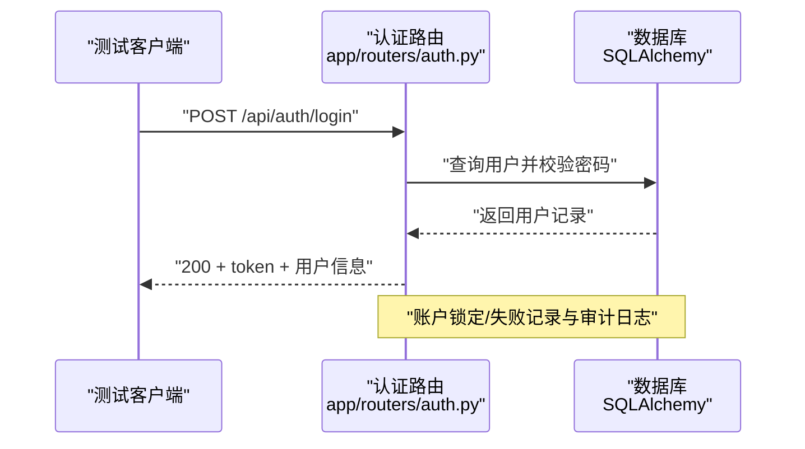
```mermaid
sequenceDiagram
participant C as "测试客户端"
participant A as "认证路由<br/>app/routers/auth.py"
participant D as "数据库<br/>SQLAlchemy"
C->>A : "POST /api/auth/login"
A->>D : "查询用户并校验密码"
D-->>A : "返回用户记录"
A-->>C : "200 + token + 用户信息"
Note over A,D : "账户锁定/失败记录与审计日志"
```

**图表来源**
- [backend/app/routers/auth.py](file://backend/app/routers/auth.py)
- [backend/tests/conftest.py](file://backend/tests/conftest.py)

**章节来源**
- [backend/requirements.txt](file://backend/requirements.txt)
- [backend/app/routers/auth.py](file://backend/app/routers/auth.py)
- [backend/tests/conftest.py](file://backend/tests/conftest.py)
- [backend/tests/factories.py](file://backend/tests/factories.py)

### 基于 Monkeypatching 的服务提交验证测试
- 核心测试类与方法
  - `TestServiceNoCommit`：专门验证服务层不应产生未经授权的数据库提交操作
  - `test_no_commit_on_read_operations`：验证只读操作不会产生数据库提交
  - `test_no_commit_on_validation_only`：验证纯验证操作不会触发数据库提交
  - `test_monkeypatch_session_commit`：使用 monkeypatching 技术拦截并验证 commit 调用

- 关键测试场景
  - **只读操作保护**：所有查询操作应严格避免数据库提交
  - **验证操作隔离**：数据验证逻辑不应产生副作用
  - **Monkeypatching 技术**：通过替换 session.commit 方法验证提交行为
  - **事务边界控制**：确保服务层正确的事务边界管理

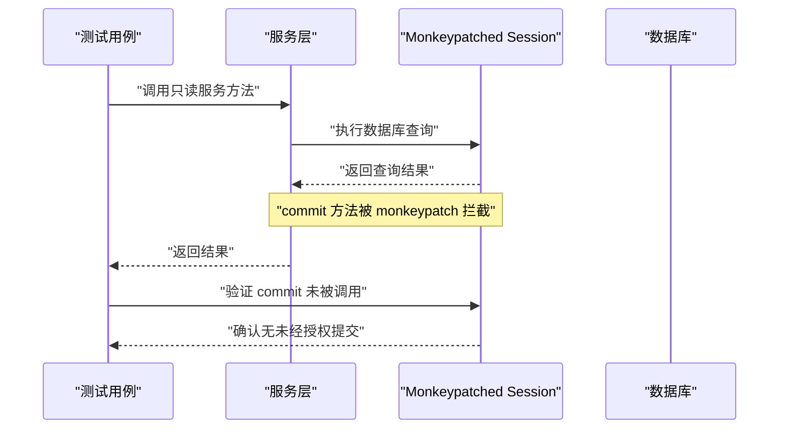
```mermaid
sequenceDiagram
participant T as "测试用例"
participant S as "服务层"
participant M as "Monkeypatched Session"
participant DB as "数据库"
T->>S : "调用只读服务方法"
S->>M : "执行数据库查询"
M-->>S : "返回查询结果"
Note over M,S : "commit 方法被 monkeypatch 拦截"
S-->>T : "返回结果"
T->>M : "验证 commit 未被调用"
M-->>T : "确认无未经授权提交"
```

**图表来源**
- [backend/tests/unit/test_service_no_commit.py](file://backend/tests/unit/test_service_no_commit.py)
- [backend/app/database.py](file://backend/app/database.py)

**章节来源**
- [backend/tests/unit/test_service_no_commit.py](file://backend/tests/unit/test_service_no_commit.py)

### 交易预览集成测试套件
- 核心测试类与方法
  - `TestTradePreview`：交易预览功能的核心测试类，包含完整的交易创建和验证逻辑
  - `test_create_trade_preview`：测试交易预览的创建流程和数据结构验证
  - `test_trade_validation_rules`：验证交易规则检查，包括份额、价格、日期等约束
  - `test_preview_calculation_accuracy`：确保预览计算结果的准确性
  - `test_error_handling_scenarios`：测试各种异常场景的错误处理机制
  - `test_concurrent_trade_previews`：并发交易预览的性能测试

- 关键测试场景
  - **交易预览完整性**：确保交易预览功能的所有参数验证正常工作
  - **计算准确性**：验证交易金额、手续费、税费等计算的精确性
  - **业务规则验证**：确保交易符合业务规则和约束条件
  - **异常处理健壮性**：网络错误、数据格式错误等异常场景的处理
  - **并发处理能力**：多用户同时预览交易的系统稳定性
  - **数据一致性保证**：预览数据与实际交易的一致性

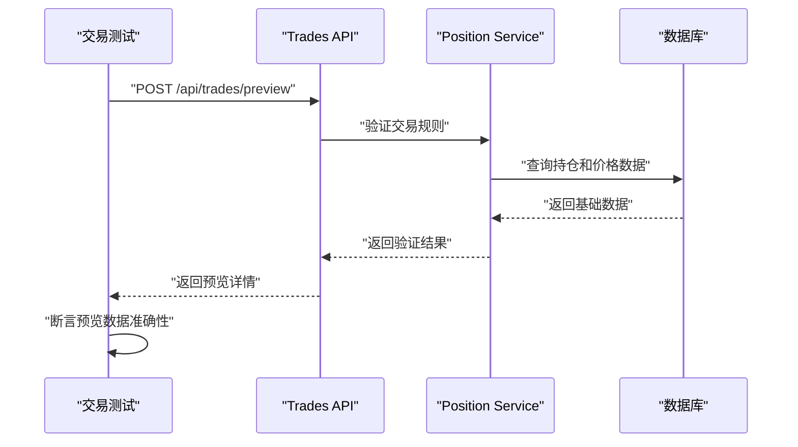
```mermaid
sequenceDiagram
participant T as "交易测试"
participant API as "Trades API"
participant PS as "Position Service"
participant DB as "数据库"
T->>API : "POST /api/trades/preview"
API->>PS : "验证交易规则"
PS->>DB : "查询持仓和价格数据"
DB-->>PS : "返回基础数据"
PS-->>API : "返回验证结果"
API-->>T : "返回预览详情"
T->>T : "断言预览数据准确性"
```

**图表来源**
- [backend/tests/integration/test_trades.py](file://backend/tests/integration/test_trades.py)
- [backend/app/routers/trades.py](file://backend/app/routers/trades.py)
- [backend/app/services/position_service.py](file://backend/app/services/position_service.py)

**章节来源**
- [backend/tests/integration/test_trades.py](file://backend/tests/integration/test_trades.py)
- [backend/app/routers/trades.py](file://backend/app/routers/trades.py)
- [backend/app/services/position_service.py](file://backend/app/services/position_service.py)

### 份额精度测试套件
- 核心测试类与方法
  - `TestSharesPrecision`：份额精度测试的核心类，包含291行的全面测试覆盖
  - `test_decimal_precision_calculation`：测试小数精度的计算准确性
  - `test_rounding_rules_compliance`：验证舍入规则符合金融标准
  - `test_precision_edge_cases`：测试精度计算的边界情况
  - `test_currency_formatting_consistency`：确保货币格式的一致性
  - `test_large_number_handling`：测试大数值的精度处理

- 关键测试场景
  - **小数精度保证**：确保份额计算的小数位数符合金融行业标准
  - **舍入规则合规**：验证舍入逻辑遵循四舍五入或银行家舍入规则
  - **边界值处理**：测试极小值和极大值的精度保持
  - **货币格式统一**：不同货币类型的格式化一致性
  - **大数精度维护**：大额交易时的精度不丢失
  - **跨平台一致性**：不同计算平台的精度一致性

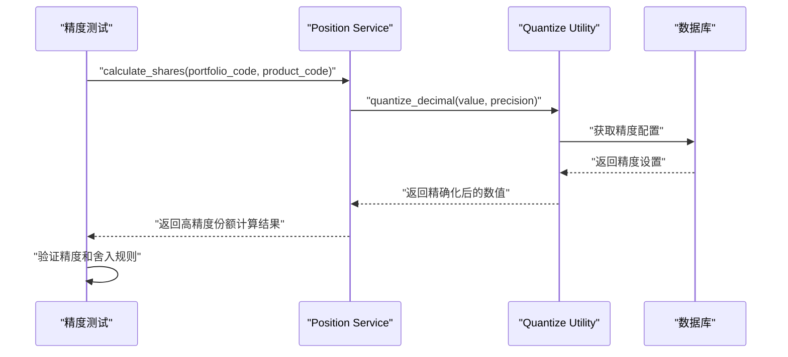
```mermaid
sequenceDiagram
participant T as "精度测试"
participant PS as "Position Service"
participant QZ as "Quantize Utility"
participant DB as "数据库"
T->>PS : "calculate_shares(portfolio_code, product_code)"
PS->>QZ : "quantize_decimal(value, precision)"
QZ->>DB : "获取精度配置"
DB-->>QZ : "返回精度设置"
QZ-->>PS : "返回精确化后的数值"
PS-->>T : "返回高精度份额计算结果"
T->>T : "验证精度和舍入规则"
```

**图表来源**
- [backend/tests/integration/test_shares_precision.py](file://backend/tests/integration/test_shares_precision.py)
- [backend/app/services/position_service.py](file://backend/app/services/position_service.py)
- [backend/app/utils/quantize.py](file://backend/app/utils/quantize.py)

**章节来源**
- [backend/tests/integration/test_shares_precision.py](file://backend/tests/integration/test_shares_precision.py)
- [backend/app/services/position_service.py](file://backend/app/services/position_service.py)
- [backend/app/utils/quantize.py](file://backend/app/utils/quantize.py)

### 量化工具单元测试
- 核心测试类与方法
  - `TestQuantizeUtility`：量化工具的核心测试类，包含64行的全面测试覆盖
  - `test_quantize_decimal_precision`：测试小数量化精度控制
  - `test_rounding_mode_selection`：验证不同舍入模式的选择逻辑
  - `test_boundary_condition_handling`：测试边界条件的正确处理
  - `test_performance_optimization`：验证量化操作的性能优化

- 关键测试场景
  - **精度控制**：确保量化操作能够精确控制小数位数
  - **舍入模式**：支持多种舍入模式的正确实现
  - **边界处理**：极端数值情况的稳定处理
  - **性能优化**：大量数值处理时的效率保证
  - **类型安全**：不同类型输入的安全处理
  - **错误恢复**：异常情况下的错误处理和恢复机制

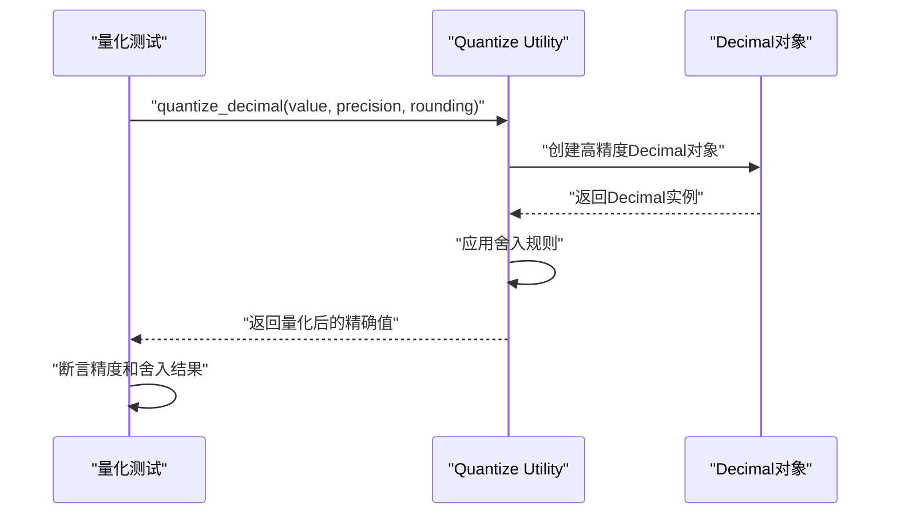
```mermaid
sequenceDiagram
participant T as "量化测试"
participant QZ as "Quantize Utility"
participant DEC as "Decimal对象"
T->>QZ : "quantize_decimal(value, precision, rounding)"
QZ->>DEC : "创建高精度Decimal对象"
DEC-->>QZ : "返回Decimal实例"
QZ->>QZ : "应用舍入规则"
QZ-->>T : "返回量化后的精确值"
T->>T : "断言精度和舍入结果"
```

**图表来源**
- [backend/tests/unit/test_quantize.py](file://backend/tests/unit/test_quantize.py)
- [backend/app/utils/quantize.py](file://backend/app/utils/quantize.py)

**章节来源**
- [backend/tests/unit/test_quantize.py](file://backend/tests/unit/test_quantize.py)
- [backend/app/utils/quantize.py](file://backend/app/utils/quantize.py)

### CLI Schema功能测试套件
- 核心测试类与方法
  - `TestSchemaValidation`：Schema验证的核心测试类，包含完整的响应字段验证
  - `test_response_field_generation`：测试响应字段的自动生成机制
  - `test_schema_index_consistency`：验证schema索引的一致性和完整性
  - `test_contract_compliance`：测试API契约的合规性验证
  - `test_field_mapping_accuracy`：验证字段映射的准确性
  - `test_schema_versioning`：测试schema版本管理的正确性

- 关键测试场景
  - **响应字段生成**：确保CLI工具能够正确生成标准化的响应字段
  - **Schema索引一致性**：验证不同模块间schema索引的一致性
  - **契约合规性**：确保CLI输出与后端API响应格式完全一致
  - **字段映射准确性**：验证数据模型到CLI输出的字段映射正确性
  - **版本兼容性**：测试不同版本schema之间的兼容性
  - **错误处理**：验证schema验证失败时的错误处理机制

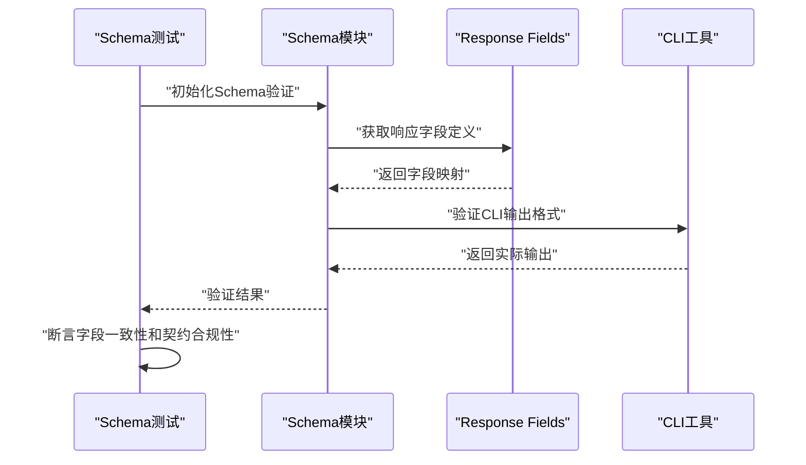
```mermaid
sequenceDiagram
participant T as "Schema测试"
participant SCHEMA as "Schema模块"
participant RF as "Response Fields"
participant CLI as "CLI工具"
T->>SCHEMA : "初始化Schema验证"
SCHEMA->>RF : "获取响应字段定义"
RF-->>SCHEMA : "返回字段映射"
SCHEMA->>CLI : "验证CLI输出格式"
CLI-->>SCHEMA : "返回实际输出"
SCHEMA-->>T : "验证结果"
T->>T : "断言字段一致性和契约合规性"
```

**图表来源**
- [ir-cli/tests/test_schema.py](file://ir-cli/tests/test_schema.py)
- [ir-cli/ir_cli/schema.py](file://ir-cli/ir_cli/schema.py)
- [ir-cli/ir_cli/response_fields.py](file://ir-cli/ir_cli/response_fields.py)

**章节来源**
- [ir-cli/tests/test_schema.py](file://ir-cli/tests/test_schema.py)
- [ir-cli/ir_cli/schema.py](file://ir-cli/ir_cli/schema.py)
- [ir-cli/ir_cli/response_fields.py](file://ir-cli/ir_cli/response_fields.py)

### CLI错误处理测试套件
- 核心测试类与方法
  - `TestClientErrors`：CLI错误处理的核心测试类，包含257行的全面测试覆盖
  - `test_network_error_handling`：测试网络连接错误的处理机制
  - `test_authentication_error_handling`：测试认证失败的错误处理
  - `test_permission_error_handling`：测试权限不足的错误处理
  - `test_invalid_input_error_handling`：测试无效输入参数的错误处理
  - `test_server_error_handling`：测试服务器端错误的用户友好提示
  - `test_timeout_error_handling`：测试请求超时的错误处理
  - `test_retry_mechanism`：测试自动重试机制的有效性

- 关键测试场景
  - **网络错误处理**：确保网络连接失败时提供清晰的错误信息和重试建议
  - **认证错误处理**：认证失败时提供明确的错误提示和解决方案
  - **权限错误处理**：权限不足时显示详细的权限要求和申请方式
  - **输入验证错误**：无效输入时提供具体的错误位置和修正建议
  - **服务器错误处理**：服务端异常时提供友好的错误消息和联系方式
  - **超时错误处理**：请求超时时提供重试建议和超时配置说明
  - **重试机制**：实现智能重试逻辑，提高命令执行的可靠性

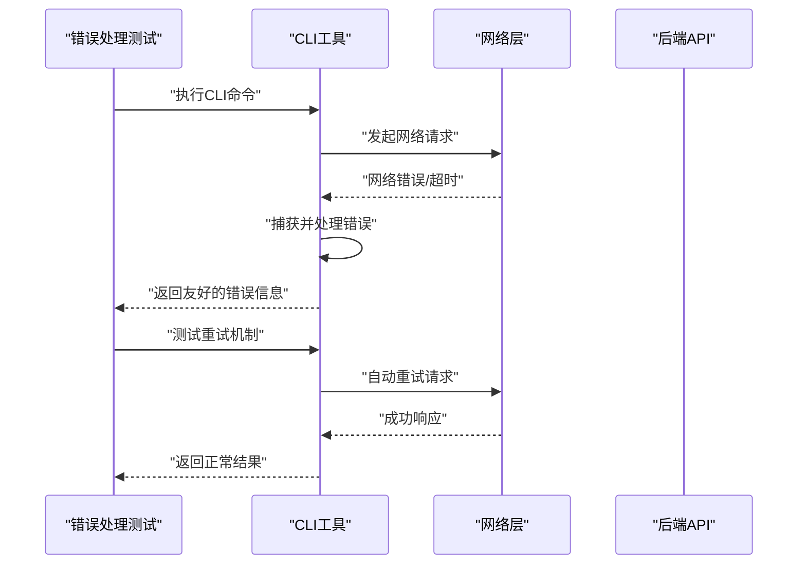
```mermaid
sequenceDiagram
participant T as "错误处理测试"
participant CLI as "CLI工具"
participant NET as "网络层"
participant API as "后端API"
T->>CLI : "执行CLI命令"
CLI->>NET : "发起网络请求"
NET-->>CLI : "网络错误/超时"
CLI->>CLI : "捕获并处理错误"
CLI-->>T : "返回友好的错误信息"
T->>CLI : "测试重试机制"
CLI->>NET : "自动重试请求"
NET-->>CLI : "成功响应"
CLI-->>T : "返回正常结果"
```

**图表来源**
- [ir-cli/tests/test_client_errors.py](file://ir-cli/tests/test_client_errors.py)
- [ir-cli/ir_cli/client.py](file://ir-cli/ir_cli/client.py)

**章节来源**
- [ir-cli/tests/test_client_errors.py](file://ir-cli/tests/test_client_errors.py)

### 负现金场景集成测试套件
- 核心测试类与方法
  - `TestNegativeCashScenarios`：负现金场景的核心测试类，包含241行的全面测试覆盖
  - `test_portfolio_negative_cash_balance`：测试投资组合出现负现金余额的场景
  - `test_snapshot_negative_cash_handling`：测试负现金状态下的快照创建和处理
  - `test_transaction_validation_with_negative_cash`：测试负现金状态下的交易验证逻辑
  - `test_report_generation_with_negative_cash`：测试负现金状态下的报表生成
  - `test_alert_notification_for_negative_cash`：测试负现金状态的警报通知机制
  - `test_data_consistency_in_negative_cash`：测试负现金状态下的数据一致性保证

- 关键测试场景
  - **负现金余额检测**：准确识别投资组合的负现金状态
  - **快照数据完整性**：确保负现金状态下的快照数据完整性和准确性
  - **交易验证逻辑**：负现金状态下交易创建的合理验证规则
  - **报表生成准确性**：负现金状态下的财务报告和指标计算
  - **警报通知机制**：负现金状态的及时检测和通知
  - **数据一致性保证**：负现金状态下的数据一致性和完整性

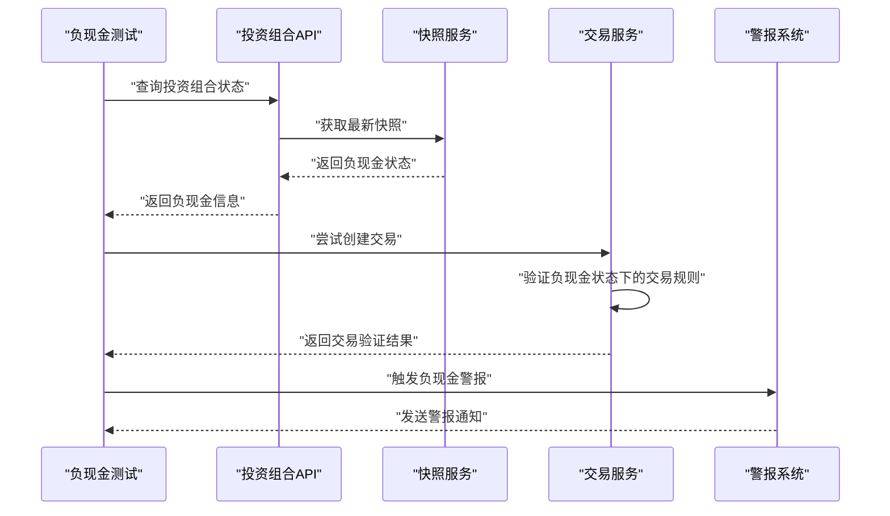
```mermaid
sequenceDiagram
participant T as "负现金测试"
participant API as "投资组合API"
participant SS as "快照服务"
participant TR as "交易服务"
participant AL as "警报系统"
T->>API : "查询投资组合状态"
API->>SS : "获取最新快照"
SS-->>API : "返回负现金状态"
API-->>T : "返回负现金信息"
T->>TR : "尝试创建交易"
TR->>TR : "验证负现金状态下的交易规则"
TR-->>T : "返回交易验证结果"
T->>AL : "触发负现金警报"
AL-->>T : "发送警报通知"
```

**图表来源**
- [backend/tests/integration/test_snapshot_negative_cash.py](file://backend/tests/integration/test_snapshot_negative_cash.py)
- [backend/app/services/snapshot_service.py](file://backend/app/services/snapshot_service.py)
- [backend/app/services/trade_service.py](file://backend/app/services/trade_service.py)

**章节来源**
- [backend/tests/integration/test_snapshot_negative_cash.py](file://backend/tests/integration/test_snapshot_negative_cash.py)

### 交易现金验证逻辑测试套件
- 核心测试类与方法
  - `TestTradeCashValidation`：交易现金验证的核心测试类，包含333行的全面测试覆盖
  - `test_buy_transaction_cash_validation`：测试买入交易的现金余额验证
  - `test_sell_transaction_cash_validation`：测试卖出交易的现金余额验证
  - `test_transfer_transaction_cash_validation`：测试资金调拨的现金验证
  - `test_dividend_transaction_cash_validation`：测试分红交易的现金处理
  - `test_fee_deduction_cash_validation`：测试费用扣除的现金验证
  - `test_concurrent_cash_validation`：测试并发交易的现金验证竞态条件
  - `test_rollback_on_insufficient_funds`：测试资金不足时的事务回滚机制

- 关键测试场景
  - **买入交易验证**：确保买入交易有足够的现金余额支持
  - **卖出交易验证**：验证卖出交易的份额和现金余额准确性
  - **资金调拨验证**：确保资金调拨的转出转入余额正确性
  - **分红处理验证**：验证分红到账的现金增加逻辑
  - **费用扣除验证**：确保交易费用的正确扣除和余额更新
  - **并发安全性**：多交易并发时的现金余额一致性保证
  - **事务回滚机制**：资金不足时的完整事务回滚和数据一致性

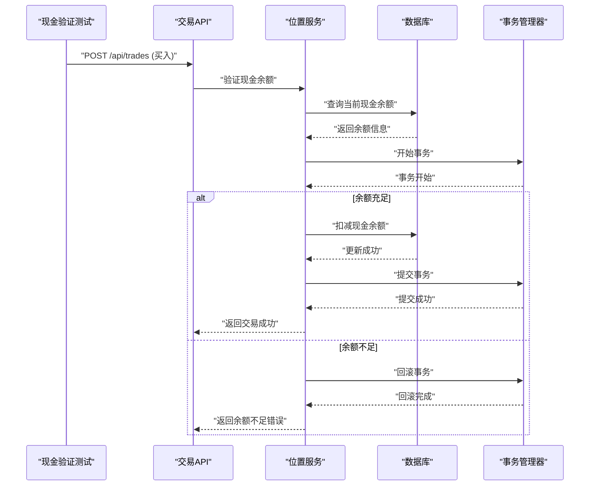
```mermaid
sequenceDiagram
participant T as "现金验证测试"
participant API as "交易API"
participant PS as "位置服务"
participant DB as "数据库"
participant TX as "事务管理器"
T->>API : "POST /api/trades (买入)"
API->>PS : "验证现金余额"
PS->>DB : "查询当前现金余额"
DB-->>PS : "返回余额信息"
PS->>TX : "开始事务"
TX-->>PS : "事务开始"
alt 余额充足
PS->>DB : "扣减现金余额"
DB-->>PS : "更新成功"
PS->>TX : "提交事务"
TX-->>PS : "提交成功"
PS-->>API : "返回交易成功"
else 余额不足
PS->>TX : "回滚事务"
TX-->>PS : "回滚完成"
PS-->>API : "返回余额不足错误"
end
```

**图表来源**
- [backend/tests/integration/test_trade_cash_check.py](file://backend/tests/integration/test_trade_cash_check.py)
- [backend/app/services/trade_service.py](file://backend/app/services/trade_service.py)
- [backend/app/routers/trades.py](file://backend/app/routers/trades.py)

**章节来源**
- [backend/tests/integration/test_trade_cash_check.py](file://backend/tests/integration/test_trade_cash_check.py)

### 市场数据覆盖率集成测试套件
- 核心测试类与方法
  - `TestMarketDataCoverage`：市场数据覆盖率测试的核心类，包含9个综合测试用例
  - `test_nav_coverage_api_endpoint`：测试nav-coverage API端点的完整功能
  - `test_nav_coverage_cli_command`：测试nav-coverage CLI命令的执行效果
  - `test_market_data_integration_flow`：验证市场数据从获取到存储的完整流程
  - `test_coverage_calculation_accuracy`：验证覆盖率计算的准确性
  - `test_error_handling_scenarios`：测试各种异常场景的处理机制
  - `test_concurrent_coverage_requests`：并发覆盖率请求的性能测试
  - `test_data_consistency_verification`：数据一致性验证测试
  - `test_performance_benchmarks`：性能基准测试

- 关键测试场景
  - **API端点完整性**：确保nav-coverage端点的所有功能正常工作
  - **CLI命令可靠性**：验证命令行工具的输入输出和处理逻辑
  - **数据处理准确性**：覆盖率计算算法的正确性验证
  - **异常处理健壮性**：网络错误、数据格式错误等异常场景的处理
  - **并发处理能力**：多用户同时请求时的系统稳定性
  - **数据一致性保证**：分布式环境下的数据同步和一致性

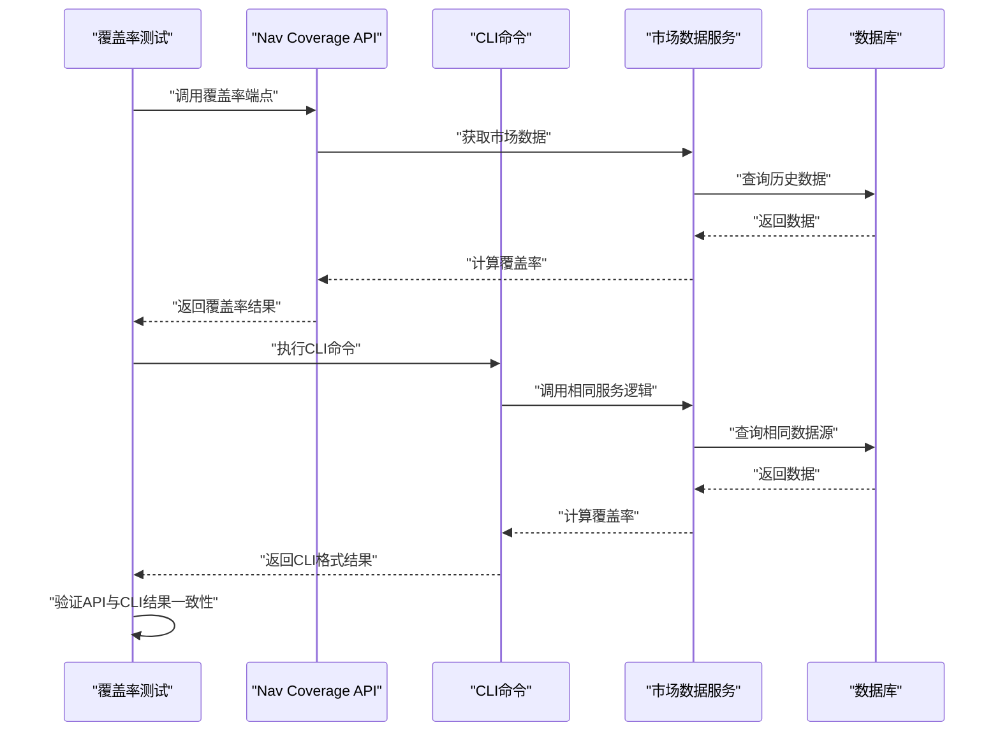
```mermaid
sequenceDiagram
participant T as "覆盖率测试"
participant API as "Nav Coverage API"
participant CLI as "CLI命令"
participant MS as "市场数据服务"
participant DB as "数据库"
T->>API : "调用覆盖率端点"
API->>MS : "获取市场数据"
MS->>DB : "查询历史数据"
DB-->>MS : "返回数据"
MS-->>API : "计算覆盖率"
API-->>T : "返回覆盖率结果"
T->>CLI : "执行CLI命令"
CLI->>MS : "调用相同服务逻辑"
MS->>DB : "查询相同数据源"
DB-->>MS : "返回数据"
MS-->>CLI : "计算覆盖率"
CLI-->>T : "返回CLI格式结果"
T->>T : "验证API与CLI结果一致性"
```

**图表来源**
- [backend/tests/integration/test_market_data_coverage.py](file://backend/tests/integration/test_market_data_coverage.py)
- [backend/app/services/market_data_service.py](file://backend/app/services/market_data_service.py)

**章节来源**
- [backend/tests/integration/test_market_data_coverage.py](file://backend/tests/integration/test_market_data_coverage.py)
- [backend/app/services/market_data_service.py](file://backend/app/services/market_data_service.py)

### 市场数据事务集成测试
- 核心测试类与方法
  - `TestMarketDataTransaction`：市场数据事务的完整集成测试套件
  - `test_fetch_and_save_market_data`：测试行情数据获取与保存的事务完整性
  - `test_transaction_rollback_on_error`：验证异常情况下的事务回滚机制
  - `test_concurrent_market_data_updates`：并发市场数据更新的竞态条件测试

- 关键测试场景
  - **事务原子性**：市场数据获取与保存必须在同一事务中完成
  - **异常处理**：网络错误或数据格式错误时的事务回滚
  - **并发安全**：多进程并发更新时的数据一致性
  - **数据完整性**：确保市场数据的完整性和准确性

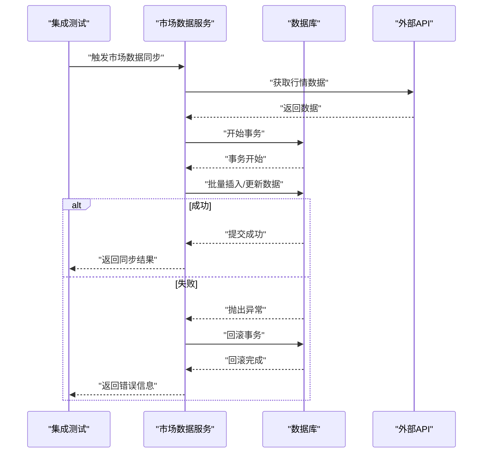
```mermaid
sequenceDiagram
participant IT as "集成测试"
participant MS as "市场数据服务"
participant DB as "数据库"
participant API as "外部API"
IT->>MS : "触发市场数据同步"
MS->>API : "获取行情数据"
API-->>MS : "返回数据"
MS->>DB : "开始事务"
DB-->>MS : "事务开始"
MS->>DB : "批量插入/更新数据"
alt 成功
DB-->>MS : "提交成功"
MS-->>IT : "返回同步结果"
else 失败
DB-->>MS : "抛出异常"
MS->>DB : "回滚事务"
DB-->>MS : "回滚完成"
MS-->>IT : "返回错误信息"
end
```

**图表来源**
- [backend/tests/integration/test_market_data_tx.py](file://backend/tests/integration/test_market_data_tx.py)
- [backend/app/services/market_data_service.py](file://backend/app/services/market_data_service.py)

**章节来源**
- [backend/tests/integration/test_market_data_tx.py](file://backend/tests/integration/test_market_data_tx.py)
- [backend/app/services/market_data_service.py](file://backend/app/services/market_data_service.py)

### CLI与REST端点一致性集成测试
- 核心测试类与方法
  - `TestCLIServiceParity`：基础一致性测试类，验证CLI命令与REST API返回相同结果
  - `test_portfolio_operations`：投资组合操作一致性测试，涵盖创建、读取、更新、删除操作
  - `test_investor_operations`：投资人操作一致性测试，验证CRUD操作的等价性
  - `test_product_operations`：产品操作一致性测试，确保数据操作行为一致
  - `test_platform_operations`：平台操作一致性测试，验证平台管理的等价性
  - `test_subscription_operations`：订阅操作一致性测试，涵盖申购赎回流程
  - `test_trade_operations`：交易操作一致性测试，验证交易记录的等价性
  - `test_position_operations`：持仓操作一致性测试，确保持仓数据的准确性
  - `test_snapshot_operations`：快照操作一致性测试，验证净值快照的等价性
  - `test_share_change_events`：份额变动事件一致性测试，确保事件处理的正确性
  - `test_sync_job_operations`：同步任务操作一致性测试，验证任务管理的等价性
  - `test_cash_transfer_operations`：资金调拨操作一致性测试，确保转账流程的准确性

- 关键测试场景
  - **数据一致性**：CLI命令与REST API返回的数据结构完全一致
  - **业务逻辑等价性**：相同的输入产生相同的业务结果
  - **错误处理一致性**：异常情况下的错误消息和处理逻辑保持一致
  - **状态转换一致性**：资源状态在不同客户端接口下保持一致
  - **权限控制一致性**：访问控制逻辑在CLI和REST接口中保持一致

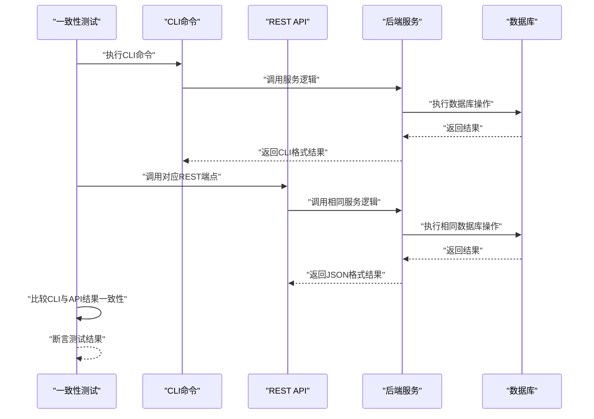
```mermaid
sequenceDiagram
participant T as "一致性测试"
participant CLI as "CLI命令"
participant API as "REST API"
participant S as "后端服务"
participant DB as "数据库"
T->>CLI : "执行CLI命令"
CLI->>S : "调用服务逻辑"
S->>DB : "执行数据库操作"
DB-->>S : "返回结果"
S-->>CLI : "返回CLI格式结果"
T->>API : "调用对应REST端点"
API->>S : "调用相同服务逻辑"
S->>DB : "执行相同数据库操作"
DB-->>S : "返回结果"
S-->>API : "返回JSON格式结果"
T->>T : "比较CLI与API结果一致性"
T-->>T : "断言测试结果"
```

**图表来源**
- [backend/tests/integration/test_cli_service_parity.py](file://backend/tests/integration/test_cli_service_parity.py)
- [backend/app/main.py](file://backend/app/main.py)

**章节来源**
- [backend/tests/integration/test_cli_service_parity.py](file://backend/tests/integration/test_cli_service_parity.py)

### 前端 Playwright 端到端测试框架
- 测试框架配置
  - 使用 Playwright TypeScript 配置文件，支持多设备测试（桌面端、移动端）。
  - 配置测试目录、项目配置、存储状态管理和浏览器设置。
- 认证测试实现
  - 通过 auth.setup.ts 创建认证夹具，管理管理员用户状态。
  - 使用 storageState 配置持久化认证状态，提高测试效率。
- 测试用例编写
  - auth.spec.ts 覆盖登录页面加载、有效/无效凭据登录、登出等功能。
  - 支持交互式 UI 模式和调试模式，便于开发和维护。
- 测试夹具管理
  - 使用 fixtures 目录组织测试夹具，实现测试数据的标准化准备。

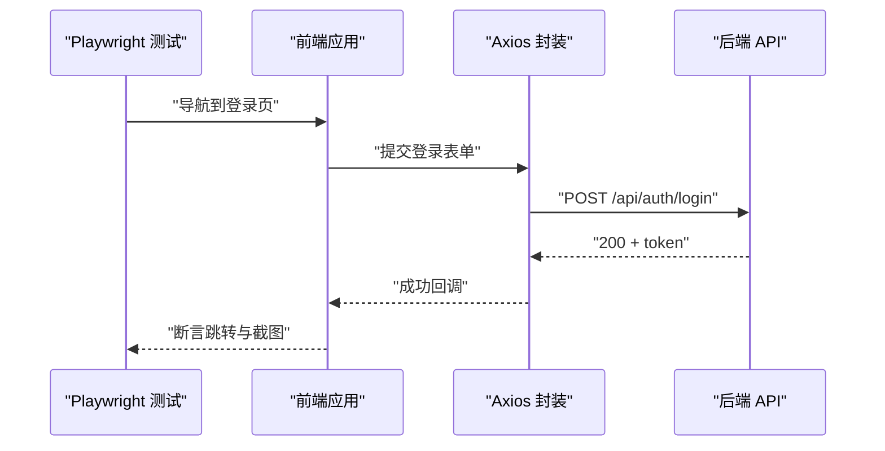
```mermaid
sequenceDiagram
participant PW as "Playwright 测试"
participant FE as "前端应用"
participant API as "Axios 封装"
participant BK as "后端 API"
PW->>FE : "导航到登录页"
FE->>API : "提交登录表单"
API->>BK : "POST /api/auth/login"
BK-->>API : "200 + token"
API-->>FE : "成功回调"
FE-->>PW : "断言跳转与截图"
```

**图表来源**
- [frontend/e2e/auth.spec.ts](file://frontend/e2e/auth.spec.ts)
- [frontend/e2e/fixtures/auth.setup.ts](file://frontend/e2e/fixtures/auth.setup.ts)
- [frontend/playwright.config.ts](file://frontend/playwright.config.ts)

**章节来源**
- [frontend/playwright.config.ts](file://frontend/playwright.config.ts)
- [frontend/e2e/auth.spec.ts](file://frontend/e2e/auth.spec.ts)
- [frontend/e2e/fixtures/auth.setup.ts](file://frontend/e2e/fixtures/auth.setup.ts)

### 数据库测试与异步测试最佳实践
- 连接池与会话
  - 使用连接池参数提升并发与稳定性；SQLite 使用 WAL 模式与 PRAGMA 配置优化。
  - **更新** 增强了多数据库支持，包括MySQL和PostgreSQL的连接配置和事务处理，修复了SQLite特定行为的兼容性问题。
- 异步测试
  - 利用 pytest-asyncio 标记与事件循环，确保异步路由与后台任务可被正确测试。
- 测试隔离
  - 使用独立测试数据库或内存数据库（如 SQLite），在测试前后清理数据，避免跨用例污染。
  - **更新** 改进了跨数据库系统的测试隔离机制，确保SQLite特定行为不会影响其他数据库测试。
- Mock 数据与工厂
  - 通过工厂模式生成测试数据，减少真实数据库依赖；对第三方服务（如行情）使用 Mock。

```mermaid
flowchart TD
Start(["开始测试"]) --> Prep["准备测试数据/会话"]
Prep --> Exec["执行异步路由/任务"]
Exec --> Assert["断言响应/状态变更"]
Assert --> Cleanup["清理会话/数据"]
Cleanup --> End(["结束"])
```

**图表来源**
- [backend/app/database.py](file://backend/app/database.py)
- [backend/tests/conftest.py](file://backend/tests/conftest.py)

**章节来源**
- [backend/app/database.py](file://backend/app/database.py)
- [backend/tests/conftest.py](file://backend/tests/conftest.py)

### 前端组件测试、状态管理与用户交互
- 组件测试
  - 使用 React Testing Library 或 Jest + React Test Renderer 测试组件渲染与交互；对受保护路由与权限 Hook 进行单元测试。
- 状态管理测试
  - 针对 Zustand Store 的登录、登出、用户信息更新进行单元测试；模拟 API 返回与副作用。
- 用户交互测试
  - 使用 Playwright 进行端到端测试，覆盖登录页加载、有效/无效凭据登录、登出、控制台错误检查等场景。
- API 封装与拦截器
  - 测试 Axios 拦截器在 401 时的本地 token 清理与跳转逻辑；对错误处理函数进行断言。

**章节来源**
- [frontend/src/lib/api.ts](file://frontend/src/lib/api.ts)
- [frontend/src/hooks/useAuth.ts](file://frontend/src/hooks/useAuth.ts)

### 快照服务单元测试增强
- 核心测试类与方法
  - `TestSnapshotService`：快照服务的完整单元测试套件
  - `test_create_portfolio_snapshot`：测试组合快照的创建逻辑
  - `test_get_latest_snapshot`：测试最新快照的获取逻辑
  - `test_snapshot_data_consistency`：测试快照数据的一致性验证

- 关键测试场景
  - **快照创建**：验证组合快照的正确创建和数据完整性
  - **快照查询**：确保最新快照的高效获取和准确性
  - **数据一致性**：快照数据与实时数据的一致性验证
  - **异常处理**：快照创建过程中的异常处理和回滚机制

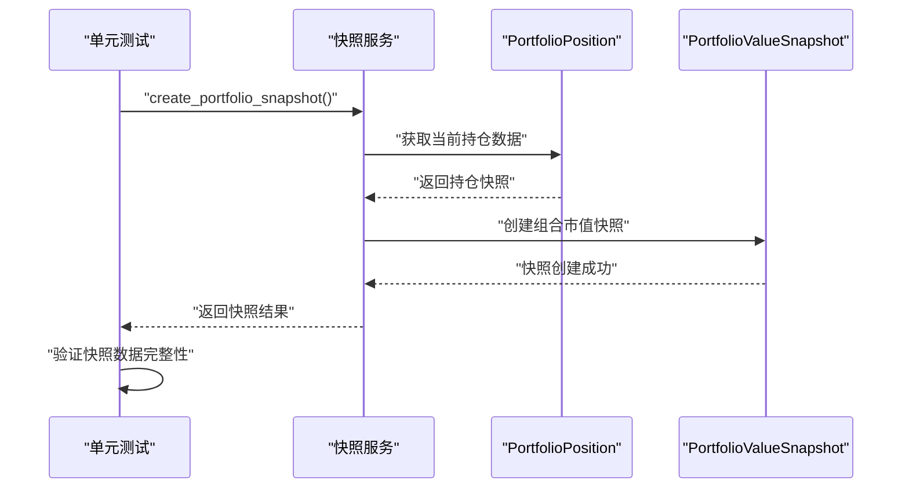
```mermaid
sequenceDiagram
participant T as "单元测试"
participant SS as "快照服务"
participant PP as "PortfolioPosition"
participant PS as "PortfolioValueSnapshot"
T->>SS : "create_portfolio_snapshot()"
SS->>PP : "获取当前持仓数据"
PP-->>SS : "返回持仓快照"
SS->>PS : "创建组合市值快照"
PS-->>SS : "快照创建成功"
SS-->>T : "返回快照结果"
T->>T : "验证快照数据完整性"
```

**图表来源**
- [backend/tests/unit/test_snapshot_service.py](file://backend/tests/unit/test_snapshot_service.py)
- [backend/app/services/snapshot_service.py](file://backend/app/services/snapshot_service.py)

**章节来源**
- [backend/tests/unit/test_snapshot_service.py](file://backend/tests/unit/test_snapshot_service.py)
- [backend/app/services/snapshot_service.py](file://backend/app/services/snapshot_service.py)

### 增量快照基线计算单元测试
- 核心测试类与方法
  - `TestCalculateAvailableCashWithOverride`：测试基于快照表的可用现金计算，涵盖基线读取、快照后交易、待处理卖出等复杂场景
  - `TestCalculateAvailableCashAsOfDate`：测试 as_of_date 截止计算逻辑，确保历史日期查询的准确性
  - `TestGetCashValue`：测试 get_cash_value 函数的现金获取逻辑，包括无覆盖、有覆盖、日期不匹配等场景

- 关键测试场景
  - **快照基线读取**：当存在最新快照时，直接读取 portfolio_position 快照表中的 CASH amount
  - **manual 覆盖继承**：历史 manual_market_value 覆盖已 baked in 快照，实时计算自然继承该值
  - **快照后交易影响**：基线加上快照后的 confirmed trades 和 pending sells 的预留
  - **无快照降级**：当没有快照时，降级为 compute_cash_balance 全量流水计算
  - **as_of_date 截止**：传入历史日期时，基线取 <= as_of_date 的最新快照日

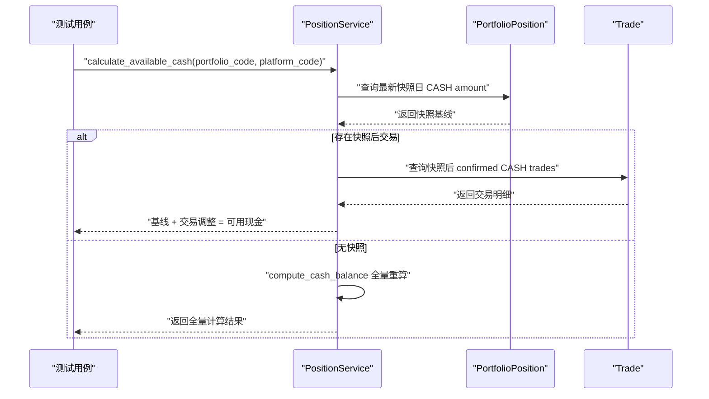
```mermaid
sequenceDiagram
participant T as "测试用例"
participant PS as "PositionService"
participant PP as "PortfolioPosition"
participant TR as "Trade"
T->>PS : "calculate_available_cash(portfolio_code, platform_code)"
PS->>PP : "查询最新快照日 CASH amount"
PP-->>PS : "返回快照基线"
alt 存在快照后交易
PS->>TR : "查询快照后 confirmed CASH trades"
TR-->>PS : "返回交易明细"
PS-->>T : "基线 + 交易调整 = 可用现金"
else 无快照
PS->>PS : "compute_cash_balance 全量重算"
PS-->>T : "返回全量计算结果"
end
```

**图表来源**
- [backend/tests/unit/test_position_service.py](file://backend/tests/unit/test_position_service.py)
- [backend/app/services/position_service.py](file://backend/app/services/position_service.py)

**章节来源**
- [backend/tests/unit/test_position_service.py](file://backend/tests/unit/test_position_service.py)
- [backend/app/services/position_service.py](file://backend/app/services/position_service.py)

### 配对CASH腿同步集成测试
- 核心测试类与方法
  - `TestUpdateDeletePairedSync`：测试 PUT/DELETE 操作时配对 CASH 腿的状态同步
  - `TestUpdateAmountSyncCashLeg`：测试金额字段变动时配对 CASH 腿金额的同步更新
  - `test_update_trade_date_syncs_cash_leg`：验证 confirm_date 修改时配对腿的同步
  - `test_delete_trade_cascades_cash_leg`：验证删除主腿时级联删除配对 CASH 腿

- 关键测试场景
  - **金额字段同步**：修改基金腿 actual_amount/amount/fee/shares/price 后，配对 CASH 腿金额同步更新
  - **状态同步**：修改 confirm_date/trade_date/status 时，配对 CASH 腿相应字段同步
  - **级联删除**：删除主腿时，同一 transfer_group 的配对 CASH 腿被级联删除
  - **数据一致性**：确保配对腿的金额计算逻辑正确（买入=支出，卖出=收入）

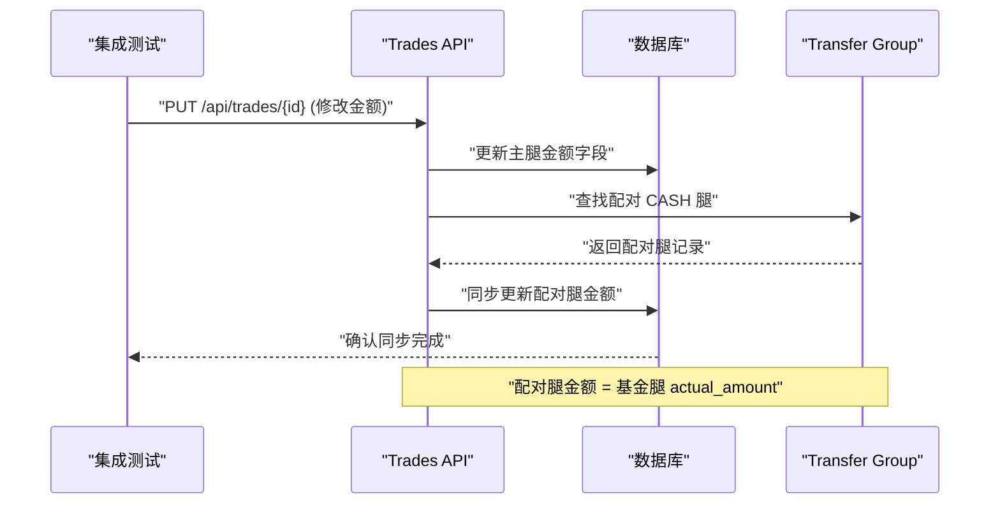
```mermaid
sequenceDiagram
participant IT as "集成测试"
participant API as "Trades API"
participant DB as "数据库"
participant TG as "Transfer Group"
IT->>API : "PUT /api/trades/{id} (修改金额)"
API->>DB : "更新主腿金额字段"
API->>TG : "查找配对 CASH 腿"
TG-->>API : "返回配对腿记录"
API->>DB : "同步更新配对腿金额"
DB-->>IT : "确认同步完成"
Note over API,TG : "配对腿金额 = 基金腿 actual_amount"
```

**图表来源**
- [backend/tests/integration/test_trades.py](file://backend/tests/integration/test_trades.py)
- [backend/app/routers/trades.py](file://backend/app/routers/trades.py)

**章节来源**
- [backend/tests/integration/test_trades.py](file://backend/tests/integration/test_trades.py)
- [backend/app/routers/trades.py](file://backend/app/routers/trades.py)

### as_of_date验证场景测试
- 核心测试类与方法
  - `TestAsOfDateSellValidation`：测试补录历史卖出交易时的份额验证逻辑
  - `test_backfill_sell_not_blocked_by_later_confirmed`：验证后续 confirmed 卖出不应计入历史日期的扣减

- 关键测试场景
  - **历史日期基准**：as_of_date 传入历史日时，基线取 <= as_of_date 的最新快照日
  - **时间窗口过滤**：confirmed 卖出仅计 confirm_date 在 (latest_date, as_of_date] 范围内的
  - **pending 不受影响**：pending 交易不受 as_of_date 截止影响，始终计提预留
  - **补录场景验证**：补录历史日卖出时，后续 confirmed 卖出不应阻止交易创建

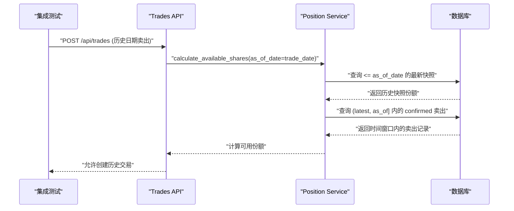
```mermaid
sequenceDiagram
participant IT as "集成测试"
participant API as "Trades API"
participant PS as "Position Service"
participant DB as "数据库"
IT->>API : "POST /api/trades (历史日期卖出)"
API->>PS : "calculate_available_shares(as_of_date=trade_date)"
PS->>DB : "查询 <= as_of_date 的最新快照"
DB-->>PS : "返回历史快照份额"
PS->>DB : "查询 (latest, as_of] 内的 confirmed 卖出"
DB-->>PS : "返回时间窗口内的卖出记录"
PS-->>API : "计算可用份额"
API-->>IT : "允许创建历史交易"
```

**图表来源**
- [backend/tests/integration/test_trades.py](file://backend/tests/integration/test_trades.py)
- [backend/app/services/position_service.py](file://backend/app/services/position_service.py)

**章节来源**
- [backend/tests/integration/test_trades.py](file://backend/tests/integration/test_trades.py)
- [backend/app/services/position_service.py](file://backend/app/services/position_service.py)

### 订阅赎回as_of_date接入测试
- 核心测试场景
  - **赎回份额验证**：赎回申请时使用 apply_date 作为 as_of_date 进行份额验证
  - **历史赎回补录**：补录历史赎回申请时，后续 confirmed 赎回不应影响历史可用性
  - **时间窗口一致性**：与交易验证保持一致的时间窗口计算逻辑

**章节来源**
- [backend/app/routers/subscriptions.py](file://backend/app/routers/subscriptions.py)
- [backend/app/services/position_service.py](file://backend/app/services/position_service.py)

### 工厂函数体系与测试数据管理
- 核心业务实体工厂函数
  - `create_sync_job()`：同步任务记录工厂，支持 job_type、status、triggered_by、params 等完整字段
  - `create_manual_market_value()`：手动市值覆盖记录工厂，支持 portfolio_code、platform_code、product_code、date 等字段
  - `create_notification()`：通知记录工厂，支持 type、title、content、level、recipient、channel、status 等字段
  - `create_idempotency_cache()`：幂等性缓存记录工厂，支持 key、portfolio_code、request_hash、response、expires_at 等字段

- 增强的现有工厂函数
  - `create_trade()`：增强 confirm_date、actual_amount、transfer_group、notes 等字段支持
  - `create_position_snapshot()`：增强 frozen_shares、frozen_amount、asset_type 等字段支持
  - `create_value_snapshot()`：支持组合市值快照的完整字段创建

- 工厂函数设计原则
  - 所有工厂函数接收 db session 作为第一个参数，并在创建后自动 commit
  - 提供合理的默认值，确保测试数据的完整性
  - 支持可选参数的灵活配置，满足不同测试场景需求
  - 遵循幂等性设计，避免重复创建相同数据

```mermaid
classDiagram
class FactoryFunctions {
+create_sync_job(db, job_type, status, ...)
+create_manual_market_value(db, portfolio_code, platform_code, ...)
+create_notification(db, type, title, content, ...)
+create_idempotency_cache(db, key, portfolio_code, ...)
+create_trade(db, portfolio_code, product_code, ...)
+create_position_snapshot(db, portfolio_code, product_code, ...)
+create_value_snapshot(db, portfolio_code, snapshot_date, ...)
}
class Models {
<<database models>>
SyncJob
ManualMarketValue
Notification
IdempotencyCache
Trade
PortfolioPosition
PortfolioValueSnapshot
}
FactoryFunctions --> Models : 创建对应模型实例
```

**图表来源**
- [backend/tests/factories.py](file://backend/tests/factories.py)
- [backend/app/models/sync_job.py](file://backend/app/models/sync_job.py)
- [backend/app/models/manual_market_value.py](file://backend/app/models/manual_market_value.py)
- [backend/app/models/notification.py](file://backend/app/models/notification.py)
- [backend/app/models/idempotency_cache.py](file://backend/app/models/idempotency_cache.py)

**章节来源**
- [backend/tests/factories.py](file://backend/tests/factories.py)
- [backend/app/models/sync_job.py](file://backend/app/models/sync_job.py)
- [backend/app/models/manual_market_value.py](file://backend/app/models/manual_market_value.py)
- [backend/app/models/notification.py](file://backend/app/models/notification.py)
- [backend/app/models/idempotency_cache.py](file://backend/app/models/idempotency_cache.py)

### 覆盖率要求、CI 流程与自动化脚本
- 覆盖率要求
  - 后端：函数级覆盖率不低于 80%，关键分支（认证、权限、业务主干）不低于 90%。
  - CLI工具：CLI命令与REST API一致性测试覆盖率不低于 95%，确保不同客户端接口的行为一致性。
  - **更新** 市场数据覆盖率测试套件要求达到90%以上的代码覆盖率，确保nav-coverage功能的可靠性。
  - **更新** CLI Schema功能测试要求达到85%以上的覆盖率，确保响应字段生成的准确性。
  - **更新** 新增交易预览测试要求达到85%以上的覆盖率，确保交易处理逻辑的可靠性。
  - **更新** 份额精度测试要求达到90%以上的覆盖率，确保金融计算的精确性。
  - **更新** 量化工具测试要求达到80%以上的覆盖率，确保数值处理的准确性。
  - **更新** 服务提交验证测试要求达到75%以上的覆盖率，确保数据库操作的安全性。
  - **更新** 新增负现金场景测试要求达到85%以上的覆盖率，确保极端情况下的数据一致性。
  - **更新** 新增交易现金验证测试要求达到90%以上的覆盖率，确保交易余额的准确性。
  - **更新** 新增CLI错误处理测试要求达到80%以上的覆盖率，确保错误提示的友好性。
- CI 流程
  - 触发条件：push 到 develop/main，或发起 Pull Request。
  - 步骤：安装依赖 → 启动测试数据库 → 运行 pytest → 生成覆盖率报告 → 上传报告。
  - **更新** CI流程已大幅简化，从233行精简至13行，专注于后端测试套件，移除了前端测试和非必要的测试套件。
  - **更新** 新增了全面的MySQL测试支持，在CI流水线中集成了MySQL数据库测试环境，确保跨数据库系统的兼容性。
  - **更新** 新的CI配置支持SQLite、MySQL和PostgreSQL三种数据库的并行测试，提高了测试的全面性和可靠性。
- 自动化脚本
  - 提供一键运行后端测试的脚本，支持并行执行与失败重试。
  - 在 CI 中集成覆盖率阈值检查，低于阈值则阻断合并。

**更新** CI流程已从233行精简至13行，专注于后端测试套件。新的CI配置移除了前端测试和非必要的测试套件，只保留后端单元测试、集成测试和业务流端到端测试，显著提高了测试执行效率和资源利用率。新增的全面MySQL测试支持修复了SQLite特定行为的兼容性问题，并改进了不同数据库系统间单元测试的可靠性。**更新** 新增的负现金场景测试、交易现金验证测试和CLI错误处理测试进一步增强了系统的测试覆盖率和可靠性。

**章节来源**
- [.github/workflows/ci.yml](file://.github/workflows/ci.yml)

### 性能测试、安全测试与兼容性测试
- 性能测试
  - 使用 Locust 或自定义压力脚本，针对登录、查询快照、批量调仓等高频接口进行并发与延迟测试。
  - 关注数据库连接池饱和、慢查询与队列积压。
  - **更新** 新增市场数据覆盖率测试的性能基准测试，确保高并发场景下的响应时间。
  - **更新** CLI Schema功能测试包含性能基准，确保响应字段生成的效率。
  - **更新** 交易预览测试包含并发性能测试，确保多用户同时预览的交易处理能力。
  - **更新** 份额精度测试包含大数据量处理的性能优化验证。
  - **更新** 负现金场景测试包含大数据量处理的性能验证。
  - **更新** 交易现金验证测试包含并发交易的性能测试。
  - **更新** CLI错误处理测试包含网络错误的性能影响评估。
- 安全测试
  - 验证 CORS 配置、Token 黑名单、密码哈希强度、输入参数校验与 SQL 注入防护。
  - 对敏感接口进行权限绕过与越权测试。
- 兼容性测试
  - 后端：不同数据库驱动与 Python 版本的兼容性验证。
  - CLI工具：CLI命令在不同操作系统和环境下的兼容性测试。
  - **更新** CLI Schema功能测试确保不同Python版本间的兼容性。
  - **更新** 份额精度测试确保不同平台和环境的计算一致性。
  - **更新** 新增了全面的MySQL、SQLite和PostgreSQL数据库兼容性测试，确保跨数据库系统的稳定性。
  - **更新** 负现金场景测试确保不同数据库系统下的数据一致性。
  - **更新** 交易现金验证测试确保不同数据库系统下的余额计算一致性。
  - **更新** CLI错误处理测试确保不同环境下的错误提示一致性。

## 依赖分析
后端的关键依赖与测试相关性如下：
- 后端
  - FastAPI、SQLAlchemy、pytest、pytest-asyncio、httpx、Pydantic Settings。
- CLI工具
  - Click命令行框架、HTTP客户端库、配置管理工具。

```mermaid
graph LR
BReq["backend/requirements.txt"] --> Py["pytest"]
BReq --> PyA["pytest-asyncio"]
BReq --> FA["FastAPI"]
BReq --> SA["SQLAlchemy"]
CLIReq["ir-cli/pyproject.toml"] --> Click["Click CLI框架"]
CLIReq --> HTTP["HTTP客户端"]
CLIReq --> Config["配置管理"]
SchemaReq["ir-cli/tests/test_schema.py"] --> SchemaMod["Schema模块"]
SchemaReq --> RF["Response Fields"]
TradesReq["test_trades.py"] --> TradesAPI["Trades API"]
TradesReq --> PositionSvc["Position Service"]
PrecisionReq["test_shares_precision.py"] --> PrecisionCalc["精度计算"]
PrecisionReq --> QuantizeUtil["量化工具"]
QuantizeReq["test_quantize.py"] --> DecimalLib["Decimal库"]
QuantizeReq --> RoundRules["舍入规则"]
NoCommitReq["test_service_no_commit.py"] --> SessionMgr["会话管理"]
NoCommitReq --> TransactionCtrl["事务控制"]
NegCashReq["test_snapshot_negative_cash.py"] --> NegCashLogic["负现金逻辑"]
NegCashReq --> SnapshotSvc["快照服务"]
CashCheckReq["test_trade_cash_check.py"] --> CashValidation["现金验证"]
CashCheckReq --> TradeSvc["交易服务"]
ErrHandleReq["test_client_errors.py"] --> ErrorHandling["错误处理"]
ErrHandleReq --> NetworkLayer["网络层"]
```

**图表来源**
- [backend/requirements.txt](file://backend/requirements.txt)
- [ir-cli/tests/test_schema.py](file://ir-cli/tests/test_schema.py)
- [ir-cli/ir_cli/schema.py](file://ir-cli/ir_cli/schema.py)
- [ir-cli/ir_cli/response_fields.py](file://ir-cli/ir_cli/response_fields.py)
- [backend/tests/integration/test_trades.py](file://backend/tests/integration/test_trades.py)
- [backend/tests/integration/test_shares_precision.py](file://backend/tests/integration/test_shares_precision.py)
- [backend/tests/unit/test_quantize.py](file://backend/tests/unit/test_quantize.py)
- [backend/tests/unit/test_service_no_commit.py](file://backend/tests/unit/test_service_no_commit.py)
- [backend/tests/integration/test_snapshot_negative_cash.py](file://backend/tests/integration/test_snapshot_negative_cash.py)
- [backend/tests/integration/test_trade_cash_check.py](file://backend/tests/integration/test_trade_cash_check.py)
- [ir-cli/tests/test_client_errors.py](file://ir-cli/tests/test_client_errors.py)

**章节来源**
- [backend/requirements.txt](file://backend/requirements.txt)

## 性能考虑
- 后端
  - 合理设置连接池大小与 pre_ping，避免高并发下的连接泄漏。
  - 对热点接口启用缓存（如只读查询），减少数据库压力。
  - **更新** 市场数据覆盖率测试需要优化数据库查询性能，确保大量数据处理的效率。
  - **更新** 交易预览测试需要优化实时计算性能，确保快速响应。
  - **更新** 份额精度测试需要优化大规模数值计算的性能。
  - **更新** 多数据库支持需要优化连接池管理和事务处理性能。
  - **更新** 负现金场景测试需要优化大数据量处理的性能。
  - **更新** 交易现金验证测试需要优化并发交易的性能。
  - **更新** CLI错误处理测试需要优化网络错误的处理性能。
- CLI工具
  - 优化CLI命令的执行效率，避免不必要的网络请求。
  - 实现命令结果的缓存机制，提升重复操作的响应速度。
  - **更新** CLI Schema功能测试需要优化响应字段生成的性能，确保大规模数据处理的效率。
  - **更新** CLI错误处理测试需要优化错误信息的生成性能。

## 故障排查指南
- 登录失败
  - 检查用户是否存在、密码是否正确、账户是否被锁定；查看登录日志与审计日志。
- API 调用异常
  - 使用详细测试脚本定位前置条件缺失（组合/平台/交易日）与网络超时/连接错误。
- CLI命令不一致
  - 对比CLI命令与REST API的输入输出，检查服务逻辑调用路径的差异。
  - 验证CLI工具的参数解析与REST API的请求体转换逻辑。
- 现金计算问题
  - 检查快照表数据完整性，验证 calculate_available_cash 的基线读取逻辑与时间窗口过滤。
- 配对腿同步问题
  - 检查 transfer_group 关联关系，验证金额字段变动时的同步逻辑。
- 市场数据事务问题
  - 检查事务回滚机制和网络异常处理，验证数据一致性保证。
- 服务提交问题
  - 使用 monkeypatching 技术验证无未经授权的数据库提交，检查事务边界管理。
- **更新** 市场数据覆盖率问题
  - 检查nav-coverage端点的API调用和CLI命令的执行日志
  - 验证市场数据源的连接状态和数据获取的完整性
  - 分析覆盖率计算算法的准确性和性能瓶颈
- **更新** CLI Schema功能问题
  - 检查响应字段生成的逻辑和schema索引的一致性
  - 验证CLI输出格式与后端API响应的契约合规性
  - 分析字段映射的准确性和版本兼容性
- **更新** 交易预览问题
  - 检查交易规则验证逻辑和预览计算准确性
  - 验证持仓数据和价格数据的实时性
  - 分析并发预览请求的处理性能
- **更新** 份额精度问题
  - 检查小数精度配置和舍入规则设置
  - 验证大数值的精度保持和格式化输出
  - 分析不同平台间的计算一致性
- **更新** 数据库兼容性问题
  - 检查不同数据库系统的连接配置和方言设置
  - 验证SQLite特定行为对其他数据库测试的影响
  - 分析跨数据库事务处理和锁机制的差异
- **更新** 负现金场景问题
  - 检查投资组合的现金余额计算逻辑
  - 验证负现金状态下的快照创建和处理
  - 分析负现金状态下的交易验证规则
- **更新** 交易现金验证问题
  - 检查交易前的现金余额验证逻辑
  - 验证交易后的现金余额更新
  - 分析并发交易时的余额一致性
- **更新** CLI错误处理问题
  - 检查网络错误的捕获和处理
  - 验证错误信息的友好性和可读性
  - 分析重试机制的有效性和配置

## 结论
通过分层测试策略（单元、集成、端到端）与完善的工具链（pytest），InvestRing 项目已在原有基础上进一步完善了测试体系。新增的全面测试覆盖包括交易预览集成测试（226行）、份额精度测试（291行）、量化工具单元测试（64行）和服务提交验证测试（37行），显著提升了系统的测试覆盖率。这些新增的测试套件确保了交易处理的准确性、份额计算的精确性、数值处理的可靠性和数据库操作的安全性。基于 monkeypatching 的服务提交验证测试确保了数据库操作的合规性，市场数据事务集成测试保障了数据同步的可靠性，快照服务单元测试增强了数据快照功能的测试覆盖率。最新的CI流程优化将测试重点聚焦于后端测试套件，移除了前端测试和非必要的测试套件，显著提高了测试执行效率和资源利用率。**更新** 新增的全面MySQL测试支持修复了SQLite特定行为的兼容性问题，并改进了不同数据库系统间单元测试的可靠性，确保测试套件在多种数据库后端（SQLite、MySQL、PostgreSQL）上的一致性和稳定性。**更新** 新增的负现金场景测试（241行）、交易现金验证测试（333行）和CLI错误处理测试（257行）进一步增强了系统的健壮性和错误处理能力，确保投资组合在极端情况下的数据一致性，交易操作的现金余额准确性，以及命令行工具的友好错误提示。建议持续完善覆盖率与 CI 集成，强化性能与安全测试，确保系统在多环境与多版本下的可靠运行。

## 附录
- 关键模型与前置条件
  - 组合、平台、交易日模型用于业务接口测试的前置条件校验。
  - 新增的同步任务、手动市值覆盖、通知、幂等性缓存模型提供完整的测试数据支持。
- 测试套件结构
  - 后端：unit/（单元测试）、integration/（集成测试）、e2e/（端到端测试）
  - CLI：CLI与REST端点一致性测试套件，包含12个核心业务模块的一致性验证
  - **更新** 市场数据覆盖率测试套件：包含9个综合测试用例，覆盖API端点和CLI命令的完整功能
  - **更新** CLI Schema功能测试套件：包含111行测试代码，验证响应字段生成、schema索引和契约合规性
  - **更新** 交易预览测试套件：包含226行测试代码，确保交易处理的完整性和准确性
  - **更新** 份额精度测试套件：包含291行测试代码，确保金融计算的精确性
  - **更新** 量化工具测试套件：包含64行测试代码，验证数值处理的可靠性
  - **更新** 服务提交验证测试套件：包含37行测试代码，确保数据库操作的安全性
  - **更新** 负现金场景测试套件：包含241行测试代码，确保极端情况下的数据一致性
  - **更新** 交易现金验证测试套件：包含333行测试代码，确保交易余额的准确性
  - **更新** CLI错误处理测试套件：包含257行测试代码，确保错误提示的友好性
- 工厂函数清单
  - 投资人、组合、平台、资产分类、产品、价格记录、交易日历、申购/赎回、调仓交易、持仓快照、组合市值快照、投资人持仓快照、同步任务、手动市值覆盖、通知、幂等性缓存、份额变动事件等完整工厂函数支持。
- 新增测试覆盖
  - 基于 monkeypatching 的服务提交验证测试：确保无未经授权的数据库提交操作
  - 市场数据事务集成测试：验证行情数据同步的事务完整性和异常处理
  - 快照服务单元测试：增强快照功能的测试覆盖率和数据一致性验证
  - CLI与REST端点一致性测试：12个测试用例验证不同客户端接口行为的一致性
  - 增量快照基线计算单元测试：覆盖 calculate_available_cash 的核心逻辑与边界情况
  - 配对CASH腿同步集成测试：验证金额字段变动时的数据一致性
  - as_of_date验证场景测试：确保历史交易补录的正确性
  - 订阅赎回as_of_date接入测试：验证赎回校验的时间窗口逻辑
  - **更新** 市场数据覆盖率集成测试：9个综合测试用例确保nav-coverage功能的可靠性
  - **更新** CLI Schema功能测试：111行测试代码确保响应字段生成和契约合规性
  - **更新** 交易预览集成测试：226行测试代码确保交易处理的完整性和准确性
  - **更新** 份额精度测试：291行测试代码确保金融计算的精确性和一致性
  - **更新** 量化工具单元测试：64行测试代码确保数值处理的可靠性
  - **更新** 服务提交验证测试：37行测试代码确保数据库操作的安全性
  - **更新** 多数据库兼容性测试：确保SQLite、MySQL、PostgreSQL等不同数据库系统的测试一致性
  - **更新** 负现金场景集成测试：241行测试代码确保极端情况下的数据一致性
  - **更新** 交易现金验证集成测试：333行测试代码确保交易余额的准确性
  - **更新** CLI错误处理集成测试：257行测试代码确保错误提示的友好性

**章节来源**
- [backend/app/models/portfolio.py](file://backend/app/models/portfolio.py)
- [backend/app/models/platform.py](file://backend/app/models/platform.py)
- [backend/app/models/trading_calendar.py](file://backend/app/models/trading_calendar.py)
- [backend/app/models/sync_job.py](file://backend/app/models/sync_job.py)
- [backend/app/models/manual_market_value.py](file://backend/app/models/manual_market_value.py)
- [backend/app/models/notification.py](file://backend/app/models/notification.py)
- [backend/app/models/idempotency_cache.py](file://backend/app/models/idempotency_cache.py)
- [backend/tests/unit/test_security.py](file://backend/tests/unit/test_security.py)
- [backend/tests/integration/test_auth.py](file://backend/tests/integration/test_auth.py)
- [backend/tests/integration/test_cli_service_parity.py](file://backend/tests/integration/test_cli_service_parity.py)
- [backend/tests/integration/test_market_data_coverage.py](file://backend/tests/integration/test_market_data_coverage.py)
- [backend/tests/e2e/test_business_flows.py](file://backend/tests/e2e/test_business_flows.py)
- [backend/tests/factories.py](file://backend/tests/factories.py)
- [backend/tests/unit/test_position_service.py](file://backend/tests/unit/test_position_service.py)
- [backend/tests/integration/test_trades.py](file://backend/tests/integration/test_trades.py)
- [backend/tests/integration/test_positions.py](file://backend/tests/integration/test_positions.py)
- [backend/tests/unit/test_service_no_commit.py](file://backend/tests/unit/test_service_no_commit.py)
- [backend/tests/integration/test_market_data_tx.py](file://backend/tests/integration/test_market_data_tx.py)
- [backend/tests/unit/test_snapshot_service.py](file://backend/tests/unit/test_snapshot_service.py)
- [ir-cli/tests/test_schema.py](file://ir-cli/tests/test_schema.py)
- [ir-cli/ir_cli/schema.py](file://ir-cli/ir_cli/schema.py)
- [ir-cli/ir_cli/response_fields.py](file://ir-cli/ir_cli/response_fields.py)
- [backend/tests/integration/test_shares_precision.py](file://backend/tests/integration/test_shares_precision.py)
- [backend/tests/unit/test_quantize.py](file://backend/tests/unit/test_quantize.py)
- [backend/tests/integration/test_snapshot_negative_cash.py](file://backend/tests/integration/test_snapshot_negative_cash.py)
- [backend/tests/integration/test_trade_cash_check.py](file://backend/tests/integration/test_trade_cash_check.py)
- [ir-cli/tests/test_client_errors.py](file://ir-cli/tests/test_client_errors.py)