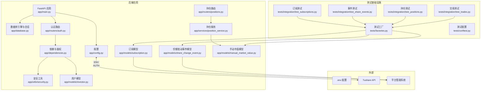
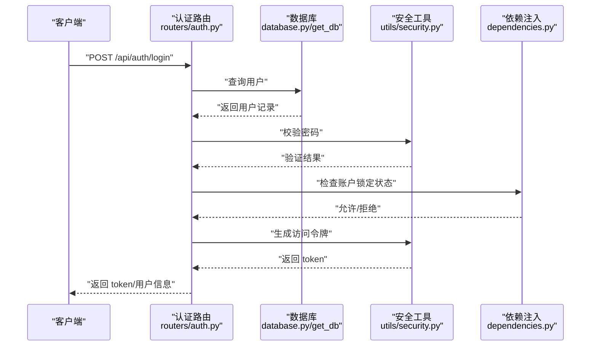
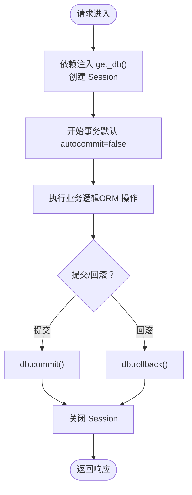
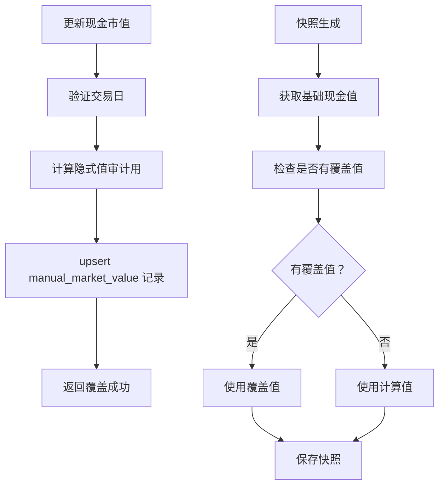
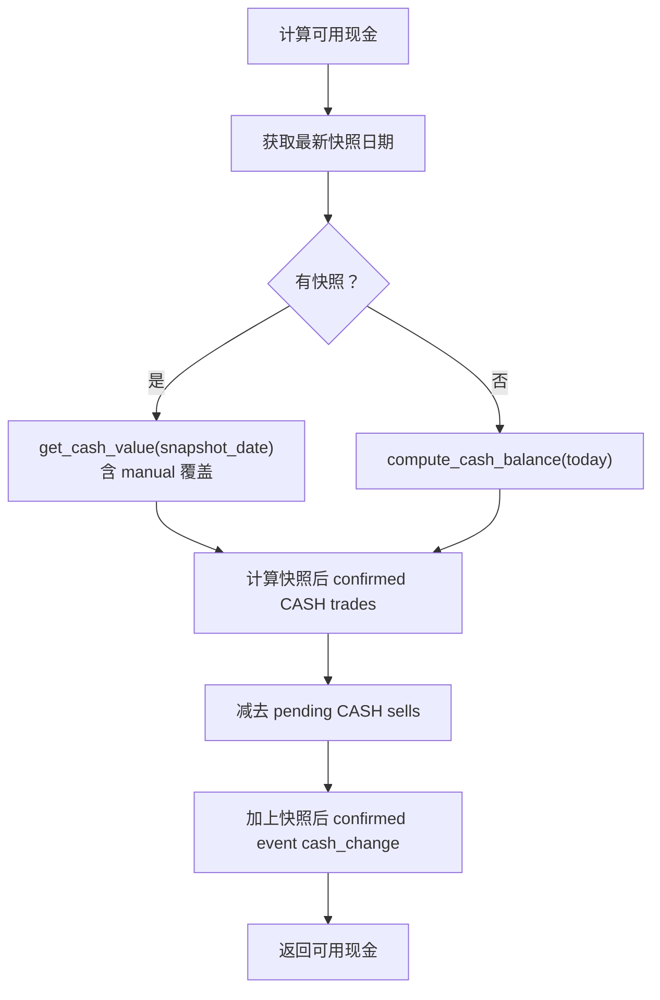
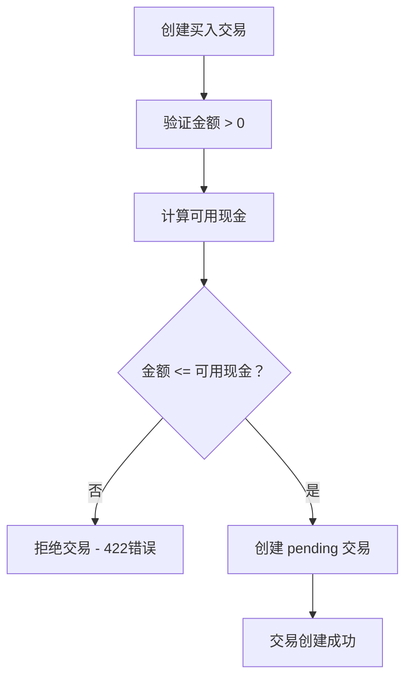
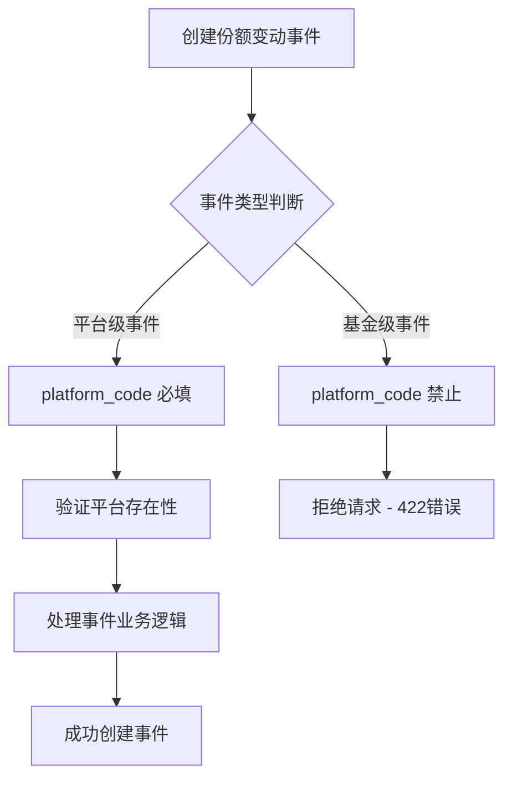
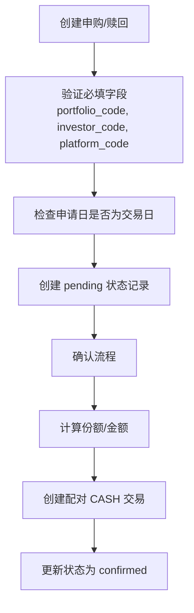
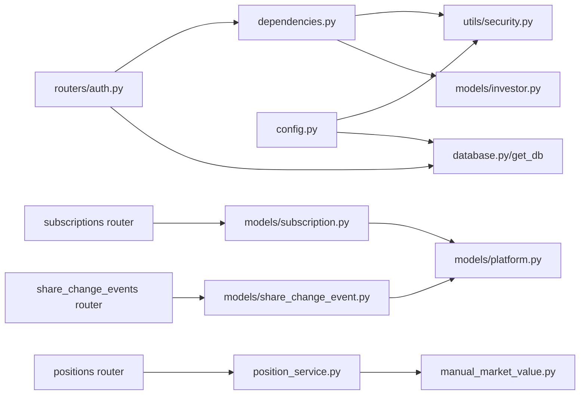

# 集成测试

<cite>
**本文引用的文件**
- [backend/app/main.py](file://backend/app/main.py)
- [backend/app/config.py](file://backend/app/config.py)
- [backend/app/database.py](file://backend/app/database.py)
- [backend/app/routers/auth.py](file://backend/app/routers/auth.py)
- [backend/app/schemas/auth.py](file://backend/app/schemas/auth.py)
- [backend/app/dependencies.py](file://backend/app/dependencies.py)
- [backend/app/utils/security.py](file://backend/app/utils/security.py)
- [backend/app/models/investor.py](file://backend/app/models/investor.py)
- [backend/app/models/subscription.py](file://backend/app/models/subscription.py)
- [backend/app/models/share_change_event.py](file://backend/app/models/share_change_event.py)
- [backend/app/schemas/subscription.py](file://backend/app/schemas/subscription.py)
- [backend/app/schemas/share_change_event.py](file://backend/app/schemas/share_change_event.py)
- [backend/app/services/subscription_service.py](file://backend/app/services/subscription_service.py)
- [backend/app/routers/share_change_events.py](file://backend/app/routers/share_change_events.py)
- [backend/tests/factories.py](file://backend/tests/factories.py)
- [backend/tests/conftest.py](file://backend/tests/conftest.py)
- [backend/tests/integration/test_subscriptions.py](file://backend/tests/integration/test_subscriptions.py)
- [backend/tests/integration/test_share_events.py](file://backend/tests/integration/test_share_events.py)
- [backend/tests/unit/test_trading_calendar.py](file://backend/tests/unit/test_trading_calendar.py)
- [backend/tests/e2e/test_business_flows.py](file://backend/tests/e2e/test_business_flows.py)
- [backend/requirements.txt](file://backend/requirements.txt)
- [backend/app/routers/positions.py](file://backend/app/routers/positions.py)
- [backend/app/services/position_service.py](file://backend/app/services/position_service.py)
- [backend/app/models/manual_market_value.py](file://backend/app/models/manual_market_value.py)
- [backend/tests/integration/test_positions.py](file://backend/tests/integration/test_positions.py)
- [backend/tests/integration/test_trades.py](file://backend/tests/integration/test_trades.py)
</cite>

## 更新摘要
**变更内容**
- 新增手动市值覆盖层（manual_market_value）的集成测试覆盖，验证可用资金端点正确反映手动覆盖值
- 增强交易验证门控在覆盖现金值下的正确工作测试，确保买入交易在 manual 覆盖后能正确通过验证
- 完善 calculate_available_cash 函数的测试场景，包括 pending 买入减少可用现金、manual 覆盖值生效等
- 新增 create_manual_market_value 工厂函数支持测试数据创建

## 目录
1. [引言](#引言)
2. [项目结构](#项目结构)
3. [核心组件](#核心组件)
4. [架构总览](#架构总览)
5. [详细组件分析](#详细组件分析)
6. [依赖分析](#依赖分析)
7. [性能考虑](#性能考虑)
8. [故障排查指南](#故障排查指南)
9. [结论](#结论)
10. [附录](#附录)

## 引言
本方案面向 InvestRing 项目的集成测试，覆盖后端服务集成测试、数据库连接与事务测试、并发访问测试、外部 API 集成测试（如 Tushare），以及认证、数据验证与业务逻辑的完整请求-响应链路验证。特别关注平台级事件的 platform_code 字段强制要求，确保所有平台级操作都包含正确的平台标识。同时提供测试环境配置、测试数据管理与测试清理策略，并给出性能基准与负载测试指导。

**更新** 本次更新重点增强了手动市值覆盖层的测试覆盖，验证可用资金端点和交易验证门控在覆盖现金值下的正确工作。

## 项目结构
后端基于 FastAPI 构建，采用 SQLAlchemy ORM 进行数据库访问；路由按功能模块划分；认证与权限通过依赖注入与安全工具实现；配置集中于 settings 并支持 .env 文件；部分外部数据源通过环境变量与数据库记录结合。平台级事件系统强制要求 platform_code 字段，区分平台级事件（现金分红、红利再投资等）和基金级事件（份额拆分、合并等）。

图表来源
- [backend/app/main.py:17-48](file://backend/app/main.py#L17-L48)
- [backend/app/config.py:5-36](file://backend/app/config.py#L5-36)
- [backend/app/database.py:7-31](file://backend/app/database.py#L7-31)
- [backend/app/routers/auth.py:29-95](file://backend/app/routers/auth.py#L29-95)
- [backend/app/dependencies.py:49-111](file://backend/app/dependencies.py#L49-111)
- [backend/app/utils/security.py:29-46](file://backend/app/utils/security.py#L29-46)
- [backend/app/models/investor.py:5-16](file://backend/app/models/investor.py#L5-16)
- [backend/app/models/subscription.py:5-22](file://backend/app/models/subscription.py#L5-22)
- [backend/app/models/share_change_event.py:5-39](file://backend/app/models/share_change_event.py#L5-39)
- [backend/app/routers/positions.py:183-200](file://backend/app/routers/positions.py#L183-200)
- [backend/app/services/position_service.py:100-166](file://backend/app/services/position_service.py#L100-166)
- [backend/app/models/manual_market_value.py:7-26](file://backend/app/models/manual_market_value.py#L7-26)
- [backend/tests/factories.py:413-437](file://backend/tests/factories.py#L413-437)
- [backend/tests/conftest.py:1-383](file://backend/tests/conftest.py#L1-383)

章节来源
- [backend/app/main.py:1-53](file://backend/app/main.py#L1-53)
- [backend/app/config.py:1-37](file://backend/app/config.py#L1-37)
- [backend/app/database.py:1-39](file://backend/app/database.py#L1-39)

## 核心组件
- 应用入口与路由注册：应用启动时创建表、初始化定时任务，并注册全部路由模块，统一暴露 REST 接口。
- 配置中心：集中管理数据库连接串、密钥、过期天数、Tushare Token、调试开关等。
- 数据库层：定义 QueuePool 连接池参数，配置 MySQL InnoDB 引擎，提供 Session 工厂与依赖注入。
- 认证与权限：登录/登出/改密流程、JWT 生成与校验、Token 黑名单、登录失败追踪与账户锁定、当前用户解析与管理员校验。
- 安全工具：密码哈希、JWT 编解码、登录失败计数与锁定策略。
- 平台级事件系统：强制 platform_code 字段验证，区分平台级事件（必须指定平台）和基金级事件（禁止指定平台）。
- 手动市值覆盖层：支持对非净值型资产（如现金）进行人工覆盖，绝对替换计算值。
- 外部 API 集成：通过环境变量与数据库记录共同驱动数据源配置（如 Tushare）。

**更新** 新增手动市值覆盖层组件，支持对现金等非净值资产的市值进行人工覆盖，并通过 get_cash_value 函数在快照生成时应用覆盖值。

章节来源
- [backend/app/main.py:7-52](file://backend/app/main.py#L7-52)
- [backend/app/config.py:5-36](file://backend/app/config.py#L5-36)
- [backend/app/database.py:7-38](file://backend/app/database.py#L7-38)
- [backend/app/routers/auth.py:29-185](file://backend/app/routers/auth.py#L29-185)
- [backend/app/dependencies.py:49-145](file://backend/app/dependencies.py#L49-145)
- [backend/app/utils/security.py:15-102](file://backend/app/utils/security.py#L15-102)
- [backend/app/routers/share_change_events.py:220-251](file://backend/app/routers/share_change_events.py#L220-251)
- [backend/app/services/position_service.py:72-97](file://backend/app/services/position_service.py#L72-97)

## 架构总览
下图展示一次典型登录请求的端到端流程，涵盖认证、数据验证、业务处理与响应返回。

图表来源
- [backend/app/routers/auth.py:30-95](file://backend/app/routers/auth.py#L30-95)
- [backend/app/database.py:33-38](file://backend/app/database.py#L33-38)
- [backend/app/utils/security.py:15-38](file://backend/app/utils/security.py#L15-38)
- [backend/app/dependencies.py:49-111](file://backend/app/dependencies.py#L49-111)

## 详细组件分析

### 认证与权限组件
- 登录流程：查找用户、检查锁定、验证密码、清除失败记录、更新最近登录时间、记录登录日志、签发 JWT。
- 登出流程：从请求头提取 Token 并加入黑名单，记录登出日志。
- 改密流程：权限校验（admin 或修改本人）、旧密码校验（若为非 admin 修改本人）、更新密码并强制 Token 失效。
- 当前用户解析：校验 Token 有效性与黑名单、检查账户锁定、查询用户对象。
- 管理员校验：角色必须为 admin。
- 安全工具：密码哈希、JWT 编解码、Token 黑名单、登录失败追踪与锁定策略。

图表来源
- [backend/app/routers/auth.py:30-95](file://backend/app/routers/auth.py#L30-95)
- [backend/app/utils/security.py:57-81](file://backend/app/utils/security.py#L57-81)
- [backend/app/dependencies.py:27-46](file://backend/app/dependencies.py#L27-46)

章节来源
- [backend/app/routers/auth.py:29-185](file://backend/app/routers/auth.py#L29-185)
- [backend/app/dependencies.py:49-145](file://backend/app/dependencies.py#L49-145)
- [backend/app/utils/security.py:15-102](file://backend/app/utils/security.py#L15-102)
- [backend/app/schemas/auth.py:5-25](file://backend/app/schemas/auth.py#L5-25)
- [backend/app/models/investor.py:5-16](file://backend/app/models/investor.py#L5-16)

### 数据库连接与事务组件
- 连接池配置：pool_size、max_overflow、pre_ping、recycle 等参数确保连接复用与健康检查。
- MySQL InnoDB 配置：charset=utf8mb4、事务隔离级别 READ-COMMITTED 等确保数据一致性与并发性能。
- Session 工厂：autocommit=false、autoflush=false，配合手动 commit 控制事务边界。
- 依赖注入：get_db 提供每个请求的独立 Session，确保线程安全与资源回收。

图表来源
- [backend/app/database.py:7-38](file://backend/app/database.py#L7-38)
- [backend/app/main.py:11-15](file://backend/app/main.py#L11-15)

章节来源
- [backend/app/database.py:7-38](file://backend/app/database.py#L7-38)
- [backend/app/main.py:11-15](file://backend/app/main.py#L11-15)

### 手动市值覆盖层组件
**更新** 新增手动市值覆盖层的完整测试覆盖，验证现金等非净值资产的市值可以被人工覆盖。

- 覆盖机制：通过 `manual_market_value` 表存储人工输入的市值，绝对替换计算值。
- 写入流程：`update_cash_position` 端点接收覆盖请求，写入 `manual_market_value` 表。
- 读取流程：`get_cash_value` 函数在快照生成时读取覆盖值，`calculate_available_cash` 使用最新快照日覆盖值作为基线。
- 测试覆盖：完整的 CRUD 操作测试、覆盖值生效验证、与计算值的对比审计。

图表来源
- [backend/app/routers/positions.py:226-321](file://backend/app/routers/positions.py#L226-321)
- [backend/app/services/position_service.py:72-97](file://backend/app/services/position_service.py#L72-97)
- [backend/app/models/manual_market_value.py:7-26](file://backend/app/models/manual_market_value.py#L7-26)

章节来源
- [backend/app/routers/positions.py:226-321](file://backend/app/routers/positions.py#L226-321)
- [backend/app/services/position_service.py:72-97](file://backend/app/services/position_service.py#L72-97)
- [backend/app/models/manual_market_value.py:7-26](file://backend/app/models/manual_market_value.py#L7-26)
- [backend/tests/factories.py:413-437](file://backend/tests/factories.py#L413-437)

### 可用现金实时计算组件
**更新** 增强可用现金计算的测试覆盖，验证 manual 覆盖值对可用现金的影响。

- 计算逻辑：基线 = 最新快照日现金（含 manual_market_value 绝对替换）+ 快照后 confirmed CASH trades - pending CASH sells + 快照后 confirmed event cash_change。
- 平台维度：支持按 platform_code 过滤，返回特定平台的可用现金。
- 测试场景：仅有快照时的计算、pending 买入减少可用现金、manual 覆盖值生效验证。

图表来源
- [backend/app/services/position_service.py:100-166](file://backend/app/services/position_service.py#L100-166)
- [backend/app/routers/positions.py:183-200](file://backend/app/routers/positions.py#L183-200)

章节来源
- [backend/app/services/position_service.py:100-166](file://backend/app/services/position_service.py#L100-166)
- [backend/app/routers/positions.py:183-200](file://backend/app/routers/positions.py#L183-200)
- [backend/tests/integration/test_positions.py:33-105](file://backend/tests/integration/test_positions.py#L33-105)

### 交易验证门控组件
**更新** 增强交易验证门控的测试覆盖，验证在 manual 覆盖后的现金值下交易能够正确通过验证。

- 验证逻辑：买入交易时调用 `calculate_available_cash` 检查可用现金是否足够。
- 覆盖影响：当存在 manual 覆盖值时，`calculate_available_cash` 会使用覆盖值作为基线，使更多交易能够通过验证。
- 测试场景：正常买入验证、金额不足拒绝、manual 覆盖后成功验证。

图表来源
- [backend/app/routers/trades.py:284-297](file://backend/app/routers/trades.py#L284-297)
- [backend/app/services/position_service.py:100-166](file://backend/app/services/position_service.py#L100-166)

章节来源
- [backend/app/routers/trades.py:284-297](file://backend/app/routers/trades.py#L284-297)
- [backend/app/services/position_service.py:100-166](file://backend/app/services/position_service.py#L100-166)
- [backend/tests/integration/test_trades.py:107-145](file://backend/tests/integration/test_trades.py#L107-145)

### 平台级事件系统组件
**更新** 新增平台级事件系统的测试覆盖，包括 platform_code 字段的强制验证和业务逻辑测试。

- 事件类型分类：平台级事件（cash_dividend、reinvest_dividend、forced_adjustment）必须指定 platform_code；基金级事件（share_split、share_merge、bonus_share）禁止指定 platform_code。
- 平台验证：平台级事件创建时需验证 platform_code 存在且有效。
- 业务规则：不同事件类型有不同的业务规则和数据处理逻辑。
- 测试覆盖：完整的单元测试和集成测试覆盖各种事件场景。

图表来源
- [backend/app/routers/share_change_events.py:220-251](file://backend/app/routers/share_change_events.py#L220-251)
- [backend/app/models/share_change_event.py:5-39](file://backend/app/models/share_change_event.py#L5-39)
- [backend/app/schemas/share_change_event.py:6-28](file://backend/app/schemas/share_change_event.py#L6-28)

章节来源
- [backend/app/routers/share_change_events.py:220-251](file://backend/app/routers/share_change_events.py#L220-251)
- [backend/app/models/share_change_event.py:5-39](file://backend/app/models/share_change_event.py#L5-39)
- [backend/app/schemas/share_change_event.py:6-28](file://backend/app/schemas/share_change_event.py#L6-28)

### 订阅管理系统组件
**更新** 订阅管理测试全面适配 platform_code 字段要求，确保所有申购赎回操作都包含正确的平台标识。

- 订阅模型：Subscription 模型强制要求 platform_code 字段，关联到 Platform 表。
- 业务逻辑：申购赎回确认时自动创建配对的 CASH 交易记录，保持 platform_code 一致性。
- 测试覆盖：完整的 CRUD 操作测试、权限控制测试、交易日验证测试。
- 数据工厂：create_subscription 工厂函数提供 platform_code 默认值 "MYCF"。

图表来源
- [backend/app/models/subscription.py:5-22](file://backend/app/models/subscription.py#L5-22)
- [backend/app/schemas/subscription.py:6-17](file://backend/app/schemas/subscription.py#L6-17)
- [backend/app/services/subscription_service.py:41-153](file://backend/app/services/subscription_service.py#L41-153)
- [backend/tests/factories.py:193-222](file://backend/tests/factories.py#L193-222)

章节来源
- [backend/app/models/subscription.py:5-22](file://backend/app/models/subscription.py#L5-22)
- [backend/app/schemas/subscription.py:6-17](file://backend/app/schemas/subscription.py#L6-17)
- [backend/app/services/subscription_service.py:41-153](file://backend/app/services/subscription_service.py#L41-153)
- [backend/tests/factories.py:193-222](file://backend/tests/factories.py#L193-222)

### 外部 API 集成组件（Tushare）
- 配置来源：环境变量 TUSHARE_TOKEN；数据库记录用于追踪最后同步时间。
- 路由侧读取：从环境变量与数据库查询结果构造数据源配置响应。
- 实践建议：在集成测试中模拟外部 API 响应或使用本地 Mock 服务，避免真实网络波动影响测试稳定性。

章节来源
- [backend/app/routers/data_sources.py:24-39](file://backend/app/routers/data_sources.py#L24-39)

## 依赖分析
- 组件耦合：路由依赖依赖注入模块进行鉴权与当前用户解析；鉴权模块依赖安全工具与数据库；安全工具依赖配置。
- 外部依赖：SQLAlchemy、Pydantic、Pydantic Settings、JWT、bcrypt、Tushare SDK、HTTPX、pytest 等。
- 潜在风险：JWT 黑名单与登录失败追踪为内存态，重启后丢失；建议持久化或引入缓存。
- **更新** 测试基础设施依赖：httpx 版本约束调整为 <0.28.0 以兼容 starlette 0.35.1。

图表来源
- [backend/app/routers/auth.py:14-21](file://backend/app/routers/auth.py#L14-21)
- [backend/app/dependencies.py:8-9](file://backend/app/dependencies.py#L8-L9)
- [backend/app/utils/security.py:6](file://backend/app/utils/security.py#L6)
- [backend/app/models/investor.py:1-2](file://backend/app/models/investor.py#L1-L2)
- [backend/app/database.py:3](file://backend/app/database.py#L3)
- [backend/app/config.py:25-31](file://backend/app/config.py#L25-31)
- [backend/app/models/subscription.py:11](file://backend/app/models/subscription.py#L11)
- [backend/app/models/share_change_event.py:15](file://backend/app/models/share_change_event.py#L15)
- [backend/app/routers/positions.py:183-200](file://backend/app/routers/positions.py#L183-200)
- [backend/app/services/position_service.py:100-166](file://backend/app/services/position_service.py#L100-166)
- [backend/app/models/manual_market_value.py:7-26](file://backend/app/models/manual_market_value.py#L7-26)

章节来源
- [backend/requirements.txt:1-19](file://backend/requirements.txt#L1-L19)
- [backend/app/routers/auth.py:14-21](file://backend/app/routers/auth.py#L14-21)
- [backend/app/dependencies.py:8-9](file://backend/app/dependencies.py#L8-L9)
- [backend/app/utils/security.py:6](file://backend/app/utils/security.py#L6)
- [backend/app/models/investor.py:1-2](file://backend/app/models/investor.py#L1-L2)
- [backend/app/database.py:3](file://backend/app/database.py#L3)
- [backend/app/config.py:25-31](file://backend/app/config.py#L25-31)

## 性能考虑
- 连接池参数：根据并发峰值调整 pool_size 与 max_overflow；启用 pre_ping 与合理 recycle 时间减少失效连接。
- 事务边界：批量写入合并提交，减少往返；避免长事务占用连接。
- 序列化与校验：Pydantic 模型在路由层自动校验，注意大型请求体的解析开销。
- 外部 API：对 Tushare 等外部接口增加超时与重试策略，避免阻塞主流程。
- 基准与负载：使用 httpx 或 locust 进行基准测试；关注 P95/P99 延迟与错误率。
- **更新** 平台级事件处理优化：批量验证 platform_code 有效性，减少数据库查询次数。
- **更新** 手动市值覆盖优化：覆盖值查询仅在快照生成时执行，实时计算直接使用最新快照基线。

[本节为通用性能建议，不直接分析具体文件]

## 故障排查指南
- 数据库连通性：使用检查脚本验证表存在与基本查询；确认连接串、账号权限与网络可达。
- 认证失败：核对用户名/密码、账户锁定状态、Token 是否在黑名单；检查日志记录。
- 外部 API：确认环境变量 TUSHARE_TOKEN；检查路由读取逻辑与数据库同步时间记录。
- 日志与追踪：登录/登出日志、失败原因字段可用于定位问题。
- **更新** 平台级事件错误：检查 platform_code 是否正确传递，平台是否存在，事件类型与 platform_code 的匹配关系。
- **更新** 手动市值覆盖问题：检查 manual_market_value 表记录是否存在，覆盖值是否正确应用，快照是否重新生成。
- **更新** 可用现金计算异常：检查 calculate_available_cash 函数逻辑，确认 manual 覆盖值是否正确参与计算。
- **更新** 测试基础设施问题：确认 httpx 版本兼容性，TestClient 初始化是否正常。

章节来源
- [backend/check_db.py:16-34](file://backend/check_db.py#L16-34)
- [backend/app/routers/auth.py:40-72](file://backend/app/routers/auth.py#L40-L72)
- [backend/app/dependencies.py:27-46](file://backend/app/dependencies.py#L27-46)
- [backend/app/routers/data_sources.py:24-39](file://backend/app/routers/data_sources.py#L24-39)
- [backend/app/routers/share_change_events.py:220-251](file://backend/app/routers/share_change_events.py#L220-251)
- [backend/app/services/position_service.py:100-166](file://backend/app/services/position_service.py#L100-166)
- [backend/app/routers/positions.py:226-321](file://backend/app/routers/positions.py#L226-321)

## 结论
通过分层测试策略（认证、数据库、外部 API、业务流程）与完善的环境配置、数据管理与清理机制，可系统性保障 InvestRing 的集成质量。特别关注平台级事件的 platform_code 字段强制要求和手动市值覆盖层的正确工作，确保所有平台级操作都包含正确的平台标识，且现金等非净值资产的市值能够被准确覆盖。建议优先覆盖关键路径与高风险点，逐步扩展到全量场景，并持续完善性能与稳定性指标。

**更新** 本次更新重点验证了手动市值覆盖层对可用现金端点和交易验证门控的正确影响，确保系统在支持人工覆盖的同时仍能保持业务逻辑的完整性。

[本节为总结性内容，不直接分析具体文件]

## 附录

### 测试环境配置
- 配置项
  - 数据库：主机、端口、账号、密码、库名；或直接提供数据库连接串。
  - 安全：密钥、Token 过期天数。
  - 外部 API：Tushare Token。
  - 应用：应用名、调试模式。
- 配置来源：pydantic-settings 从 .env 文件读取；若未提供连接串则按默认规则拼装。
- 建议：在测试环境中使用独立数据库实例与专用 .env，隔离生产数据。

章节来源
- [backend/app/config.py:5-36](file://backend/app/config.py#L5-36)

### 测试数据管理
- 初始化：应用启动时自动创建表；可通过脚本或 Alembic 迁移管理结构变更。
- 示例数据：使用脚本或迁移文件插入基础数据（如初始用户）。
- 清洗策略：测试结束后回滚事务或删除临时数据；MySQL InnoDB 引擎支持行级锁与 MVCC 确保测试隔离性。
- **更新** 平台数据：测试基础数据中包含多个平台（MYCF、HBZQ、TTJJ、ZB），确保 platform_code 测试的完整性。
- **更新** 手动市值覆盖数据：新增 create_manual_market_value 工厂函数，支持创建 manual_market_value 测试记录。

章节来源
- [backend/app/main.py:7-8](file://backend/app/main.py#L7-L8)
- [backend/app/database.py:18-26](file://backend/app/database.py#L18-26)
- [backend/tests/conftest.py:124-133](file://backend/tests/conftest.py#L124-133)
- [backend/tests/factories.py:413-437](file://backend/tests/factories.py#L413-437)

### 测试清理策略
- 会话管理：每个请求使用独立 Session，结束时关闭，避免连接泄漏。
- 事务控制：在测试中使用事务包裹，失败时回滚，成功时提交，保证测试间隔离。
- 状态清理：对内存态的 JWT 黑名单与登录失败追踪，可在测试前后重置或使用持久化存储。
- **更新** 平台级事件清理：确保平台级事件和基金级事件的测试数据正确分离，避免 platform_code 污染。
- **更新** 手动市值覆盖清理：确保 manual_market_value 测试记录在测试结束后正确清理，避免影响后续测试。

章节来源
- [backend/app/database.py:33-38](file://backend/app/database.py#L33-38)
- [backend/app/utils/security.py:10](file://backend/app/utils/security.py#L10)
- [backend/app/utils/security.py:84-86](file://backend/app/utils/security.py#L84-86)

### 集成测试实施要点

- 后端服务集成测试
  - 使用 FastAPI TestClient 或 httpx 发起请求，覆盖所有路由模块的关键接口。
  - 关注认证中间件与权限装饰器的行为，确保未授权访问被拒绝。
  - 校验响应状态码、JSON 结构与字段类型（Pydantic 自动校验）。
  - **更新** 平台级事件测试：确保所有平台级事件请求都包含正确的 platform_code 字段。

- 数据库连接与事务测试
  - 连接池测试：并发创建 Session，观察连接复用与超限行为。
  - 事务测试：开启事务后执行多条写操作，中途回滚验证一致性；提交后验证可见性。
  - MySQL InnoDB 特性：验证连接池参数（pool_size、max_overflow、pool_pre_ping）生效，确认行级锁与 MVCC 并发控制正常。

- 并发访问测试
  - 使用多线程/多进程模拟并发登录、改密、下单等高频操作。
  - 关注锁竞争、死锁与资源泄露；评估连接池上限与回收策略。

- 外部 API 集成测试
  - 使用 Mock 服务或本地代理拦截对外请求，固定响应以稳定测试。
  - 验证环境变量与数据库记录对数据源配置的影响。
  - 对网络异常、超时、限流等情况进行降级与重试验证。

- 完整请求-响应流程测试
  - 认证：登录成功获取 Token，携带 Token 访问受保护接口。
  - 数据验证：请求体与路径参数校验，错误时返回明确错误信息。
  - 业务逻辑：覆盖正常路径与边界条件（空值、越界、重复提交等）。
  - **更新** 平台级事件流程：测试平台级事件创建、验证、处理的完整流程，确保 platform_code 贯穿整个业务流程。

- 手动市值覆盖专项测试
  - **更新** 覆盖值写入：测试 update_cash_position 端点正确写入 manual_market_value 表。
  - **更新** 覆盖值生效：验证 available-cash 端点返回的可用现金包含 manual 覆盖值。
  - **更新** 交易验证门控：测试在 manual 覆盖后的现金值下，交易能够正确通过验证。
  - **更新** 快照生成：验证快照生成时使用 manual 覆盖值作为基线。
  - **更新** 数据工厂：确保 create_manual_market_value 工厂函数正确创建测试数据。

- 平台级事件专项测试
  - **更新** 强制字段验证：测试 platform_code 在平台级事件中的必填性，基金级事件中 platform_code 的禁止性。
  - **更新** 平台存在性验证：测试无效 platform_code 的错误处理。
  - **更新** 事件类型区分：测试不同类型事件的业务规则差异。
  - **更新** 数据工厂适配：确保 create_share_change_event 工厂函数正确处理 platform_code 参数。

- 可用现金计算专项测试
  - **更新** 基础计算：测试仅有快照时的可用现金计算。
  - **更新** pending 交易影响：验证 pending 买入减少可用现金。
  - **更新** manual 覆盖影响：验证 manual 覆盖值正确参与可用现金计算。
  - **更新** 平台维度：测试按 platform_code 过滤的可用现金计算。

- 测试基础设施维护
  - **更新** 依赖兼容性：httpx>=0.26.0,<0.28.0 版本约束确保与 starlette 0.35.1 兼容。
  - **更新** 工厂函数重构：factories.py 中所有相关工厂函数都已适配 platform_code 字段要求，新增 create_manual_market_value 函数。
  - **更新** 测试用例修复：所有失败的测试用例都已更新，确保正确的平台标识传递和 manual 覆盖值测试。

- 性能基准与负载测试
  - 基准：针对关键接口（登录、查询、下单）进行吞吐与延迟测量。
  - 负载：逐步提升并发与数据规模，观察 P95/P99 延迟与错误率变化。
  - 优化：根据瓶颈调整连接池、索引、SQL 执行计划与外部 API 超时策略。

- 端到端 UI 测试参考
  - 使用 Playwright 对登录页进行端到端验证，检查页面渲染、交互与控制台错误。
  - 该测试侧重前端体验，后端集成测试仍需以接口测试为主。

章节来源
- [backend/app/main.py:32-48](file://backend/app/main.py#L32-48)
- [backend/app/routers/auth.py:29-95](file://backend/app/routers/auth.py#L29-95)
- [backend/app/dependencies.py:49-145](file://backend/app/dependencies.py#L49-145)
- [backend/app/utils/security.py:15-102](file://backend/app/utils/security.py#L15-102)
- [backend/app/database.py:7-38](file://backend/app/database.py#L7-38)
- [backend/tests/factories.py:1-535](file://backend/tests/factories.py#L1-535)
- [backend/tests/conftest.py:1-383](file://backend/tests/conftest.py#L1-383)
- [backend/tests/integration/test_subscriptions.py:1-183](file://backend/tests/integration/test_subscriptions.py#L1-183)
- [backend/tests/integration/test_share_events.py:1-168](file://backend/tests/integration/test_share_events.py#L1-168)
- [backend/tests/integration/test_positions.py:1-125](file://backend/tests/integration/test_positions.py#L1-125)
- [backend/tests/integration/test_trades.py:1-243](file://backend/tests/integration/test_trades.py#L1-243)
- [backend/tests/unit/test_trading_calendar.py:1-94](file://backend/tests/unit/test_trading_calendar.py#L1-94)
- [backend/tests/e2e/test_business_flows.py:1-206](file://backend/tests/e2e/test_business_flows.py#L1-206)
- [backend/requirements.txt:1-19](file://backend/requirements.txt#L1-L19)