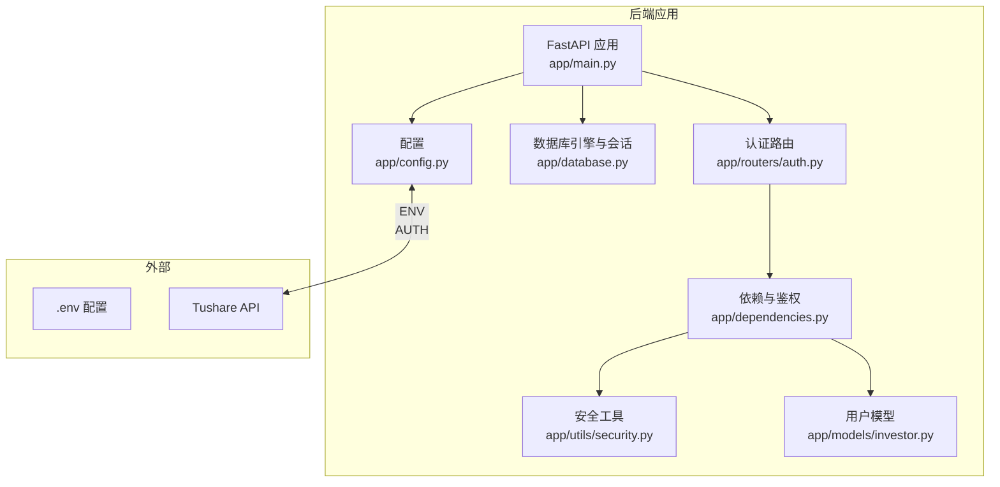
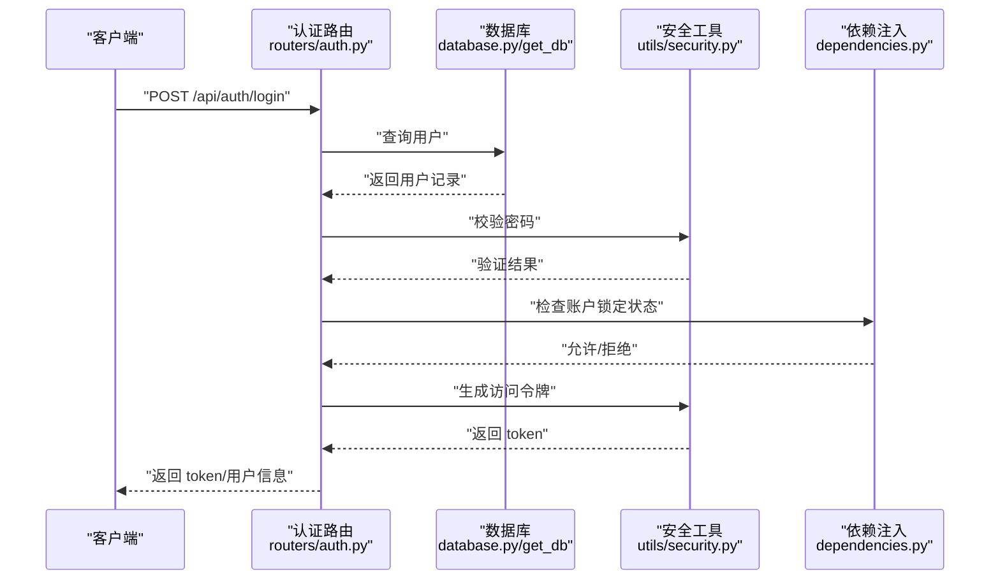
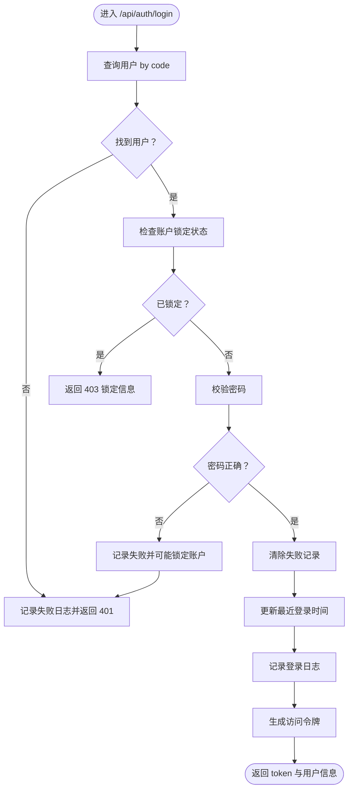
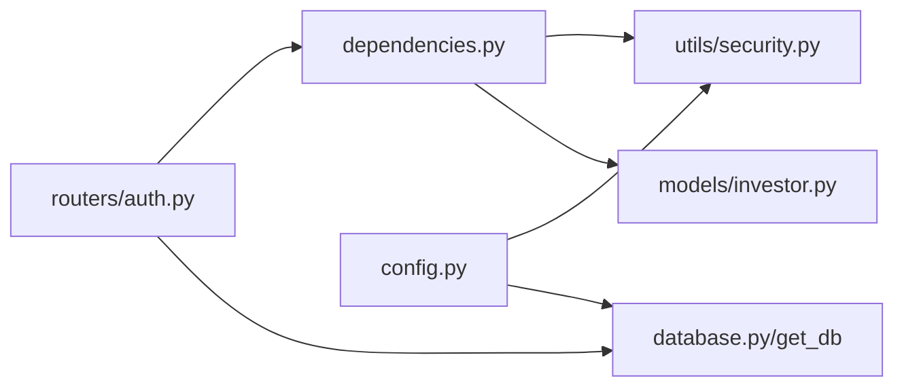

# 集成测试

<cite>
**本文引用的文件**
- [backend/app/main.py](file://backend/app/main.py)
- [backend/app/config.py](file://backend/app/config.py)
- [backend/app/database.py](file://backend/app/database.py)
- [backend/app/routers/auth.py](file://backend/app/routers/auth.py)
- [backend/app/schemas/auth.py](file://backend/app/schemas/auth.py)
- [backend/app/dependencies.py](file://backend/app/dependencies.py)
- [backend/app/utils/security.py](file://backend/app/utils/security.py)
- [backend/app/models/investor.py](file://backend/app/models/investor.py)
- [backend/requirements.txt](file://backend/requirements.txt)
- [backend/check_db.py](file://backend/check_db.py)
- [backend/test_update_cash_api.py](file://backend/test_update_cash_api.py)
- [backend/test_update_cash_detailed.py](file://backend/test_update_cash_detailed.py)
- [test_login.py](file://test_login.py)
</cite>

## 目录
1. [引言](#引言)
2. [项目结构](#项目结构)
3. [核心组件](#核心组件)
4. [架构总览](#架构总览)
5. [详细组件分析](#详细组件分析)
6. [依赖分析](#依赖分析)
7. [性能考虑](#性能考虑)
8. [故障排查指南](#故障排查指南)
9. [结论](#结论)
10. [附录](#附录)

## 引言
本方案面向 InvestRing 项目的集成测试，覆盖后端服务集成测试、数据库连接与事务测试、并发访问测试、外部 API 集成测试（如 Tushare），以及认证、数据验证与业务逻辑的完整请求-响应链路验证。同时提供测试环境配置、测试数据管理与测试清理策略，并给出性能基准与负载测试指导。

## 项目结构
后端基于 FastAPI 构建，采用 SQLAlchemy ORM 进行数据库访问；路由按功能模块划分；认证与权限通过依赖注入与安全工具实现；配置集中于 settings 并支持 .env 文件；部分外部数据源通过环境变量与数据库记录结合。

图表来源
- [backend/app/main.py:17-48](file://backend/app/main.py#L17-L48)
- [backend/app/config.py:5-36](file://backend/app/config.py#L5-L36)
- [backend/app/database.py:7-31](file://backend/app/database.py#L7-L31)
- [backend/app/routers/auth.py:29-95](file://backend/app/routers/auth.py#L29-L95)
- [backend/app/dependencies.py:49-111](file://backend/app/dependencies.py#L49-L111)
- [backend/app/utils/security.py:29-46](file://backend/app/utils/security.py#L29-L46)
- [backend/app/models/investor.py:5-16](file://backend/app/models/investor.py#L5-L16)

章节来源
- [backend/app/main.py:1-53](file://backend/app/main.py#L1-L53)
- [backend/app/config.py:1-37](file://backend/app/config.py#L1-L37)
- [backend/app/database.py:1-39](file://backend/app/database.py#L1-L39)

## 核心组件
- 应用入口与路由注册：应用启动时创建表、初始化定时任务，并注册全部路由模块，统一暴露 REST 接口。
- 配置中心：集中管理数据库连接串、密钥、过期天数、Tushare Token、调试开关等。
- 数据库层：定义 QueuePool 连接池参数，配置 MySQL InnoDB 引擎，提供 Session 工厂与依赖注入。
- 认证与权限：登录/登出/改密流程、JWT 生成与校验、Token 黑名单、登录失败追踪与账户锁定、当前用户解析与管理员校验。
- 安全工具：密码哈希、JWT 编解码、登录失败计数与锁定策略。
- 外部 API 集成：通过环境变量与数据库记录共同驱动数据源配置（如 Tushare）。

章节来源
- [backend/app/main.py:7-52](file://backend/app/main.py#L7-L52)
- [backend/app/config.py:5-36](file://backend/app/config.py#L5-L36)
- [backend/app/database.py:7-38](file://backend/app/database.py#L7-L38)
- [backend/app/routers/auth.py:29-185](file://backend/app/routers/auth.py#L29-L185)
- [backend/app/dependencies.py:49-145](file://backend/app/dependencies.py#L49-L145)
- [backend/app/utils/security.py:15-102](file://backend/app/utils/security.py#L15-L102)

## 架构总览
下图展示一次典型登录请求的端到端流程，涵盖认证、数据验证、业务处理与响应返回。

图表来源
- [backend/app/routers/auth.py:30-95](file://backend/app/routers/auth.py#L30-L95)
- [backend/app/database.py:33-38](file://backend/app/database.py#L33-L38)
- [backend/app/utils/security.py:15-38](file://backend/app/utils/security.py#L15-L38)
- [backend/app/dependencies.py:49-111](file://backend/app/dependencies.py#L49-L111)

## 详细组件分析

### 认证与权限组件
- 登录流程：查找用户、检查锁定、验证密码、清除失败记录、更新最近登录时间、记录登录日志、签发 JWT。
- 登出流程：从请求头提取 Token 并加入黑名单，记录登出日志。
- 改密流程：权限校验（admin 或修改本人）、旧密码校验（若为非 admin 修改本人）、更新密码并强制 Token 失效。
- 当前用户解析：校验 Token 有效性与黑名单、检查账户锁定、查询用户对象。
- 管理员校验：角色必须为 admin。
- 安全工具：密码哈希、JWT 编解码、Token 黑名单、登录失败追踪与锁定策略。

图表来源
- [backend/app/routers/auth.py:30-95](file://backend/app/routers/auth.py#L30-L95)
- [backend/app/utils/security.py:57-81](file://backend/app/utils/security.py#L57-L81)
- [backend/app/dependencies.py:27-46](file://backend/app/dependencies.py#L27-L46)

章节来源
- [backend/app/routers/auth.py:29-185](file://backend/app/routers/auth.py#L29-L185)
- [backend/app/dependencies.py:49-145](file://backend/app/dependencies.py#L49-L145)
- [backend/app/utils/security.py:15-102](file://backend/app/utils/security.py#L15-L102)
- [backend/app/schemas/auth.py:5-25](file://backend/app/schemas/auth.py#L5-L25)
- [backend/app/models/investor.py:5-16](file://backend/app/models/investor.py#L5-L16)

### 数据库连接与事务组件
- 连接池配置：pool_size、max_overflow、pre_ping、recycle 等参数确保连接复用与健康检查。
- MySQL InnoDB 配置：charset=utf8mb4、事务隔离级别 READ-COMMITTED 等确保数据一致性与并发性能。
- Session 工厂：autocommit=false、autoflush=false，配合手动 commit 控制事务边界。
- 依赖注入：get_db 提供每个请求的独立 Session，确保线程安全与资源回收。

图表来源
- [backend/app/database.py:7-38](file://backend/app/database.py#L7-L38)
- [backend/app/main.py:11-15](file://backend/app/main.py#L11-L15)

章节来源
- [backend/app/database.py:7-38](file://backend/app/database.py#L7-L38)
- [backend/app/main.py:11-15](file://backend/app/main.py#L11-L15)

### 外部 API 集成组件（Tushare）
- 配置来源：环境变量 TUSHARE_TOKEN；数据库记录用于追踪最后同步时间。
- 路由侧读取：从环境变量与数据库查询结果构造数据源配置响应。
- 实践建议：在集成测试中模拟外部 API 响应或使用本地 Mock 服务，避免真实网络波动影响测试稳定性。

章节来源
- [backend/app/routers/data_sources.py:24-39](file://backend/app/routers/data_sources.py#L24-L39)

## 依赖分析
- 组件耦合：路由依赖依赖注入模块进行鉴权与当前用户解析；鉴权模块依赖安全工具与数据库；安全工具依赖配置。
- 外部依赖：SQLAlchemy、Pydantic、Pydantic Settings、JWT、bcrypt、Tushare SDK、HTTPX、pytest 等。
- 潜在风险：JWT 黑名单与登录失败追踪为内存态，重启后丢失；建议持久化或引入缓存。

图表来源
- [backend/app/routers/auth.py:14-21](file://backend/app/routers/auth.py#L14-L21)
- [backend/app/dependencies.py:8-9](file://backend/app/dependencies.py#L8-L9)
- [backend/app/utils/security.py:6](file://backend/app/utils/security.py#L6)
- [backend/app/models/investor.py:1-2](file://backend/app/models/investor.py#L1-L2)
- [backend/app/database.py:3](file://backend/app/database.py#L3)
- [backend/app/config.py:25-31](file://backend/app/config.py#L25-L31)

章节来源
- [backend/requirements.txt:1-19](file://backend/requirements.txt#L1-L19)
- [backend/app/routers/auth.py:14-21](file://backend/app/routers/auth.py#L14-L21)
- [backend/app/dependencies.py:8-9](file://backend/app/dependencies.py#L8-L9)
- [backend/app/utils/security.py:6](file://backend/app/utils/security.py#L6)
- [backend/app/models/investor.py:1-2](file://backend/app/models/investor.py#L1-L2)
- [backend/app/database.py:3](file://backend/app/database.py#L3)
- [backend/app/config.py:25-31](file://backend/app/config.py#L25-L31)

## 性能考虑
- 连接池参数：根据并发峰值调整 pool_size 与 max_overflow；启用 pre_ping 与合理 recycle 时间减少失效连接。
- 事务边界：批量写入合并提交，减少往返；避免长事务占用连接。
- 序列化与校验：Pydantic 模型在路由层自动校验，注意大型请求体的解析开销。
- 外部 API：对 Tushare 等外部接口增加超时与重试策略，避免阻塞主流程。
- 基准与负载：使用 httpx 或 locust 进行基准测试；关注 P95/P99 延迟与错误率。

[本节为通用性能建议，不直接分析具体文件]

## 故障排查指南
- 数据库连通性：使用检查脚本验证表存在与基本查询；确认连接串、账号权限与网络可达。
- 认证失败：核对用户名/密码、账户锁定状态、Token 是否在黑名单；检查日志记录。
- 外部 API：确认环境变量 TUSHARE_TOKEN；检查路由读取逻辑与数据库同步时间记录。
- 日志与追踪：登录/登出日志、失败原因字段可用于定位问题。

章节来源
- [backend/check_db.py:16-34](file://backend/check_db.py#L16-L34)
- [backend/app/routers/auth.py:40-72](file://backend/app/routers/auth.py#L40-L72)
- [backend/app/dependencies.py:27-46](file://backend/app/dependencies.py#L27-L46)
- [backend/app/routers/data_sources.py:24-39](file://backend/app/routers/data_sources.py#L24-L39)

## 结论
通过分层测试策略（认证、数据库、外部 API、业务流程）与完善的环境配置、数据管理与清理机制，可系统性保障 InvestRing 的集成质量。建议优先覆盖关键路径与高风险点，逐步扩展到全量场景，并持续完善性能与稳定性指标。

[本节为总结性内容，不直接分析具体文件]

## 附录

### 测试环境配置
- 配置项
  - 数据库：主机、端口、账号、密码、库名；或直接提供数据库连接串。
  - 安全：密钥、Token 过期天数。
  - 外部 API：Tushare Token。
  - 应用：应用名、调试模式。
- 配置来源：pydantic-settings 从 .env 文件读取；若未提供连接串则按默认规则拼装。
- 建议：在测试环境中使用独立数据库实例与专用 .env，隔离生产数据。

章节来源
- [backend/app/config.py:5-36](file://backend/app/config.py#L5-L36)

### 测试数据管理
- 初始化：应用启动时自动创建表；可通过脚本或 Alembic 迁移管理结构变更。
- 示例数据：使用脚本或迁移文件插入基础数据（如初始用户）。
- 清洗策略：测试结束后回滚事务或删除临时数据；MySQL InnoDB 引擎支持行级锁与 MVCC 确保测试隔离性。

章节来源
- [backend/app/main.py:7-8](file://backend/app/main.py#L7-L8)
- [backend/app/database.py:18-26](file://backend/app/database.py#L18-L26)

### 测试清理策略
- 会话管理：每个请求使用独立 Session，结束时关闭，避免连接泄漏。
- 事务控制：在测试中使用事务包裹，失败时回滚，成功时提交，保证测试间隔离。
- 状态清理：对内存态的 JWT 黑名单与登录失败追踪，可在测试前后重置或使用持久化存储。

章节来源
- [backend/app/database.py:33-38](file://backend/app/database.py#L33-L38)
- [backend/app/utils/security.py:10](file://backend/app/utils/security.py#L10)
- [backend/app/utils/security.py:84-86](file://backend/app/utils/security.py#L84-L86)

### 集成测试实施要点

- 后端服务集成测试
  - 使用 FastAPI TestClient 或 httpx 发起请求，覆盖所有路由模块的关键接口。
  - 关注认证中间件与权限装饰器的行为，确保未授权访问被拒绝。
  - 校验响应状态码、JSON 结构与字段类型（Pydantic 自动校验）。

- 数据库连接与事务测试
  - 连接池测试：并发创建 Session，观察连接复用与超限行为。
  - 事务测试：开启事务后执行多条写操作，中途回滚验证一致性；提交后验证可见性。
  - MySQL InnoDB 特性：验证连接池参数（pool_size、max_overflow、pool_pre_ping）生效，确认行级锁与 MVCC 并发控制正常。

- 并发访问测试
  - 使用多线程/多进程模拟并发登录、改密、下单等高频操作。
  - 关注锁竞争、死锁与资源泄露；评估连接池上限与回收策略。

- 外部 API 集成测试
  - 使用 Mock 服务或本地代理拦截对外请求，固定响应以稳定测试。
  - 验证环境变量与数据库记录对数据源配置的影响。
  - 对网络异常、超时、限流等情况进行降级与重试验证。

- 完整请求-响应流程测试
  - 认证：登录成功获取 Token，携带 Token 访问受保护接口。
  - 数据验证：请求体与路径参数校验，错误时返回明确错误信息。
  - 业务逻辑：覆盖正常路径与边界条件（空值、越界、重复提交等）。

- 性能基准与负载测试
  - 基准：针对关键接口（登录、查询、下单）进行吞吐与延迟测量。
  - 负载：逐步提升并发与数据规模，观察 P95/P99 延迟与错误率变化。
  - 优化：根据瓶颈调整连接池、索引、SQL 执行计划与外部 API 超时策略。

- 端到端 UI 测试参考
  - 使用 Playwright 对登录页进行端到端验证，检查页面渲染、交互与控制台错误。
  - 该测试侧重前端体验，后端集成测试仍需以接口测试为主。

章节来源
- [backend/app/main.py:32-48](file://backend/app/main.py#L32-L48)
- [backend/app/routers/auth.py:29-95](file://backend/app/routers/auth.py#L29-L95)
- [backend/app/dependencies.py:49-145](file://backend/app/dependencies.py#L49-L145)
- [backend/app/utils/security.py:15-102](file://backend/app/utils/security.py#L15-L102)
- [backend/app/database.py:7-38](file://backend/app/database.py#L7-L38)
- [test_login.py:20-408](file://test_login.py#L20-L408)