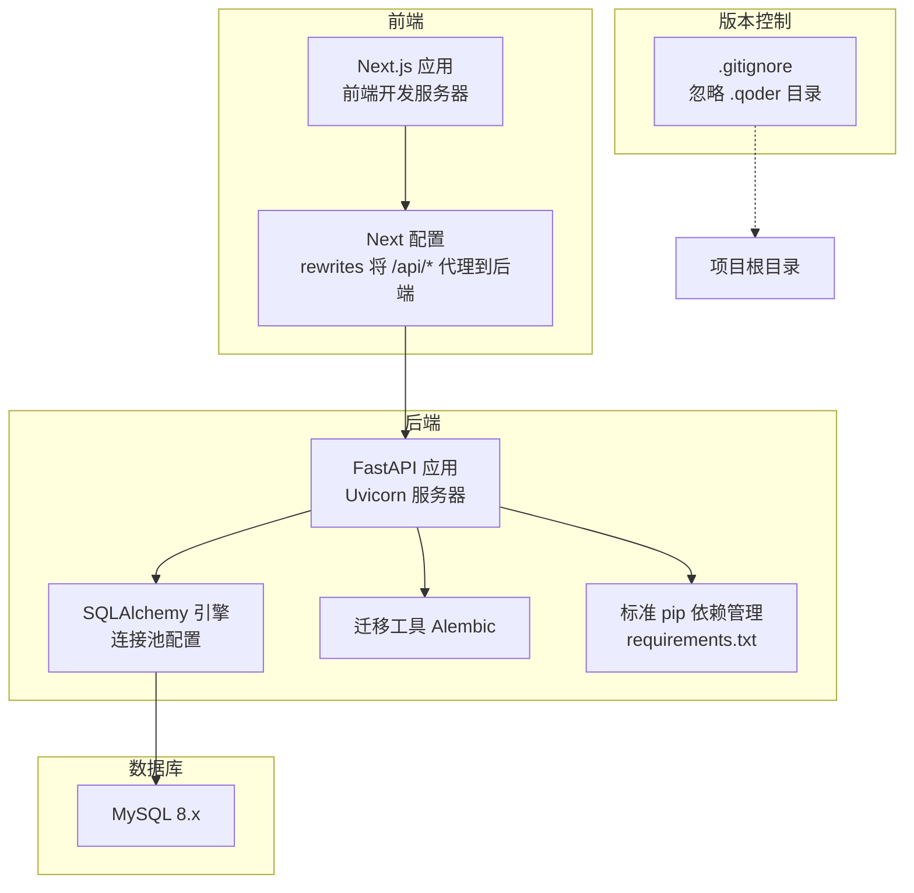
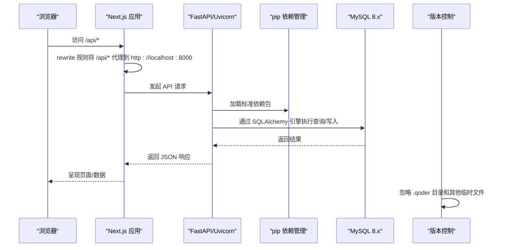
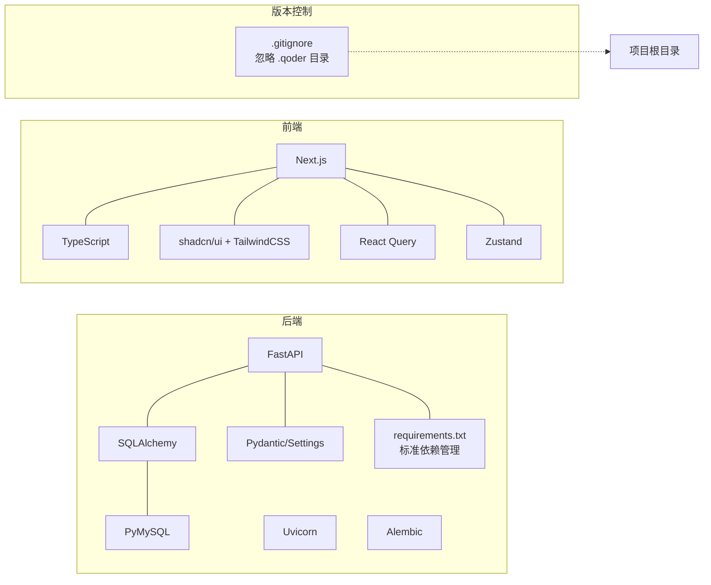

# 环境搭建

<cite>
**本文引用的文件**
- [backend/requirements.txt](file://backend/requirements.txt)
- [backend/pyproject.toml](file://backend/pyproject.toml)
- [frontend/package.json](file://frontend/package.json)
- [backend/app/config.py](file://backend/app/config.py)
- [backend/app/database.py](file://backend/app/database.py)
- [backend/app/main.py](file://backend/app/main.py)
- [start.sh](file://start.sh)
- [backend/check_db.py](file://backend/check_db.py)
- [backend/migrate_db.py](file://backend/migrate_db.py)
- [frontend/next.config.js](file://frontend/next.config.js)
- [backend/Dockerfile](file://backend/Dockerfile)
- [frontend/Dockerfile](file://frontend/Dockerfile)
- [docker-compose.yml](file://docker-compose.yml)
- [docker-compose.dev.yml](file://docker-compose.dev.yml)
- [docker-compose.override.yml](file://docker-compose.override.yml)
- [.gitignore](file://.gitignore)
</cite>

## 更新摘要
**变更内容**
- **新增**：.gitignore 配置更新，增加对 .qoder 目录的处理规则
- **改进**：开发环境配置优化，提升本地开发体验
- **保持**：原有的依赖管理、Docker 构建优化等核心功能不变

## 目录
1. [简介](#简介)
2. [项目结构](#项目结构)
3. [核心组件](#核心组件)
4. [架构总览](#架构总览)
5. [详细组件分析](#详细组件分析)
6. [依赖分析](#依赖分析)
7. [性能考虑](#性能考虑)
8. [故障排查指南](#故障排查指南)
9. [结论](#结论)
10. [附录](#附录)

## 简介
本指南面向 InvestRing 项目的开发者，提供从零开始的完整环境搭建与运行说明。内容覆盖：
- 开发工具链安装：Python 3.10+、Node.js 16+、MySQL 8.0+
- 后端依赖安装与配置：FastAPI、SQLAlchemy、Pydantic、Alembic 等（已迁移至标准 pip 依赖管理）
- 前端依赖安装与配置：Next.js、React、TypeScript、TailwindCSS
- 环境变量与数据库连接配置
- API 密钥（Tushare）配置
- 一键启动脚本与本地开发服务器启动
- Docker 容器化部署方案（阿里云镜像源加速，构建时间从40分钟缩短至5分钟）
- **新增**：版本控制配置优化，包含 .qoder 目录的忽略规则
- 常见问题排查与解决方案

## 项目结构
InvestRing 采用前后端分离架构：
- 后端：FastAPI + SQLAlchemy + MySQL，提供 REST API
- 前端：Next.js App Router + TypeScript + shadcn/ui + TailwindCSS，提供 Web 界面
- 项目根目录提供一键启动脚本，统一启动后端与前端服务
- **更新**：依赖管理已迁移至标准 pip 格式，移除 vendored 依赖目录
- **新增**：版本控制配置优化，自动忽略 .qoder 目录和其他开发工具生成文件

**图表来源**
- [frontend/next.config.js:1-16](file://frontend/next.config.js#L1-L16)
- [backend/app/main.py:1-53](file://backend/app/main.py#L1-L53)
- [backend/app/database.py:1-39](file://backend/app/database.py#L1-L39)
- [backend/requirements.txt:1-51](file://backend/requirements.txt#L1-L51)
- [.gitignore](file://.gitignore)

## 核心组件
- **更新**：后端依赖清单与版本约束：通过 requirements.txt 统一管理，支持标准 pip 安装
- 前端依赖清单与版本约束：参见前端依赖文件
- 环境变量与数据库连接：通过配置类集中管理
- 本地开发服务器：一键启动脚本同时启动后端与前端
- 数据库初始化与迁移：提供检查与迁移脚本
- Docker 多阶段构建优化镜像大小和构建速度，使用阿里云镜像源显著提升构建性能
- **新增**：版本控制配置优化，自动忽略 .qoder 目录和其他开发工具生成的临时文件

## 架构总览
后端通过 FastAPI 暴露 REST API，前端通过 Next.js 的 App Router 提供页面与交互；前端通过 next.config.js 的 rewrite 将 /api/* 代理到后端 8000 端口。数据库连接通过 SQLAlchemy 引擎与连接池配置，支持 MySQL 8.x。依赖管理已标准化，Docker 构建使用阿里云镜像源和多阶段优化，构建性能提升8倍。版本控制配置已优化，自动忽略开发工具生成的临时文件。

**图表来源**
- [frontend/next.config.js:5-12](file://frontend/next.config.js#L5-L12)
- [backend/app/main.py:32-49](file://backend/app/main.py#L32-L49)
- [backend/app/database.py:8-16](file://backend/app/database.py#L8-L16)
- [backend/requirements.txt:1-51](file://backend/requirements.txt#L1-L51)
- [.gitignore](file://.gitignore)

## 详细组件分析

### 后端环境与依赖
- Python 版本要求：3.10+（从 3.8+ 升级）
- 主要依赖：FastAPI、SQLAlchemy、Pydantic、Pydantic-settings、Uvicorn、Alembic、PyMySQL、Pandas、NumPy、APScheduler、HTTPX、pytest 等
- 安装方式：使用 requirements.txt 通过标准 pip 安装，支持虚拟环境
- 运行方式：Uvicorn 启动 FastAPI 应用，支持热重载与生产模式

依赖管理已从 vendored 目录迁移至标准 pip 格式，提供更好的可维护性和兼容性。

**章节来源**
- [backend/requirements.txt:1-51](file://backend/requirements.txt#L1-L51)
- [backend/pyproject.toml:1-49](file://backend/pyproject.toml#L1-L49)
- [backend/app/main.py:1-53](file://backend/app/main.py#L1-L53)

### 前端环境与依赖
- Node.js 版本要求：16+
- 主要依赖：Next.js、React、TypeScript、shadcn/ui、TailwindCSS、Zustand、React Query、Axios、Recharts 等
- 安装方式：使用 package.json 通过 npm 安装
- 运行方式：Next.js 开发服务器，支持热重载

**章节来源**
- [frontend/package.json:1-51](file://frontend/package.json#L1-L51)

### 环境变量与数据库连接
- 环境变量文件：.env（由配置类读取）
- 数据库连接参数：主机、端口、用户名、密码、数据库名
- 默认连接串：基于参数拼接的 mysql+pymysql URL
- 连接池配置：pool_size、max_overflow、pool_pre_ping、pool_recycle
- 调试输出：根据 debug 控制 SQLAlchemy echo

**章节来源**
- [backend/app/config.py:5-36](file://backend/app/config.py#L5-L36)
- [backend/app/database.py:8-16](file://backend/app/database.py#L8-L16)

### API 密钥配置（Tushare）
- 配置项：tushare_token
- 作用：用于市场数据同步（如净值、行情）
- 位置：环境变量 .env 中设置
- 一键启动脚本会检测该变量是否存在并给出提示

**章节来源**
- [backend/app/config.py:18-20](file://backend/app/config.py#L18-L20)
- [start.sh:43-47](file://start.sh#L43-L47)

### 本地开发服务器启动
- 一键启动脚本：start.sh
  - 检测 Node.js 与 Python3
  - 后端：创建并激活 Python 虚拟环境，使用标准 pip 安装依赖，设置 PYTHONPATH，加载 .env，启动 Uvicorn（端口 8000）
  - 前端：安装依赖至 node_modules，启动 Next.js 开发服务器（端口 3000）
  - 日志：分别输出到 logs/backend.log 与 logs/frontend.log
- 手动启动（可选）：
  - 后端：在 backend 目录创建虚拟环境并安装依赖，然后执行 uvicorn 启动命令
  - 前端：在 frontend 目录执行 npm run dev

依赖安装流程已简化，不再需要 vendored 依赖目录，直接使用标准 pip 管理。

**章节来源**
- [start.sh:1-99](file://start.sh#L1-L99)
- [backend/app/main.py:50-53](file://backend/app/main.py#L50-L53)

### 数据库初始化与迁移
- 初始化：FastAPI 应用启动时自动创建所有表
- 检查：提供 check_db.py 用于验证数据库连接与基础表是否存在
- 迁移：提供 migrate_db.py 用于备份数据、重建表结构并恢复关键数据

**章节来源**
- [backend/app/main.py:7-15](file://backend/app/main.py#L7-L15)
- [backend/check_db.py:14-34](file://backend/check_db.py#L14-L34)
- [backend/migrate_db.py:10-60](file://backend/migrate_db.py#L10-L60)

### 前端代理与路由
- 代理配置：next.config.js 将 /api/* 代理到 http://localhost:8000
- 路由策略：App Router + 双端独立路由（/m/ 移动端与根路径 PC 端）
- 中间件：根据 UA 与 Cookie 自动重定向与登录保护

**章节来源**
- [frontend/next.config.js:5-12](file://frontend/next.config.js#L5-L12)

### Docker 容器化部署
- 建议镜像分层：Python 基础镜像 + 依赖安装层 + 运行时层（多阶段构建）
- 后端使用 --only-binary :all: 避免源码编译，加速构建过程
- 前端使用 node:20-alpine 基础镜像，减小镜像体积
- 使用阿里云镜像源替代国际镜像，构建性能从约40分钟缩短至5分钟
  - Debian 包管理器源：mirrors.aliyun.com
  - PyPI 镜像源：https://mirrors.aliyun.com/pypi/simple/
- 端口暴露：后端 8000、前端 3000
- 环境变量：通过 Docker 环境注入 .env 内容
- 数据持久化：MySQL 数据卷、日志卷
- 健康检查：后端提供 /health 健康探针，前端静态资源可用性检查
- 编排：docker-compose 启动 MySQL、后端、前端，统一网络
- 开发环境 docker-compose.dev.yml 支持代码热重载

阿里云镜像源的引入特别有利于中国和其他地区的开发者，解决了连接国际仓库速度慢的问题。

**章节来源**
- [backend/Dockerfile:1-76](file://backend/Dockerfile#L1-76)
- [frontend/Dockerfile:1-82](file://frontend/Dockerfile#L1-L82)
- [docker-compose.yml:1-113](file://docker-compose.yml#L1-L113)
- [docker-compose.dev.yml:1-95](file://docker-compose.dev.yml#L1-L95)
- [docker-compose.override.yml:1-22](file://docker-compose.override.yml#L1-L22)

### 版本控制配置优化（新增）
- **.gitignore 配置更新**：新增对 .qoder 目录的忽略规则
- **开发工具集成**：自动忽略 AI 辅助开发工具生成的配置文件和缓存
- **团队协作优化**：确保团队成员的开发环境配置不会污染版本库
- **其他忽略规则**：继续保留原有的 Python、Node.js、IDE 相关忽略规则

**章节来源**
- [.gitignore](file://.gitignore)

## 依赖分析
后端与前端的依赖关系如下：

**图表来源**
- [backend/requirements.txt:1-51](file://backend/requirements.txt#L1-L51)
- [backend/pyproject.toml:1-49](file://backend/pyproject.toml#L1-L49)
- [frontend/package.json:1-51](file://frontend/package.json#L1-L51)
- [.gitignore](file://.gitignore)

## 性能考虑
- 连接池：后端数据库连接池参数已配置，建议结合实际并发与数据库性能调优
- 调试输出：debug=true 时 SQLAlchemy echo 会输出 SQL，开发阶段开启，生产建议关闭
- 前端构建：Next.js 生产构建与 SWC 压缩已启用，提升打包与运行效率
- 代理与缓存：前端代理减少跨域复杂度，合理利用浏览器缓存与服务端缓存
- Docker 构建优化：多阶段构建减少镜像体积，预编译 wheel 加速依赖安装，阿里云镜像源显著提升构建速度

## 故障排查指南
- 后端无法启动
  - 检查 Python3 与 pip 依赖是否安装（requirements.txt）
  - 确认 .env 中数据库连接参数正确
  - 查看 logs/backend.log
  - 确保使用 Python 3.10+ 版本
- 前端无法访问 API
  - 确认后端已启动（端口 8000）
  - 检查 next.config.js 的 rewrite 是否生效
  - 查看 logs/frontend.log
- 数据库连接失败
  - 校验 .env 中 db_host、db_port、db_user、db_password、db_name
  - 使用 check_db.py 验证连接与表是否存在
- Tushare API 未配置
  - 在 .env 中设置 tushare_token
  - 一键启动脚本会提示当前状态
- 迁移与数据丢失风险
  - 使用 migrate_db.py 前先备份数据，理解其备份与恢复逻辑
- Docker 构建问题
  - 检查网络连接，确保能访问阿里云镜像源（mirrors.aliyun.com）
  - 如遇编译超时，检查系统是否有必要的编译工具
  - 使用 docker-compose.dev.yml 进行开发环境调试
  - 如果构建仍然缓慢，检查防火墙或代理设置是否阻止了阿里云镜像访问
- **新增**：版本控制相关问题
  - 确认 .gitignore 配置是否正确忽略 .qoder 目录
  - 检查是否有开发工具配置文件被意外提交到版本库
  - 清理已提交的临时文件后重新初始化版本库

## 结论
通过本指南，您可以完成 InvestRing 项目的本地开发环境搭建与运行。项目已迁移至标准 pip 依赖管理，移除了 vendored 依赖目录，提供了更好的可维护性和兼容性。Docker 构建配置经过重大优化，使用阿里云镜像源将构建时间从约40分钟缩短至5分钟，特别适合中国和其他地区的开发者。版本控制配置已进一步优化，自动忽略开发工具生成的临时文件，提升团队协作效率。建议在开发过程中：
- 使用一键启动脚本快速验证环境
- 正确配置 .env 与数据库连接
- 合理使用迁移脚本管理数据库演进
- 前后端联调时关注代理与路由行为
- 利用优化的 Docker 配置进行容器化部署，享受显著的性能提升
- **新增**：确保 .gitignore 配置正确，避免提交开发工具的临时文件

## 附录

### 环境变量清单（.env）
- 数据库相关
  - db_host：数据库主机
  - db_port：数据库端口
  - db_user：数据库用户名
  - db_password：数据库密码
  - db_name：数据库名
  - database_url：自定义连接串（可为空）
- 安全与应用
  - secret_key：签名密钥（生产环境务必替换）
  - token_expire_days：Token 过期天数
  - debug：调试开关
- 外部服务
  - tushare_token：Tushare API 密钥

**章节来源**
- [backend/app/config.py:6-26](file://backend/app/config.py#L6-L26)

### 数据库连接配置要点
- 默认连接串：基于 db_* 参数拼接 mysql+pymysql URL
- 连接池：pool_size、max_overflow、pool_pre_ping、pool_recycle
- MySQL InnoDB 配置：charset=utf8mb4、InnoDB 引擎、事务隔离级别

**章节来源**
- [backend/app/config.py:30-31](file://backend/app/config.py#L30-L31)
- [backend/app/database.py:18-26](file://backend/app/database.py#L18-L26)

### 前端开发配置要点
- 代理：/api/* 代理到后端 8000 端口
- 路由：双端独立路由（/m/ 与根路径）
- 中间件：UA 识别、登录保护、自动重定向

**章节来源**
- [frontend/next.config.js:5-12](file://frontend/next.config.js#L5-L12)

### Docker 容器化部署
- 镜像分层：Python 基础镜像 + 依赖安装层 + 运行时层（多阶段构建）
- 后端使用 --only-binary :all: 避免源码编译，加速构建过程
- 前端使用 node:20-alpine 基础镜像，减小镜像体积
- 使用阿里云镜像源替代国际镜像，构建性能从约40分钟缩短至5分钟
  - Debian 包管理器源：mirrors.aliyun.com
  - PyPI 镜像源：https://mirrors.aliyun.com/pypi/simple/
- 端口暴露：后端 8000、前端 3000
- 环境变量：通过 Docker 环境注入 .env 内容
- 数据持久化：MySQL 数据卷、日志卷
- 健康检查：后端提供 /health 健康探针，前端静态资源可用性检查
- 编排：docker-compose 启动 MySQL、后端、前端，统一网络
- 开发环境 docker-compose.dev.yml 支持代码热重载

**章节来源**
- [backend/Dockerfile:1-76](file://backend/Dockerfile#L1-76)
- [frontend/Dockerfile:1-82](file://frontend/Dockerfile#L1-L82)
- [docker-compose.yml:1-113](file://docker-compose.yml#L1-L113)
- [docker-compose.dev.yml:1-95](file://docker-compose.dev.yml#L1-L95)
- [docker-compose.override.yml:1-22](file://docker-compose.override.yml#L1-L22)

### 依赖管理迁移说明
- 从 vendored 依赖目录迁移至标准 pip 依赖管理
- requirements.txt 现在包含完整的依赖版本锁定
- pyproject.toml 提供现代 Python 项目配置
- Docker 构建使用预编译 wheel 加速依赖安装
- Python 版本要求从 3.8+ 升级至 3.10+

**章节来源**
- [backend/requirements.txt:1-51](file://backend/requirements.txt#L1-L51)
- [backend/pyproject.toml:1-49](file://backend/pyproject.toml#L1-L49)
- [backend/Dockerfile:23-24](file://backend/Dockerfile#L23-L24)

### Docker 构建优化详解
- 阿里云镜像源配置
  - Debian 包管理器：sed -i 's|http://deb.debian.org|http://mirrors.aliyun.com|g' /etc/apt/sources.list.d/debian.sources
  - PyPI 镜像：-i https://mirrors.aliyun.com/pypi/simple/
- 多阶段构建优化
  - 依赖安装阶段：python:3.11-slim + 阿里云镜像 + 预编译wheel
  - 生产运行阶段：最小化镜像体积，仅包含运行时必要组件
- 构建性能提升
  - 传统构建时间：约40分钟
  - 优化后构建时间：约5分钟
  - 性能提升：8倍
- 网络优化
  - 解决国际仓库连接慢的问题
  - 特别适合中国和其他地区的开发者
  - 提高CI/CD流水线效率

**章节来源**
- [backend/Dockerfile:15-29](file://backend/Dockerfile#L15-L29)
- [backend/Dockerfile:38-46](file://backend/Dockerfile#L38-L46)

### 版本控制配置优化（新增）
- **.gitignore 更新内容**：
  - 新增对 .qoder 目录的忽略规则
  - 自动忽略 AI 辅助开发工具生成的配置文件
  - 保持原有的 Python、Node.js、IDE 相关忽略规则
- **开发环境优化**：
  - 避免开发工具配置污染版本库
  - 提升团队协作效率
  - 减少不必要的文件提交
- **最佳实践**：
  - 定期检查和更新 .gitignore 配置
  - 确保团队成员使用相同的忽略规则
  - 清理已提交的临时文件

**章节来源**
- [.gitignore](file://.gitignore)