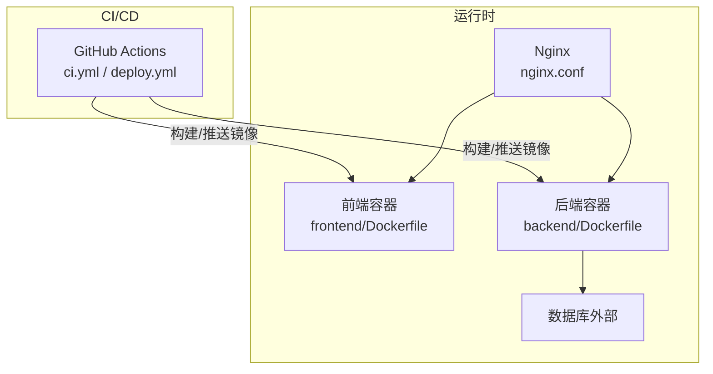
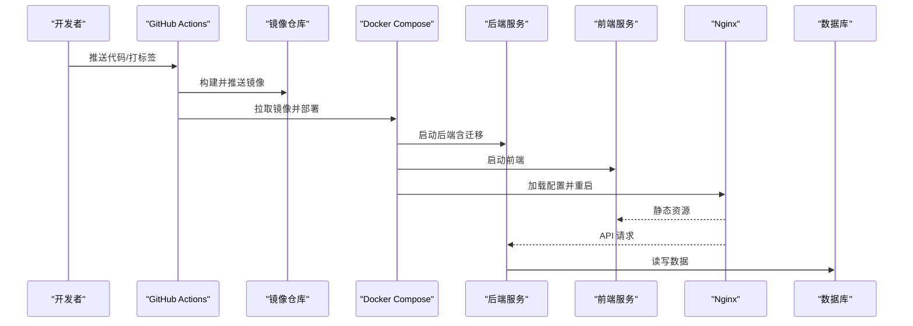
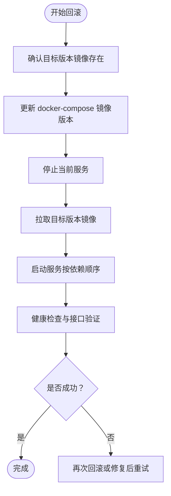
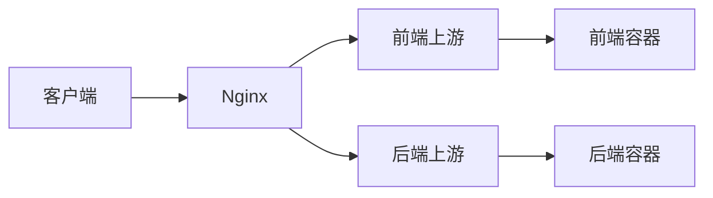
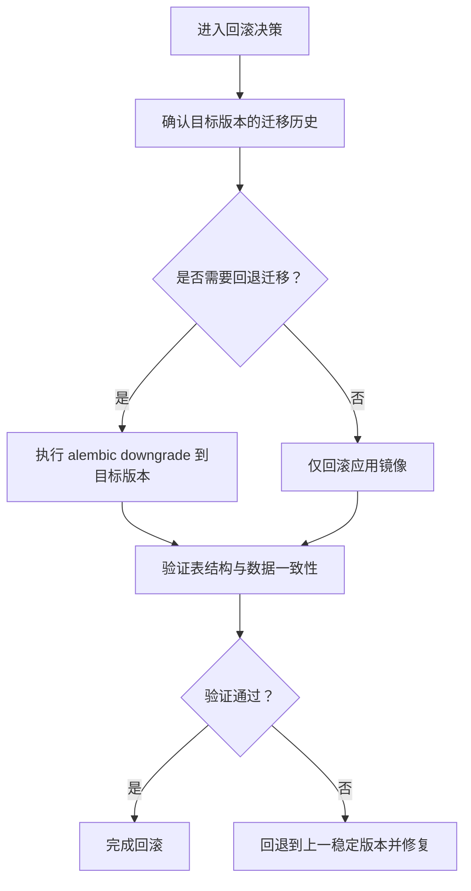
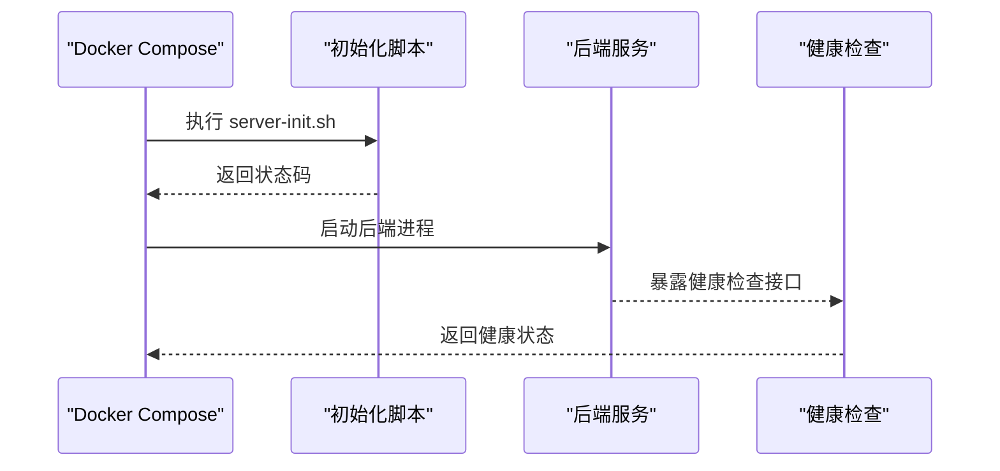
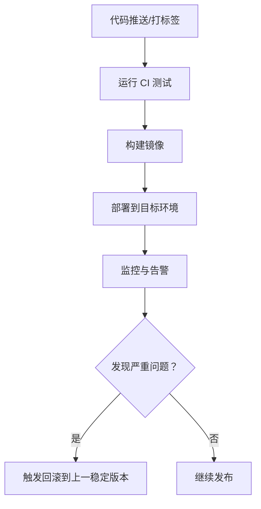
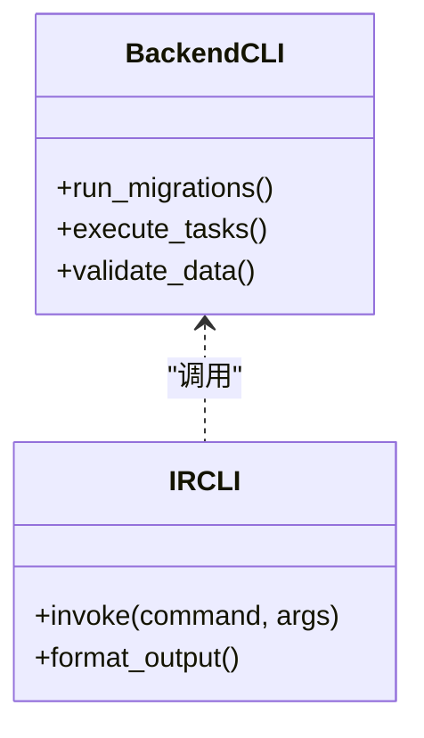
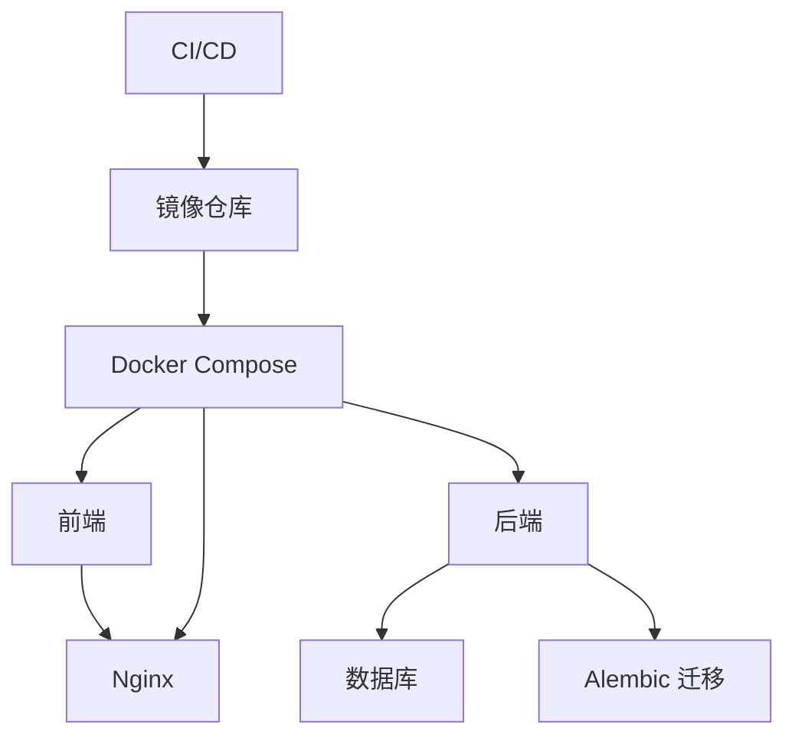

# 部署回滚操作手册

<cite>
**本文引用的文件**   
- [docker-compose.yml](file://docker-compose.yml)
- [docker-compose.dev.yml](file://docker-compose.dev.yml)
- [docker-compose.override.yml](file://docker-compose.override.yml)
- [backend/Dockerfile](file://backend/Dockerfile)
- [frontend/Dockerfile](file://frontend/Dockerfile)
- [nginx/nginx.conf](file://nginx/nginx.conf)
- [scripts/server-init.sh](file://scripts/server-init.sh)
- [.github/workflows/deploy.yml](file://.github/workflows/deploy.yml)
- [.github/workflows/ci.yml](file://.github/workflows/ci.yml)
- [backend/alembic.ini](file://backend/alembic.ini)
- [backend/app/main.py](file://backend/app/main.py)
- [backend/app/config.py](file://backend/app/config.py)
- [backend/app/database.py](file://backend/app/database.py)
- [backend/cli/main.py](file://backend/cli/main.py)
- [ir-cli/ir_cli/main.py](file://ir-cli/ir_cli/main.py)
- [docs/runbooks/deploy-rollback.md](file://docs/runbooks/deploy-rollback.md)
</cite>

## 目录
1. [简介](#简介)
2. [项目结构](#项目结构)
3. [核心组件](#核心组件)
4. [架构总览](#架构总览)
5. [详细组件分析](#详细组件分析)
6. [依赖关系分析](#依赖关系分析)
7. [性能注意事项](#性能注意事项)
8. [故障排查指南](#故障排查指南)
9. [结论](#结论)
10. [附录](#附录)

## 简介
本手册面向运维与研发人员，提供投资管理系统在容器化环境下的标准部署与回滚流程。内容涵盖镜像版本管理、数据库迁移回退、服务编排切换、反向代理配置更新以及发布流水线中的安全回滚策略。通过明确的步骤、检查清单与应急方案，确保在生产环境中快速、可控地恢复服务。

## 项目结构
系统采用前后端分离与容器化部署：
- 后端：Python FastAPI 应用，使用 Alembic 进行数据库迁移，CLI 工具用于运维操作。
- 前端：Next.js 应用，构建为静态资源并通过 Nginx 提供服务。
- 基础设施：Docker Compose 编排多服务（后端、前端、Nginx），GitHub Actions 负责 CI/CD。

**图示来源** 
- [docker-compose.yml](file://docker-compose.yml)
- [backend/Dockerfile](file://backend/Dockerfile)
- [frontend/Dockerfile](file://frontend/Dockerfile)
- [nginx/nginx.conf](file://nginx/nginx.conf)
- [.github/workflows/ci.yml](file://.github/workflows/ci.yml)
- [.github/workflows/deploy.yml](file://.github/workflows/deploy.yml)

**章节来源**
- [docker-compose.yml](file://docker-compose.yml)
- [backend/Dockerfile](file://backend/Dockerfile)
- [frontend/Dockerfile](file://frontend/Dockerfile)
- [nginx/nginx.conf](file://nginx/nginx.conf)
- [.github/workflows/ci.yml](file://.github/workflows/ci.yml)
- [.github/workflows/deploy.yml](file://.github/workflows/deploy.yml)

## 核心组件
- 容器编排与服务定义：通过 docker-compose 文件集中管理服务镜像版本、端口映射、环境变量与依赖启动顺序。
- 镜像构建：前后端各自 Dockerfile 定义构建阶段与产物。
- 反向代理：Nginx 将请求路由到前端静态资源与后端 API。
- 数据库迁移：Alembic 管理 schema 变更，支持向前与向后迁移。
- CLI 工具：后端内置 CLI 与 ir-cli 提供运维命令（如迁移、任务执行、数据校验）。
- CI/CD：GitHub Actions 自动化测试、构建与部署，支持按标签或分支触发回滚。

**章节来源**
- [docker-compose.yml](file://docker-compose.yml)
- [backend/Dockerfile](file://backend/Dockerfile)
- [frontend/Dockerfile](file://frontend/Dockerfile)
- [nginx/nginx.conf](file://nginx/nginx.conf)
- [backend/alembic.ini](file://backend/alembic.ini)
- [backend/cli/main.py](file://backend/cli/main.py)
- [ir-cli/ir_cli/main.py](file://ir-cli/ir_cli/main.py)
- [.github/workflows/deploy.yml](file://.github/workflows/deploy.yml)

## 架构总览
下图展示从代码提交到生产运行的关键路径，以及回滚时的逆向操作点。

**图示来源** 
- [.github/workflows/deploy.yml](file://.github/workflows/deploy.yml)
- [docker-compose.yml](file://docker-compose.yml)
- [backend/Dockerfile](file://backend/Dockerfile)
- [frontend/Dockerfile](file://frontend/Dockerfile)
- [nginx/nginx.conf](file://nginx/nginx.conf)

## 详细组件分析

### 容器编排与服务版本控制
- 使用 docker-compose 统一管理各服务的镜像版本与环境变量。
- 通过覆盖文件区分开发环境与生产环境配置。
- 回滚时仅需修改 compose 中镜像标签或版本号并重新部署。

**图示来源** 
- [docker-compose.yml](file://docker-compose.yml)
- [docker-compose.dev.yml](file://docker-compose.dev.yml)
- [docker-compose.override.yml](file://docker-compose.override.yml)

**章节来源**
- [docker-compose.yml](file://docker-compose.yml)
- [docker-compose.dev.yml](file://docker-compose.dev.yml)
- [docker-compose.override.yml](file://docker-compose.override.yml)

### 反向代理配置与灰度切换
- Nginx 作为入口，转发前端静态资源与后端 API。
- 回滚时需确保 Nginx 配置指向正确的上游服务地址与端口。
- 建议在变更前后进行连通性与延迟测试。

**图示来源** 
- [nginx/nginx.conf](file://nginx/nginx.conf)

**章节来源**
- [nginx/nginx.conf](file://nginx/nginx.conf)

### 数据库迁移与回退
- Alembic 管理数据库 schema 变更，支持向上与向下迁移。
- 回滚需先评估数据影响，必要时准备数据补偿脚本。
- 建议先在预发环境验证迁移与回退脚本，再在生产执行。

**图示来源** 
- [backend/alembic.ini](file://backend/alembic.ini)
- [backend/app/database.py](file://backend/app/database.py)

**章节来源**
- [backend/alembic.ini](file://backend/alembic.ini)
- [backend/app/database.py](file://backend/app/database.py)

### 应用启动与健康检查
- 后端服务启动前可执行初始化脚本（如数据初始化、缓存预热）。
- 健康检查应覆盖 API 根路径与关键业务接口。
- 回滚后需观察日志与指标，确保无异常告警。

**图示来源** 
- [scripts/server-init.sh](file://scripts/server-init.sh)
- [backend/app/main.py](file://backend/app/main.py)

**章节来源**
- [scripts/server-init.sh](file://scripts/server-init.sh)
- [backend/app/main.py](file://backend/app/main.py)

### 发布流水线与回滚触发
- CI 负责单元测试与集成测试，确保代码质量。
- CD 根据标签或分支触发部署，支持按版本回滚。
- 建议在流水线中加入回滚步骤与人工审批环节。

**图示来源** 
- [.github/workflows/ci.yml](file://.github/workflows/ci.yml)
- [.github/workflows/deploy.yml](file://.github/workflows/deploy.yml)

**章节来源**
- [.github/workflows/ci.yml](file://.github/workflows/ci.yml)
- [.github/workflows/deploy.yml](file://.github/workflows/deploy.yml)

### CLI 工具与运维命令
- 后端 CLI 提供迁移、任务执行、数据校验等能力。
- ir-cli 提供统一的命令行入口，便于跨环境操作。
- 回滚过程中可使用 CLI 快速验证迁移状态与服务可用性。

**图示来源** 
- [backend/cli/main.py](file://backend/cli/main.py)
- [ir-cli/ir_cli/main.py](file://ir-cli/ir_cli/main.py)

**章节来源**
- [backend/cli/main.py](file://backend/cli/main.py)
- [ir-cli/ir_cli/main.py](file://ir-cli/ir_cli/main.py)

## 依赖关系分析
- 前端依赖 Nginx 提供静态资源服务。
- 后端依赖数据库与 Alembic 进行 schema 管理。
- CI/CD 依赖镜像仓库与编排工具。
- 回滚时需保证所有依赖版本一致且兼容。

**图示来源** 
- [docker-compose.yml](file://docker-compose.yml)
- [backend/app/config.py](file://backend/app/config.py)

**章节来源**
- [docker-compose.yml](file://docker-compose.yml)
- [backend/app/config.py](file://backend/app/config.py)

## 性能注意事项
- 回滚前清理无用镜像与容器，释放磁盘空间。
- 数据库连接池与超时参数需在回滚后验证，避免连接耗尽。
- 前端静态资源建议使用 CDN 与缓存策略，减少回滚后的首屏压力。
- 监控关键指标（CPU、内存、I/O、错误率）以评估回滚效果。

## 故障排查指南
- 服务无法启动：检查容器日志、环境变量与端口冲突。
- 数据库迁移失败：查看 Alembic 日志，确认迁移脚本与数据兼容性。
- 前端页面空白：检查 Nginx 配置与静态资源路径。
- API 响应异常：验证后端健康检查与依赖服务状态。
- 回滚后数据不一致：对比快照与增量数据，必要时执行补偿脚本。

**章节来源**
- [backend/app/main.py](file://backend/app/main.py)
- [backend/app/config.py](file://backend/app/config.py)
- [nginx/nginx.conf](file://nginx/nginx.conf)

## 结论
通过标准化的容器编排、迁移管理与 CI/CD 流水线，本系统能够在生产环境中实现快速、安全的部署与回滚。建议持续完善监控与告警机制，结合演练提升团队应急响应能力。

## 附录
- 参考文档：[部署回滚操作指南](file://docs/runbooks/deploy-rollback.md)
- 常用命令：
  - 查看服务状态：docker compose ps
  - 查看容器日志：docker compose logs -f <service>
  - 执行迁移：alembic upgrade head / alembic downgrade -n 1
  - 重启服务：docker compose restart

**章节来源**
- [docs/runbooks/deploy-rollback.md](file://docs/runbooks/deploy-rollback.md)