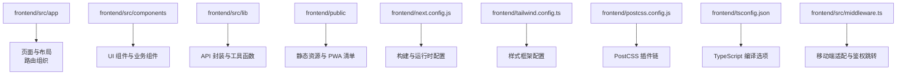
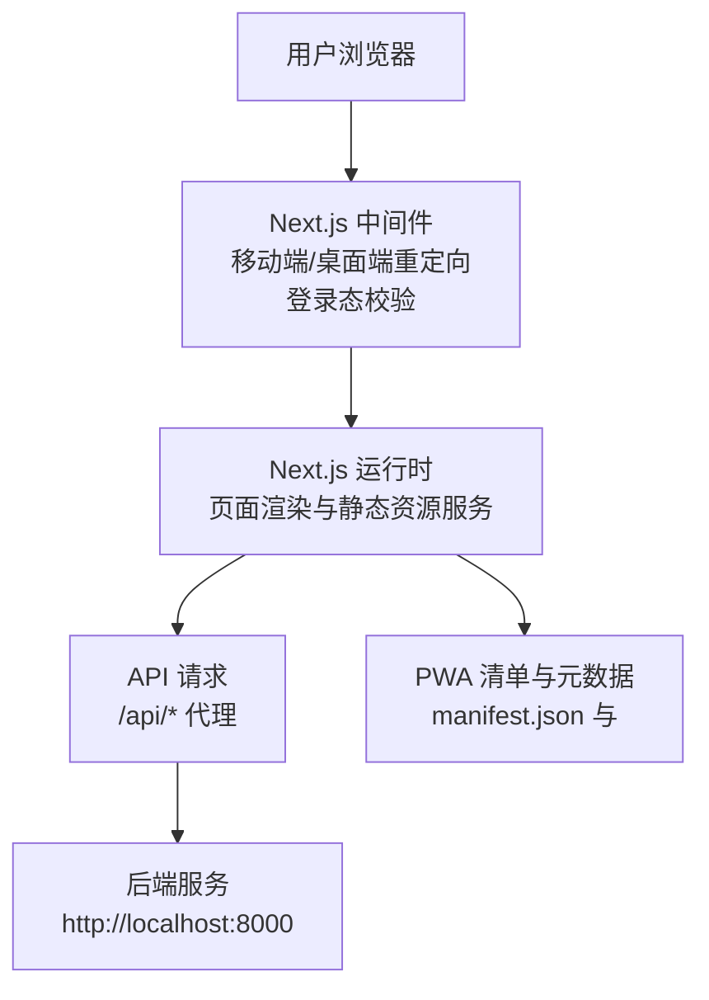
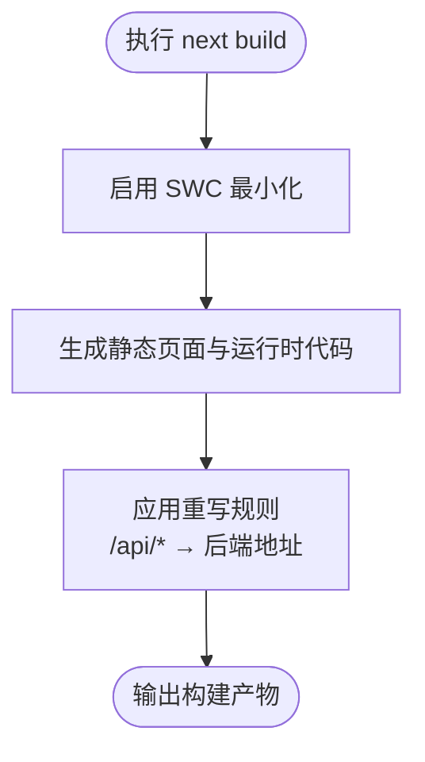
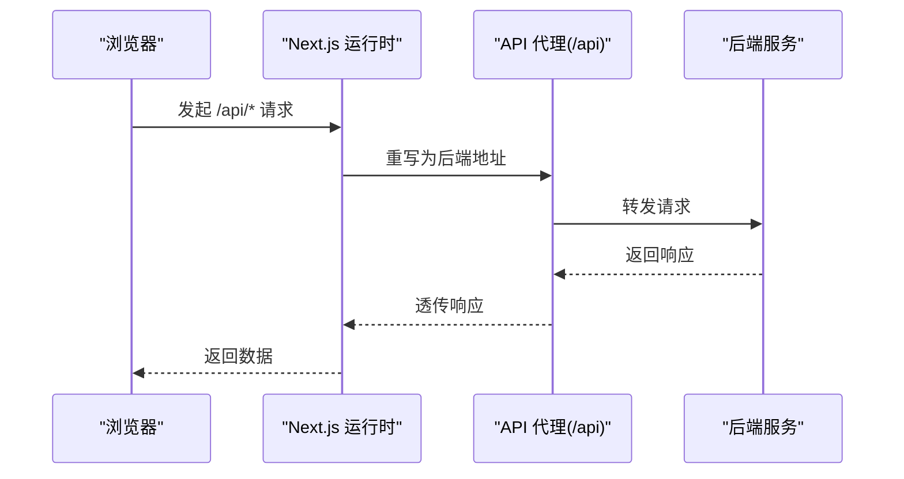
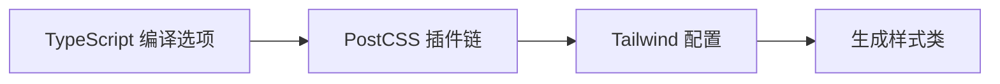
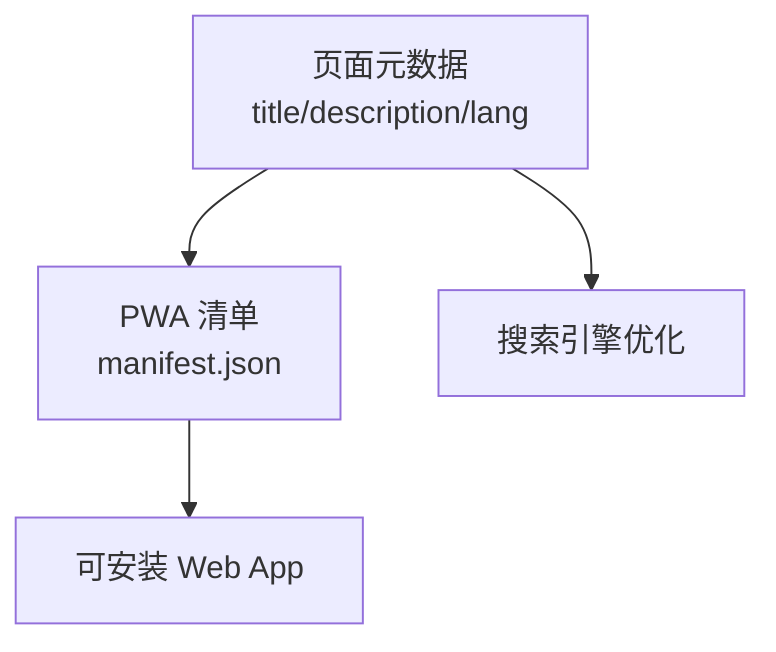
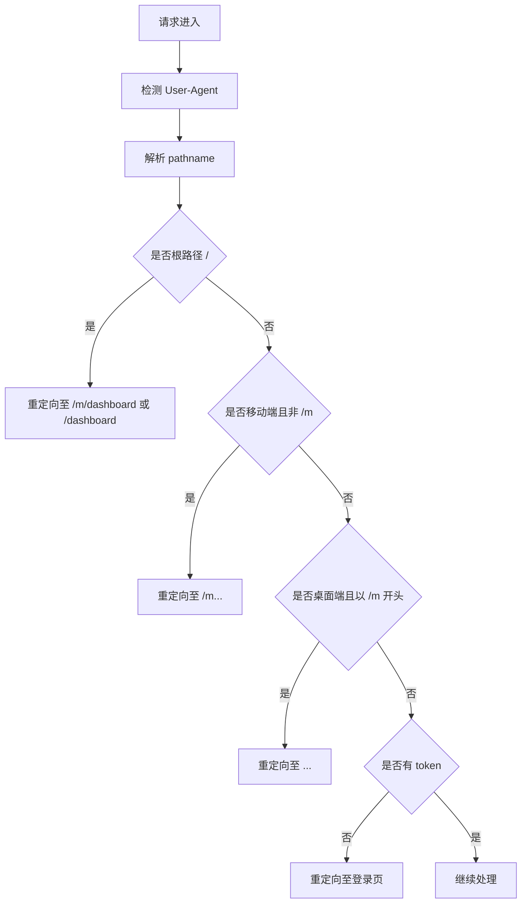

# 前端应用部署

<cite>
**本文引用的文件**
- [package.json](file://frontend/package.json)
- [next.config.js](file://frontend/next.config.js)
- [manifest.json](file://frontend/public/manifest.json)
- [layout.tsx](file://frontend/src/app/layout.tsx)
- [tailwind.config.ts](file://frontend/tailwind.config.ts)
- [postcss.config.js](file://frontend/postcss.config.js)
- [tsconfig.json](file://frontend/tsconfig.json)
- [middleware.ts](file://frontend/src/middleware.ts)
- [api.ts](file://frontend/src/lib/api.ts)
</cite>

## 目录
1. [简介](#简介)
2. [项目结构](#项目结构)
3. [核心组件](#核心组件)
4. [架构总览](#架构总览)
5. [详细组件分析](#详细组件分析)
6. [依赖分析](#依赖分析)
7. [性能考虑](#性能考虑)
8. [故障排查指南](#故障排查指南)
9. [结论](#结论)
10. [附录](#附录)

## 简介
本文件面向 InvestRing 前端应用（Next.js）的生产部署，覆盖构建流程、静态资源优化、CDN 配置、环境变量与 API 代理、浏览器兼容性、代码分割与懒加载、容器化与 Nginx 静态服务、PWA 与 SEO 优化以及性能监控集成等主题。内容基于仓库中现有配置文件进行梳理与落地建议，帮助团队在不同环境下稳定交付。

## 项目结构
前端采用 Next.js 应用程序目录结构，核心目录与职责如下：
- frontend/src/app：页面与布局、路由组织
- frontend/src/components：UI 组件与业务组件
- frontend/src/lib：API 封装与工具函数
- frontend/public：静态资源与 PWA 清单
- frontend/next.config.js：Next.js 构建与运行时配置
- frontend/tailwind.config.ts：样式框架配置
- frontend/postcss.config.js：PostCSS 插件链
- frontend/tsconfig.json：TypeScript 编译选项
- frontend/src/middleware.ts：请求中间件（移动端适配、鉴权跳转）

**章节来源**
- [package.json:1-45](file://frontend/package.json#L1-L45)
- [next.config.js:1-16](file://frontend/next.config.js#L1-L16)
- [tailwind.config.ts:1-57](file://frontend/tailwind.config.ts#L1-L57)
- [postcss.config.js:1-7](file://frontend/postcss.config.js#L1-L7)
- [tsconfig.json:1-27](file://frontend/tsconfig.json#L1-L27)
- [middleware.ts:1-40](file://frontend/src/middleware.ts#L1-L40)

## 核心组件
- 构建脚本与产物
  - 开发：next dev
  - 构建：next build
  - 启动：next start
  - 校验：next lint
- Next.js 配置
  - 严格模式与最小化
  - API 代理（/api → 后端地址）
- PWA 与 SEO
  - 清单与 Web App 元数据
  - 主题色、图标、显示模式
- 中间件
  - 移动端/桌面端路径重定向
  - 登录态校验与未登录跳转
- API 客户端
  - 基于环境变量的后端地址
  - 请求/响应拦截器与统一错误处理

**章节来源**
- [package.json:5-10](file://frontend/package.json#L5-L10)
- [next.config.js:2-13](file://frontend/next.config.js#L2-L13)
- [manifest.json:1-27](file://frontend/public/manifest.json#L1-L27)
- [layout.tsx:8-17](file://frontend/src/app/layout.tsx#L8-L17)
- [middleware.ts:4-36](file://frontend/src/middleware.ts#L4-L36)
- [api.ts:42-79](file://frontend/src/lib/api.ts#L42-L79)

## 架构总览
下图展示前端在生产环境中的关键交互：浏览器请求经由中间件处理，Next.js 运行时负责页面渲染与静态资源服务；API 请求通过 rewrites 代理到后端；PWA 清单与元数据支持离线与安装体验。

**图表来源**
- [middleware.ts:4-36](file://frontend/src/middleware.ts#L4-L36)
- [next.config.js:5-12](file://frontend/next.config.js#L5-L12)
- [layout.tsx:8-17](file://frontend/src/app/layout.tsx#L8-L17)
- [manifest.json:1-27](file://frontend/public/manifest.json#L1-L27)

**章节来源**
- [next.config.js:2-13](file://frontend/next.config.js#L2-L13)
- [layout.tsx:8-17](file://frontend/src/app/layout.tsx#L8-L17)
- [middleware.ts:4-36](file://frontend/src/middleware.ts#L4-L36)

## 详细组件分析

### 构建与运行配置
- 生产构建命令
  - 使用 next build 生成静态产物与运行时代码
  - 使用 next start 在生产环境启动服务
- 严格模式与最小化
  - reactStrictMode 与 swcMinify 提升质量与体积优化
- API 代理
  - 所有 /api/* 请求被重写到后端地址，便于本地联调与部署一致性

**图表来源**
- [next.config.js:2-13](file://frontend/next.config.js#L2-L13)

**章节来源**
- [package.json:5-10](file://frontend/package.json#L5-L10)
- [next.config.js:2-13](file://frontend/next.config.js#L2-L13)

### 环境变量与 API 代理
- 环境变量
  - NEXT_PUBLIC_API_URL：用于设置 API 基础地址（默认回退至 /api）
- API 代理
  - rewrites 将 /api/* 重写到后端地址，确保前后端同域或跨域代理一致
- 运行时行为
  - 客户端侧通过 localStorage 获取 token 并注入 Authorization 头
  - 401 统一跳转登录页

**图表来源**
- [next.config.js:5-12](file://frontend/next.config.js#L5-L12)
- [api.ts:42-79](file://frontend/src/lib/api.ts#L42-L79)

**章节来源**
- [api.ts:42-48](file://frontend/src/lib/api.ts#L42-L48)
- [next.config.js:5-12](file://frontend/next.config.js#L5-L12)
- [api.ts:50-79](file://frontend/src/lib/api.ts#L50-L79)

### 浏览器兼容性与样式体系
- 浏览器兼容性
  - TypeScript 编译目标与模块解析遵循现代浏览器生态
  - PostCSS 与 Tailwind CSS 提供现代化样式能力
- 样式体系
  - Tailwind 内容扫描范围覆盖 app、components、pages
  - 自定义颜色与圆角变量扩展，满足主题一致性

**图表来源**
- [tsconfig.json:2-22](file://frontend/tsconfig.json#L2-L22)
- [postcss.config.js:1-7](file://frontend/postcss.config.js#L1-L7)
- [tailwind.config.ts:4-54](file://frontend/tailwind.config.ts#L4-L54)

**章节来源**
- [tsconfig.json:2-22](file://frontend/tsconfig.json#L2-L22)
- [postcss.config.js:1-7](file://frontend/postcss.config.js#L1-L7)
- [tailwind.config.ts:4-54](file://frontend/tailwind.config.ts#L4-L54)

### 代码分割与懒加载
- 路由级代码分割
  - Next.js 默认按页面拆分构建产物，减少首屏体积
- 组件级懒加载
  - 建议对非首屏图表、重型组件使用动态导入与 Suspense 边界
- 图片与媒体
  - 使用 Next.js 内置图片优化与懒加载属性，结合 CDN 可进一步加速

[本节为通用实践建议，不直接分析具体文件，故无“章节来源”]

### PWA 配置与 SEO 优化
- PWA
  - 清单文件定义名称、图标、主题色、显示模式与分类
  - 页面布局声明 manifest 与 Apple Web App 元数据
- SEO
  - 设置标题、描述与语言属性
  - 结合静态预渲染与 SSG/SSR 提升搜索引擎抓取效果

**图表来源**
- [layout.tsx:8-17](file://frontend/src/app/layout.tsx#L8-L17)
- [manifest.json:1-27](file://frontend/public/manifest.json#L1-L27)

**章节来源**
- [layout.tsx:8-17](file://frontend/src/app/layout.tsx#L8-L17)
- [manifest.json:1-27](file://frontend/public/manifest.json#L1-L27)

### 中间件与导航策略
- 移动端/桌面端分流
  - 根据 UA 判断移动设备，自动重定向至 /m 或桌面路由
- 登录态校验
  - 未登录访问受保护路由时跳转登录页
- 匹配器
  - 排除静态资源与 API 路径，避免对构建产物与后端接口产生影响

**图表来源**
- [middleware.ts:4-36](file://frontend/src/middleware.ts#L4-L36)

**章节来源**
- [middleware.ts:4-36](file://frontend/src/middleware.ts#L4-L36)

## 依赖分析
- 构建与运行
  - next、react、react-dom、typescript、@types/react
- 样式与工具
  - tailwindcss、postcss、autoprefixer、clsx、tailwind-merge
- 状态与查询
  - @tanstack/react-query、zustand
- UI 组件库
  - @radix-ui/* 系列组件
- 图表与日期
  - recharts、date-fns、lucide-react
- 开发与校验
  - eslint、eslint-config-next

**章节来源**
- [package.json:11-39](file://frontend/package.json#L11-L39)
- [package.json:40-43](file://frontend/package.json#L40-L43)

## 性能考虑
- 构建优化
  - 启用 SWC 最小化与严格模式，降低包体与提升稳定性
- 资源优化
  - 使用 Tailwind 的内容扫描与按需生成，避免无用样式
  - 图片与媒体采用 Next.js 图片优化与懒加载
- 代码分割
  - 路由级分割与动态导入，配合 Suspense 边界实现细粒度加载
- CDN 集成
  - 将静态产物托管于 CDN，结合缓存策略与边缘计算加速全球访问
- 监控与观测
  - 集成性能监控（如 Web Vitals），记录首屏时间、交互延迟与错误率

[本节为通用实践建议，不直接分析具体文件，故无“章节来源”]

## 故障排查指南
- API 401 与鉴权
  - 客户端收到 401 会清除本地 token 并跳转登录页，检查后端签发与存储逻辑
- API 代理不通
  - 确认 /api 代理目标地址与网络连通性，核对后端 CORS 配置
- 中间件循环重定向
  - 检查 UA 判断与 pathname 规则，确保匹配器排除静态资源与 API
- PWA 无法安装或图标缺失
  - 校验清单文件路径与图标尺寸，确认服务已返回清单与图标资源

**章节来源**
- [api.ts:67-79](file://frontend/src/lib/api.ts#L67-L79)
- [next.config.js:5-12](file://frontend/next.config.js#L5-L12)
- [middleware.ts:4-36](file://frontend/src/middleware.ts#L4-L36)
- [layout.tsx:11](file://frontend/src/app/layout.tsx#L11)
- [manifest.json:10-23](file://frontend/public/manifest.json#L10-L23)

## 结论
本部署文档基于仓库现有配置，给出了 Next.js 构建、代理、PWA 与 SEO、中间件与导航策略的落地要点，并补充了性能优化与监控建议。建议在生产环境中结合 CDN 与容器化方案，持续完善可观测性与安全加固。

## 附录
- 常用命令
  - 开发：npm run dev
  - 构建：npm run build
  - 启动：npm run start
  - 校验：npm run lint
- 关键配置定位
  - 构建与运行：frontend/next.config.js
  - 样式与工具：frontend/tailwind.config.ts、frontend/postcss.config.js
  - 类型与编译：frontend/tsconfig.json
  - 中间件：frontend/src/middleware.ts
  - API 客户端：frontend/src/lib/api.ts
  - PWA 清单：frontend/public/manifest.json
  - 页面元数据：frontend/src/app/layout.tsx