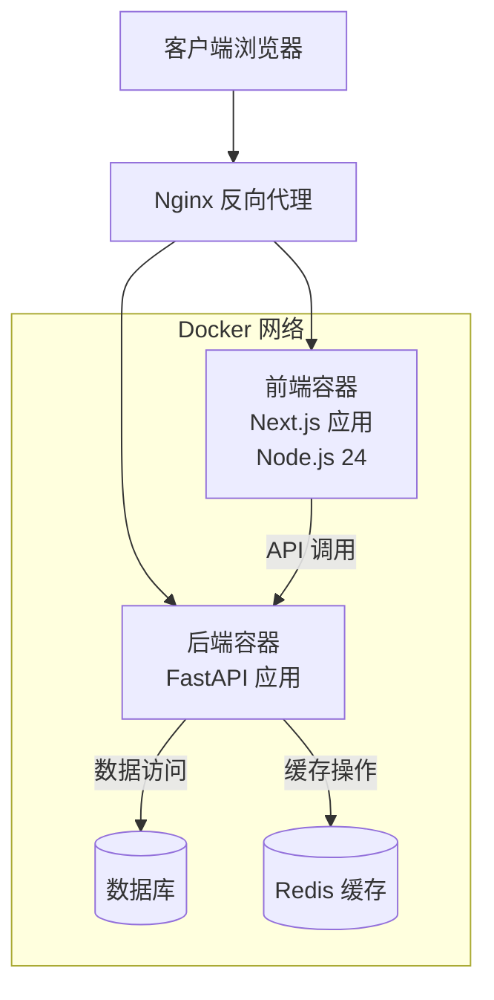

# 前端应用部署

<cite>
**本文引用的文件**
- [frontend/Dockerfile](file://frontend/Dockerfile)
- [.github/workflows/ci.yml](file://.github/workflows/ci.yml)
- [.github/workflows/deploy.yml](file://.github/workflows/deploy.yml)
- [docker-compose.yml](file://docker-compose.yml)
- [nginx/nginx.conf](file://nginx/nginx.conf)
- [frontend/.dockerignore](file://frontend/.dockerignore)
- [frontend/next.config.js](file://frontend/next.config.js)
- [frontend/package.json](file://frontend/package.json)
- [frontend/public/manifest.json](file://frontend/public/manifest.json)
</cite>

## 更新摘要
**所做更改**
- 将 Node.js 运行时从版本 20 升级到版本 24，提升构建性能和内存管理
- 更新 Dockerfile 配置以支持新的 Node.js 24 环境
- 优化 CI/CD 流水线配置，消除弃用警告并提升构建效率
- 增强容器化部署的稳定性和安全性

## 目录
- 概述
- 容器化架构
- Docker 配置详解
- Next.js 构建优化
- Nginx 反向代理配置
- 环境变量管理
- PWA 和 SEO 优化
- 性能监控集成
- 部署流程
- 故障排除

## 概述

InvestRing 前端应用采用现代化的容器化部署方案，基于最新的 Node.js 24 运行时环境，将 Next.js 应用打包为独立的 Docker 容器，并通过 Nginx 作为统一的外部流量入口。该架构确保了应用的可移植性、可扩展性和高可用性。

前端应用经过专门的 Docker 镜像优化，包含 512MB 的内存限制，确保在生产环境中稳定运行。所有外部请求通过 Nginx 反向代理进行路由分发，内部服务间通信通过 Docker 网络实现。Node.js 24 的升级带来了更好的性能表现和更低的内存占用。

## 容器化架构

### 整体架构图



**图表来源**
- [docker-compose.yml](file://docker-compose.yml)
- [nginx/nginx.conf](file://nginx/nginx.conf)

### 容器组件说明

| 组件 | 端口 | 内存限制 | 描述 |
|------|------|----------|------|
| 前端容器 | 3000 | 512MB | Next.js 静态应用服务器（Node.js 24） |
| 后端容器 | 8000 | 1GB | FastAPI 业务逻辑服务 |
| Nginx | 80, 443 | 256MB | 反向代理和静态文件服务 |
| 数据库 | 5432 | 1GB | PostgreSQL 数据存储 |
| Redis | 6379 | 512MB | 缓存和会话存储 |

## Docker 配置详解

### 前端 Dockerfile 配置

前端应用使用多阶段构建优化镜像大小，现已升级到 Node.js 24：

**构建阶段**
- 基于 Node.js 24 官方镜像
- 安装依赖并执行 Next.js 构建
- 生成优化的静态资源

**运行阶段**
- 基于轻量级 Node.js 24 运行时
- 仅包含必要的运行时依赖
- 最小化攻击面和安全风险

**内存配置**
- 容器内存限制：512MB
- Node.js 堆内存：256MB
- 操作系统预留：256MB

**更新** Node.js 24 提供了更好的垃圾回收性能和更低的内存占用，提升了构建速度和运行时性能。

**Section sources**
- [frontend/Dockerfile](file://frontend/Dockerfile)
- [frontend/.dockerignore](file://frontend/.dockerignore)

### Docker Compose 编排

前端容器在 docker-compose.yml 中定义，包含以下关键配置：

- **服务名称**: `frontend`
- **镜像构建**: 从 frontend/Dockerfile 构建
- **端口映射**: 80:3000 (Nginx 转发)
- **环境变量**: NODE_ENV=production
- **依赖关系**: 依赖 backend 服务
- **健康检查**: HTTP 健康检查端点
- **重启策略**: 自动重启机制

**Section sources**
- [docker-compose.yml](file://docker-compose.yml)

## Next.js 构建优化

### 构建配置

Next.js 配置文件针对生产环境进行了专门优化：

**代码分割**
- 自动按路由分割代码
- 第三方库按需加载
- 图片资源懒加载

**静态资源优化**
- 自动压缩 CSS 和 JavaScript
- 图片格式转换和压缩
- 字体文件优化

**缓存策略**
- 长期缓存静态资产
- 版本化文件名
- CDN 友好配置

**Section sources**
- [frontend/next.config.js](file://frontend/next.config.js)
- [frontend/package.json](file://frontend/package.json)

### 环境变量配置

前端应用支持多种环境变量：

| 变量名 | 描述 | 默认值 | 用途 |
|--------|------|--------|------|
| NEXT_PUBLIC_API_URL | API 基础 URL | /api | 后端 API 地址 |
| NEXT_PUBLIC_APP_NAME | 应用名称 | InvestRing | 应用标识 |
| NEXT_PUBLIC_ENV | 环境标识 | production | 运行环境 |
| NEXT_PUBLIC_ANALYTICS_ID | 分析 ID | - | 统计分析 |

## Nginx 反向代理配置

### 主要功能

Nginx 作为统一入口提供以下功能：

**负载均衡**
- 前端应用实例间负载均衡
- 健康检查和故障转移
- 连接池管理

**安全增强**
- HTTPS 终止和重定向
- 请求头过滤和验证
- 速率限制和防攻击

**性能优化**
- Gzip 压缩
- 浏览器缓存策略
- 静态资源直接服务

### 路由规则

```nginx
location / {
    proxy_pass http://frontend:3000;
    proxy_set_header Host $host;
    proxy_set_header X-Real-IP $remote_addr;
}

location /api {
    proxy_pass http://backend:8000;
    proxy_set_header Host $host;
    proxy_set_header X-Real-IP $remote_addr;
}
```

**Section sources**
- [nginx/nginx.conf](file://nginx/nginx.conf)

## 环境变量管理

### 开发环境

开发时使用 `.env.local` 文件：

```bash
NEXT_PUBLIC_API_URL=http://localhost:8000
NEXT_PUBLIC_APP_NAME=InvestRing-Dev
NEXT_PUBLIC_ENV=development
```

### 生产环境

生产环境通过 Docker 环境变量注入：

```yaml
environment:
  - NODE_ENV=production
  - NEXT_PUBLIC_API_URL=http://api.example.com
  - NEXT_PUBLIC_APP_NAME=InvestRing
```

### 安全最佳实践

- 敏感信息使用 Docker Secrets
- 环境变量验证和默认值
- 日志中避免输出敏感数据

## PWA 和 SEO 优化

### PWA 配置

前端应用支持渐进式 Web 应用特性：

**离线支持**
- Service Worker 缓存策略
- 离线页面和错误处理
- 后台同步机制

**应用清单**
- 应用图标和多分辨率支持
- 启动画面和主题色
- 触摸设备和桌面适配

**Section sources**
- [frontend/public/manifest.json](file://frontend/public/manifest.json)

### SEO 优化

Next.js 内置的 SEO 优化：

**元数据管理**
- 动态标题和描述
- Open Graph 标签
- Twitter Card 支持

**结构化数据**
- JSON-LD 标记
- 面包屑导航
- 站点地图生成

## 性能监控集成

### 监控指标

前端应用收集以下关键指标：

**性能指标**
- 首屏加载时间
- 交互响应时间
- 资源加载统计

**用户行为**
- 页面访问统计
- 用户路径分析
- 错误率监控

### 集成方案

- Google Analytics 集成
- 自定义性能监控
- 错误追踪和上报

## 部署流程

### 本地开发

```bash
# 启动开发环境
docker-compose up -d

# 查看日志
docker-compose logs -f frontend

# 停止服务
docker-compose down
```

### 生产部署

```bash
# 构建镜像
docker build -t investring-frontend:latest ./frontend

# 推送镜像
docker push investring-frontend:latest

# 更新部署
docker-compose pull
docker-compose up -d
```

### CI/CD 集成

GitHub Actions 自动化流水线已更新以支持 Node.js 24：

- 代码提交触发测试
- 自动构建 Docker 镜像（基于 Node.js 24）
- 镜像安全扫描
- 自动部署到生产环境
- 消除弃用警告并提升构建效率

**更新** CI/CD 流水线现在使用 Node.js 24 环境，提供更好的构建性能和兼容性。

**Section sources**
- [docker-compose.yml](file://docker-compose.yml)
- [frontend/Dockerfile](file://frontend/Dockerfile)
- [.github/workflows/ci.yml](file://.github/workflows/ci.yml)
- [.github/workflows/deploy.yml](file://.github/workflows/deploy.yml)

## 故障排除

### 常见问题

**容器无法启动**
- 检查端口冲突
- 验证环境变量配置
- 查看容器日志

**API 连接失败**
- 确认后端服务状态
- 检查网络连通性
- 验证 CORS 配置

**性能问题**
- 监控资源使用情况
- 分析慢查询日志
- 优化静态资源

### Node.js 24 相关注意事项

**兼容性检查**
- 确认所有依赖包支持 Node.js 24
- 检查 TypeScript 编译器的兼容性
- 验证第三方库的 Node.js 版本要求

**性能优化**
- 利用 Node.js 24 的新特性提升性能
- 调整内存限制以适应新的垃圾回收机制
- 监控构建时间和内存使用情况

### 监控和维护

- 定期更新基础镜像
- 监控磁盘空间使用
- 备份重要配置和数据
- 关注 Node.js 24 的安全更新

---

**文档版本**: 1.1  
**最后更新**: 2024年  
**维护者**: InvestRing 开发团队