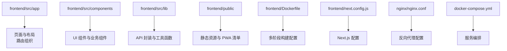
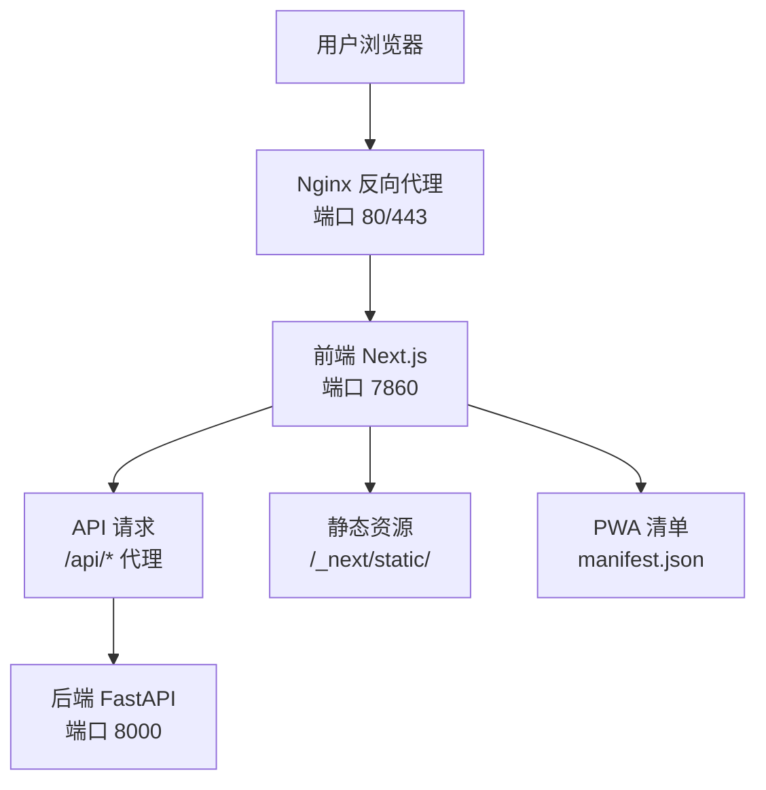
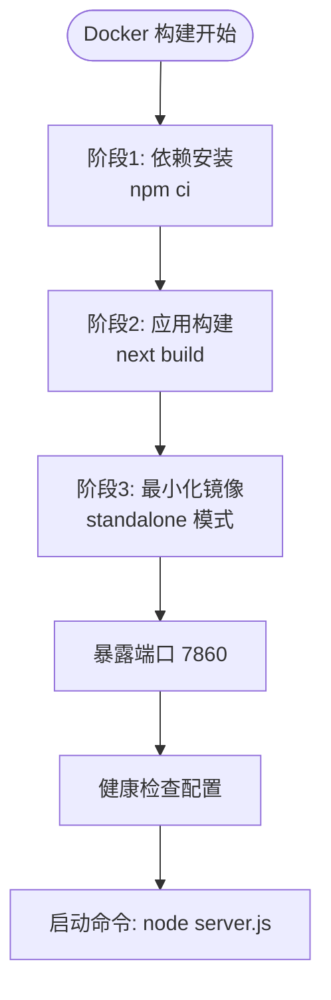
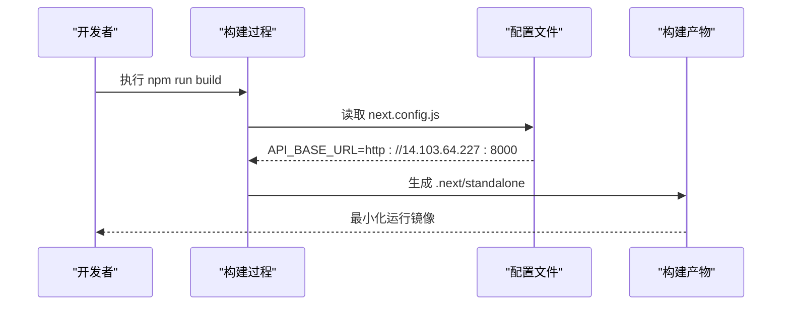
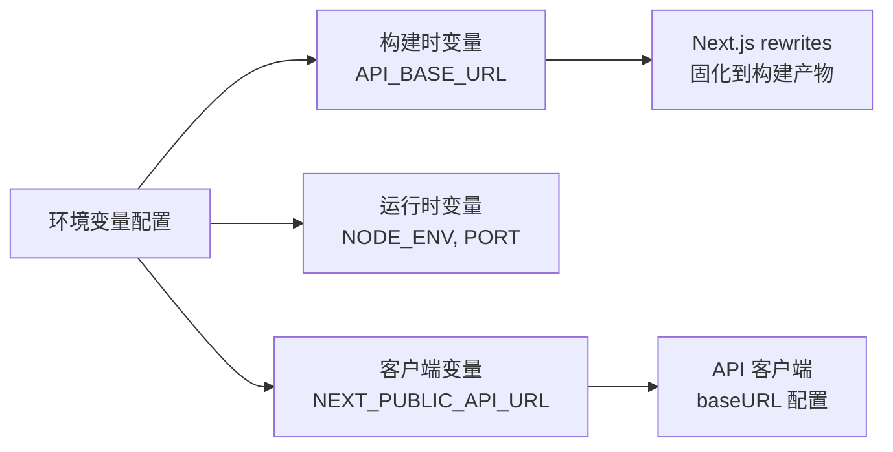
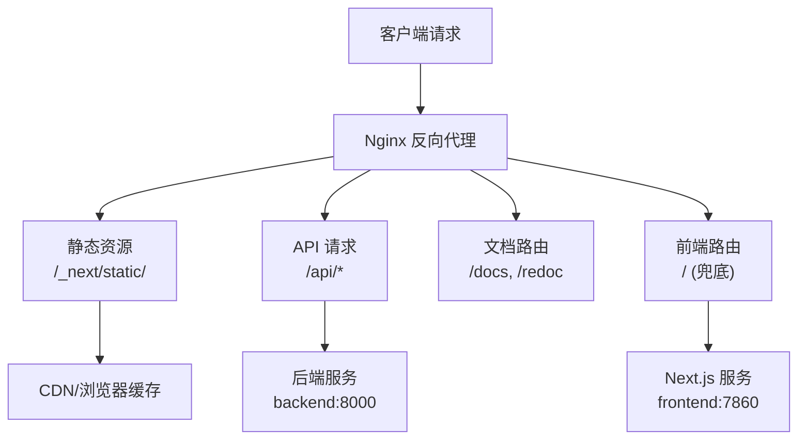

# 前端应用部署

<cite>
**本文引用的文件**
- [Dockerfile](file://frontend/Dockerfile)
- [next.config.js](file://frontend/next.config.js)
- [package.json](file://frontend/package.json)
- [.dockerignore](file://frontend/.dockerignore)
- [nginx.conf](file://nginx/nginx.conf)
- [docker-compose.yml](file://docker-compose.yml)
- [client.ts](file://frontend/src/lib/api/client.ts)
</cite>

## 更新摘要
**变更内容**
- 重构 Dockerfile 以适配魔搭 Studio 平台兼容性
- 端口从 3000 更改为 7860，符合平台要求
- 启用 Next.js standalone 模式部署，大幅减小镜像体积
- 构建时环境变量配置 API 基础地址，支持多环境部署
- 优化容器化部署流程，支持非 root 用户运行

## 目录
1. [简介](#简介)
2. [项目结构](#项目结构)
3. [核心组件](#核心组件)
4. [架构总览](#架构总览)
5. [详细组件分析](#详细组件分析)
6. [依赖分析](#依赖分析)
7. [性能考虑](#性能考虑)
8. [故障排查指南](#故障排查指南)
9. [结论](#结论)
10. [附录](#附录)

## 简介
本文件面向 InvestRing 前端应用（Next.js）的生产部署，重点覆盖基于魔搭 Studio 平台的容器化部署方案。文档详细说明 Next.js standalone 模式构建、Docker 镜像优化、端口配置、环境变量注入以及 Nginx 反向代理配置。内容基于最新的 Dockerfile 重构和部署配置，帮助团队在现代化平台上稳定交付生产环境应用。

## 项目结构
前端采用 Next.js 应用程序目录结构，结合现代化的容器化部署方案：
- frontend/src/app：页面与布局、路由组织
- frontend/src/components：UI 组件与业务组件
- frontend/src/lib：API 封装与工具函数
- frontend/public：静态资源与 PWA 清单
- frontend/Dockerfile：多阶段 Docker 构建配置
- frontend/next.config.js：Next.js 构建与运行时配置
- nginx/nginx.conf：Nginx 反向代理配置
- docker-compose.yml：服务编排配置

**章节来源**
- [Dockerfile:1-83](file://frontend/Dockerfile#L1-L83)
- [next.config.js:1-23](file://frontend/next.config.js#L1-L23)
- [package.json:1-51](file://frontend/package.json#L1-L51)
- [nginx.conf:1-157](file://nginx/nginx.conf#L1-L157)
- [docker-compose.yml:1-48](file://docker-compose.yml#L1-L48)

## 核心组件
- **容器化构建**
  - 多阶段 Docker 构建：依赖安装 → 应用构建 → 最小化运行镜像
  - Next.js standalone 模式：仅打包运行所需的最小依赖
  - 非 root 用户安全运行：创建专用 nextjs 用户
- **端口与环境配置**
  - 魔搭 Studio 兼容：端口 7860，监听 0.0.0.0
  - 构建时环境变量注入：API_BASE_URL 固化到 rewrites
  - 健康检查：HTTP 端点监控应用状态
- **Nginx 反向代理**
  - 统一入口：前端静态资源、API 代理、文档路由
  - 缓存策略：静态资源长期缓存，API 请求实时转发
  - 安全 Headers：X-Frame-Options、X-Content-Type-Options 等

**章节来源**
- [Dockerfile:50-83](file://frontend/Dockerfile#L50-L83)
- [next.config.js:3-19](file://frontend/next.config.js#L3-L19)
- [nginx.conf:54-129](file://nginx/nginx.conf#L54-L129)

## 架构总览
下图展示前端在魔搭 Studio 平台上的完整部署架构：Docker 镜像通过多阶段构建生成最小化运行时，Next.js standalone 服务器监听 7860 端口，Nginx 作为反向代理统一处理请求路由。

**图表来源**
- [nginx.conf:54-129](file://nginx/nginx.conf#L54-L129)
- [Dockerfile:65-75](file://frontend/Dockerfile#L65-L75)
- [next.config.js:12-19](file://frontend/next.config.js#L12-L19)

## 详细组件分析

### Docker 容器化部署
**已更新** 重构为三阶段构建，完全适配魔搭 Studio 平台要求

- **依赖安装阶段**
  - 使用 node:20-alpine 基础镜像
  - npm ci 确保依赖版本一致性
  - 支持国内镜像源配置
- **应用构建阶段**
  - 复制依赖和源码
  - 构建时注入 API_BASE_URL 环境变量
  - 执行 next build 生成 standalone 产物
- **生产运行阶段**
  - 最小化镜像：仅包含运行所需文件
  - 非 root 用户：nextjs 用户 UID 1001
  - 端口配置：7860 端口，监听 0.0.0.0
  - 健康检查：HTTP 端点监控

**图表来源**
- [Dockerfile:12-24](file://frontend/Dockerfile#L12-L24)
- [Dockerfile:28-46](file://frontend/Dockerfile#L28-L46)
- [Dockerfile:50-83](file://frontend/Dockerfile#L50-L83)

**章节来源**
- [Dockerfile:1-83](file://frontend/Dockerfile#L1-L83)
- [.dockerignore:1-24](file://frontend/.dockerignore#L1-L24)

### Next.js Standalone 模式配置
**已更新** 启用 standalone 输出模式，大幅减小镜像体积

- **构建配置**
  - output: 'standalone' 启用独立部署模式
  - outputFileTracingRoot 指定工作空间根目录
  - reactStrictMode 启用严格模式提升质量
- **API 代理**
  - rewrites 将 /api/* 重写到后端地址
  - 构建时固化 API_BASE_URL 环境变量
  - 支持本地开发和生产环境切换
- **环境变量处理**
  - NEXT_PUBLIC_API_URL 客户端环境变量
  - API_BASE_URL 构建时环境变量
  - NODE_ENV=production 生产环境优化

**图表来源**
- [next.config.js:3-19](file://frontend/next.config.js#L3-L19)
- [Dockerfile:36-45](file://frontend/Dockerfile#L36-L45)

**章节来源**
- [next.config.js:1-23](file://frontend/next.config.js#L1-L23)
- [Dockerfile:36-45](file://frontend/Dockerfile#L36-L45)

### 环境变量与 API 配置
**已更新** 支持构建时环境变量注入和多环境部署

- **环境变量类型**
  - 构建时变量：API_BASE_URL（固化到 rewrites）
  - 运行时变量：NODE_ENV、NEXT_TELEMETRY_DISABLED
  - 客户端变量：NEXT_PUBLIC_API_URL（默认 /api）
- **API 客户端配置**
  - baseURL 优先使用 NEXT_PUBLIC_API_URL
  - 回退到 /api 路径进行代理
  - 支持相对路径和绝对 URL
- **多环境支持**
  - 开发环境：localhost:8000
  - 生产环境：http://14.103.64.227:8000
  - 魔搭 Studio：默认后端地址

**图表来源**
- [Dockerfile:36-42](file://frontend/Dockerfile#L36-L42)
- [Dockerfile:65-69](file://frontend/Dockerfile#L65-L69)
- [client.ts:5](file://frontend/src/lib/api/client.ts#L5)

**章节来源**
- [Dockerfile:36-42](file://frontend/Dockerfile#L36-L42)
- [Dockerfile:65-69](file://frontend/Dockerfile#L65-L69)
- [client.ts:5](file://frontend/src/lib/api/client.ts#L5)

### Nginx 反向代理配置
**已更新** 适配新的前端端口 7860 和 standalone 模式

- **上游服务定义**
  - backend:8000 - FastAPI 后端服务
  - frontend:7860 - Next.js 前端服务（原 3000 端口）
- **路由规则**
  - /_next/static/ - 前端静态资源（长期缓存）
  - /api/ - API 请求代理到后端
  - /docs, /redoc - FastAPI 文档路由
  - /health - 后端健康检查端点
  - / - 前端路由兜底规则
- **性能优化**
  - Gzip 压缩：文本、CSS、JavaScript、JSON
  - 缓存策略：静态资源 365 天缓存
  - 连接优化：keepalive_timeout、tcp_nopush
- **安全配置**
  - X-Frame-Options: SAMEORIGIN
  - X-Content-Type-Options: nosniff
  - X-XSS-Protection: 1; mode=block

**图表来源**
- [nginx.conf:54-129](file://nginx/nginx.conf#L54-L129)
- [nginx.conf:37-50](file://nginx/nginx.conf#L37-L50)

**章节来源**
- [nginx.conf:1-157](file://nginx/nginx.conf#L1-L157)

### 构建脚本与依赖管理
**已更新** 支持多阶段构建和环境变量传递

- **构建脚本**
  - dev: next dev - 开发服务器
  - build: next build - 生产构建
  - start: next start - 生产启动
  - lint: eslint . - 代码检查
- **依赖管理**
  - package-lock.json 锁定依赖版本
  - npm ci 确保可重复构建
  - 支持自定义 npm 镜像源
- **开发依赖**
  - TypeScript 5.6.0
  - ESLint 9.16.0
  - Playwright 1.49.0
  - Tailwind CSS 4.0.0

**章节来源**
- [package.json:5-12](file://frontend/package.json#L5-L12)
- [package.json:13-41](file://frontend/package.json#L13-L41)
- [package.json:42-49](file://frontend/package.json#L42-L49)

## 依赖分析
- **运行时依赖**
  - next: ^15.1.0 - Next.js 框架
  - react: ^19.0.0, react-dom: ^19.0.0 - React 生态系统
  - axios: ^1.7.0 - HTTP 客户端
  - @tanstack/react-query: ^5.62.0 - 数据获取和状态管理
  - zustand: ^5.0.0 - 轻量级状态管理
- **UI 组件库**
  - @radix-ui/* 系列 - 无样式 UI 组件
  - tailwindcss: ^4.0.0 - 原子化 CSS 框架
  - lucide-react: ^0.460.0 - 图标库
- **开发工具**
  - typescript: ~5.6.0 - TypeScript 编译器
  - eslint: ^9.16.0 - 代码检查
  - @playwright/test: ^1.49.0 - E2E 测试

**章节来源**
- [package.json:13-41](file://frontend/package.json#L13-L41)
- [package.json:42-49](file://frontend/package.json#L42-L49)

## 性能考虑
- **容器优化**
  - 多阶段构建减少镜像体积
  - Alpine Linux 基础镜像
  - 非 root 用户运行提升安全性
- **Next.js 优化**
  - standalone 模式最小化依赖
  - SWC 编译替代 Babel
  - 自动代码分割和懒加载
- **网络优化**
  - Nginx Gzip 压缩
  - 静态资源长期缓存
  - WebSocket 支持（开发环境）
- **监控与健康检查**
  - Docker HEALTHCHECK 配置
  - HTTP 健康检查端点
  - 日志轮转和限制

## 故障排查指南
- **容器启动失败**
  - 检查端口 7860 是否被占用
  - 验证 API_BASE_URL 环境变量配置
  - 查看容器日志：docker logs <container_name>
- **API 请求失败**
  - 确认后端服务运行在 8000 端口
  - 检查 Nginx 反向代理配置
  - 验证 CORS 设置和跨域配置
- **静态资源 404**
  - 确认 _next/static 目录存在
  - 检查 Nginx 静态资源缓存配置
  - 验证 public 目录文件权限
- **健康检查失败**
  - 检查 /login 端点是否可访问
  - 验证防火墙和安全组规则
  - 确认应用启动完成时间

**章节来源**
- [Dockerfile:77-79](file://frontend/Dockerfile#L77-L79)
- [nginx.conf:110-114](file://nginx/nginx.conf#L110-L114)
- [nginx.conf:70-75](file://nginx/nginx.conf#L70-L75)

## 结论
本次更新主要围绕魔搭 Studio 平台的容器化部署需求，重构了 Dockerfile 并启用了 Next.js standalone 模式。新的部署方案具有以下优势：

- **平台兼容性**：完全适配魔搭 Studio 的端口要求和运行环境
- **镜像优化**：standalone 模式大幅减小镜像体积，提升部署效率
- **安全加固**：非 root 用户运行，最小化攻击面
- **环境隔离**：构建时环境变量注入，支持多环境部署
- **运维友好**：健康检查和日志配置完善，便于监控和维护

建议在生产环境中结合 CDN 加速静态资源分发，并配置适当的资源限制和健康检查机制。

## 附录
- **常用命令**
  - 本地开发：npm run dev
  - 构建镜像：docker build -f frontend/Dockerfile frontend/
  - 运行容器：docker run -p 7860:7860 <image_name>
  - 查看日志：docker logs -f <container_id>
- **关键配置定位**
  - Docker 构建：frontend/Dockerfile
  - Next.js 配置：frontend/next.config.js
  - Nginx 代理：nginx/nginx.conf
  - 服务编排：docker-compose.yml
  - API 客户端：frontend/src/lib/api/client.ts
- **环境变量说明**
  - API_BASE_URL：后端 API 基础地址（构建时）
  - NEXT_PUBLIC_API_URL：客户端 API 地址（运行时）
  - NODE_ENV：运行环境（development/production）
  - PORT：服务监听端口（7860）