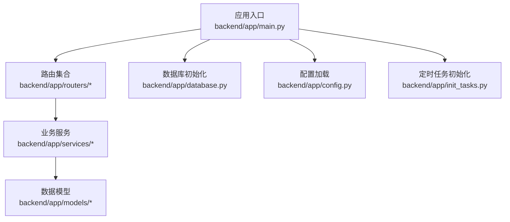
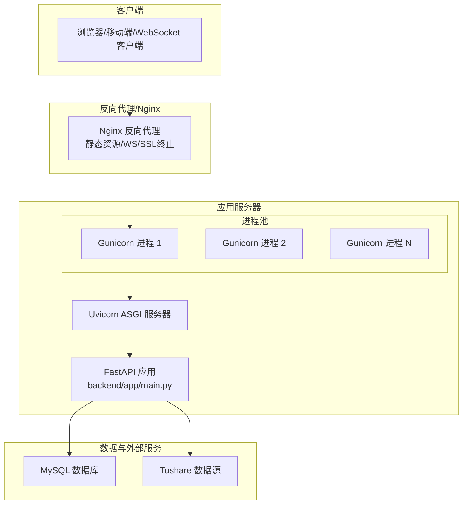
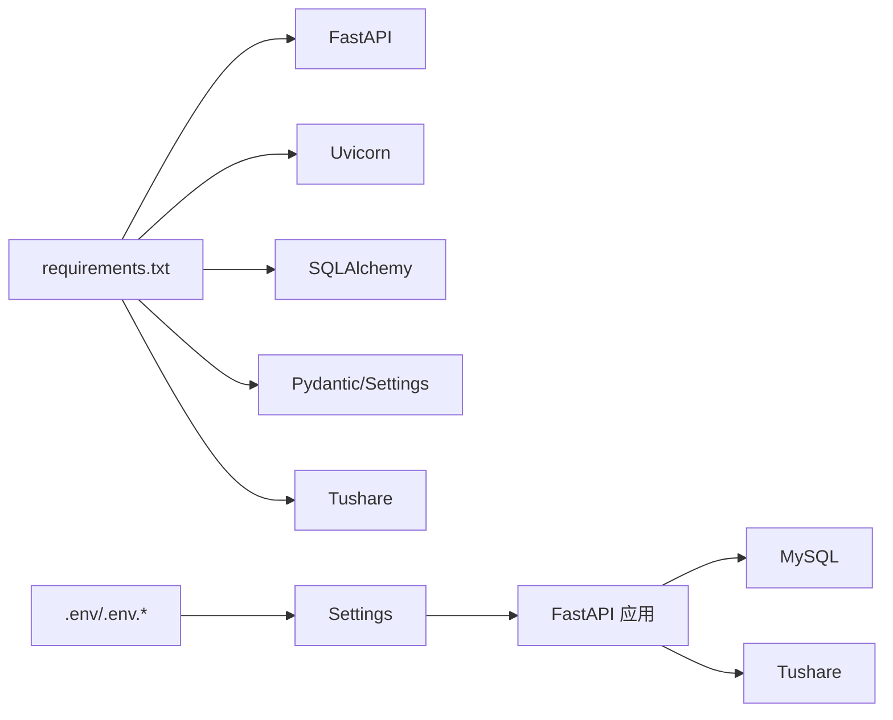

# 后端服务部署

<cite>
**本文引用的文件**
- [backend/app/main.py](file://backend/app/main.py)
- [backend/app/config.py](file://backend/app/config.py)
- [backend/requirements.txt](file://backend/requirements.txt)
- [start.sh](file://start.sh)
- [backend/app/routers/tasks.py](file://backend/app/routers/tasks.py)
- [backend/app/services/snapshot_service.py](file://backend/app/services/snapshot_service.py)
- [backend/app/dependencies.py](file://backend/app/dependencies.py)
- [backend/app/routers/auth.py](file://backend/app/routers/auth.py)
- [Docs/04-后端开发.md](file://Docs/04-后端开发.md)
- [Docs/07-日志系统设计.md](file://Docs/07-日志系统设计.md)
</cite>

## 目录
1. [简介](#简介)
2. [项目结构](#项目结构)
3. [核心组件](#核心组件)
4. [架构总览](#架构总览)
5. [详细组件分析](#详细组件分析)
6. [依赖分析](#依赖分析)
7. [性能考虑](#性能考虑)
8. [故障排查指南](#故障排查指南)
9. [结论](#结论)
10. [附录](#附录)

## 简介
本文件面向 InvestRing 后端服务的生产部署，围绕以下目标展开：  
- 明确 Uvicorn ASGI 服务器的配置与运行方式  
- 提供 Gunicorn 生产部署的可操作选项  
- 文档化 Nginx 反向代理配置要点（静态文件、WebSocket、SSL 终止）  
- 解释进程管理工具（PM2、Supervisor）在本项目中的适用性与配置思路  
- 规划健康检查端点、日志轮转与错误处理策略  
- 提供负载均衡、缓存与性能监控的集成建议  

本项目基于 FastAPI 构建，使用 SQLAlchemy 进行数据库访问，通过 Pydantic Settings 管理配置，开发阶段默认使用 Uvicorn 作为 ASGI 服务器。

## 项目结构
后端采用“应用入口 + 路由 + 服务层 + 数据模型”的分层组织，核心入口为 ASGI 应用对象，便于直接由 Uvicorn/Gunicorn 托管。

图表来源
- [backend/app/main.py:1-53](file://backend/app/main.py#L1-L53)
- [backend/app/config.py:1-37](file://backend/app/config.py#L1-L37)

章节来源
- [backend/app/main.py:1-53](file://backend/app/main.py#L1-L53)
- [backend/app/config.py:1-37](file://backend/app/config.py#L1-L37)

## 核心组件
- ASGI 应用对象：由 FastAPI 实例提供，支持 HTTP/WS 请求处理。  
- 配置系统：通过 Pydantic Settings 从 .env 文件读取数据库、安全与应用参数。  
- 路由模块：按功能域划分，统一挂载到应用根路径下。  
- 数据库引擎：初始化表结构与会话管理。  
- 定时任务：应用启动时初始化调度任务。

章节来源
- [backend/app/main.py:17-53](file://backend/app/main.py#L17-L53)
- [backend/app/config.py:5-36](file://backend/app/config.py#L5-L36)

## 架构总览
下图展示从客户端到后端服务的整体交互路径，以及与数据库、外部数据源的关系。

图表来源
- [backend/app/main.py:17-53](file://backend/app/main.py#L17-L53)
- [backend/app/config.py:7-12](file://backend/app/config.py#L7-L12)

## 详细组件分析

### Uvicorn 开发与本地运行
- 本地开发使用 Uvicorn 直接托管 ASGI 应用对象，支持热重载与调试。  
- 一键启动脚本中演示了如何导出环境变量并以守护进程方式启动 Uvicorn，同时将日志输出到文件。  
- 建议在生产环境中使用 Gunicorn 作为 WSGI 容器，内部再运行 Uvicorn 子进程（uvicorn.workers.UvicornWorker）。  

章节来源
- [start.sh:49-54](file://start.sh#L49-L54)
- [backend/requirements.txt:2](file://backend/requirements.txt#L2)

### Gunicorn 生产部署选项
- 使用 Gunicorn 托管 ASGI 应用时，推荐 worker 类型为 uvicorn.workers.UvicornWorker。  
- 建议根据 CPU 核数设置进程数与线程数，例如：进程数 = CPU 核数 × 2 + 1，线程数 = 1~2。  
- 关键启动参数示例（不包含具体代码内容）：绑定地址、工作进程数、worker 类型、日志级别、超时时间、优雅停机等。  
- 将数据库连接字符串与密钥等敏感信息通过环境变量注入，避免硬编码。  

章节来源
- [backend/requirements.txt:2](file://backend/requirements.txt#L2)
- [backend/app/config.py:30-31](file://backend/app/config.py#L30-L31)

### Nginx 反向代理配置要点
- 静态文件服务：将前端构建产物交由 Nginx 提供，减少后端压力。  
- WebSocket 支持：确保升级头部与长连接配置正确，以便实时消息推送。  
- SSL 终止：在 Nginx 层启用 HTTPS，证书与私钥路径需正确配置；将 HTTP 重定向至 HTTPS。  
- 负载均衡：结合上游 Gunicorn 多进程，实现水平扩展与高可用。  
- 超时与缓冲：合理设置 proxy_read_timeout、proxy_send_timeout 与 client_max_body_size。  

（本节为通用部署实践说明，不直接分析具体文件）

### 进程管理工具（PM2/Supervisor）
- PM2：适合 Node.js 场景，对 Python ASGI 应用支持有限，不建议用于托管 Uvicorn/Gunicorn。  
- Supervisor：更适合托管 Python 进程，可配置自动重启、日志轮转与运行状态监控。  
- 推荐方案：使用 Supervisor 管理 Gunicorn 进程组，配合 systemd 或容器编排实现开机自启与健康检查。  

（本节为通用部署实践说明，不直接分析具体文件）

### 健康检查端点
- 建议在应用根路径或专用路径提供健康检查接口，返回服务状态与依赖连通性（如数据库连接）。  
- 在 Nginx 中配置健康检查请求，结合 2xx/5xx 判定后端存活。  
- 结合进程管理器的 restart_policy 与报警机制，实现故障自动恢复。  

（本节为通用部署实践说明，不直接分析具体文件）

### 日志轮转与错误处理策略
- 日志轮转：使用 logrotate 或系统自带工具，按大小或时间切分后端日志文件，保留周期与压缩策略需明确。  
- 错误处理：在路由层捕获异常并返回标准错误码与消息；记录结构化日志，区分请求上下文与堆栈信息。  
- 本项目已使用 Python logging 模块进行日志记录，可在服务启动脚本中将 stdout/stderr 重定向到日志文件。  

章节来源
- [backend/app/services/snapshot_service.py:6](file://backend/app/services/snapshot_service.py#L6)
- [backend/app/services/snapshot_service.py:20](file://backend/app/services/snapshot_service.py#L20)
- [backend/app/services/snapshot_service.py:74](file://backend/app/services/snapshot_service.py#L74)
- [backend/app/services/snapshot_service.py:91](file://backend/app/services/snapshot_service.py#L91)
- [backend/app/services/snapshot_service.py:171](file://backend/app/services/snapshot_service.py#L171)
- [start.sh:20](file://start.sh#L20)
- [start.sh:50](file://start.sh#L50)

### 负载均衡、缓存与性能监控
- 负载均衡：Nginx 作为 L7 反向代理，向上游 Gunicorn 多进程分发请求；可结合 keepalive 与连接池优化。  
- 缓存策略：对热点查询结果使用内存缓存（如 LRU 缓存），对静态资源与响应头进行缓存控制。  
- 性能监控：集成 APM 工具（如 OpenTelemetry）采集指标与链路追踪；在 Nginx 中开启访问日志与错误日志，定期分析慢请求与错误趋势。  

（本节为通用部署实践说明，不直接分析具体文件）

## 依赖分析
- 应用依赖 FastAPI、SQLAlchemy、Pydantic/Settings、Uvicorn、Tushare 等第三方库。  
- 配置通过 Settings 类从 .env 注入，数据库 URL 可显式覆盖。  
- 启动脚本负责安装依赖、设置 PYTHONPATH、加载环境变量并启动 Uvicorn。

图表来源
- [backend/requirements.txt:1-19](file://backend/requirements.txt#L1-L19)
- [backend/app/config.py:25-31](file://backend/app/config.py#L25-L31)

章节来源
- [backend/requirements.txt:1-19](file://backend/requirements.txt#L1-L19)
- [backend/app/config.py:25-31](file://backend/app/config.py#L25-L31)

## 性能考虑
- 并发模型：Uvicorn 默认使用 asyncio 事件循环，适合 I/O 密集型场景；对 CPU 密集型任务建议拆分或使用异步执行器。  
- 数据库连接：使用连接池与合理的超时设置，避免阻塞请求线程。  
- 序列化开销：对大响应体启用 gzip 压缩，减少网络传输时间。  
- 缓存命中：对高频查询建立缓存层，降低数据库压力。  

（本节为通用指导，不直接分析具体文件）

## 故障排查指南
- 认证与权限：当鉴权失败或权限不足时，路由层会返回相应状态码；可通过日志定位问题。  
- 任务执行：快照生成等任务失败会在日志中记录错误详情，便于回溯。  
- 异常处理：依赖层与路由层均定义了统一的异常处理逻辑，确保错误信息标准化输出。  

章节来源
- [backend/app/routers/auth.py:41](file://backend/app/routers/auth.py#L41)
- [backend/app/routers/auth.py:56](file://backend/app/routers/auth.py#L56)
- [backend/app/routers/auth.py:65](file://backend/app/routers/auth.py#L65)
- [backend/app/routers/auth.py:141](file://backend/app/routers/auth.py#L141)
- [backend/app/routers/tasks.py:226](file://backend/app/routers/tasks.py#L226)
- [backend/app/routers/tasks.py:228](file://backend/app/routers/tasks.py#L228)
- [backend/app/dependencies.py:59](file://backend/app/dependencies.py#L59)
- [backend/app/dependencies.py:77](file://backend/app/dependencies.py#L77)
- [backend/app/dependencies.py:94](file://backend/app/dependencies.py#L94)
- [backend/app/dependencies.py:122](file://backend/app/dependencies.py#L122)

## 结论
本项目具备良好的可部署性：ASGI 应用清晰、配置集中、日志与异常处理完善。生产部署建议采用 Gunicorn + Uvicorn Worker 的组合，配合 Nginx 实现反向代理与 SSL 终止，并通过进程管理工具与日志轮转保障稳定性。在此基础上，引入缓存与性能监控体系，可进一步提升用户体验与运维效率。

## 附录
- 开发与部署参考文档：  
  - [Docs/04-后端开发.md](file://Docs/04-后端开发.md)  
  - [Docs/07-日志系统设计.md](file://Docs/07-日志系统设计.md)