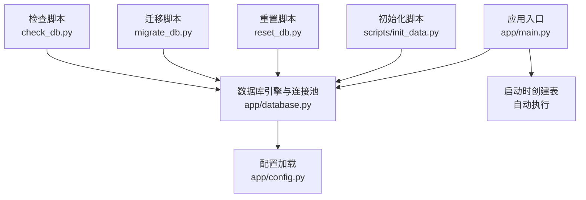
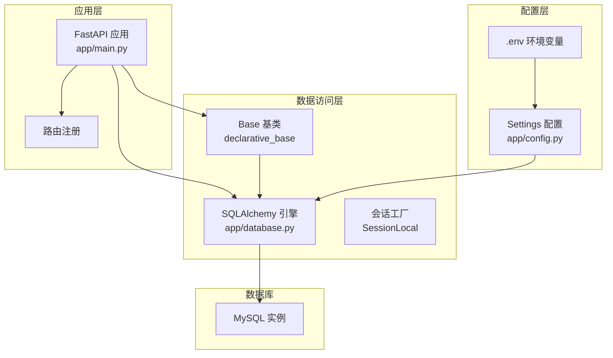
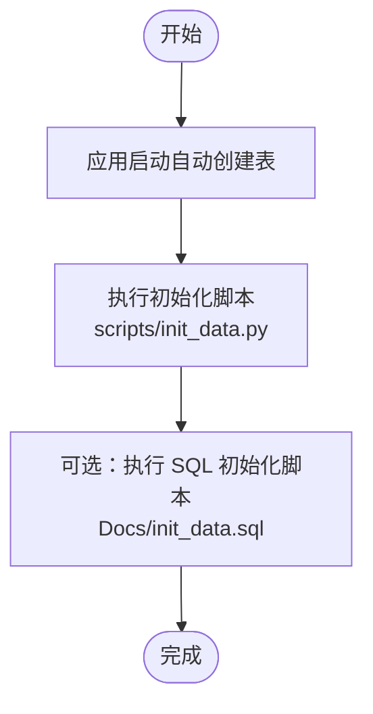
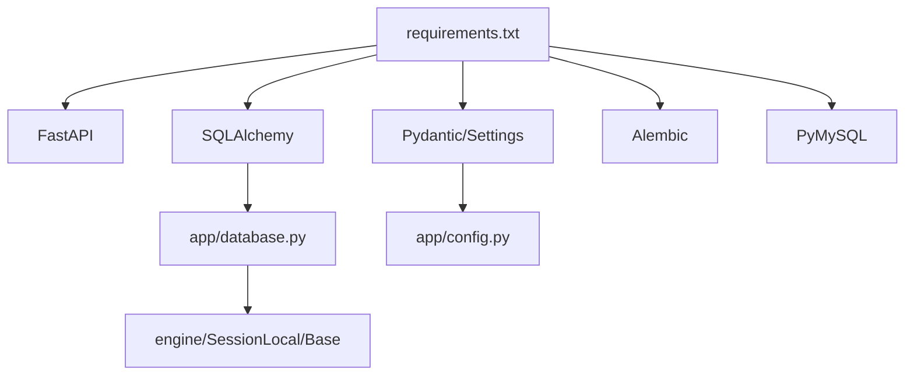

# 数据库部署

<cite>
**本文引用的文件**
- [backend/app/config.py](file://backend/app/config.py)
- [backend/app/database.py](file://backend/app/database.py)
- [backend/app/main.py](file://backend/app/main.py)
- [backend/requirements.txt](file://backend/requirements.txt)
- [backend/scripts/init_data.py](file://backend/scripts/init_data.py)
- [Docs/02-数据库设计.md](file://Docs/02-数据库设计.md)
- [Docs/init_data.sql](file://Docs/init_data.sql)
- [backend/check_db.py](file://backend/check_db.py)
- [backend/reset_db.py](file://backend/reset_db.py)
- [backend/migrate_db.py](file://backend/migrate_db.py)
- [start.sh](file://start.sh)
</cite>

## 目录
1. [简介](#简介)
2. [项目结构](#项目结构)
3. [核心组件](#核心组件)
4. [架构总览](#架构总览)
5. [详细组件分析](#详细组件分析)
6. [依赖分析](#依赖分析)
7. [性能考虑](#性能考虑)
8. [故障排查指南](#故障排查指南)
9. [结论](#结论)
10. [附录](#附录)

## 简介
本文件面向运维与开发人员，提供 InvestRing 项目的数据库部署与运维指南。内容覆盖 MySQL 安装与配置（字符集、存储引擎、性能参数）、数据库用户与权限、连接池配置、Alembic 版本迁移工具使用、数据库初始化与数据导入、备份策略、监控与性能调优建议。文中所有技术细节均以仓库中的实现与文档为依据。

## 项目结构
- 后端使用 SQLAlchemy 作为 ORM/连接层，通过配置类与数据库模块统一管理连接字符串与连接池参数。
- 应用启动时自动创建数据库表结构，初始化定时任务。
- 提供独立的初始化脚本与重置脚本，支持批量导入基础数据与重建数据库。
- 提供检查脚本用于验证数据库连通性与基础数据存在性。

图表来源
- [backend/app/main.py:1-53](file://backend/app/main.py#L1-L53)
- [backend/app/database.py:1-39](file://backend/app/database.py#L1-L39)
- [backend/app/config.py:1-37](file://backend/app/config.py#L1-L37)
- [backend/scripts/init_data.py:1-393](file://backend/scripts/init_data.py#L1-L393)
- [backend/reset_db.py:1-30](file://backend/reset_db.py#L1-L30)
- [backend/migrate_db.py:1-65](file://backend/migrate_db.py#L1-L65)
- [backend/check_db.py:1-35](file://backend/check_db.py#L1-L35)

章节来源
- [backend/app/main.py:1-53](file://backend/app/main.py#L1-L53)
- [backend/app/database.py:1-39](file://backend/app/database.py#L1-L39)
- [backend/app/config.py:1-37](file://backend/app/config.py#L1-L37)

## 核心组件
- 配置与连接字符串
  - 通过配置类加载 .env 环境变量，若未显式提供数据库连接字符串，则默认使用 utf8mb4 字符集的 MySQL 连接字符串。
- 连接池与引擎
  - 使用 SQLAlchemy 创建引擎，配置连接池大小、溢出数量、预检查与回收周期。
  - 支持 SQLite 的 WAL 模式配置（用于并发与性能优化），MySQL 场景下不生效。
- 应用启动流程
  - 启动时自动创建所有表结构，并初始化定时任务数据。
- 初始化与重置
  - 初始化脚本负责创建表并批量插入基础数据（投资人、资产分类、平台、产品、组合、定时任务）。
  - 重置脚本删除并重建所有表，适合开发测试环境快速回滚。
- 迁移与备份
  - 迁移脚本在重建数据库前后自动备份与恢复指定表的数据，保障业务连续性。
- 检查
  - 检查脚本验证数据库连通性与基础数据存在情况。

章节来源
- [backend/app/config.py:1-37](file://backend/app/config.py#L1-L37)
- [backend/app/database.py:1-39](file://backend/app/database.py#L1-L39)
- [backend/app/main.py:1-53](file://backend/app/main.py#L1-L53)
- [backend/scripts/init_data.py:1-393](file://backend/scripts/init_data.py#L1-L393)
- [backend/reset_db.py:1-30](file://backend/reset_db.py#L1-L30)
- [backend/migrate_db.py:1-65](file://backend/migrate_db.py#L1-L65)
- [backend/check_db.py:1-35](file://backend/check_db.py#L1-L35)

## 架构总览
下图展示数据库层在系统中的位置与交互关系，以及启动时的表创建与初始化流程。

图表来源
- [backend/app/main.py:1-53](file://backend/app/main.py#L1-L53)
- [backend/app/database.py:1-39](file://backend/app/database.py#L1-L39)
- [backend/app/config.py:1-37](file://backend/app/config.py#L1-L37)

## 详细组件分析

### MySQL 安装与配置
- 字符集与排序规则
  - 默认连接字符串使用 utf8mb4 字符集，适用于多语言与表情符号存储。
- 存储引擎
  - 项目未强制指定存储引擎，通常使用默认 InnoDB。
- 性能参数优化（建议）
  - 连接池参数已在应用侧配置（pool_size、max_overflow、pool_pre_ping、pool_recycle），生产环境建议结合数据库实例资源与负载评估调整。
  - MySQL 层面建议关注 innodb_buffer_pool_size、innodb_log_file_size、innodb_flush_log_at_trx_commit、innodb_flush_method 等参数，按 OLTP/OLAP 混合场景平衡写入与查询性能。
- 事务隔离级别
  - 默认 READ-COMMITTED 适合大多数业务场景；如涉及复杂报表统计，可评估批量导出或只读副本。

章节来源
- [backend/app/config.py:30-31](file://backend/app/config.py#L30-L31)
- [backend/app/database.py:8-16](file://backend/app/database.py#L8-L16)

### 数据库用户创建与权限分配
- 用户与主机
  - 建议为应用创建专用用户，并限制来源主机（如 localhost 或具体 IP）。
- 权限范围
  - 授予对目标数据库的 SELECT、INSERT、UPDATE、DELETE、CREATE、ALTER、INDEX、LOCK TABLES、TRIGGER、REFERENCES 等必要权限。
  - 避授予 SUPER、FILE 等高危权限。
- 安全建议
  - 使用强密码策略与定期轮换。
  - 通过只读副本或连接池代理实现读写分离与高可用。

章节来源
- [backend/app/config.py:7-11](file://backend/app/config.py#L7-L11)
- [backend/app/database.py:8-16](file://backend/app/database.py#L8-L16)

### 连接池配置
- 参数说明
  - pool_size：连接池大小。
  - max_overflow：超出 pool_size 后允许的最大溢出连接数。
  - pool_pre_ping：启用连接有效性检查，降低连接失效导致的异常。
  - pool_recycle：连接回收周期，避免长时间占用导致的连接泄漏。
- 生产建议
  - 根据并发请求峰值与数据库承载能力动态调整 pool_size 与 max_overflow。
  - 结合慢查询日志与连接池监控指标（等待时间、活跃连接数）持续优化。

章节来源
- [backend/app/database.py:8-16](file://backend/app/database.py#L8-L16)

### Alembic 版本迁移工具使用
- 安装与依赖
  - 项目 requirements 中包含 Alembic，可直接使用。
- 初始化
  - 在项目根目录执行 Alembic 初始化命令，生成版本目录与配置文件。
- 升级与降级
  - 升级：执行版本升级命令，应用变更到最新版本。
  - 降级：执行版本降级命令，退回至上一个或指定版本。
- 与现有脚本的关系
  - 项目同时提供了 reset_db.py 与 migrate_db.py 脚本，用于重建与迁移数据。建议在需要保留业务数据时优先使用 migrate_db.py，在开发测试环境可直接使用 reset_db.py。

章节来源
- [backend/requirements.txt:14](file://backend/requirements.txt#L14)
- [backend/reset_db.py:1-30](file://backend/reset_db.py#L1-L30)
- [backend/migrate_db.py:1-65](file://backend/migrate_db.py#L1-L65)

### 数据库初始化与数据导入
- 自动初始化
  - 应用启动时自动创建所有表结构。
- 批量初始化脚本
  - scripts/init_data.py 负责创建表并批量插入基础数据（投资人、资产分类、平台、产品、组合、定时任务）。
- SQL 初始化脚本
  - Docs/init_data.sql 提供 SQL 插入语句与索引创建，可用于离线导入或审计。
- 执行顺序建议
  - 先执行表结构创建（自动或 Alembic），再执行数据导入。
  - 导入前建议暂停定时任务，导入完成后恢复。

图表来源
- [backend/app/main.py:7-8](file://backend/app/main.py#L7-L8)
- [backend/scripts/init_data.py:25-37](file://backend/scripts/init_data.py#L25-L37)
- [Docs/init_data.sql:1-284](file://Docs/init_data.sql#L1-L284)

章节来源
- [backend/app/main.py:7-8](file://backend/app/main.py#L7-L8)
- [backend/scripts/init_data.py:25-37](file://backend/scripts/init_data.py#L25-L37)
- [Docs/init_data.sql:1-284](file://Docs/init_data.sql#L1-L284)

### 数据导入方法
- 通过初始化脚本
  - 使用 scripts/init_data.py 执行批量数据导入，适合自动化部署。
- 通过 SQL 脚本
  - 使用 Docs/init_data.sql 直接导入，适合离线或审计场景。
- 通过数据库客户端
  - 使用 mysqldump、LOAD DATA INFILE 等工具进行高效批量导入。

章节来源
- [backend/scripts/init_data.py:352-392](file://backend/scripts/init_data.py#L352-L392)
- [Docs/init_data.sql:1-284](file://Docs/init_data.sql#L1-L284)

### 备份策略
- 全量备份
  - 使用逻辑备份（mysqldump）或物理备份（xtrabackup/Percona XtraBackup）定期生成全量备份。
- 增量备份
  - 结合二进制日志（binlog）进行增量备份，缩短 RPO。
- 归档与恢复演练
  - 将备份归档至安全存储，定期进行恢复演练，验证备份完整性与恢复时间。

章节来源
- [backend/migrate_db.py:10-19](file://backend/migrate_db.py#L10-L19)
- [backend/migrate_db.py:28-40](file://backend/migrate_db.py#L28-L40)

### 监控与性能调优
- 监控指标
  - 连接池：活跃连接数、等待时间、超时次数。
  - 数据库：缓冲池命中率、锁等待、慢查询、临时表与排序。
  - 应用：请求延迟、错误率、重试次数。
- 性能优化建议
  - 索引优化：根据查询模式创建复合索引，定期分析与重构。
  - SQL 优化：避免 N+1 查询，使用批量插入与更新。
  - 连接池优化：根据并发与响应时间调整 pool_size 与 max_overflow。
  - 缓存：热点数据与只读报表使用缓存层（Redis/Memcached）。
  - 分库分表：当数据量达到瓶颈时，评估水平分片与读写分离。

章节来源
- [backend/app/database.py:8-16](file://backend/app/database.py#L8-L16)
- [Docs/02-数据库设计.md:563-595](file://Docs/02-数据库设计.md#L563-L595)

## 依赖分析
- 运行时依赖
  - FastAPI、SQLAlchemy、Pydantic、Pydantic Settings、Alembic、PyMySQL 等。
- 数据库层依赖
  - SQLAlchemy 引擎与连接池由应用配置统一管理。
- 启动流程依赖
  - 应用启动时依赖配置加载与数据库连接，随后创建表并初始化任务。

图表来源
- [backend/requirements.txt:1-19](file://backend/requirements.txt#L1-L19)
- [backend/app/database.py:1-39](file://backend/app/database.py#L1-L39)
- [backend/app/config.py:1-37](file://backend/app/config.py#L1-L37)

章节来源
- [backend/requirements.txt:1-19](file://backend/requirements.txt#L1-L19)
- [backend/app/database.py:1-39](file://backend/app/database.py#L1-L39)
- [backend/app/config.py:1-37](file://backend/app/config.py#L1-L37)

## 性能考虑
- 连接池参数已在应用侧配置，生产环境建议结合数据库实例资源与负载评估调整。
- MySQL 层建议关注缓冲池、日志与刷盘策略，平衡吞吐与一致性。
- 业务层面建议优化热点查询索引、批量写入与缓存策略。

章节来源
- [backend/app/database.py:8-16](file://backend/app/database.py#L8-L16)
- [Docs/02-数据库设计.md:563-595](file://Docs/02-数据库设计.md#L563-L595)

## 故障排查指南
- 数据库连通性
  - 使用 check_db.py 验证连接与基础数据存在性。
- 表结构问题
  - 使用 reset_db.py 重建所有表，快速回退到初始状态。
- 迁移与数据保留
  - 使用 migrate_db.py 在重建数据库前后自动备份与恢复指定表数据。
- 启动与日志
  - 通过 start.sh 启动后端服务，查看 logs/backend.log 获取错误信息。

章节来源
- [backend/check_db.py:14-35](file://backend/check_db.py#L14-L35)
- [backend/reset_db.py:22-30](file://backend/reset_db.py#L22-L30)
- [backend/migrate_db.py:43-65](file://backend/migrate_db.py#L43-L65)
- [start.sh:36-54](file://start.sh#L36-L54)

## 结论
本部署文档基于仓库中的配置与脚本，给出了 MySQL 安装与配置、用户权限、连接池、Alembic 迁移、初始化与数据导入、备份与监控的实践建议。建议在生产环境中结合业务负载与数据库实例能力，持续优化连接池与 MySQL 参数，并建立完善的备份与监控体系。

## 附录
- 启动与环境变量
  - start.sh 负责安装依赖、加载 .env 并启动后端服务，便于本地开发与测试。
- 数据模型与索引
  - 数据库设计文档详细列出了表结构、索引与外键约束，可作为性能优化与排障的参考。

章节来源
- [start.sh:1-93](file://start.sh#L1-L93)
- [Docs/02-数据库设计.md:9-800](file://Docs/02-数据库设计.md#L9-L800)