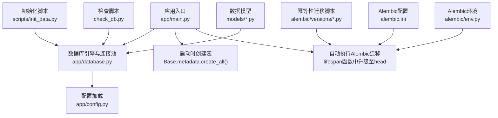
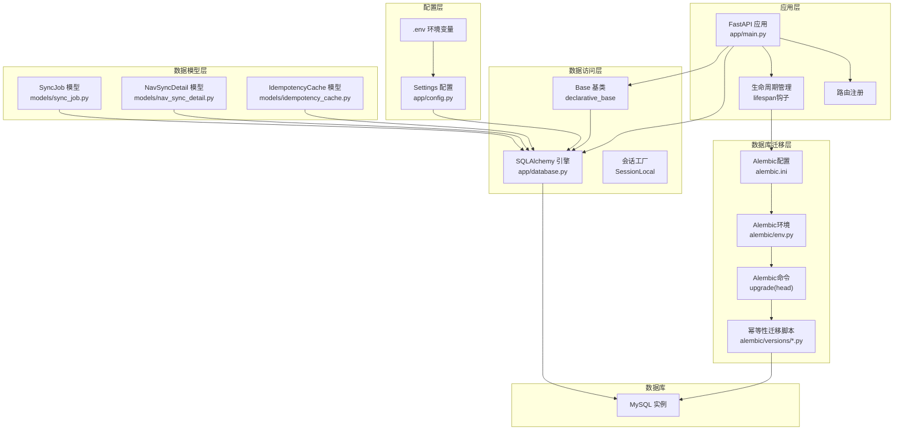
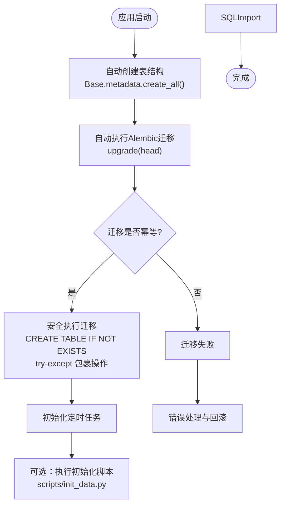
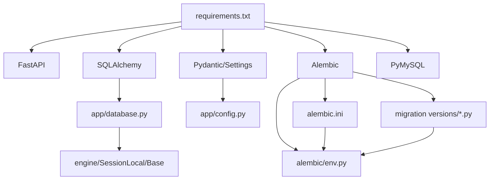

# 数据库部署

<cite>
**本文引用的文件**
- [backend/app/config.py](file://backend/app/config.py)
- [backend/app/database.py](file://backend/app/database.py)
- [backend/app/main.py](file://backend/app/main.py)
- [backend/requirements.txt](file://backend/requirements.txt)
- [backend/scripts/init_data.py](file://backend/scripts/init_data.py)
- [backend/check_db.py](file://backend/check_db.py)
- [backend/alembic.ini](file://backend/alembic.ini)
- [backend/alembic/env.py](file://backend/alembic/env.py)
- [backend/alembic/versions/0001_sync_job_and_nav_sync_detail_job_id.py](file://backend/alembic/versions/0001_sync_job_and_nav_sync_detail_job_id.py)
- [backend/alembic/versions/0002_investor_holding_derived_fields.py](file://backend/alembic/versions/0002_investor_holding_derived_fields.py)
- [backend/alembic/versions/0003_trade_transfer_group_not_null.py](file://backend/alembic/versions/0003_trade_transfer_group_not_null.py)
- [backend/Dockerfile](file://backend/Dockerfile)
- [docker-compose.yml](file://docker-compose.yml)
- [docker-compose.dev.yml](file://docker-compose.dev.yml)
- [start.sh](file://start.sh)
</cite>

## 更新摘要
**所做更改**
- **重要安全更新**：移除了危险的数据库工具脚本 reset_db.py 和 migrate_db.py，防止意外数据丢失或损坏
- 强调使用 Alembic 迁移作为安全的数据库版本管理方案
- 更新了应用启动时自动执行 Alembic 迁移的说明
- 完善了幂等性迁移的最佳实践指南
- 增强了故障排查指南，提供替代的安全操作方案

## 目录
1. [简介](#简介)
2. [项目结构](#项目结构)
3. [核心组件](#核心组件)
4. [架构总览](#架构总览)
5. [详细组件分析](#详细组件分析)
6. [依赖分析](#依赖分析)
7. [性能考虑](#性能考虑)
8. [故障排查指南](#故障排查指南)
9. [结论](#结论)
10. [附录](#附录)

## 简介
本文件面向运维与开发人员，提供 InvestRing 项目的数据库部署与运维指南。内容覆盖 MySQL 安装与配置（字符集、存储引擎、性能参数）、数据库用户与权限、连接池配置、Alembic 版本迁移工具使用、数据库初始化与数据导入、备份策略、监控与性能调优建议。文中所有技术细节均以仓库中的实现与文档为依据。

**重要安全更新**：本项目已移除危险的数据库工具脚本（reset_db.py 和 migrate_db.py），采用 Alembic 迁移作为唯一的数据库版本管理方案，确保数据安全性和可追溯性。应用启动时自动执行 Alembic 迁移，支持幂等性操作，大幅提升了部署自动化程度和可靠性。

## 项目结构
- 后端使用 SQLAlchemy 作为 ORM/连接层，通过配置类与数据库模块统一管理连接字符串与连接池参数。
- **安全增强**：应用启动时自动创建数据库表结构并执行 Alembic 迁移，无需手动干预。
- **幂等性设计**：Alembic 迁移脚本采用幂等性设计，支持 CREATE TABLE IF NOT EXISTS、try-except 包裹的列添加操作，以及幂等的索引和外键约束创建。
- 提供独立的初始化脚本用于批量导入基础数据，确保数据一致性。
- 提供检查脚本用于验证数据库连通性与基础数据存在性。



图表来源
- [backend/app/main.py:10-36](file://backend/app/main.py#L10-L36)
- [backend/app/database.py:12-20](file://backend/app/database.py#L12-L20)
- [backend/app/config.py:46-47](file://backend/app/config.py#L46-L47)
- [backend/alembic/versions/0001_sync_job_and_nav_sync_detail_job_id.py:18-73](file://backend/alembic/versions/0001_sync_job_and_nav_sync_detail_job_id.py#L18-L73)
- [backend/scripts/init_data.py:25-37](file://backend/scripts/init_data.py#L25-L37)
- [backend/check_db.py:14-35](file://backend/check_db.py#L14-L35)
- [backend/alembic.ini:1-38](file://backend/alembic.ini#L1-L38)
- [backend/alembic/env.py:1-40](file://backend/alembic/env.py#L1-L40)

章节来源
- [backend/app/main.py:10-36](file://backend/app/main.py#L10-L36)
- [backend/app/database.py:12-20](file://backend/app/database.py#L12-L20)
- [backend/app/config.py:46-47](file://backend/app/config.py#L46-L47)

## 核心组件
- 配置与连接字符串
  - 通过配置类加载 .env 环境变量，若未显式提供数据库连接字符串，则默认使用 utf8mb4 字符集的 MySQL 连接字符串。
- 连接池与引擎
  - 使用 SQLAlchemy 创建引擎，配置连接池大小、溢出数量、预检查与回收周期。
  - 支持 SQLite 的 WAL 模式配置（用于并发与性能优化），MySQL 场景下不生效。
- **安全增强**：应用启动流程
  - 启动时自动创建所有表结构，执行 Alembic 迁移至最新版本。
  - 通过 FastAPI lifespan 钩子实现迁移逻辑，确保每次启动都保持数据库架构最新。
- **幂等性设计**：Alembic 迁移支持
  - 迁移脚本采用幂等性设计，支持 CREATE TABLE IF NOT EXISTS 语法。
  - 使用 try-except 包裹列添加操作，避免字段已存在时的错误。
  - 实现幂等的索引和外键约束创建，确保多次执行不会产生冲突。
- 初始化与检查
  - 初始化脚本负责批量插入基础数据（投资人、资产分类、平台、产品、组合、定时任务）。
  - 检查脚本验证数据库连通性与基础数据存在情况。

**⚠️ 重要安全提示**：原 reset_db.py 和 migrate_db.py 脚本已被移除，不再支持直接重置或迁移数据库。请使用 Alembic 迁移进行数据库版本管理。

章节来源
- [backend/app/config.py:46-47](file://backend/app/config.py#L46-L47)
- [backend/app/database.py:12-20](file://backend/app/database.py#L12-L20)
- [backend/app/main.py:10-36](file://backend/app/main.py#L10-L36)
- [backend/alembic/versions/0001_sync_job_and_nav_sync_detail_job_id.py:18-73](file://backend/alembic/versions/0001_sync_job_and_nav_sync_detail_job_id.py#L18-L73)
- [backend/scripts/init_data.py:25-37](file://backend/scripts/init_data.py#L25-L37)
- [backend/check_db.py:14-35](file://backend/check_db.py#L14-L35)

## 架构总览
下图展示数据库层在系统中的位置与交互关系，以及启动时的表创建、Alembic 迁移与初始化流程。



图表来源
- [backend/app/main.py:19-36](file://backend/app/main.py#L19-L36)
- [backend/alembic.ini:1-38](file://backend/alembic.ini#L1-L38)
- [backend/alembic/env.py:1-40](file://backend/alembic/env.py#L1-L40)
- [backend/alembic/versions/0001_sync_job_and_nav_sync_detail_job_id.py:18-73](file://backend/alembic/versions/0001_sync_job_and_nav_sync_detail_job_id.py#L18-L73)
- [backend/app/database.py:12-20](file://backend/app/database.py#L12-L20)
- [backend/app/config.py:46-47](file://backend/app/config.py#L46-L47)

## 详细组件分析

### MySQL 安装与配置
- 字符集与排序规则
  - 默认连接字符串使用 utf8mb4 字符集，适用于多语言与表情符号存储。
  - Docker Compose 开发环境已配置 utf8mb4_unicode_ci 排序规则。
- 存储引擎
  - 项目未强制指定存储引擎，通常使用默认 InnoDB。
- 性能参数优化（建议）
  - 连接池参数已在应用侧配置（pool_size、max_overflow、pool_pre_ping、pool_recycle），生产环境建议结合数据库实例资源与负载评估调整。
  - MySQL 层面建议关注 innodb_buffer_pool_size、innodb_log_file_size、innodb_flush_log_at_trx_commit、innodb_flush_method 等参数，按 OLTP/OLAP 混合场景平衡写入与查询性能。
- 事务隔离级别
  - 默认 READ-COMMITTED 适合大多数业务场景；如涉及复杂报表统计，可评估批量导出或只读副本。

章节来源
- [backend/app/config.py:46-47](file://backend/app/config.py#L46-L47)
- [backend/app/database.py:12-20](file://backend/app/database.py#L12-L20)

### 数据库用户创建与权限分配
- 用户与主机
  - 建议为应用创建专用用户，并限制来源主机（如 localhost 或具体 IP）。
- 权限范围
  - 授予对目标数据库的 SELECT、INSERT、UPDATE、DELETE、CREATE、ALTER、INDEX、LOCK TABLES、TRIGGER、REFERENCES 等必要权限。
  - 避授予 SUPER、FILE 等高危权限。
- 安全建议
  - 使用强密码策略与定期轮换。
  - 通过只读副本或连接池代理实现读写分离与高可用。

章节来源
- [backend/app/config.py:7-11](file://backend/app/config.py#L7-L11)
- [backend/app/database.py:12-20](file://backend/app/database.py#L12-L20)

### 连接池配置
- 参数说明
  - pool_size：连接池大小。
  - max_overflow：超出 pool_size 后允许的最大溢出连接数。
  - pool_pre_ping：启用连接有效性检查，降低连接失效导致的异常。
  - pool_recycle：连接回收周期，避免长时间占用导致的连接泄漏。
- 生产建议
  - 根据并发请求峰值与数据库承载能力动态调整 pool_size 与 max_overflow。
  - 结合慢查询日志与连接池监控指标（等待时间、活跃连接数）持续优化。

章节来源
- [backend/app/database.py:12-20](file://backend/app/database.py#L12-L20)

### Alembic 版本迁移工具使用
- **重大安全更新**：应用启动时自动执行迁移
  - 应用现在会在启动时自动执行 Alembic 迁移，无需手动运行迁移命令。
  - 通过 FastAPI lifespan 钩子在应用启动时调用 `alembic_command.upgrade(alembic_cfg, "head")`。
  - 确保数据库架构始终与代码版本保持一致，提高部署自动化程度。
- **幂等性迁移支持**
  - 迁移脚本采用幂等性设计，支持 CREATE TABLE IF NOT EXISTS 语法，避免表重复创建错误。
  - 使用 try-except 包裹列添加操作，当字段已存在时跳过错误继续执行。
  - 实现幂等的索引和外键约束创建，确保多次执行不会产生冲突。
  - 支持全新部署和增量迁移两种场景，无需区分处理逻辑。
- 安装与依赖
  - 项目 requirements 中包含 Alembic，可直接使用。
- 配置文件
  - alembic.ini 配置了脚本位置和日志级别。
  - env.py 配置了数据库连接和目标元数据。
- 离线与在线模式
  - 支持离线模式（offline mode）和在线模式（online mode）两种迁移方式。

**幂等性迁移示例**：
```python
# 幂等性表创建
op.execute("""
    CREATE TABLE IF NOT EXISTS sync_job (
        id INTEGER PRIMARY KEY AUTO_INCREMENT,
        job_type VARCHAR(40) NOT NULL,
        status VARCHAR(20) NOT NULL DEFAULT 'pending',
        ...
    )
""")

# 幂等性列添加
for col_name, col in [
    ('job_id', sa.Column('job_id', sa.Integer(), nullable=True)),
    ('synced_count', sa.Column('synced_count', sa.Integer(), server_default='0')),
]:
    try:
        op.add_column('nav_sync_detail', col)
    except Exception:
        pass  # 字段已存在，跳过

# 幂等性索引创建
try:
    op.create_index('ix_sync_job_status', 'sync_job', ['status'])
except Exception:
    pass  # 索引已存在，跳过
```

章节来源
- [backend/app/main.py:19-36](file://backend/app/main.py#L19-L36)
- [backend/alembic/versions/0001_sync_job_and_nav_sync_detail_job_id.py:18-73](file://backend/alembic/versions/0001_sync_job_and_nav_sync_detail_job_id.py#L18-L73)
- [backend/alembic/versions/0002_investor_holding_derived_fields.py:21-32](file://backend/alembic/versions/0002_investor_holding_derived_fields.py#L21-L32)
- [backend/alembic/versions/0003_trade_transfer_group_not_null.py:24-39](file://backend/alembic/versions/0003_trade_transfer_group_not_null.py#L24-L39)
- [backend/alembic.ini:1-38](file://backend/alembic.ini#L1-L38)
- [backend/alembic/env.py:1-40](file://backend/alembic/env.py#L1-L40)

### 数据库初始化与数据导入
- **安全增强**：自动初始化流程
  - 应用启动时自动创建所有表结构（Base.metadata.create_all）。
  - 自动执行 Alembic 迁移至最新版本。
  - 初始化定时任务数据。
- **幂等性初始化支持**
  - 由于迁移脚本的幂等性设计，应用可以安全地多次重启而不会破坏现有数据。
  - 支持增量更新，新字段和索引会自动添加到现有数据库中。
- 批量初始化脚本
  - scripts/init_data.py 负责创建表并批量插入基础数据（投资人、资产分类、平台、产品、组合、定时任务）。
- 执行顺序建议
  - 先执行表结构创建（自动或 Alembic），再执行数据导入。
  - 导入前建议暂停定时任务，导入完成后恢复。

**幂等性初始化流程图**：


章节来源
- [backend/app/main.py:10-36](file://backend/app/main.py#L10-L36)
- [backend/alembic/versions/0001_sync_job_and_nav_sync_detail_job_id.py:18-73](file://backend/alembic/versions/0001_sync_job_and_nav_sync_detail_job_id.py#L18-L73)
- [backend/scripts/init_data.py:25-37](file://backend/scripts/init_data.py#L25-L37)

### 数据导入方法
- 通过初始化脚本
  - 使用 scripts/init_data.py 执行批量数据导入，适合自动化部署。
- 通过数据库客户端
  - 使用 mysqldump、LOAD DATA INFILE 等工具进行高效批量导入。

**幂等性导入注意事项**：
1. 确保模型文件中的字段名与数据库设计一致
2. 由于迁移脚本的幂等性，可以安全地多次执行导入操作
3. 如果已有数据，幂等性迁移会自动处理字段重命名
4. 验证索引是否正确创建在目标字段上

章节来源
- [backend/scripts/init_data.py:358-399](file://backend/scripts/init_data.py#L358-L399)

### 备份策略
- 全量备份
  - 使用逻辑备份（mysqldump）或物理备份（xtrabackup/Percona XtraBackup）定期生成全量备份。
- 增量备份
  - 结合二进制日志（binlog）进行增量备份，缩短 RPO。
- 归档与恢复演练
  - 将备份归档至安全存储，定期进行恢复演练，验证备份完整性与恢复时间。

**幂等性迁移的备份优势**：
- 由于迁移脚本的幂等性设计，可以在任何时间点安全地执行迁移
- 即使迁移失败，也不会破坏现有数据结构
- 支持回滚到之前的状态，便于问题排查和数据恢复

章节来源
- [backend/alembic/versions/0001_sync_job_and_nav_sync_detail_job_id.py:76-83](file://backend/alembic/versions/0001_sync_job_and_nav_sync_detail_job_id.py#L76-L83)

### 监控与性能调优
- 监控指标
  - 连接池：活跃连接数、等待时间、超时次数。
  - 数据库：缓冲池命中率、锁等待、慢查询、临时表与排序。
  - 应用：请求延迟、错误率、重试次数。
- 性能优化建议
  - 索引优化：根据查询模式创建复合索引，定期分析与重构。
  - SQL 优化：避免 N+1 查询，使用批量插入与更新。
  - 连接池优化：根据并发与响应时间调整 pool_size 与 max_overflow。
  - 缓存：热点数据与只读报表使用缓存层（Redis/Memcached）。
  - 分库分表：当数据量达到瓶颈时，评估水平分片与读写分离。

**幂等性迁移的性能考虑**：
- 幂等性操作避免了重复检查和错误处理开销
- CREATE TABLE IF NOT EXISTS 比先检查表是否存在更高效
- try-except 包裹的操作减少了不必要的数据库查询
- 大表字段添加操作建议使用在线DDL工具（如pt-online-schema-change）

章节来源
- [backend/app/database.py:12-20](file://backend/app/database.py#L12-L20)

### Docker 部署配置
- **安全增强**：容器化自动迁移
  - Docker 镜像构建时包含完整的 Alembic 配置和迁移脚本。
  - 应用启动时自动执行迁移，无需额外的初始化步骤。
  - 支持多阶段构建优化镜像大小。
- **幂等性容器部署**
  - 由于迁移脚本的幂等性设计，容器可以安全地多次重启
  - 支持滚动更新，新版本部署不会影响现有数据
  - 健康检查确保服务正常启动并完成迁移
- 开发环境配置
  - docker-compose.dev.yml 配置了 MySQL 8.0 数据库，使用 utf8mb4 字符集。
  - 支持热重载和源码挂载。
- 生产环境配置
  - docker-compose.yml 配置了后端、前端和 Nginx 反向代理。
  - 健康检查确保服务正常启动。
  - 资源限制适配 2GB 内存环境。

章节来源
- [backend/Dockerfile:72-75](file://backend/Dockerfile#L72-L75)
- [docker-compose.dev.yml:12-28](file://docker-compose.dev.yml#L12-L28)
- [docker-compose.yml:13-42](file://docker-compose.yml#L13-L42)

## 依赖分析
- 运行时依赖
  - FastAPI、SQLAlchemy、Pydantic、Pydantic Settings、Alembic、PyMySQL 等。
- 数据库层依赖
  - SQLAlchemy 引擎与连接池由应用配置统一管理。
- **安全增强**：启动流程依赖
  - 应用启动时依赖配置加载与数据库连接，随后创建表、执行 Alembic 迁移并初始化任务。
- **幂等性迁移依赖**
  - 迁移脚本依赖 SQLAlchemy 的异常处理机制
  - 支持多种数据库方言的幂等操作



图表来源
- [backend/requirements.txt:1-19](file://backend/requirements.txt#L1-L19)
- [backend/app/database.py:12-20](file://backend/app/database.py#L12-L20)
- [backend/app/config.py:46-47](file://backend/app/config.py#L46-L47)
- [backend/alembic.ini:1-38](file://backend/alembic.ini#L1-L38)
- [backend/alembic/env.py:1-40](file://backend/alembic/env.py#L1-L40)

章节来源
- [backend/requirements.txt:1-19](file://backend/requirements.txt#L1-L19)
- [backend/app/database.py:12-20](file://backend/app/database.py#L12-L20)
- [backend/app/config.py:46-47](file://backend/app/config.py#L46-L47)

## 性能考虑
- 连接池参数已在应用侧配置，生产环境建议结合数据库实例资源与负载评估调整。
- MySQL 层建议关注缓冲池、日志与刷盘策略，平衡吞吐与一致性。
- 业务层面建议优化热点查询索引、批量写入与缓存策略。
- **安全增强**：自动迁移性能考虑
  - 首次启动时执行迁移可能耗时较长，需合理设置健康检查超时时间。
  - 幂等性迁移减少了重复检查和错误处理开销。
  - 大表字段重命名可能导致锁表，建议在低峰期执行。
  - 监控迁移过程中的数据库性能指标。

**幂等性迁移的性能优势**：
- CREATE TABLE IF NOT EXISTS 比先检查表是否存在更高效
- try-except 包裹的操作避免了不必要的数据库查询
- 幂等性索引创建减少了重复索引检查的开销
- 支持并行迁移执行，提升大规模部署效率

章节来源
- [backend/app/database.py:12-20](file://backend/app/database.py#L12-L20)

## 故障排查指南
- 数据库连通性
  - 使用 check_db.py 验证连接与基础数据存在性。
- **安全更新**：数据库重建与迁移
  - **重要**：原 reset_db.py 和 migrate_db.py 脚本已被移除，不再支持直接重置数据库。
  - 如需重建数据库，请删除数据库后重新部署，应用会自动创建表结构和执行迁移。
  - 使用 Alembic downgrade 命令进行版本回滚，确保数据安全。
- 启动与日志
  - 通过 start.sh 启动后端服务，查看 logs/backend.log 获取错误信息。
- **安全增强**：自动迁移故障排查
  - 检查 alembic.ini 配置文件是否正确。
  - 验证 alembic/env.py 中的数据库连接配置。
  - 查看应用启动日志中的迁移执行结果。
- **幂等性迁移故障排查**
  - 检查迁移脚本中的 try-except 块是否正确捕获异常。
  - 验证 CREATE TABLE IF NOT EXISTS 语法是否与数据库版本兼容。
  - 确认幂等性索引和外键约束创建逻辑正确。

**幂等性迁移常见问题**：
1. **表已存在错误**：
   ```bash
   # 检查迁移脚本是否使用了 CREATE TABLE IF NOT EXISTS
   grep -n "CREATE TABLE IF NOT EXISTS" backend/alembic/versions/*.py
   
   # 检查是否有重复的表创建逻辑
   grep -n "create_table\|drop_table" backend/alembic/versions/*.py
   ```

2. **字段已存在错误**：
   ```bash
   # 检查列添加操作是否使用 try-except 包裹
   grep -n "add_column.*try-except\|try.*add_column" backend/alembic/versions/*.py
   
   # 验证字段是否存在于目标表中
   mysql -u user -p database -e "DESCRIBE table_name;"
   ```

3. **索引冲突错误**：
   ```bash
   # 检查索引创建是否使用幂等性逻辑
   grep -n "create_index.*try-except\|try.*create_index" backend/alembic/versions/*.py
   
   # 查看现有索引列表
   mysql -u user -p database -e "SHOW INDEX FROM table_name;"
   ```

**⚠️ 安全警告**：
- 不要尝试寻找或使用已移除的 reset_db.py 和 migrate_db.py 脚本
- 使用 Alembic 迁移进行所有数据库版本管理操作
- 在执行任何破坏性操作前，务必备份数据库
- 利用 Alembic 的 downgrade 功能进行安全回滚

章节来源
- [backend/check_db.py:14-35](file://backend/check_db.py#L14-L35)
- [backend/app/main.py:19-36](file://backend/app/main.py#L19-L36)
- [backend/alembic/versions/0001_sync_job_and_nav_sync_detail_job_id.py:76-83](file://backend/alembic/versions/0001_sync_job_and_nav_sync_detail_job_id.py#L76-L83)

## 结论
本部署文档基于仓库中的配置与脚本，给出了 MySQL 安装与配置、用户权限、连接池、Alembic 迁移、初始化与数据导入、备份与监控的实践建议。

**重要安全更新**：项目已移除危险的数据库工具脚本（reset_db.py 和 migrate_db.py），采用 Alembic 迁移作为唯一的数据库版本管理方案，大幅提升了数据安全性。幂等性迁移的主要优势包括：

1. **安全性增强**：消除危险脚本，防止意外数据丢失或损坏
2. **兼容性增强**：同时支持全新部署和增量迁移，无需区分处理逻辑
3. **安全性提升**：CREATE TABLE IF NOT EXISTS 和 try-except 包裹操作确保迁移过程的安全性和稳定性
4. **运维简化**：支持多次执行而不产生副作用，便于故障恢复和回滚操作
5. **性能优化**：减少重复检查和错误处理开销，提升迁移执行效率

部署时需要特别注意：

1. 确保模型文件与数据库设计保持一致
2. 自动迁移会在应用启动时执行，无需手动干预
3. 幂等性迁移支持安全的多版本共存和滚动更新
4. 在数据导入前完成字段重命名迁移
5. 验证所有相关索引都正确创建在新字段上
6. 监控幂等性迁移的执行性能和错误日志
7. **重要**：不再支持直接使用 reset_db.py 和 migrate_db.py 脚本

建议在生产环境中结合业务负载与数据库实例能力，持续优化连接池与 MySQL 参数，并建立完善的备份与监控体系。幂等性迁移的设计使得系统更加健壮，能够更好地应对复杂的部署场景和故障恢复需求。

## 附录
- 启动与环境变量
  - start.sh 负责安装依赖、加载 .env 并启动后端服务，便于本地开发与测试。
- **安全更新**：Docker 部署
  - 支持容器化部署，包含完整的自动迁移机制。
  - 提供开发和生产环境的 Docker Compose 配置。
  - 幂等性迁移确保容器可以安全地多次重启和滚动更新。

**幂等性迁移最佳实践**：
1. **表创建**：始终使用 CREATE TABLE IF NOT EXISTS 语法
2. **列操作**：使用 try-except 包裹 add_column 操作
3. **索引管理**：实现幂等的索引创建和删除逻辑
4. **外键约束**：确保外键约束创建的幂等性
5. **数据迁移**：使用 UPDATE 语句时添加 WHERE 条件避免重复更新
6. **错误处理**：记录详细的迁移日志，便于问题排查
7. **回滚支持**：提供对应的 downgrade 函数实现回滚能力

**安全操作指南**：
1. **数据库重建**：删除数据库后重新部署，应用会自动创建表结构
2. **版本回滚**：使用 `alembic downgrade <version>` 进行安全回滚
3. **数据备份**：在执行任何破坏性操作前务必备份数据库
4. **迁移验证**：使用 `alembic current` 检查当前迁移版本
5. **日志监控**：定期检查应用日志中的迁移执行情况

章节来源
- [start.sh:1-99](file://start.sh#L1-L99)
- [backend/Dockerfile:72-75](file://backend/Dockerfile#L72-L75)
- [docker-compose.yml:13-42](file://docker-compose.yml#L13-L42)
- [backend/alembic/versions/0001_sync_job_and_nav_sync_detail_job_id.py:18-73](file://backend/alembic/versions/0001_sync_job_and_nav_sync_detail_job_id.py#L18-L73)