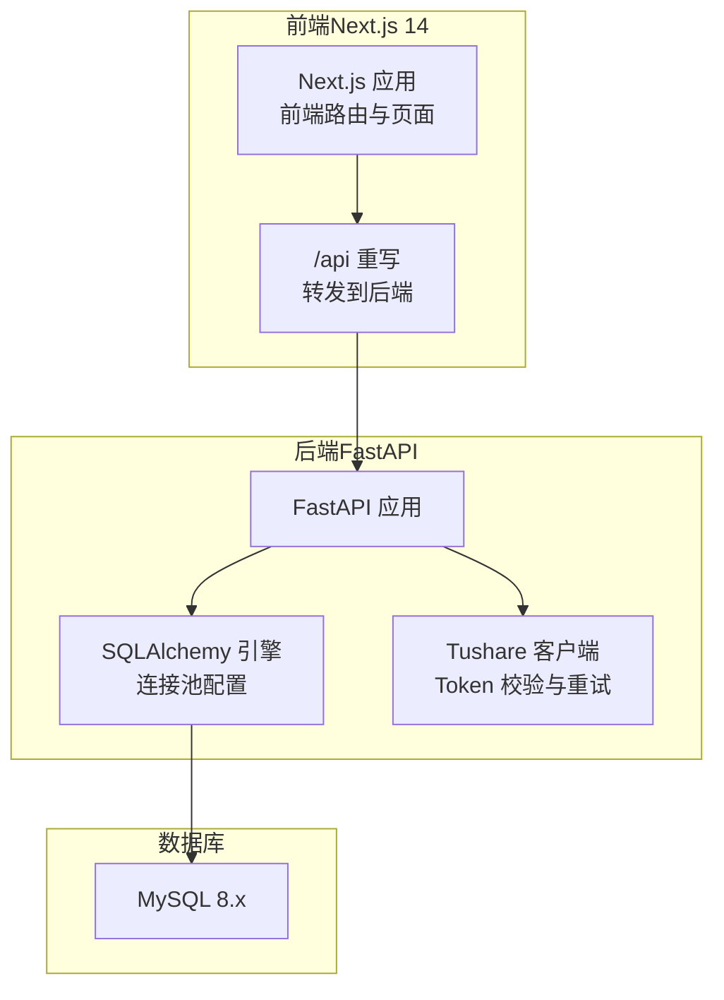
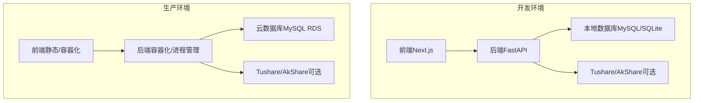
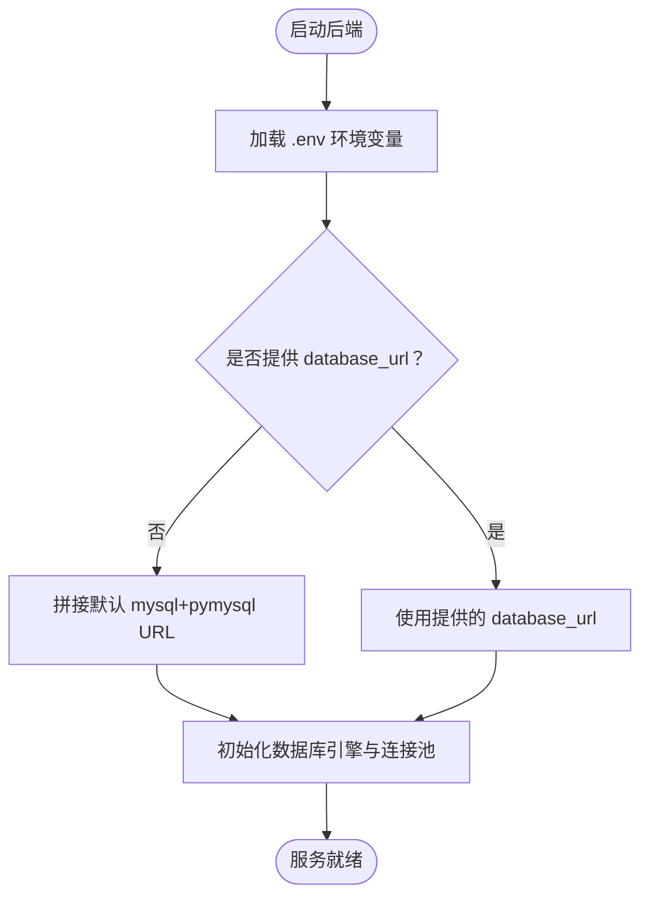
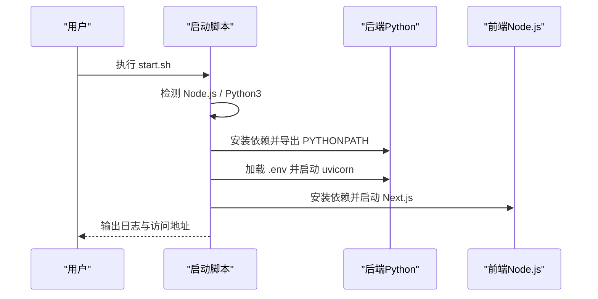
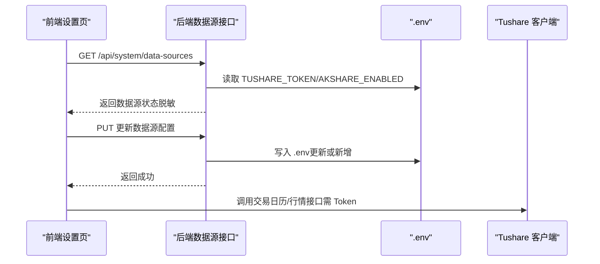
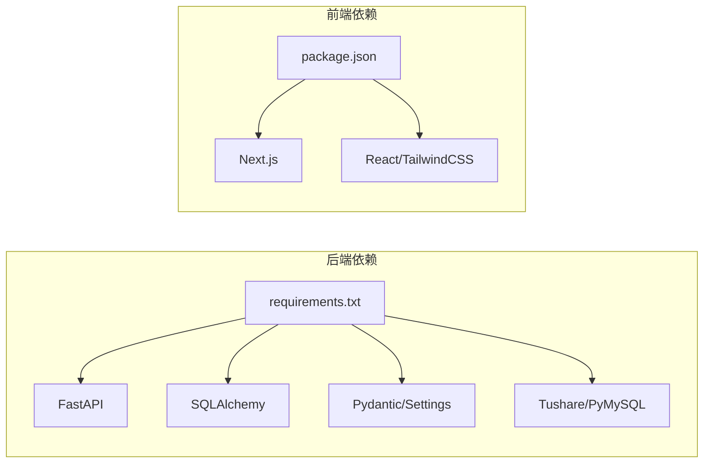

# 环境准备

<cite>
**本文引用的文件**
- [backend/app/config.py](file://backend/app/config.py)
- [backend/app/database.py](file://backend/app/database.py)
- [backend/requirements.txt](file://backend/requirements.txt)
- [package.json](file://package.json)
- [start.sh](file://start.sh)
- [check_db.py](file://check_db.py)
- [backend/app/main.py](file://backend/app/main.py)
- [frontend/next.config.js](file://frontend/next.config.js)
- [backend/app/services/tushare_client.py](file://backend/app/services/tushare_client.py)
- [backend/app/routers/data_sources.py](file://backend/app/routers/data_sources.py)
- [.gitignore](file://.gitignore)
- [backend/check_and_sync_2024_calendar.py](file://backend/check_and_sync_2024_calendar.py)
- [backend/test_update_cash_detailed.py](file://backend/test_update_cash_detailed.py)
- [frontend/src/app/settings/page.tsx](file://frontend/src/app/settings/page.tsx)
</cite>

## 目录
1. [简介](#简介)
2. [项目结构](#项目结构)
3. [核心组件](#核心组件)
4. [架构总览](#架构总览)
5. [详细组件分析](#详细组件分析)
6. [依赖分析](#依赖分析)
7. [性能考虑](#性能考虑)
8. [故障排除指南](#故障排除指南)
9. [结论](#结论)
10. [附录](#附录)

## 简介
本文件面向 InvestRing 项目的环境准备与部署，覆盖服务器硬件要求、操作系统兼容性、网络配置、必需软件安装、环境变量配置、系统依赖检查与故障排除，并区分开发与生产环境的差异。文档基于仓库中的配置与脚本进行梳理，帮助快速搭建本地开发与生产运行环境。

## 项目结构
InvestRing 采用前后端分离架构：
- 后端：FastAPI + SQLAlchemy，使用 MySQL 作为主数据库，支持通过环境变量配置连接参数。
- 前端：Next.js 14（App Router），通过反向代理将 /api 路由转发至后端。
- 数据源：Tushare API（可选），AkShare（可选），通过 .env 配置。

**图示来源**
- [frontend/next.config.js:1-16](file://frontend/next.config.js#L1-L16)
- [backend/app/main.py:1-53](file://backend/app/main.py#L1-L53)
- [backend/app/database.py:1-39](file://backend/app/database.py#L1-L39)
- [backend/app/services/tushare_client.py:1-222](file://backend/app/services/tushare_client.py#L1-L222)

**章节来源**
- [frontend/next.config.js:1-16](file://frontend/next.config.js#L1-L16)
- [backend/app/main.py:1-53](file://backend/app/main.py#L1-L53)
- [backend/app/database.py:1-39](file://backend/app/database.py#L1-L39)

## 核心组件
- 配置与环境变量：后端通过 pydantic-settings 读取 .env，支持数据库连接、安全密钥、Tushare Token、应用调试开关等。
- 数据库引擎：SQLAlchemy 引擎具备连接池、预 ping、回收等配置，支持 SQLite WAL 模式。
- 启动脚本：一键启动前后端服务，自动安装依赖、加载 .env、输出日志位置与访问地址。
- 数据源客户端：封装 Tushare API 调用，包含 Token 校验、重试机制与错误类型。
- 前端反向代理：将 /api 路由转发至后端 8000 端口，便于本地联调。

**章节来源**
- [backend/app/config.py:1-37](file://backend/app/config.py#L1-L37)
- [backend/app/database.py:1-39](file://backend/app/database.py#L1-L39)
- [start.sh:1-93](file://start.sh#L1-L93)
- [backend/app/services/tushare_client.py:1-222](file://backend/app/services/tushare_client.py#L1-L222)
- [frontend/next.config.js:1-16](file://frontend/next.config.js#L1-L16)

## 架构总览
下图展示开发环境与生产环境的关键差异点，包括数据库类型、数据源配置、网络暴露方式与日志输出位置。

[此图为概念性架构示意，无需“图示来源”标注]

## 详细组件分析

### 环境变量与 .env 配置
- 数据库连接：支持通过 database_url 或 db_host/db_port/db_user/db_password/db_name 组合生成默认 URL。
- 安全与应用：secret_key、token_expire_days、debug。
- Tushare API：tushare_token。
- 环境文件：默认读取项目根目录下的 .env。

**图示来源**
- [backend/app/config.py:1-37](file://backend/app/config.py#L1-L37)
- [backend/app/database.py:1-39](file://backend/app/database.py#L1-L39)

**章节来源**
- [backend/app/config.py:1-37](file://backend/app/config.py#L1-L37)
- [backend/app/database.py:1-39](file://backend/app/database.py#L1-L39)

### 数据库连接与连接池
- 连接池参数：pool_size、max_overflow、pool_pre_ping、pool_recycle。
- SQLite 特殊配置：WAL 模式、busy_timeout、synchronous。
- 默认字符集：utf8mb4（由配置生成的 URL 指定）。

**章节来源**
- [backend/app/database.py:1-39](file://backend/app/database.py#L1-L39)

### 启动脚本与服务编排
- 自动检查 Node.js 与 Python3。
- 自动安装后端依赖到 deps 目录并设置 PYTHONPATH。
- 加载 .env 并启动后端（uvicorn）与前端（Next.js dev）。
- 输出日志路径与访问地址，便于快速验证。

**图示来源**
- [start.sh:1-93](file://start.sh#L1-L93)

**章节来源**
- [start.sh:1-93](file://start.sh#L1-L93)

### 数据源配置与 Tushare 客户端
- Tushare 客户端：自动加载 .env，校验 TUSHARE_TOKEN，提供交易日历与基金行情/净值接口，内置重试与错误类型。
- 数据源管理接口：返回 Tushare/AkShare 配置状态与最后同步时间，API Key 脱敏显示。
- 前端设置页：支持输入与保存 Tushare Token。

**图示来源**
- [backend/app/routers/data_sources.py:1-74](file://backend/app/routers/data_sources.py#L1-L74)
- [backend/app/services/tushare_client.py:1-222](file://backend/app/services/tushare_client.py#L1-L222)
- [frontend/src/app/settings/page.tsx:181-208](file://frontend/src/app/settings/page.tsx#L181-L208)

**章节来源**
- [backend/app/services/tushare_client.py:1-222](file://backend/app/services/tushare_client.py#L1-L222)
- [backend/app/routers/data_sources.py:1-74](file://backend/app/routers/data_sources.py#L1-L74)
- [frontend/src/app/settings/page.tsx:181-208](file://frontend/src/app/settings/page.tsx#L181-L208)

### 前端反向代理与跨域
- Next.js 通过 rewrites 将 /api/* 转发到 http://localhost:8000/api/*。
- 后端 FastAPI 已开启 CORS（允许任意来源），便于本地联调。

**章节来源**
- [frontend/next.config.js:1-16](file://frontend/next.config.js#L1-L16)
- [backend/app/main.py:1-53](file://backend/app/main.py#L1-L53)

### 系统依赖检查脚本
- check_db.py：检查数据库连接、表存在性与基础数据（如 Investor 表）。
- 建议在启动后端前运行，验证数据库连通与初始化状态。

**章节来源**
- [check_db.py:1-35](file://check_db.py#L1-L35)

## 依赖分析
- 后端依赖：FastAPI、Uvicorn、SQLAlchemy、Pydantic、Pydantic Settings、Tushare、PyMySQL 等。
- 前端依赖：Next.js、React、TailwindCSS、TypeScript 等。
- 依赖安装：后端通过 requirements.txt；前端通过 package.json。

**图示来源**
- [backend/requirements.txt:1-19](file://backend/requirements.txt#L1-L19)
- [package.json:1-14](file://package.json#L1-L14)

**章节来源**
- [backend/requirements.txt:1-19](file://backend/requirements.txt#L1-L19)
- [package.json:1-14](file://package.json#L1-L14)

## 性能考虑
- 数据库连接池：合理设置 pool_size 与 max_overflow，避免高并发下的连接争用。
- 预连接与回收：pool_pre_ping 与 pool_recycle 提升连接稳定性与资源回收效率。
- SQLite WAL：在读多写少场景下提升并发性能，减少锁竞争。
- 前端构建优化：开启 SWC Minify 与 React Strict Mode，减少打包体积与运行时开销。

**章节来源**
- [backend/app/database.py:1-39](file://backend/app/database.py#L1-L39)
- [frontend/next.config.js:1-16](file://frontend/next.config.js#L1-L16)

## 故障排除指南
- 启动失败（缺少 Node.js/Python3）
  - 现象：启动脚本报错提示未检测到 Node.js 或 Python3。
  - 处理：安装对应版本后重新执行启动脚本。
  - 参考：[start.sh:7-17](file://start.sh#L7-L17)

- 数据库连接异常
  - 现象：后端启动时报数据库连接错误。
  - 处理：检查 .env 中数据库相关配置（host/port/user/password/name/url），确保数据库可达且字符集为 utf8mb4。
  - 参考：[backend/app/config.py:6-12](file://backend/app/config.py#L6-L12)、[backend/app/database.py:8-16](file://backend/app/database.py#L8-L16)

- Tushare Token 未配置
  - 现象：调用 Tushare 接口报错提示未配置 Token。
  - 处理：在 .env 中设置 TUSHARE_TOKEN，或通过后端数据源接口更新。
  - 参考：[backend/app/services/tushare_client.py:29-35](file://backend/app/services/tushare_client.py#L29-L35)、[backend/app/routers/data_sources.py:24-60](file://backend/app/routers/data_sources.py#L24-L60)

- 前端无法访问后端接口
  - 现象：浏览器访问 /api 返回 404 或跨域错误。
  - 处理：确认 Next.js 重写配置已生效，后端服务已在 8000 端口运行。
  - 参考：[frontend/next.config.js:5-12](file://frontend/next.config.js#L5-L12)、[backend/app/main.py:32-30](file://backend/app/main.py#L32-L30)

- 生产环境网络与安全
  - 建议：生产环境使用 Nginx/反向代理统一入口，限制来源 IP，启用 HTTPS；后端监听 0.0.0.0 时需配合防火墙与安全组。
  - 参考：[start.sh](file://start.sh#L50)、[backend/app/main.py:24-29](file://backend/app/main.py#L24-L29)

- 日志与诊断
  - 后端日志：logs/backend.log；前端日志：logs/frontend.log。
  - 参考：[start.sh:19-54](file://start.sh#L19-L54)

**章节来源**
- [start.sh:1-93](file://start.sh#L1-L93)
- [backend/app/config.py:6-12](file://backend/app/config.py#L6-L12)
- [backend/app/database.py:8-16](file://backend/app/database.py#L8-L16)
- [backend/app/services/tushare_client.py:29-35](file://backend/app/services/tushare_client.py#L29-L35)
- [backend/app/routers/data_sources.py:24-60](file://backend/app/routers/data_sources.py#L24-L60)
- [frontend/next.config.js:5-12](file://frontend/next.config.js#L5-L12)
- [backend/app/main.py:24-29](file://backend/app/main.py#L24-L29)

## 结论
通过本环境准备文档，您可以完成 InvestRing 的本地开发与生产部署准备工作。建议在开发环境使用本地数据库与默认配置，生产环境则结合云数据库、反向代理与安全策略进行部署。遇到问题时，可依据故障排除指南快速定位并解决。

## 附录

### 开发环境与生产环境差异对照
- 数据库
  - 开发：本地 MySQL/SQLite，可使用 WAL 模式优化并发。
  - 生产：云数据库（如 RDS），建议开启只读副本与备份。
- 数据源
  - 开发：可选 Tushare/AkShare，本地调试。
  - 生产：根据业务量与合规要求选择数据源，必要时增加缓存与降级策略。
- 网络与安全
  - 开发：localhost 本地联调，CORS 允许任意来源。
  - 生产：反向代理、HTTPS、来源白名单、防火墙与安全组。
- 日志与监控
  - 开发：终端输出与本地日志文件。
  - 生产：集中日志、告警与性能监控。

[本节为概念性总结，无需“章节来源”标注]