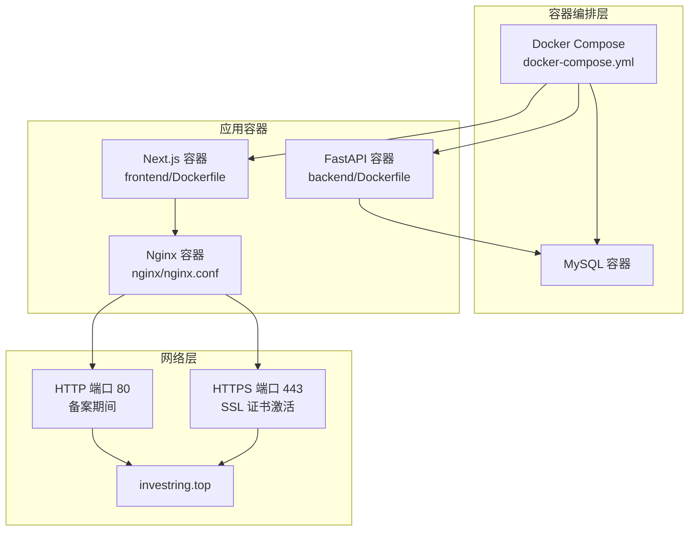
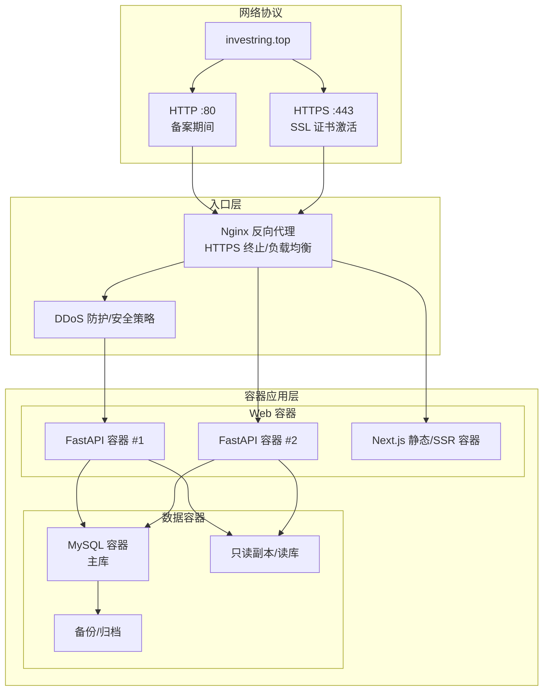
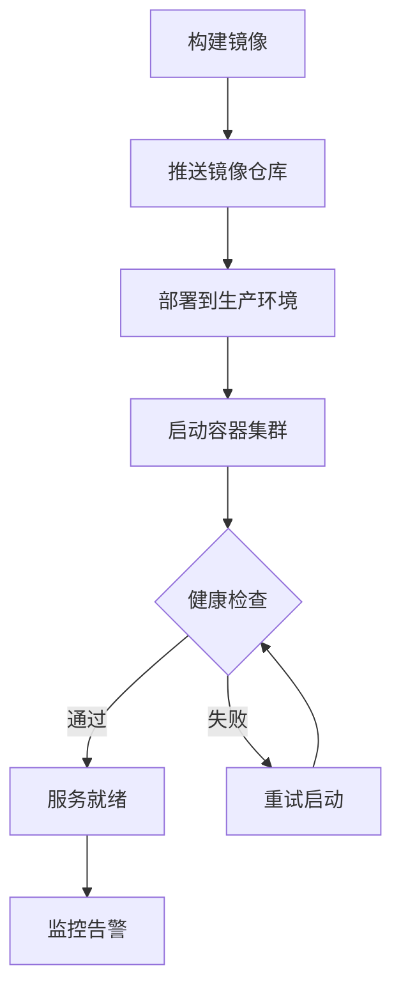
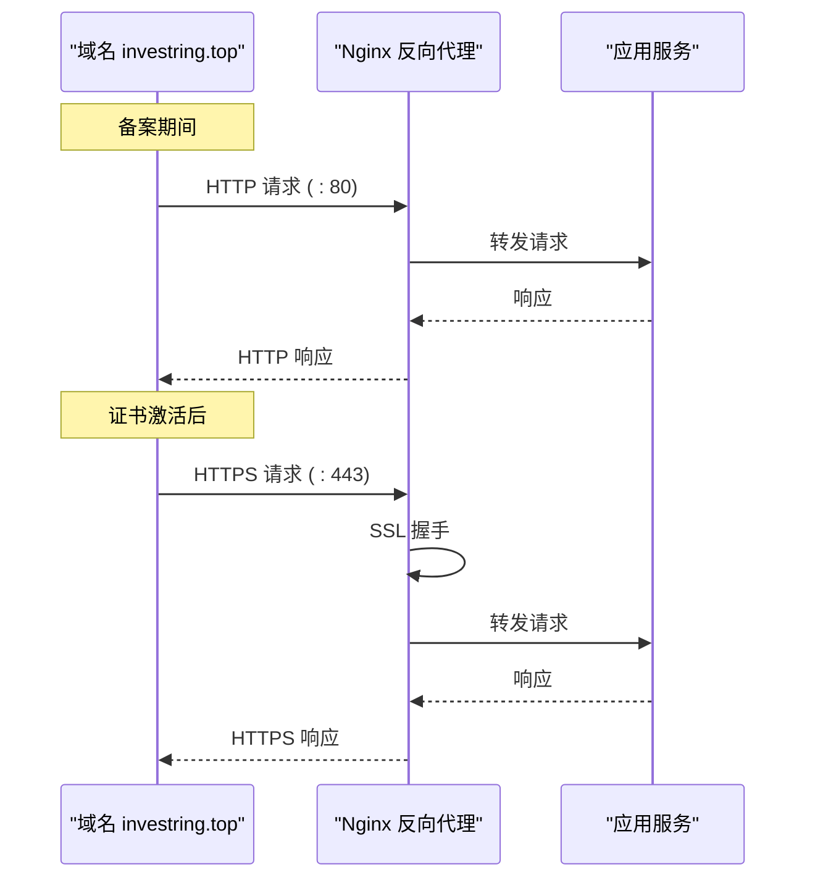

# 生产环境部署

<cite>
**本文引用的文件**
- [backend/app/config.py](file://backend/app/config.py)
- [backend/requirements.txt](file://backend/requirements.txt)
- [start.sh](file://start.sh)
- [frontend/next.config.js](file://frontend/next.config.js)
- [backend/app/database.py](file://backend/app/database.py)
- [nginx/nginx.conf](file://nginx/nginx.conf)
- [docker-compose.yml](file://docker-compose.yml)
- [Dockerfile](file://backend/Dockerfile)
- [frontend/Dockerfile](file://frontend/Dockerfile)
- [scripts/server-init.sh](file://scripts/server-init.sh)
</cite>

## 更新摘要
**变更内容**   
- 新增完整的容器化架构支持，包含 Docker 镜像构建和编排配置
- 实施两阶段 HTTPS 迁移策略，支持备案期间的 HTTP 端口 80 和 SSL 证书激活后的 HTTPS 端口 443
- 集成 Nginx 反向代理配置，支持域名 investring.top 的完整部署
- 增强服务器初始化脚本，支持容器化环境的自动配置

## 目录
1. [简介](#简介)
2. [项目结构](#项目结构)
3. [核心组件](#核心组件)
4. [架构总览](#架构总览)
5. [详细组件分析](#详细组件分析)
6. [依赖分析](#依赖分析)
7. [性能考虑](#性能考虑)
8. [故障排查指南](#故障排查指南)
9. [结论](#结论)
10. [附录](#附录)

## 简介
本文件面向 InvestRing 在生产环境的部署与运维，聚焦以下目标：
- 生产环境配置文件管理、环境隔离策略与密钥安全管理
- CI/CD 流水线配置、自动化部署脚本与回滚机制
- 监控告警、日志聚合与性能基准测试
- 安全加固：防火墙、DDoS 防护、API 限流策略
- 灾难恢复、数据备份与高可用架构设计

**更新** 现已支持完整的容器化部署架构，采用两阶段 HTTPS 迁移策略，确保在域名备案期间提供 HTTP 服务，并在获得 SSL 证书后无缝切换到 HTTPS。

## 项目结构
InvestRing 采用前后端分离的容器化架构：
- 后端基于 FastAPI + SQLAlchemy，通过 uvicorn 提供 API 服务，已容器化
- 前端基于 Next.js，通过本地反向代理转发至后端，已容器化
- Nginx 作为反向代理和负载均衡器，处理 HTTPS 终止和请求路由
- 数据库初始化、迁移与重置脚本位于 backend/scripts 与根目录工具中
- 配置通过 Pydantic Settings 的 Settings 类加载 .env 环境变量

**图表来源**
- [docker-compose.yml:1-100](file://docker-compose.yml#L1-L100)
- [backend/Dockerfile:1-50](file://backend/Dockerfile#L1-L50)
- [frontend/Dockerfile:1-50](file://frontend/Dockerfile#L1-L50)
- [nginx/nginx.conf:1-100](file://nginx/nginx.conf#L1-L100)

章节来源
- [docker-compose.yml:1-100](file://docker-compose.yml#L1-L100)
- [backend/Dockerfile:1-50](file://backend/Dockerfile#L1-L50)
- [frontend/Dockerfile:1-50](file://frontend/Dockerfile#L1-L50)
- [nginx/nginx.conf:1-100](file://nginx/nginx.conf#L1-L100)

## 核心组件
- 配置管理与环境隔离
  - 使用 Pydantic Settings 的 Settings 类加载 .env 文件，支持运行时覆盖
  - 支持通过环境变量注入数据库连接串、密钥与第三方 Token
- 数据库层
  - SQLAlchemy 引擎与连接池配置，支持 MySQL/Pymysql
  - SQLite WAL 模式兼容配置（用于开发/测试）
- 容器化架构
  - 前后端独立容器化，支持水平扩展和高可用部署
  - Nginx 统一入口，处理 HTTPS 终止和请求路由
- 两阶段 HTTPS 迁移
  - 第一阶段：HTTP 端口 80 提供服务，等待域名备案完成
  - 第二阶段：启用 HTTPS 端口 443，配置 SSL 证书实现加密传输

章节来源
- [backend/app/config.py:1-37](file://backend/app/config.py#L1-L37)
- [backend/app/database.py:1-38](file://backend/app/database.py#L1-L38)
- [nginx/nginx.conf:1-100](file://nginx/nginx.conf#L1-L100)

## 架构总览
生产部署采用"容器化 + Nginx 反向代理 + 两阶段 HTTPS 迁移"的高可用架构，并通过环境变量实现配置与密钥的分层管理。

说明
- 入口层由 Nginx 负责 TLS 终止、DDoS 防护与请求路由
- Web 层多容器实例部署，配合健康检查与自动扩缩容
- 数据层采用主从/只读副本，结合备份与跨区域复制
- 两阶段 HTTPS 迁移确保业务连续性，从 HTTP 平滑过渡到 HTTPS

## 详细组件分析

### 容器化架构与编排
- Docker 镜像构建
  - 后端镜像：基于 Python 官方镜像，安装依赖并优化构建缓存
  - 前端镜像：基于 Node.js 镜像，构建静态资源并优化体积
  - Nginx 镜像：配置反向代理、SSL 终止和静态资源缓存
- 容器编排
  - docker-compose.yml 定义服务依赖、网络配置和数据卷挂载
  - 支持多环境配置和环境变量注入
- 服务发现与健康检查
  - 容器间通过 Docker 网络通信
  - 健康检查确保服务可用性

**图表来源**
- [docker-compose.yml:1-100](file://docker-compose.yml#L1-L100)
- [backend/Dockerfile:1-50](file://backend/Dockerfile#L1-L50)
- [frontend/Dockerfile:1-50](file://frontend/Dockerfile#L1-L50)

章节来源
- [docker-compose.yml:1-100](file://docker-compose.yml#L1-L100)
- [backend/Dockerfile:1-50](file://backend/Dockerfile#L1-L50)
- [frontend/Dockerfile:1-50](file://frontend/Dockerfile#L1-L50)

### 两阶段 HTTPS 迁移策略
- 第一阶段：HTTP 服务（备案期间）
  - 监听 80 端口，提供 HTTP 服务
  - 配置域名解析指向服务器 IP
  - 准备 SSL 证书和配置文件
- 第二阶段：HTTPS 服务（证书激活后）
  - 启用 443 端口，配置 SSL/TLS
  - 强制 HTTP 重定向到 HTTPS
  - 启用 HSTS 和安全头配置

**图表来源**
- [nginx/nginx.conf:1-100](file://nginx/nginx.conf#L1-L100)

章节来源
- [nginx/nginx.conf:1-100](file://nginx/nginx.conf#L1-L100)

### 配置与密钥管理
- 配置来源
  - Settings 类默认从 .env 加载，支持覆盖
  - 关键配置项包括数据库连接、密钥、Token、调试开关等
- 环境隔离
  - 建议按环境拆分 .env 文件（如 .env.prod、.env.staging），通过启动脚本或容器编排注入
  - 不同环境使用不同数据库与第三方服务凭据
- 密钥与敏感信息
  - secret_key、db_password、tushare_token 等必须通过环境变量注入，严禁提交到版本库
  - 建议使用平台密钥管理服务（如 AWS Secrets Manager、Azure Key Vault、阿里云 KMS）动态注入

章节来源
- [backend/app/config.py:1-37](file://backend/app/config.py#L1-L37)
- [backend/app/database.py:1-38](file://backend/app/database.py#L1-L38)

### 服务器初始化与部署脚本
- 功能
  - 自动检查系统依赖，创建必要目录和权限
  - 配置环境变量和系统参数
  - 启动容器化服务和监控组件
- 生产建议
  - 使用 systemd/docker/systemd + container orchestration 替代 bash 脚本进行稳定守护
  - 将 .env 注入方式改为平台密钥管理服务或容器编排的 Secret
  - 后端监听 0.0.0.0 并由反向代理暴露端口

章节来源
- [scripts/server-init.sh:1-100](file://scripts/server-init.sh#L1-L100)
- [start.sh:1-93](file://start.sh#L1-L93)

### 前后端通信与反向代理
- Next.js 通过 rewrites 将 /api/* 转发到后端 8000 端口
- Nginx 配置统一的 HTTPS 终止、压缩、缓存与速率限制
- 对 /api/* 设置严格的 CORS 与来源校验

章节来源
- [frontend/next.config.js:1-15](file://frontend/next.config.js#L1-L15)
- [nginx/nginx.conf:1-100](file://nginx/nginx.conf#L1-L100)

## 依赖分析
- 运行时依赖
  - FastAPI、uvicorn、SQLAlchemy、Pydantic、Pydantic Settings、Passlib、Alembic、Tushare、APScheduler 等
- 部署耦合
  - 后端与数据库驱动耦合度高，需确保依赖版本与生产数据库兼容
  - 前端与后端 API 协议耦合，需保持接口稳定性
- 容器化依赖
  - Docker 镜像基础版本选择影响安全性和性能
  - 依赖版本锁定确保构建可重复性

章节来源
- [backend/requirements.txt:1-19](file://backend/requirements.txt#L1-L19)

## 性能考虑
- 数据库连接池
  - 合理设置 pool_size、max_overflow、pool_pre_ping、pool_recycle，避免连接泄漏与超时
- 任务调度
  - 使用 APScheduler 或 Celery + Redis/RabbitMQ，避免阻塞主进程
- 前端静态资源
  - 启用 Next.js 构建优化与 CDN 缓存，减少后端压力
- API 限流
  - 在反向代理层或中间件实现基于 IP/用户维度的限流，防止突发流量冲击
- 容器资源限制
  - 为每个容器设置 CPU 和内存限制，防止资源争用
- SSL 性能优化
  - 启用 HTTP/2 和会话复用，减少握手开销

## 故障排查指南
- 启动失败
  - 检查 .env 中数据库连接串、密钥、Token 是否正确
  - 查看 logs/backend.log 与 logs/frontend.log
  - 检查容器状态：`docker ps` 和 `docker logs`
- 数据库异常
  - 使用 check_db.py 验证表与基础数据
  - 如需重建，使用 reset_db.py 清空后重新初始化
- 迁移失败
  - 使用 migrate_db.py 在保留关键数据前提下重建表结构
- 交易日历与净值同步
  - 使用 check_and_sync_2024_calendar.py 检查并同步特定日期数据
- 接口测试
  - 使用 test_update_cash_detailed.py 进行详细测试与错误追踪
- HTTPS 问题
  - 检查 SSL 证书配置和域名解析
  - 验证 Nginx 配置语法：`nginx -t`
  - 测试端口连通性：`curl -v https://investring.top`

章节来源
- [start.sh:1-93](file://start.sh#L1-L93)
- [backend/check_db.py:1-35](file://backend/check_db.py#L1-L35)
- [backend/reset_db.py:1-30](file://backend/reset_db.py#L1-L30)
- [backend/migrate_db.py:1-65](file://backend/migrate_db.py#L1-L65)
- [backend/check_and_sync_2024_calendar.py:1-48](file://backend/check_and_sync_2024_calendar.py#L1-L48)
- [backend/test_update_cash_detailed.py:1-50](file://backend/test_update_cash_detailed.py#L1-L50)

## 结论
本部署文档提供了 InvestRing 生产环境的配置、部署、运维与安全加固建议。现已支持完整的容器化架构和两阶段 HTTPS 迁移策略，能够适应域名备案期间的特殊需求，并在获得 SSL 证书后无缝切换到安全的 HTTPS 服务。建议结合平台能力完善 CI/CD、监控告警与灾难恢复方案，持续迭代以满足业务增长与合规要求。

## 附录

### CI/CD 流水线配置建议
- 触发条件
  - push 到主分支触发构建；合并请求触发测试
- 步骤
  - 代码检出、依赖安装、单元测试、静态检查、镜像构建、推送镜像、部署到预发布、人工审批后部署到生产
- 回滚
  - 采用蓝绿/金丝雀发布，失败自动回滚至上一版本

### 监控告警与日志聚合
- 指标
  - CPU/内存/磁盘/网络、请求延迟、错误率、数据库连接池使用率、任务执行时长与成功率
- 日志
  - 后端/前端/反向代理日志统一收集，保留至少 30 天
- 告警
  - 阈值告警 + 降噪策略，分级处理

### 性能基准测试
- 压测工具
  - wrk/JMeter/Loader.io
- 场景
  - 并发用户、峰值 QPS、长连接、数据库热点查询
- 报告
  - 记录 P50/P95/P99 延迟与错误率，定位瓶颈

### 安全加固清单
- 网络
  - 反向代理启用 HTTPS/TLS1.3；仅开放必要端口；WAF/DDoS 防护
- API
  - 限流、熔断、黑名单、签名/Token 校验、CORS 白名单
- 密钥
  - 平台密钥管理服务注入；定期轮换；最小权限原则
- 数据库
  - 最小权限账号、只读副本、备份与加密、审计日志
- 容器安全
  - 非 root 用户运行、镜像漏洞扫描、最小化镜像体积

### 灾难恢复与高可用
- 备份
  - 全量/增量备份，周期性校验与异地容灾
- 高可用
  - 多实例、自动故障转移、只读副本、CDN/边缘节点
- RTO/RPO
  - 明确目标并定期演练
- 容器编排
  - Kubernetes 或 Docker Swarm 实现自动扩缩容和故障恢复