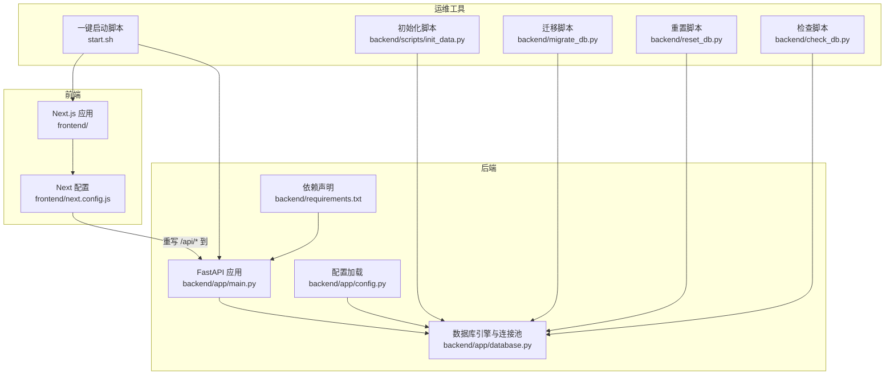
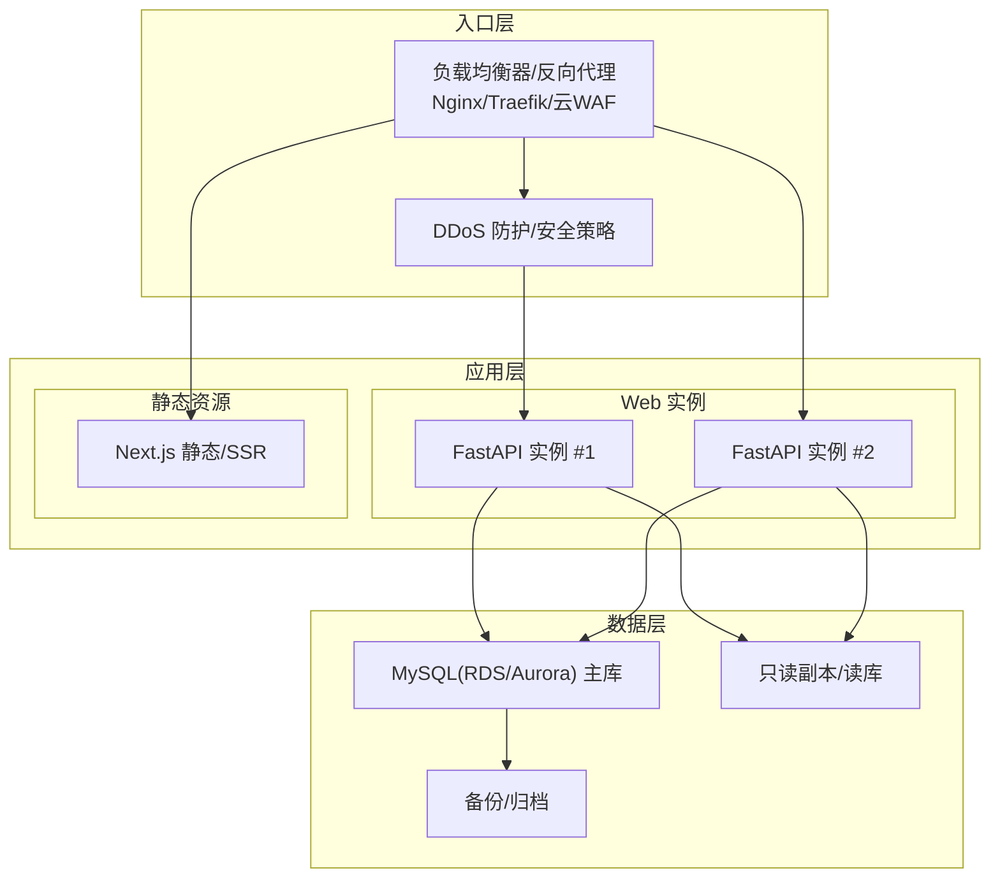
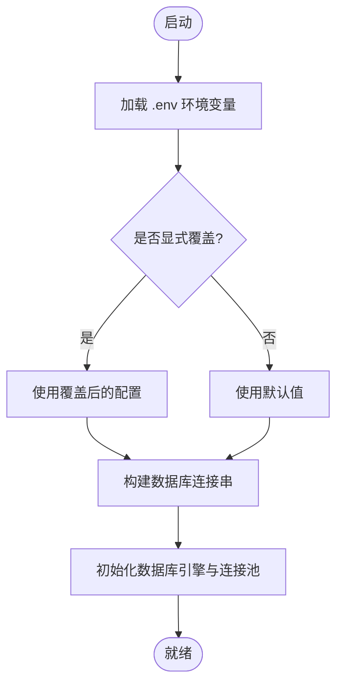
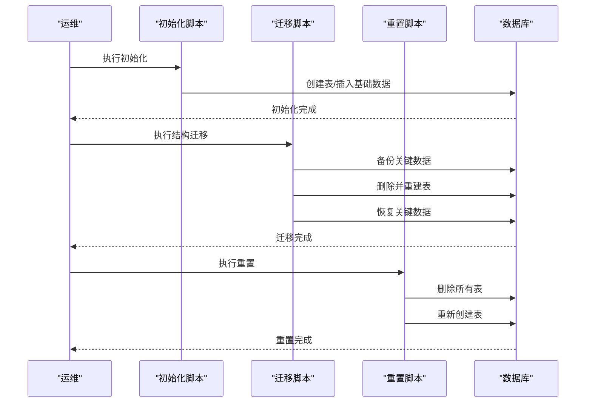
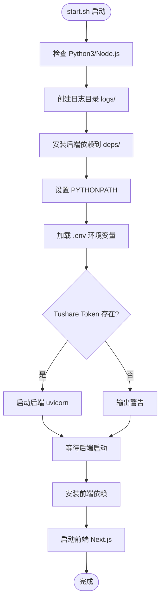
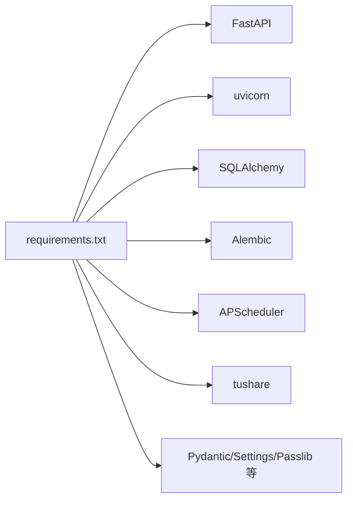

# 生产环境部署

<cite>
**本文引用的文件**
- [backend/app/config.py](file://backend/app/config.py)
- [backend/requirements.txt](file://backend/requirements.txt)
- [start.sh](file://start.sh)
- [frontend/next.config.js](file://frontend/next.config.js)
- [backend/app/database.py](file://backend/app/database.py)
- [backend/migrate_db.py](file://backend/migrate_db.py)
- [backend/reset_db.py](file://backend/reset_db.py)
- [backend/check_db.py](file://backend/check_db.py)
- [backend/scripts/init_data.py](file://backend/scripts/init_data.py)
- [backend/check_and_sync_2024_calendar.py](file://backend/check_and_sync_2024_calendar.py)
- [backend/test_update_cash_detailed.py](file://backend/test_update_cash_detailed.py)
- [Docs/02-数据库设计.md](file://Docs/02-数据库设计.md)
- [Docs/03-业务流程设计.md](file://Docs/03-业务流程设计.md)
</cite>

## 目录
1. [简介](#简介)
2. [项目结构](#项目结构)
3. [核心组件](#核心组件)
4. [架构总览](#架构总览)
5. [详细组件分析](#详细组件分析)
6. [依赖分析](#依赖分析)
7. [性能考虑](#性能考虑)
8. [故障排查指南](#故障排查指南)
9. [结论](#结论)
10. [附录](#附录)

## 简介
本文件面向 InvestRing 在生产环境的部署与运维，聚焦以下目标：
- 生产环境配置文件管理、环境隔离策略与密钥安全管理
- CI/CD 流水线配置、自动化部署脚本与回滚机制
- 监控告警、日志聚合与性能基准测试
- 安全加固：防火墙、DDoS 防护、API 限流策略
- 灾难恢复、数据备份与高可用架构设计

说明：仓库中未包含 CI/CD 配置文件与监控告警配置示例，本文提供可落地的实践建议与实施步骤，便于结合实际平台落地。

## 项目结构
InvestRing 采用前后端分离架构：
- 后端基于 FastAPI + SQLAlchemy，通过 uvicorn 提供 API 服务
- 前端基于 Next.js，通过本地反向代理转发至后端
- 数据库初始化、迁移与重置脚本位于 backend/scripts 与根目录工具中
- 配置通过 Pydantic Settings 的 Settings 类加载 .env 环境变量

图表来源
- [frontend/next.config.js:1-15](file://frontend/next.config.js#L1-L15)
- [backend/app/config.py:1-37](file://backend/app/config.py#L1-L37)
- [backend/app/database.py:1-38](file://backend/app/database.py#L1-L38)
- [backend/requirements.txt:1-19](file://backend/requirements.txt#L1-L19)
- [start.sh:1-93](file://start.sh#L1-L93)
- [backend/scripts/init_data.py:1-393](file://backend/scripts/init_data.py#L1-L393)
- [backend/migrate_db.py:1-65](file://backend/migrate_db.py#L1-L65)
- [backend/reset_db.py:1-30](file://backend/reset_db.py#L1-L30)
- [backend/check_db.py:1-35](file://backend/check_db.py#L1-L35)

章节来源
- [frontend/next.config.js:1-15](file://frontend/next.config.js#L1-L15)
- [backend/app/config.py:1-37](file://backend/app/config.py#L1-L37)
- [backend/app/database.py:1-38](file://backend/app/database.py#L1-L38)
- [backend/requirements.txt:1-19](file://backend/requirements.txt#L1-L19)
- [start.sh:1-93](file://start.sh#L1-L93)

## 核心组件
- 配置管理与环境隔离
  - 使用 Pydantic Settings 的 Settings 类加载 .env 文件，支持运行时覆盖
  - 支持通过环境变量注入数据库连接串、密钥与第三方 Token
- 数据库层
  - SQLAlchemy 引擎与连接池配置，支持 MySQL/Pymysql
  - SQLite WAL 模式兼容配置（用于开发/测试）
- 前后端通信
  - Next.js 通过 rewrites 将 /api/* 反代到后端 8000 端口
- 运维脚本
  - 一键启动脚本：自动安装依赖、设置 PYTHONPATH、加载 .env 并启动后端/前端
  - 初始化/迁移/重置/检查脚本：支撑数据库生命周期管理

章节来源
- [backend/app/config.py:1-37](file://backend/app/config.py#L1-L37)
- [backend/app/database.py:1-38](file://backend/app/database.py#L1-L38)
- [frontend/next.config.js:1-15](file://frontend/next.config.js#L1-L15)
- [start.sh:1-93](file://start.sh#L1-L93)

## 架构总览
生产部署建议采用“容器化 + 反向代理 + 负载均衡 + 数据库托管”的高可用架构，并通过环境变量实现配置与密钥的分层管理。

说明
- 入口层负责 TLS 终止、DDoS 防护与请求路由
- Web 层多实例部署，配合健康检查与自动扩缩容
- 数据层采用主从/只读副本，结合备份与跨区域复制
- 日志与指标统一采集，接入集中化监控与告警

## 详细组件分析

### 配置与密钥管理
- 配置来源
  - Settings 类默认从 .env 加载，支持覆盖
  - 关键配置项包括数据库连接、密钥、Token、调试开关等
- 环境隔离
  - 建议按环境拆分 .env 文件（如 .env.prod、.env.staging），通过启动脚本或容器编排注入
  - 不同环境使用不同数据库与第三方服务凭据
- 密钥与敏感信息
  - secret_key、db_password、tushare_token 等必须通过环境变量注入，严禁提交到版本库
  - 建议使用平台密钥管理服务（如 AWS Secrets Manager、Azure Key Vault、阿里云 KMS）动态注入

图表来源
- [backend/app/config.py:1-37](file://backend/app/config.py#L1-L37)
- [backend/app/database.py:1-38](file://backend/app/database.py#L1-L38)

章节来源
- [backend/app/config.py:1-37](file://backend/app/config.py#L1-L37)
- [backend/app/database.py:1-38](file://backend/app/database.py#L1-L38)

### 数据库生命周期管理
- 初始化
  - 通过初始化脚本创建表结构并填充基础数据（组合、产品、平台、资产分类、定时任务、管理员）
- 迁移
  - 迁移脚本在保留关键数据的前提下重建表结构，适合结构变更场景
- 重置
  - 重置脚本删除并重建所有表，适合全新环境或故障恢复后的重建
- 检查
  - 检查脚本验证表存在性与基础数据，辅助部署后验证

图表来源
- [backend/scripts/init_data.py:1-393](file://backend/scripts/init_data.py#L1-L393)
- [backend/migrate_db.py:1-65](file://backend/migrate_db.py#L1-L65)
- [backend/reset_db.py:1-30](file://backend/reset_db.py#L1-L30)
- [backend/check_db.py:1-35](file://backend/check_db.py#L1-L35)

章节来源
- [backend/scripts/init_data.py:1-393](file://backend/scripts/init_data.py#L1-L393)
- [backend/migrate_db.py:1-65](file://backend/migrate_db.py#L1-L65)
- [backend/reset_db.py:1-30](file://backend/reset_db.py#L1-L30)
- [backend/check_db.py:1-35](file://backend/check_db.py#L1-L35)

### 一键启动与部署脚本
- 功能
  - 自动检查 Node.js/Python3，安装依赖，设置 PYTHONPATH
  - 加载 .env 并启动后端 uvicorn 与前端 Next.js
  - 输出日志路径与访问地址
- 生产建议
  - 使用 systemd/docker/systemd + container orchestration 替代 bash 脚本进行稳定守护
  - 将 .env 注入方式改为平台密钥管理服务或容器编排的 Secret
  - 后端监听 0.0.0.0 并由反向代理暴露端口

图表来源
- [start.sh:1-93](file://start.sh#L1-L93)

章节来源
- [start.sh:1-93](file://start.sh#L1-L93)

### 前后端通信与反向代理
- Next.js 通过 rewrites 将 /api/* 转发到后端 8000 端口
- 生产建议
  - 在反向代理层统一开启 HTTPS、压缩、缓存与速率限制
  - 对 /api/* 设置严格的 CORS 与来源校验

章节来源
- [frontend/next.config.js:1-15](file://frontend/next.config.js#L1-L15)

### 数据模型与日志表
- 数据模型
  - 包含组合、产品、平台、份额变动、交易、任务执行、系统错误、通知等核心实体
- 日志与审计
  - 系统错误日志、审计日志、任务执行日志、通知等表支撑运营与合规追溯

章节来源
- [Docs/02-数据库设计.md:731-806](file://Docs/02-数据库设计.md#L731-L806)

### 业务流程与每日计算
- 每日计算流程包含净值同步、快照生成、份额平衡校验，三张快照表按固定顺序生成，确保数据一致性

章节来源
- [Docs/03-业务流程设计.md:1356-1391](file://Docs/03-业务流程设计.md#L1356-L1391)

## 依赖分析
- 运行时依赖
  - FastAPI、uvicorn、SQLAlchemy、Pydantic、Pydantic Settings、Passlib、Alembic、Tushare、APScheduler 等
- 部署耦合
  - 后端与数据库驱动耦合度高，需确保依赖版本与生产数据库兼容
  - 前端与后端 API 协议耦合，需保持接口稳定性

图表来源
- [backend/requirements.txt:1-19](file://backend/requirements.txt#L1-L19)

章节来源
- [backend/requirements.txt:1-19](file://backend/requirements.txt#L1-L19)

## 性能考虑
- 数据库连接池
  - 合理设置 pool_size、max_overflow、pool_pre_ping、pool_recycle，避免连接泄漏与超时
- 任务调度
  - 使用 APScheduler 或 Celery + Redis/RabbitMQ，避免阻塞主进程
- 前端静态资源
  - 启用 Next.js 构建优化与 CDN 缓存，减少后端压力
- API 限流
  - 在反向代理层或中间件实现基于 IP/用户维度的限流，防止突发流量冲击

## 故障排查指南
- 启动失败
  - 检查 .env 中数据库连接串、密钥、Token 是否正确
  - 查看 logs/backend.log 与 logs/frontend.log
- 数据库异常
  - 使用 check_db.py 验证表与基础数据
  - 如需重建，使用 reset_db.py 清空后重新初始化
- 迁移失败
  - 使用 migrate_db.py 在保留关键数据前提下重建表结构
- 交易日历与净值同步
  - 使用 check_and_sync_2024_calendar.py 检查并同步特定日期数据
- 接口测试
  - 使用 test_update_cash_detailed.py 进行详细测试与错误追踪

章节来源
- [start.sh:1-93](file://start.sh#L1-L93)
- [backend/check_db.py:1-35](file://backend/check_db.py#L1-L35)
- [backend/reset_db.py:1-30](file://backend/reset_db.py#L1-L30)
- [backend/migrate_db.py:1-65](file://backend/migrate_db.py#L1-L65)
- [backend/check_and_sync_2024_calendar.py:1-48](file://backend/check_and_sync_2024_calendar.py#L1-L48)
- [backend/test_update_cash_detailed.py:1-50](file://backend/test_update_cash_detailed.py#L1-L50)

## 结论
本部署文档提供了 InvestRing 生产环境的配置、部署、运维与安全加固建议。建议结合平台能力完善 CI/CD、监控告警与灾难恢复方案，持续迭代以满足业务增长与合规要求。

## 附录

### CI/CD 流水线配置建议
- 触发条件
  - push 到主分支触发构建；合并请求触发测试
- 步骤
  - 代码检出、依赖安装、单元测试、静态检查、镜像构建、推送镜像、部署到预发布、人工审批后部署到生产
- 回滚
  - 采用蓝绿/金丝雀发布，失败自动回滚至上一版本

### 监控告警与日志聚合
- 指标
  - CPU/内存/磁盘/网络、请求延迟、错误率、数据库连接池使用率、任务执行时长与成功率
- 日志
  - 后端/前端/反向代理日志统一收集，保留至少 30 天
- 告警
  - 阈值告警 + 降噪策略，分级处理

### 性能基准测试
- 压测工具
  - wrk/JMeter/Loader.io
- 场景
  - 并发用户、峰值 QPS、长连接、数据库热点查询
- 报告
  - 记录 P50/P95/P99 延迟与错误率，定位瓶颈

### 安全加固清单
- 网络
  - 反向代理启用 HTTPS/TLS1.3；仅开放必要端口；WAF/DDoS 防护
- API
  - 限流、熔断、黑名单、签名/Token 校验、CORS 白名单
- 密钥
  - 平台密钥管理服务注入；定期轮换；最小权限原则
- 数据库
  - 最小权限账号、只读副本、备份与加密、审计日志

### 灾难恢复与高可用
- 备份
  - 全量/增量备份，周期性校验与异地容灾
- 高可用
  - 多实例、自动故障转移、只读副本、CDN/边缘节点
- RTO/RPO
  - 明确目标并定期演练