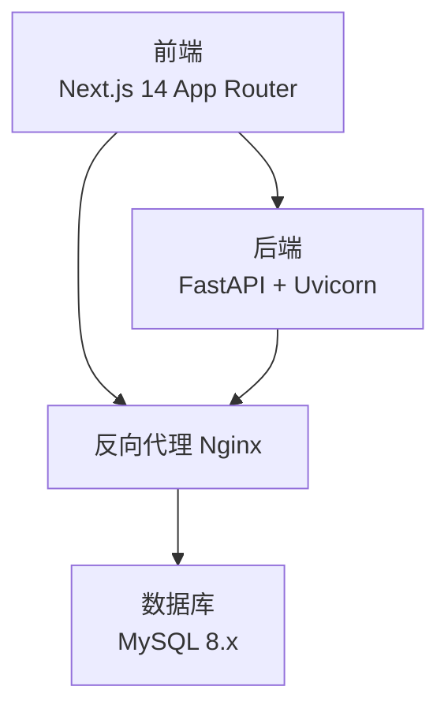
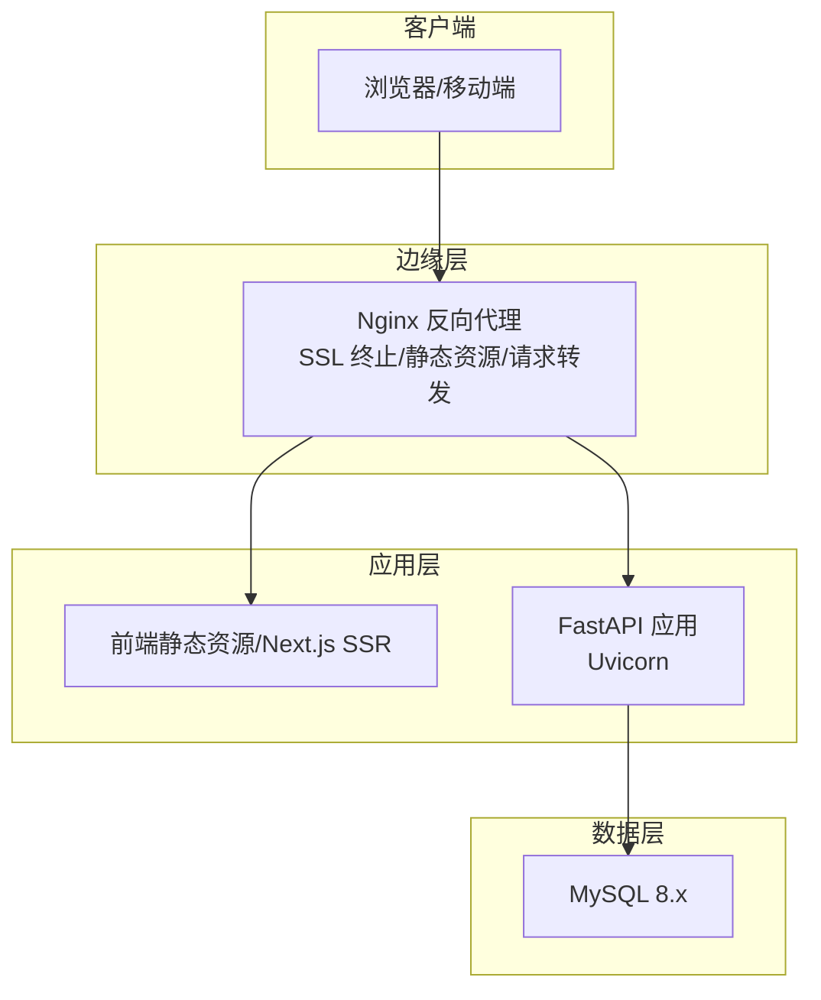
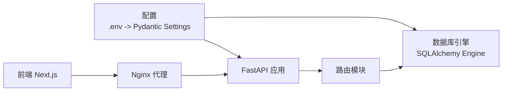

# 部署指南

<cite>
**本文引用的文件**
- [start.sh](file://start.sh)
- [backend/requirements.txt](file://backend/requirements.txt)
- [backend/app/main.py](file://backend/app/main.py)
- [backend/app/config.py](file://backend/app/config.py)
- [backend/app/database.py](file://backend/app/database.py)
- [backend/check_db.py](file://backend/check_db.py)
- [backend/migrate_db.py](file://backend/migrate_db.py)
- [frontend/next.config.js](file://frontend/next.config.js)
- [frontend/package.json](file://frontend/package.json)
- [Docs/00-开发总览.md](file://Docs/00-开发总览.md)
- [frontend/src/middleware.ts](file://frontend/src/middleware.ts)
- [backend/app/routers/data_sources.py](file://backend/app/routers/data_sources.py)
</cite>

## 目录
1. [简介](#简介)
2. [项目结构](#项目结构)
3. [核心组件](#核心组件)
4. [架构总览](#架构总览)
5. [详细组件分析](#详细组件分析)
6. [依赖关系分析](#依赖关系分析)
7. [性能考虑](#性能考虑)
8. [故障排查指南](#故障排查指南)
9. [结论](#结论)
10. [附录](#附录)

## 简介
本指南面向运维团队，提供 InvestRing 在生产环境的完整部署与维护方案。内容覆盖服务器基础配置、Nginx 反向代理与 SSL 证书、Docker 容器化、Kubernetes 部署、云平台部署选项、数据库迁移与版本升级/回滚、监控与日志、性能优化、负载均衡与缓存策略、以及安全加固措施。

## 项目结构
项目采用前后端分离架构：前端基于 Next.js 14，后端基于 FastAPI，数据库使用 MySQL 8.x。开发与运行通过一键启动脚本统一编排，便于本地与生产环境快速部署。

图表来源
- [frontend/next.config.js:1-16](file://frontend/next.config.js#L1-L16)
- [backend/app/main.py:1-53](file://backend/app/main.py#L1-L53)
- [backend/app/database.py:1-39](file://backend/app/database.py#L1-L39)

章节来源
- [Docs/00-开发总览.md:16-33](file://Docs/00-开发总览.md#L16-L33)
- [frontend/next.config.js:1-16](file://frontend/next.config.js#L1-L16)
- [backend/app/main.py:1-53](file://backend/app/main.py#L1-L53)
- [backend/app/database.py:1-39](file://backend/app/database.py#L1-L39)

## 核心组件
- 后端服务：FastAPI 应用，通过 Uvicorn 提供 ASGI 服务；内置 CORS 中间件；路由模块化组织。
- 数据库：SQLAlchemy 2.x + MySQL 8.x；连接池参数可配置；支持 utf8mb4 字符集。
- 前端服务：Next.js 14，开发模式下通过本地 8000 端口代理 API 请求。
- 配置管理：Pydantic Settings 从 .env 文件加载；支持数据库、安全、应用与第三方 API（如 Tushare）配置。
- 运维脚本：一键启动脚本负责依赖安装、环境变量注入、前后端进程管理与日志输出。

章节来源
- [backend/app/main.py:1-53](file://backend/app/main.py#L1-L53)
- [backend/app/config.py:1-37](file://backend/app/config.py#L1-L37)
- [backend/app/database.py:1-39](file://backend/app/database.py#L1-L39)
- [start.sh:1-93](file://start.sh#L1-L93)
- [frontend/next.config.js:1-16](file://frontend/next.config.js#L1-L16)

## 架构总览
生产环境推荐使用 Nginx 作为反向代理与静态资源服务，后端通过 Uvicorn 承载 FastAPI，数据库独立部署或托管。前端构建产物可由 Nginx 提供，或与后端同机部署。

图表来源
- [frontend/next.config.js:1-16](file://frontend/next.config.js#L1-L16)
- [backend/app/main.py:1-53](file://backend/app/main.py#L1-L53)
- [backend/app/database.py:1-39](file://backend/app/database.py#L1-L39)

## 详细组件分析

### 服务器与系统准备
- 操作系统：Linux（建议 Ubuntu/Debian/CentOS）。
- 必备软件：Python 3.8+、Node.js 18+、Git、Nginx、MySQL 8.x 或兼容的 MySQL 兼容数据库。
- 端口规划：80/443（HTTP/HTTPS）、8000（后端服务）、3000（前端开发，生产可用 Nginx 提供静态资源）。
- 文件系统：确保 /var/log/InvestRing 与应用工作目录具备写权限。

章节来源
- [start.sh:7-17](file://start.sh#L7-L17)
- [backend/requirements.txt:1-19](file://backend/requirements.txt#L1-L19)
- [frontend/package.json:1-45](file://frontend/package.json#L1-L45)

### Nginx 反向代理与 SSL 证书
- 反向代理：将 /api/* 转发至后端 8000 端口；静态资源由 Nginx 提供。
- SSL 证书：建议使用 Let’s Encrypt 自动签发与续期；开启 HSTS、TLS 最低版本与加密套件强化。
- 安全头：添加 X-Frame-Options、X-Content-Type-Options、Referrer-Policy、Content-Security-Policy。
- 压缩：启用 gzip/HTTP/2；限制上传大小与超时时间。
- 日志：分离访问与错误日志，保留轮转策略。

章节来源
- [frontend/next.config.js:5-12](file://frontend/next.config.js#L5-L12)
- [backend/app/main.py:23-30](file://backend/app/main.py#L23-L30)

### Docker 容器化部署
- 多阶段镜像：后端使用 Python slim 基础镜像，安装依赖并打包；前端使用 Node 构建，再用 Nginx 镜像提供静态资源。
- 环境变量：通过 .env 注入数据库、安全与第三方 API 配置；避免硬编码在镜像中。
- 卷与持久化：挂载数据库数据卷、日志目录与静态资源目录。
- 健康检查：后端暴露 /（或自定义健康端点），Nginx 健康探针。
- 网络：容器网络隔离，仅开放必要端口；使用独立网络命名空间。

章节来源
- [backend/app/config.py:5-36](file://backend/app/config.py#L5-L36)
- [backend/requirements.txt:1-19](file://backend/requirements.txt#L1-L19)
- [frontend/package.json:5-10](file://frontend/package.json#L5-L10)

### Kubernetes 部署配置
- Deployment：后端与前端分别部署；设置资源请求/限制、就绪/存活探针。
- Service：ClusterIP 暴露后端，Ingress 暴露前端与 API。
- ConfigMap：存放 .env（敏感信息使用 Secret）。
- PersistentVolume：数据库使用 PVC；应用日志目录映射到持久存储。
- Ingress：启用 TLS，配置证书 Secret；设置速率限制与超时。
- HPA：根据 CPU/自定义指标自动扩缩容。

章节来源
- [backend/app/config.py:5-36](file://backend/app/config.py#L5-L36)
- [backend/app/database.py:7-16](file://backend/app/database.py#L7-L16)

### 云平台部署选项
- 传统云：ECS + RDS + 对象存储；Nginx 与应用部署在同一实例或不同实例。
- 容器服务：ACK/AKS/ECS/TKE；结合 HPA 与蓝绿/金丝雀发布。
- Serverless：API Gateway + Lambda（后端）+ S3（静态资源）；注意冷启动与数据库连接池。
- 备份与灾备：定期逻辑备份与物理备份；跨可用区部署与异地容灾。

章节来源
- [backend/app/database.py:7-16](file://backend/app/database.py#L7-L16)
- [Docs/00-开发总览.md:47-51](file://Docs/00-开发总览.md#L47-L51)

### 数据库迁移策略、版本升级与回滚
- 迁移工具：项目包含 Alembic 目录缺失提示，建议使用 Alembic 管理迁移；若无 Alembic，可参考迁移脚本思路。
- 迁移流程：
  - 备份：导出关键业务表（投资人、交易日历等）。
  - 重建：删除并重新创建表结构。
  - 恢复：回填备份数据。
- 版本升级：先在测试环境验证；灰度发布；记录变更日志。
- 回滚机制：保留最近一次备份；回滚到上一版本；核对数据一致性。

图表来源
- [backend/migrate_db.py:10-59](file://backend/migrate_db.py#L10-L59)

章节来源
- [backend/migrate_db.py:1-65](file://backend/migrate_db.py#L1-L65)
- [backend/check_db.py:1-35](file://backend/check_db.py#L1-L35)

### 监控、日志与性能优化
- 监控：Prometheus + Grafana；采集后端指标（响应时间、错误率、并发数）、数据库指标（连接数、慢查询）、Nginx 指标。
- 日志：后端与前端日志分离；Nginx 访问/错误日志；集中式日志（ELK/Fluentd/Loki）收集与检索。
- 性能优化：
  - 连接池：合理设置 pool_size 与 max_overflow；启用 pool_pre_ping。
  - 查询优化：索引与慢查询分析；分页与批量操作。
  - 缓存：Redis 缓存热点数据与会话；Nginx 缓存静态资源。
  - 压缩：Gzip/HTTP2；CDN 加速静态资源。
  - 资源：CPU/内存限制与 HPA；容器健康检查。

章节来源
- [backend/app/database.py:7-16](file://backend/app/database.py#L7-L16)
- [Docs/00-开发总览.md:47-51](file://Docs/00-开发总览.md#L47-L51)

### 负载均衡、缓存与安全加固
- 负载均衡：Nginx/HAProxy/LBaaS；健康检查与会话保持策略。
- 缓存：Redis 缓存 API 结果与会话；Nginx 缓存静态资源；CDN 加速。
- 安全加固：
  - 强制 HTTPS；HSTS；最小化 TLS 版本与加密套件。
  - CORS 严格配置；CSRF 与 XSS 防护；输入校验与参数绑定。
  - 最小权限原则；只读数据库账号用于查询；审计日志。
  - 定期更新依赖与系统补丁；WAF 与入侵检测。

章节来源
- [backend/app/main.py:23-30](file://backend/app/main.py#L23-L30)
- [backend/app/config.py:14-16](file://backend/app/config.py#L14-L16)

## 依赖关系分析
后端依赖关系围绕配置、数据库与路由展开；前端通过 Nginx 代理访问后端 API。

图表来源
- [backend/app/config.py:5-36](file://backend/app/config.py#L5-L36)
- [backend/app/database.py:1-39](file://backend/app/database.py#L1-L39)
- [backend/app/main.py:1-53](file://backend/app/main.py#L1-L53)
- [frontend/next.config.js:5-12](file://frontend/next.config.js#L5-L12)

章节来源
- [backend/app/config.py:1-37](file://backend/app/config.py#L1-L37)
- [backend/app/database.py:1-39](file://backend/app/database.py#L1-L39)
- [backend/app/main.py:1-53](file://backend/app/main.py#L1-L53)
- [frontend/next.config.js:1-16](file://frontend/next.config.js#L1-L16)

## 性能考虑
- 数据库层：连接池参数、索引优化、慢查询分析、只读副本与分库分表。
- 应用层：异步任务与定时任务；批量处理；缓存命中率；并发与队列。
- 网络层：CDN 与静态资源；压缩与持久连接；TLS 优化。
- 前端：代码分割、懒加载、预取与预连接；SSR/ISR 降低首屏延迟。

章节来源
- [backend/app/database.py:7-16](file://backend/app/database.py#L7-L16)
- [Docs/00-开发总览.md:47-51](file://Docs/00-开发总览.md#L47-L51)

## 故障排查指南
- 启动失败：检查 .env 是否正确；依赖是否安装；端口占用；防火墙放行。
- 数据库问题：连接字符串、字符集、连接池耗尽；慢查询与锁等待。
- API 异常：CORS 配置；路由前缀；鉴权与权限；异常捕获与日志。
- 前端无法访问：Nginx 代理规则；静态资源路径；跨域与缓存。
- 迁移失败：备份完整性；重建顺序；回滚策略。

章节来源
- [start.sh:36-50](file://start.sh#L36-L50)
- [backend/check_db.py:14-35](file://backend/check_db.py#L14-L35)
- [backend/migrate_db.py:43-65](file://backend/migrate_db.py#L43-L65)
- [frontend/next.config.js:5-12](file://frontend/next.config.js#L5-L12)

## 结论
本指南提供了 InvestRing 从单机到容器化与云原生的全栈部署路径。建议在生产环境中结合 Nginx、数据库高可用、监控与日志体系、缓存与 CDN、以及完善的迁移与回滚流程，确保系统稳定、可扩展与可维护。

## 附录

### 环境变量与配置要点
- 数据库：主机、端口、用户名、密码、库名、字符集；支持直接传入 database_url。
- 安全：secret_key（生产必须替换）、token 过期天数。
- 第三方：Tushare Token；AkShare 开关。
- 应用：应用名称、调试开关。

章节来源
- [backend/app/config.py:5-36](file://backend/app/config.py#L5-L36)

### 前端代理与路由
- 开发模式：/api/* 代理到后端 8000。
- 生产建议：Nginx 提供静态资源与 API 代理；移动端/桌面端路径分流。

章节来源
- [frontend/next.config.js:5-12](file://frontend/next.config.js#L5-L12)
- [frontend/src/middleware.ts:1-40](file://frontend/src/middleware.ts#L1-L40)

### 数据源配置
- Tushare：Token 脱敏展示；支持启用/禁用。
- AkShare：无需 Token，可全局开关。

章节来源
- [backend/app/routers/data_sources.py:38-74](file://backend/app/routers/data_sources.py#L38-L74)