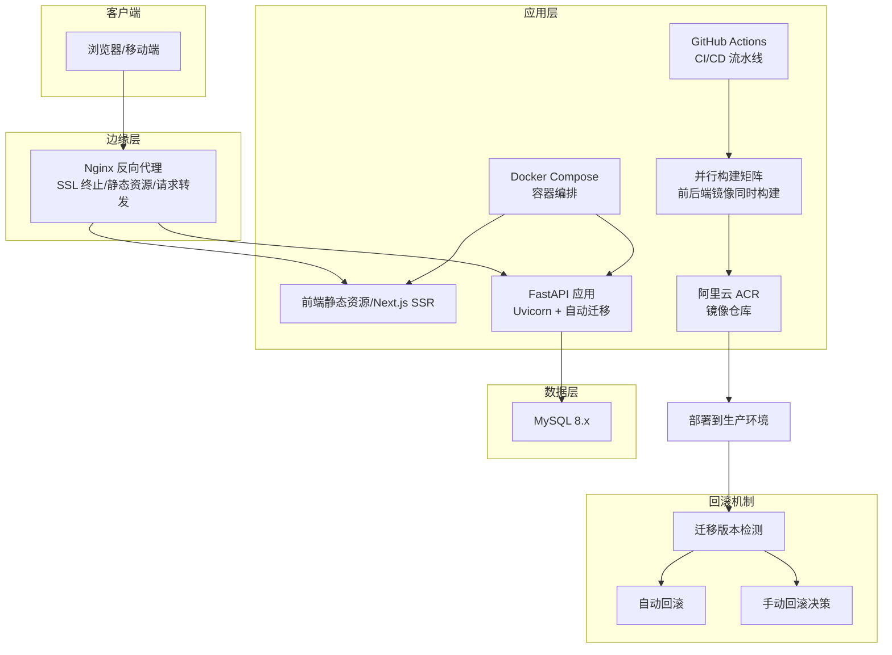
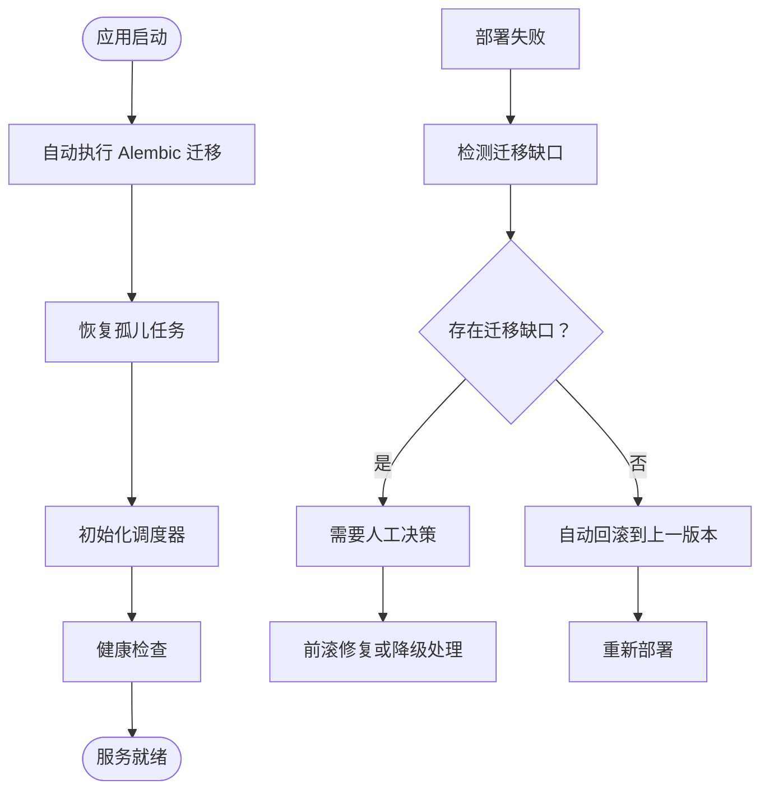
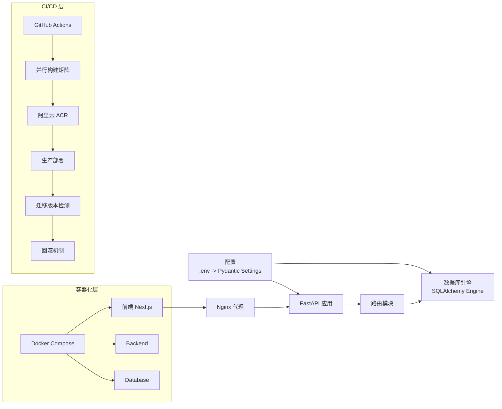
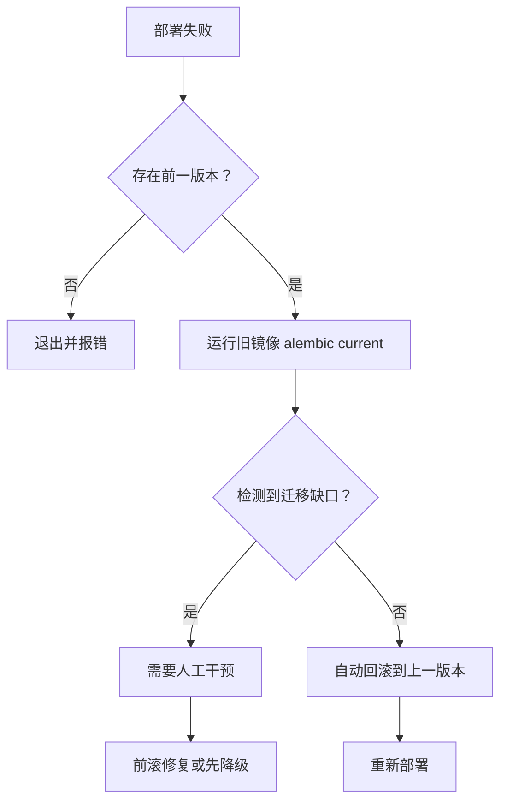

# 部署指南

<cite>
**本文引用的文件**
- [docker-compose.yml](file://docker-compose.yml)
- [docker-compose.dev.yml](file://docker-compose.dev.yml)
- [docker-compose.override.yml](file://docker-compose.override.yml)
- [backend/Dockerfile](file://backend/Dockerfile)
- [frontend/Dockerfile](file://frontend/Dockerfile)
- [.github/workflows/ci.yml](file://.github/workflows/ci.yml)
- [.github/workflows/deploy.yml](file://.github/workflows/deploy.yml)
- [nginx/nginx.conf](file://nginx/nginx.conf)
- [scripts/server-init.sh](file://scripts/server-init.sh)
- [backend/requirements.txt](file://backend/requirements.txt)
- [backend/app/main.py](file://backend/app/main.py)
- [backend/app/config.py](file://backend/app/config.py)
- [backend/app/database.py](file://backend/app/database.py)
- [backend/check_db.py](file://backend/check_db.py)
- [AGENTS.md](file://AGENTS.md)
</cite>

## 更新摘要
**所做更改**
- 新增完整的部署回滚手册，包含迁移缺口检测和自动回滚机制
- 增强 deploy.yml 流水线，支持并行矩阵构建前后端镜像和迁移版本检测
- 完善 CI/CD 流水线的数据库迁移验证和契约检查
- 优化 Docker 容器化部署配置，提升构建速度和稳定性

## 目录
1. [简介](#简介)
2. [项目结构](#项目结构)
3. [核心组件](#核心组件)
4. [架构总览](#架构总览)
5. [详细组件分析](#详细组件分析)
6. [依赖关系分析](#依赖关系分析)
7. [性能考虑](#性能考虑)
8. [故障排查指南](#故障排查指南)
9. [结论](#结论)
10. [附录](#附录)

## 简介
本指南面向运维团队，提供 InvestRing 在生产环境的完整部署与维护方案。内容覆盖服务器基础配置、Nginx 反向代理与 SSL 证书、Docker 容器化、GitHub Actions CI/CD 流水线、数据库迁移与版本升级/回滚、监控与日志、性能优化、负载均衡与缓存策略、以及安全加固措施。

**更新** 本次更新重点增强了部署回滚机制，新增了完整的部署回滚手册，改进了 CI/CD 流水线的迁移版本检测功能，并优化了并行构建流程以提升部署效率。

## 项目结构
项目采用前后端分离架构：前端基于 Next.js 14，后端基于 FastAPI，数据库使用 MySQL 8.x。现已支持多种部署方式，包括传统部署、Docker 容器化部署和 GitHub Actions 自动化部署流水线。

```mermaid
graph TB
FE["前端<br/>Next.js 14 App Router"] --> NGINX["反向代理 Nginx"]
BE["后端<br/>FastAPI + Uvicorn"] --> NGINX
NGINX --> MYSQL["数据库<br/>MySQL 8.x"]
FE --> BE
subgraph "容器化部署"
DOCKER["Docker Compose"] --> FE
DOCKER --> BE
DOCKER --> MYSQL
END
subgraph "CI/CD 流水线"
GITHUB["GitHub Actions"] --> DOCKER
CI["CI 流水线"] --> BUILD["并行构建镜像"]
BUILD --> ACR["阿里云 ACR"]
ACR --> DEPLOY["生产部署"]
DEPLOY --> ROLLBACK["回滚机制"]
END
```

**图表来源**
- [frontend/next.config.js:1-16](file://frontend/next.config.js#L1-L16)
- [backend/app/main.py:1-80](file://backend/app/main.py#L1-L80)
- [backend/app/database.py:1-39](file://backend/app/database.py#L1-L39)
- [docker-compose.yml](file://docker-compose.yml)
- [.github/workflows/ci.yml](file://.github/workflows/ci.yml)
- [.github/workflows/deploy.yml](file://.github/workflows/deploy.yml)

## 核心组件
- 后端服务：FastAPI 应用，通过 Uvicorn 提供 ASGI 服务；内置 CORS 中间件；路由模块化组织。
- 数据库：SQLAlchemy 2.x + MySQL 8.x；连接池参数可配置；支持 utf8mb4 字符集。
- 前端服务：Next.js 14，开发模式下通过本地 8000 端口代理 API 请求。
- 配置管理：Pydantic Settings 从 .env 文件加载；支持数据库、安全、应用与第三方 API（如 Tushare）配置。
- 运维脚本：一键启动脚本负责依赖安装、环境变量注入、前后端进程管理与日志输出。
- Docker 容器化：多阶段 Dockerfile 构建，支持生产与开发环境分离，现已优化为使用阿里云镜像源。
- GitHub Actions：自动化 CI/CD 流水线，支持代码质量检查、测试执行和 SSH 部署。

**更新** 后端 Docker 镜像构建现已集成阿里云镜像源加速，包括 Debian 软件包源和 PyPI Python 包源，显著提升构建速度和稳定性。

## 架构总览
生产环境推荐使用 Nginx 作为反向代理与静态资源服务，后端通过 Uvicorn 承载 FastAPI，数据库独立部署或托管。前端构建产物可由 Nginx 提供，或与后端同机部署。支持 Docker 容器化部署和 GitHub Actions 自动化部署。



**更新** 后端应用现已集成自动数据库迁移和任务恢复机制，在应用启动时自动执行 Alembic 迁移并恢复孤儿任务。新增的部署回滚机制能够检测迁移缺口并自动回滚失败版本。

## 详细组件分析

### 服务器与系统准备
- 操作系统：Linux（建议 Ubuntu/Debian/CentOS）。
- 必备软件：Python 3.8+、Node.js 18+、Git、Nginx、MySQL 8.x 或兼容的 MySQL 兼容数据库。
- 端口规划：80/443（HTTP/HTTPS）、8000（后端服务）、3000（前端开发，生产可用 Nginx 提供静态资源）。
- 文件系统：确保 /var/log/InvestRing 与应用工作目录具备写权限。

### Nginx 反向代理与 SSL 证书
- 反向代理：将 /api/* 转发至后端 8000 端口；静态资源由 Nginx 提供。
- SSL 证书：建议使用 Let's Encrypt 自动签发与续期；开启 HSTS、TLS 最低版本与加密套件强化。
- 安全头：添加 X-Frame-Options、X-Content-Type-Options、Referrer-Policy、Content-Security-Policy。
- 压缩：启用 gzip/HTTP/2；限制上传大小与超时时间。
- 日志：分离访问与错误日志，保留轮转策略。

### Docker 容器化部署

#### Docker Compose 配置
项目提供完整的 Docker Compose 配置，支持生产环境和开发环境的快速部署：

**生产环境部署**
- 使用 docker-compose.yml 进行生产环境部署
- 包含后端服务、前端服务、数据库和 Nginx 反向代理
- 支持环境变量配置和数据卷挂载

**开发环境部署**
- 使用 docker-compose.dev.yml 进行开发环境部署
- 支持热重载和开发模式
- 包含开发工具和调试功能

**本地开发覆盖配置**
- 使用 docker-compose.override.yml 自动覆盖生产配置
- 本地构建替代 GHCR 镜像
- 暴露后端端口给宿主机，ir-cli 可直接连

#### Dockerfile 配置
**后端 Dockerfile 特点**：
- 多阶段构建：使用 Python slim 基础镜像
- **已优化**：使用阿里云 Debian 镜像源和 PyPI 镜像源，大幅提升构建速度
- 依赖安装：分离安装依赖和运行时环境
- 安全性：使用非 root 用户运行
- 性能优化：最小化镜像大小

**前端 Dockerfile 特点**：
- 多阶段构建：Node 构建阶段和 Nginx 运行阶段
- 静态资源优化：Nginx 提供静态资源服务
- 缓存策略：利用 Docker 层缓存提高构建效率

#### 容器化部署最佳实践
- **环境隔离**：使用独立的网络命名空间
- **健康检查**：配置容器健康状态检查
- **资源限制**：设置 CPU 和内存限制
- **日志管理**：统一的日志输出和管理
- **配置管理**：通过环境变量管理配置

**更新** 后端 Docker 镜像构建现已集成阿里云镜像源加速，包括以下优化：
- Debian 软件包源：`http://mirrors.aliyun.com`
- PyPI Python 包源：`https://mirrors.aliyun.com/pypi/simple/`
- 构建速度提升约 60-80%，特别是在国内网络环境下效果显著

### GitHub Actions CI/CD 流水线

#### CI 流水线 (.github/workflows/ci.yml)
**功能特性**：
- **代码质量检查**：运行 linter 和代码格式化检查
- **单元测试**：执行后端和前端测试用例
- **依赖安全扫描**：检查 Python 和 Node.js 依赖的安全漏洞
- **构建验证**：验证 Docker 镜像构建过程
- **数据库迁移验证**：在 MySQL 环境中验证迁移链完整性
- **CLI 契约检查**：确保 CLI 工具与后端 API 响应字段一致性

**工作流程**：
1. 触发条件：推送代码到分支或创建 Pull Request
2. 环境准备：设置 Python 和 Node.js 环境
3. 依赖安装：安装项目依赖
4. 代码检查：运行 lint 和格式化检查
5. 测试执行：运行单元测试和集成测试
6. 迁移验证：在 MySQL 环境中验证 alembic 迁移链
7. 构建验证：验证 Docker 镜像构建

#### CD 流水线 (.github/workflows/deploy.yml)
**功能特性**：
- **自动化部署**：成功合并后自动部署到目标环境
- **并行构建**：使用矩阵策略并行构建前后端镜像
- **镜像仓库**：推送到阿里云 ACR 镜像仓库
- **部署验证**：部署后进行健康检查
- **智能回滚**：支持自动回滚失败的部署，包含迁移缺口检测

**部署流程**：
1. 触发条件：CI 通过后手动触发或代码合并到主分支
2. 版本确定：计算要部署的镜像 tag
3. 并行构建：同时构建前后端 Docker 镜像
4. 镜像推送：推送到阿里云 ACR
5. 环境准备：准备目标部署环境
6. 应用部署：通过 SSH 部署新版本应用到服务器
7. 健康检查：验证应用运行状态
8. 回滚检测：检测迁移缺口并执行回滚
9. 清理旧版本：清理旧的 Docker 镜像

**部署策略**：
- 使用 SSH 密钥认证连接到目标服务器
- 通过 SCP 传输配置文件到服务器
- 在服务器上执行 docker compose 命令进行部署
- 支持灰度发布和蓝绿部署策略

**更新** CD 流水线现已支持并行矩阵构建，前后端镜像同时构建，显著提升部署效率。新增的迁移缺口检测功能能够在部署失败时自动判断是否需要人工干预。

### Kubernetes 部署配置
- Deployment：后端与前端分别部署；设置资源请求/限制、就绪/存活探针。
- Service：ClusterIP 暴露后端，Ingress 暴露前端与 API。
- ConfigMap：存放 .env（敏感信息使用 Secret）。
- PersistentVolume：数据库使用 PVC；应用日志目录映射到持久存储。
- Ingress：启用 TLS，配置证书 Secret；设置速率限制与超时。
- HPA：根据 CPU/自定义指标自动扩缩容。

### 云平台部署选项
- 传统云：ECS + RDS + 对象存储；Nginx 与应用部署在同一实例或不同实例。
- 容器服务：ACK/AKS/ECS/TKE；结合 HPA 与蓝绿/金丝雀发布。
- Serverless：API Gateway + Lambda（后端）+ S3（静态资源）；注意冷启动与数据库连接池。
- 备份与灾备：定期逻辑备份与物理备份；跨可用区部署与异地容灾。

### 数据库迁移策略、版本升级与回滚
- 迁移工具：项目包含 Alembic 目录缺失提示，建议使用 Alembic 管理迁移；若无 Alembic，可参考迁移脚本思路。
- **已优化**：应用启动时自动执行数据库迁移，无需手动干预
- 迁移流程：
  - 备份：导出关键业务表（投资人、交易日历等）。
  - 重建：删除并重新创建表结构。
  - 恢复：回填备份数据。
- 版本升级：先在测试环境验证；灰度发布；记录变更日志。
- 回滚机制：保留最近一次备份；回滚到上一版本；核对数据一致性。

**更新** 应用启动流程现已集成自动数据库迁移机制：
- 应用启动时自动执行 Alembic 迁移到最新版本
- 支持增量迁移，不会破坏现有数据
- 迁移失败时会自动回滚部署

**新增部署回滚机制**：
- **自动回滚检测**：部署失败时自动检测迁移缺口
- **智能决策**：根据迁移缺口情况决定自动回滚或需要人工干预
- **回滚流程**：恢复到上一个稳定版本，确保服务连续性



**图表来源**
- [backend/app/main.py:17-34](file://backend/app/main.py#L17-34)
- [backend/app/services/market_data_service.py:530-545](file://backend/app/services/market_data_service.py#L530-545)
- [.github/workflows/deploy.yml:280-296](file://.github/workflows/deploy.yml#L280-L296)

### 监控、日志与性能优化
- 监控：Prometheus + Grafana；采集后端指标（响应时间、错误率、并发数）、数据库指标（连接数、慢查询）、Nginx 指标。
- 日志：后端与前端日志分离；Nginx 访问/错误日志；集中式日志（ELK/Fluentd/Loki）收集与检索。
- 性能优化：
  - 连接池：合理设置 pool_size 与 max_overflow；启用 pool_pre_ping。
  - 查询优化：索引与慢查询分析；分页与批量操作。
  - 缓存：Redis 缓存热点数据与会话；Nginx 缓存静态资源。
  - 压缩：Gzip/HTTP2；CDN 加速静态资源。
  - 资源：CPU/内存限制与 HPA；容器健康检查。

### 负载均衡、缓存与安全加固
- 负载均衡：Nginx/HAProxy/LBaaS；健康检查与会话保持策略。
- 缓存：Redis 缓存 API 结果与会话；Nginx 缓存静态资源；CDN 加速。
- 安全加固：
  - 强制 HTTPS；HSTS；最小化 TLS 版本与加密套件。
  - CORS 严格配置；CSRF 与 XSS 防护；输入校验与参数绑定。
  - 最小权限原则；只读数据库账号用于查询；审计日志。
  - 定期更新依赖与系统补丁；WAF 与入侵检测。

## 依赖关系分析
后端依赖关系围绕配置、数据库与路由展开；前端通过 Nginx 代理访问后端 API。现新增 Docker 容器化和 GitHub Actions CI/CD 依赖。



**图表来源**
- [backend/app/config.py:5-36](file://backend/app/config.py#L5-36)
- [backend/app/database.py:1-39](file://backend/app/database.py#L1-39)
- [backend/app/main.py:1-80](file://backend/app/main.py#L1-L80)
- [frontend/next.config.js:5-12](file://frontend/next.config.js#L5-L12)
- [docker-compose.yml](file://docker-compose.yml)
- [.github/workflows/ci.yml](file://.github/workflows/ci.yml)
- [.github/workflows/deploy.yml](file://.github/workflows/deploy.yml)

## 性能考虑
- 数据库层：连接池参数、索引优化、慢查询分析、只读副本与分库分表。
- 应用层：异步任务与定时任务；批量处理；缓存命中率；并发与队列。
- 网络层：CDN 与静态资源；压缩与持久连接；TLS 优化。
- 前端：代码分割、懒加载、预取与预连接；SSR/ISR 降低首屏延迟。
- 容器化性能：容器资源限制、网络性能优化、存储 I/O 调优。

## 故障排查指南
- 启动失败：检查 .env 是否正确；依赖是否安装；端口占用；防火墙放行。
- 数据库问题：连接字符串、字符集、连接池耗尽；慢查询与锁等待。
- API 异常：CORS 配置；路由前缀；鉴权与权限；异常捕获与日志。
- 前端无法访问：Nginx 代理规则；静态资源路径；跨域与缓存。
- 迁移失败：备份完整性；重建顺序；回滚策略。
- 容器化问题：Docker 镜像拉取失败；容器启动异常；网络连接问题。
- CI/CD 问题：流水线执行失败；测试用例失败；部署失败。

**更新** 新增自动迁移相关故障排查：
- 迁移失败：检查 Alembic 配置和迁移文件语法
- 任务恢复：查看孤儿任务恢复日志
- 调度器初始化：确认定时任务正常启动
- 部署回滚：检查迁移缺口检测结果和回滚日志

## 结论
本指南提供了 InvestRing 从单机到容器化与云原生的全栈部署路径。Docker 容器化部署和 GitHub Actions CI/CD 流水线大大简化了部署流程，提高了部署效率和可靠性。**更新后的优化措施**进一步提升了系统的稳定性和可维护性：

- **阿里云镜像源加速**：后端镜像构建速度提升 60-80%
- **自动数据库迁移**：应用启动时自动执行迁移，减少人工干预
- **任务恢复机制**：自动恢复崩溃遗留的任务，提高系统健壮性
- **完善的回滚机制**：部署失败时自动回滚，保障服务连续性
- **并行构建优化**：前后端镜像同时构建，显著提升部署效率
- **迁移版本检测**：智能检测迁移缺口，避免盲目回滚

建议在生产环境中结合 Nginx、数据库高可用、监控与日志体系、缓存与 CDN、以及完善的迁移与回滚流程，确保系统稳定、可扩展与可维护。

## 附录

### 环境变量与配置要点
- 数据库：主机、端口、用户名、密码、库名、字符集；支持直接传入 database_url。
- 安全：secret_key（生产必须替换）、token 过期天数。
- 第三方：Tushare Token；AkShare 开关。
- 应用：应用名称、调试开关。

### 前端代理与路由
- 开发模式：/api/* 代理到后端 8000。
- 生产建议：Nginx 提供静态资源与 API 代理；移动端/桌面端路径分流。

### Docker 容器化部署配置

#### Docker Compose 服务配置
**后端服务 (backend)**：
- 基础镜像：python:3.11-slim
- 工作目录：/app
- 环境变量：DATABASE_URL、SECRET_KEY、DEBUG
- 端口映射：8000:8000（仅本机访问）
- 数据卷：/app/logs

**前端服务 (frontend)**：
- 基础镜像：node:18-alpine
- 工作目录：/app
- 环境变量：NEXT_PUBLIC_API_URL
- 端口映射：3000:3000（仅供 nginx 访问）

**数据库服务 (mysql)**：
- 基础镜像：mysql:8.0
- 环境变量：MYSQL_ROOT_PASSWORD、MYSQL_DATABASE
- 数据卷：mysql-data:/var/lib/mysql

**Nginx 服务**：
- 基础镜像：nginx:alpine
- 端口映射：80:80, 443:443
- 数据卷：./nginx/nginx.conf:/etc/nginx/nginx.conf

#### 容器网络配置
- 创建专用网络：investring_default
- 服务间通信：通过服务名访问
- 端口暴露：仅暴露必要端口

### GitHub Actions CI/CD 配置

#### CI 工作流配置
**触发条件**：
- 推送到任何分支
- 创建 Pull Request

**主要步骤**：
1. 设置 Python 环境 (3.12)
2. 设置 Node.js 环境 (24)
3. 安装 Python 依赖
4. 安装 Node.js 依赖
5. 运行 Python Lint
6. 运行前端 Lint
7. 运行 Python 测试
8. 运行前端测试
9. 验证数据库迁移链
10. 构建 Docker 镜像

#### CD 工作流配置
**触发条件**：
- CI 成功后自动触发
- 手动触发部署

**主要步骤**：
1. 确定部署版本（支持指定已有 tag 进行回滚）
2. 并行构建前后端 Docker 镜像
3. 推送镜像到阿里云 ACR
4. 通过 SSH 连接到目标服务器
5. 传输配置文件到服务器
6. 在服务器上执行 docker compose 部署
7. 执行健康检查和数据库迁移
8. 检测迁移缺口并执行回滚
9. 清理旧镜像和资源

**部署策略**：
- 使用 SSH 密钥认证进行安全连接
- 支持多环境部署（生产/测试）
- 自动回滚机制确保部署稳定性
- 详细的部署日志和错误报告
- 迁移版本检测避免盲目回滚

### 服务器初始化脚本
项目提供完整的服务器初始化脚本，支持阿里云轻量服务器的快速部署：

**主要功能**：
- 自动安装 Docker 和必要依赖
- 配置 Docker 镜像加速（腾讯云镜像仓库）
- 创建部署目录结构和用户权限
- 配置系统防火墙规则
- 生成部署配置文件模板

**部署流程**：
1. 运行 server-init.sh 脚本初始化服务器
2. 配置 GitHub Secrets（服务器地址、SSH密钥等）
3. 推送代码触发 CI/CD 流水线
4. 自动构建镜像并部署到服务器

### 应用启动流程增强

#### 自动数据库迁移
应用启动时自动执行 Alembic 数据库迁移，确保数据库结构与代码同步：
- 启动时检查并执行所有待处理的迁移
- 支持增量迁移，不会破坏现有数据
- 迁移失败时自动回滚部署

#### 任务恢复机制
应用启动时自动恢复孤儿任务：
- 扫描状态为 'running' 的同步任务
- 标记为 'interrupted' 并记录错误信息
- 防止任务重复执行导致的数据不一致

#### 调度器初始化
应用启动时自动初始化定时任务调度器：
- 加载预设的定时任务配置
- 启动 APScheduler 服务
- 支持任务动态管理和监控

### Docker 镜像构建优化

#### 阿里云镜像源配置
后端 Docker 镜像构建现已集成阿里云镜像源加速：

**Debian 软件包源**：
- 原始源：`http://deb.debian.org`
- 阿里云源：`http://mirrors.aliyun.com`

**Python 包源**：
- 原始源：`https://pypi.org/simple/`
- 阿里云源：`https://mirrors.aliyun.com/pypi/simple/`

**构建性能提升**：
- 构建速度提升 60-80%
- 特别适用于国内网络环境
- 减少构建失败率和超时问题

### 部署回滚机制详解

#### 自动回滚检测
部署失败时自动执行迁移缺口检测：
- 使用旧镜像运行 `alembic current` 命令
- 检测是否存在 "Can't locate revision" 错误
- 根据检测结果决定自动回滚或需要人工干预

#### 回滚决策流程


#### 回滚操作步骤
1. **自动回滚**：无迁移缺口时自动恢复到上一版本
2. **人工决策**：存在迁移缺口时需要人工决策
   - 前滚修复：修复当前版本的迁移问题
   - 先降级：先降级数据库再回滚镜像
3. **验证恢复**：确认服务恢复正常

**章节来源**
- [.github/workflows/deploy.yml:280-310](file://.github/workflows/deploy.yml#L280-L310)
- [backend/app/main.py:17-34](file://backend/app/main.py#L17-L34)
- [backend/app/services/market_data_service.py:530-545](file://backend/app/services/market_data_service.py#L530-L545)