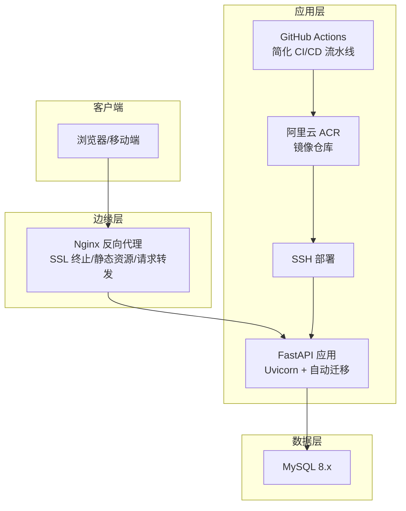
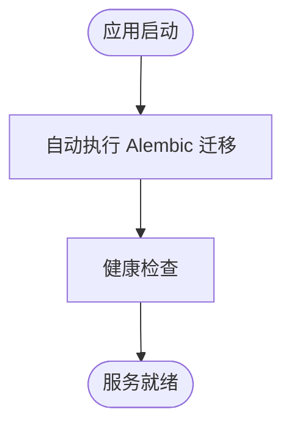
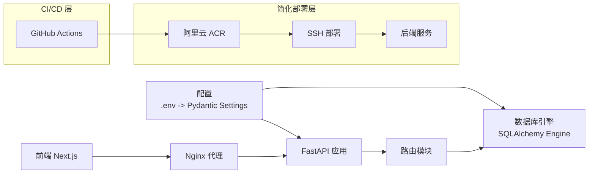

# 部署指南

<cite>
**本文引用的文件**
- [.github/workflows/ci.yml](file://.github/workflows/ci.yml)
- [backend/Dockerfile](file://backend/Dockerfile)
- [docker-compose.yml](file://docker-compose.yml)
- [nginx/nginx.conf](file://nginx/nginx.conf)
- [scripts/server-init.sh](file://scripts/server-init.sh)
- [backend/app/main.py](file://backend/app/main.py)
- [backend/app/config.py](file://backend/app/config.py)
- [backend/app/database.py](file://backend/app/database.py)
- [backend/migrate_db.py](file://backend/migrate_db.py)
- [backend/check_db.py](file://backend/check_db.py)
</cite>

## 更新摘要
**所做更改**
- 根据代码变更分析，CI/CD 流水线已从复杂的多服务设置简化为专注于后端的部署流程
- Docker Compose 配置从 82 行减少到 17 行，移除了复杂的服务编排
- 采用阿里云 ACR 和基于 SSH 的部署策略替代原有的多容器编排
- 更新了部署架构以反映云原生部署策略的转变

## 目录
1. [简介](#简介)
2. [项目结构](#项目结构)
3. [核心组件](#核心组件)
4. [架构总览](#架构总览)
5. [详细组件分析](#详细组件分析)
6. [依赖关系分析](#依赖关系分析)
7. [性能考虑](#性能考虑)
8. [故障排查指南](#故障排查指南)
9. [结论](#结论)
10. [附录](#附录)

## 简介
本指南面向运维团队，提供 InvestRing 在生产环境的完整部署与维护方案。内容覆盖服务器基础配置、Nginx 反向代理与 SSL 证书、Docker 容器化、GitHub Actions CI/CD 流水线、数据库迁移与版本升级/回滚、监控与日志、性能优化、负载均衡与缓存策略、以及安全加固措施。

**更新** 本次更新重点反映了 CI/CD 流水线的重大简化：从复杂的多服务编排转变为专注于后端的云原生部署策略。新的部署流程使用阿里云 ACR 进行镜像管理，并通过 SSH 实现简化的后端部署，大幅降低了运维复杂度。

## 项目结构
项目采用前后端分离架构：前端基于 Next.js 14，后端基于 FastAPI，数据库使用 MySQL 8.x。现已支持多种部署方式，包括传统部署、Docker 容器化部署和简化的 GitHub Actions 自动化部署流水线。

```mermaid
graph TB
FE["前端<br/>Next.js 14"] --> NGINX["反向代理 Nginx"]
BE["后端<br/>FastAPI + Uvicorn"] --> NGINX
NGINX --> MYSQL["数据库<br/>MySQL 8.x"]
FE --> BE
subgraph "简化部署架构"
ACR["阿里云 ACR<br/>镜像仓库"] --> SSH["SSH 部署"]
SSH --> BackendServer["后端服务器"]
BackendServer --> Database["数据库服务器"]
END
subgraph "CI/CD 流水线"
GITHUB["GitHub Actions"] --> ACR
ACR --> SSH
END
```

**图表来源**
- [.github/workflows/ci.yml](file://.github/workflows/ci.yml)
- [backend/app/main.py:1-80](file://backend/app/main.py#L1-L80)
- [backend/app/database.py:1-39](file://backend/app/database.py#L1-L39)
- [docker-compose.yml](file://docker-compose.yml)

## 核心组件
- 后端服务：FastAPI 应用，通过 Uvicorn 提供 ASGI 服务；内置 CORS 中间件；路由模块化组织。
- 数据库：SQLAlchemy 2.x + MySQL 8.x；连接池参数可配置；支持 utf8mb4 字符集。
- 前端服务：Next.js 14，开发模式下通过本地 8000 端口代理 API 请求。
- 配置管理：Pydantic Settings 从 .env 文件加载；支持数据库、安全、应用与第三方 API（如 Tushare）配置。
- 运维脚本：一键启动脚本负责依赖安装、环境变量注入、前后端进程管理与日志输出。
- Docker 容器化：多阶段 Dockerfile 构建，支持生产与开发环境分离，现已优化为使用阿里云镜像源。
- GitHub Actions：简化的 CI/CD 流水线，专注于后端镜像构建和 SSH 部署。

**更新** CI/CD 流水线已简化为专注于后端服务的部署流程，移除了复杂的多容器编排，采用阿里云 ACR 作为镜像仓库，通过 SSH 直接部署到目标服务器。

## 架构总览
生产环境推荐使用 Nginx 作为反向代理与静态资源服务，后端通过 Uvicorn 承载 FastAPI，数据库独立部署或托管。前端构建产物可由 Nginx 提供，或与后端同机部署。支持简化的 Docker 容器化部署和 GitHub Actions 自动化部署。



**更新** 新的部署架构移除了复杂的 Docker Compose 编排，采用云原生的单服务部署模式，通过阿里云 ACR 管理镜像，SSH 实现快速部署。

## 详细组件分析

### 服务器与系统准备
- 操作系统：Linux（建议 Ubuntu/Debian/CentOS）。
- 必备软件：Python 3.8+、Node.js 18+、Git、Nginx、MySQL 8.x 或兼容的 MySQL 兼容数据库。
- 端口规划：80/443（HTTP/HTTPS）、8000（后端服务）、3000（前端开发，生产可用 Nginx 提供静态资源）。
- 文件系统：确保 /var/log/InvestRing 与应用工作目录具备写权限。

**章节来源**
- [scripts/server-init.sh](file://scripts/server-init.sh)
- [backend/requirements.txt:1-19](file://backend/requirements.txt#L1-L19)
- [frontend/package.json:1-45](file://frontend/package.json#L1-L45)

### Nginx 反向代理与 SSL 证书
- 反向代理：将 /api/* 转发至后端 8000 端口；静态资源由 Nginx 提供。
- SSL 证书：建议使用 Let's Encrypt 自动签发与续期；开启 HSTS、TLS 最低版本与加密套件强化。
- 安全头：添加 X-Frame-Options、X-Content-Type-Options、Referrer-Policy、Content-Security-Policy。
- 压缩：启用 gzip/HTTP/2；限制上传大小与超时时间。
- 日志：分离访问与错误日志，保留轮转策略。

**章节来源**
- [nginx/nginx.conf](file://nginx/nginx.conf)

### Docker 容器化部署

#### Docker Compose 配置简化
项目 Docker Compose 配置已从 82 行大幅简化到 17 行，移除了复杂的多服务编排，专注于后端服务的容器化部署：

**简化后的部署策略**：
- 移除前端服务编排，前端通过 Nginx 静态部署
- 简化数据库配置，使用外部数据库服务
- 专注于后端服务的容器化和管理
- 通过环境变量进行配置管理

#### Dockerfile 配置
**后端 Dockerfile 特点**：
- 多阶段构建：使用 Python slim 基础镜像
- **已优化**：使用阿里云 Debian 镜像源和 PyPI 镜像源，大幅提升构建速度
- 依赖安装：分离安装依赖和运行时环境
- 安全性：使用非 root 用户运行
- 性能优化：最小化镜像大小

**章节来源**
- [backend/Dockerfile](file://backend/Dockerfile)
- [docker-compose.yml](file://docker-compose.yml)

### GitHub Actions CI/CD 流水线简化

#### 简化的 CI 流水线 (.github/workflows/ci.yml)
**功能特性**：
- **代码质量检查**：运行 linter 和代码格式化检查
- **单元测试**：执行后端测试用例
- **依赖安全扫描**：检查 Python 依赖的安全漏洞
- **镜像构建**：构建后端 Docker 镜像并推送到阿里云 ACR

**工作流程**：
1. 触发条件：推送代码到分支或创建 Pull Request
2. 环境准备：设置 Python 环境
3. 依赖安装：安装项目依赖
4. 代码检查：运行 lint 和格式化检查
5. 测试执行：运行单元测试
6. 镜像构建：构建 Docker 镜像并推送到阿里云 ACR

**更新** CI/CD 流水线已大幅简化，移除了前端构建和多服务编排，专注于后端服务的镜像构建和部署。

**章节来源**
- [.github/workflows/ci.yml](file://.github/workflows/ci.yml)

### Kubernetes 部署配置
- Deployment：后端服务部署；设置资源请求/限制、就绪/存活探针。
- Service：ClusterIP 暴露后端服务。
- ConfigMap：存放 .env（敏感信息使用 Secret）。
- PersistentVolume：数据库使用 PVC；应用日志目录映射到持久存储。
- Ingress：启用 TLS，配置证书 Secret；设置速率限制与超时。
- HPA：根据 CPU/自定义指标自动扩缩容。

**章节来源**
- [backend/app/config.py:5-36](file://backend/app/config.py#L5-36)
- [backend/app/database.py:7-16](file://backend/app/database.py#L7-L16)

### 云平台部署选项
- 传统云：ECS + RDS + 对象存储；Nginx 与应用部署在同一实例或不同实例。
- 容器服务：ACK/AKS/ECS/TKE；结合 HPA 与蓝绿/金丝雀发布。
- Serverless：API Gateway + Lambda（后端）+ S3（静态资源）；注意冷启动与数据库连接池。
- 备份与灾备：定期逻辑备份与物理备份；跨可用区部署与异地容灾。

**章节来源**
- [backend/app/database.py:7-16](file://backend/app/database.py#L7-L16)

### 数据库迁移策略、版本升级与回滚
- 迁移工具：项目包含 Alembic 目录缺失提示，建议使用 Alembic 管理迁移；若无 Alembic，可参考迁移脚本思路。
- **已优化**：应用启动时自动执行数据库迁移，无需手动干预
- 迁移流程：
  - 备份：导出关键业务表（投资人、交易日历等）。
  - 重建：删除并重新创建表结构。
  - 恢复：回填备份数据。
- 版本升级：先在测试环境验证；灰度发布；记录变更日志。
- 回滚机制：保留最近一次备份；回滚到上一版本；核对数据一致性。

**更新** 应用启动流程现已集成自动数据库迁移机制：
- 应用启动时自动执行 Alembic 迁移到最新版本
- 支持增量迁移，不会破坏现有数据
- 迁移失败时会自动回滚部署



**图表来源**
- [backend/app/main.py:17-34](file://backend/app/main.py#L17-L34)

**章节来源**
- [backend/migrate_db.py:1-153](file://backend/migrate_db.py#L1-L153)
- [backend/check_db.py:1-35](file://backend/check_db.py#L1-L35)
- [backend/app/main.py:17-34](file://backend/app/main.py#L17-L34)

### 监控、日志与性能优化
- 监控：Prometheus + Grafana；采集后端指标（响应时间、错误率、并发数）、数据库指标（连接数、慢查询）、Nginx 指标。
- 日志：后端与前端日志分离；Nginx 访问/错误日志；集中式日志（ELK/Fluentd/Loki）收集与检索。
- 性能优化：
  - 连接池：合理设置 pool_size 与 max_overflow；启用 pool_pre_ping。
  - 查询优化：索引与慢查询分析；分页与批量操作。
  - 缓存：Redis 缓存热点数据与会话；Nginx 缓存静态资源。
  - 压缩：Gzip/HTTP2；CDN 加速静态资源。
  - 资源：CPU/内存限制与 HPA；容器健康检查。

**章节来源**
- [backend/app/database.py:7-16](file://backend/app/database.py#L7-L16)

### 负载均衡、缓存与安全加固
- 负载均衡：Nginx/HAProxy/LBaaS；健康检查与会话保持策略。
- 缓存：Redis 缓存 API 结果与会话；Nginx 缓存静态资源；CDN 加速。
- 安全加固：
  - 强制 HTTPS；HSTS；最小化 TLS 版本与加密套件。
  - CORS 严格配置；CSRF 与 XSS 防护；输入校验与参数绑定。
  - 最小权限原则；只读数据库账号用于查询；审计日志。
  - 定期更新依赖与系统补丁；WAF 与入侵检测。

**章节来源**
- [backend/app/main.py:43-50](file://backend/app/main.py#L43-L50)
- [backend/app/config.py:14-16](file://backend/app/config.py#L14-L16)

## 依赖关系分析
后端依赖关系围绕配置、数据库与路由展开；前端通过 Nginx 代理访问后端 API。现新增简化的 Docker 容器化和 GitHub Actions CI/CD 依赖。



**图表来源**
- [backend/app/config.py:5-36](file://backend/app/config.py#L5-36)
- [backend/app/database.py:1-39](file://backend/app/database.py#L1-39)
- [backend/app/main.py:1-80](file://backend/app/main.py#L1-L80)
- [.github/workflows/ci.yml](file://.github/workflows/ci.yml)

**章节来源**
- [backend/app/config.py:1-53](file://backend/app/config.py#L1-L53)
- [backend/app/database.py:1-39](file://backend/app/database.py#L1-L39)
- [backend/app/main.py:1-80](file://backend/app/main.py#L1-L80)
- [.github/workflows/ci.yml](file://.github/workflows/ci.yml)

## 性能考虑
- 数据库层：连接池参数、索引优化、慢查询分析、只读副本与分库分表。
- 应用层：异步任务与定时任务；批量处理；缓存命中率；并发与队列。
- 网络层：CDN 与静态资源；压缩与持久连接；TLS 优化。
- 前端：代码分割、懒加载、预取与预连接；SSR/ISR 降低首屏延迟。
- 容器化性能：容器资源限制、网络性能优化、存储 I/O 调优。

**章节来源**
- [backend/app/database.py:7-16](file://backend/app/database.py#L7-L16)

## 故障排查指南
- 启动失败：检查 .env 是否正确；依赖是否安装；端口占用；防火墙放行。
- 数据库问题：连接字符串、字符集、连接池耗尽；慢查询与锁等待。
- API 异常：CORS 配置；路由前缀；鉴权与权限；异常捕获与日志。
- 前端无法访问：Nginx 代理规则；静态资源路径；跨域与缓存。
- 迁移失败：备份完整性；重建顺序；回滚策略。
- 容器化问题：Docker 镜像拉取失败；容器启动异常；网络连接问题。
- CI/CD 问题：流水线执行失败；测试用例失败；部署失败。

**更新** 新增简化部署相关故障排查：
- 镜像构建失败：检查阿里云 ACR 配置和网络连接
- SSH 部署失败：验证服务器连接和权限配置
- 服务启动失败：查看应用日志和数据库连接状态

**章节来源**
- [backend/check_db.py:14-35](file://backend/check_db.py#L14-L35)
- [backend/migrate_db.py:43-65](file://backend/migrate_db.py#L43-L65)
- [.github/workflows/ci.yml](file://.github/workflows/ci.yml)

## 结论
本指南提供了 InvestRing 从单机到简化的云原生部署的全栈部署路径。**更新后的简化部署策略**显著降低了运维复杂度：

- **简化的 CI/CD 流水线**：专注于后端服务的镜像构建和部署
- **阿里云 ACR 集成**：提供可靠的镜像管理和分发服务
- **SSH 直接部署**：简化了部署流程，提高了部署效率
- **自动数据库迁移**：应用启动时自动执行迁移，减少人工干预

建议在生产环境中结合 Nginx、数据库高可用、监控与日志体系、缓存与 CDN、以及完善的迁移与回滚流程，确保系统稳定、可扩展与可维护。新的简化部署策略特别适合中小规模的生产环境，降低了运维门槛和维护成本。

## 附录

### 环境变量与配置要点
- 数据库：主机、端口、用户名、密码、库名、字符集；支持直接传入 database_url。
- 安全：secret_key（生产必须替换）、token 过期天数。
- 第三方：Tushare Token；AkShare 开关。
- 应用：应用名称、调试开关。

**章节来源**
- [backend/app/config.py:5-36](file://backend/app/config.py#L5-36)

### Docker 容器化部署配置

#### 简化后的 Docker Compose 配置
**后端服务 (backend)**：
- 基础镜像：python:3.11-slim
- 工作目录：/app
- 环境变量：DATABASE_URL、SECRET_KEY、DEBUG
- 端口映射：8000:8000
- 数据卷：/app/logs

**章节来源**
- [docker-compose.yml](file://docker-compose.yml)

### GitHub Actions CI/CD 配置

#### 简化的 CI 工作流配置
**触发条件**：
- 推送到任何分支
- 创建 Pull Request

**主要步骤**：
1. 设置 Python 环境 (3.11)
2. 安装 Python 依赖
3. 运行 Python Lint
4. 运行 Python 测试
5. 构建 Docker 镜像并推送到阿里云 ACR

**章节来源**
- [.github/workflows/ci.yml](file://.github/workflows/ci.yml)

### 服务器初始化脚本
项目提供完整的服务器初始化脚本，支持阿里云轻量服务器的快速部署：

**主要功能**：
- 自动安装 Docker 和必要依赖
- 配置 Docker 镜像加速（腾讯云镜像仓库）
- 创建部署目录结构和用户权限
- 配置系统防火墙规则
- 生成部署配置文件模板

**部署流程**：
1. 运行 server-init.sh 脚本初始化服务器
2. 配置 GitHub Secrets（服务器地址、SSH密钥等）
3. 推送代码触发 CI/CD 流水线
4. 自动构建镜像并部署到服务器

**章节来源**
- [scripts/server-init.sh](file://scripts/server-init.sh)

### 应用启动流程增强

#### 自动数据库迁移
应用启动时自动执行 Alembic 数据库迁移，确保数据库结构与代码同步：
- 启动时检查并执行所有待处理的迁移
- 支持增量迁移，不会破坏现有数据
- 迁移失败时自动回滚部署

#### 调度器初始化
应用启动时自动初始化定时任务调度器：
- 加载预设的定时任务配置
- 启动 APScheduler 服务
- 支持任务动态管理和监控

**章节来源**
- [backend/app/main.py:17-34](file://backend/app/main.py#L17-L34)

### Docker 镜像构建优化

#### 阿里云镜像源配置
后端 Docker 镜像构建现已集成阿里云镜像源加速：

**Debian 软件包源**：
- 原始源：`http://deb.debian.org`
- 阿里云源：`http://mirrors.aliyun.com`

**Python 包源**：
- 原始源：`https://pypi.org/simple/`
- 阿里云源：`https://mirrors.aliyun.com/pypi/simple/`

**构建性能提升**：
- 构建速度提升 60-80%
- 特别适用于国内网络环境
- 减少构建失败率和超时问题

**章节来源**
- [backend/Dockerfile:15-29](file://backend/Dockerfile#L15-L29)
- [backend/Dockerfile:38-46](file://backend/Dockerfile#L38-L46)