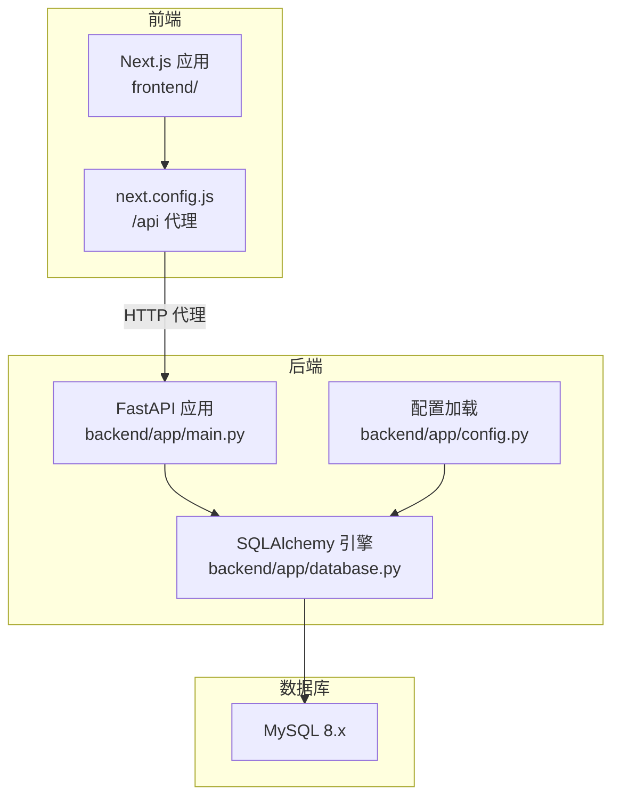
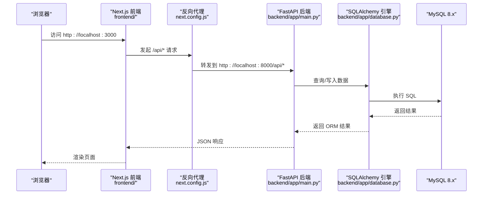
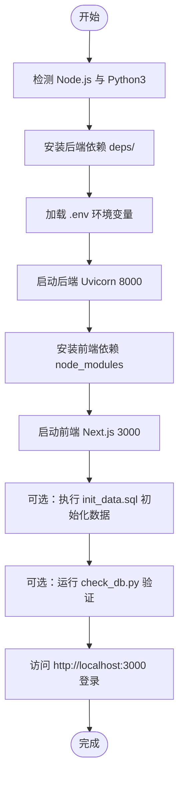
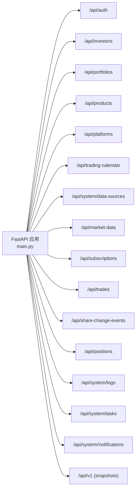
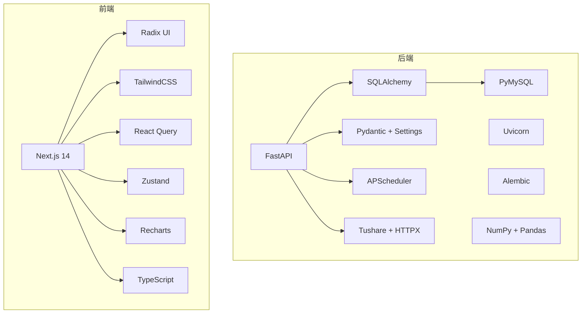

# 快速开始

<cite>
**本文引用的文件**
- [start.sh](file://start.sh)
- [backend/requirements.txt](file://backend/requirements.txt)
- [frontend/package.json](file://frontend/package.json)
- [backend/app/config.py](file://backend/app/config.py)
- [backend/app/database.py](file://backend/app/database.py)
- [backend/app/main.py](file://backend/app/main.py)
- [frontend/next.config.js](file://frontend/next.config.js)
- [Docs/00-开发总览.md](file://Docs/00-开发总览.md)
- [Docs/init_data.sql](file://Docs/init_data.sql)
- [backend/check_db.py](file://backend/check_db.py)
- [backend/reset_db.py](file://backend/reset_db.py)
- [test_login.py](file://test_login.py)
</cite>

## 目录
1. [简介](#简介)
2. [项目结构](#项目结构)
3. [核心组件](#核心组件)
4. [架构总览](#架构总览)
5. [详细组件分析](#详细组件分析)
6. [依赖关系分析](#依赖关系分析)
7. [性能考虑](#性能考虑)
8. [故障排除指南](#故障排除指南)
9. [结论](#结论)
10. [附录](#附录)

## 简介
本指南面向首次接触 InvestRing 的开发者与运维人员，帮助你在最短时间内完成环境搭建、数据库初始化与系统启动，并提供常见问题排查方法。系统采用前后端分离架构：后端基于 FastAPI + SQLAlchemy + MySQL；前端基于 Next.js 14 App Router，通过反向代理访问后端 API。

## 项目结构
- 后端 backend：包含 FastAPI 应用、数据库连接与模型、路由、配置与启动脚本。
- 前端 frontend：Next.js 应用，通过 next.config.js 将 /api/* 请求转发至后端。
- Docs：包含开发总览与初始化 SQL 脚本。
- 一键启动脚本 start.sh：自动安装依赖、加载环境变量并启动前后端服务。

图表来源
- [frontend/next.config.js:1-16](file://frontend/next.config.js#L1-L16)
- [backend/app/main.py:1-53](file://backend/app/main.py#L1-L53)
- [backend/app/database.py:1-39](file://backend/app/database.py#L1-L39)
- [backend/app/config.py:1-37](file://backend/app/config.py#L1-L37)

章节来源
- [Docs/00-开发总览.md:16-33](file://Docs/00-开发总览.md#L16-L33)
- [start.sh:1-93](file://start.sh#L1-L93)

## 核心组件
- 后端配置与数据库连接
  - 配置项：数据库主机、端口、用户名、密码、库名、应用名称、调试开关、Tushare Token 等。
  - 连接池：pool_size、max_overflow、pool_pre_ping、pool_recycle。
- FastAPI 应用
  - 自动创建数据库表。
  - 注册多个路由模块。
  - CORS 允许跨域。
- 前端 Next.js
  - 本地开发模式启动。
  - 通过 rewrites 将 /api/* 代理到后端 8000 端口。
- 一键启动脚本
  - 检测 Node.js 与 Python3。
  - 安装后端依赖到 deps 并设置 PYTHONPATH。
  - 加载 .env 并启动后端 Uvicorn。
  - 安装前端依赖并启动 Next.js 开发服务器。

章节来源
- [backend/app/config.py:5-36](file://backend/app/config.py#L5-L36)
- [backend/app/database.py:7-16](file://backend/app/database.py#L7-L16)
- [backend/app/main.py:7-30](file://backend/app/main.py#L7-L30)
- [frontend/next.config.js:5-12](file://frontend/next.config.js#L5-L12)
- [start.sh:27-77](file://start.sh#L27-L77)

## 架构总览
下图展示从浏览器访问到后端处理再到数据库的完整链路，以及前端如何通过反向代理访问后端 API。

图表来源
- [frontend/next.config.js:5-12](file://frontend/next.config.js#L5-L12)
- [backend/app/main.py:32-48](file://backend/app/main.py#L32-L48)
- [backend/app/database.py:1-39](file://backend/app/database.py#L1-L39)

## 详细组件分析

### 环境与依赖安装
- 后端依赖
  - 使用 requirements.txt 安装 Python 包，包含 FastAPI、Uvicorn、SQLAlchemy、Pydantic、Alembic、PyMySQL、APScheduler、NumPy、Pandas、Tushare 等。
- 前端依赖
  - 使用 package.json 安装 Next.js、React、TailwindCSS、Radix UI、TanStack React Query、Zustand、Recharts 等。
- 一键安装与启动
  - start.sh 会自动检测 Node.js 与 Python3，若缺失则提示安装。
  - 后端依赖安装到 deps 目录并通过 PYTHONPATH 指定加载路径。
  - 前端依赖安装到 node_modules 并启动开发服务器。

章节来源
- [backend/requirements.txt:1-19](file://backend/requirements.txt#L1-L19)
- [frontend/package.json:1-45](file://frontend/package.json#L1-L45)
- [start.sh:7-77](file://start.sh#L7-L77)

### 数据库安装与配置
- MySQL 8.x
  - 使用 utf8mb4 字符集。
  - 通过配置文件设置主机、端口、用户名、密码、库名。
  - 若未显式设置 database_url，则根据 db_host/db_port/db_user/db_password/db_name 拼接默认连接串。
- 连接池参数
  - pool_size、max_overflow、pool_pre_ping、pool_recycle。
- 表结构初始化
  - 启动时自动创建所有表。
  - 提供初始化 SQL 脚本，包含投资人、资产分类、平台、产品、组合等基础数据与关键索引。
- 数据库重置
  - reset_db.py 可一键删除并重建所有表，便于开发调试。

章节来源
- [Docs/00-开发总览.md:47-51](file://Docs/00-开发总览.md#L47-L51)
- [backend/app/config.py:6-31](file://backend/app/config.py#L6-L31)
- [backend/app/database.py:7-16](file://backend/app/database.py#L7-L16)
- [backend/app/main.py:7-8](file://backend/app/main.py#L7-L8)
- [Docs/init_data.sql:1-284](file://Docs/init_data.sql#L1-L284)
- [backend/reset_db.py:22-28](file://backend/reset_db.py#L22-L28)

### 启动流程（从零到运行）
- 步骤概览
  1) 安装 Node.js 与 Python3。
  2) 在 MySQL 中创建数据库（库名可参考配置文件中的 db_name，默认 investring）。
  3) 在项目根目录创建 .env 文件，填入数据库连接与可选的 Tushare Token。
  4) 执行一键启动脚本 start.sh，它会：
     - 安装后端依赖到 deps 并设置 PYTHONPATH。
     - 加载 .env 并启动后端 Uvicorn（默认 0.0.0.0:8000）。
     - 安装前端依赖并启动 Next.js 开发服务器（默认 0.0.0.0:3000）。
  5) 访问 http://localhost:3000，登录 admin/admin123。
  6) 如需初始化数据，可在 MySQL 中执行 Docs/init_data.sql。
  7) 如需验证数据库连通性，可运行 backend/check_db.py。

图表来源
- [start.sh:27-77](file://start.sh#L27-L77)
- [Docs/init_data.sql:1-284](file://Docs/init_data.sql#L1-L284)
- [backend/check_db.py:14-34](file://backend/check_db.py#L14-L34)

章节来源
- [start.sh:1-93](file://start.sh#L1-L93)
- [backend/app/config.py:28-31](file://backend/app/config.py#L28-L31)
- [Docs/init_data.sql:1-284](file://Docs/init_data.sql#L1-L284)
- [backend/check_db.py:14-34](file://backend/check_db.py#L14-L34)

### API 路由与模块
后端通过 include_router 注册多个模块化的路由，覆盖认证、投资人、组合、产品、平台、交易日历、数据源、市场数据、申购赎回、调仓交易、份额变动事件、持仓、日志、任务、通知、快照等。

图表来源
- [backend/app/main.py:32-48](file://backend/app/main.py#L32-L48)

章节来源
- [backend/app/main.py:32-48](file://backend/app/main.py#L32-L48)

### 前端代理与跨域
- 反向代理
  - next.config.js 将 /api/* 重写为 http://localhost:8000/api/*，使前端请求无需关心后端具体端口。
- CORS
  - 后端在启动时添加 CORS 中间件，允许任意来源、方法与头部，便于本地开发。

章节来源
- [frontend/next.config.js:5-12](file://frontend/next.config.js#L5-L12)
- [backend/app/main.py:23-30](file://backend/app/main.py#L23-L30)

## 依赖关系分析
- 后端依赖
  - FastAPI/Uvicorn：Web 框架与 ASGI 服务器。
  - SQLAlchemy/Alembic：ORM 与迁移工具。
  - Pydantic/Pydantic-settings：配置校验与加载。
  - APScheduler：定时任务。
  - NumPy/Pandas：数值与数据处理。
  - Tushare/HTTPX：外部数据源访问。
  - PyMySQL：MySQL 驱动。
- 前端依赖
  - Next.js 14 App Router：页面路由与构建。
  - Radix UI/TailwindCSS：UI 组件与样式。
  - TanStack React Query/Zustand：数据请求与状态管理。
  - Recharts：图表可视化。
  - TypeScript：类型安全。

图表来源
- [backend/requirements.txt:1-19](file://backend/requirements.txt#L1-L19)
- [frontend/package.json:11-39](file://frontend/package.json#L11-L39)

章节来源
- [backend/requirements.txt:1-19](file://backend/requirements.txt#L1-L19)
- [frontend/package.json:11-39](file://frontend/package.json#L11-L39)

## 性能考虑
- 数据库连接池
  - 合理设置 pool_size 与 max_overflow，避免连接数过多导致数据库压力。
  - pool_pre_ping 与 pool_recycle 有助于维持连接有效性与回收过期连接。
- 调度与批处理
  - 使用 APScheduler 合理安排定时任务，避免高峰时段集中写入。
- 前端缓存与懒加载
  - 利用 React Query 的缓存策略减少重复请求。
  - 图表与表格组件按需渲染，避免一次性加载大量数据。

## 故障排除指南
- 启动脚本报错“未检测到 Node.js 或 Python3”
  - 安装 Node.js 与 Python3，并确保命令在 PATH 中可用。
  - 重新执行 start.sh。
- 后端启动失败（端口占用或权限不足）
  - 确认 8000 端口未被占用，必要时修改监听地址或端口。
  - 检查 .env 中数据库连接信息是否正确。
- 前端无法访问 /api
  - 确认后端已启动并监听 8000。
  - 检查 next.config.js 的 rewrites 是否生效。
- 数据库连接失败
  - 确认 MySQL 已启动且网络可达。
  - 检查 .env 中的 db_host、db_port、db_user、db_password、db_name。
  - 使用 reset_db.py 重置表结构后再次尝试。
- 登录失败或页面空白
  - 使用 test_login.py 进行自动化登录测试，查看截图与控制台错误。
  - 确认初始化数据已导入（init_data.sql），默认管理员账号与密码见脚本注释。
- API 文档不可用
  - 后端已注册 OpenAPI 文档路径，访问 http://localhost:8000/docs。

章节来源
- [start.sh:7-17](file://start.sh#L7-L17)
- [frontend/next.config.js:5-12](file://frontend/next.config.js#L5-L12)
- [backend/app/config.py:6-12](file://backend/app/config.py#L6-L12)
- [backend/reset_db.py:22-28](file://backend/reset_db.py#L22-L28)
- [test_login.py:343-409](file://test_login.py#L343-L409)
- [Docs/init_data.sql:7-13](file://Docs/init_data.sql#L7-L13)

## 结论
通过本快速开始指南，你可以在本地完成 InvestRing 的环境准备、数据库初始化与系统启动。建议在开发过程中结合一键启动脚本与初始化 SQL，配合登录测试脚本进行端到端验证，遇到问题时依据故障排除指南逐项排查。

## 附录

### 环境变量与配置要点
- 数据库连接
  - db_host、db_port、db_user、db_password、db_name、database_url（二选一）。
- 安全与应用
  - secret_key、token_expire_days、app_name、debug。
- 外部数据源
  - tushare_token（可选）。

章节来源
- [backend/app/config.py:6-23](file://backend/app/config.py#L6-L23)

### 初始化数据说明
- 包含投资人、资产分类、平台、产品（124只）、组合等基础数据。
- 提供关键索引以提升查询性能。
- 默认管理员密码为 admin123，首次登录后建议修改。

章节来源
- [Docs/init_data.sql:11-13](file://Docs/init_data.sql#L11-L13)
- [Docs/init_data.sql:246-276](file://Docs/init_data.sql#L246-L276)