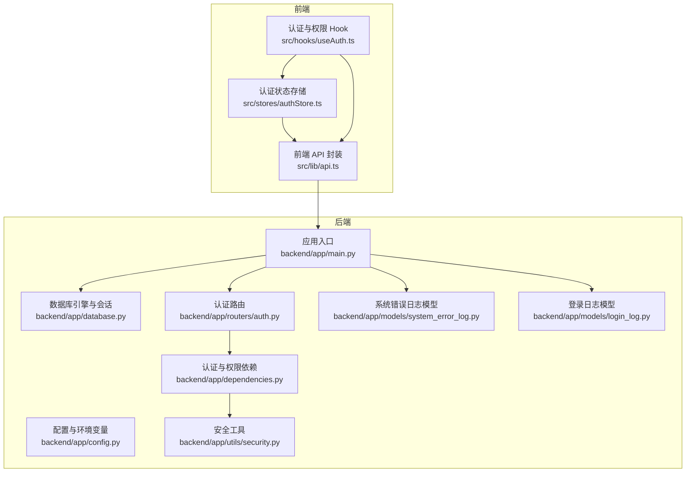
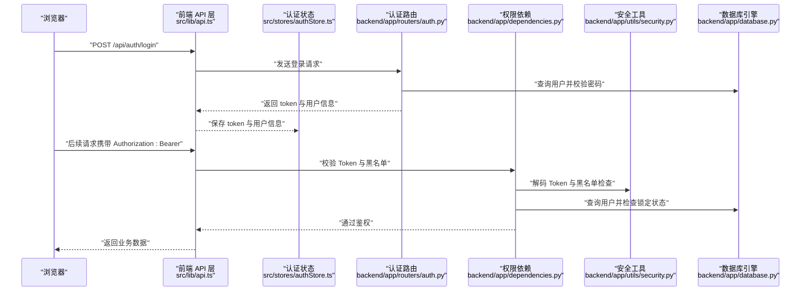
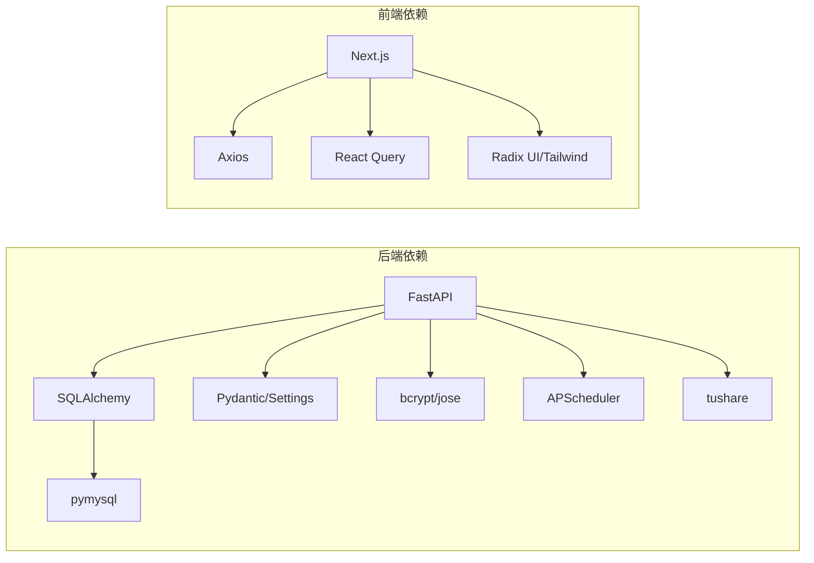
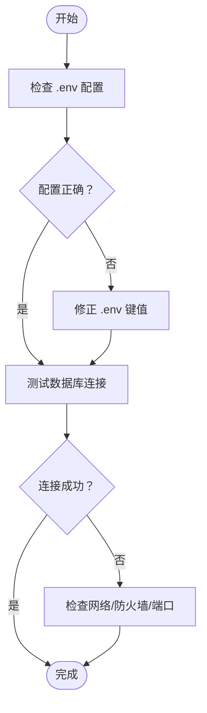
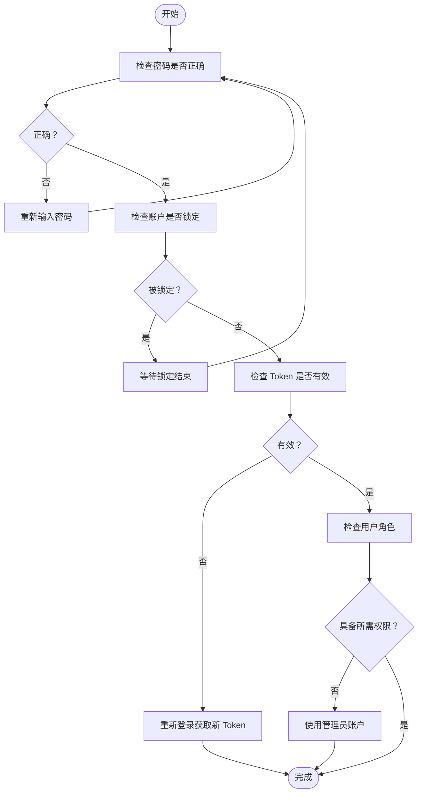
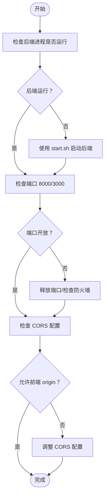
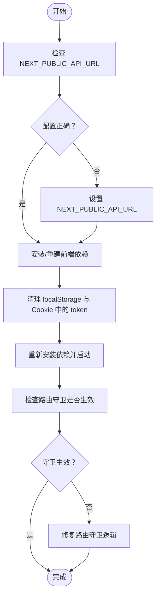

# 常见问题排查

<cite>
**本文引用的文件**
- [backend/app/main.py](file://backend/app/main.py)
- [backend/app/config.py](file://backend/app/config.py)
- [backend/app/database.py](file://backend/app/database.py)
- [backend/app/routers/auth.py](file://backend/app/routers/auth.py)
- [backend/app/dependencies.py](file://backend/app/dependencies.py)
- [backend/app/utils/security.py](file://backend/app/utils/security.py)
- [backend/app/models/system_error_log.py](file://backend/app/models/system_error_log.py)
- [backend/app/models/login_log.py](file://backend/app/models/login_log.py)
- [frontend/src/lib/api.ts](file://frontend/src/lib/api.ts)
- [frontend/src/stores/authStore.ts](file://frontend/src/stores/authStore.ts)
- [frontend/src/hooks/useAuth.ts](file://frontend/src/hooks/useAuth.ts)
- [start.sh](file://start.sh)
- [backend/requirements.txt](file://backend/requirements.txt)
- [frontend/package.json](file://frontend/package.json)
- [backend/test_update_cash_api.py](file://backend/test_update_cash_api.py)
- [backend/test_update_cash_detailed.py](file://backend/test_update_cash_detailed.py)
- [backend/check_and_sync_2024_calendar.py](file://backend/check_and_sync_2024_calendar.py)
- [Docs/02-数据库设计.md](file://Docs/02-数据库设计.md)
</cite>

## 目录
1. [简介](#简介)
2. [项目结构](#项目结构)
3. [核心组件](#核心组件)
4. [架构总览](#架构总览)
5. [详细组件分析](#详细组件分析)
6. [依赖分析](#依赖分析)
7. [性能考虑](#性能考虑)
8. [故障排查指南](#故障排查指南)
9. [结论](#结论)
10. [附录](#附录)

## 简介
本文件面向 InvestRing 的使用者与运维人员，提供系统运行过程中的常见问题排查手册。覆盖数据库连接失败、API 接口调用错误、前端页面加载异常、认证失败等问题，逐项给出症状表现、可能原因与详细解决步骤，并提供问题自检清单、快速诊断方法、错误日志解读与调试技巧。

## 项目结构
InvestRing 采用前后端分离架构：
- 后端基于 FastAPI，提供 REST API；通过 SQLAlchemy 连接数据库；支持任务调度与日志记录。
- 前端基于 Next.js，使用 React Query 管理状态与缓存，Axios 统一发起请求，Zustand 管理认证状态。

**图表来源**
- [backend/app/main.py:1-53](file://backend/app/main.py#L1-L53)
- [backend/app/config.py:1-37](file://backend/app/config.py#L1-L37)
- [backend/app/database.py:1-39](file://backend/app/database.py#L1-L39)
- [backend/app/routers/auth.py:1-186](file://backend/app/routers/auth.py#L1-L186)
- [backend/app/dependencies.py:1-146](file://backend/app/dependencies.py#L1-L146)
- [backend/app/utils/security.py:1-103](file://backend/app/utils/security.py#L1-L103)
- [backend/app/models/system_error_log.py:1-19](file://backend/app/models/system_error_log.py#L1-L19)
- [backend/app/models/login_log.py:1-16](file://backend/app/models/login_log.py#L1-L16)
- [frontend/src/lib/api.ts:1-627](file://frontend/src/lib/api.ts#L1-L627)
- [frontend/src/stores/authStore.ts:1-71](file://frontend/src/stores/authStore.ts#L1-L71)
- [frontend/src/hooks/useAuth.ts:1-134](file://frontend/src/hooks/useAuth.ts#L1-L134)

**章节来源**
- [backend/app/main.py:1-53](file://backend/app/main.py#L1-L53)
- [frontend/src/lib/api.ts:1-627](file://frontend/src/lib/api.ts#L1-L627)

## 核心组件
- 后端配置与数据库
  - 配置类负责从 .env 读取数据库、安全、Tushare 等参数，并在未显式提供 database_url 时拼接默认值。
  - 数据库引擎启用连接池、pre_ping、recycle 等参数，SQLite 使用 WAL 模式优化兼容性。
- 认证与权限
  - 登录接口支持账户锁定策略、失败计数与黑名单；鉴权中间件校验 Token、黑名单与账户锁定状态。
  - 提供管理员与普通用户的权限校验依赖。
- 前端 API 与状态
  - Axios 实例统一设置 baseURL、超时、请求头；请求拦截器自动附加 Bearer Token；响应拦截器处理 401 自动跳转。
  - Zustand 管理 token 与用户信息；React Query 管理远端状态与缓存。

**章节来源**
- [backend/app/config.py:1-37](file://backend/app/config.py#L1-L37)
- [backend/app/database.py:1-39](file://backend/app/database.py#L1-L39)
- [backend/app/routers/auth.py:1-186](file://backend/app/routers/auth.py#L1-L186)
- [backend/app/dependencies.py:1-146](file://backend/app/dependencies.py#L1-L146)
- [frontend/src/lib/api.ts:1-627](file://frontend/src/lib/api.ts#L1-L627)
- [frontend/src/stores/authStore.ts:1-71](file://frontend/src/stores/authStore.ts#L1-L71)

## 架构总览
下图展示从前端到后端的关键交互流程，包括认证、权限校验与数据库访问。

**图表来源**
- [frontend/src/lib/api.ts:1-627](file://frontend/src/lib/api.ts#L1-L627)
- [frontend/src/stores/authStore.ts:1-71](file://frontend/src/stores/authStore.ts#L1-L71)
- [backend/app/routers/auth.py:1-186](file://backend/app/routers/auth.py#L1-L186)
- [backend/app/dependencies.py:1-146](file://backend/app/dependencies.py#L1-L146)
- [backend/app/utils/security.py:1-103](file://backend/app/utils/security.py#L1-L103)
- [backend/app/database.py:1-39](file://backend/app/database.py#L1-L39)

## 详细组件分析

### 数据库连接问题
- 症状
  - 后端启动时报数据库连接错误；API 调用出现连接超时或拒绝。
- 可能原因
  - 数据库主机/端口/账号/密码不正确；网络不可达；防火墙阻断；charset 不匹配；SQLite 文件权限问题。
- 解决步骤
  - 检查 .env 中 db_host、db_port、db_user、db_password、db_name 或 database_url 是否正确。
  - 使用 requirements.txt 中的依赖版本，确保驱动与 SQLAlchemy 版本兼容。
  - 对 MySQL，确认字符集与连接串参数；对 SQLite，确认文件路径与权限。
  - 使用连接池参数进行健康检查，必要时调整 pool_size、max_overflow、pool_pre_ping。
- 快速自检清单
  - [ ] .env 是否存在且包含数据库配置
  - [ ] 数据库服务可达（telnet/nc）
  - [ ] 用户权限与数据库存在性
  - [ ] 字符集与连接串参数一致
  - [ ] SQLite 文件路径与权限
- 相关实现参考
  - 配置解析与默认 URL 拼接：[backend/app/config.py:28-31](file://backend/app/config.py#L28-L31)
  - 引擎与连接池配置：[backend/app/database.py:8-16](file://backend/app/database.py#L8-L16)
  - SQLite WAL 模式设置：[backend/app/database.py:19-26](file://backend/app/database.py#L19-L26)

**章节来源**
- [backend/app/config.py:1-37](file://backend/app/config.py#L1-L37)
- [backend/app/database.py:1-39](file://backend/app/database.py#L1-L39)
- [backend/requirements.txt:1-19](file://backend/requirements.txt#L1-L19)

### API 接口调用错误
- 症状
  - 前端报 401 未授权；部分接口返回 422 参数校验失败；偶发 500 服务器错误。
- 可能原因
  - Token 缺失或过期；Token 被加入黑名单；账户被锁定；CORS 配置导致跨域失败；后端服务未启动或端口占用。
- 解决步骤
  - 确认前端已正确保存并附加 Authorization: Bearer token。
  - 若修改密码，后端会将当前 Token 黑名单化，需重新登录获取新 token。
  - 检查后端日志与系统错误日志表，定位业务异常与参数校验失败。
  - 校验后端 CORS 配置允许前端域名访问。
- 快速自检清单
  - [ ] localStorage 是否存在 token
  - [ ] 响应拦截器是否触发 401 跳转
  - [ ] 后端是否启动且端口开放
  - [ ] CORS 是否允许前端 origin
  - [ ] 系统错误日志表是否有对应错误
- 相关实现参考
  - 前端 401 处理与统一错误封装：[frontend/src/lib/api.ts:67-107](file://frontend/src/lib/api.ts#L67-L107)
  - 登录接口与 Token 生成：[backend/app/routers/auth.py:29-95](file://backend/app/routers/auth.py#L29-L95)
  - 权限依赖与黑名单校验：[backend/app/dependencies.py:53-111](file://backend/app/dependencies.py#L53-L111)
  - 系统错误日志模型字段：[backend/app/models/system_error_log.py:1-19](file://backend/app/models/system_error_log.py#L1-L19)

**章节来源**
- [frontend/src/lib/api.ts:1-627](file://frontend/src/lib/api.ts#L1-L627)
- [backend/app/routers/auth.py:1-186](file://backend/app/routers/auth.py#L1-L186)
- [backend/app/dependencies.py:1-146](file://backend/app/dependencies.py#L1-L146)
- [backend/app/models/system_error_log.py:1-19](file://backend/app/models/system_error_log.py#L1-L19)

### 前端页面加载异常
- 症状
  - 页面空白、白屏、资源 404；登录后无法跳转仪表盘；切换路由时状态丢失。
- 可能原因
  - NEXT_PUBLIC_API_URL 未正确设置；构建产物未生成；本地存储 token 异常；路由守卫逻辑未生效。
- 解决步骤
  - 确认环境变量 NEXT_PUBLIC_API_URL 指向后端地址；开发模式下默认使用 /api。
  - 清理 node_modules 与构建缓存后重新安装依赖。
  - 清空 localStorage 与 Cookie 中的 token，重新登录。
  - 检查路由守卫 useAuthGuard 是否在页面加载时执行。
- 快速自检清单
  - [ ] NEXT_PUBLIC_API_URL 是否正确
  - [ ] 前端依赖是否完整安装
  - [ ] localStorage 与 Cookie 中 token 是否清理干净
  - [ ] 路由守卫是否正确挂载
- 相关实现参考
  - Axios baseURL 与请求拦截器：[frontend/src/lib/api.ts:42-65](file://frontend/src/lib/api.ts#L42-L65)
  - 认证状态存储与持久化：[frontend/src/stores/authStore.ts:29-70](file://frontend/src/stores/authStore.ts#L29-L70)
  - 路由守卫与认证 Hook：[frontend/src/hooks/useAuth.ts:96-115](file://frontend/src/hooks/useAuth.ts#L96-L115)
  - 前端依赖与脚本：[frontend/package.json:1-45](file://frontend/package.json#L1-L45)

**章节来源**
- [frontend/src/lib/api.ts:1-627](file://frontend/src/lib/api.ts#L1-L627)
- [frontend/src/stores/authStore.ts:1-71](file://frontend/src/stores/authStore.ts#L1-L71)
- [frontend/src/hooks/useAuth.ts:1-134](file://frontend/src/hooks/useAuth.ts#L1-L134)
- [frontend/package.json:1-45](file://frontend/package.json#L1-L45)

### 认证失败（登录/登出/修改密码）
- 症状
  - 登录提示用户名或密码错误；连续失败后账户被锁定；修改密码后立即被登出。
- 可能原因
  - 密码错误或未加密；账户因多次失败被锁定；Token 黑名单导致强制登出；权限不足。
- 解决步骤
  - 确认密码输入正确；检查登录失败计数与锁定时间。
  - 修改密码后，后端会将当前 Token 加入黑名单，需重新登录。
  - 管理员可修改任意用户密码；普通用户只能修改自己的密码。
- 快速自检清单
  - [ ] 密码是否正确且已加密
  - [ ] 是否触发账户锁定
  - [ ] 修改密码后是否重新登录
  - [ ] 当前用户角色是否满足操作权限
- 相关实现参考
  - 登录流程与锁定策略：[backend/app/routers/auth.py:29-95](file://backend/app/routers/auth.py#L29-L95)
  - 登录失败计数与锁定逻辑：[backend/app/utils/security.py:57-102](file://backend/app/utils/security.py#L57-L102)
  - Token 黑名单与登出处理：[backend/app/routers/auth.py:98-119](file://backend/app/routers/auth.py#L98-L119)
  - 权限依赖与管理员校验：[backend/app/dependencies.py:114-129](file://backend/app/dependencies.py#L114-L129)

**章节来源**
- [backend/app/routers/auth.py:1-186](file://backend/app/routers/auth.py#L1-L186)
- [backend/app/utils/security.py:1-103](file://backend/app/utils/security.py#L1-L103)
- [backend/app/dependencies.py:1-146](file://backend/app/dependencies.py#L1-L146)

### 网络连接问题
- 症状
  - 请求超时、连接被拒绝、跨域失败。
- 可能原因
  - 后端未启动或端口被占用；CORS 未允许前端 origin；防火墙/安全组阻断；DNS 解析失败。
- 解决步骤
  - 使用 start.sh 启动后端与前端；确认端口 8000（后端）与 3000（前端）可用。
  - 检查 CORS 配置是否允许前端 origin。
  - 使用 curl 或浏览器开发者工具测试 API 可达性。
- 快速自检清单
  - [ ] 后端进程是否在运行
  - [ ] 端口 8000/3000 是否被占用
  - [ ] CORS 是否允许前端 origin
  - [ ] 防火墙/安全组放行
- 相关实现参考
  - 启动脚本与环境变量加载：[start.sh:36-54](file://start.sh#L36-L54)
  - CORS 中间件配置：[backend/app/main.py:23-30](file://backend/app/main.py#L23-L30)
  - API 调用错误示例与网络错误处理：[backend/test_update_cash_api.py:85-92](file://backend/test_update_cash_api.py#L85-L92)

**章节来源**
- [start.sh:1-93](file://start.sh#L1-L93)
- [backend/app/main.py:1-53](file://backend/app/main.py#L1-L53)
- [backend/test_update_cash_api.py:1-118](file://backend/test_update_cash_api.py#L1-L118)

### 权限配置错误
- 症状
  - 访问受保护接口返回 403；管理员功能不可用。
- 可能原因
  - 当前用户角色非 admin；缺少必要的权限校验依赖；Token 不包含正确角色信息。
- 解决步骤
  - 确认用户角色为 admin；使用 require_admin 依赖保护接口。
  - 检查 Token 的 payload 是否包含角色字段。
- 快速自检清单
  - [ ] 当前用户角色是否为 admin
  - [ ] 接口是否使用 require_admin 依赖
  - [ ] Token 是否包含角色信息
- 相关实现参考
  - 管理员权限校验依赖：[backend/app/dependencies.py:114-129](file://backend/app/dependencies.py#L114-L129)
  - 登录时角色写入 Token：[backend/app/routers/auth.py:82-85](file://backend/app/routers/auth.py#L82-L85)

**章节来源**
- [backend/app/dependencies.py:1-146](file://backend/app/dependencies.py#L1-L146)
- [backend/app/routers/auth.py:1-186](file://backend/app/routers/auth.py#L1-L186)

### 环境变量设置不当
- 症状
  - 后端启动失败；数据库连接串为空；Tushare Token 未生效。
- 可能原因
  - .env 文件缺失或键名不匹配；未正确加载环境变量；敏感信息未设置。
- 解决步骤
  - 确保 .env 存在且包含 db_host/db_port/db_user/db_password/db_name/database_url 等键。
  - 启动脚本会加载 .env 并导出变量；检查启动日志中是否显示“已配置”或“未配置”提示。
  - Tushare Token 用于市场数据同步，未配置可能导致相关任务失败。
- 快速自检清单
  - [ ] .env 是否存在且包含数据库配置
  - [ ] 启动脚本是否正确加载 .env
  - [ ] Tushare Token 是否配置
- 相关实现参考
  - 配置类与 .env 加载：[backend/app/config.py:25-31](file://backend/app/config.py#L25-L31)
  - 启动脚本加载 .env 与环境变量：[start.sh:37-47](file://start.sh#L37-L47)

**章节来源**
- [backend/app/config.py:1-37](file://backend/app/config.py#L1-L37)
- [start.sh:1-93](file://start.sh#L1-L93)

### 错误日志解读与调试技巧
- 系统错误日志
  - 表结构包含错误类型、错误码、消息、堆栈、请求路径、方法、参数、用户与 IP 等字段，便于定位问题。
- 登录日志
  - 记录登录/登出动作、状态、IP、UA 与失败原因，可用于审计与风控。
- 调试建议
  - 开启后端 debug 模式观察 SQL 输出；结合系统错误日志与登录日志定位异常。
  - 前端使用 React DevTools 与 Network 面板检查请求与响应；关注 401/422/500 状态码。
- 相关实现参考
  - 系统错误日志模型字段：[backend/app/models/system_error_log.py:1-19](file://backend/app/models/system_error_log.py#L1-L19)
  - 登录日志模型字段：[backend/app/models/login_log.py:1-16](file://backend/app/models/login_log.py#L1-L16)
  - 文档中的表定义参考：[Docs/02-数据库设计.md:769-806](file://Docs/02-数据库设计.md#L769-L806)

**章节来源**
- [backend/app/models/system_error_log.py:1-19](file://backend/app/models/system_error_log.py#L1-L19)
- [backend/app/models/login_log.py:1-16](file://backend/app/models/login_log.py#L1-L16)
- [Docs/02-数据库设计.md:1-806](file://Docs/02-数据库设计.md#L1-L806)

## 依赖分析
- 后端依赖
  - FastAPI、SQLAlchemy、Pydantic、Pydantic Settings、bcrypt、jose、apscheduler、tushare、pymysql 等。
- 前端依赖
  - Next.js、Axios、React Query、Radix UI、Tailwind 等。
- 关系图

**图表来源**
- [backend/requirements.txt:1-19](file://backend/requirements.txt#L1-L19)
- [frontend/package.json:1-45](file://frontend/package.json#L1-L45)

**章节来源**
- [backend/requirements.txt:1-19](file://backend/requirements.txt#L1-L19)
- [frontend/package.json:1-45](file://frontend/package.json#L1-L45)

## 性能考虑
- 数据库连接池
  - 合理设置 pool_size 与 max_overflow，开启 pool_pre_ping 与 recycle，避免连接泄漏与超时。
- 前端缓存
  - 使用 React Query 的 staleTime 与查询缓存，减少重复请求。
- 日志与监控
  - 在 debug 模式下观察 SQL 输出，生产环境避免过度日志。

[本节为通用指导，无需特定文件来源]

## 故障排查指南

### 数据库连接失败
- 自检清单
  - .env 是否存在且包含数据库配置
  - 数据库服务可达（telnet/nc）
  - 用户权限与数据库存在性
  - 字符集与连接串参数一致
  - SQLite 文件路径与权限
- 快速修复
  - 校正 .env 中的 db_host/db_port/db_user/db_password/db_name
  - 使用连接池参数 pre_ping 与 recycle
  - 检查 charset 与 SQLAlchemy 版本兼容

**章节来源**
- [backend/app/config.py:1-37](file://backend/app/config.py#L1-L37)
- [backend/app/database.py:1-39](file://backend/app/database.py#L1-L39)

### API 接口调用错误
- 自检清单
  - localStorage 是否存在 token
  - 响应拦截器是否触发 401 跳转
  - 后端是否启动且端口开放
  - CORS 是否允许前端 origin
  - 系统错误日志表是否有对应错误
- 快速修复
  - 重新登录获取新 token
  - 检查后端 CORS 配置
  - 查看系统错误日志定位业务异常

**章节来源**
- [frontend/src/lib/api.ts:1-627](file://frontend/src/lib/api.ts#L1-L627)
- [backend/app/routers/auth.py:1-186](file://backend/app/routers/auth.py#L1-L186)
- [backend/app/models/system_error_log.py:1-19](file://backend/app/models/system_error_log.py#L1-L19)

### 前端页面加载异常
- 自检清单
  - NEXT_PUBLIC_API_URL 是否正确
  - 前端依赖是否完整安装
  - localStorage 与 Cookie 中 token 是否清理干净
  - 路由守卫是否正确挂载
- 快速修复
  - 设置 NEXT_PUBLIC_API_URL 指向后端地址
  - 清理 node_modules 与构建缓存
  - 清空 token 后重新登录

**章节来源**
- [frontend/src/lib/api.ts:1-627](file://frontend/src/lib/api.ts#L1-L627)
- [frontend/src/stores/authStore.ts:1-71](file://frontend/src/stores/authStore.ts#L1-L71)
- [frontend/src/hooks/useAuth.ts:1-134](file://frontend/src/hooks/useAuth.ts#L1-L134)

### 认证失败
- 自检清单
  - 密码是否正确且已加密
  - 是否触发账户锁定
  - 修改密码后是否重新登录
  - 当前用户角色是否满足操作权限
- 快速修复
  - 确认密码正确；等待锁定时间结束
  - 修改密码后重新登录
  - 使用管理员账户执行受限操作

**章节来源**
- [backend/app/routers/auth.py:1-186](file://backend/app/routers/auth.py#L1-L186)
- [backend/app/utils/security.py:1-103](file://backend/app/utils/security.py#L1-L103)
- [backend/app/dependencies.py:1-146](file://backend/app/dependencies.py#L1-L146)

### 网络连接问题
- 自检清单
  - 后端进程是否在运行
  - 端口 8000/3000 是否被占用
  - CORS 是否允许前端 origin
  - 防火墙/安全组放行
- 快速修复
  - 使用 start.sh 启动后端与前端
  - 检查 CORS 配置
  - 放通防火墙与安全组

**章节来源**
- [start.sh:1-93](file://start.sh#L1-L93)
- [backend/app/main.py:1-53](file://backend/app/main.py#L1-L53)
- [backend/test_update_cash_api.py:1-118](file://backend/test_update_cash_api.py#L1-L118)

### 权限配置错误
- 自检清单
  - 当前用户角色是否为 admin
  - 接口是否使用 require_admin 依赖
  - Token 是否包含角色信息
- 快速修复
  - 确认用户角色为 admin
  - 在接口上添加 require_admin 依赖

**章节来源**
- [backend/app/dependencies.py:1-146](file://backend/app/dependencies.py#L1-L146)
- [backend/app/routers/auth.py:1-186](file://backend/app/routers/auth.py#L1-L186)

### 环境变量设置不当
- 自检清单
  - .env 是否存在且包含数据库配置
  - 启动脚本是否正确加载 .env
  - Tushare Token 是否配置
- 快速修复
  - 补充 .env 中缺失的键值
  - 检查启动脚本加载逻辑

**章节来源**
- [backend/app/config.py:1-37](file://backend/app/config.py#L1-L37)
- [start.sh:1-93](file://start.sh#L1-L93)

### 错误日志解读与调试技巧
- 自检清单
  - 是否开启 debug 模式
  - 是否查看系统错误日志与登录日志
  - 前端 Network 面板是否显示 401/422/500
- 快速修复
  - 在 debug 模式下观察 SQL 输出
  - 结合系统错误日志与登录日志定位异常
  - 使用 React DevTools 与 Network 面板辅助调试

**章节来源**
- [backend/app/models/system_error_log.py:1-19](file://backend/app/models/system_error_log.py#L1-L19)
- [backend/app/models/login_log.py:1-16](file://backend/app/models/login_log.py#L1-L16)
- [frontend/src/lib/api.ts:1-627](file://frontend/src/lib/api.ts#L1-L627)

## 结论
通过本排查手册，您可以系统地定位与解决 InvestRing 在运行过程中常见的数据库连接、API 调用、前端加载与认证失败等问题。建议在日常运维中：
- 建立完善的 .env 管理与校验机制
- 启用并定期审查系统错误日志与登录日志
- 使用 React Query 与前端拦截器提升用户体验与可观测性
- 在开发与生产环境中分别配置合适的连接池与日志级别

[本节为总结性内容，无需特定文件来源]

## 附录

### 快速诊断流程图（数据库连接）

**图表来源**
- [backend/app/config.py:1-37](file://backend/app/config.py#L1-L37)
- [backend/app/database.py:1-39](file://backend/app/database.py#L1-L39)

### 快速诊断流程图（认证失败）

**图表来源**
- [backend/app/routers/auth.py:1-186](file://backend/app/routers/auth.py#L1-L186)
- [backend/app/utils/security.py:1-103](file://backend/app/utils/security.py#L1-L103)
- [backend/app/dependencies.py:1-146](file://backend/app/dependencies.py#L1-L146)

### 快速诊断流程图（网络连接）

**图表来源**
- [start.sh:1-93](file://start.sh#L1-L93)
- [backend/app/main.py:1-53](file://backend/app/main.py#L1-L53)
- [backend/test_update_cash_api.py:1-118](file://backend/test_update_cash_api.py#L1-L118)

### 快速诊断流程图（前端页面加载异常）

**图表来源**
- [frontend/src/lib/api.ts:1-627](file://frontend/src/lib/api.ts#L1-L627)
- [frontend/src/stores/authStore.ts:1-71](file://frontend/src/stores/authStore.ts#L1-L71)
- [frontend/src/hooks/useAuth.ts:1-134](file://frontend/src/hooks/useAuth.ts#L1-L134)
- [frontend/package.json:1-45](file://frontend/package.json#L1-L45)