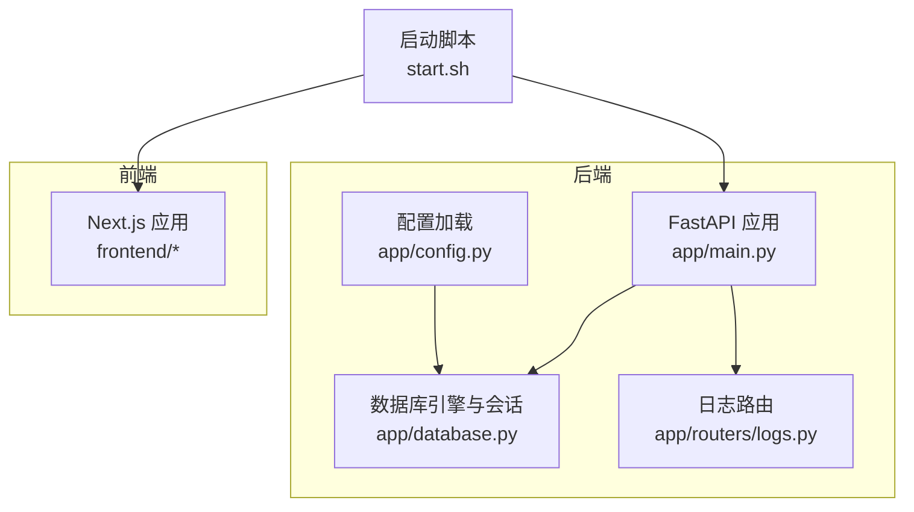
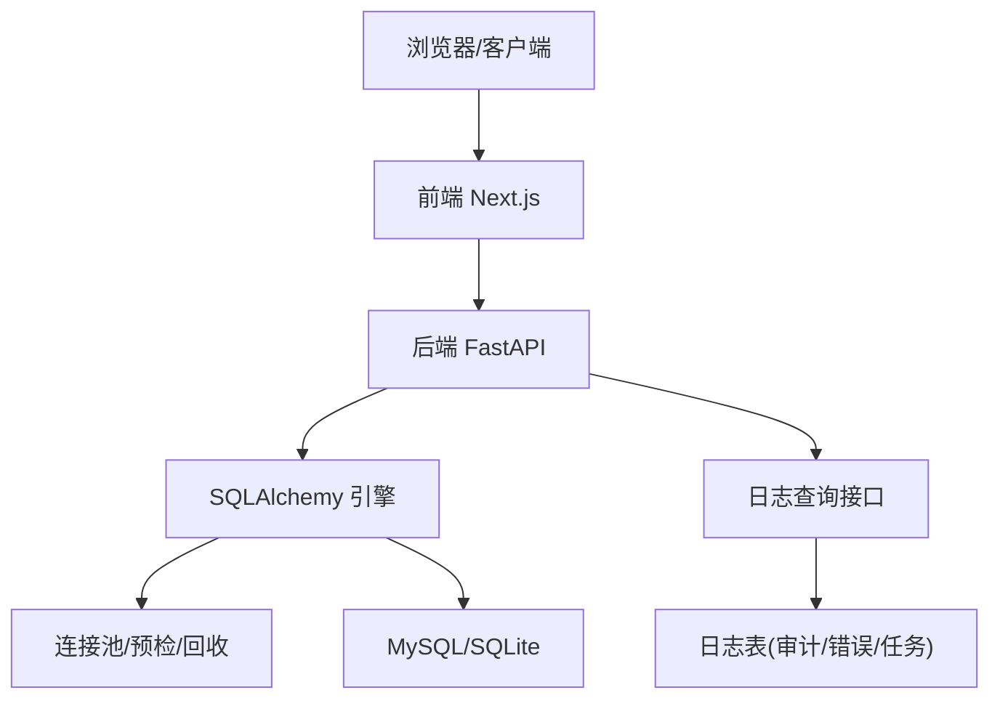
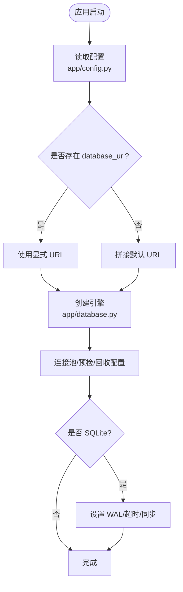
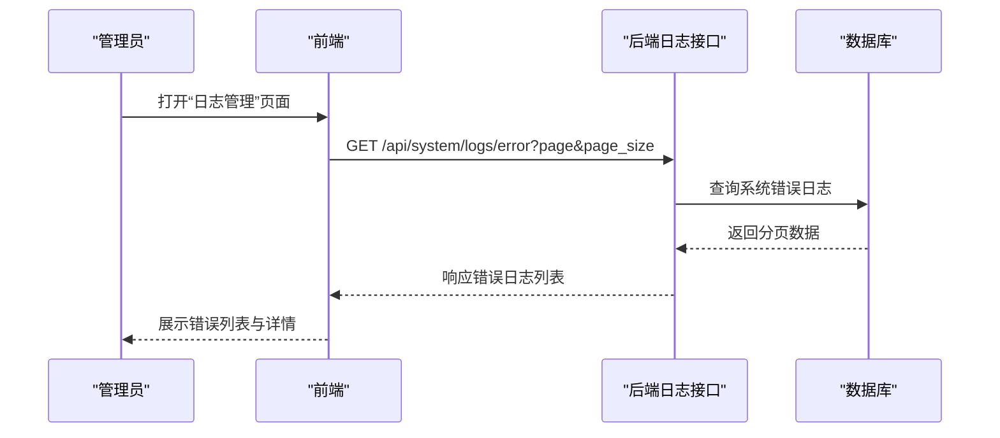
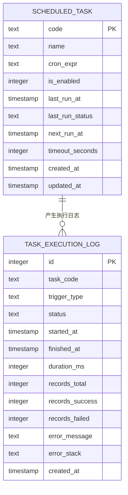
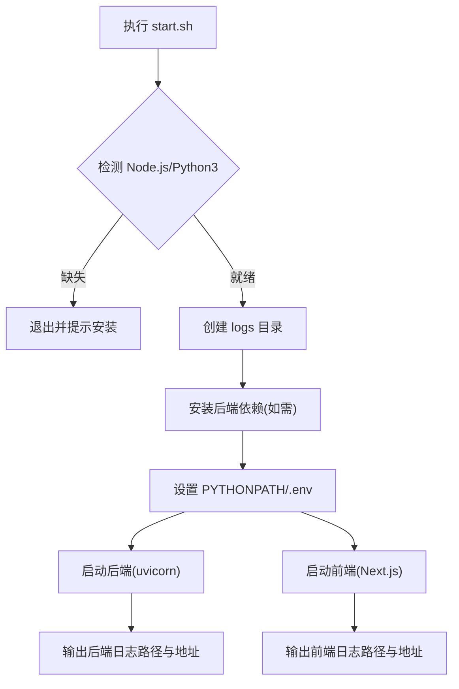
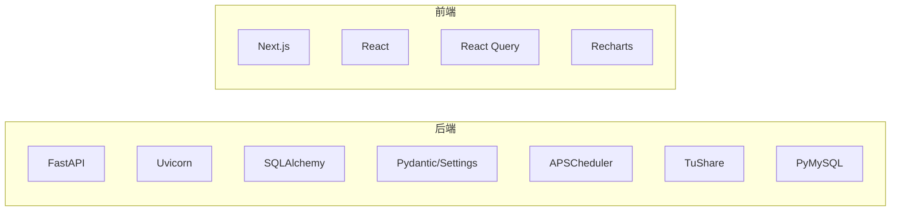
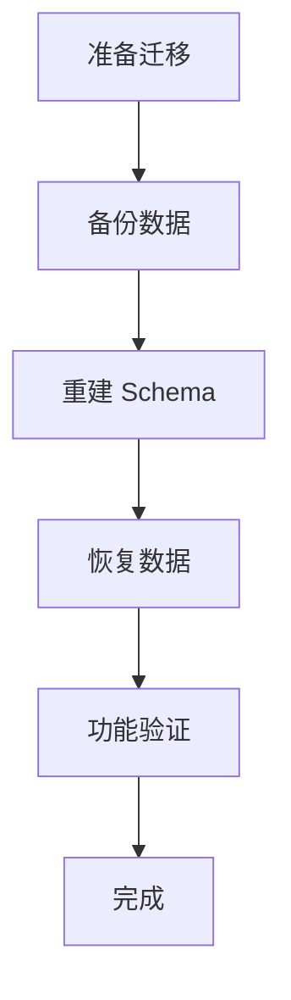

# 故障排除与维护

<cite>
**本文引用的文件**
- [backend/app/main.py](file://backend/app/main.py)
- [backend/app/config.py](file://backend/app/config.py)
- [backend/app/database.py](file://backend/app/database.py)
- [backend/app/routers/logs.py](file://backend/app/routers/logs.py)
- [backend/app/models/system_error_log.py](file://backend/app/models/system_error_log.py)
- [backend/app/models/task_execution_log.py](file://backend/app/models/task_execution_log.py)
- [backend/requirements.txt](file://backend/requirements.txt)
- [check_db.py](file://check_db.py)
- [start.sh](file://start.sh)
- [Docs/07-日志系统设计.md](file://Docs/07-日志系统设计.md)
- [backend/migrate_db.py](file://backend/migrate_db.py)
</cite>

## 目录
1. [简介](#简介)
2. [项目结构](#项目结构)
3. [核心组件](#核心组件)
4. [架构总览](#架构总览)
5. [详细组件分析](#详细组件分析)
6. [依赖分析](#依赖分析)
7. [性能考虑](#性能考虑)
8. [故障排除指南](#故障排除指南)
9. [结论](#结论)
10. [附录](#附录)

## 简介
本文件面向运维与系统管理员，提供 InvestRing 的完整故障排除与维护手册。内容覆盖数据库连接问题、API 调用错误、前端加载失败等常见问题的定位与解决；系统监控指标、健康检查与性能诊断方法；数据库维护、备份与恢复流程；系统重启、服务更新与配置变更步骤；以及故障排查工具、日志分析与问题定位方法。同时给出紧急响应流程、数据恢复策略与灾难恢复建议。

## 项目结构
InvestRing 采用前后端分离架构：后端基于 FastAPI + SQLAlchemy，前端基于 Next.js。系统通过一键启动脚本统一拉起后端与前端服务，并将日志输出到本地 logs 目录。

图表来源
- [backend/app/main.py:1-53](file://backend/app/main.py#L1-L53)
- [backend/app/config.py:1-37](file://backend/app/config.py#L1-L37)
- [backend/app/database.py:1-39](file://backend/app/database.py#L1-L39)
- [backend/app/routers/logs.py:1-56](file://backend/app/routers/logs.py#L1-L56)
- [start.sh:1-93](file://start.sh#L1-L93)

章节来源
- [backend/app/main.py:1-53](file://backend/app/main.py#L1-L53)
- [start.sh:1-93](file://start.sh#L1-L93)

## 核心组件
- 应用入口与路由注册：后端应用在启动时创建数据库表、初始化定时任务，并注册认证、投资人、组合、产品、平台、交易日历、市场数据、订阅、交易、份额变动事件、持仓、日志、任务、通知、快照等路由。
- 配置与数据库：配置类负责读取 .env 环境变量并生成数据库连接 URL；数据库引擎启用连接池、pre_ping、recycle，并对 SQLite 配置 WAL 模式与超时参数。
- 日志与监控：系统内置登录日志、审计日志、任务执行日志、净值同步明细、系统错误日志、通知等表，配套后端日志查询接口与前端日志管理页面。
- 启动与依赖：启动脚本自动安装后端依赖（若缺失）、设置 PYTHONPATH、加载 .env、启动 uvicorn 与前端开发服务器，并输出日志文件位置。

章节来源
- [backend/app/main.py:1-53](file://backend/app/main.py#L1-L53)
- [backend/app/config.py:1-37](file://backend/app/config.py#L1-L37)
- [backend/app/database.py:1-39](file://backend/app/database.py#L1-L39)
- [Docs/07-日志系统设计.md:1-511](file://Docs/07-日志系统设计.md#L1-L511)
- [start.sh:1-93](file://start.sh#L1-L93)

## 架构总览
后端通过 Uvicorn 承载 FastAPI 服务，前端通过 Next.js 提供管理与展示界面。数据库层由 SQLAlchemy 引擎与会话管理，配合 Alembic 进行迁移。日志系统通过专用表与 API 支撑审计与排障。

图表来源
- [backend/app/main.py:17-48](file://backend/app/main.py#L17-L48)
- [backend/app/database.py:8-16](file://backend/app/database.py#L8-L16)
- [backend/app/routers/logs.py:25-55](file://backend/app/routers/logs.py#L25-L55)
- [Docs/07-日志系统设计.md:33-225](file://Docs/07-日志系统设计.md#L33-L225)

## 详细组件分析

### 数据库连接与池化
- 连接池参数：池大小、溢出数量、pre_ping、recycle 等，有助于在高并发下保持连接可用性与稳定性。
- SQLite 特殊配置：WAL 模式、busy_timeout、synchronous 等，提升并发读写能力与可靠性。
- 连接 URL 生成：若未显式提供 database_url，则根据 db_host/db_port/db_user/db_password/db_name 自动拼接。

图表来源
- [backend/app/config.py:30-31](file://backend/app/config.py#L30-L31)
- [backend/app/database.py:8-26](file://backend/app/database.py#L8-L26)

章节来源
- [backend/app/config.py:1-37](file://backend/app/config.py#L1-L37)
- [backend/app/database.py:1-39](file://backend/app/database.py#L1-L39)

### 日志系统与审计
- 日志类型：登录日志、操作审计日志、任务执行日志、净值同步明细、系统错误日志、通知等。
- 后端接口：提供登录日志、审计日志、系统错误日志的分页查询接口，供管理员查看。
- 前端页面：提供日志管理与任务管理页面，支持筛选与查看详情。
- 错误日志模型：记录错误类型、错误码、错误信息、请求路径、方法、参数、用户、IP 等，便于回溯。

图表来源
- [backend/app/routers/logs.py:47-55](file://backend/app/routers/logs.py#L47-L55)
- [backend/app/models/system_error_log.py:5-18](file://backend/app/models/system_error_log.py#L5-L18)
- [Docs/07-日志系统设计.md:229-307](file://Docs/07-日志系统设计.md#L229-L307)

章节来源
- [backend/app/routers/logs.py:1-56](file://backend/app/routers/logs.py#L1-L56)
- [backend/app/models/system_error_log.py:1-19](file://backend/app/models/system_error_log.py#L1-L19)
- [Docs/07-日志系统设计.md:1-511](file://Docs/07-日志系统设计.md#L1-L511)

### 任务执行与日志
- 任务表：存储任务代码、名称、cron 表达式、启用状态、最近/下次执行时间、超时等。
- 任务执行日志：记录任务执行开始/结束时间、时长、总/成功/失败记录数、错误信息与堆栈。
- 前端任务管理：支持查看任务列表、手动触发、启用/禁用任务及查看执行历史。

图表来源
- [Docs/07-日志系统设计.md:99-146](file://Docs/07-日志系统设计.md#L99-L146)
- [backend/app/models/task_execution_log.py:5-20](file://backend/app/models/task_execution_log.py#L5-L20)

章节来源
- [Docs/07-日志系统设计.md:99-146](file://Docs/07-日志系统设计.md#L99-L146)
- [backend/app/models/task_execution_log.py:1-21](file://backend/app/models/task_execution_log.py#L1-L21)

### 启动与服务管理
- 启动脚本：检查 Node.js 与 Python3，创建日志目录，安装后端依赖（若缺失），设置 PYTHONPATH，加载 .env，启动后端（uvicorn）与前端（Next.js），输出 PID 与日志路径。
- 健康检查：可通过访问根路径返回消息进行基础可用性验证；也可结合日志接口与任务执行状态进行更深入检查。

图表来源
- [start.sh:7-77](file://start.sh#L7-L77)

章节来源
- [start.sh:1-93](file://start.sh#L1-L93)

## 依赖分析
- 后端依赖：FastAPI、Uvicorn、SQLAlchemy、Pydantic/Settings、JWE、Passlib、HTTPX、APSCheduler、Pandas/Numpy、dateutil、Alembic、Pytest、TuShare、PyMySQL 等。
- 前端依赖：Next.js、React 生态、TanStack React Query、Recharts、Radix UI、Axios 等。

图表来源
- [backend/requirements.txt:1-19](file://backend/requirements.txt#L1-L19)

章节来源
- [backend/requirements.txt:1-19](file://backend/requirements.txt#L1-L19)

## 性能考虑
- 连接池与回收：合理设置池大小与回收时间，避免连接泄漏与过期连接导致的慢查询。
- 预检与重连：开启 pre_ping，降低因网络波动或连接空闲导致的失败。
- SQLite 并发：WAL 模式提升并发读写，但注意串行执行任务以避免写入冲突。
- 任务调度：单线程执行器串行执行任务，避免 SQLite 并发写入竞争；通过错峰调度减少高峰期压力。
- 前端缓存与懒加载：利用 React Query 缓存与 Next.js 路由懒加载优化首屏与交互性能。

## 故障排除指南

### 一、数据库连接问题
- 症状
  - 启动时报数据库连接失败、无法创建表、查询报错。
- 诊断步骤
  - 检查 .env 中数据库配置项（主机、端口、用户名、密码、库名）是否正确。
  - 使用数据库命令行或客户端验证连接可用性。
  - 查看后端日志（logs/backend.log）确认连接 URL 与错误堆栈。
  - 使用检查脚本验证表存在与基本查询是否正常。
- 解决方案
  - 修正 .env 或环境变量；确保数据库服务运行且防火墙放行。
  - 如使用 SQLite，确认文件权限与磁盘空间充足。
  - 调整连接池参数（pool_size、max_overflow、pool_recycle）以适配负载。
  - 对于 SQLite，确认 WAL 模式与超时设置生效。

章节来源
- [backend/app/config.py:7-12](file://backend/app/config.py#L7-L12)
- [backend/app/database.py:8-16](file://backend/app/database.py#L8-L16)
- [check_db.py:14-34](file://check_db.py#L14-L34)
- [start.sh:37-50](file://start.sh#L37-L50)

### 二、API 调用错误
- 症状
  - 前端请求 5xx、422、401/403，接口返回异常或超时。
- 诊断步骤
  - 查看后端日志（logs/backend.log）定位异常堆栈与请求上下文。
  - 使用 /api/system/logs/error 接口检索系统错误日志，核对错误类型、请求路径、参数与用户。
  - 检查任务执行日志（/api/system/tasks/executions）确认相关任务是否异常。
  - 核对认证头与权限，确保管理员令牌有效。
- 解决方案
  - 修复后端异常逻辑，补充错误处理与日志记录。
  - 重新触发失败任务或手动执行修复流程。
  - 调整超时与重试策略，必要时扩容后端实例。

章节来源
- [backend/app/routers/logs.py:47-55](file://backend/app/routers/logs.py#L47-L55)
- [backend/app/models/system_error_log.py:5-18](file://backend/app/models/system_error_log.py#L5-L18)
- [Docs/07-日志系统设计.md:267-286](file://Docs/07-日志系统设计.md#L267-L286)

### 三、前端加载失败
- 症状
  - 页面白屏、资源 404、样式错乱、交互无响应。
- 诊断步骤
  - 检查前端日志（logs/frontend.log）与浏览器开发者工具 Network/Console。
  - 确认后端服务已启动且可达（/docs 可访问）。
  - 核对静态资源构建产物与 CDN 配置（如使用）。
- 解决方案
  - 重新安装依赖并构建前端（npm ci/install/build）。
  - 确保后端代理或跨域配置正确（CORS 已开启）。
  - 清理浏览器缓存或强制刷新。

章节来源
- [start.sh:66-77](file://start.sh#L66-L77)
- [backend/app/main.py:24-30](file://backend/app/main.py#L24-L30)

### 四、系统监控指标与健康检查
- 指标建议
  - 后端：请求速率、错误率、P95/P99 延迟、连接池使用率、任务执行成功率与时长。
  - 数据库：连接数、锁等待、慢查询、事务回滚率。
  - 前端：首屏时间、交互延迟、错误上报。
- 健康检查
  - GET / 根路径返回消息，验证服务存活。
  - GET /api/system/logs/error 查询近期错误，辅助判断健康状况。
  - 检查任务执行日志，确认关键任务（净值同步、日历同步、日志清理）按时完成。

章节来源
- [backend/app/main.py:50-52](file://backend/app/main.py#L50-L52)
- [backend/app/routers/logs.py:47-55](file://backend/app/routers/logs.py#L47-L55)
- [Docs/07-日志系统设计.md:117-121](file://Docs/07-日志系统设计.md#L117-L121)

### 五、性能诊断方法
- 后端
  - 使用 Uvicorn 的 access log 与自定义日志记录关键路径耗时。
  - 分析数据库慢查询与锁等待，优化索引与 SQL。
  - 调整连接池与回收策略，避免连接抖动。
- 前端
  - 利用 React DevTools 与 Lighthouse 分析渲染与网络瓶颈。
  - 通过 React Query Devtools 观察缓存命中与重请求。

章节来源
- [backend/app/database.py:11-16](file://backend/app/database.py#L11-L16)
- [Docs/07-日志系统设计.md:353-396](file://Docs/07-日志系统设计.md#L353-L396)

### 六、数据库维护、备份与恢复
- 维护
  - 定期检查连接池与慢查询，清理过期日志（登录、审计、任务、净值明细、系统错误、通知）。
  - 使用 Alembic 管理迁移，确保 schema 一致性。
- 备份
  - 使用迁移脚本提供的备份函数导出关键数据（投资人、交易日历）。
- 恢复
  - 重建 schema 后导入备份数据，保证数据完整性。
- 注意事项
  - 执行迁移前务必备份数据库。
  - 恢复后验证关键功能（登录、净值同步、任务执行）。

图表来源
- [backend/migrate_db.py:10-59](file://backend/migrate_db.py#L10-L59)
- [Docs/07-日志系统设计.md:430-449](file://Docs/07-日志系统设计.md#L430-L449)

章节来源
- [backend/migrate_db.py:1-64](file://backend/migrate_db.py#L1-L64)
- [Docs/07-日志系统设计.md:430-449](file://Docs/07-日志系统设计.md#L430-L449)

### 七、系统重启、服务更新与配置变更
- 重启
  - 使用启动脚本一键停止并重启后端与前端服务。
  - 重启后检查日志与健康检查接口。
- 更新
  - 后端：更新 requirements.txt 后重新安装依赖，重启服务。
  - 前端：更新 package.json 后重新安装依赖并构建。
- 配置变更
  - 修改 .env 中数据库、安全、TuShare 等配置后，重启服务使新配置生效。
  - 变更后验证数据库连接、任务调度与日志记录。

章节来源
- [start.sh:1-93](file://start.sh#L1-L93)
- [backend/requirements.txt:1-19](file://backend/requirements.txt#L1-L19)
- [backend/app/config.py:25-31](file://backend/app/config.py#L25-L31)

### 八、故障排查工具与日志分析
- 工具
  - 后端日志：logs/backend.log；前端日志：logs/frontend.log。
  - 检查脚本：check_db.py 用于快速验证表与数据。
  - API：/api/system/logs/error、/api/system/tasks/executions。
- 分析方法
  - 以时间轴定位异常发生点，结合错误日志与任务执行日志交叉验证。
  - 对比正常与异常时间段的日志量与错误类型分布。

章节来源
- [check_db.py:14-34](file://check_db.py#L14-L34)
- [backend/app/routers/logs.py:47-55](file://backend/app/routers/logs.py#L47-L55)

### 九、紧急响应流程
- 识别与分级
  - 区分服务不可用、大量错误、数据异常、性能严重下降等场景。
- 临时处置
  - 降级非关键任务、限制并发、回滚最近变更。
- 恢复与验证
  - 修复后端异常、恢复数据库连接、重启服务并验证关键接口。
- 文档化
  - 记录事件、根因、处置与改进措施，更新应急预案。

### 十、数据恢复策略与灾难恢复
- 策略
  - 定期备份关键数据与 schema，保留至少 7 天增量日志。
  - 建立最小恢复时间（RTO）与恢复点目标（RPO）。
- 方案
  - 快速恢复：优先恢复核心表与关键数据，保障登录与净值同步。
  - 完整恢复：在安全窗口内重建 schema 并导入全量备份。
- 验证
  - 恢复后执行端到端测试，确保数据一致性与业务流程可用。

章节来源
- [backend/migrate_db.py:10-59](file://backend/migrate_db.py#L10-L59)
- [Docs/07-日志系统设计.md:430-449](file://Docs/07-日志系统设计.md#L430-L449)

## 结论
本维护文档提供了从日常运维到紧急响应的全流程指导。通过规范化的配置管理、完善的日志体系、定期的备份与演练，以及清晰的故障排查流程，可显著降低系统风险并缩短故障恢复时间。建议将本文作为标准作业程序（SOP）纳入团队知识库，并持续根据实际运行情况进行迭代完善。

## 附录
- 常用命令与路径
  - 启动：./start.sh
  - 后端日志：logs/backend.log
  - 前端日志：logs/frontend.log
  - 数据库检查：python check_db.py
  - 依赖安装：pip3 install -r backend/requirements.txt -t backend/deps
- 关键接口
  - GET /api/system/logs/error
  - GET /api/system/tasks/executions
  - POST /api/system/tasks/{code}/run
  - POST /api/system/tasks/{code}/enable/disable