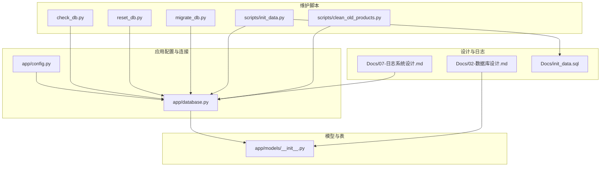
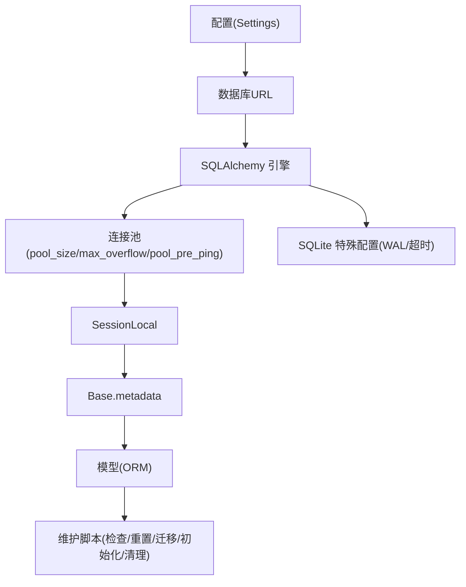
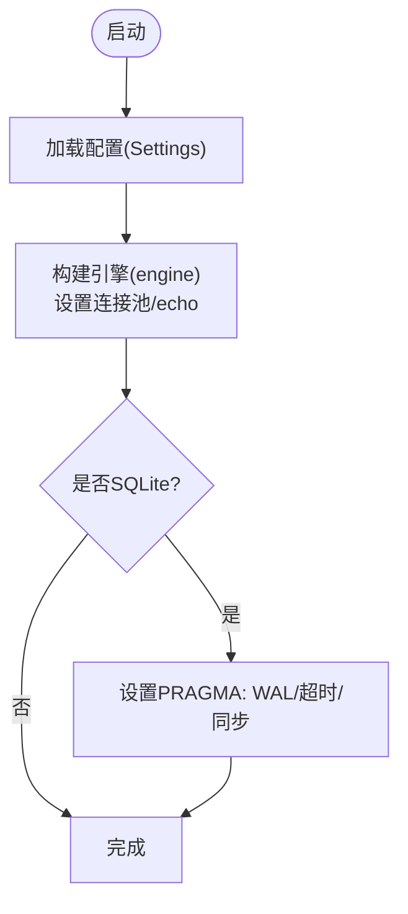
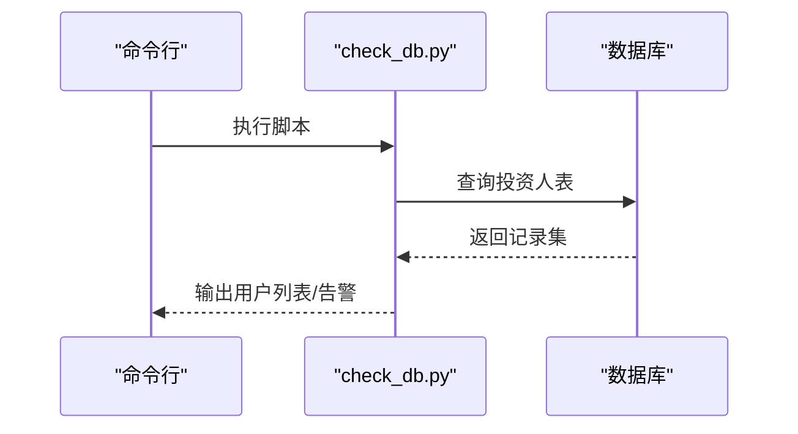
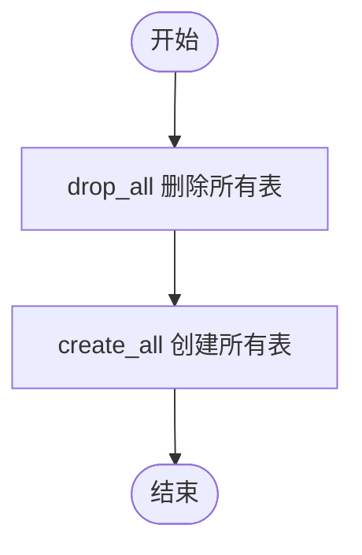
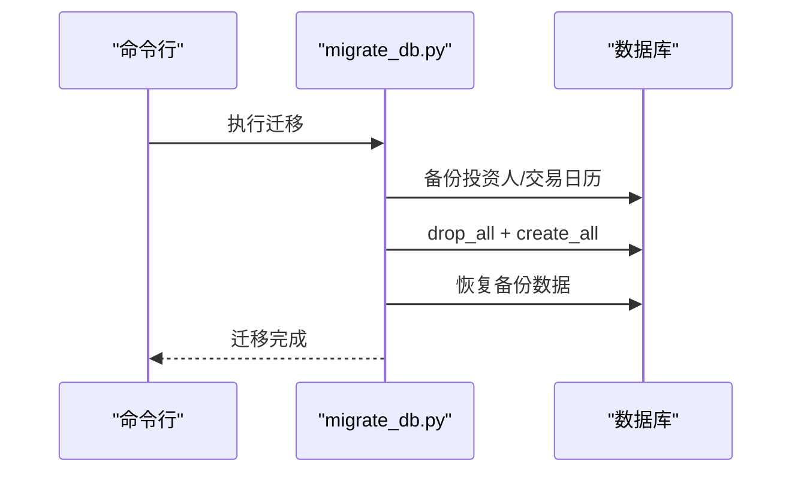
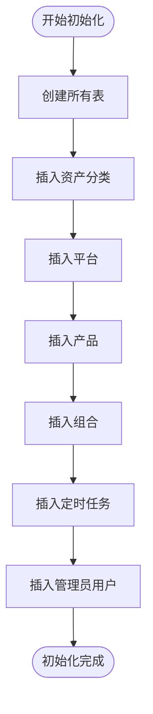
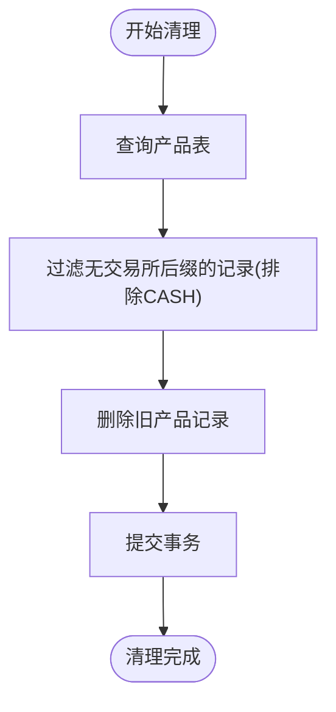
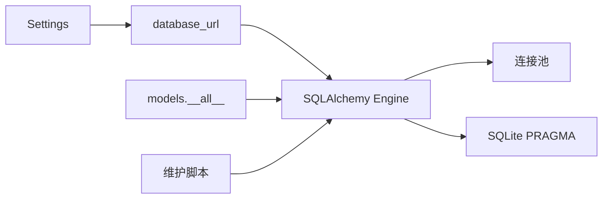
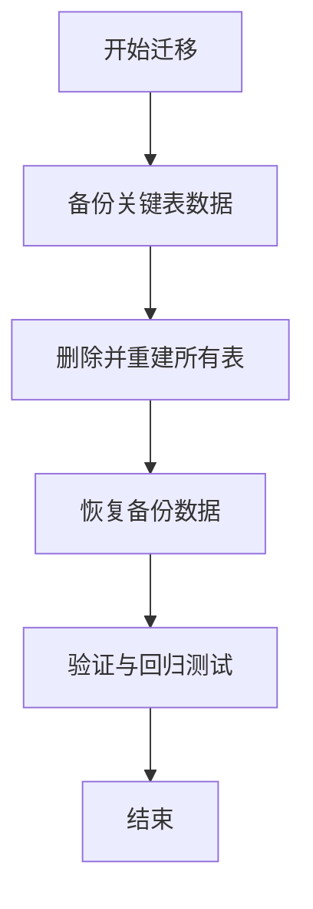

# 数据库维护

<cite>
**本文引用的文件**
- [backend/app/database.py](file://backend/app/database.py)
- [backend/app/config.py](file://backend/app/config.py)
- [backend/app/models/__init__.py](file://backend/app/models/__init__.py)
- [backend/check_db.py](file://backend/check_db.py)
- [backend/reset_db.py](file://backend/reset_db.py)
- [backend/migrate_db.py](file://backend/migrate_db.py)
- [backend/scripts/init_data.py](file://backend/scripts/init_data.py)
- [backend/scripts/clean_old_products.py](file://backend/scripts/clean_old_products.py)
- [Docs/02-数据库设计.md](file://Docs/02-数据库设计.md)
- [Docs/init_data.sql](file://Docs/init_data.sql)
- [Docs/07-日志系统设计.md](file://Docs/07-日志系统设计.md)
</cite>

## 目录
1. [简介](#简介)
2. [项目结构](#项目结构)
3. [核心组件](#核心组件)
4. [架构总览](#架构总览)
5. [详细组件分析](#详细组件分析)
6. [依赖分析](#依赖分析)
7. [性能考虑](#性能考虑)
8. [故障排查指南](#故障排查指南)
9. [结论](#结论)
10. [附录](#附录)

## 简介
本文件面向 InvestRing 项目的数据库运维人员与开发者，系统化梳理数据库的日常维护、迁移与版本升级、重置与初始化、数据恢复、性能优化、监控与容量规划、一致性检查与修复等全流程实践。文档基于仓库中的数据库配置、模型定义、初始化脚本与维护脚本进行归纳总结，并提供可视化图示帮助理解。

## 项目结构
数据库相关的关键位置与职责如下：
- 应用配置与连接池：backend/app/config.py、backend/app/database.py
- ORM 模型聚合：backend/app/models/__init__.py
- 数据库健康检查：backend/check_db.py
- 数据库重置：backend/reset_db.py
- 数据库迁移与数据保护性迁移：backend/migrate_db.py
- 初始化与基础数据：backend/scripts/init_data.py、Docs/init_data.sql
- 数据清理：backend/scripts/clean_old_products.py
- 设计与索引、并发策略：Docs/02-数据库设计.md
- 日志系统与任务调度：Docs/07-日志系统设计.md



**图表来源**
- [backend/app/config.py:1-37](file://backend/app/config.py#L1-L37)
- [backend/app/database.py:1-39](file://backend/app/database.py#L1-L39)
- [backend/app/models/__init__.py:1-46](file://backend/app/models/__init__.py#L1-L46)
- [backend/check_db.py:1-35](file://backend/check_db.py#L1-L35)
- [backend/reset_db.py:1-30](file://backend/reset_db.py#L1-L30)
- [backend/migrate_db.py:1-65](file://backend/migrate_db.py#L1-L65)
- [backend/scripts/init_data.py:1-393](file://backend/scripts/init_data.py#L1-L393)
- [backend/scripts/clean_old_products.py:1-35](file://backend/scripts/clean_old_products.py#L1-L35)
- [Docs/02-数据库设计.md:1-882](file://Docs/02-数据库设计.md#L1-L882)
- [Docs/init_data.sql:1-284](file://Docs/init_data.sql#L1-L284)
- [Docs/07-日志系统设计.md:159-511](file://Docs/07-日志系统设计.md#L159-L511)

**章节来源**
- [backend/app/config.py:1-37](file://backend/app/config.py#L1-L37)
- [backend/app/database.py:1-39](file://backend/app/database.py#L1-L39)
- [backend/app/models/__init__.py:1-46](file://backend/app/models/__init__.py#L1-L46)
- [Docs/02-数据库设计.md:1-882](file://Docs/02-数据库设计.md#L1-L882)

## 核心组件
- 数据库引擎与连接池：通过配置加载数据库 URL，设置连接池大小、溢出、预 ping、回收时间等参数；针对 SQLite 提供 WAL 模式与超时配置。
- ORM 模型聚合：集中导出全部业务模型，便于迁移、初始化与重置时统一创建/删除。
- 维护脚本：
  - 健康检查：验证表存在与基础数据读取。
  - 重置：删除并重建所有表。
  - 迁移：备份关键表数据，重建表结构，恢复数据。
  - 初始化：创建表并插入基础数据（资产分类、平台、产品、组合、任务、管理员）。
  - 清理：清理历史遗留无交易所后缀的产品数据。
- 设计文档：索引、外键约束、并发策略、日志系统与任务表。

**章节来源**
- [backend/app/database.py:1-39](file://backend/app/database.py#L1-L39)
- [backend/app/models/__init__.py:1-46](file://backend/app/models/__init__.py#L1-L46)
- [backend/check_db.py:1-35](file://backend/check_db.py#L1-L35)
- [backend/reset_db.py:1-30](file://backend/reset_db.py#L1-L30)
- [backend/migrate_db.py:1-65](file://backend/migrate_db.py#L1-L65)
- [backend/scripts/init_data.py:1-393](file://backend/scripts/init_data.py#L1-L393)
- [backend/scripts/clean_old_products.py:1-35](file://backend/scripts/clean_old_products.py#L1-L35)
- [Docs/02-数据库设计.md:563-596](file://Docs/02-数据库设计.md#L563-L596)
- [Docs/02-数据库设计.md:624-656](file://Docs/02-数据库设计.md#L624-L656)

## 架构总览
数据库层由“配置-连接池-ORM-脚本”构成，配合设计文档中的索引与并发策略，支撑业务模型的数据持久化与维护。



**图表来源**
- [backend/app/config.py:5-32](file://backend/app/config.py#L5-L32)
- [backend/app/database.py:7-26](file://backend/app/database.py#L7-L26)
- [backend/app/database.py:28-38](file://backend/app/database.py#L28-L38)
- [backend/app/models/__init__.py:23-45](file://backend/app/models/__init__.py#L23-L45)

## 详细组件分析

### 数据库连接与并发配置
- 连接池参数：pool_size、max_overflow、pool_pre_ping、pool_recycle 控制连接复用与回收。
- SQLite WAL：开启 WAL 模式、设置 busy_timeout、synchronous，提升读写并发与性能。
- 连接参数：SQLite 通过 connect_args 设置多线程访问兼容。



**图表来源**
- [backend/app/config.py:5-32](file://backend/app/config.py#L5-L32)
- [backend/app/database.py:7-26](file://backend/app/database.py#L7-L26)
- [backend/app/database.py:18-26](file://backend/app/database.py#L18-L26)

**章节来源**
- [backend/app/config.py:1-37](file://backend/app/config.py#L1-L37)
- [backend/app/database.py:1-39](file://backend/app/database.py#L1-L39)
- [Docs/02-数据库设计.md:624-647](file://Docs/02-数据库设计.md#L624-L647)

### 数据库健康检查
- 功能：连接数据库，查询投资人表，输出用户数量与基本信息，异常时打印错误与堆栈。
- 适用：验证数据库连通性、表存在性与基本数据完整性。



**图表来源**
- [backend/check_db.py:14-34](file://backend/check_db.py#L14-L34)

**章节来源**
- [backend/check_db.py:1-35](file://backend/check_db.py#L1-L35)

### 数据库重置
- 功能：删除所有表，再创建所有表，适合全新环境初始化或彻底清空后的重建。
- 注意：该操作不可逆，会丢失全部数据。



**图表来源**
- [backend/reset_db.py:22-28](file://backend/reset_db.py#L22-L28)

**章节来源**
- [backend/reset_db.py:1-30](file://backend/reset_db.py#L1-L30)

### 数据库迁移与数据保护性迁移
- 功能：备份关键表数据（如投资人、交易日历），重建表结构，恢复数据。
- 适用：Schema 变更时尽量保留核心业务数据，避免全量重导。



**图表来源**
- [backend/migrate_db.py:43-60](file://backend/migrate_db.py#L43-L60)

**章节来源**
- [backend/migrate_db.py:1-65](file://backend/migrate_db.py#L1-L65)

### 初始化与基础数据
- 功能：创建所有表，插入资产分类、平台、产品、组合、定时任务、管理员用户等基础数据。
- 适用：新环境首次部署或需要标准化初始数据时。



**图表来源**
- [backend/scripts/init_data.py:25-382](file://backend/scripts/init_data.py#L25-L382)
- [Docs/init_data.sql:1-284](file://Docs/init_data.sql#L1-L284)

**章节来源**
- [backend/scripts/init_data.py:1-393](file://backend/scripts/init_data.py#L1-L393)
- [Docs/init_data.sql:1-284](file://Docs/init_data.sql#L1-L284)

### 数据清理
- 功能：清理历史遗留无交易所后缀的产品记录，仅保留规范格式的产品代码。
- 适用：产品数据清洗、去重、规范化。



**图表来源**
- [backend/scripts/clean_old_products.py:15-30](file://backend/scripts/clean_old_products.py#L15-L30)

**章节来源**
- [backend/scripts/clean_old_products.py:1-35](file://backend/scripts/clean_old_products.py#L1-L35)

### 索引与外键约束
- 索引：覆盖查询热点字段（如组合、产品、状态、日期等），提升检索效率。
- 外键：采用 RESTRICT 策略，防止误删产生脏数据，业务层通过“停用/关闭”流程管理生命周期。

```mermaid
erDiagram
INVESTOR {
varchar code PK
varchar name
varchar role
varchar phone
varchar email
varchar password_hash
timestamp last_login_at
timestamp created_at
timestamp updated_at
}
PORTFOLIO {
varchar code PK
varchar name
text description
varchar status
timestamp started_at
timestamp closed_at
timestamp created_at
timestamp updated_at
}
PRODUCT {
varchar code
varchar market
varchar name
varchar product_type
varchar asset_class_code
integer confirm_days
boolean is_qdii
timestamp last_sync_at
text sync_error
timestamp created_at
timestamp updated_at
PK (code, market)
}
PORTFOLIO_POSITION {
integer id PK
varchar portfolio_code
varchar platform_code
varchar product_code
varchar market
decimal shares
decimal frozen_shares
decimal cost_price
decimal unit_price
decimal market_value
decimal amount
decimal frozen_amount
date snapshot_date
timestamp created_at
}
SUBSCRIPTION {
integer id PK
varchar portfolio_code
varchar investor_code
varchar sub_type
decimal amount
decimal shares
decimal unit_price
date apply_date
date confirm_date
varchar status
text notes
timestamp created_at
timestamp updated_at
}
TRADE {
integer id PK
varchar portfolio_code
varchar platform_code
varchar product_code
varchar market
varchar trade_type
decimal shares
decimal amount
decimal price
decimal fee
decimal actual_amount
date trade_date
date confirm_date
varchar status
text notes
timestamp created_at
timestamp updated_at
}
INVESTOR }o--|| PORTFOLIO : "持有"
PORTFOLIO }o--o| PRODUCT : "持仓"
PRODUCT ||--o{ PORTFOLIO_POSITION : "被持有"
PORTFOLIO ||--o{ SUBSCRIPTION : "发生"
PORTFOLIO ||--o{ TRADE : "发生"
```

**图表来源**
- [Docs/02-数据库设计.md:11-484](file://Docs/02-数据库设计.md#L11-L484)

**章节来源**
- [Docs/02-数据库设计.md:563-596](file://Docs/02-数据库设计.md#L563-L596)
- [Docs/02-数据库设计.md:599-621](file://Docs/02-数据库设计.md#L599-L621)

## 依赖分析
- 配置驱动连接：Settings 提供 database_url，决定连接后端与参数。
- 连接池与并发：engine 参数与 SQLite PRAGMA 影响并发与性能。
- 模型聚合：__all__ 导出全部模型，保证迁移/初始化/重置时的一致性。
- 维护脚本依赖：均通过 app.database.engine/Base/SessionLocal 与 SQLAlchemy 交互。



**图表来源**
- [backend/app/config.py:5-32](file://backend/app/config.py#L5-L32)
- [backend/app/database.py:7-26](file://backend/app/database.py#L7-L26)
- [backend/app/models/__init__.py:23-45](file://backend/app/models/__init__.py#L23-L45)

**章节来源**
- [backend/app/config.py:1-37](file://backend/app/config.py#L1-L37)
- [backend/app/database.py:1-39](file://backend/app/database.py#L1-L39)
- [backend/app/models/__init__.py:1-46](file://backend/app/models/__init__.py#L1-L46)

## 性能考虑
- 连接池与回收：合理设置 pool_size 与 pool_recycle，避免连接泄漏与资源枯竭。
- SQLite 并发：WAL 模式提升读写并发；busy_timeout 降低锁等待失败概率；synchronous 在性能与可靠性间折中。
- 索引优化：依据热点查询字段建立复合索引，减少全表扫描。
- 任务并发：日志系统设计中强调串行执行与错峰调度，避免 SQLite 写入竞争。

**章节来源**
- [backend/app/database.py:7-26](file://backend/app/database.py#L7-L26)
- [Docs/02-数据库设计.md:624-656](file://Docs/02-数据库设计.md#L624-L656)
- [Docs/02-数据库设计.md:563-596](file://Docs/02-数据库设计.md#L563-L596)
- [Docs/07-日志系统设计.md:380-388](file://Docs/07-日志系统设计.md#L380-L388)

## 故障排查指南
- 连接失败：检查 Settings 中数据库地址、端口、账号、密码与 database_url 生成逻辑。
- SQLite 锁冲突：确认 WAL 模式已启用，适当提高 busy_timeout；避免大量导入时与其他任务并发。
- 表缺失：执行初始化脚本或重置脚本，确保 Base.metadata.create_all/bind/engine 生效。
- 迁移后数据丢失：优先使用保护性迁移脚本，备份关键表数据后再重建。
- 日志与任务异常：查看任务执行日志表与系统错误日志表，结合 Cron 配置与并发策略定位问题。

**章节来源**
- [backend/app/config.py:5-32](file://backend/app/config.py#L5-L32)
- [backend/app/database.py:18-26](file://backend/app/database.py#L18-L26)
- [backend/migrate_db.py:10-19](file://backend/migrate_db.py#L10-L19)
- [Docs/07-日志系统设计.md:159-179](file://Docs/07-日志系统设计.md#L159-L179)

## 结论
通过规范化的连接池配置、完善的索引与外键策略、标准化的初始化与清理脚本，以及保护性迁移流程，InvestRing 的数据库维护具备良好的可操作性与稳定性。建议在生产环境中严格遵循“备份优先、串行执行、错峰调度”的原则，并持续关注日志与任务执行情况以保障系统健康。

## 附录

### 日常维护操作清单
- 数据备份：定期导出关键业务表（如投资人、交易日历）为 JSON/SQL 备份文件。
- 数据库清理：清理历史遗留数据（如无交易所后缀的产品），保持数据规范。
- 索引与统计：结合查询日志评估索引效果，必要时新增或调整索引。
- 统计信息更新：根据数据库引擎特性定期更新统计信息（MySQL/PostgreSQL）。
- 迁移与升级：优先使用保护性迁移脚本，确保核心数据不丢失。
- 重置与初始化：新环境或重大变更后，使用初始化脚本快速恢复标准数据。
- 数据恢复：从备份文件恢复关键表数据，核对一致性后上线。

### 数据库迁移与版本升级流程（基于现有脚本）
- 步骤：
  1) 备份关键表数据（投资人、交易日历等）。
  2) 删除并重建所有表。
  3) 恢复备份数据。
  4) 验证数据完整性与业务功能。



**图表来源**
- [backend/migrate_db.py:43-60](file://backend/migrate_db.py#L43-L60)

**章节来源**
- [backend/migrate_db.py:1-65](file://backend/migrate_db.py#L1-L65)

### 数据库重置与初始化
- 重置：删除并重建所有表，适合全新环境或彻底清空。
- 初始化：创建表并插入基础数据（资产分类、平台、产品、组合、任务、管理员）。

**章节来源**
- [backend/reset_db.py:1-30](file://backend/reset_db.py#L1-L30)
- [backend/scripts/init_data.py:1-393](file://backend/scripts/init_data.py#L1-L393)
- [Docs/init_data.sql:1-284](file://Docs/init_data.sql#L1-L284)

### 数据恢复最佳实践
- 优先使用保护性迁移脚本进行结构升级与数据保留。
- 对关键表进行周期性增量备份，保留最近 N 天的快照。
- 恢复前先在测试环境验证数据一致性与业务逻辑。

**章节来源**
- [backend/migrate_db.py:10-19](file://backend/migrate_db.py#L10-L19)
- [backend/migrate_db.py:28-40](file://backend/migrate_db.py#L28-L40)

### 数据一致性检查与修复
- 建议依据设计文档中的外键约束与 RESTRICT 策略，先通过业务流程“停用/关闭”再删除，避免破坏关系完整性。
- 对于热点查询字段，结合索引与查询日志评估一致性与性能，必要时补充索引或调整查询。

**章节来源**
- [Docs/02-数据库设计.md:599-621](file://Docs/02-数据库设计.md#L599-L621)
- [Docs/02-数据库设计.md:563-596](file://Docs/02-数据库设计.md#L563-L596)