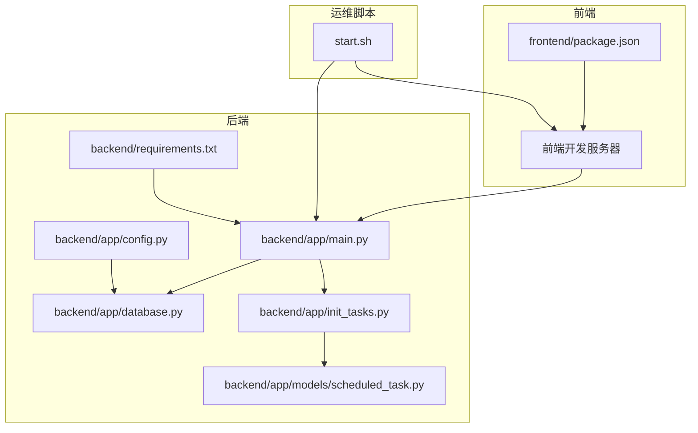
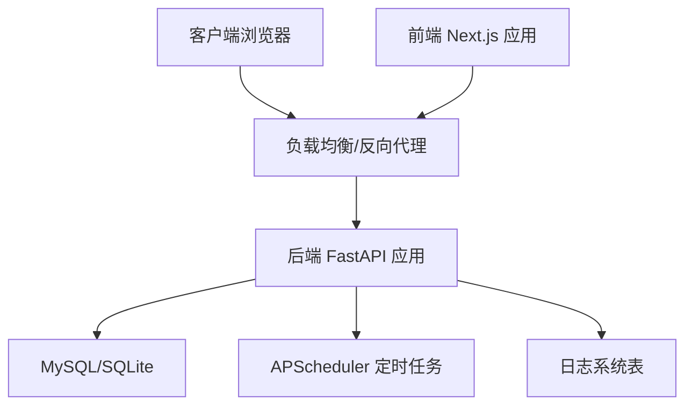
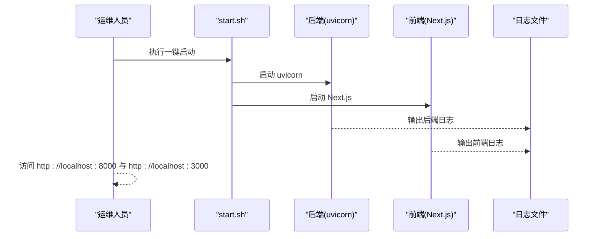
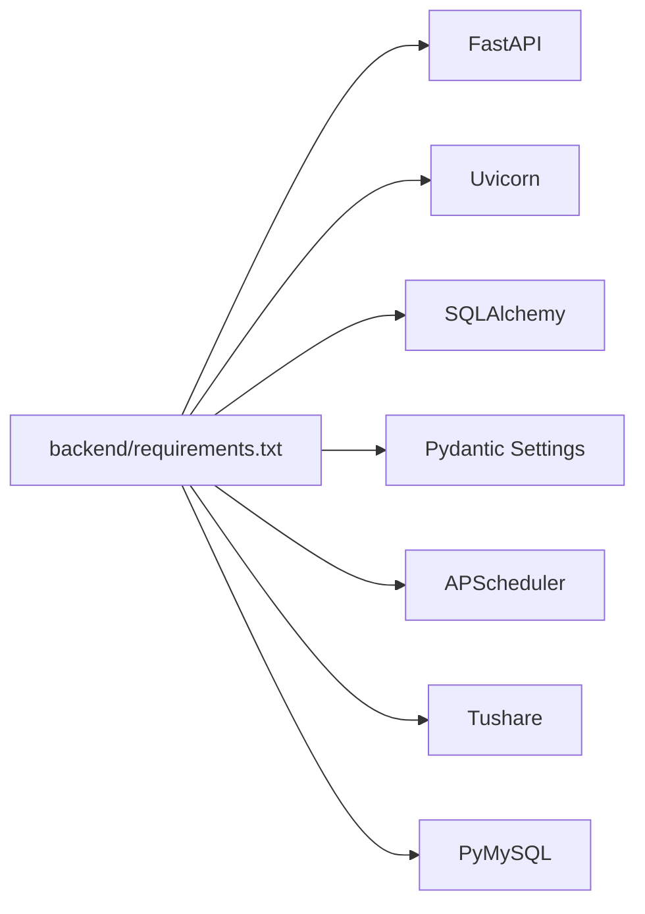

# 服务运维

<cite>
**本文引用的文件**
- [backend/app/main.py](file://backend/app/main.py)
- [backend/app/config.py](file://backend/app/config.py)
- [backend/app/database.py](file://backend/app/database.py)
- [backend/app/init_tasks.py](file://backend/app/init_tasks.py)
- [backend/app/models/scheduled_task.py](file://backend/app/models/scheduled_task.py)
- [backend/requirements.txt](file://backend/requirements.txt)
- [start.sh](file://start.sh)
- [Docs/00-开发总览.md](file://Docs/00-开发总览.md)
- [Docs/07-日志系统设计.md](file://Docs/07-日志系统设计.md)
- [Docs/02-数据库设计.md](file://Docs/02-数据库设计.md)
- [frontend/package.json](file://frontend/package.json)
</cite>

## 目录
1. [简介](#简介)
2. [项目结构](#项目结构)
3. [核心组件](#核心组件)
4. [架构总览](#架构总览)
5. [详细组件分析](#详细组件分析)
6. [依赖分析](#依赖分析)
7. [性能考虑](#性能考虑)
8. [故障排除指南](#故障排除指南)
9. [结论](#结论)
10. [附录](#附录)

## 简介
本运维文档面向 InvestRing 项目的后端服务与前端服务，覆盖服务启动、停止、重启与更新流程；配置文件管理与热更新机制；部署与容器化方案（Docker 与 Kubernetes）；监控与日志管理最佳实践；负载均衡与 SSL 证书配置；域名与反向代理；扩容与缩容；以及故障应急处理与恢复策略。文档基于仓库现有代码与文档进行梳理，确保可操作性与可追溯性。

## 项目结构
- 后端采用 FastAPI + SQLAlchemy，提供 REST API 与定时任务调度。
- 前端采用 Next.js 14，提供 PC 端与移动端页面。
- 一键启动脚本负责后端与前端的协同启动、日志输出与进程管理。
- 配置通过 pydantic-settings 从 .env 环境变量加载，支持数据库、安全与应用参数。
- 数据库连接池与 SQLite WAL 模式在运行时生效，保障并发与性能。

图表来源
- [backend/app/main.py:1-53](file://backend/app/main.py#L1-L53)
- [backend/app/config.py:1-37](file://backend/app/config.py#L1-L37)
- [backend/app/database.py:1-39](file://backend/app/database.py#L1-L39)
- [backend/app/init_tasks.py:1-45](file://backend/app/init_tasks.py#L1-L45)
- [backend/app/models/scheduled_task.py:1-19](file://backend/app/models/scheduled_task.py#L1-L19)
- [backend/requirements.txt:1-19](file://backend/requirements.txt#L1-L19)
- [start.sh:1-93](file://start.sh#L1-L93)
- [frontend/package.json:1-45](file://frontend/package.json#L1-L45)

章节来源
- [Docs/00-开发总览.md:16-51](file://Docs/00-开发总览.md#L16-L51)
- [start.sh:1-93](file://start.sh#L1-L93)

## 核心组件
- 应用入口与路由注册：后端主程序集中注册认证、投资人、组合、产品、平台、市场数据、订阅、交易、份额变动、持仓、日志、任务、通知与快照等模块路由，并配置跨域中间件。
- 配置管理：通过 Settings 类从 .env 加载数据库、安全与应用参数，支持动态拼接数据库 URL。
- 数据库与连接池：统一创建引擎、连接池参数与 SQLite WAL 模式配置，提供会话工厂与依赖注入。
- 定时任务初始化：在应用启动时确保核心任务记录存在，便于后续调度器管理。
- 前后端启动脚本：一键启动后端（uvicorn）与前端（Next.js），并输出日志与访问地址。

章节来源
- [backend/app/main.py:17-52](file://backend/app/main.py#L17-L52)
- [backend/app/config.py:5-36](file://backend/app/config.py#L5-L36)
- [backend/app/database.py:7-39](file://backend/app/database.py#L7-L39)
- [backend/app/init_tasks.py:5-44](file://backend/app/init_tasks.py#L5-L44)
- [start.sh:22-77](file://start.sh#L22-L77)

## 架构总览
后端服务基于 FastAPI，使用 SQLAlchemy 连接 MySQL 或 SQLite；前端通过 Next.js 提供 Web 界面；定时任务由 APScheduler 管理，确保任务串行执行与并发安全；日志系统支持登录、审计、任务、净值同步明细、系统错误等类型。

图表来源
- [backend/app/main.py:32-48](file://backend/app/main.py#L32-L48)
- [backend/app/database.py:7-16](file://backend/app/database.py#L7-L16)
- [Docs/07-日志系统设计.md:33-51](file://Docs/07-日志系统设计.md#L33-L51)
- [Docs/07-日志系统设计.md:353-395](file://Docs/07-日志系统设计.md#L353-L395)

## 详细组件分析

### 启动流程与进程管理
- 后端：通过 uvicorn 启动，监听 0.0.0.0:8000，日志重定向至 logs/backend.log。
- 前端：通过 Next.js 开发服务器启动，监听 0.0.0.0:3000，日志重定向至 logs/frontend.log。
- 一键脚本：自动安装依赖、设置 PYTHONPATH、加载 .env、启动前后端并等待进程。

图表来源
- [start.sh:22-77](file://start.sh#L22-L77)
- [backend/app/main.py:50-52](file://backend/app/main.py#L50-L52)

章节来源
- [start.sh:22-77](file://start.sh#L22-L77)

### 停止与重启流程
- 停止：Ctrl+C 终止前后端进程；或通过系统进程管理工具按 PID 结束。
- 重启：先停止，再执行一键启动脚本；或在容器环境中替换镜像后滚动重启。
- 更新：拉取新镜像或代码后，重启服务；如涉及数据库迁移，需在停机窗口内执行迁移脚本。

章节来源
- [start.sh:89-93](file://start.sh#L89-L93)

### 配置文件管理与热更新机制
- 配置来源：.env 文件，通过 pydantic-settings 的 Settings 类加载。
- 关键配置项：数据库主机/端口/用户/密码/库名、数据库 URL、密钥、Token 过期天数、Tushare Token、应用名称与调试开关。
- 热更新：当前实现未内置配置热加载；建议在容器编排中通过挂载卷或环境变量注入实现平滑更新，重启后生效。

章节来源
- [backend/app/config.py:5-36](file://backend/app/config.py#L5-L36)

### 数据库连接与并发
- 连接池：统一配置 pool_size、max_overflow、pool_pre_ping、pool_recycle。
- SQLite WAL：在连接建立时设置 journal_mode=WAL、busy_timeout、synchronous，提升读写并发与性能。
- 并发注意：定时任务采用单线程执行器，避免 SQLite 并发写入冲突。

章节来源
- [backend/app/database.py:7-26](file://backend/app/database.py#L7-L26)
- [Docs/02-数据库设计.md:624-656](file://Docs/02-数据库设计.md#L624-L656)
- [Docs/07-日志系统设计.md:353-395](file://Docs/07-日志系统设计.md#L353-L395)

### 定时任务初始化与调度
- 初始化：启动时确保 3 个核心任务记录存在（净值同步、交易日历同步、日志清理）。
- 调度：使用 APScheduler 单线程执行器，避免 SQLite 写入冲突；任务配置包含 Cron 表达式与描述。
- 并发控制：串行执行 + WAL 模式 + 错峰调度 + 手动触发排队。

章节来源
- [backend/app/init_tasks.py:5-44](file://backend/app/init_tasks.py#L5-L44)
- [backend/app/models/scheduled_task.py:5-18](file://backend/app/models/scheduled_task.py#L5-L18)
- [Docs/07-日志系统设计.md:353-395](file://Docs/07-日志系统设计.md#L353-L395)

### 日志系统与审计
- 日志类型：登录日志、操作审计日志、任务执行日志、净值同步明细、系统错误日志等。
- 表结构：包含登录日志、审计日志、计划任务、任务执行日志、净值同步明细、系统错误日志、通知等表。
- 建议：生产环境开启异步日志写入、日志轮转与集中采集（如 ELK/Fluentd）。

章节来源
- [Docs/07-日志系统设计.md:19-30](file://Docs/07-日志系统设计.md#L19-L30)
- [Docs/07-日志系统设计.md:33-51](file://Docs/07-日志系统设计.md#L33-L51)

### 前后端开发与构建
- 前端：Next.js 14，开发脚本 dev、build、start；生产环境可通过 next start。
- 后端：FastAPI + uvicorn，生产环境建议使用 ASGI 服务器（如 Uvicorn/Gunicorn）。

章节来源
- [frontend/package.json:5-9](file://frontend/package.json#L5-L9)
- [backend/requirements.txt:1-2](file://backend/requirements.txt#L1-L2)

## 依赖分析
- 后端依赖：FastAPI、Uvicorn、SQLAlchemy、Pydantic、Pydantic Settings、APScheduler、Tushare、PyMySQL 等。
- 前端依赖：Next.js、React、TailwindCSS、Zustand、React Query 等。
- 运维依赖：uvicorn（开发/生产）、Docker（容器化）、Kubernetes（编排）、Nginx/Ingress（反向代理与证书）。

图表来源
- [backend/requirements.txt:1-19](file://backend/requirements.txt#L1-L19)

章节来源
- [backend/requirements.txt:1-19](file://backend/requirements.txt#L1-L19)
- [frontend/package.json:11-39](file://frontend/package.json#L11-L39)

## 性能考虑
- 数据库：连接池参数与 SQLite WAL 模式已配置，建议结合实际 QPS 调整 pool_size 与 max_overflow。
- 定时任务：单线程执行器避免并发写入冲突，建议合理安排 Cron 时间，避免高峰叠加。
- 前端：生产环境使用 next build 与 next start，配合 CDN 与缓存策略。
- 网络：反向代理启用 Gzip/HTTP/2，合理设置超时与缓冲。

## 故障排除指南
- 启动失败
  - 检查 .env 是否正确，数据库连接参数是否可达。
  - 查看 logs/backend.log 与 logs/frontend.log。
  - 确认端口 8000/3000 未被占用。
- 数据库问题
  - 如使用 SQLite，确认 WAL 模式生效与 busy_timeout 合理。
  - 如使用 MySQL，检查连接池参数与字符集。
- 定时任务异常
  - 检查任务记录是否存在、是否启用、下次执行时间。
  - 查看任务执行日志与系统错误日志。
- 日志问题
  - 确认日志表存在且字段完整。
  - 生产环境启用日志轮转与集中采集。

章节来源
- [start.sh:19-20](file://start.sh#L19-L20)
- [backend/app/database.py:18-26](file://backend/app/database.py#L18-L26)
- [Docs/07-日志系统设计.md:33-51](file://Docs/07-日志系统设计.md#L33-L51)

## 结论
InvestRing 的运维体系围绕“一键启动、明确配置、数据库并发与定时任务串行”展开。通过合理的日志与监控、负载均衡与证书管理、容器化与编排，可实现稳定、可观测、可扩展的服务交付。建议在生产环境完善 CI/CD、蓝绿/滚动发布与自动扩缩容策略。

## 附录

### 服务启动、停止、重启与更新流程
- 启动
  - 执行一键脚本，自动安装依赖、加载 .env、启动后端与前端。
  - 访问 API 文档与前端页面，确认服务就绪。
- 停止
  - Ctrl+C 或通过进程管理终止前后端进程。
- 重启
  - 先停止，再执行一键脚本；或容器环境滚动重启。
- 更新
  - 拉取新镜像/代码后重启；如涉及数据库迁移，在维护窗口执行迁移脚本。

章节来源
- [start.sh:22-77](file://start.sh#L22-L77)
- [backend/app/main.py:50-52](file://backend/app/main.py#L50-L52)

### 配置文件管理与热更新
- 配置来源：.env，Settings 类加载。
- 热更新：当前未内置热加载；建议通过挂载卷/环境变量注入实现平滑更新，重启后生效。

章节来源
- [backend/app/config.py:5-36](file://backend/app/config.py#L5-L36)

### 部署与容器化方案
- Docker
  - 构建镜像：后端使用 Python 基础镜像，安装 requirements；前端使用 Node 基础镜像构建静态产物。
  - 运行：暴露 8000（后端）与 3000（前端），挂载 .env 与日志目录。
- Kubernetes
  - Deployment：后端与前端分别部署，使用 ConfigMap 管理 .env。
  - Service：ClusterIP/NodePort/LoadBalancer 暴露服务。
  - Ingress：配置 TLS 证书与域名路由。
  - PVC：持久化日志与 SQLite（如使用）。

章节来源
- [backend/requirements.txt:1-19](file://backend/requirements.txt#L1-L19)
- [frontend/package.json:5-9](file://frontend/package.json#L5-L9)
- [Docs/00-开发总览.md:16-33](file://Docs/00-开发总览.md#L16-L33)

### 监控与日志管理最佳实践
- 监控指标：CPU/内存/连接数/响应时间/错误率/任务执行时长。
- 日志：结构化日志、按天轮转、保留周期、集中采集与检索。
- 告警：阈值告警与异常检测，结合审计日志定位问题。

章节来源
- [Docs/07-日志系统设计.md:19-30](file://Docs/07-日志系统设计.md#L19-L30)

### 负载均衡、SSL 证书与域名配置
- 负载均衡：Nginx/HAProxy/云厂商 LB，健康检查与会话保持。
- SSL 证书：Let’s Encrypt 或企业证书，配置 HTTPS 与 HSTS。
- 域名：A/AAAA 记录指向 LB；Ingress/反向代理配置域名与路径转发。

章节来源
- [Docs/00-开发总览.md:16-33](file://Docs/00-开发总览.md#L16-L33)

### 扩容与缩容
- 水平扩容：增加后端 Pod 数量，确保数据库连接池上限与 WAL 模式。
- 自动扩缩容：HPA 基于 CPU/内存/自定义指标；KEDA 基于队列/事件。
- 缩容：优雅下线，等待请求处理完毕与连接释放。

章节来源
- [backend/app/database.py:12-16](file://backend/app/database.py#L12-L16)
- [Docs/07-日志系统设计.md:353-395](file://Docs/07-日志系统设计.md#L353-L395)

### 应急处理与恢复策略
- 应急流程：隔离问题实例、切换流量、回滚镜像、修复配置/数据库。
- 恢复策略：备份与恢复（数据库/配置/日志）、灾备演练、RTO/RPO 目标。
- 任务恢复：暂停异常任务、修复后重试或人工补跑。

章节来源
- [Docs/07-日志系统设计.md:33-51](file://Docs/07-日志系统设计.md#L33-L51)
- [backend/app/init_tasks.py:5-44](file://backend/app/init_tasks.py#L5-L44)