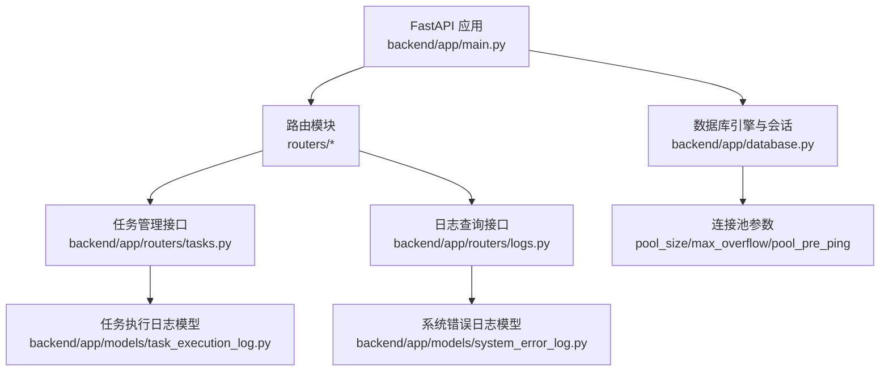
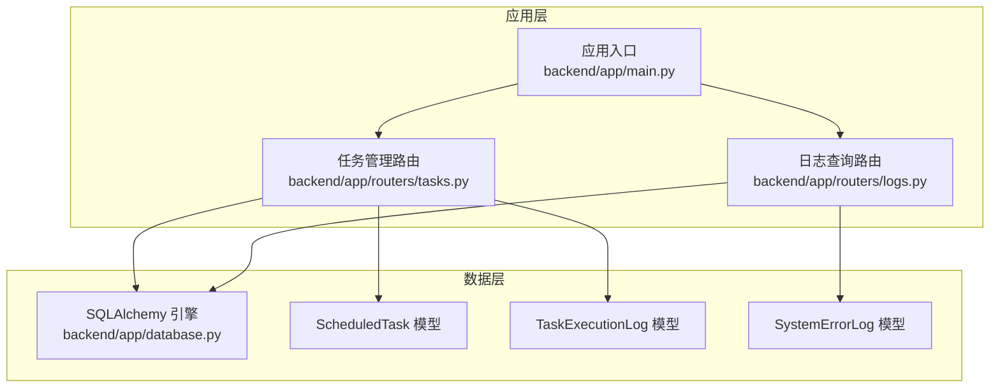
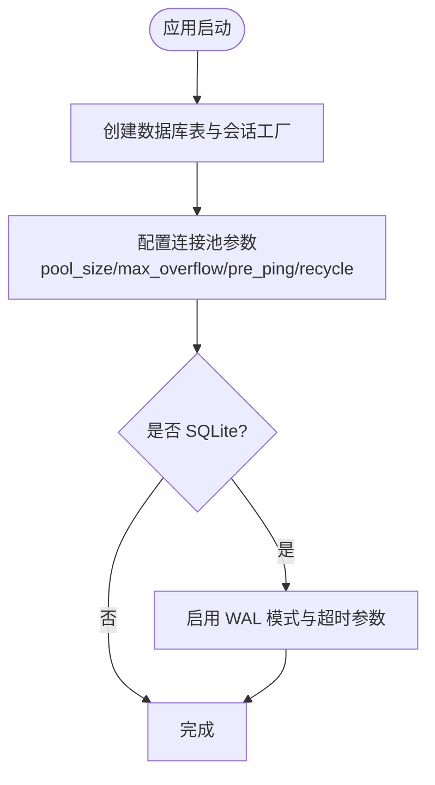
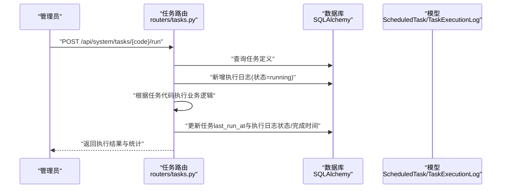
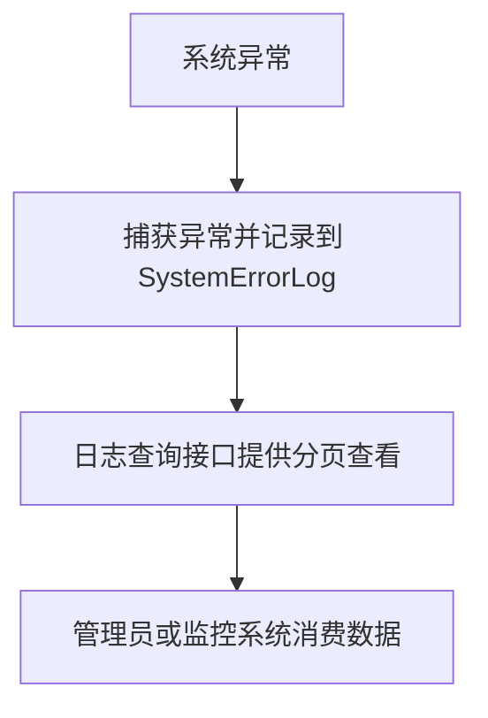
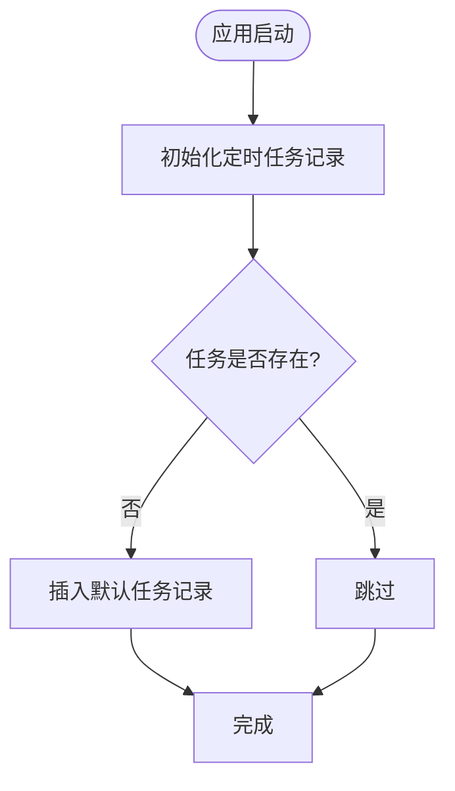
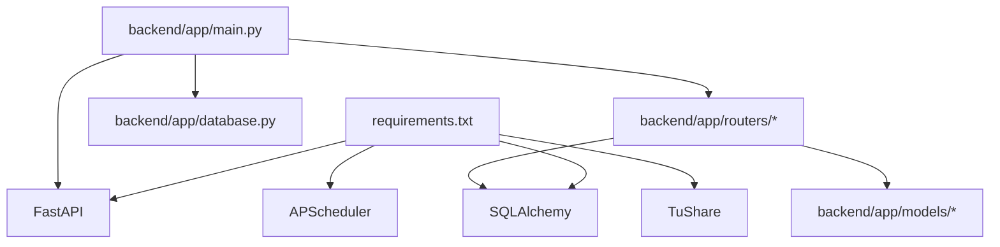

# 系统监控

<cite>
**本文引用的文件**
- [backend/app/main.py](file://backend/app/main.py)
- [backend/app/config.py](file://backend/app/config.py)
- [backend/app/database.py](file://backend/app/database.py)
- [backend/app/dependencies.py](file://backend/app/dependencies.py)
- [backend/app/init_tasks.py](file://backend/app/init_tasks.py)
- [backend/app/routers/tasks.py](file://backend/app/routers/tasks.py)
- [backend/app/routers/logs.py](file://backend/app/routers/logs.py)
- [backend/app/models/scheduled_task.py](file://backend/app/models/scheduled_task.py)
- [backend/app/models/task_execution_log.py](file://backend/app/models/task_execution_log.py)
- [backend/app/models/system_error_log.py](file://backend/app/models/system_error_log.py)
- [backend/requirements.txt](file://backend/requirements.txt)
</cite>

## 目录
1. [简介](#简介)
2. [项目结构](#项目结构)
3. [核心组件](#核心组件)
4. [架构总览](#架构总览)
5. [详细组件分析](#详细组件分析)
6. [依赖分析](#依赖分析)
7. [性能考虑](#性能考虑)
8. [故障排查指南](#故障排查指南)
9. [结论](#结论)
10. [附录](#附录)

## 简介
本文件为 InvestRing 项目的系统监控方案文档，聚焦于数据库连接状态、API 响应时间、任务执行情况、内存使用率等关键指标的监控与告警配置，并结合现有代码库中的日志与任务模型，给出健康检查接口的使用方法、监控数据的采集与分析路径、性能基准与压力测试建议，以及系统资源监控、应用性能监控与业务指标监控的实施方案。

## 项目结构
InvestRing 后端基于 FastAPI 构建，采用 SQLAlchemy 进行 ORM 映射与数据库访问，通过依赖注入与路由器模块化组织业务功能。监控相关的关键位置包括：
- 应用入口与路由注册：用于暴露健康检查与系统管理接口
- 数据库连接池配置：用于监控连接可用性与池状态
- 任务调度与执行日志：用于追踪任务运行状态与耗时
- 错误日志模型：用于统一记录系统异常信息
- 日志查询接口：用于集中查看登录、审计与系统错误日志

图表来源
- [backend/app/main.py:17-52](file://backend/app/main.py#L17-L52)
- [backend/app/database.py:8-16](file://backend/app/database.py#L8-L16)
- [backend/app/routers/tasks.py:16](file://backend/app/routers/tasks.py#L16)
- [backend/app/routers/logs.py:11](file://backend/app/routers/logs.py#L11)
- [backend/app/models/task_execution_log.py:5-21](file://backend/app/models/task_execution_log.py#L5-L21)
- [backend/app/models/system_error_log.py:5-19](file://backend/app/models/system_error_log.py#L5-L19)

章节来源
- [backend/app/main.py:17-52](file://backend/app/main.py#L17-L52)
- [backend/app/database.py:8-16](file://backend/app/database.py#L8-L16)
- [backend/app/routers/tasks.py:16](file://backend/app/routers/tasks.py#L16)
- [backend/app/routers/logs.py:11](file://backend/app/routers/logs.py#L11)

## 核心组件
- 数据库连接与池化
  - 使用 SQLAlchemy 引擎配置连接池大小、溢出、预检与回收策略，便于监控连接可用性与池状态
  - SQLite 专用 WAL 模式配置，提升并发与稳定性
- 任务调度与执行日志
  - 通过 ScheduledTask 与 TaskExecutionLog 记录任务定义、启用状态、最近运行时间与每次执行的开始/结束时间、耗时、成功/失败统计与错误信息
- 错误日志模型
  - 统一记录系统错误类型、消息、堆栈、请求上下文与 IP 等信息，支持按页查询与分页返回
- 日志查询接口
  - 提供登录日志、审计日志与系统错误日志的分页查询，便于集中监控与分析
- 应用配置
  - 通过 Settings 类加载环境变量，支持数据库连接串、调试开关等配置项

章节来源
- [backend/app/database.py:8-16](file://backend/app/database.py#L8-L16)
- [backend/app/database.py:19-26](file://backend/app/database.py#L19-L26)
- [backend/app/models/scheduled_task.py:5-19](file://backend/app/models/scheduled_task.py#L5-L19)
- [backend/app/models/task_execution_log.py:5-21](file://backend/app/models/task_execution_log.py#L5-L21)
- [backend/app/models/system_error_log.py:5-19](file://backend/app/models/system_error_log.py#L5-L19)
- [backend/app/routers/logs.py:25-55](file://backend/app/routers/logs.py#L25-L55)
- [backend/app/config.py:5-36](file://backend/app/config.py#L5-L36)

## 架构总览
下图展示监控相关的核心交互：应用启动时初始化数据库表与定时任务；任务管理接口负责手动触发与查询任务执行日志；日志查询接口提供系统错误与登录/审计日志的集中查看；数据库层通过连接池保障稳定与可观测性。

图表来源
- [backend/app/main.py:17-52](file://backend/app/main.py#L17-L52)
- [backend/app/routers/tasks.py:16](file://backend/app/routers/tasks.py#L16)
- [backend/app/routers/logs.py:11](file://backend/app/routers/logs.py#L11)
- [backend/app/database.py:8-16](file://backend/app/database.py#L8-L16)
- [backend/app/models/scheduled_task.py:5-19](file://backend/app/models/scheduled_task.py#L5-L19)
- [backend/app/models/task_execution_log.py:5-21](file://backend/app/models/task_execution_log.py#L5-L21)
- [backend/app/models/system_error_log.py:5-19](file://backend/app/models/system_error_log.py#L5-L19)

## 详细组件分析

### 数据库连接监控
- 连接池参数
  - pool_size：连接池大小
  - max_overflow：溢出连接数
  - pool_pre_ping：连接复用前进行健康检查
  - pool_recycle：连接回收周期
- SQLite 特定配置
  - WAL 模式、busy_timeout、synchronous 参数优化并发与可靠性
- 监控要点
  - 观察连接池利用率与等待超时
  - 结合数据库慢查询日志与事务锁等待，定位瓶颈
  - 在高负载场景下评估 pool_size 与 max_overflow 的平衡

图表来源
- [backend/app/database.py:8-16](file://backend/app/database.py#L8-L16)
- [backend/app/database.py:19-26](file://backend/app/database.py#L19-L26)

章节来源
- [backend/app/database.py:8-16](file://backend/app/database.py#L8-L16)
- [backend/app/database.py:19-26](file://backend/app/database.py#L19-L26)

### 任务执行监控
- 任务定义
  - ScheduledTask：记录任务代码、名称、描述、Cron 表达式、启用状态、最近运行时间与状态、下次运行时间与超时
- 执行日志
  - TaskExecutionLog：记录每次执行的触发类型、状态、开始/结束时间、耗时、处理条数、错误信息与堆栈
- 关键流程
  - 手动触发任务时，先写入执行日志并标记为运行中，再根据任务代码执行具体逻辑，最后更新状态与完成时间
  - 支持部分成功与失败场景，便于定位问题范围

图表来源
- [backend/app/routers/tasks.py:88-268](file://backend/app/routers/tasks.py#L88-L268)
- [backend/app/models/scheduled_task.py:5-19](file://backend/app/models/scheduled_task.py#L5-L19)
- [backend/app/models/task_execution_log.py:5-21](file://backend/app/models/task_execution_log.py#L5-L21)

章节来源
- [backend/app/routers/tasks.py:88-268](file://backend/app/routers/tasks.py#L88-L268)
- [backend/app/models/scheduled_task.py:5-19](file://backend/app/models/scheduled_task.py#L5-L19)
- [backend/app/models/task_execution_log.py:5-21](file://backend/app/models/task_execution_log.py#L5-L21)

### 错误日志与健康检查
- 错误日志模型
  - SystemErrorLog：统一记录错误类型、消息、堆栈、请求路径、方法、参数、用户标识与 IP 等
- 日志查询接口
  - 提供登录日志、审计日志与系统错误日志的分页查询，支持后台管理权限
- 健康检查
  - 应用根路径返回欢迎信息，可用于基础存活探测
  - 可扩展添加更详细的健康检查端点（如数据库连通性、任务调度器状态）

图表来源
- [backend/app/models/system_error_log.py:5-19](file://backend/app/models/system_error_log.py#L5-L19)
- [backend/app/routers/logs.py:25-55](file://backend/app/routers/logs.py#L25-L55)
- [backend/app/main.py:50-52](file://backend/app/main.py#L50-L52)

章节来源
- [backend/app/models/system_error_log.py:5-19](file://backend/app/models/system_error_log.py#L5-L19)
- [backend/app/routers/logs.py:25-55](file://backend/app/routers/logs.py#L25-L55)
- [backend/app/main.py:50-52](file://backend/app/main.py#L50-L52)

### 定时任务初始化与配置
- 初始化脚本
  - init_scheduled_tasks：确保三个核心任务记录存在，包括净值同步、交易日历同步与日志清理
- Cron 表达式
  - 通过 ScheduledTask 的 cron_expr 字段定义调度周期
- 监控要点
  - 结合 TaskExecutionLog 的 last_run_at 与状态字段，验证任务按时执行
  - 对于外部数据同步类任务，关注失败率与失败原因

图表来源
- [backend/app/init_tasks.py:5-44](file://backend/app/init_tasks.py#L5-L44)
- [backend/app/models/scheduled_task.py:5-19](file://backend/app/models/scheduled_task.py#L5-L19)

章节来源
- [backend/app/init_tasks.py:5-44](file://backend/app/init_tasks.py#L5-L44)
- [backend/app/models/scheduled_task.py:5-19](file://backend/app/models/scheduled_task.py#L5-L19)

## 依赖分析
- 外部依赖
  - FastAPI、SQLAlchemy、Pydantic、APScheduler、TuShare 等
- 内部依赖
  - 应用入口依赖数据库引擎与各路由模块
  - 任务路由依赖服务层与模型层
  - 日志路由依赖模型层与权限依赖

图表来源
- [backend/requirements.txt:1-19](file://backend/requirements.txt#L1-L19)
- [backend/app/main.py:1-52](file://backend/app/main.py#L1-L52)
- [backend/app/database.py:1-39](file://backend/app/database.py#L1-L39)
- [backend/app/routers/tasks.py:1-323](file://backend/app/routers/tasks.py#L1-L323)

章节来源
- [backend/requirements.txt:1-19](file://backend/requirements.txt#L1-L19)
- [backend/app/main.py:1-52](file://backend/app/main.py#L1-L52)
- [backend/app/database.py:1-39](file://backend/app/database.py#L1-L39)
- [backend/app/routers/tasks.py:1-323](file://backend/app/routers/tasks.py#L1-L323)

## 性能考虑
- 数据库连接池
  - 根据并发与 QPS 调整 pool_size 与 max_overflow，避免连接不足或过度溢出导致的延迟
  - 启用 pool_pre_ping 以减少无效连接带来的重试开销
- 任务执行
  - 将耗时操作拆分为小批量处理，记录每批的统计信息，便于定位慢批次
  - 对外部 API 同步任务增加超时控制与重试策略
- 日志与查询
  - 分页查询与索引优化，避免一次性拉取大量日志造成内存压力
  - 对高频查询建立合适的数据库索引（如 created_at、status 等）
- 监控与告警
  - 建议引入 Prometheus/Grafana 或类似方案，采集连接池指标、任务耗时分布、错误率与响应时间
  - 设置阈值告警：连接池空闲率低、任务执行超时、错误率突增、内存使用率过高

## 故障排查指南
- 数据库连接问题
  - 检查连接池参数与数据库实例状态
  - 查看 TaskExecutionLog 中任务执行失败与错误堆栈
- 任务执行异常
  - 通过任务日志接口查看最近执行记录，确认状态、耗时与失败原因
  - 对外部数据源同步任务，核对凭证与网络连通性
- 系统错误定位
  - 使用系统错误日志接口按时间范围筛选，结合请求路径与参数定位问题
  - 关注错误类型与堆栈，区分业务异常与系统异常
- 健康检查
  - 访问应用根路径进行基础存活探测
  - 如需更细粒度健康检查，可在应用中扩展数据库连通性与任务调度器状态检查

章节来源
- [backend/app/routers/tasks.py:300-322](file://backend/app/routers/tasks.py#L300-L322)
- [backend/app/routers/logs.py:25-55](file://backend/app/routers/logs.py#L25-L55)
- [backend/app/models/task_execution_log.py:5-21](file://backend/app/models/task_execution_log.py#L5-L21)
- [backend/app/models/system_error_log.py:5-19](file://backend/app/models/system_error_log.py#L5-L19)
- [backend/app/main.py:50-52](file://backend/app/main.py#L50-L52)

## 结论
InvestRing 已具备完善的任务执行与错误日志记录能力，结合数据库连接池配置与分页查询接口，可满足系统监控与故障排查的基本需求。建议在此基础上引入外部监控平台，采集连接池、任务耗时与错误率等关键指标，并配置邮件与即时通讯告警，形成闭环的运维监控体系。

## 附录
- 监控指标清单（建议）
  - 数据库连接状态：活跃连接数、空闲连接数、等待队列长度、连接回收次数
  - API 响应时间：P50/P95/P99 延迟、错误率、吞吐量
  - 任务执行情况：任务成功率、平均耗时、失败率、失败原因分布
  - 内存使用率：RSS、GC 次数与暂停时间
  - 业务指标：净值同步条数、快照生成数量、登录/审计/错误日志量
- 告警方式建议
  - 邮件通知：适用于严重级别告警
  - 微信/企业微信机器人：适用于即时告警与值班通知
  - 钉钉/飞书机器人：适用于团队协作与快速响应
- 健康检查接口
  - GET 根路径用于存活探测
  - 可扩展：数据库连通性检查、任务调度器状态检查、磁盘空间检查
- 性能基准与压力测试
  - 基准测试：固定负载下的 P50/P95 延迟与吞吐，记录数据库连接池利用率
  - 压力测试：逐步提升并发与请求速率，观察延迟曲线与错误率拐点，定位瓶颈