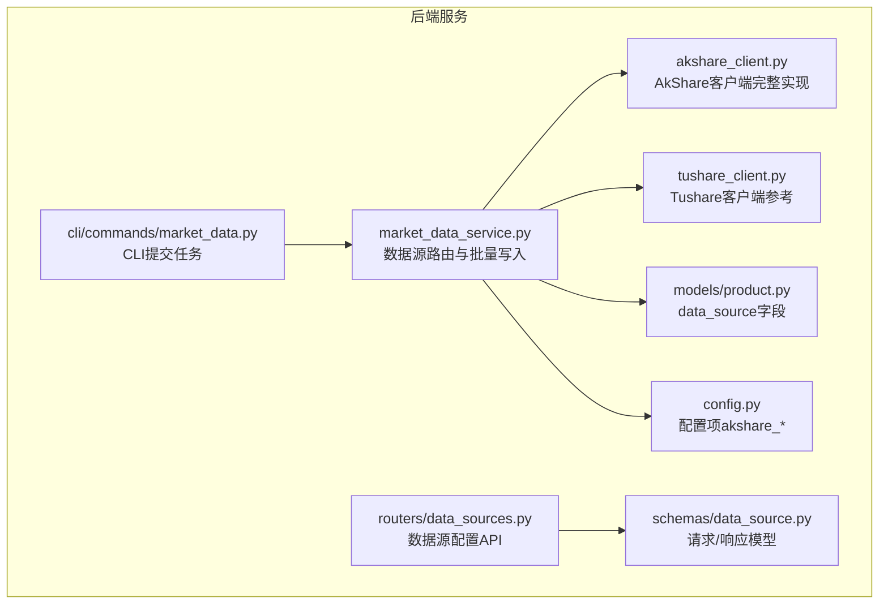
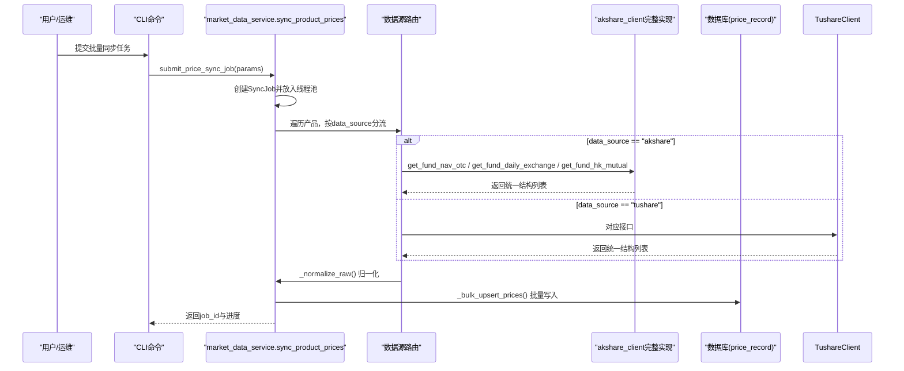
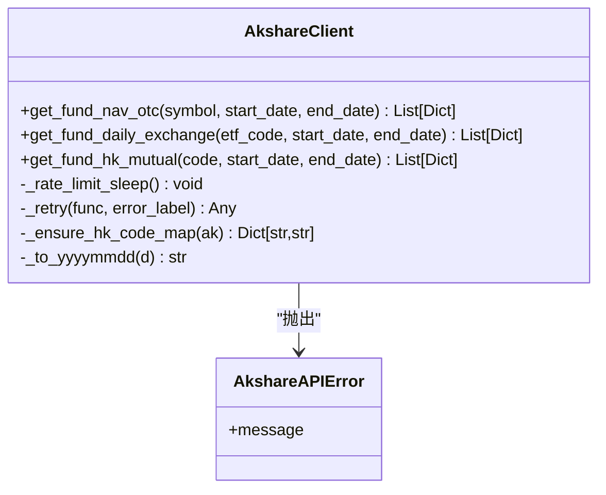
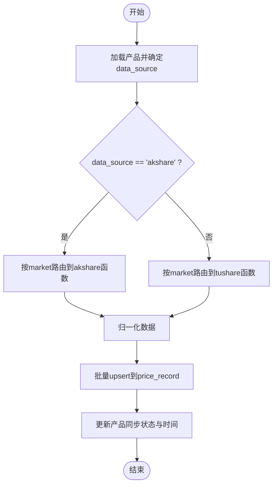
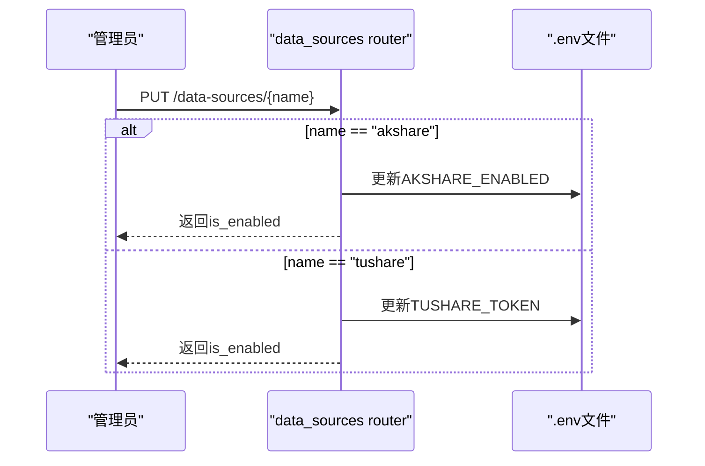
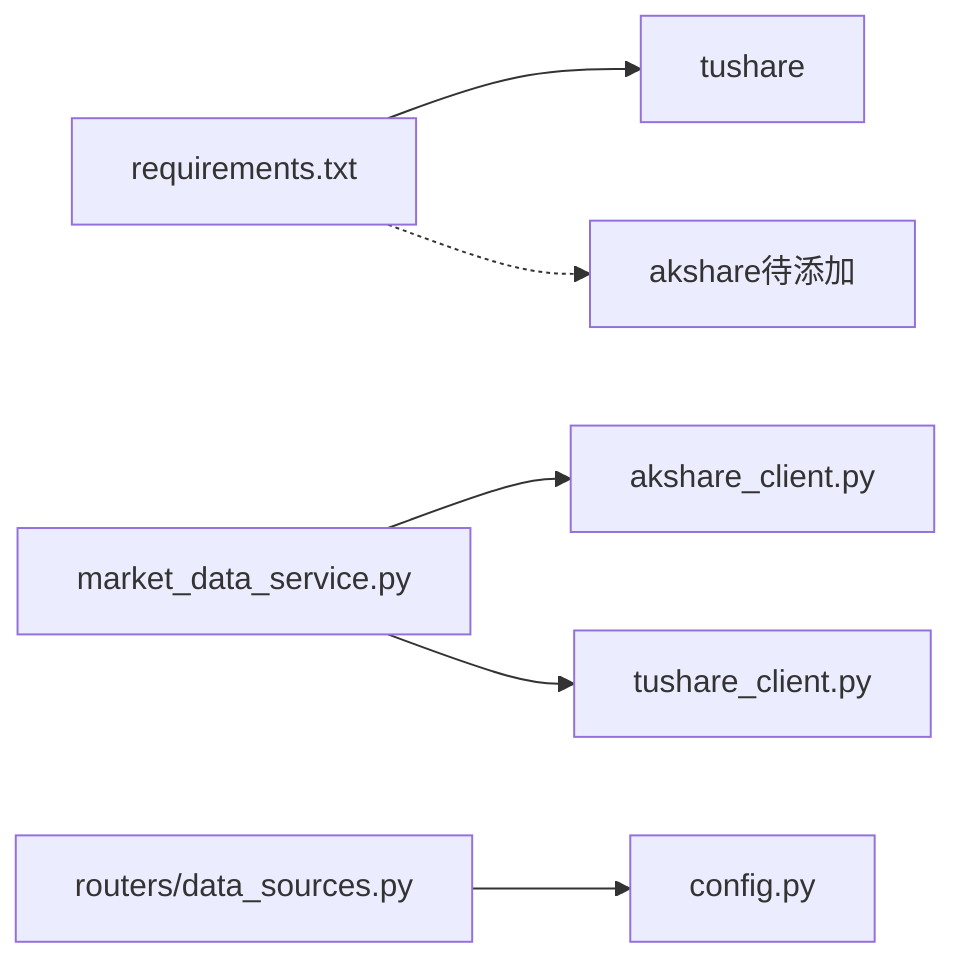

# AkShare数据源客户端

<cite>
**本文引用的文件**   
- [backend/app/services/akshare_client.py](file://backend/app/services/akshare_client.py)
- [backend/app/services/market_data_service.py](file://backend/app/services/market_data_service.py)
- [backend/app/routers/data_sources.py](file://backend/app/routers/data_sources.py)
- [backend/app/schemas/data_source.py](file://backend/app/schemas/data_source.py)
- [backend/app/config.py](file://backend/app/config.py)
- [backend/app/models/product.py](file://backend/app/models/product.py)
- [backend/cli/commands/market_data.py](file://backend/cli/commands/market_data.py)
- [backend/requirements.txt](file://backend/requirements.txt)
- [Docs/09-价格同步异步化改造需求.md](file://Docs/09-价格同步异步化改造需求.md)
</cite>

## 更新摘要
**变更内容**   
- 更新了AkShare客户端实现状态：从桩实现升级为完整功能实现
- 新增HK互认基金代码映射与懒加载缓存机制
- 完善了三个核心函数的实际接口调用和数据适配
- 增强了数据结构的标准化处理以兼容价格同步管道
- 更新了架构图表以反映实际的实现状态

## 目录
1. [简介](#简介)
2. [项目结构](#项目结构)
3. [核心组件](#核心组件)
4. [架构总览](#架构总览)
5. [详细组件分析](#详细组件分析)
6. [依赖关系分析](#依赖关系分析)
7. [性能与限流](#性能与限流)
8. [故障排查指南](#故障排查指南)
9. [结论](#结论)
10. [附录](#附录)

## 简介
本文件聚焦于系统中"AkShare数据源客户端"的设计、实现现状与集成方式。当前AkShare客户端已从初始的桩实现升级为完整的功能实现，提供了三类核心数据获取函数（场外基金净值、场内ETF日线、香港互认基金净值），并实现了HK互认基金的代码映射与懒加载缓存机制。系统已在服务层完成路由接入，支持按产品配置选择tushare或akshare作为数据源，并具备统一的限流重试、批量写入与任务编排能力。

## 项目结构
围绕AkShare数据源的关键代码分布在以下位置：
- 客户端实现：app/services/akshare_client.py
- 市场数据服务与数据源路由：app/services/market_data_service.py
- 数据源配置API：app/routers/data_sources.py + app/schemas/data_source.py
- 应用配置项（含AkShare开关与限流参数）：app/config.py
- 产品模型（包含data_source字段）：app/models/product.py
- CLI命令入口（提交批量同步任务）：backend/cli/commands/market_data.py
- 依赖清单（当前未包含akshare）：backend/requirements.txt
- 设计文档（明确接入策略与验收标准）：Docs/09-价格同步异步化改造需求.md

**图表来源**
- [backend/app/services/market_data_service.py:88-161](file://backend/app/services/market_data_service.py#L88-L161)
- [backend/app/services/akshare_client.py:1-177](file://backend/app/services/akshare_client.py#L1-L177)
- [backend/app/routers/data_sources.py:1-150](file://backend/app/routers/data_sources.py#L1-L150)
- [backend/app/schemas/data_source.py:1-24](file://backend/app/schemas/data_source.py#L1-24)
- [backend/app/config.py:1-53](file://backend/app/config.py#L1-53)
- [backend/app/models/product.py:1-22](file://backend/app/models/product.py#L1-22)
- [backend/cli/commands/market_data.py:84-113](file://backend/cli/commands/market_data.py#L84-L113)

**章节来源**
- [backend/app/services/market_data_service.py:88-161](file://backend/app/services/market_data_service.py#L88-L161)
- [backend/app/services/akshare_client.py:1-177](file://backend/app/services/akshare_client.py#L1-L177)
- [backend/app/routers/data_sources.py:1-150](file://backend/app/routers/data_sources.py#L1-L150)
- [backend/app/schemas/data_source.py:1-24](file://backend/app/schemas/data_source.py#L1-24)
- [backend/app/config.py:1-53](file://backend/app/config.py#L1-53)
- [backend/app/models/product.py:1-22](file://backend/app/models/product.py#L1-22)
- [backend/cli/commands/market_data.py:84-113](file://backend/cli/commands/market_data.py#L84-L113)

## 核心组件
- **AkShare客户端（完整实现）**
  - 提供三类核心函数：get_fund_nav_otc（场外基金净值）、get_fund_daily_exchange（场内ETF日线）、get_fund_hk_mutual（香港互认基金净值）。
  - 统一异常类型：AkshareAPIError。
  - 内置限频sleep与指数退避重试包装器。
  - HK互认基金代码映射与懒加载缓存机制。
- **市场数据服务（数据源路由）**
  - 根据product.data_source选择tushare或akshare路径。
  - 将不同来源的原始数据归一化为统一结构后批量upsert到price_record。
  - 记录source为实际数据源名称（如'akshare'）。
- **数据源配置API**
  - 读取AKSHARE_ENABLED环境变量控制是否启用AkShare。
  - 支持通过API更新AKSHARE_ENABLED并持久化至.env。
- **配置项**
  - akshare_enabled、akshare_rate_interval、akshare_max_retries等。
- **产品模型**
  - data_source字段默认'tushare'，可设置为'akshare'以走AkShare路径。
- **CLI**
  - 提交批量同步任务，后台线程池执行，支持增量/全量回填。

**章节来源**
- [backend/app/services/akshare_client.py:1-177](file://backend/app/services/akshare_client.py#L1-L177)
- [backend/app/services/market_data_service.py:88-161](file://backend/app/services/market_data_service.py#L88-L161)
- [backend/app/routers/data_sources.py:1-150](file://backend/app/routers/data_sources.py#L1-L150)
- [backend/app/config.py:1-53](file://backend/app/config.py#L1-53)
- [backend/app/models/product.py:1-22](file://backend/app/models/product.py#L1-22)
- [backend/cli/commands/market_data.py:84-113](file://backend/cli/commands/market_data.py#L84-L113)

## 架构总览
下图展示了从CLI触发到数据落库的整体流程，以及AkShare在其中的角色。

**图表来源**
- [backend/cli/commands/market_data.py:84-113](file://backend/cli/commands/market_data.py#L84-L113)
- [backend/app/services/market_data_service.py:384-527](file://backend/app/services/market_data_service.py#L384-L527)
- [backend/app/services/market_data_service.py:88-161](file://backend/app/services/market_data_service.py#L88-L161)
- [backend/app/services/akshare_client.py:1-177](file://backend/app/services/akshare_client.py#L1-L177)

## 详细组件分析

### AkShare客户端（完整实现）
- **目标**
  - 提供与tushare_client平级的统一接口，屏蔽底层差异。
  - 支持三类市场：CN_OTC（场外）、CN_EXCHANGE（场内ETF）、HK_MUTUAL（香港互认基金）。
- **关键设计**
  - 限频sleep：每次调用前sleep akshare_rate_interval秒。
  - 重试机制：最多akshare_max_retries次，指数退避。
  - 异常封装：AkshareAPIError，便于上层捕获与统计。
  - HK代码映射缓存：懒加载全局缓存避免重复API调用。
- **实现状态**
  - 三个核心函数均已实现完整的接口调用与数据适配。
  - 支持6位内地销售代码自动映射为10位香港基金代码。
  - 字段映射与具体接口已完成PoC验证。

**图表来源**
- [backend/app/services/akshare_client.py:17-39](file://backend/app/services/akshare_client.py#L17-L39)
- [backend/app/services/akshare_client.py:47-177](file://backend/app/services/akshare_client.py#L47-L177)

**章节来源**
- [backend/app/services/akshare_client.py:1-177](file://backend/app/services/akshare_client.py#L1-L177)

### 市场数据服务（数据源路由与批量写入）
- **数据源路由**
  - 读取product.data_source，若为空则回退为'tushare'。
  - 当data_source='akshare'时，按market分发到对应的akshare函数。
  - 支持HK_MUTUAL市场类型的akshare路径。
- **数据归一化**
  - 将不同来源的数据统一为{trade_date, unit_price, accumulated_nav, pre_close, pct_change}结构。
  - 支持多种字段名变体的兼容处理。
- **批量写入**
  - MySQL使用ON DUPLICATE KEY UPDATE幂等写入；SQLite环境ORM回退。
  - source字段记录实际数据源（'akshare'或'tushare'）。

**图表来源**
- [backend/app/services/market_data_service.py:88-161](file://backend/app/services/market_data_service.py#L88-L161)
- [backend/app/services/market_data_service.py:189-260](file://backend/app/services/market_data_service.py#L189-L260)

**章节来源**
- [backend/app/services/market_data_service.py:88-161](file://backend/app/services/market_data_service.py#L88-L161)
- [backend/app/services/market_data_service.py:189-260](file://backend/app/services/market_data_service.py#L189-L260)

### 数据源配置API
- **功能**
  - 获取数据源列表（包括tushare与akshare），对敏感信息脱敏显示。
  - 更新数据源配置：tushare更新TUSHARE_TOKEN；akshare更新AKSHARE_ENABLED。
- **持久化**
  - 直接读写.env文件，同时更新进程内os.environ以便即时生效。

**图表来源**
- [backend/app/routers/data_sources.py:77-150](file://backend/app/routers/data_sources.py#L77-L150)

**章节来源**
- [backend/app/routers/data_sources.py:1-150](file://backend/app/routers/data_sources.py#L1-L150)
- [backend/app/schemas/data_source.py:1-24](file://backend/app/schemas/data_source.py#L1-24)

### 配置项与环境变量
- **配置项**
  - akshare_enabled：是否启用AkShare（默认False）。
  - akshare_rate_interval：调用间隔（秒）。
  - akshare_max_retries：最大重试次数。
- **环境变量**
  - AKSHARE_ENABLED：由配置API更新，影响数据源列表展示与行为。

**章节来源**
- [backend/app/config.py:24-27](file://backend/app/config.py#L24-L27)
- [backend/app/routers/data_sources.py:38-58](file://backend/app/routers/data_sources.py#L38-L58)

### 产品模型与数据源选择
- **product.data_source字段**决定数据源路径，默认'tushare'。
- **当设置为'akshare'时**，系统将走AkShare分支，适用于HK_MUTUAL等场景。

**章节来源**
- [backend/app/models/product.py:15-16](file://backend/app/models/product.py#L15-16)
- [backend/app/services/market_data_service.py:111-140](file://backend/app/services/market_data_service.py#L111-L140)

### CLI任务提交与后台执行
- **CLI命令**支持提交批量同步任务，立即返回job_id。
- **后台线程池**执行，单running锁避免并发冲突。
- **支持增量与全量回填**，记录明细与进度。

**章节来源**
- [backend/cli/commands/market_data.py:84-113](file://backend/cli/commands/market_data.py#L84-L113)
- [backend/app/services/market_data_service.py:384-527](file://backend/app/services/market_data_service.py#L384-L527)

## 依赖关系分析
- **运行时依赖**
  - requirements.txt中已包含tushare，但未包含akshare。
  - 文档要求后续增加akshare依赖并在Docker镜像中安装。
- **模块耦合**
  - market_data_service强依赖akshare_client与tushare_client的接口契约。
  - routers/data_sources仅依赖配置与环境变量，不直接调用数据拉取逻辑。
- **外部依赖**
  - akshare为网页抓取型数据源，稳定性与限流弱于tushare，故作为可选数据源。

**图表来源**
- [backend/requirements.txt:32-36](file://backend/requirements.txt#L32-36)
- [backend/app/services/market_data_service.py:111-140](file://backend/app/services/market_data_service.py#L111-L140)
- [backend/app/routers/data_sources.py:1-150](file://backend/app/routers/data_sources.py#L1-L150)
- [backend/app/config.py:1-53](file://backend/app/config.py#L1-53)

**章节来源**
- [backend/requirements.txt:1-51](file://backend/requirements.txt#L1-51)
- [backend/app/services/market_data_service.py:111-140](file://backend/app/services/market_data_service.py#L111-L140)
- [backend/app/routers/data_sources.py:1-150](file://backend/app/routers/data_sources.py#L1-L150)
- [backend/app/config.py:1-53](file://backend/app/config.py#L1-53)

## 性能与限流
- **限频策略**
  - AkShare客户端：每次调用前sleep akshare_rate_interval秒，默认1.0s。
  - 重试策略：最多akshare_max_retries次，指数退避。
- **批量写入**
  - 采用ON DUPLICATE KEY UPDATE减少重复插入开销，提升吞吐。
- **任务编排**
  - 单running锁避免并发冲突；线程池隔离执行，避免阻塞主线程。
- **缓存优化**
  - HK代码映射使用全局懒加载缓存，避免重复API调用。

**章节来源**
- [backend/app/services/akshare_client.py:22-39](file://backend/app/services/akshare_client.py#L22-L39)
- [backend/app/services/market_data_service.py:212-260](file://backend/app/services/market_data_service.py#L212-L260)
- [backend/app/services/market_data_service.py:384-416](file://backend/app/services/market_data_service.py#L384-L416)
- [backend/app/services/akshare_client.py:120-131](file://backend/app/services/akshare_client.py#L120-L131)

## 故障排查指南
- **常见问题**
  - akshare未安装：调用会抛出AkshareAPIError，提示安装akshare。
  - 字段名漂移：akshare返回列名可能随版本变化，需实测校正。
  - 数据源未启用：AKSHARE_ENABLED为false时，数据源列表显示禁用。
  - HK代码映射失败：6位代码无法找到对应的10位香港基金代码。
- **定位步骤**
  - 检查.env中AKSHARE_ENABLED是否为true。
  - 确认product.data_source设置为'akshare'且market匹配。
  - 查看sync_error与last_sync_at字段了解最近一次同步结果。
  - 观察日志中的AkshareAPIError堆栈，定位具体函数与错误原因。
  - 验证HK基金代码映射是否正确建立。

**章节来源**
- [backend/app/services/akshare_client.py:58-61](file://backend/app/services/akshare_client.py#L58-L61)
- [backend/app/services/market_data_service.py:141-161](file://backend/app/services/market_data_service.py#L141-L161)
- [backend/app/routers/data_sources.py:38-58](file://backend/app/routers/data_sources.py#L38-L58)
- [backend/app/services/akshare_client.py:155-159](file://backend/app/services/akshare_client.py#L155-L159)

## 结论
当前AkShare客户端已从桩实现升级为完整的功能实现，完成了与系统其他部分的解耦与接入点准备。三个核心函数均已实现完整的接口调用与数据适配，HK互认基金代码映射与懒加载缓存机制也已到位。数据源路由、批量写入、任务编排与配置管理均已就绪。下一步重点在于：
- 安装akshare依赖并在生产环境中部署。
- 完善错误处理与监控指标，确保稳定性。
- 在测试环境中验证所有市场类型的数据准确性与幂等性。
- 监控HK代码映射的完整性与准确性。

## 附录
- **设计文档要点**
  - 明确akshare作为可选数据源，不做主路径。
  - 要求新增akshare依赖并在Docker镜像中安装。
  - 验收标准包含数据源路由、批量写入、任务编排与调度等。
  - HK互认基金需要特殊的代码映射处理。

**章节来源**
- [Docs/09-价格同步异步化改造需求.md:228-261](file://Docs/09-价格同步异步化改造需求.md#L228-L261)
- [Docs/09-价格同步异步化改造需求.md:297-356](file://Docs/09-价格同步异步化改造需求.md#L297-L356)