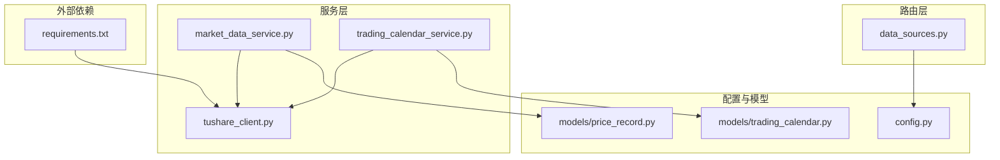
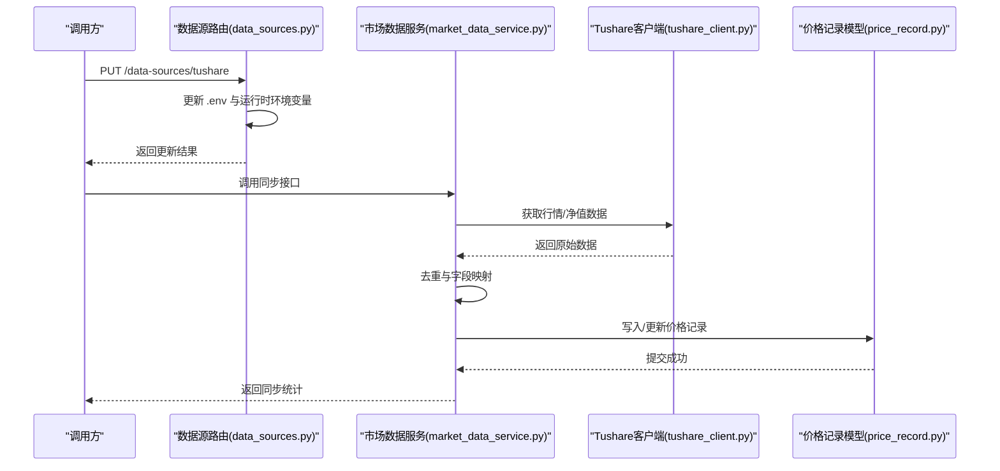
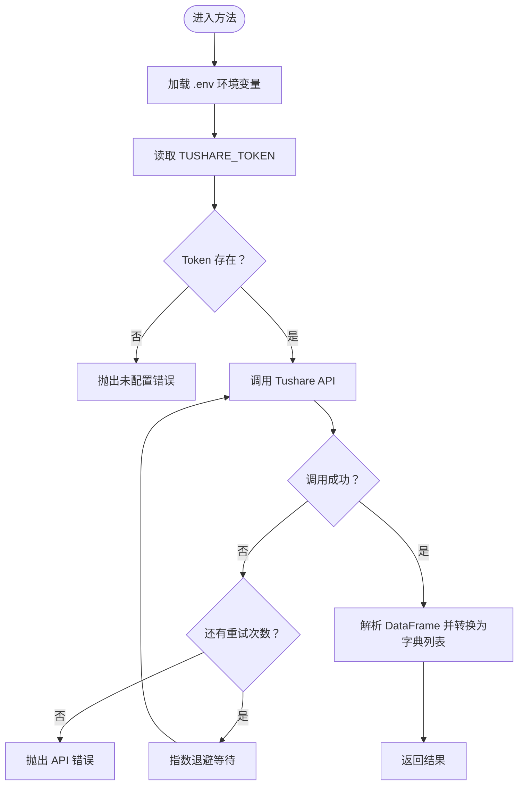
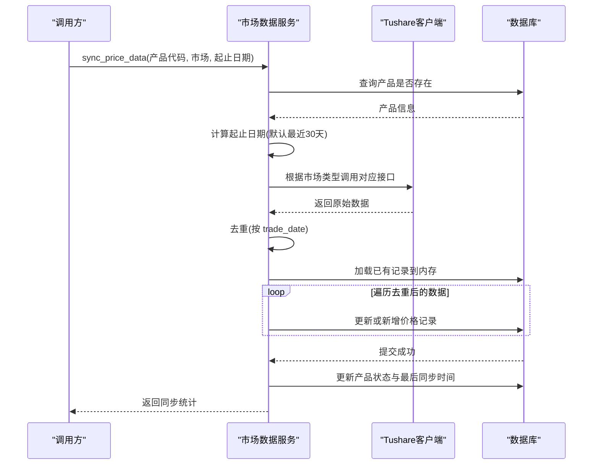
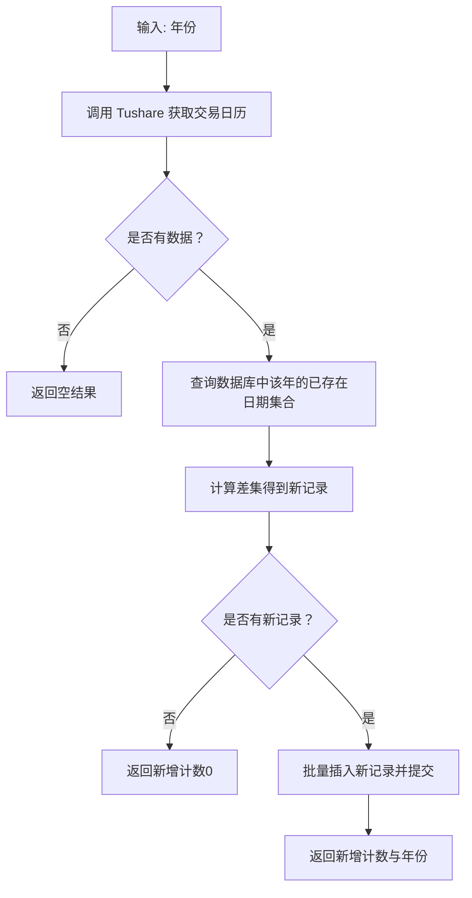
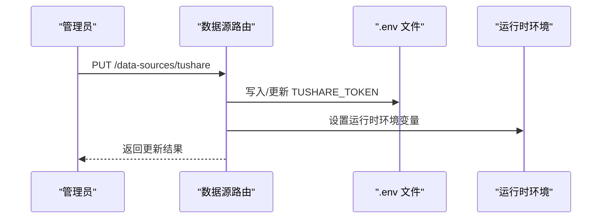
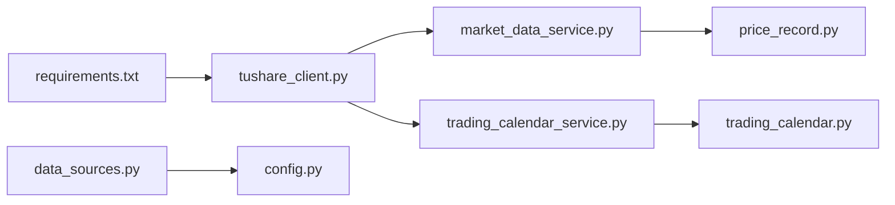

# Tushare API集成

<cite>
**本文引用的文件**
- [backend/app/services/tushare_client.py](file://backend/app/services/tushare_client.py)
- [backend/app/services/market_data_service.py](file://backend/app/services/market_data_service.py)
- [backend/app/services/trading_calendar_service.py](file://backend/app/services/trading_calendar_service.py)
- [backend/app/routers/data_sources.py](file://backend/app/routers/data_sources.py)
- [backend/app/config.py](file://backend/app/config.py)
- [backend/app/models/trading_calendar.py](file://backend/app/models/trading_calendar.py)
- [backend/app/models/price_record.py](file://backend/app/models/price_record.py)
- [backend/requirements.txt](file://backend/requirements.txt)
</cite>

## 目录
1. [简介](#简介)
2. [项目结构](#项目结构)
3. [核心组件](#核心组件)
4. [架构总览](#架构总览)
5. [详细组件分析](#详细组件分析)
6. [依赖分析](#依赖分析)
7. [性能考虑](#性能考虑)
8. [故障排除指南](#故障排除指南)
9. [结论](#结论)
10. [附录](#附录)

## 简介
本文件面向 InvestRing 项目的 Tushare Pro API 集成，系统性阐述配置与初始化流程、API 方法实现、错误处理与重试机制、调用示例与参数说明、返回值格式、性能优化与最佳实践。读者无需深入技术背景即可理解如何正确配置与使用 Tushare 数据源。

## 项目结构
Tushare 集成主要分布在以下模块：
- 服务层：Tushare 客户端封装、市场数据同步、交易日历同步
- 路由层：数据源配置与密钥更新接口
- 配置层：应用配置与环境变量映射
- 模型层：交易日历与价格记录的数据结构
- 依赖声明：Python 包依赖中包含 tushare

图表来源
- [backend/app/services/tushare_client.py:1-222](file://backend/app/services/tushare_client.py#L1-L222)
- [backend/app/services/market_data_service.py:1-323](file://backend/app/services/market_data_service.py#L1-L323)
- [backend/app/services/trading_calendar_service.py:1-125](file://backend/app/services/trading_calendar_service.py#L1-L125)
- [backend/app/routers/data_sources.py:1-150](file://backend/app/routers/data_sources.py#L1-L150)
- [backend/app/config.py:1-37](file://backend/app/config.py#L1-L37)
- [backend/app/models/trading_calendar.py:1-13](file://backend/app/models/trading_calendar.py#L1-L13)
- [backend/app/models/price_record.py:1-28](file://backend/app/models/price_record.py#L1-L28)
- [backend/requirements.txt:1-19](file://backend/requirements.txt#L1-L19)

章节来源
- [backend/app/services/tushare_client.py:1-222](file://backend/app/services/tushare_client.py#L1-L222)
- [backend/app/services/market_data_service.py:1-323](file://backend/app/services/market_data_service.py#L1-L323)
- [backend/app/services/trading_calendar_service.py:1-125](file://backend/app/services/trading_calendar_service.py#L1-L125)
- [backend/app/routers/data_sources.py:1-150](file://backend/app/routers/data_sources.py#L1-L150)
- [backend/app/config.py:1-37](file://backend/app/config.py#L1-L37)
- [backend/app/models/trading_calendar.py:1-13](file://backend/app/models/trading_calendar.py#L1-L13)
- [backend/app/models/price_record.py:1-28](file://backend/app/models/price_record.py#L1-L28)
- [backend/requirements.txt:1-19](file://backend/requirements.txt#L1-L19)

## 核心组件
- Tushare 客户端封装：负责环境变量加载、Token 校验、Pro 实例获取、交易日历、基金日线行情、基金净值等接口的调用与重试。
- 市场数据服务：根据产品市场类型选择调用 Tushare 的不同接口，执行去重、入库与状态标记。
- 交易日历服务：从 Tushare 获取指定年份交易日历，批量写入数据库。
- 数据源路由：提供读取与更新 Tushare Token 的接口，支持 .env 文件更新与运行时环境变量覆盖。
- 配置与模型：定义应用配置项与数据库表结构，支撑 Tushare 集成的数据持久化。

章节来源
- [backend/app/services/tushare_client.py:13-222](file://backend/app/services/tushare_client.py#L13-L222)
- [backend/app/services/market_data_service.py:88-225](file://backend/app/services/market_data_service.py#L88-L225)
- [backend/app/services/trading_calendar_service.py:15-66](file://backend/app/services/trading_calendar_service.py#L15-L66)
- [backend/app/routers/data_sources.py:24-115](file://backend/app/routers/data_sources.py#L24-L115)
- [backend/app/config.py:5-36](file://backend/app/config.py#L5-L36)
- [backend/app/models/trading_calendar.py:5-13](file://backend/app/models/trading_calendar.py#L5-L13)
- [backend/app/models/price_record.py:5-28](file://backend/app/models/price_record.py#L5-L28)

## 架构总览
Tushare 集成采用“客户端封装 + 业务服务 + 路由配置”的分层架构。客户端封装负责与 Tushare API 交互；业务服务负责数据转换、去重与入库；路由层负责配置管理；模型层负责数据持久化。

图表来源
- [backend/app/routers/data_sources.py:77-115](file://backend/app/routers/data_sources.py#L77-L115)
- [backend/app/services/market_data_service.py:88-225](file://backend/app/services/market_data_service.py#L88-L225)
- [backend/app/services/tushare_client.py:123-171](file://backend/app/services/tushare_client.py#L123-L171)

## 详细组件分析

### Tushare 客户端封装
职责与特性：
- 环境变量加载：优先查找项目根目录与当前目录下的 .env 文件，确保 TUSHARE_TOKEN 可用。
- Token 校验：若未配置，抛出未配置错误。
- 连接管理：通过 ts.pro_api(token) 获取 Pro 实例，避免重复初始化。
- 接口方法：
  - 交易日历：按年份获取，支持 SSE/SZSE，返回日期与是否开盘。
  - 批量交易日历：对多个年份合并结果。
  - 基金日线行情：获取场内ETF/LOF等日线行情，返回交易日、收盘价、前收市价、涨跌幅。
  - 基金净值：获取场外基金净值，返回交易日、单位净值、累计净值。
- 重试机制：对每个 API 调用内置最多 3 次指数退避重试，异常时统一包装为 API 错误。
- 返回值格式：统一为字典列表，便于业务层直接消费。

图表来源
- [backend/app/services/tushare_client.py:13-102](file://backend/app/services/tushare_client.py#L13-L102)
- [backend/app/services/tushare_client.py:123-171](file://backend/app/services/tushare_client.py#L123-L171)
- [backend/app/services/tushare_client.py:174-221](file://backend/app/services/tushare_client.py#L174-L221)

章节来源
- [backend/app/services/tushare_client.py:13-222](file://backend/app/services/tushare_client.py#L13-L222)

### 市场数据服务
职责与特性：
- 产品校验：确认产品存在且市场类型合法。
- 时间范围：默认最近 30 天，支持自定义起止日期。
- 数据获取：根据市场类型调用不同接口（CN_EXCHANGE → 日线行情；CN_OTC → 净值）。
- 错误处理：捕获 TushareAPIError 与通用异常，返回结构化结果。
- 去重策略：按 trade_date 去重，保留最后一条记录。
- 入库逻辑：先加载已有记录到内存字典，再逐条比对更新或新增，最后提交事务。
- 状态标记：成功后更新产品数据源状态、来源与最后同步时间。

图表来源
- [backend/app/services/market_data_service.py:88-225](file://backend/app/services/market_data_service.py#L88-L225)
- [backend/app/models/price_record.py:5-28](file://backend/app/models/price_record.py#L5-L28)

章节来源
- [backend/app/services/market_data_service.py:88-225](file://backend/app/services/market_data_service.py#L88-L225)
- [backend/app/models/price_record.py:5-28](file://backend/app/models/price_record.py#L5-L28)

### 交易日历服务
职责与特性：
- 同步指定年份交易日历至数据库，自动过滤已存在的日期，仅批量插入新记录。
- 查询构建：支持按年、起止日期、是否开盘过滤。
- 交易日判断：给定日期是否为交易日。

图表来源
- [backend/app/services/trading_calendar_service.py:15-66](file://backend/app/services/trading_calendar_service.py#L15-L66)
- [backend/app/models/trading_calendar.py:5-13](file://backend/app/models/trading_calendar.py#L5-L13)

章节来源
- [backend/app/services/trading_calendar_service.py:15-125](file://backend/app/services/trading_calendar_service.py#L15-L125)
- [backend/app/models/trading_calendar.py:5-13](file://backend/app/models/trading_calendar.py#L5-L13)

### 数据源路由（Tushare 配置）
职责与特性：
- 读取：从环境变量与数据库读取 Tushare 配置与最后同步时间。
- 更新：支持更新 TUSHARE_TOKEN，同时更新 .env 文件与运行时环境变量。
- 脱敏显示：对外展示 API Key 时进行脱敏处理。

图表来源
- [backend/app/routers/data_sources.py:77-115](file://backend/app/routers/data_sources.py#L77-L115)

章节来源
- [backend/app/routers/data_sources.py:24-115](file://backend/app/routers/data_sources.py#L24-L115)

### 配置与模型
- 应用配置：包含数据库、安全、Tushare Token 等配置项，支持从 .env 加载。
- 交易日历模型：日期唯一索引、是否开盘、交易所标识。
- 价格记录模型：产品代码+市场+日期唯一约束，支持净值、涨跌幅、前收市价等字段。

章节来源
- [backend/app/config.py:5-36](file://backend/app/config.py#L5-L36)
- [backend/app/models/trading_calendar.py:5-13](file://backend/app/models/trading_calendar.py#L5-L13)
- [backend/app/models/price_record.py:5-28](file://backend/app/models/price_record.py#L5-L28)

## 依赖分析
- Python 包依赖中包含 tushare，确保运行时可用。
- 服务层依赖 tushare_client 提供的接口。
- 业务服务依赖模型层进行数据持久化。
- 路由层依赖配置层与数据库会话。

图表来源
- [backend/requirements.txt:17-17](file://backend/requirements.txt#L17-L17)
- [backend/app/services/tushare_client.py:1-8](file://backend/app/services/tushare_client.py#L1-L8)
- [backend/app/services/market_data_service.py:1-12](file://backend/app/services/market_data_service.py#L1-L12)
- [backend/app/services/trading_calendar_service.py:1-12](file://backend/app/services/trading_calendar_service.py#L1-L12)
- [backend/app/models/price_record.py:1-2](file://backend/app/models/price_record.py#L1-L2)
- [backend/app/models/trading_calendar.py:1-2](file://backend/app/models/trading_calendar.py#L1-L2)
- [backend/app/routers/data_sources.py:1-9](file://backend/app/routers/data_sources.py#L1-L9)
- [backend/app/config.py:1-6](file://backend/app/config.py#L1-L6)

章节来源
- [backend/requirements.txt:1-19](file://backend/requirements.txt#L1-L19)
- [backend/app/services/tushare_client.py:1-8](file://backend/app/services/tushare_client.py#L1-L8)
- [backend/app/services/market_data_service.py:1-12](file://backend/app/services/market_data_service.py#L1-L12)
- [backend/app/services/trading_calendar_service.py:1-12](file://backend/app/services/trading_calendar_service.py#L1-L12)
- [backend/app/models/price_record.py:1-2](file://backend/app/models/price_record.py#L1-L2)
- [backend/app/models/trading_calendar.py:1-2](file://backend/app/models/trading_calendar.py#L1-L2)
- [backend/app/routers/data_sources.py:1-9](file://backend/app/routers/data_sources.py#L1-L9)
- [backend/app/config.py:1-6](file://backend/app/config.py#L1-L6)

## 性能考虑
- 重试策略：指数退避重试（最多 3 次），降低瞬时网络波动影响。
- 去重与批处理：业务层对同一天多条记录去重，数据库侧批量插入新交易日历，减少重复写入。
- 内存缓存：在同步价格数据时，先加载已有记录到内存字典，提升更新效率。
- 字段映射：仅提取必要字段，减少数据传输与转换成本。
- 建议：
  - 在高并发场景下，为 Tushare 接口增加速率限制与队列控制。
  - 对历史数据同步任务使用异步调度器，避免阻塞主流程。
  - 对频繁查询的交易日历建立本地缓存，降低数据库压力。

## 故障排除指南
常见错误与处理策略：
- 未配置错误（TushareNotConfiguredError）
  - 触发条件：环境变量 TUSHARE_TOKEN 为空。
  - 处理方式：通过数据源路由更新 .env 与运行时环境变量，确保服务重启或重新加载配置后生效。
- API 调用错误（TushareAPIError）
  - 触发条件：Tushare 接口调用异常或返回空数据。
  - 处理方式：检查网络连通性、Token 有效性与接口参数格式；利用内置重试机制自动恢复。
- 数据写入异常
  - 触发条件：数据库写入失败（如唯一键冲突、字段类型不匹配）。
  - 处理方式：回滚事务，标记产品数据源状态为失败；修复数据后再重试。
- 交易日历同步异常
  - 触发条件：Tushare 未配置或接口返回异常。
  - 处理方式：检查 Token 与网络；确认目标年份数据可用性。

章节来源
- [backend/app/services/tushare_client.py:38-45](file://backend/app/services/tushare_client.py#L38-L45)
- [backend/app/services/market_data_service.py:135-138](file://backend/app/services/market_data_service.py#L135-L138)
- [backend/app/services/market_data_service.py:210-214](file://backend/app/services/market_data_service.py#L210-L214)
- [backend/app/services/trading_calendar_service.py:27-29](file://backend/app/services/trading_calendar_service.py#L27-L29)

## 结论
InvestRing 的 Tushare 集成以简洁可靠的客户端封装为核心，配合业务服务的去重与入库策略、路由层的配置管理以及模型层的数据持久化，形成了完整的数据链路。通过内置重试与错误分类处理，系统具备良好的容错能力。建议在生产环境中结合速率限制、异步调度与缓存策略进一步提升稳定性与性能。

## 附录

### 配置与初始化
- 环境变量
  - TUSHARE_TOKEN：Tushare Pro API 的访问令牌。
  - 可选：AKSHARE_ENABLED（AkShare 启用开关，与 Tushare 集成无直接关系）。
- 初始化步骤
  - 在 .env 中设置 TUSHARE_TOKEN。
  - 通过数据源路由更新配置后，客户端会在首次调用时加载环境变量并校验 Token。
  - 若未配置，将抛出未配置错误。

章节来源
- [backend/app/routers/data_sources.py:29-46](file://backend/app/routers/data_sources.py#L29-L46)
- [backend/app/services/tushare_client.py:13-35](file://backend/app/services/tushare_client.py#L13-L35)

### API 方法与参数说明
- 交易日历获取
  - 方法：get_trade_calendar(year, exchange)
  - 参数
    - year：整数，年份（如 2026）
    - exchange：字符串，交易所代码（SSE 或 SZSE，默认 SSE）
  - 返回：列表，元素为包含 date（YYYY-MM-DD）与 is_open（布尔）的对象
  - 异常：TushareNotConfiguredError、TushareAPIError
- 批量交易日历
  - 方法：get_trade_calendar_years(years, exchange)
  - 参数
    - years：整数列表，年份列表
    - exchange：字符串，交易所代码
  - 返回：合并后的交易日历列表
- 基金日线行情
  - 方法：get_fund_daily(ts_code, start_date, end_date)
  - 参数
    - ts_code：字符串，基金代码（如 510300.SH）
    - start_date：字符串，开始日期（YYYYMMDD）
    - end_date：字符串，结束日期（YYYYMMDD）
  - 返回：列表，元素为包含 trade_date、close、pre_close、pct_chg 的对象
- 基金净值
  - 方法：get_fund_nav(ts_code, start_date, end_date)
  - 参数
    - ts_code：字符串，基金代码（如 000001.OF）
    - start_date：字符串，开始日期（YYYYMMDD）
    - end_date：字符串，结束日期（YYYYMMDD）
  - 返回：列表，元素为包含 trade_date、unit_nav、accum_nav 的对象

章节来源
- [backend/app/services/tushare_client.py:48-102](file://backend/app/services/tushare_client.py#L48-L102)
- [backend/app/services/tushare_client.py:105-120](file://backend/app/services/tushare_client.py#L105-L120)
- [backend/app/services/tushare_client.py:123-171](file://backend/app/services/tushare_client.py#L123-L171)
- [backend/app/services/tushare_client.py:174-221](file://backend/app/services/tushare_client.py#L174-L221)

### 调用示例与最佳实践
- 示例路径
  - 更新 Tushare Token：PUT /api/data-sources/tushare
  - 同步价格数据：调用市场数据服务的同步接口（传入产品代码、市场类型与日期范围）
- 最佳实践
  - 在调用前确保 Token 已配置并通过数据源路由验证。
  - 对于历史数据同步，建议分批次、按月或按季度进行，避免单次请求过大。
  - 对返回数据进行去重与字段校验，保证入库质量。
  - 对异常进行分类处理，区分网络波动与参数错误，采取不同恢复策略。

章节来源
- [backend/app/routers/data_sources.py:77-115](file://backend/app/routers/data_sources.py#L77-L115)
- [backend/app/services/market_data_service.py:88-225](file://backend/app/services/market_data_service.py#L88-L225)