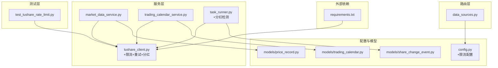
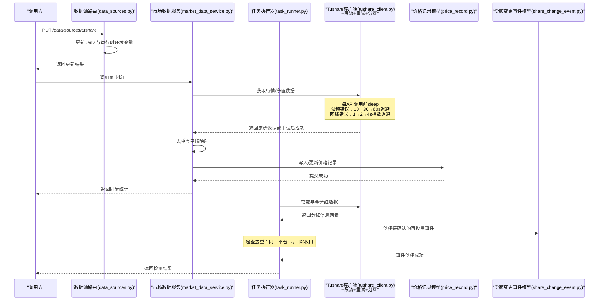
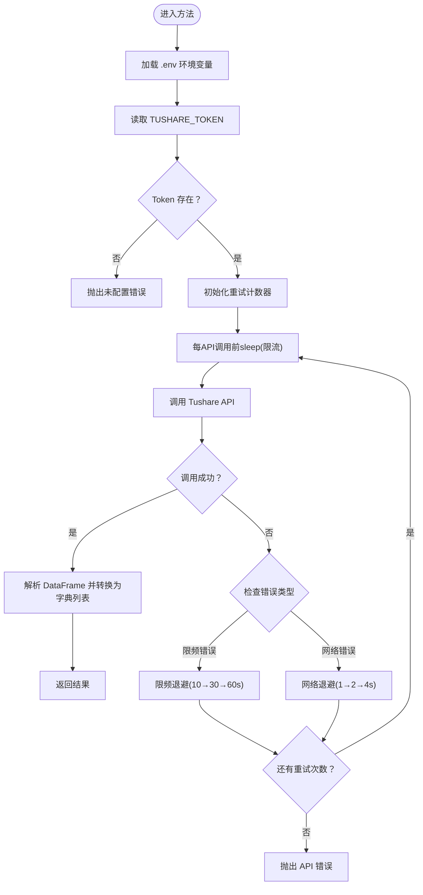
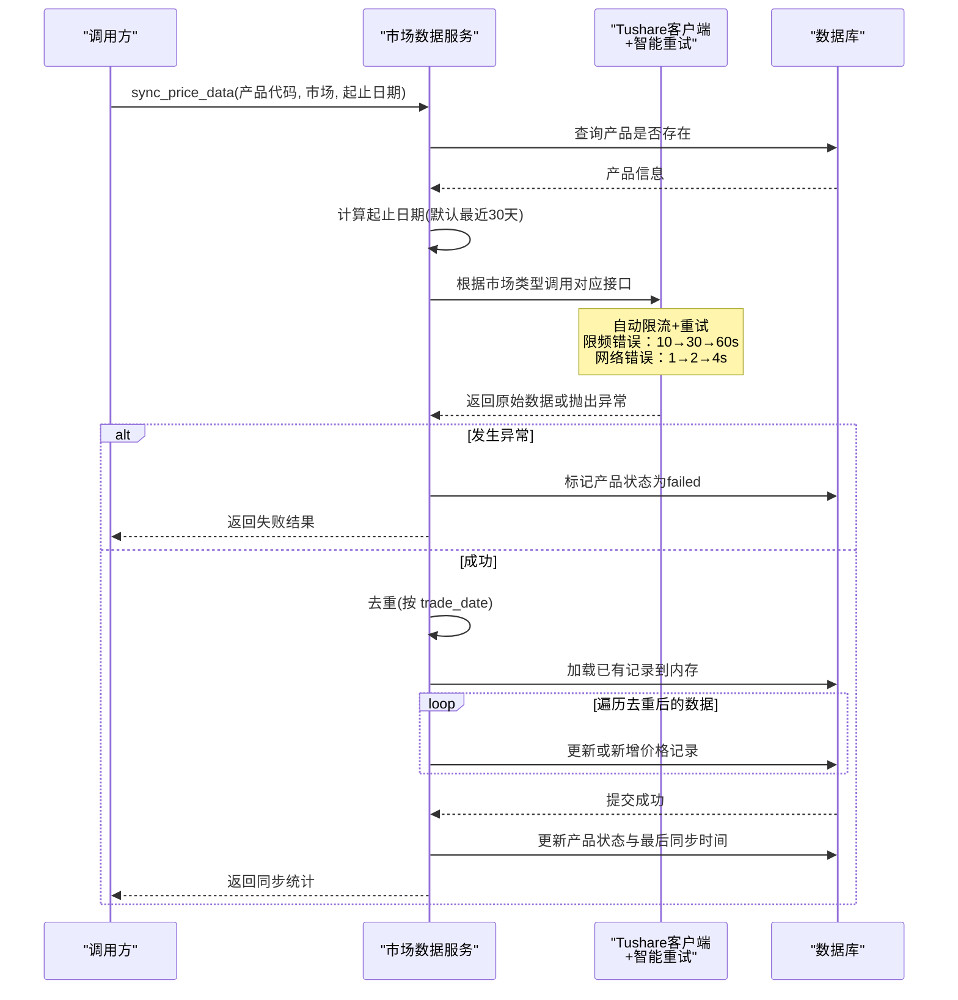
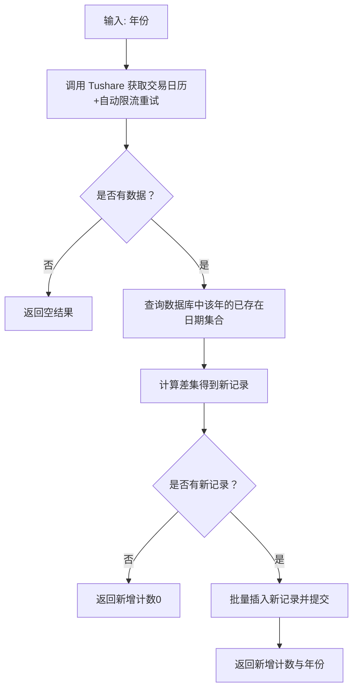
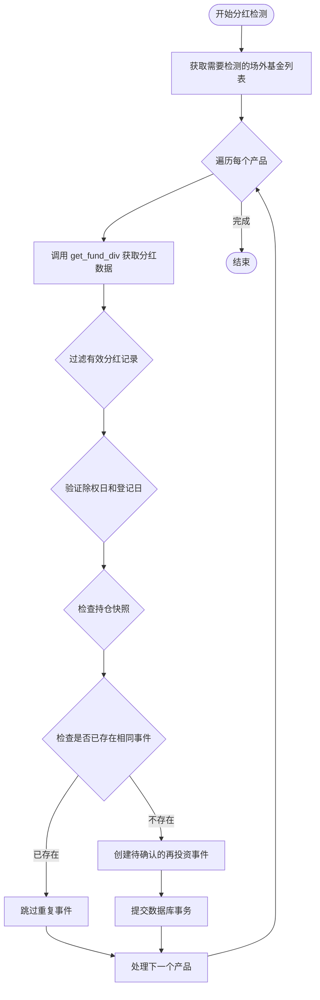
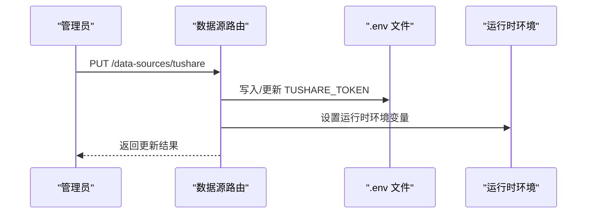
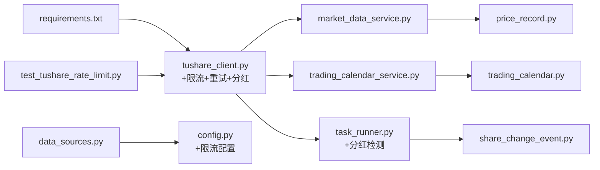

# Tushare API集成

<cite>
**本文引用的文件**
- [backend/app/services/tushare_client.py](file://backend/app/services/tushare_client.py)
- [backend/app/services/market_data_service.py](file://backend/app/services/market_data_service.py)
- [backend/app/services/trading_calendar_service.py](file://backend/app/services/trading_calendar_service.py)
- [backend/app/services/task_runner.py](file://backend/app/services/task_runner.py)
- [backend/app/routers/data_sources.py](file://backend/app/routers/data_sources.py)
- [backend/app/config.py](file://backend/app/config.py)
- [backend/app/models/trading_calendar.py](file://backend/app/models/trading_calendar.py)
- [backend/app/models/price_record.py](file://backend/app/models/price_record.py)
- [backend/app/models/share_change_event.py](file://backend/app/models/share_change_event.py)
- [backend/tests/unit/test_tushare_rate_limit.py](file://backend/tests/unit/test_tushare_rate_limit.py)
- [backend/requirements.txt](file://backend/requirements.txt)
</cite>

## 更新摘要
**变更内容**
- 新增基金分红检测功能，通过get_fund_div()函数获取Tushare分红数据
- 实现自动分红处理机制，在净值同步过程中将分红信息转换为待确认的再投资事件
- 增强份额变更事件的去重机制，确保同一平台同一除权日的分红事件不会重复创建
- 完善错误处理和异常恢复策略，支持Tushare配置错误和API调用错误的优雅降级

## 目录
1. [简介](#简介)
2. [项目结构](#项目结构)
3. [核心组件](#核心组件)
4. [架构总览](#架构总览)
5. [详细组件分析](#详细组件分析)
6. [依赖分析](#依赖分析)
7. [性能考虑](#性能考虑)
8. [故障排除指南](#故障排除指南)
9. [结论](#结论)
10. [附录](#附录)

## 简介
本文件面向 InvestRing 项目的 Tushare Pro API 集成，系统性阐述配置与初始化流程、API 方法实现、错误处理与重试机制、调用示例与参数说明、返回值格式、性能优化与最佳实践。读者无需深入技术背景即可理解如何正确配置与使用 Tushare 数据源。

**更新** 新增了基金分红检测与自动处理能力，实现了从Tushare API获取分红数据并自动转换为待确认的再投资事件的完整流程，同时增强了系统的幂等性和去重机制。

## 项目结构
Tushare 集成主要分布在以下模块：
- 服务层：Tushare 客户端封装（含限流和重试）、市场数据同步、交易日历同步、任务执行器（含分红检测）
- 路由层：数据源配置与密钥更新接口
- 配置层：应用配置与环境变量映射（含限流配置）
- 模型层：交易日历与价格记录的数据结构、份额变更事件模型
- 测试层：限流机制的单元测试验证
- 依赖声明：Python 包依赖中包含 tushare

**图表来源**
- [backend/app/services/tushare_client.py:1-276](file://backend/app/services/tushare_client.py#L1-L276)
- [backend/app/services/market_data_service.py:1-548](file://backend/app/services/market_data_service.py#L1-L548)
- [backend/app/services/trading_calendar_service.py:1-125](file://backend/app/services/trading_calendar_service.py#L1-L125)
- [backend/app/services/task_runner.py:180-293](file://backend/app/services/task_runner.py#L180-L293)
- [backend/app/routers/data_sources.py:1-150](file://backend/app/routers/data_sources.py#L1-L150)
- [backend/app/config.py:1-53](file://backend/app/config.py#L1-L53)
- [backend/app/models/trading_calendar.py:1-13](file://backend/app/models/trading_calendar.py#L1-L13)
- [backend/app/models/price_record.py:1-28](file://backend/app/models/price_record.py#L1-L28)
- [backend/app/models/share_change_event.py:1-39](file://backend/app/models/share_change_event.py#L1-L39)
- [backend/tests/unit/test_tushare_rate_limit.py:1-122](file://backend/tests/unit/test_tushare_rate_limit.py#L1-L122)
- [backend/requirements.txt:1-19](file://backend/requirements.txt#L1-L19)

章节来源
- [backend/app/services/tushare_client.py:1-276](file://backend/app/services/tushare_client.py#L1-L276)
- [backend/app/services/market_data_service.py:1-548](file://backend/app/services/market_data_service.py#L1-L548)
- [backend/app/services/trading_calendar_service.py:1-125](file://backend/app/services/trading_calendar_service.py#L1-L125)
- [backend/app/services/task_runner.py:180-293](file://backend/app/services/task_runner.py#L180-L293)
- [backend/app/routers/data_sources.py:1-150](file://backend/app/routers/data_sources.py#L1-L150)
- [backend/app/config.py:1-53](file://backend/app/config.py#L1-L53)
- [backend/app/models/trading_calendar.py:1-13](file://backend/app/models/trading_calendar.py#L1-L13)
- [backend/app/models/price_record.py:1-28](file://backend/app/models/price_record.py#L1-L28)
- [backend/app/models/share_change_event.py:1-39](file://backend/app/models/share_change_event.py#L1-L39)
- [backend/tests/unit/test_tushare_rate_limit.py:1-122](file://backend/tests/unit/test_tushare_rate_limit.py#L1-L122)
- [backend/requirements.txt:1-19](file://backend/requirements.txt#L1-L19)

## 核心组件
- **增强的 Tushare 客户端封装**：负责环境变量加载、Token 校验、Pro 实例获取、交易日历、基金日线行情、基金净值、基金分红等接口的调用，具备每API调用级别的限流机制、指数退避重试策略和网络异常处理。
- 市场数据服务：根据产品市场类型选择调用 Tushare 的不同接口，执行去重、入库与状态标记。
- 交易日历服务：从 Tushare 获取指定年份交易日历，批量写入数据库。
- 任务执行器：包含分红检测功能，自动从Tushare获取分红数据并创建待确认的再投资事件。
- 数据源路由：提供读取与更新 Tushare Token 的接口，支持 .env 文件更新与运行时环境变量覆盖。
- **增强的配置管理**：定义应用配置项与数据库表结构，支撑 Tushare 集成的数据持久化，包含限流相关配置参数。

**更新** Tushare 客户端现已具备完善的限流和重试机制，能够智能处理频率限制和网络异常，并新增了基金分红数据的获取能力。

章节来源
- [backend/app/services/tushare_client.py:51-88](file://backend/app/services/tushare_client.py#L51-L88)
- [backend/app/services/market_data_service.py:88-200](file://backend/app/services/market_data_service.py#L88-L200)
- [backend/app/services/trading_calendar_service.py:15-66](file://backend/app/services/trading_calendar_service.py#L15-L66)
- [backend/app/services/task_runner.py:182-273](file://backend/app/services/task_runner.py#L182-L273)
- [backend/app/routers/data_sources.py:24-115](file://backend/app/routers/data_sources.py#L24-L115)
- [backend/app/config.py:18-22](file://backend/app/config.py#L18-L22)
- [backend/app/models/trading_calendar.py:5-13](file://backend/app/models/trading_calendar.py#L5-L13)
- [backend/app/models/price_record.py:5-28](file://backend/app/models/price_record.py#L5-L28)
- [backend/app/models/share_change_event.py:5-39](file://backend/app/models/share_change_event.py#L5-L39)

## 架构总览
Tushare 集成采用"客户端封装 + 业务服务 + 路由配置"的分层架构。客户端封装负责与 Tushare API 交互，内置智能限流和重试机制；业务服务负责数据转换、去重与入库；路由层负责配置管理；模型层负责数据持久化；任务执行器负责自动化处理分红检测。

**图表来源**
- [backend/app/routers/data_sources.py:77-115](file://backend/app/routers/data_sources.py#L77-L115)
- [backend/app/services/market_data_service.py:88-200](file://backend/app/services/market_data_service.py#L88-200)
- [backend/app/services/tushare_client.py:68-88](file://backend/app/services/tushare_client.py#L68-88)
- [backend/app/services/task_runner.py:182-273](file://backend/app/services/task_runner.py#L182-L273)

## 详细组件分析

### 增强的 Tushare 客户端封装
职责与特性：
- 环境变量加载：优先查找项目根目录与当前目录下的 .env 文件，确保 TUSHARE_TOKEN 可用。
- Token 校验：若未配置，抛出未配置错误。
- 连接管理：通过 ts.pro_api(token) 获取 Pro 实例，避免重复初始化。
- 限流机制：每API调用前执行 sleep，满足 Tushare 频率限制要求（默认0.5秒）。
- 智能重试策略：
  - 限频错误检测：识别"频率"、"rate"、"每分钟"、"limit"、"too many"等关键词
  - 限频退避：10秒 → 30秒 → 60秒的固定退避序列
  - 网络错误退避：1秒 → 2秒 → 4秒的指数退避序列
  - 最大重试次数：可配置的3次（默认）
- 接口方法：
  - 交易日历：按年份获取，支持 SSE/SZSE，返回日期与是否开盘。
  - 批量交易日历：对多个年份合并结果。
  - 基金日线行情：获取场内ETF/LOF等日线行情，返回交易日、收盘价、前收市价、涨跌幅。
  - 基金净值：获取场外基金净值，返回交易日、单位净值、累计净值。
  - **基金分红**：获取基金分红信息，返回除权日、登记日、现金分红金额等信息。
- 返回值格式：统一为字典列表，便于业务层直接消费。

**更新** 客户端现已具备完整的限流和重试机制，能够自动处理各种异常情况，并新增了基金分红数据的获取能力。

**图表来源**
- [backend/app/services/tushare_client.py:51-88](file://backend/app/services/tushare_client.py#L51-L88)
- [backend/app/services/tushare_client.py:112-120](file://backend/app/services/tushare_client.py#L112-L120)
- [backend/app/services/tushare_client.py:181-184](file://backend/app/services/tushare_client.py#L181-L184)
- [backend/app/services/tushare_client.py:225-228](file://backend/app/services/tushare_client.py#L225-L228)
- [backend/app/services/tushare_client.py:258-261](file://backend/app/services/tushare_client.py#L258-L261)

章节来源
- [backend/app/services/tushare_client.py:15-88](file://backend/app/services/tushare_client.py#L15-L88)
- [backend/app/services/tushare_client.py:91-276](file://backend/app/services/tushare_client.py#L91-L276)

### 市场数据服务
职责与特性：
- 产品校验：确认产品存在且市场类型合法。
- 时间范围：默认最近 30 天，支持自定义起止日期。
- 数据获取：根据市场类型调用不同接口（CN_EXCHANGE → 日线行情；CN_OTC → 净值）。
- 增强的错误处理：捕获 TushareAPIError 与通用异常，返回结构化结果，自动标记失败状态。
- 去重策略：按 trade_date 去重，保留最后一条记录。
- 入库逻辑：先加载已有记录到内存字典，再逐条比对更新或新增，最后提交事务。
- 状态标记：成功后更新产品数据源状态、来源与最后同步时间。

**图表来源**
- [backend/app/services/market_data_service.py:88-161](file://backend/app/services/market_data_service.py#L88-L161)
- [backend/app/services/market_data_service.py:141-143](file://backend/app/services/market_data_service.py#L141-L143)

章节来源
- [backend/app/services/market_data_service.py:88-200](file://backend/app/services/market_data_service.py#L88-L200)
- [backend/app/models/price_record.py:5-28](file://backend/app/models/price_record.py#L5-L28)

### 交易日历服务
职责与特性：
- 同步指定年份交易日历至数据库，自动过滤已存在的日期，仅批量插入新记录。
- 查询构建：支持按年、起止日期、是否开盘过滤。
- 交易日判断：给定日期是否为交易日。

**图表来源**
- [backend/app/services/trading_calendar_service.py:15-66](file://backend/app/services/trading_calendar_service.py#L15-L66)
- [backend/app/models/trading_calendar.py:5-13](file://backend/app/models/trading_calendar.py#L5-L13)

章节来源
- [backend/app/services/trading_calendar_service.py:15-125](file://backend/app/services/trading_calendar_service.py#L15-L125)
- [backend/app/models/trading_calendar.py:5-13](file://backend/app/models/trading_calendar.py#L5-L13)

### 任务执行器与分红检测
职责与特性：
- 分红检测：从 Tushare 获取基金分红数据，自动创建待确认的再投资事件。
- 数据处理：过滤非实施状态的分红，验证日期有效性，检查持仓快照。
- 去重机制：基于组合代码、产品代码、除权日和平台代码进行幂等性检查。
- 事件创建：为每个符合条件的持仓创建 reinvest_dividend 类型的份额变更事件。
- 错误处理：优雅处理 Tushare 配置错误和 API 调用错误，记录日志并继续处理其他产品。

**图表来源**
- [backend/app/services/task_runner.py:182-273](file://backend/app/services/task_runner.py#L182-L273)

章节来源
- [backend/app/services/task_runner.py:182-273](file://backend/app/services/task_runner.py#L182-L273)
- [backend/app/models/share_change_event.py:5-39](file://backend/app/models/share_change_event.py#L5-L39)

### 数据源路由（Tushare 配置）
职责与特性：
- 读取：从环境变量与数据库读取 Tushare 配置与最后同步时间。
- 更新：支持更新 TUSHARE_TOKEN，同时更新 .env 文件与运行时环境变量。
- 脱敏显示：对外展示 API Key 时进行脱敏处理。

**图表来源**
- [backend/app/routers/data_sources.py:77-115](file://backend/app/routers/data_sources.py#L77-L115)

章节来源
- [backend/app/routers/data_sources.py:24-115](file://backend/app/routers/data_sources.py#L24-L115)

### 增强的配置与模型
- 增强的应用配置：包含数据库、安全、Tushare Token 等配置项，新增限流相关配置：
  - `tushare_rate_interval`: 每API调用前的sleep间隔（默认0.5秒）
  - `tushare_max_retries`: 最大重试次数（默认3次）
  - `tushare_rate_limit_backoff`: 限频退避延迟序列（默认"10,30,60"）
- 交易日历模型：日期唯一索引、是否开盘、交易所标识。
- 价格记录模型：产品代码+市场+日期唯一约束，支持净值、涨跌幅、前收市价等字段。
- **份额变更事件模型**：支持多种事件类型（现金分红、再投资分红、份额拆分等），包含平台级和基金级事件支持，具备幂等性字段 `tushare_event_id`。

**更新** 配置系统现已支持灵活的限流和重试策略定制，份额变更事件模型支持完整的分红处理流程。

章节来源
- [backend/app/config.py:18-22](file://backend/app/config.py#L18-L22)
- [backend/app/models/trading_calendar.py:5-13](file://backend/app/models/trading_calendar.py#L5-L13)
- [backend/app/models/price_record.py:5-28](file://backend/app/models/price_record.py#L5-L28)
- [backend/app/models/share_change_event.py:5-39](file://backend/app/models/share_change_event.py#L5-L39)

## 依赖分析
- Python 包依赖中包含 tushare，确保运行时可用。
- 服务层依赖 tushare_client 提供的接口。
- 业务服务依赖模型层进行数据持久化。
- 路由层依赖配置层与数据库会话。
- 任务执行器依赖分红检测功能和份额变更事件模型。
- 新增测试依赖：单元测试验证限流机制的正确性。

**图表来源**
- [backend/requirements.txt:17-17](file://backend/requirements.txt#L17-L17)
- [backend/app/services/tushare_client.py:1-11](file://backend/app/services/tushare_client.py#L1-L11)
- [backend/app/services/market_data_service.py:1-12](file://backend/app/services/market_data_service.py#L1-L12)
- [backend/app/services/trading_calendar_service.py:1-12](file://backend/app/services/trading_calendar_service.py#L1-L12)
- [backend/app/services/task_runner.py:182-184](file://backend/app/services/task_runner.py#L182-L184)
- [backend/app/models/price_record.py:1-2](file://backend/app/models/price_record.py#L1-L2)
- [backend/app/models/trading_calendar.py:1-2](file://backend/app/models/trading_calendar.py#L1-L2)
- [backend/app/models/share_change_event.py:1-2](file://backend/app/models/share_change_event.py#L1-L2)
- [backend/app/routers/data_sources.py:1-9](file://backend/app/routers/data_sources.py#L1-L9)
- [backend/app/config.py:1-6](file://backend/app/config.py#L1-L6)
- [backend/tests/unit/test_tushare_rate_limit.py:1-12](file://backend/tests/unit/test_tushare_rate_limit.py#L1-L12)

章节来源
- [backend/requirements.txt:1-19](file://backend/requirements.txt#L1-L19)
- [backend/app/services/tushare_client.py:1-11](file://backend/app/services/tushare_client.py#L1-L11)
- [backend/app/services/market_data_service.py:1-12](file://backend/app/services/market_data_service.py#L1-L12)
- [backend/app/services/trading_calendar_service.py:1-12](file://backend/app/services/trading_calendar_service.py#L1-L12)
- [backend/app/services/task_runner.py:182-184](file://backend/app/services/task_runner.py#L182-L184)
- [backend/app/models/price_record.py:1-2](file://backend/app/models/price_record.py#L1-L2)
- [backend/app/models/trading_calendar.py:1-2](file://backend/app/models/trading_calendar.py#L1-L2)
- [backend/app/models/share_change_event.py:1-2](file://backend/app/models/share_change_event.py#L1-L2)
- [backend/app/routers/data_sources.py:1-9](file://backend/app/routers/data_sources.py#L1-L9)
- [backend/app/config.py:1-6](file://backend/app/config.py#L1-L6)
- [backend/tests/unit/test_tushare_rate_limit.py:1-12](file://backend/tests/unit/test_tushare_rate_limit.py#L1-L12)

## 性能考虑
- 增强的重试策略：
  - 指数退避重试（最多 3 次），降低瞬时网络波动影响
  - 智能错误分类：限频错误使用固定退避（10→30→60s），网络错误使用指数退避（1→2→4s）
  - 每API调用前限流sleep，避免触发频率限制
- 去重与批处理：业务层对同一天多条记录去重，数据库侧批量插入新交易日历，减少重复写入。
- 内存缓存：在同步价格数据时，先加载已有记录到内存字典，提升更新效率。
- 字段映射：仅提取必要字段，减少数据传输与转换成本。
- **分红检测优化**：
  - 仅处理场外基金（CN_OTC）且使用Tushare数据源的产品
  - 基于现有持仓快照进行过滤，避免无效处理
  - 幂等性检查防止重复事件创建
- 建议：
  - 在高并发场景下，调整 `tushare_rate_interval` 参数以平衡性能和稳定性
  - 对历史数据同步任务使用异步调度器，避免阻塞主流程
  - 对频繁查询的交易日历建立本地缓存，降低数据库压力
  - 监控限流和重试日志，及时调整配置参数
  - 合理设置分红检测任务的执行频率，避免过度频繁的API调用

## 故障排除指南
常见错误与处理策略：
- 未配置错误（TushareNotConfiguredError）
  - 触发条件：环境变量 TUSHARE_TOKEN 为空。
  - 处理方式：通过数据源路由更新 .env 与运行时环境变量，确保服务重启或重新加载配置后生效。
- 限频错误
  - 触发条件：Tushare API 调用过于频繁，触发频率限制。
  - 处理方式：系统自动使用10→30→60秒的退避策略，无需手动干预；可适当增加 `tushare_rate_interval` 配置。
- 网络错误
  - 触发条件：网络连接超时、DNS解析失败等网络问题。
  - 处理方式：系统自动使用1→2→4秒的指数退避策略；检查网络连通性和防火墙设置。
- API 调用错误（TushareAPIError）
  - 触发条件：Tushare 接口调用异常或返回空数据，超过最大重试次数。
  - 处理方式：检查网络连通性、Token 有效性与接口参数格式；查看具体错误信息定位问题。
- 数据写入异常
  - 触发条件：数据库写入失败（如唯一键冲突、字段类型不匹配）。
  - 处理方式：回滚事务，标记产品数据源状态为失败；修复数据后再重试。
- 交易日历同步异常
  - 触发条件：Tushare 未配置或接口返回异常。
  - 处理方式：检查 Token 与网络；确认目标年份数据可用性。
- **分红检测异常**
  - 触发条件：Tushare 配置错误、API调用失败、数据格式异常等。
  - 处理方式：系统记录警告日志并跳过该产品，继续处理其他产品；检查Tushare配置和网络状态。
- **重复事件问题**
  - 触发条件：同一平台同一除权日的分红事件被重复创建。
  - 处理方式：系统通过组合代码、产品代码、除权日和平台代码进行幂等性检查，自动跳过重复事件。

**更新** 新增了对分红检测异常和重复事件问题的专门处理策略。

章节来源
- [backend/app/services/tushare_client.py:41-48](file://backend/app/services/tushare_client.py#L41-L48)
- [backend/app/services/tushare_client.py:56-65](file://backend/app/services/tushare_client.py#L56-L65)
- [backend/app/services/market_data_service.py:141-143](file://backend/app/services/market_data_service.py#L141-L143)
- [backend/app/services/market_data_service.py:175-186](file://backend/app/services/market_data_service.py#L175-L186)
- [backend/app/services/trading_calendar_service.py:27-29](file://backend/app/services/trading_calendar_service.py#L27-L29)
- [backend/app/services/task_runner.py:266-271](file://backend/app/services/task_runner.py#L266-L271)

## 结论
InvestRing 的 Tushare 集成以简洁可靠的客户端封装为核心，现已具备完善的限流和重试机制，配合业务服务的去重与入库策略、路由层的配置管理以及模型层的数据持久化，形成了完整的数据链路。新增的智能错误分类和自适应退避策略使系统在面对频率限制和网络异常时具有更强的容错能力。**新增的基金分红检测与自动处理能力**进一步提升了系统的自动化水平，通过幂等性检查和去重机制确保了数据的一致性和完整性。建议在生产环境中结合速率限制、异步调度与缓存策略进一步提升稳定性与性能。

## 附录

### 配置与初始化
- 环境变量
  - TUSHARE_TOKEN：Tushare Pro API 的访问令牌。
  - 限流配置：
    - TUSHARE_RATE_INTERVAL：每API调用前的sleep间隔（默认0.5秒）
    - TUSHARE_MAX_RETRIES：最大重试次数（默认3次）
    - TUSHARE_RATE_LIMIT_BACKOFF：限频退避延迟序列（默认"10,30,60"）
  - 可选：AKSHARE_ENABLED（AkShare 启用开关，与 Tushare 集成无直接关系）。
- 初始化步骤
  - 在 .env 中设置 TUSHARE_TOKEN 和限流配置。
  - 通过数据源路由更新配置后，客户端会在首次调用时加载环境变量并校验 Token。
  - 若未配置，将抛出未配置错误。

章节来源
- [backend/app/routers/data_sources.py:29-46](file://backend/app/routers/data_sources.py#L29-L46)
- [backend/app/services/tushare_client.py:15-38](file://backend/app/services/tushare_client.py#L15-L38)
- [backend/app/config.py:18-22](file://backend/app/config.py#L18-L22)

### API 方法与参数说明
- 交易日历获取
  - 方法：get_trade_calendar(year, exchange)
  - 参数
    - year：整数，年份（如 2026）
    - exchange：字符串，交易所代码（SSE 或 SZSE，默认 SSE）
  - 返回：列表，元素为包含 date（YYYY-MM-DD）与 is_open（布尔）的对象
  - 异常：TushareNotConfiguredError、TushareAPIError
- 批量交易日历
  - 方法：get_trade_calendar_years(years, exchange)
  - 参数
    - years：整数列表，年份列表
    - exchange：字符串，交易所代码
  - 返回：合并后的交易日历列表
- 基金日线行情
  - 方法：get_fund_daily(ts_code, start_date, end_date)
  - 参数
    - ts_code：字符串，基金代码（如 510300.SH）
    - start_date：字符串，开始日期（YYYYMMDD）
    - end_date：字符串，结束日期（YYYYMMDD）
  - 返回：列表，元素为包含 trade_date、close、pre_close、pct_chg 的对象
- 基金净值
  - 方法：get_fund_nav(ts_code, start_date, end_date)
  - 参数
    - ts_code：字符串，基金代码（如 000001.OF）
    - start_date：字符串，开始日期（YYYYMMDD）
    - end_date：字符串，结束日期（YYYYMMDD）
  - 返回：列表，元素为包含 trade_date、unit_nav、accum_nav 的对象
- **基金分红**
  - 方法：get_fund_div(ts_code)
  - 参数
    - ts_code：字符串，基金代码（如 000001.OF）
  - 返回：列表，元素为包含 ex_date（除权日）、record_date（登记日）、div_cash（现金分红）、div_proc（处理状态）的对象
  - 异常：TushareNotConfiguredError、TushareAPIError

**更新** 所有API方法现在都内置了限流和重试机制，新增了基金分红数据获取功能。

章节来源
- [backend/app/services/tushare_client.py:91-154](file://backend/app/services/tushare_client.py#L91-L154)
- [backend/app/services/tushare_client.py:157-198](file://backend/app/services/tushare_client.py#L157-L198)
- [backend/app/services/tushare_client.py:201-242](file://backend/app/services/tushare_client.py#L201-L242)
- [backend/app/services/tushare_client.py:244-276](file://backend/app/services/tushare_client.py#L244-L276)

### 调用示例与最佳实践
- 示例路径
  - 更新 Tushare Token：PUT /api/data-sources/tushare
  - 同步价格数据：调用市场数据服务的同步接口（传入产品代码、市场类型与日期范围）
- 最佳实践
  - 在调用前确保 Token 已配置并通过数据源路由验证。
  - 对于历史数据同步，建议分批次、按月或按季度进行，避免单次请求过大。
  - 对返回数据进行去重与字段校验，保证入库质量。
  - 对异常进行分类处理，区分网络波动与参数错误，采取不同恢复策略。
  - 监控限流和重试日志，根据实际使用情况调整 `tushare_rate_interval` 和 `tushare_max_retries` 配置。
  - 生产环境建议：将 `tushare_rate_interval` 设置为0.5-1.0秒，`tushare_max_retries` 设置为3-5次。
  - **分红检测建议**：定期执行分红检测任务，确保及时捕获和处理基金分红信息。

章节来源
- [backend/app/routers/data_sources.py:77-115](file://backend/app/routers/data_sources.py#L77-L115)
- [backend/app/services/market_data_service.py:88-200](file://backend/app/services/market_data_service.py#L88-L200)
- [backend/app/config.py:18-22](file://backend/app/config.py#L18-L22)

### 限流机制详解
详细介绍新增的限流和重试机制：

#### 限流策略
- 每API调用前sleep：每次调用 Tushare API 前都会执行 `time.sleep(tushare_rate_interval)`，默认0.5秒，确保不会触发频率限制。
- 限频错误检测：通过正则表达式匹配错误消息中的"频率"、"rate"、"每分钟"、"limit"、"too many"等关键词来识别限频错误。

#### 重试策略
- 限频错误退避：当检测到限频错误时，使用固定的退避序列 [10, 30, 60] 秒，避免短时间内再次触发限制。
- 网络错误退避：当遇到网络错误（如 ConnectionError、Timeout）时，使用指数退避策略 [1, 2, 4] 秒，适应不同的网络状况。
- 最大重试次数：默认3次，可通过 `tushare_max_retries` 配置项调整。

#### 配置参数
- `tushare_rate_interval`：每API调用前的sleep间隔（秒），默认0.5
- `tushare_max_retries`：最大重试次数，默认3
- `tushare_rate_limit_backoff`：限频退避延迟序列，逗号分隔，默认"10,30,60"

章节来源
- [backend/app/services/tushare_client.py:51-88](file://backend/app/services/tushare_client.py#L51-L88)
- [backend/app/config.py:18-22](file://backend/app/config.py#L18-L22)
- [backend/tests/unit/test_tushare_rate_limit.py:15-88](file://backend/tests/unit/test_tushare_rate_limit.py#L15-L88)

### 分红检测与事件处理
详细介绍新增的分红检测与自动事件处理功能：

#### 分红检测流程
- 数据源：从 Tushare 的 fund_div 接口获取基金分红信息
- 过滤规则：仅处理 div_proc 为"实施"的分红记录
- 日期验证：确保除权日早于登记日，且均为有效日期格式
- 持仓检查：仅处理有持仓且持仓快照日期晚于除权日的记录

#### 事件创建机制
- 事件类型：reinvest_dividend（分红再投资）
- 幂等性保证：基于 portfolio_code + product_code + ex_date + platform_code 的唯一性检查
- 事件状态：初始状态为 pending，等待用户确认
- 数据来源：event_source 标记为 "tushare"，notes 包含原始数据源信息

#### 错误处理策略
- 配置错误：TushareNotConfiguredError 时记录警告并跳过该产品
- API错误：TushareAPIError 时记录警告并继续处理其他产品
- 数据异常：日期格式错误或数据缺失时跳过该条记录
- 事务回滚：单个产品处理失败时回滚事务，不影响其他产品

章节来源
- [backend/app/services/task_runner.py:182-273](file://backend/app/services/task_runner.py#L182-L273)
- [backend/app/models/share_change_event.py:5-39](file://backend/app/models/share_change_event.py#L5-L39)