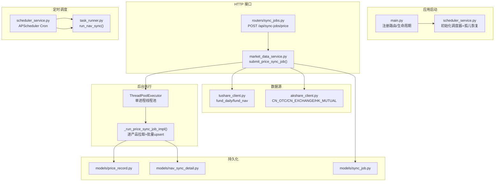
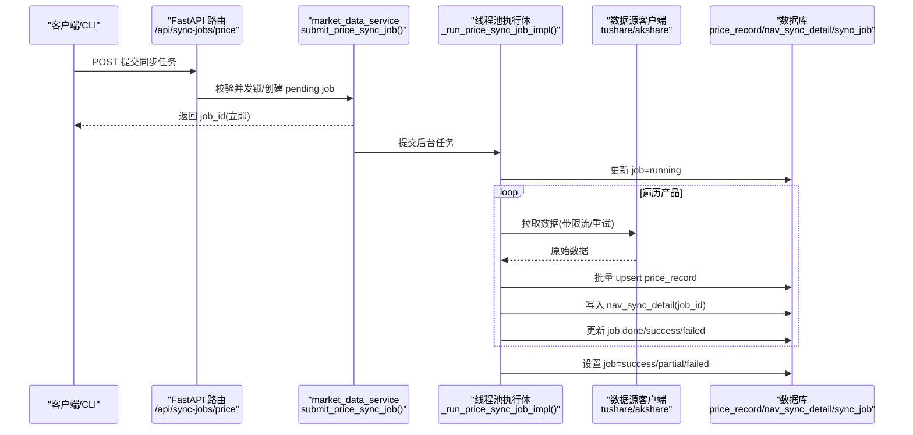
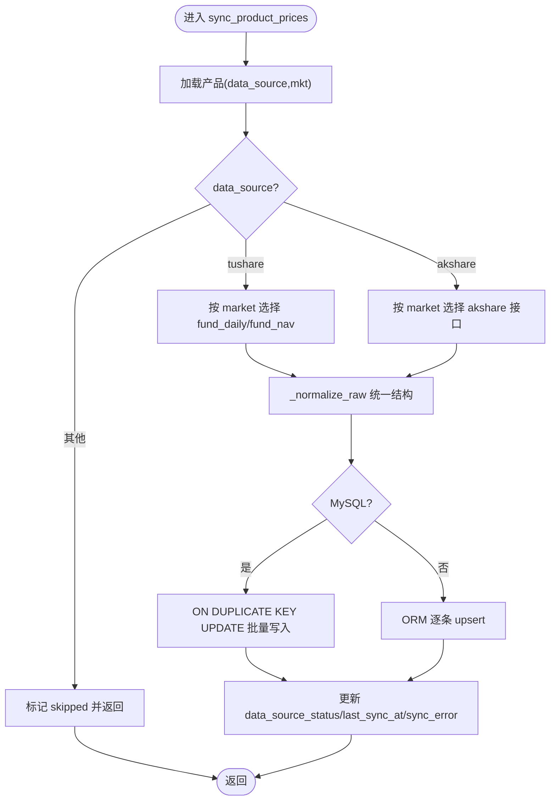
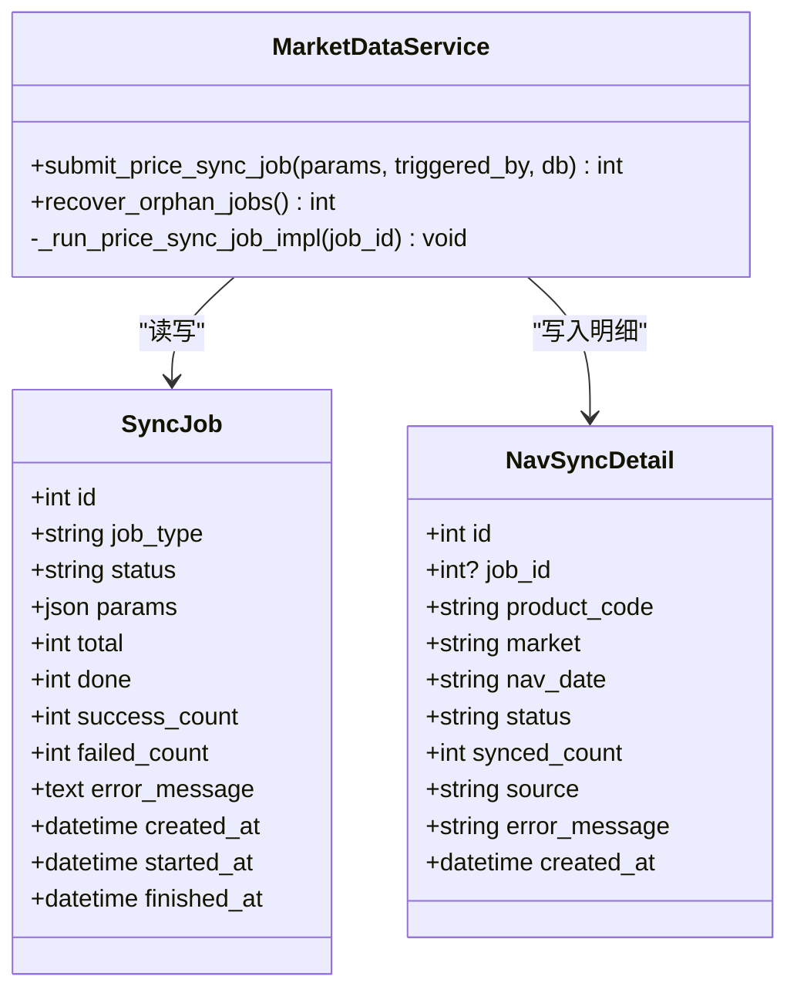
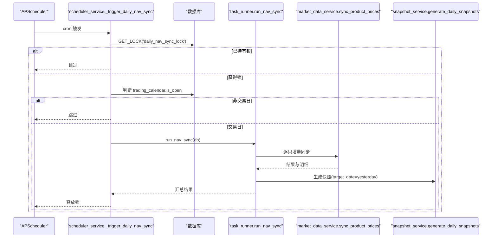
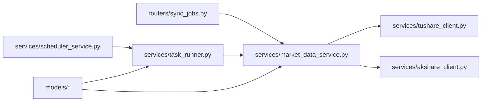

# 价格同步异步化系统

<cite>
**本文引用的文件**   
- [Docs/09-价格同步异步化改造需求.md](file://Docs/09-价格同步异步化改造需求.md)
- [backend/app/main.py](file://backend/app/main.py)
- [backend/app/config.py](file://backend/app/config.py)
- [backend/app/services/scheduler_service.py](file://backend/app/services/scheduler_service.py)
- [backend/app/services/market_data_service.py](file://backend/app/services/market_data_service.py)
- [backend/app/services/task_runner.py](file://backend/app/services/task_runner.py)
- [backend/app/services/tushare_client.py](file://backend/app/services/tushare_client.py)
- [backend/app/services/akshare_client.py](file://backend/app/services/akshare_client.py)
- [backend/app/models/sync_job.py](file://backend/app/models/sync_job.py)
- [backend/app/models/nav_sync_detail.py](file://backend/app/models/nav_sync_detail.py)
- [backend/app/models/price_record.py](file://backend/app/models/price_record.py)
- [backend/app/routers/sync_jobs.py](file://backend/app/routers/sync_jobs.py)
- [backend/app/schemas/sync_job.py](file://backend/app/schemas/sync_job.py)
- [backend/cli/commands/market_data.py](file://backend/cli/commands/market_data.py)
- [backend/cli/commands/sync_jobs.py](file://backend/cli/commands/sync_jobs.py)
- [backend/alembic/versions/0001_sync_job_and_nav_sync_detail_job_id.py](file://backend/alembic/versions/0001_sync_job_and_nav_sync_detail_job_id.py)
- [backend/tests/integration/test_sync_jobs_api.py](file://backend/tests/integration/test_sync_jobs_api.py)
</cite>

## 目录
1. [简介](#简介)
2. [项目结构](#项目结构)
3. [核心组件](#核心组件)
4. [架构总览](#架构总览)
5. [详细组件分析](#详细组件分析)
6. [依赖关系分析](#依赖关系分析)
7. [性能与限流](#性能与限流)
8. [故障排查指南](#故障排查指南)
9. [结论](#结论)
10. [附录](#附录)

## 简介
本文件围绕“价格同步异步化系统”的设计与实现进行系统化说明，覆盖后台任务、调度、数据源路由、批量写入、幂等与断点续传、可观测性与 CLI/API 交互等方面。目标是在不中断调用方的前提下，完成大规模历史回填与每日增量净值同步，并保证对 Tushare/AkShare 的限频合规与稳定重试。

## 项目结构
后端采用 FastAPI + SQLAlchemy 分层组织：
- 模型层：sync_job、nav_sync_detail、price_record 等
- 服务层：market_data_service（主编排）、task_runner（定时任务执行体）、scheduler_service（APScheduler 调度）、tushare_client/akshare_client（数据源）
- 路由层：sync_jobs（提交/查询任务）、tasks（现有任务入口）
- CLI：ir market sync-all / ir sync-job status/details
- 配置：config.py 提供限流、并发、调度开关等参数
- 迁移：新增 sync_job 表与 nav_sync_detail.job_id 字段

图表来源
- [backend/app/main.py:1-69](file://backend/app/main.py#L1-L69)
- [backend/app/services/scheduler_service.py:1-99](file://backend/app/services/scheduler_service.py#L1-L99)
- [backend/app/routers/sync_jobs.py:1-60](file://backend/app/routers/sync_jobs.py#L1-L60)
- [backend/app/services/market_data_service.py:357-545](file://backend/app/services/market_data_service.py#L357-L545)
- [backend/app/services/task_runner.py:68-176](file://backend/app/services/task_runner.py#L68-L176)
- [backend/app/services/tushare_client.py:157-242](file://backend/app/services/tushare_client.py#L157-L242)
- [backend/app/services/akshare_client.py:40-111](file://backend/app/services/akshare_client.py#L40-L111)
- [backend/app/models/price_record.py:1-28](file://backend/app/models/price_record.py#L1-L28)
- [backend/app/models/sync_job.py:1-23](file://backend/app/models/sync_job.py#L1-L23)
- [backend/app/models/nav_sync_detail.py:1-20](file://backend/app/models/nav_sync_detail.py#L1-L20)

章节来源
- [backend/app/main.py:1-69](file://backend/app/main.py#L1-L69)
- [backend/app/services/scheduler_service.py:1-99](file://backend/app/services/scheduler_service.py#L1-L99)
- [backend/app/routers/sync_jobs.py:1-60](file://backend/app/routers/sync_jobs.py#L1-L60)
- [backend/app/services/market_data_service.py:357-545](file://backend/app/services/market_data_service.py#L357-L545)
- [backend/app/services/task_runner.py:68-176](file://backend/app/services/task_runner.py#L68-L176)
- [backend/app/services/tushare_client.py:157-242](file://backend/app/services/tushare_client.py#L157-L242)
- [backend/app/services/akshare_client.py:40-111](file://backend/app/services/akshare_client.py#L40-L111)
- [backend/app/models/price_record.py:1-28](file://backend/app/models/price_record.py#L1-L28)
- [backend/app/models/sync_job.py:1-23](file://backend/app/models/sync_job.py#L1-L23)
- [backend/app/models/nav_sync_detail.py:1-20](file://backend/app/models/nav_sync_detail.py#L1-L20)

## 核心组件
- 后台任务与状态机
  - 提交接口：POST /api/sync-jobs/price，立即返回 job_id；同一时间仅允许一个 running 任务，冲突返回 409。
  - 任务状态：pending → running → success/partial/failed；启动时扫描孤儿 running 标记为 interrupted。
  - 进度与明细：job 记录 total/done/success_count/failed_count；明细复用 nav_sync_detail（新增 job_id）。
- 数据源路由与批量 upsert
  - 根据 product.data_source 选择 tushare 或 akshare；HK_MUTUAL 走 akshare。
  - 统一适配层将不同源数据归一化为 {trade_date, unit_price, accumulated_nav, pre_close, pct_change}。
  - MySQL 使用 ON DUPLICATE KEY UPDATE 实现幂等批量写入；SQLite 回退 ORM 更新。
- 限流与重试
  - Tushare：每次 API 调用前 sleep ≥0.3s（默认 0.5s），频率限制指数退避重试。
  - AkShare：独立 rate_interval 与重试策略，未安装时抛出明确错误。
- 定时调度
  - APScheduler 使用 MySQL JobStore 持久化；cron 默认 0 7 * * *；多进程互斥 GET_LOCK。
  - 触发 run_nav_sync：按交易日判断、增量起点 MAX(date)+1、target_date=yesterday(T)，随后生成快照并自动确认。
- CLI 与 API
  - CLI：ir market sync-all 提交后台任务；ir sync-job status/details 查询进度与明细。
  - API：提交/查询任务与明细；兼容现有 ir market sync（单产品同步）。

章节来源
- [backend/app/routers/sync_jobs.py:1-60](file://backend/app/routers/sync_jobs.py#L1-L60)
- [backend/app/services/market_data_service.py:88-261](file://backend/app/services/market_data_service.py#L88-L261)
- [backend/app/services/market_data_service.py:357-545](file://backend/app/services/market_data_service.py#L357-L545)
- [backend/app/services/tushare_client.py:51-89](file://backend/app/services/tushare_client.py#L51-L89)
- [backend/app/services/akshare_client.py:20-38](file://backend/app/services/akshare_client.py#L20-L38)
- [backend/app/services/scheduler_service.py:16-99](file://backend/app/services/scheduler_service.py#L16-L99)
- [backend/cli/commands/market_data.py:84-113](file://backend/cli/commands/market_data.py#L84-L113)
- [backend/cli/commands/sync_jobs.py:1-37](file://backend/cli/commands/sync_jobs.py#L1-L37)

## 架构总览
整体由“HTTP 提交 → 后台线程池执行 → 数据源拉取 → 批量 upsert → 状态/明细落库”构成；同时存在“APScheduler 定时触发 → run_nav_sync → 增量同步 + 快照生成”的并行路径。

图表来源
- [backend/app/routers/sync_jobs.py:14-31](file://backend/app/routers/sync_jobs.py#L14-L31)
- [backend/app/services/market_data_service.py:384-416](file://backend/app/services/market_data_service.py#L384-L416)
- [backend/app/services/market_data_service.py:419-527](file://backend/app/services/market_data_service.py#L419-L527)
- [backend/app/services/tushare_client.py:157-242](file://backend/app/services/tushare_client.py#L157-L242)
- [backend/app/services/akshare_client.py:40-111](file://backend/app/services/akshare_client.py#L40-L111)
- [backend/app/models/price_record.py:1-28](file://backend/app/models/price_record.py#L1-L28)
- [backend/app/models/nav_sync_detail.py:1-20](file://backend/app/models/nav_sync_detail.py#L1-L20)
- [backend/app/models/sync_job.py:1-23](file://backend/app/models/sync_job.py#L1-L23)

## 详细组件分析

### 数据源路由与批量写入
- 路由决策
  - data_source=tushare：CN_EXCHANGE→fund_daily；CN_OTC→fund_nav；HK_MUTUAL→跳过（tushare 不支持）。
  - data_source=akshare：CN_OTC→get_fund_nav_otc；CN_EXCHANGE→get_fund_daily_exchange；HK_MUTUAL→get_fund_hk_mutual。
- 统一适配
  - _normalize_raw 将不同源映射到统一结构，便于后续批量写入。
- 批量 upsert
  - MySQL：ON DUPLICATE KEY UPDATE 基于 uix_price_record(product_code, market, date)。
  - SQLite：ORM 查询后更新或插入。

图表来源
- [backend/app/services/market_data_service.py:88-161](file://backend/app/services/market_data_service.py#L88-L161)
- [backend/app/services/market_data_service.py:189-260](file://backend/app/services/market_data_service.py#L189-L260)
- [backend/app/models/price_record.py:21-27](file://backend/app/models/price_record.py#L21-L27)

章节来源
- [backend/app/services/market_data_service.py:88-261](file://backend/app/services/market_data_service.py#L88-L261)
- [backend/app/models/price_record.py:1-28](file://backend/app/models/price_record.py#L1-L28)

### 后台任务编排与状态机
- 提交与并发控制
  - submit_price_sync_job 检查是否存在 running 任务，若存在抛 ConflictError（HTTP 409）。
  - 创建 pending job 后立即提交到线程池执行。
- 执行体
  - 每个线程独立 Session；按 scope/products 筛选产品；增量模式以 MAX(date)+1 为起点。
  - 每完成一个产品更新 done/success/failed 并写入 nav_sync_detail(job_id)。
  - 结束时根据成功情况设置 success/partial/failed。
- 孤儿恢复
  - recover_orphan_jobs 在启动时将 running 标记为 interrupted。

图表来源
- [backend/app/models/sync_job.py:1-23](file://backend/app/models/sync_job.py#L1-L23)
- [backend/app/models/nav_sync_detail.py:1-20](file://backend/app/models/nav_sync_detail.py#L1-L20)
- [backend/app/services/market_data_service.py:384-545](file://backend/app/services/market_data_service.py#L384-L545)

章节来源
- [backend/app/services/market_data_service.py:357-545](file://backend/app/services/market_data_service.py#L357-L545)
- [backend/app/models/sync_job.py:1-23](file://backend/app/models/sync_job.py#L1-L23)
- [backend/app/models/nav_sync_detail.py:1-20](file://backend/app/models/nav_sync_detail.py#L1-L20)

### 定时调度与快照串联
- 调度初始化
  - 应用启动时 init_scheduler 注册 cron 任务，使用 SQLAlchemyJobStore 持久化。
  - 启动时调用 recover_orphan_jobs 恢复孤儿任务。
- 触发逻辑
  - 通过 MySQL GET_LOCK 确保多进程互斥。
  - 当日非交易日则跳过；否则直接调用 run_nav_sync。
- run_nav_sync
  - 获取符合条件的产品列表（含 HK_MUTUAL 且 data_source ∈ {tushare, akshare}）。
  - 增量起点 MAX(date)+1，结束日期 yesterday(T)。
  - 逐只调用 sync_product_prices，写 nav_sync_detail。
  - 完成后调用快照生成与自动确认。

图表来源
- [backend/app/services/scheduler_service.py:16-99](file://backend/app/services/scheduler_service.py#L16-L99)
- [backend/app/services/task_runner.py:68-176](file://backend/app/services/task_runner.py#L68-L176)
- [backend/app/services/market_data_service.py:88-161](file://backend/app/services/market_data_service.py#L88-L161)

章节来源
- [backend/app/services/scheduler_service.py:16-99](file://backend/app/services/scheduler_service.py#L16-L99)
- [backend/app/services/task_runner.py:68-176](file://backend/app/services/task_runner.py#L68-L176)

### CLI 与 API 交互
- CLI
  - ir market sync-all：支持 --start-date/--end-date/--scope/--products，提交后台任务并返回 job_id。
  - ir sync-job status/details：查询任务状态与明细。
- API
  - POST /api/sync-jobs/price：提交任务，返回 job_id；已有 running 返回 409。
  - GET /api/sync-jobs/{id}：任务状态。
  - GET /api/sync-jobs/{id}/details：任务与明细。

章节来源
- [backend/cli/commands/market_data.py:84-113](file://backend/cli/commands/market_data.py#L84-L113)
- [backend/cli/commands/sync_jobs.py:1-37](file://backend/cli/commands/sync_jobs.py#L1-L37)
- [backend/app/routers/sync_jobs.py:14-59](file://backend/app/routers/sync_jobs.py#L14-L59)

### 数据模型与迁移
- 新增表 sync_job：记录任务类型、状态、参数、进度、错误信息、触发方式、时间戳。
- 扩展 nav_sync_detail：新增 job_id 外键与索引，用于关联后台任务明细。
- 迁移脚本：添加列、索引、外键，并对存量香港互认基金修正 market/data_source。

章节来源
- [backend/app/models/sync_job.py:1-23](file://backend/app/models/sync_job.py#L1-L23)
- [backend/app/models/nav_sync_detail.py:1-20](file://backend/app/models/nav_sync_detail.py#L1-L20)
- [backend/alembic/versions/0001_sync_job_and_nav_sync_detail_job_id.py:39-59](file://backend/alembic/versions/0001_sync_job_and_nav_sync_detail_job_id.py#L39-L59)

## 依赖关系分析
- 模块耦合
  - routers/sync_jobs 依赖 market_data_service 的提交接口与异常类型。
  - market_data_service 依赖 tushare_client/akshare_client 与 models。
  - scheduler_service 依赖 task_runner 与 database_url。
- 外部依赖
  - apscheduler（调度）、tushare（场内/场外）、akshare（可选，含香港互认基金）。
- 潜在循环
  - 当前无循环导入；各模块通过显式 import 解耦。

图表来源
- [backend/app/routers/sync_jobs.py:1-60](file://backend/app/routers/sync_jobs.py#L1-L60)
- [backend/app/services/market_data_service.py:1-545](file://backend/app/services/market_data_service.py#L1-L545)
- [backend/app/services/tushare_client.py:1-242](file://backend/app/services/tushare_client.py#L1-L242)
- [backend/app/services/akshare_client.py:1-111](file://backend/app/services/akshare_client.py#L1-L111)
- [backend/app/services/scheduler_service.py:1-99](file://backend/app/services/scheduler_service.py#L1-L99)
- [backend/app/services/task_runner.py:1-196](file://backend/app/services/task_runner.py#L1-L196)

章节来源
- [backend/app/routers/sync_jobs.py:1-60](file://backend/app/routers/sync_jobs.py#L1-L60)
- [backend/app/services/market_data_service.py:1-545](file://backend/app/services/market_data_service.py#L1-L545)
- [backend/app/services/scheduler_service.py:1-99](file://backend/app/services/scheduler_service.py#L1-L99)
- [backend/app/services/task_runner.py:1-196](file://backend/app/services/task_runner.py#L1-L196)

## 性能与限流
- 限流策略
  - Tushare：每次 API 调用前 sleep(tushare_rate_interval，默认 0.5s)；频率限制错误指数退避（10/30/60s）。
  - AkShare：独立 akshare_rate_interval（默认 1.0s）与指数退避。
- 批量写入
  - MySQL 使用 ON DUPLICATE KEY UPDATE 一次提交，避免逐条 add 的性能瓶颈。
- 并发与隔离
  - 单进程 ThreadPoolExecutor 承接长任务；每个线程独立 Session，避免共享会话问题。
  - 单 running 锁防止多 job 并行导致限频突破。
- 调度开销
  - APScheduler 使用线程池执行，避免阻塞主线程；JobStore 持久化，重启不丢。

章节来源
- [backend/app/services/tushare_client.py:51-89](file://backend/app/services/tushare_client.py#L51-L89)
- [backend/app/services/akshare_client.py:20-38](file://backend/app/services/akshare_client.py#L20-L38)
- [backend/app/services/market_data_service.py:212-260](file://backend/app/services/market_data_service.py#L212-L260)
- [backend/app/services/market_data_service.py:372-381](file://backend/app/services/market_data_service.py#L372-L381)
- [backend/app/services/scheduler_service.py:28-49](file://backend/app/services/scheduler_service.py#L28-L49)

## 故障排查指南
- 常见错误
  - 409 Conflict：已有价格同步任务在运行中，等待或查询现有 job。
  - 数据源未配置：Tushare token 缺失或 AkShare 未安装。
  - 非交易日：定时任务跳过，需确认交易日历是否同步。
- 定位方法
  - 查看 job 状态与错误消息：GET /api/sync-jobs/{id} 或 ir sync-job status <id>。
  - 查看明细：GET /api/sync-jobs/{id}/details 或 ir sync-job details <id>。
  - 检查孤儿任务：应用启动时会标记 interrupted，可在 UI/CLI 查看。
- 日志与监控
  - 调度器与任务执行体均有日志输出，关注 daily_nav_sync_lock 与失败堆栈。
  - 验证 price_record.source 是否为实际数据源（tushare/akshare）。

章节来源
- [backend/app/routers/sync_jobs.py:30-31](file://backend/app/routers/sync_jobs.py#L30-L31)
- [backend/app/services/tushare_client.py:31-38](file://backend/app/services/tushare_client.py#L31-L38)
- [backend/app/services/akshare_client.py:50-63](file://backend/app/services/akshare_client.py#L50-L63)
- [backend/app/services/scheduler_service.py:57-84](file://backend/app/services/scheduler_service.py#L57-L84)
- [backend/app/services/market_data_service.py:530-545](file://backend/app/services/market_data_service.py#L530-L545)

## 结论
本方案通过“后台任务 + 定时调度 + 数据源路由 + 批量 upsert + 限流重试”的组合，解决了历史回填超时、无异步承接、无限流保护与快照不完整等问题。系统在可观测性、幂等与断点续传方面具备良好基础，并为后续分红事件检测与并发优化预留了空间。

## 附录
- 验收要点
  - 提交即返回 job_id，后台持续写入；全量完成后 distinct(product_code, market)=123。
  - 限频 per-API-call 粒度 sleep≥0.3s；失败自动退避重试。
  - 增量以 MAX(date)+1 为起点，重跑幂等；孤儿 running 标记 interrupted。
  - 每日 07:00 触发，非交易日跳过；快照 target_date=yesterday(T)。
- 相关文档
  - 需求规格与评审决策见 Docs/09-价格同步异步化改造需求.md。

章节来源
- [Docs/09-价格同步异步化改造需求.md:297-313](file://Docs/09-价格同步异步化改造需求.md#L297-L313)
- [backend/tests/integration/test_sync_jobs_api.py:18-55](file://backend/tests/integration/test_sync_jobs_api.py#L18-L55)