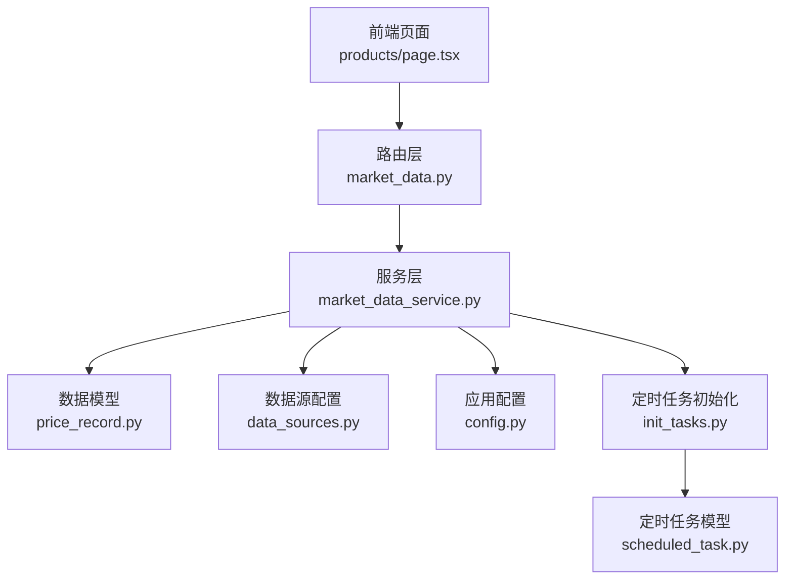
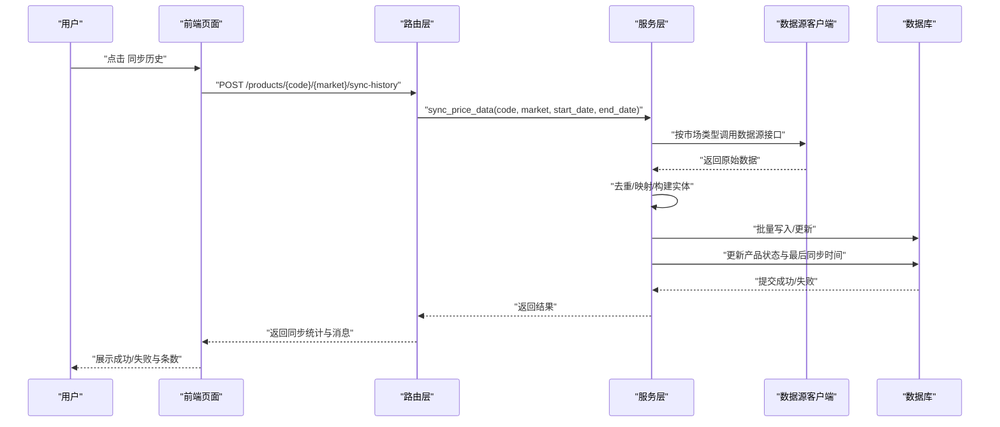
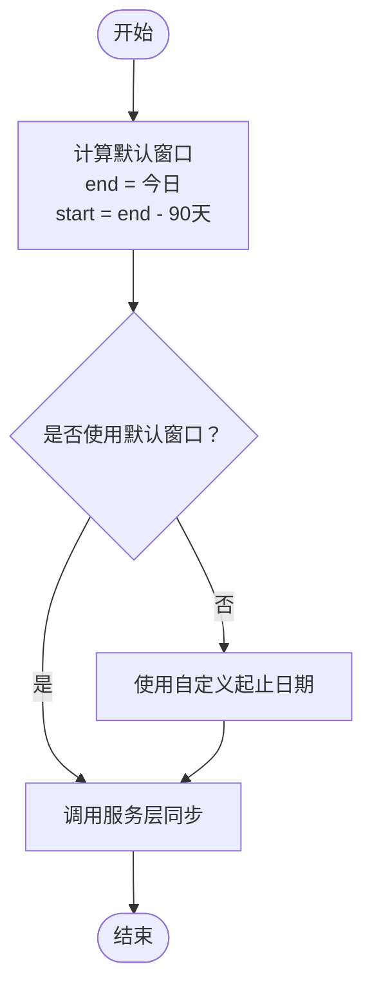
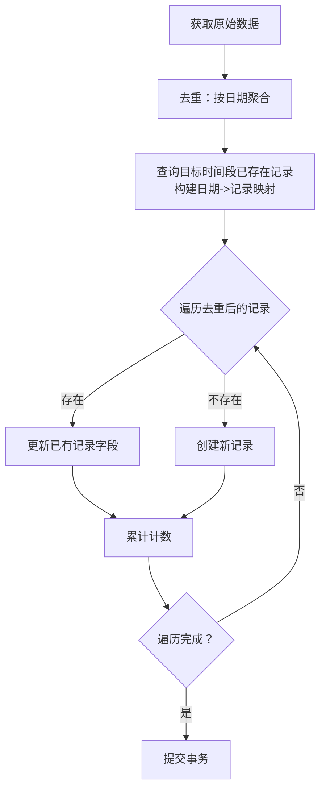
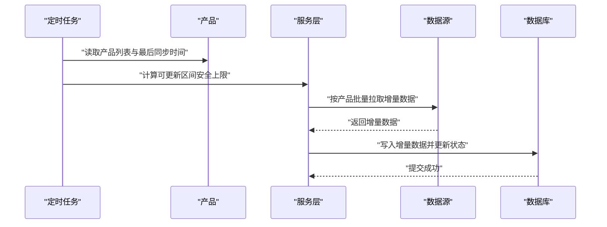
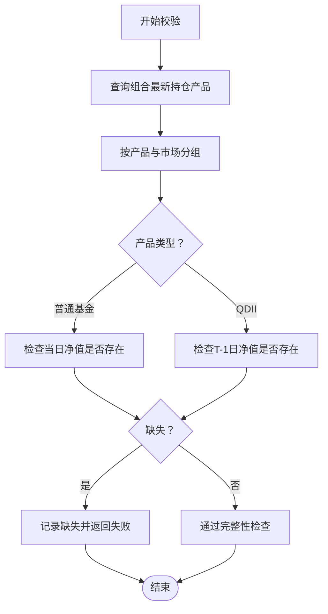
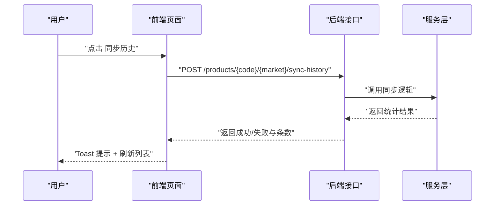
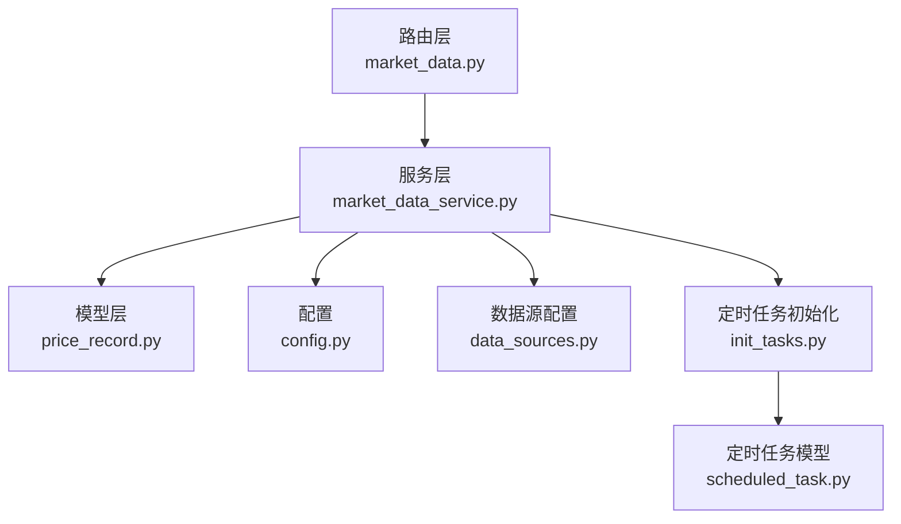

# 历史数据回补

<cite>
**本文引用的文件**
- [backend/app/routers/market_data.py](file://backend/app/routers/market_data.py)
- [backend/app/services/market_data_service.py](file://backend/app/services/market_data_service.py)
- [backend/app/models/price_record.py](file://backend/app/models/price_record.py)
- [backend/app/models/scheduled_task.py](file://backend/app/models/scheduled_task.py)
- [backend/app/init_tasks.py](file://backend/app/init_tasks.py)
- [backend/app/routers/data_sources.py](file://backend/app/routers/data_sources.py)
- [backend/app/config.py](file://backend/app/config.py)
- [frontend/src/app/products/page.tsx](file://frontend/src/app/products/page.tsx)
- [frontend/src/app/settings/tasks/page.tsx](file://frontend/src/app/settings/tasks/page.tsx)
- [Docs/03-业务流程设计.md](file://Docs/03-业务流程设计.md)
- [Docs/02-数据库设计.md](file://Docs/02-数据库设计.md)
- [Docs/07-日志系统设计.md](file://Docs/07-日志系统设计.md)
</cite>

## 目录
1. [简介](#简介)
2. [项目结构](#项目结构)
3. [核心组件](#核心组件)
4. [架构总览](#架构总览)
5. [详细组件分析](#详细组件分析)
6. [依赖分析](#依赖分析)
7. [性能考虑](#性能考虑)
8. [故障排查指南](#故障排查指南)
9. [结论](#结论)
10. [附录](#附录)

## 简介
本文件面向 InvestRing 的“历史数据回补”能力，系统化阐述历史数据获取策略、时间范围确定、批量处理与增量回补机制；详述历史数据的存储流程、数据验证与完整性检查；解释历史回补与实时同步的协调与优先级；并覆盖并发处理、进度跟踪、错误恢复策略，以及配置参数、性能优化与资源管理方案，并提供监控、日志分析与故障诊断方法。

## 项目结构
围绕历史数据回补的关键代码分布在后端服务层与前端交互层：
- 后端路由层：提供历史回补的 HTTP 接口，负责接收请求、设置默认时间窗口并调用服务层。
- 服务层：实现历史数据拉取、去重、批量写入、状态更新与异常处理。
- 数据模型层：定义价格记录表结构及唯一约束，确保幂等写入。
- 定时任务与初始化：定义核心定时任务（净值同步、交易日历同步、日志清理），保障增量回补的持续运行。
- 前端页面：提供“同步历史”按钮与进度反馈，调用后端接口并刷新视图。

**图表来源**
- [backend/app/routers/market_data.py:70-92](file://backend/app/routers/market_data.py#L70-L92)
- [backend/app/services/market_data_service.py:88-225](file://backend/app/services/market_data_service.py#L88-L225)
- [backend/app/models/price_record.py:5-27](file://backend/app/models/price_record.py#L5-L27)
- [backend/app/routers/data_sources.py:24-60](file://backend/app/routers/data_sources.py#L24-L60)
- [backend/app/config.py:5-36](file://backend/app/config.py#L5-L36)
- [backend/app/init_tasks.py:5-44](file://backend/app/init_tasks.py#L5-L44)
- [backend/app/models/scheduled_task.py:5-18](file://backend/app/models/scheduled_task.py#L5-L18)
- [frontend/src/app/products/page.tsx:160-212](file://frontend/src/app/products/page.tsx#L160-L212)

**章节来源**
- [backend/app/routers/market_data.py:1-112](file://backend/app/routers/market_data.py#L1-L112)
- [backend/app/services/market_data_service.py:1-323](file://backend/app/services/market_data_service.py#L1-L323)
- [backend/app/models/price_record.py:1-28](file://backend/app/models/price_record.py#L1-L28)
- [backend/app/routers/data_sources.py:1-150](file://backend/app/routers/data_sources.py#L1-L150)
- [backend/app/config.py:1-37](file://backend/app/config.py#L1-L37)
- [backend/app/init_tasks.py:1-45](file://backend/app/init_tasks.py#L1-L45)
- [backend/app/models/scheduled_task.py:1-19](file://backend/app/models/scheduled_task.py#L1-L19)
- [frontend/src/app/products/page.tsx:160-212](file://frontend/src/app/products/page.tsx#L160-L212)

## 核心组件
- 历史回补接口：提供“同步历史”入口，按默认 90 天窗口回补历史价格数据。
- 服务层同步逻辑：根据市场类型选择数据源接口，去重、批量写入、状态更新与异常回滚。
- 数据模型：价格记录表具备唯一约束，确保同产品/市场/日期的幂等写入。
- 定时任务：净值同步任务每日增量回补，交易日历与日志清理保障系统健康。
- 前端交互：用户点击“同步历史”，提交请求并展示结果；失败时提示检查数据源配置。

**章节来源**
- [backend/app/routers/market_data.py:70-92](file://backend/app/routers/market_data.py#L70-L92)
- [backend/app/services/market_data_service.py:88-225](file://backend/app/services/market_data_service.py#L88-L225)
- [backend/app/models/price_record.py:5-27](file://backend/app/models/price_record.py#L5-L27)
- [backend/app/init_tasks.py:5-44](file://backend/app/init_tasks.py#L5-L44)
- [frontend/src/app/products/page.tsx:160-212](file://frontend/src/app/products/page.tsx#L160-L212)

## 架构总览
历史数据回补采用“前端触发 + 后端服务 + 数据源 + 数据库存储”的分层架构。前端发起同步请求，路由层解析参数并调用服务层；服务层根据产品与市场类型调用数据源客户端，拉取原始数据后进行去重与批量写入；同时更新产品数据源状态与最后同步时间；异常时回滚并标记失败状态。

**图表来源**
- [backend/app/routers/market_data.py:70-92](file://backend/app/routers/market_data.py#L70-L92)
- [backend/app/services/market_data_service.py:88-225](file://backend/app/services/market_data_service.py#L88-L225)
- [backend/app/models/price_record.py:5-27](file://backend/app/models/price_record.py#L5-L27)

## 详细组件分析

### 时间范围确定与窗口策略
- 默认窗口：历史回补接口默认回补最近 90 天的历史数据，起止日期由当前日期与固定偏移计算得出。
- 可定制窗口：通用的价格数据同步接口支持显式传入起止日期，满足特定产品的回补需求。
- 增量策略：净值同步任务每日增量回补，基于产品最后同步时间与交易日历安全边界计算可更新区间。

**图表来源**
- [backend/app/routers/market_data.py:76-79](file://backend/app/routers/market_data.py#L76-L79)
- [backend/app/services/market_data_service.py:118-121](file://backend/app/services/market_data_service.py#L118-L121)

**章节来源**
- [backend/app/routers/market_data.py:70-92](file://backend/app/routers/market_data.py#L70-L92)
- [backend/app/services/market_data_service.py:88-121](file://backend/app/services/market_data_service.py#L88-L121)

### 批量处理与幂等写入
- 去重策略：对来自数据源的同一天多条记录进行去重，保留最后一条，避免重复写入。
- 批量写入：先查询目标时间段内已存在的记录，构建内存映射，遍历原始数据时优先更新已存在记录，否则新增记录，最后统一提交。
- 幂等约束：价格记录表对“产品代码 + 市场 + 日期”建立唯一约束，确保重复写入不会产生重复行。

**图表来源**
- [backend/app/services/market_data_service.py:147-209](file://backend/app/services/market_data_service.py#L147-L209)
- [backend/app/models/price_record.py:21-27](file://backend/app/models/price_record.py#L21-L27)

**章节来源**
- [backend/app/services/market_data_service.py:147-209](file://backend/app/services/market_data_service.py#L147-L209)
- [backend/app/models/price_record.py:21-27](file://backend/app/models/price_record.py#L21-L27)

### 增量回补机制与实时同步协调
- 增量同步：净值同步任务每日执行，基于产品最后同步时间与交易日历安全边界，仅回补未同步的日期区间。
- 协调与优先级：历史回补优先于增量同步，确保缺失的历史数据尽快补齐；增量同步在工作日自动执行，保持数据连续性。
- 交易日历：通过交易日历服务判断交易日，避免在非交易日写入无效数据。

**图表来源**
- [Docs/03-业务流程设计.md:1428-1463](file://Docs/03-业务流程设计.md#L1428-L1463)
- [backend/app/init_tasks.py:14-33](file://backend/app/init_tasks.py#L14-L33)
- [backend/app/services/market_data_service.py:228-320](file://backend/app/services/market_data_service.py#L228-L320)

**章节来源**
- [Docs/03-业务流程设计.md:1428-1463](file://Docs/03-业务流程设计.md#L1428-L1463)
- [backend/app/init_tasks.py:14-33](file://backend/app/init_tasks.py#L14-L33)
- [backend/app/services/market_data_service.py:228-320](file://backend/app/services/market_data_service.py#L228-L320)

### 存储流程、数据验证与完整性检查
- 存储流程：服务层将原始数据映射为价格记录实体，按日期维度进行去重与批量写入，最后更新产品数据源状态与最后同步时间。
- 数据验证：在生成组合快照前，会对所需净值数据进行完整性检查，区分普通基金与 QDII 基金的校验规则（普通基金校验当日净值，QDII 校验 T-1 日净值）。
- 完整性检查：若缺失关键净值，返回失败状态与具体缺失清单，便于人工干预或二次回补。

**图表来源**
- [backend/app/services/snapshot_service.py:622-693](file://backend/app/services/snapshot_service.py#L622-L693)
- [Docs/03-业务流程设计.md:1904-1925](file://Docs/03-业务流程设计.md#L1904-L1925)

**章节来源**
- [backend/app/services/market_data_service.py:216-219](file://backend/app/services/market_data_service.py#L216-L219)
- [backend/app/services/snapshot_service.py:622-693](file://backend/app/services/snapshot_service.py#L622-L693)
- [Docs/03-业务流程设计.md:1904-1925](file://Docs/03-业务流程设计.md#L1904-L1925)

### 前端交互与进度反馈
- 历史回补入口：产品页面提供“同步历史”按钮，调用后端接口并展示成功/失败与同步条数。
- 失败提示：当数据源配置缺失或接口异常时，前端弹出错误提示，引导检查配置。
- 实时价格预览：提供最近 N 条价格记录的预览，辅助判断回补效果。

**图表来源**
- [frontend/src/app/products/page.tsx:160-212](file://frontend/src/app/products/page.tsx#L160-L212)
- [backend/app/routers/market_data.py:70-92](file://backend/app/routers/market_data.py#L70-L92)

**章节来源**
- [frontend/src/app/products/page.tsx:160-212](file://frontend/src/app/products/page.tsx#L160-L212)
- [frontend/src/app/settings/tasks/page.tsx:179-210](file://frontend/src/app/settings/tasks/page.tsx#L179-L210)

## 依赖分析
- 组件耦合：路由层仅负责参数解析与错误包装，核心逻辑集中在服务层；服务层依赖数据模型与数据源客户端；定时任务初始化确保核心任务存在。
- 外部依赖：Tushare 数据源（通过环境变量配置），交易日历服务（用于安全边界计算）。
- 索引与约束：价格记录表的唯一约束保证幂等写入；任务执行日志与净值同步明细表支持任务追踪与审计。

**图表来源**
- [backend/app/routers/market_data.py:1-14](file://backend/app/routers/market_data.py#L1-L14)
- [backend/app/services/market_data_service.py:1-12](file://backend/app/services/market_data_service.py#L1-L12)
- [backend/app/models/price_record.py:1-2](file://backend/app/models/price_record.py#L1-L2)
- [backend/app/config.py:1-36](file://backend/app/config.py#L1-L36)
- [backend/app/routers/data_sources.py:1-11](file://backend/app/routers/data_sources.py#L1-L11)
- [backend/app/init_tasks.py:1-13](file://backend/app/init_tasks.py#L1-L13)
- [backend/app/models/scheduled_task.py:1-6](file://backend/app/models/scheduled_task.py#L1-L6)

**章节来源**
- [backend/app/routers/market_data.py:1-14](file://backend/app/routers/market_data.py#L1-L14)
- [backend/app/services/market_data_service.py:1-12](file://backend/app/services/market_data_service.py#L1-L12)
- [backend/app/models/price_record.py:1-2](file://backend/app/models/price_record.py#L1-L2)
- [backend/app/config.py:1-36](file://backend/app/config.py#L1-L36)
- [backend/app/routers/data_sources.py:1-11](file://backend/app/routers/data_sources.py#L1-L11)
- [backend/app/init_tasks.py:1-13](file://backend/app/init_tasks.py#L1-L13)
- [backend/app/models/scheduled_task.py:1-6](file://backend/app/models/scheduled_task.py#L1-L6)

## 性能考虑
- 批量写入：一次性查询目标时间段内已存在记录，构建内存映射，降低多次查询开销；遍历原始数据时按日期匹配，减少数据库往返。
- 去重策略：在内存中按日期去重，避免重复写入与唯一约束冲突带来的额外开销。
- 事务粒度：统一提交事务，减少频繁提交造成的锁竞争与日志开销。
- API 限流：参考业务流程设计中的 Tushare 限流规则（约 200 次/分钟），在批量拉取时控制调用频率，必要时增加延迟以避免限流。
- 索引优化：价格记录表对产品代码、市场、日期建立唯一约束；任务执行日志与净值同步明细表建立相应索引，提升查询与审计效率。

**章节来源**
- [backend/app/services/market_data_service.py:147-209](file://backend/app/services/market_data_service.py#L147-L209)
- [Docs/03-业务流程设计.md:1451-1462](file://Docs/03-业务流程设计.md#L1451-L1462)
- [Docs/02-数据库设计.md:731-767](file://Docs/02-数据库设计.md#L731-L767)
- [Docs/02-数据库设计.md:843-882](file://Docs/02-数据库设计.md#L843-L882)

## 故障排查指南
- 数据源配置缺失：若 Tushare Token 未配置，历史回补会失败。前端会提示检查数据源配置；可在数据源配置页面更新 Token 或启用其他数据源。
- 写入异常：服务层捕获写入异常并回滚事务，同时将产品数据源状态标记为失败；检查数据库连接、权限与唯一约束冲突。
- 任务执行日志：通过任务执行日志表查看任务状态、开始/结束时间、耗时与失败详情；净值同步明细表记录每只产品的同步状态与错误信息。
- 前端反馈：同步历史成功后会显示“已同步 X 条”，失败时弹出错误提示；可结合后端日志进一步定位问题。

**章节来源**
- [backend/app/routers/data_sources.py:24-60](file://backend/app/routers/data_sources.py#L24-L60)
- [backend/app/services/market_data_service.py:210-214](file://backend/app/services/market_data_service.py#L210-L214)
- [Docs/07-日志系统设计.md:159-182](file://Docs/07-日志系统设计.md#L159-L182)
- [frontend/src/app/products/page.tsx:171-177](file://frontend/src/app/products/page.tsx#L171-L177)

## 结论
InvestRing 的历史数据回补通过“前端触发 + 后端服务 + 数据源 + 数据库存储”的清晰分层，实现了稳定、可追溯且可扩展的历史数据补齐能力。默认 90 天窗口与可定制窗口满足不同产品需求；去重与批量写入确保高效与幂等；完整性检查与任务日志为质量与可观测性提供保障。配合每日增量同步与交易日历安全边界，系统在保证实时性的同时兼顾历史数据的完整性。

## 附录

### 历史回补配置参数
- 数据源配置
  - Tushare Token：通过环境变量配置，前端可查看与更新。
  - AkShare 启用状态：通过环境变量控制。
- 应用配置
  - 数据库连接：主机、端口、用户名、密码、库名与连接串。
  - 调试模式：开启/关闭调试输出。
- 定时任务
  - 净值同步：工作日 07:00 执行。
  - 交易日历同步：每年 1 月 1 日 02:00 执行。
  - 日志清理：每周日 04:00 执行。

**章节来源**
- [backend/app/routers/data_sources.py:24-60](file://backend/app/routers/data_sources.py#L24-L60)
- [backend/app/config.py:5-36](file://backend/app/config.py#L5-L36)
- [backend/app/init_tasks.py:14-33](file://backend/app/init_tasks.py#L14-L33)

### 监控与日志
- 任务执行日志：记录任务代码、触发方式、状态、耗时、记录总数、成功/失败数与错误信息。
- 净值同步明细：记录每只产品的同步日期、状态、净值、来源与错误信息。
- 前端任务执行历史：展示最近任务执行记录，支持状态高亮与排序。

**章节来源**
- [Docs/07-日志系统设计.md:159-182](file://Docs/07-日志系统设计.md#L159-L182)
- [frontend/src/app/settings/tasks/page.tsx:179-210](file://frontend/src/app/settings/tasks/page.tsx#L179-L210)