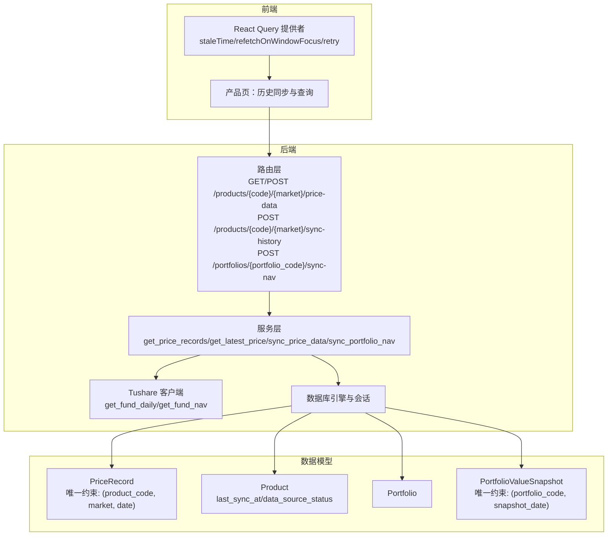
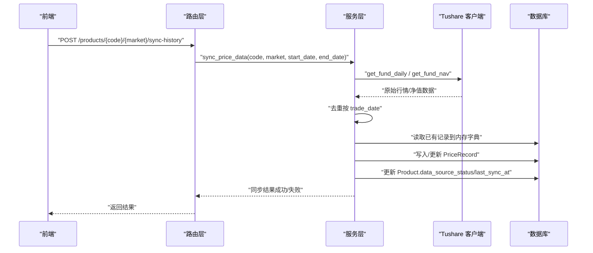
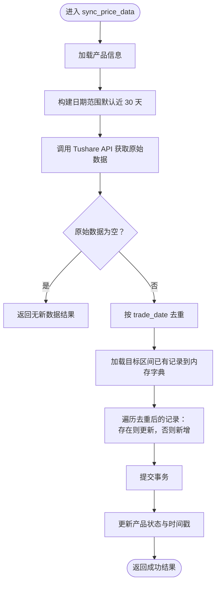
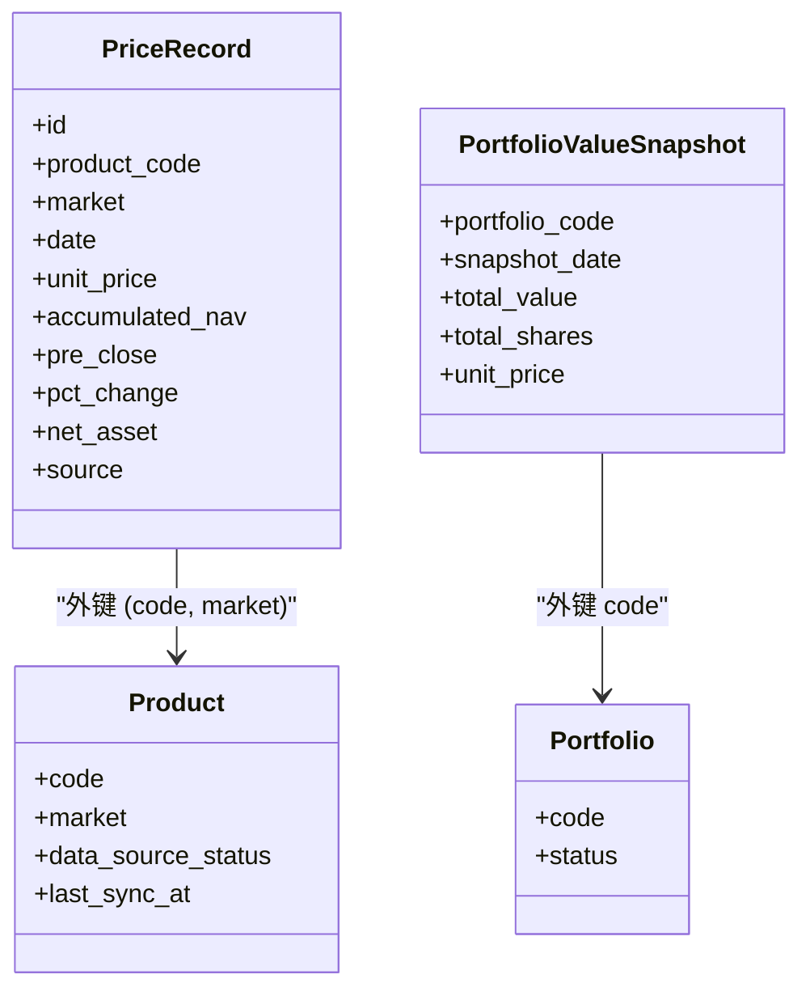
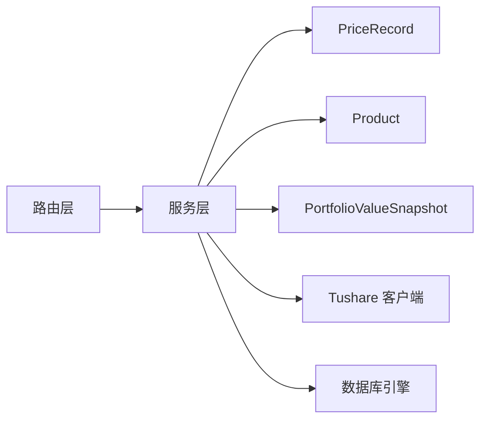

# 实时数据同步

<cite>
**本文引用的文件**
- [backend/app/services/market_data_service.py](file://backend/app/services/market_data_service.py)
- [backend/app/routers/market_data.py](file://backend/app/routers/market_data.py)
- [backend/app/schemas/market_data.py](file://backend/app/schemas/market_data.py)
- [backend/app/services/tushare_client.py](file://backend/app/services/tushare_client.py)
- [backend/app/models/price_record.py](file://backend/app/models/price_record.py)
- [backend/app/models/product.py](file://backend/app/models/product.py)
- [backend/app/models/portfolio.py](file://backend/app/models/portfolio.py)
- [backend/app/models/portfolio_value_snapshot.py](file://backend/app/models/portfolio_value_snapshot.py)
- [backend/app/models/scheduled_task.py](file://backend/app/models/scheduled_task.py)
- [backend/app/models/task_execution_log.py](file://backend/app/models/task_execution_log.py)
- [backend/app/database.py](file://backend/app/database.py)
- [backend/app/config.py](file://backend/app/config.py)
- [frontend/src/app/products/page.tsx](file://frontend/src/app/products/page.tsx)
- [frontend/src/app/providers.tsx](file://frontend/src/app/providers.tsx)
- [Docs/04-后端开发.md](file://Docs/04-后端开发.md)
- [Docs/07-日志系统设计.md](file://Docs/07-日志系统设计.md)
- [Docs/02-数据库设计.md](file://Docs/02-数据库设计.md)
</cite>

## 目录
1. [简介](#简介)
2. [项目结构](#项目结构)
3. [核心组件](#核心组件)
4. [架构总览](#架构总览)
5. [详细组件分析](#详细组件分析)
6. [依赖分析](#依赖分析)
7. [性能考虑](#性能考虑)
8. [故障排查指南](#故障排查指南)
9. [结论](#结论)
10. [附录](#附录)

## 简介
本文件面向 InvestRing 的“实时数据同步”能力，聚焦于价格数据的获取、存储、去重与冲突处理、同步策略与更新频率、缓存与内存管理、监控与告警以及故障恢复流程。同时给出配置项、调试方法与性能调优建议，帮助开发者与运维人员正确理解与维护该能力。

## 项目结构
围绕实时数据同步的关键模块分布如下：
- 后端服务层：负责同步逻辑、数据去重与写入、组合净值计算
- 接口层：提供查询与同步的 REST API
- 数据模型层：定义价格记录、产品、组合、快照等核心实体
- 数据源客户端：封装第三方数据源（Tushare）访问与重试
- 前端：提供产品价格查询与历史同步入口，配合缓存策略提升体验
- 定时任务与日志：支撑增量同步与可观测性

图表来源
- [backend/app/routers/market_data.py:17-112](file://backend/app/routers/market_data.py#L17-L112)
- [backend/app/services/market_data_service.py:15-323](file://backend/app/services/market_data_service.py#L15-L323)
- [backend/app/services/tushare_client.py:123-222](file://backend/app/services/tushare_client.py#L123-L222)
- [backend/app/models/price_record.py:5-28](file://backend/app/models/price_record.py#L5-L28)
- [backend/app/models/product.py:5-22](file://backend/app/models/product.py#L5-L22)
- [backend/app/models/portfolio.py:5-16](file://backend/app/models/portfolio.py#L5-L16)
- [backend/app/models/portfolio_value_snapshot.py:5-20](file://backend/app/models/portfolio_value_snapshot.py#L5-L20)

章节来源
- [backend/app/routers/market_data.py:1-112](file://backend/app/routers/market_data.py#L1-L112)
- [backend/app/services/market_data_service.py:1-323](file://backend/app/services/market_data_service.py#L1-L323)
- [backend/app/services/tushare_client.py:1-222](file://backend/app/services/tushare_client.py#L1-L222)
- [backend/app/models/price_record.py:1-28](file://backend/app/models/price_record.py#L1-L28)
- [backend/app/models/product.py:1-22](file://backend/app/models/product.py#L1-L22)
- [backend/app/models/portfolio.py:1-16](file://backend/app/models/portfolio.py#L1-L16)
- [backend/app/models/portfolio_value_snapshot.py:1-20](file://backend/app/models/portfolio_value_snapshot.py#L1-L20)

## 核心组件
- 价格记录模型：定义价格数据字段与唯一约束，确保按产品+市场+日期的幂等写入
- 产品模型：记录数据源状态、最近同步时间，用于增量同步与健康检查
- 组合与快照：组合净值计算依赖最新价格与当日快照，支持快速更新
- 同步服务：统一的价格数据拉取、去重、写入与状态更新
- 接口路由：提供查询与同步 API，支持历史区间同步与组合净值同步
- Tushare 客户端：封装 API 调用与指数回退重试
- 前端缓存：通过 React Query 的 staleTime、refetchOnWindowFocus、retry 控制缓存与刷新

章节来源
- [backend/app/models/price_record.py:5-28](file://backend/app/models/price_record.py#L5-L28)
- [backend/app/models/product.py:5-22](file://backend/app/models/product.py#L5-L22)
- [backend/app/models/portfolio_value_snapshot.py:5-20](file://backend/app/models/portfolio_value_snapshot.py#L5-L20)
- [backend/app/services/market_data_service.py:88-226](file://backend/app/services/market_data_service.py#L88-L226)
- [backend/app/routers/market_data.py:17-112](file://backend/app/routers/market_data.py#L17-L112)
- [backend/app/services/tushare_client.py:123-222](file://backend/app/services/tushare_client.py#L123-L222)
- [frontend/src/app/providers.tsx:8-19](file://frontend/src/app/providers.tsx#L8-L19)

## 架构总览
实时数据同步由“前端触发 + 后端服务 + 第三方数据源 + 数据库存储”构成闭环。前端通过查询接口获取历史价格，通过同步接口触发增量或历史同步；后端根据产品与市场类型调用 Tushare API，进行去重与写入，并更新产品状态；组合净值通过服务层重新计算并写入快照表。

图表来源
- [backend/app/routers/market_data.py:70-92](file://backend/app/routers/market_data.py#L70-L92)
- [backend/app/services/market_data_service.py:88-226](file://backend/app/services/market_data_service.py#L88-L226)
- [backend/app/services/tushare_client.py:123-222](file://backend/app/services/tushare_client.py#L123-L222)

## 详细组件分析

### 1) 触发机制与更新频率
- 触发方式
  - 历史同步：前端点击“同步历史”触发，后端默认拉取过去 90 天的数据
  - 组合净值同步：前端触发组合净值更新，后端按持仓与最新价格重新计算
- 更新频率
  - 历史同步：按需触发，适合补录或修复
  - 增量同步：结合定时任务“净值同步”，工作日 07:00 增量同步各产品从上次同步日到昨日的数据
  - 前端查询：默认返回最近 30 条，staleTime 5 分钟，避免频繁请求

章节来源
- [backend/app/routers/market_data.py:70-92](file://backend/app/routers/market_data.py#L70-L92)
- [backend/app/routers/market_data.py:17-41](file://backend/app/routers/market_data.py#L17-L41)
- [frontend/src/app/products/page.tsx:160-200](file://frontend/src/app/products/page.tsx#L160-L200)
- [frontend/src/app/providers.tsx:8-19](file://frontend/src/app/providers.tsx#L8-L19)
- [Docs/07-日志系统设计.md:99-121](file://Docs/07-日志系统设计.md#L99-L121)

### 2) 数据获取与去重
- 数据源选择：根据产品市场类型调用不同接口
  - 场内（CN_EXCHANGE）：获取日线行情（包含前收、涨跌幅等）
  - 场外（CN_OTC）：获取净值数据（含单位净值、累计净值）
- 去重策略：以 trade_date 为键去重，保留最后一条记录
- 写入策略：先加载目标区间的已有记录到内存字典，逐条对比更新或新增，最后统一提交

图表来源
- [backend/app/services/market_data_service.py:88-226](file://backend/app/services/market_data_service.py#L88-L226)

章节来源
- [backend/app/services/market_data_service.py:88-226](file://backend/app/services/market_data_service.py#L88-L226)
- [backend/app/services/tushare_client.py:123-222](file://backend/app/services/tushare_client.py#L123-L222)

### 3) 存储流程与冲突处理
- 存储表
  - 价格记录：PriceRecord，唯一约束为 (product_code, market, date)
  - 产品：Product，记录 data_source_status、last_sync_at 等
  - 组合快照：PortfolioValueSnapshot，唯一约束为 (portfolio_code, snapshot_date)
- 冲突处理
  - 写入前加载已有记录到内存字典，按日期覆盖更新，避免并发写入冲突
  - 唯一约束保障幂等，重复写入不会产生重复行
  - 异常回滚：写入异常时回滚事务并将产品状态置为 failed

章节来源
- [backend/app/models/price_record.py:5-28](file://backend/app/models/price_record.py#L5-L28)
- [backend/app/models/product.py:5-22](file://backend/app/models/product.py#L5-L22)
- [backend/app/models/portfolio_value_snapshot.py:5-20](file://backend/app/models/portfolio_value_snapshot.py#L5-L20)
- [backend/app/services/market_data_service.py:155-214](file://backend/app/services/market_data_service.py#L155-L214)

### 4) 实时同步与其他同步方式的区别
- 实时同步（按需触发）
  - 面向修复、补录与临时需求，灵活可控
  - 适合小范围、短时间窗口的数据修正
- 增量同步（定时任务）
  - 工作日自动执行，基于 Product.last_sync_at 增量拉取
  - 降低人工干预，保证数据连续性
- 历史同步（接口触发）
  - 默认 90 天窗口，适合首次建仓或大规模补录

章节来源
- [backend/app/routers/market_data.py:70-92](file://backend/app/routers/market_data.py#L70-L92)
- [Docs/07-日志系统设计.md:99-121](file://Docs/07-日志系统设计.md#L99-L121)

### 5) 缓存策略与内存管理
- 前端缓存
  - React Query 默认 staleTime 30 秒，针对其他查询设置 5 分钟
  - refetchOnWindowFocus 关闭，减少不必要的刷新
  - retry 1 次，平衡稳定性与性能
- 后端缓存
  - 在内存中构建“已有记录”的字典映射，避免多次数据库查询
  - 使用连接池与预热，降低数据库压力

章节来源
- [frontend/src/app/providers.tsx:8-19](file://frontend/src/app/providers.tsx#L8-L19)
- [backend/app/services/market_data_service.py:157-166](file://backend/app/services/market_data_service.py#L157-L166)
- [backend/app/database.py:8-16](file://backend/app/database.py#L8-L16)

### 6) 组合净值的实时计算与快照
- 实时计算（前端展示）
  - 可用现金实时计算公式：基于最新快照现金 + 当日确认流入 - 确认流出 - 待确认买入 + 确认卖出
  - 说明：现金进出即时生效，但快照汇总仍需等待每日生成
- 快照生成
  - 支持“快速更新”生成今日快照
  - 支持区间重算与删除指定日期快照，便于修复

章节来源
- [Docs/04-后端开发.md:271-308](file://Docs/04-后端开发.md#L271-L308)
- [frontend/src/app/portfolio/[code]/snapshots/page.tsx](file://frontend/src/app/portfolio/[code]/snapshots/page.tsx#L64-L155)

### 7) API 与数据模型
- 查询价格数据
  - GET /products/{code}/{market}/price-data
  - 支持 start_date、end_date、limit 参数
- 同步价格数据
  - POST /products/{code}/{market}/sync-history：默认 90 天
  - POST /products/{code}/{market}/sync-price-data：可指定日期范围
- 同步组合净值
  - POST /portfolios/{portfolio_code}/sync-nav

图表来源
- [backend/app/models/price_record.py:5-28](file://backend/app/models/price_record.py#L5-L28)
- [backend/app/models/product.py:5-22](file://backend/app/models/product.py#L5-L22)
- [backend/app/models/portfolio.py:5-16](file://backend/app/models/portfolio.py#L5-L16)
- [backend/app/models/portfolio_value_snapshot.py:5-20](file://backend/app/models/portfolio_value_snapshot.py#L5-L20)

章节来源
- [backend/app/routers/market_data.py:17-112](file://backend/app/routers/market_data.py#L17-L112)
- [backend/app/schemas/market_data.py:6-19](file://backend/app/schemas/market_data.py#L6-L19)
- [backend/app/models/price_record.py:5-28](file://backend/app/models/price_record.py#L5-L28)
- [backend/app/models/product.py:5-22](file://backend/app/models/product.py#L5-L22)
- [backend/app/models/portfolio.py:5-16](file://backend/app/models/portfolio.py#L5-L16)
- [backend/app/models/portfolio_value_snapshot.py:5-20](file://backend/app/models/portfolio_value_snapshot.py#L5-L20)

## 依赖分析
- 组件耦合
  - 路由层依赖服务层；服务层依赖数据模型与 Tushare 客户端
  - 服务层与数据库交互，受连接池与唯一约束影响
- 外部依赖
  - Tushare API：提供行情与净值数据，具备指数回退重试
- 潜在风险
  - 唯一约束冲突：通过内存字典与事务控制避免
  - 前端缓存一致性：通过 staleTime 与手动刷新控制

图表来源
- [backend/app/routers/market_data.py:1-112](file://backend/app/routers/market_data.py#L1-L112)
- [backend/app/services/market_data_service.py:1-323](file://backend/app/services/market_data_service.py#L1-L323)
- [backend/app/services/tushare_client.py:1-222](file://backend/app/services/tushare_client.py#L1-L222)
- [backend/app/models/price_record.py:1-28](file://backend/app/models/price_record.py#L1-L28)
- [backend/app/models/product.py:1-22](file://backend/app/models/product.py#L1-L22)
- [backend/app/models/portfolio_value_snapshot.py:1-20](file://backend/app/models/portfolio_value_snapshot.py#L1-L20)

章节来源
- [backend/app/routers/market_data.py:1-112](file://backend/app/routers/market_data.py#L1-L112)
- [backend/app/services/market_data_service.py:1-323](file://backend/app/services/market_data_service.py#L1-L323)
- [backend/app/services/tushare_client.py:1-222](file://backend/app/services/tushare_client.py#L1-L222)

## 性能考虑
- 数据库连接池
  - 连接池大小与回收策略已在数据库配置中设定，建议结合业务峰值评估
- 内存去重与批量写入
  - 服务层在内存中构建已有记录映射，减少多次查询
  - 事务一次性提交，降低锁竞争
- 前端缓存
  - 合理设置 staleTime 与 retry，避免过度请求
- 增量同步
  - 工作日定时增量同步，避免高峰时段大量请求

章节来源
- [backend/app/database.py:8-16](file://backend/app/database.py#L8-L16)
- [backend/app/services/market_data_service.py:157-214](file://backend/app/services/market_data_service.py#L157-L214)
- [frontend/src/app/providers.tsx:8-19](file://frontend/src/app/providers.tsx#L8-L19)
- [Docs/07-日志系统设计.md:99-121](file://Docs/07-日志系统设计.md#L99-L121)

## 故障排查指南
- 常见问题
  - 数据源未配置：Tushare token 未配置将抛出未配置错误
  - API 调用失败：TushareAPIError，包含重试与指数回退
  - 写入异常：事务回滚并更新产品状态为 failed
  - 产品不存在：抛出参数错误
- 监控与日志
  - 定时任务表记录任务状态、下次执行时间
  - 任务执行日志记录执行时长、成功/失败计数与错误信息
  - 净值同步明细日志用于审计与复盘
- 告警与恢复
  - 产品状态为 failed 时，需检查数据源配置与网络
  - 通过“快速更新”或“历史同步”恢复快照与净值
  - 日志清理策略定期清理过期日志，避免磁盘压力

章节来源
- [backend/app/services/tushare_client.py:13-46](file://backend/app/services/tushare_client.py#L13-L46)
- [backend/app/services/market_data_service.py:135-138](file://backend/app/services/market_data_service.py#L135-L138)
- [backend/app/services/market_data_service.py:210-214](file://backend/app/services/market_data_service.py#L210-L214)
- [backend/app/models/scheduled_task.py:1-19](file://backend/app/models/scheduled_task.py#L1-L19)
- [backend/app/models/task_execution_log.py:1-21](file://backend/app/models/task_execution_log.py#L1-L21)
- [Docs/07-日志系统设计.md:427-487](file://Docs/07-日志系统设计.md#L427-L487)

## 结论
InvestRing 的实时数据同步以“按需触发 + 增量定时 + 历史补录”三位一体的方式运行，结合前端缓存与后端去重、唯一约束与事务控制，形成稳定可靠的价格数据与组合净值体系。通过完善的监控与日志清理策略，能够有效支撑生产环境的持续运营与快速恢复。

## 附录

### A. 配置选项
- 应用配置（示例关键项）
  - 数据库连接：主机、端口、用户名、密码、库名、URL
  - 安全：密钥、Token 过期天数
  - Tushare：Token
  - 调试：是否输出 SQL
- 前端缓存配置
  - 默认查询 staleTime 30 秒
  - 特定查询设置 5 分钟
  - retry 1 次

章节来源
- [backend/app/config.py:5-37](file://backend/app/config.py#L5-L37)
- [frontend/src/app/providers.tsx:8-19](file://frontend/src/app/providers.tsx#L8-L19)

### B. 调试方法
- 后端
  - 检查 Product.data_source_status 与 last_sync_at
  - 查看任务执行日志与任务表状态
  - 使用历史同步接口快速补录
- 前端
  - 使用产品页“同步历史”触发同步
  - 检查查询缓存是否命中与过期

章节来源
- [backend/app/models/product.py:5-22](file://backend/app/models/product.py#L5-L22)
- [backend/app/models/task_execution_log.py:1-21](file://backend/app/models/task_execution_log.py#L1-L21)
- [backend/app/routers/market_data.py:70-92](file://backend/app/routers/market_data.py#L70-L92)
- [frontend/src/app/products/page.tsx:160-200](file://frontend/src/app/products/page.tsx#L160-L200)

### C. 性能调优建议
- 数据库
  - 根据并发与峰值调整连接池大小与回收时间
  - 确保产品与日期维度的索引满足查询与去重需求
- 后端
  - 控制每次同步的时间窗口，避免过大批次
  - 保持内存字典规模合理，避免 OOM
- 前端
  - 合理设置 staleTime，避免频繁刷新
  - 对高频查询增加本地节流

章节来源
- [backend/app/database.py:8-16](file://backend/app/database.py#L8-L16)
- [backend/app/services/market_data_service.py:157-214](file://backend/app/services/market_data_service.py#L157-L214)
- [frontend/src/app/providers.tsx:8-19](file://frontend/src/app/providers.tsx#L8-L19)